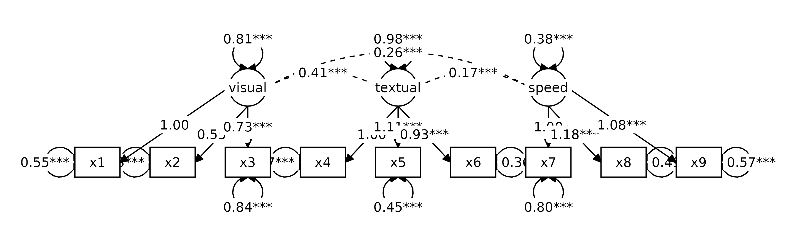
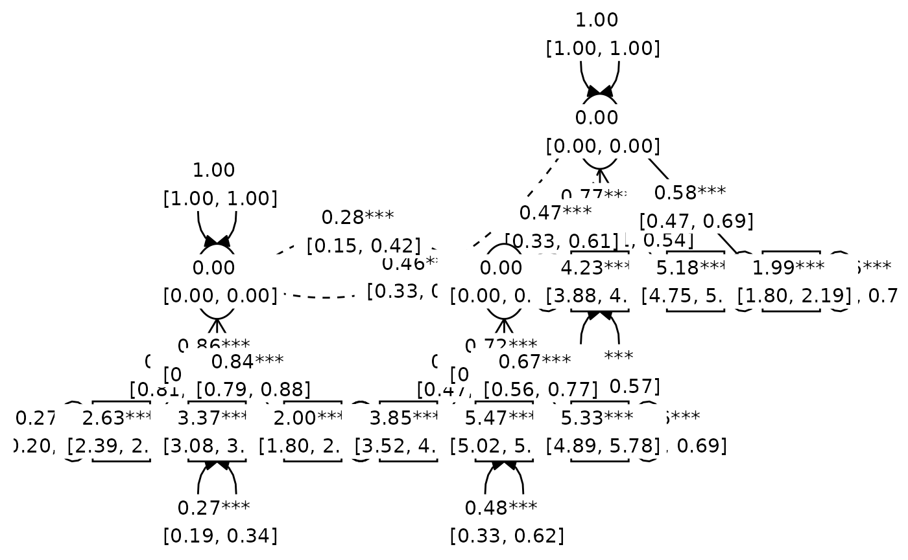
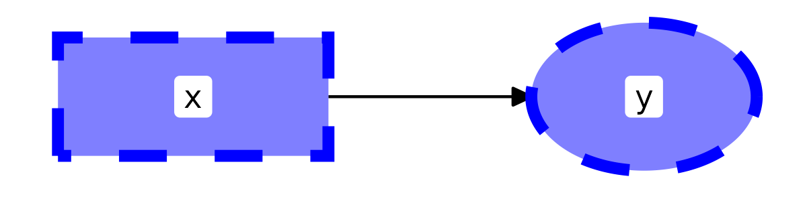
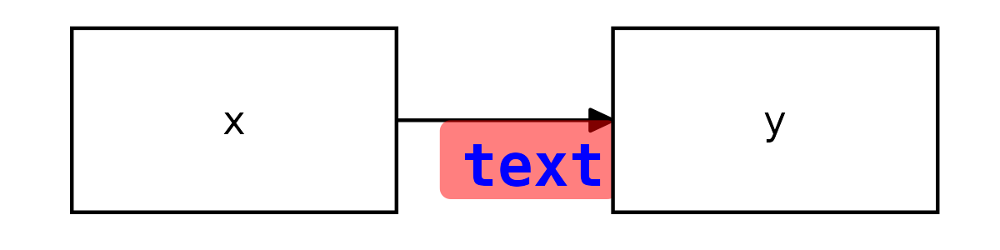
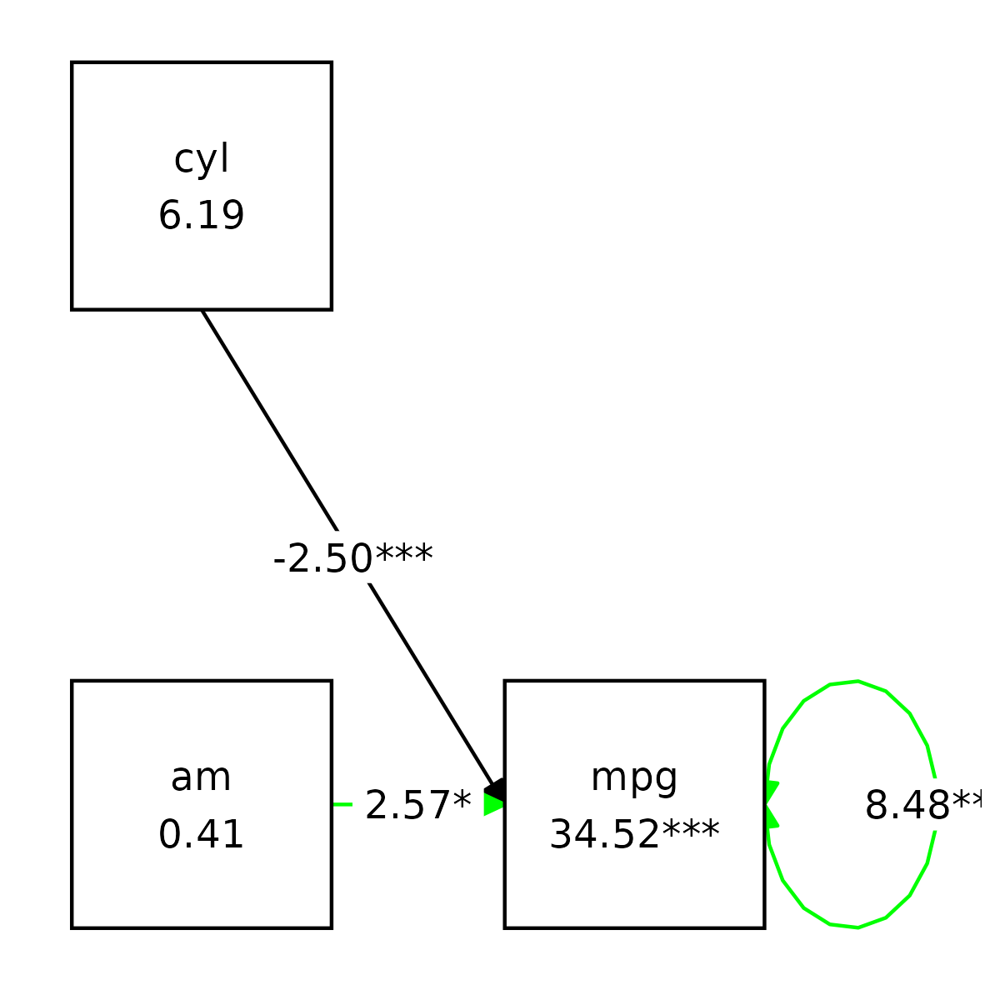
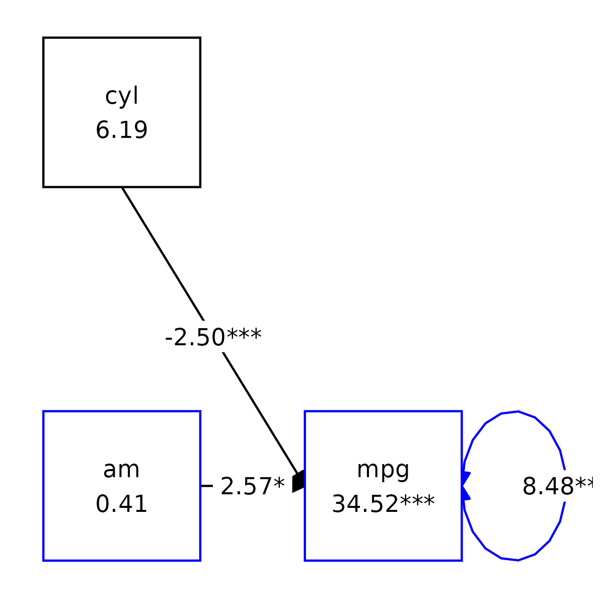

# Plotting graphs for structural equation models

`tidySEM` offers a user-friendly, tidy workflow for plotting graphs for
SEM models. The workflow is largely *programmatic*, meaning that graphs
are created mostly automatically from the output of an analysis. At the
same time, all elements of the graph are stored as `data.frame`s, which
allows swift and easy customization of graphics, and artistic freedom.
Some existing graphing packages automatically create a layout, but are
very difficult to customize. Particularly for complex SEM models, it may
be preferable to make the layout by hand, including only nodes one
wishes to plot, and reporting the rest in a comprehensive table of
coefficients (e.g., one obtained through
[`table_results()`](https://cjvanlissa.github.io/tidySEM/reference/table_results.md).

For users wholly unfamiliar with SEM graphs, I recommend reading the
[vignette about SEM graphing
conventions](https://cjvanlissa.github.io/tidySEM/articles/sem_graph.html)
first.

Let’s load the required packages:

``` r
library(tidySEM)
library(lavaan)
library(ggplot2)
library(dplyr)
```

## The tidySEM workflow

The workflow underlying graphing in `tidySEM` is as follows:

1.  Run an analysis, e.g., using
    [`lavaan::sem()`](https://rdrr.io/pkg/lavaan/man/sem.html) or
    [`MplusAutomation::mplusModeler()`](https://michaelhallquist.github.io/MplusAutomation/reference/mplusModeler.html),
    passing the output to an object, e.g., `fit`
2.  Plot the graph using the function `graph(fit)`, or customize the
    graph further by following the optional steps below.
3.  *Optionally* Examine what nodes and edges can be extracted from the
    fit model object, by running `get_nodes(fit)` and `get_edges(fit)`
4.  *Optionally* Specify a layout for the graph using
    [`get_layout()`](https://cjvanlissa.github.io/tidySEM/reference/get_layout.md)
5.  *Optionally*, prepare graph data before plotting, by running
    `prepare_graph(fit, layout)`. Store the resulting graph data in an
    object, e.g., `graph_data`
6.  *Optionally*, access the nodes and edges in `graph_data` using
    `nodes(graph_data)` and `edges(graph_data)`
7.  *Optionally*, modify the nodes and edges in `graph_data` using
    `nodes(graph_data) <- ...`and `edges(graph_data) <- ...`

This workflow ensures a high degree of transparency and customizability.
Objects returned by all functions are “tidy” data, i.e., tabular
`data.frames`, and can be modified using the familiar suite of functions
in the ‘tidyverse’.

## Example: Graphing a CFA

### Step 1: Run an analysis

As an example, let’s make a graph for a classic `lavaan` tutorial
example for CFA. First, we conduct the SEM analysis:

``` r
library(lavaan)
HS.model <- ' visual  =~ x1 + x2 + x3
              textual =~ x4 + x5 + x6
              speed   =~ x7 + x8 + x9 '
fit <- cfa(HS.model, data=HolzingerSwineford1939)
```

### Step 2: Plot the graph

At this point, we could simply plot the graph:

``` r
graph_sem(model = fit)
```


This uses a default layout, provided by the `igraph` package. However,
the node placement is not very aesthetically pleasing. One of the areas
where `tidySEM` really excels is customization. Because every aspect of
the graph is represented as tidy data (basically, a spreadsheet), it is
easy to move nodes around and create a custom layout.

### Optional step 3: Customizing the layout

In `tidySEM`, the layout is specified as a matrix (grid) with node names
and empty spaces (`NA` or `""`). There are essentially three ways to
specify the layout:

1.  Automatically, from the fit model
2.  Manually in R
3.  In a spreadsheet program

#### Automatically generate layout for a model

The example above used an automatically generated layout for the fit
model (`lavaan` or `Mplus`). If you open the help file for the function
by running
[`?graph_sem`](https://cjvanlissa.github.io/tidySEM/reference/graph_sem.md),
you can see that the default argument is
`layout = get_layout(x = model)`, where model refers to the `model`
argument of the same function.

The
[`get_layout()`](https://cjvanlissa.github.io/tidySEM/reference/get_layout.md)
function automatically generates a layout for a fit model object. To get
this layout as a matrix, you can run:

``` r
get_layout(fit)
#>      [,1] [,2]      [,3] [,4] [,5]    [,6]     [,7] [,8]
#> [1,] NA   NA        NA   NA   NA      "visual" NA   NA  
#> [2,] NA   "textual" NA   NA   "speed" "x1"     "x2" "x3"
#> [3,] "x4" "x5"      "x6" "x7" "x8"    "x9"     NA   NA  
#> attr(,"class")
#> [1] "layout_matrix" "matrix"        "array"
```

The
[`get_layout()`](https://cjvanlissa.github.io/tidySEM/reference/get_layout.md)
function relies on
[`igraph::layout_as_tree()`](https://r.igraph.org/reference/layout_as_tree.html)
to place the nodes. Other layout functions from the `igraph` package can
be used by specifying the `layout_algorithm = ...` argument:

``` r
get_layout(fit, layout_algorithm = "layout_in_circle")
#>      [,1] [,2]      [,3] [,4] [,5]    [,6]     [,7] [,8]
#> [1,] NA   NA        NA   NA   NA      "visual" NA   NA  
#> [2,] NA   "textual" NA   NA   "speed" "x1"     "x2" "x3"
#> [3,] "x4" "x5"      "x6" "x7" "x8"    "x9"     NA   NA  
#> attr(,"class")
#> [1] "layout_matrix" "matrix"        "array"
get_layout(fit, layout_algorithm = "layout_on_grid")
#>      [,1] [,2]      [,3] [,4] [,5]    [,6]     [,7] [,8]
#> [1,] NA   NA        NA   NA   NA      "visual" NA   NA  
#> [2,] NA   "textual" NA   NA   "speed" "x1"     "x2" "x3"
#> [3,] "x4" "x5"      "x6" "x7" "x8"    "x9"     NA   NA  
#> attr(,"class")
#> [1] "layout_matrix" "matrix"        "array"
```

#### Specifying layout manually in R

Manually specifying the layout can be done by providing node names and
empty spaces (`NA` or `""`), and the number of rows of the desired
layout matrix. For example:

``` r
get_layout("c", NA,  "d",
           NA,  "e", NA, rows = 2)
#>      [,1] [,2] [,3]
#> [1,] "c"  NA   "d" 
#> [2,] NA   "e"  NA  
#> attr(,"class")
#> [1] "layout_matrix" "matrix"        "array"
```

Of course, it is also possible to simply define a matrix using
[`matrix()`](https://rdrr.io/r/base/matrix.html).

#### Specifying layout in a spreadsheet program

Specifying the layout in a spreadsheet program is very user-friendly,
because one can visually position the nodes, e.g.:


To obtain the layout matrix, one can save the spreadsheet as `.csv` file
and load it in R like this:

``` r
read.csv("example.csv")
```

Alternatively, one can select the layout as in the image above, copy it
to the clipboard, and then read it into R from the clipboard. This works
differently on Windows and Mac.

On Windows, run:

``` r
read.table("clipboard", sep = "\t")
```

On Mac, run:

``` r
read.table(pipe("pbpaste"), sep="\t")
```

    #>   V1     V2 V3
    #> 1 x1     x2 x3
    #> 2    visual

### Examples of user-defined layout

We can specify a simple layout for two hypothetical nodes `x` and `y` is
generated as follows:

``` r
get_layout("x", "y", rows = 1)
#>      [,1] [,2]
#> [1,] "x"  "y" 
#> attr(,"class")
#> [1] "layout_matrix" "matrix"        "array"
```

For a mediation model, one might specify a layout like this:

``` r
get_layout("", "m", "",
           "x", "", "y", rows = 2)
#>      [,1] [,2] [,3]
#> [1,] ""   "m"  ""  
#> [2,] "x"  ""   "y" 
#> attr(,"class")
#> [1] "layout_matrix" "matrix"        "array"
```

For a three-item CFA model, one might specify:

``` r
get_layout("", "F", "",
           "y1", "y2", "y3", rows = 2)
#>      [,1] [,2] [,3]
#> [1,] ""   "F"  ""  
#> [2,] "y1" "y2" "y3"
#> attr(,"class")
#> [1] "layout_matrix" "matrix"        "array"
```

And for the CFA model we estimated above:

``` r
lay <- get_layout("", "", "visual","","textual","","speed","", "",
                  "x1", "x2", "x3", "x4", "x5", "x6", "x7", "x8", "x9", rows = 2)
```

We could plot the CFA model with this custom layout as follows:

``` r
graph_sem(fit, layout = lay)
```



### Step 4: Customize nodes and edges

For the simple model above, it is easy to verify the names of the nodes
and edges from the syntax above: The nodes consist of three latent
variables (visual, textual, and speed), and nine observed variables
(x1-x9). The edges are nine factor loadings - and three latent variable
correlations, included by default. We can confirm which nodes are
available by running
[`get_nodes()`](https://cjvanlissa.github.io/tidySEM/reference/get_nodes.md):

``` r
get_nodes(fit)
#>       name shape   label
#> 1   visual  oval  visual
#> 2  textual  oval textual
#> 3    speed  oval   speed
#> 4       x1  rect      x1
#> 5       x2  rect      x2
#> 6       x3  rect      x3
#> 7       x4  rect      x4
#> 8       x5  rect      x5
#> 9       x6  rect      x6
#> 10      x7  rect      x7
#> 11      x8  rect      x8
#> 12      x9  rect      x9
```

And for the edges:

``` r
get_edges(fit)
#>       from      to arrow   label connect_from connect_to curvature linetype
#> 1   visual      x1  last    1.00           NA         NA        NA        1
#> 2   visual      x2  last 0.55***           NA         NA        NA        1
#> 3   visual      x3  last 0.73***           NA         NA        NA        1
#> 4  textual      x4  last    1.00           NA         NA        NA        1
#> 5  textual      x5  last 1.11***           NA         NA        NA        1
#> 6  textual      x6  last 0.93***           NA         NA        NA        1
#> 7    speed      x7  last    1.00           NA         NA        NA        1
#> 8    speed      x8  last 1.18***           NA         NA        NA        1
#> 9    speed      x9  last 1.08***           NA         NA        NA        1
#> 10      x1      x1  both 0.55***           NA         NA        NA        1
#> 11      x2      x2  both 1.13***           NA         NA        NA        1
#> 12      x3      x3  both 0.84***           NA         NA        NA        1
#> 13      x4      x4  both 0.37***           NA         NA        NA        1
#> 14      x5      x5  both 0.45***           NA         NA        NA        1
#> 15      x6      x6  both 0.36***           NA         NA        NA        1
#> 16      x7      x7  both 0.80***           NA         NA        NA        1
#> 17      x8      x8  both 0.49***           NA         NA        NA        1
#> 18      x9      x9  both 0.57***           NA         NA        NA        1
#> 19  visual  visual  both 0.81***           NA         NA        NA        1
#> 20 textual textual  both 0.98***           NA         NA        NA        1
#> 21   speed   speed  both 0.38***           NA         NA        NA        1
#> 22  visual textual  none 0.41***           NA         NA        60        2
#> 23  visual   speed  none 0.26***           NA         NA        60        2
#> 24 textual   speed  none 0.17***           NA         NA        60        2
#>        lhs op     rhs  est   se pval      confint est_sig est_std se_std
#> 1   visual =~      x1 1.00 0.00 <NA> [1.00, 1.00]    1.00    0.77   0.05
#> 2   visual =~      x2 0.55 0.10 0.00 [0.36, 0.75] 0.55***    0.42   0.06
#> 3   visual =~      x3 0.73 0.11 0.00 [0.52, 0.94] 0.73***    0.58   0.06
#> 4  textual =~      x4 1.00 0.00 <NA> [1.00, 1.00]    1.00    0.85   0.02
#> 5  textual =~      x5 1.11 0.07 0.00 [0.98, 1.24] 1.11***    0.86   0.02
#> 6  textual =~      x6 0.93 0.06 0.00 [0.82, 1.03] 0.93***    0.84   0.02
#> 7    speed =~      x7 1.00 0.00 <NA> [1.00, 1.00]    1.00    0.57   0.05
#> 8    speed =~      x8 1.18 0.16 0.00 [0.86, 1.50] 1.18***    0.72   0.05
#> 9    speed =~      x9 1.08 0.15 0.00 [0.79, 1.38] 1.08***    0.67   0.05
#> 10      x1 ~~      x1 0.55 0.11 0.00 [0.33, 0.77] 0.55***    0.40   0.08
#> 11      x2 ~~      x2 1.13 0.10 0.00 [0.93, 1.33] 1.13***    0.82   0.05
#> 12      x3 ~~      x3 0.84 0.09 0.00 [0.67, 1.02] 0.84***    0.66   0.06
#> 13      x4 ~~      x4 0.37 0.05 0.00 [0.28, 0.46] 0.37***    0.27   0.04
#> 14      x5 ~~      x5 0.45 0.06 0.00 [0.33, 0.56] 0.45***    0.27   0.04
#> 15      x6 ~~      x6 0.36 0.04 0.00 [0.27, 0.44] 0.36***    0.30   0.04
#> 16      x7 ~~      x7 0.80 0.08 0.00 [0.64, 0.96] 0.80***    0.68   0.06
#> 17      x8 ~~      x8 0.49 0.07 0.00 [0.34, 0.63] 0.49***    0.48   0.07
#> 18      x9 ~~      x9 0.57 0.07 0.00 [0.43, 0.70] 0.57***    0.56   0.07
#> 19  visual ~~  visual 0.81 0.15 0.00 [0.52, 1.09] 0.81***    1.00   0.00
#> 20 textual ~~ textual 0.98 0.11 0.00 [0.76, 1.20] 0.98***    1.00   0.00
#> 21   speed ~~   speed 0.38 0.09 0.00 [0.21, 0.55] 0.38***    1.00   0.00
#> 22  visual ~~ textual 0.41 0.07 0.00 [0.26, 0.55] 0.41***    0.46   0.06
#> 23  visual ~~   speed 0.26 0.06 0.00 [0.15, 0.37] 0.26***    0.47   0.07
#> 24 textual ~~   speed 0.17 0.05 0.00 [0.08, 0.27] 0.17***    0.28   0.07
#>    pval_std  confint_std est_sig_std       label_results show
#> 1      0.00 [0.66, 0.88]     0.77***        visual.BY.x1 TRUE
#> 2      0.00 [0.31, 0.54]     0.42***        visual.BY.x2 TRUE
#> 3      0.00 [0.47, 0.69]     0.58***        visual.BY.x3 TRUE
#> 4      0.00 [0.81, 0.90]     0.85***       textual.BY.x4 TRUE
#> 5      0.00 [0.81, 0.90]     0.86***       textual.BY.x5 TRUE
#> 6      0.00 [0.79, 0.88]     0.84***       textual.BY.x6 TRUE
#> 7      0.00 [0.47, 0.67]     0.57***         speed.BY.x7 TRUE
#> 8      0.00 [0.62, 0.82]     0.72***         speed.BY.x8 TRUE
#> 9      0.00 [0.56, 0.77]     0.67***         speed.BY.x9 TRUE
#> 10     0.00 [0.24, 0.57]     0.40***        Variances.x1 TRUE
#> 11     0.00 [0.72, 0.92]     0.82***        Variances.x2 TRUE
#> 12     0.00 [0.54, 0.79]     0.66***        Variances.x3 TRUE
#> 13     0.00 [0.20, 0.35]     0.27***        Variances.x4 TRUE
#> 14     0.00 [0.19, 0.34]     0.27***        Variances.x5 TRUE
#> 15     0.00 [0.22, 0.37]     0.30***        Variances.x6 TRUE
#> 16     0.00 [0.56, 0.79]     0.68***        Variances.x7 TRUE
#> 17     0.00 [0.33, 0.62]     0.48***        Variances.x8 TRUE
#> 18     0.00 [0.42, 0.69]     0.56***        Variances.x9 TRUE
#> 19     <NA> [1.00, 1.00]        1.00    Variances.visual TRUE
#> 20     <NA> [1.00, 1.00]        1.00   Variances.textual TRUE
#> 21     <NA> [1.00, 1.00]        1.00     Variances.speed TRUE
#> 22     0.00 [0.33, 0.58]     0.46*** visual.WITH.textual TRUE
#> 23     0.00 [0.33, 0.61]     0.47***   visual.WITH.speed TRUE
#> 24     0.00 [0.15, 0.42]     0.28***  textual.WITH.speed TRUE
```

Note that only the first few columns are used for plotting
(specifically, `from`, `to`, `arrow`, `label`, `connect_from`,
`connect_to`, and `curvature`). The remaining columns correspond to the
output of `table_results(fit)`. These auxiliary columns can be used to
conditionally customize the graph (e.g., changing the color or linetype
for significant paths only).

#### Customizing node and edge labels

The
[`get_nodes()`](https://cjvanlissa.github.io/tidySEM/reference/get_nodes.md)
and
[`get_edges()`](https://cjvanlissa.github.io/tidySEM/reference/get_edges.md)
functions both call
[`table_results()`](https://cjvanlissa.github.io/tidySEM/reference/table_results.md)
on the fit model object to get information about the nodes and edges.
Both functions have a `label` argument which can either be a character
string referencing a column of the output of
[`table_results()`](https://cjvanlissa.github.io/tidySEM/reference/table_results.md),
or an expression that is evaluated in the context of that output.

This allows you to customize node and edge labels. For example, maybe
you want to combine the parameter estimate and its confidence interval
into an edge label:

``` r
get_edges(fit, label = paste(est, confint))
#>       from      to arrow             label connect_from connect_to curvature
#> 1   visual      x1  last 1.00 [1.00, 1.00]           NA         NA        NA
#> 2   visual      x2  last 0.55 [0.36, 0.75]           NA         NA        NA
#> 3   visual      x3  last 0.73 [0.52, 0.94]           NA         NA        NA
#> 4  textual      x4  last 1.00 [1.00, 1.00]           NA         NA        NA
#> 5  textual      x5  last 1.11 [0.98, 1.24]           NA         NA        NA
#> 6  textual      x6  last 0.93 [0.82, 1.03]           NA         NA        NA
#> 7    speed      x7  last 1.00 [1.00, 1.00]           NA         NA        NA
#> 8    speed      x8  last 1.18 [0.86, 1.50]           NA         NA        NA
#> 9    speed      x9  last 1.08 [0.79, 1.38]           NA         NA        NA
#> 10      x1      x1  both 0.55 [0.33, 0.77]           NA         NA        NA
#> 11      x2      x2  both 1.13 [0.93, 1.33]           NA         NA        NA
#> 12      x3      x3  both 0.84 [0.67, 1.02]           NA         NA        NA
#> 13      x4      x4  both 0.37 [0.28, 0.46]           NA         NA        NA
#> 14      x5      x5  both 0.45 [0.33, 0.56]           NA         NA        NA
#> 15      x6      x6  both 0.36 [0.27, 0.44]           NA         NA        NA
#> 16      x7      x7  both 0.80 [0.64, 0.96]           NA         NA        NA
#> 17      x8      x8  both 0.49 [0.34, 0.63]           NA         NA        NA
#> 18      x9      x9  both 0.57 [0.43, 0.70]           NA         NA        NA
#> 19  visual  visual  both 0.81 [0.52, 1.09]           NA         NA        NA
#> 20 textual textual  both 0.98 [0.76, 1.20]           NA         NA        NA
#> 21   speed   speed  both 0.38 [0.21, 0.55]           NA         NA        NA
#> 22  visual textual  none 0.41 [0.26, 0.55]           NA         NA        60
#> 23  visual   speed  none 0.26 [0.15, 0.37]           NA         NA        60
#> 24 textual   speed  none 0.17 [0.08, 0.27]           NA         NA        60
#>    linetype     lhs op     rhs  est   se pval      confint est_sig est_std
#> 1         1  visual =~      x1 1.00 0.00 <NA> [1.00, 1.00]    1.00    0.77
#> 2         1  visual =~      x2 0.55 0.10 0.00 [0.36, 0.75] 0.55***    0.42
#> 3         1  visual =~      x3 0.73 0.11 0.00 [0.52, 0.94] 0.73***    0.58
#> 4         1 textual =~      x4 1.00 0.00 <NA> [1.00, 1.00]    1.00    0.85
#> 5         1 textual =~      x5 1.11 0.07 0.00 [0.98, 1.24] 1.11***    0.86
#> 6         1 textual =~      x6 0.93 0.06 0.00 [0.82, 1.03] 0.93***    0.84
#> 7         1   speed =~      x7 1.00 0.00 <NA> [1.00, 1.00]    1.00    0.57
#> 8         1   speed =~      x8 1.18 0.16 0.00 [0.86, 1.50] 1.18***    0.72
#> 9         1   speed =~      x9 1.08 0.15 0.00 [0.79, 1.38] 1.08***    0.67
#> 10        1      x1 ~~      x1 0.55 0.11 0.00 [0.33, 0.77] 0.55***    0.40
#> 11        1      x2 ~~      x2 1.13 0.10 0.00 [0.93, 1.33] 1.13***    0.82
#> 12        1      x3 ~~      x3 0.84 0.09 0.00 [0.67, 1.02] 0.84***    0.66
#> 13        1      x4 ~~      x4 0.37 0.05 0.00 [0.28, 0.46] 0.37***    0.27
#> 14        1      x5 ~~      x5 0.45 0.06 0.00 [0.33, 0.56] 0.45***    0.27
#> 15        1      x6 ~~      x6 0.36 0.04 0.00 [0.27, 0.44] 0.36***    0.30
#> 16        1      x7 ~~      x7 0.80 0.08 0.00 [0.64, 0.96] 0.80***    0.68
#> 17        1      x8 ~~      x8 0.49 0.07 0.00 [0.34, 0.63] 0.49***    0.48
#> 18        1      x9 ~~      x9 0.57 0.07 0.00 [0.43, 0.70] 0.57***    0.56
#> 19        1  visual ~~  visual 0.81 0.15 0.00 [0.52, 1.09] 0.81***    1.00
#> 20        1 textual ~~ textual 0.98 0.11 0.00 [0.76, 1.20] 0.98***    1.00
#> 21        1   speed ~~   speed 0.38 0.09 0.00 [0.21, 0.55] 0.38***    1.00
#> 22        2  visual ~~ textual 0.41 0.07 0.00 [0.26, 0.55] 0.41***    0.46
#> 23        2  visual ~~   speed 0.26 0.06 0.00 [0.15, 0.37] 0.26***    0.47
#> 24        2 textual ~~   speed 0.17 0.05 0.00 [0.08, 0.27] 0.17***    0.28
#>    se_std pval_std  confint_std est_sig_std       label_results show
#> 1    0.05     0.00 [0.66, 0.88]     0.77***        visual.BY.x1 TRUE
#> 2    0.06     0.00 [0.31, 0.54]     0.42***        visual.BY.x2 TRUE
#> 3    0.06     0.00 [0.47, 0.69]     0.58***        visual.BY.x3 TRUE
#> 4    0.02     0.00 [0.81, 0.90]     0.85***       textual.BY.x4 TRUE
#> 5    0.02     0.00 [0.81, 0.90]     0.86***       textual.BY.x5 TRUE
#> 6    0.02     0.00 [0.79, 0.88]     0.84***       textual.BY.x6 TRUE
#> 7    0.05     0.00 [0.47, 0.67]     0.57***         speed.BY.x7 TRUE
#> 8    0.05     0.00 [0.62, 0.82]     0.72***         speed.BY.x8 TRUE
#> 9    0.05     0.00 [0.56, 0.77]     0.67***         speed.BY.x9 TRUE
#> 10   0.08     0.00 [0.24, 0.57]     0.40***        Variances.x1 TRUE
#> 11   0.05     0.00 [0.72, 0.92]     0.82***        Variances.x2 TRUE
#> 12   0.06     0.00 [0.54, 0.79]     0.66***        Variances.x3 TRUE
#> 13   0.04     0.00 [0.20, 0.35]     0.27***        Variances.x4 TRUE
#> 14   0.04     0.00 [0.19, 0.34]     0.27***        Variances.x5 TRUE
#> 15   0.04     0.00 [0.22, 0.37]     0.30***        Variances.x6 TRUE
#> 16   0.06     0.00 [0.56, 0.79]     0.68***        Variances.x7 TRUE
#> 17   0.07     0.00 [0.33, 0.62]     0.48***        Variances.x8 TRUE
#> 18   0.07     0.00 [0.42, 0.69]     0.56***        Variances.x9 TRUE
#> 19   0.00     <NA> [1.00, 1.00]        1.00    Variances.visual TRUE
#> 20   0.00     <NA> [1.00, 1.00]        1.00   Variances.textual TRUE
#> 21   0.00     <NA> [1.00, 1.00]        1.00     Variances.speed TRUE
#> 22   0.06     0.00 [0.33, 0.58]     0.46*** visual.WITH.textual TRUE
#> 23   0.07     0.00 [0.33, 0.61]     0.47***   visual.WITH.speed TRUE
#> 24   0.07     0.00 [0.15, 0.42]     0.28***  textual.WITH.speed TRUE
```

We can do the same for the nodes, but note that in the previous `lavaan`
model, the mean structure was **not** part of the model. As the nodes
represent means and intercepts,
[`table_results()`](https://cjvanlissa.github.io/tidySEM/reference/table_results.md)
will not retrieve any parameter estimates for the nodes when the mean
structure is not part of the model. In absence of additional information
about the nodes,
[`get_nodes()`](https://cjvanlissa.github.io/tidySEM/reference/get_nodes.md)
will use the node name as a label.To remove all node labels, specify
`label = NULL`.

We can re-run the model with a mean structure to get more information
about the nodes:

``` r
fit <- cfa(HS.model, data=HolzingerSwineford1939, meanstructure = TRUE)
```

Running
[`get_nodes()`](https://cjvanlissa.github.io/tidySEM/reference/get_nodes.md)
now uses the estimated means in the label:

``` r
get_nodes(fit)
#>       name shape         label     lhs op rhs  est   se pval      confint
#> 1    speed  oval   speed\n0.00   speed ~1     0.00 0.00 <NA> [0.00, 0.00]
#> 2  textual  oval textual\n0.00 textual ~1     0.00 0.00 <NA> [0.00, 0.00]
#> 3   visual  oval  visual\n0.00  visual ~1     0.00 0.00 <NA> [0.00, 0.00]
#> 4       x1  rect   x1\n4.94***      x1 ~1     4.94 0.07 0.00 [4.80, 5.07]
#> 5       x2  rect   x2\n6.09***      x2 ~1     6.09 0.07 0.00 [5.96, 6.22]
#> 6       x3  rect   x3\n2.25***      x3 ~1     2.25 0.07 0.00 [2.12, 2.38]
#> 7       x4  rect   x4\n3.06***      x4 ~1     3.06 0.07 0.00 [2.93, 3.19]
#> 8       x5  rect   x5\n4.34***      x5 ~1     4.34 0.07 0.00 [4.19, 4.49]
#> 9       x6  rect   x6\n2.19***      x6 ~1     2.19 0.06 0.00 [2.06, 2.31]
#> 10      x7  rect   x7\n4.19***      x7 ~1     4.19 0.06 0.00 [4.06, 4.31]
#> 11      x8  rect   x8\n5.53***      x8 ~1     5.53 0.06 0.00 [5.41, 5.64]
#> 12      x9  rect   x9\n5.37***      x9 ~1     5.37 0.06 0.00 [5.26, 5.49]
#>    est_sig est_std se_std pval_std  confint_std est_sig_std label_results
#> 1     0.00    0.00   0.00     <NA> [0.00, 0.00]        0.00   Means.speed
#> 2     0.00    0.00   0.00     <NA> [0.00, 0.00]        0.00 Means.textual
#> 3     0.00    0.00   0.00     <NA> [0.00, 0.00]        0.00  Means.visual
#> 4  4.94***    4.23   0.18     0.00 [3.88, 4.59]     4.23***      Means.x1
#> 5  6.09***    5.18   0.22     0.00 [4.75, 5.61]     5.18***      Means.x2
#> 6  2.25***    1.99   0.10     0.00 [1.80, 2.19]     1.99***      Means.x3
#> 7  3.06***    2.63   0.12     0.00 [2.39, 2.87]     2.63***      Means.x4
#> 8  4.34***    3.37   0.15     0.00 [3.08, 3.66]     3.37***      Means.x5
#> 9  2.19***    2.00   0.10     0.00 [1.80, 2.19]     2.00***      Means.x6
#> 10 4.19***    3.85   0.17     0.00 [3.52, 4.18]     3.85***      Means.x7
#> 11 5.53***    5.47   0.23     0.00 [5.02, 5.92]     5.47***      Means.x8
#> 12 5.37***    5.33   0.22     0.00 [4.89, 5.78]     5.33***      Means.x9
```

These labels can be further customized as shown below:

``` r
get_nodes(fit, label = paste0(name, "\n", est, " ", confint))
#>       name shape                      label     lhs op rhs  est   se pval
#> 1    speed  oval   speed\n0.00 [0.00, 0.00]   speed ~1     0.00 0.00 <NA>
#> 2  textual  oval textual\n0.00 [0.00, 0.00] textual ~1     0.00 0.00 <NA>
#> 3   visual  oval  visual\n0.00 [0.00, 0.00]  visual ~1     0.00 0.00 <NA>
#> 4       x1  rect      x1\n4.94 [4.80, 5.07]      x1 ~1     4.94 0.07 0.00
#> 5       x2  rect      x2\n6.09 [5.96, 6.22]      x2 ~1     6.09 0.07 0.00
#> 6       x3  rect      x3\n2.25 [2.12, 2.38]      x3 ~1     2.25 0.07 0.00
#> 7       x4  rect      x4\n3.06 [2.93, 3.19]      x4 ~1     3.06 0.07 0.00
#> 8       x5  rect      x5\n4.34 [4.19, 4.49]      x5 ~1     4.34 0.07 0.00
#> 9       x6  rect      x6\n2.19 [2.06, 2.31]      x6 ~1     2.19 0.06 0.00
#> 10      x7  rect      x7\n4.19 [4.06, 4.31]      x7 ~1     4.19 0.06 0.00
#> 11      x8  rect      x8\n5.53 [5.41, 5.64]      x8 ~1     5.53 0.06 0.00
#> 12      x9  rect      x9\n5.37 [5.26, 5.49]      x9 ~1     5.37 0.06 0.00
#>         confint est_sig est_std se_std pval_std  confint_std est_sig_std
#> 1  [0.00, 0.00]    0.00    0.00   0.00     <NA> [0.00, 0.00]        0.00
#> 2  [0.00, 0.00]    0.00    0.00   0.00     <NA> [0.00, 0.00]        0.00
#> 3  [0.00, 0.00]    0.00    0.00   0.00     <NA> [0.00, 0.00]        0.00
#> 4  [4.80, 5.07] 4.94***    4.23   0.18     0.00 [3.88, 4.59]     4.23***
#> 5  [5.96, 6.22] 6.09***    5.18   0.22     0.00 [4.75, 5.61]     5.18***
#> 6  [2.12, 2.38] 2.25***    1.99   0.10     0.00 [1.80, 2.19]     1.99***
#> 7  [2.93, 3.19] 3.06***    2.63   0.12     0.00 [2.39, 2.87]     2.63***
#> 8  [4.19, 4.49] 4.34***    3.37   0.15     0.00 [3.08, 3.66]     3.37***
#> 9  [2.06, 2.31] 2.19***    2.00   0.10     0.00 [1.80, 2.19]     2.00***
#> 10 [4.06, 4.31] 4.19***    3.85   0.17     0.00 [3.52, 4.18]     3.85***
#> 11 [5.41, 5.64] 5.53***    5.47   0.23     0.00 [5.02, 5.92]     5.47***
#> 12 [5.26, 5.49] 5.37***    5.33   0.22     0.00 [4.89, 5.78]     5.33***
#>    label_results
#> 1    Means.speed
#> 2  Means.textual
#> 3   Means.visual
#> 4       Means.x1
#> 5       Means.x2
#> 6       Means.x3
#> 7       Means.x4
#> 8       Means.x5
#> 9       Means.x6
#> 10      Means.x7
#> 11      Means.x8
#> 12      Means.x9
```

#### Customize labels of a `sem_graph`

Instead of customizing the node and edge labels in the call to
[`get_nodes()`](https://cjvanlissa.github.io/tidySEM/reference/get_nodes.md)
and
[`get_edges()`](https://cjvanlissa.github.io/tidySEM/reference/get_edges.md),
it is also possible to use the auxiliary columns in the `nodes` and
`edges` elements of a `sem_graph` object to customize the labels (or
other properties of the plot) later. First, let’s generate a `sem_graph`
object and examine the `edges` element:

``` r
p <- prepare_graph(fit)
edges(p)
#>       from      to arrow   label connect_from connect_to curvature linetype
#> 1   visual      x1  last    1.00       bottom        top        NA        1
#> 2   visual      x2  last 0.55***       bottom       left        NA        1
#> 3   visual      x3  last 0.73***        right       left        NA        1
#> 4  textual      x4  last    1.00       bottom      right        NA        1
#> 5  textual      x5  last 1.11***       bottom        top        NA        1
#> 6  textual      x6  last 0.93***       bottom       left        NA        1
#> 7    speed      x7  last    1.00       bottom      right        NA        1
#> 8    speed      x8  last 1.18***       bottom        top        NA        1
#> 9    speed      x9  last 1.08***       bottom       left        NA        1
#> 10      x1      x1  both 0.55***       bottom     bottom        NA        1
#> 11      x2      x2  both 1.13***        right      right        NA        1
#> 12      x3      x3  both 0.84***        right      right        NA        1
#> 13      x4      x4  both 0.37***         left       left        NA        1
#> 14      x5      x5  both 0.45***       bottom     bottom        NA        1
#> 15      x6      x6  both 0.36***        right      right        NA        1
#> 16      x7      x7  both 0.80***         left       left        NA        1
#> 17      x8      x8  both 0.49***       bottom     bottom        NA        1
#> 18      x9      x9  both 0.57***        right      right        NA        1
#> 19  visual  visual  both 0.81***          top        top        NA        1
#> 20 textual textual  both 0.98***          top        top        NA        1
#> 21   speed   speed  both 0.38***        right      right        NA        1
#> 22  visual textual  none 0.41***         left      right        60        2
#> 23  visual   speed  none 0.26***       bottom        top        60        2
#> 24 textual   speed  none 0.17***        right       left        60        2
#>        lhs op     rhs  est   se pval      confint est_sig est_std se_std
#> 1   visual =~      x1 1.00 0.00 <NA> [1.00, 1.00]    1.00    0.77   0.05
#> 2   visual =~      x2 0.55 0.10 0.00 [0.36, 0.75] 0.55***    0.42   0.06
#> 3   visual =~      x3 0.73 0.11 0.00 [0.52, 0.94] 0.73***    0.58   0.06
#> 4  textual =~      x4 1.00 0.00 <NA> [1.00, 1.00]    1.00    0.85   0.02
#> 5  textual =~      x5 1.11 0.07 0.00 [0.98, 1.24] 1.11***    0.86   0.02
#> 6  textual =~      x6 0.93 0.06 0.00 [0.82, 1.03] 0.93***    0.84   0.02
#> 7    speed =~      x7 1.00 0.00 <NA> [1.00, 1.00]    1.00    0.57   0.05
#> 8    speed =~      x8 1.18 0.16 0.00 [0.86, 1.50] 1.18***    0.72   0.05
#> 9    speed =~      x9 1.08 0.15 0.00 [0.79, 1.38] 1.08***    0.67   0.05
#> 10      x1 ~~      x1 0.55 0.11 0.00 [0.33, 0.77] 0.55***    0.40   0.08
#> 11      x2 ~~      x2 1.13 0.10 0.00 [0.93, 1.33] 1.13***    0.82   0.05
#> 12      x3 ~~      x3 0.84 0.09 0.00 [0.67, 1.02] 0.84***    0.66   0.06
#> 13      x4 ~~      x4 0.37 0.05 0.00 [0.28, 0.46] 0.37***    0.27   0.04
#> 14      x5 ~~      x5 0.45 0.06 0.00 [0.33, 0.56] 0.45***    0.27   0.04
#> 15      x6 ~~      x6 0.36 0.04 0.00 [0.27, 0.44] 0.36***    0.30   0.04
#> 16      x7 ~~      x7 0.80 0.08 0.00 [0.64, 0.96] 0.80***    0.68   0.06
#> 17      x8 ~~      x8 0.49 0.07 0.00 [0.34, 0.63] 0.49***    0.48   0.07
#> 18      x9 ~~      x9 0.57 0.07 0.00 [0.43, 0.70] 0.57***    0.56   0.07
#> 19  visual ~~  visual 0.81 0.15 0.00 [0.52, 1.09] 0.81***    1.00   0.00
#> 20 textual ~~ textual 0.98 0.11 0.00 [0.76, 1.20] 0.98***    1.00   0.00
#> 21   speed ~~   speed 0.38 0.09 0.00 [0.21, 0.55] 0.38***    1.00   0.00
#> 22  visual ~~ textual 0.41 0.07 0.00 [0.26, 0.55] 0.41***    0.46   0.06
#> 23  visual ~~   speed 0.26 0.06 0.00 [0.15, 0.37] 0.26***    0.47   0.07
#> 24 textual ~~   speed 0.17 0.05 0.00 [0.08, 0.27] 0.17***    0.28   0.07
#>    pval_std  confint_std est_sig_std       label_results show
#> 1      0.00 [0.66, 0.88]     0.77***        visual.BY.x1 TRUE
#> 2      0.00 [0.31, 0.54]     0.42***        visual.BY.x2 TRUE
#> 3      0.00 [0.47, 0.69]     0.58***        visual.BY.x3 TRUE
#> 4      0.00 [0.81, 0.90]     0.85***       textual.BY.x4 TRUE
#> 5      0.00 [0.81, 0.90]     0.86***       textual.BY.x5 TRUE
#> 6      0.00 [0.79, 0.88]     0.84***       textual.BY.x6 TRUE
#> 7      0.00 [0.47, 0.67]     0.57***         speed.BY.x7 TRUE
#> 8      0.00 [0.62, 0.82]     0.72***         speed.BY.x8 TRUE
#> 9      0.00 [0.56, 0.77]     0.67***         speed.BY.x9 TRUE
#> 10     0.00 [0.24, 0.57]     0.40***        Variances.x1 TRUE
#> 11     0.00 [0.72, 0.92]     0.82***        Variances.x2 TRUE
#> 12     0.00 [0.54, 0.79]     0.66***        Variances.x3 TRUE
#> 13     0.00 [0.20, 0.35]     0.27***        Variances.x4 TRUE
#> 14     0.00 [0.19, 0.34]     0.27***        Variances.x5 TRUE
#> 15     0.00 [0.22, 0.37]     0.30***        Variances.x6 TRUE
#> 16     0.00 [0.56, 0.79]     0.68***        Variances.x7 TRUE
#> 17     0.00 [0.33, 0.62]     0.48***        Variances.x8 TRUE
#> 18     0.00 [0.42, 0.69]     0.56***        Variances.x9 TRUE
#> 19     <NA> [1.00, 1.00]        1.00    Variances.visual TRUE
#> 20     <NA> [1.00, 1.00]        1.00   Variances.textual TRUE
#> 21     <NA> [1.00, 1.00]        1.00     Variances.speed TRUE
#> 22     0.00 [0.33, 0.58]     0.46*** visual.WITH.textual TRUE
#> 23     0.00 [0.33, 0.61]     0.47***   visual.WITH.speed TRUE
#> 24     0.00 [0.15, 0.42]     0.28***  textual.WITH.speed TRUE
```

All of the columns in the edges element can be used to manually
construct labels, using the
[`edit_graph()`](https://cjvanlissa.github.io/tidySEM/reference/edit_graph.md)
function:

``` r
prepare_graph(fit) %>%
  edit_graph({ label = paste(est_sig_std, "\n", confint_std) }) %>%
  plot()
```



The same can be done for the node labels:

``` r
prepare_graph(fit) %>%
  edit_graph({ label = paste(est_sig_std, "\n", confint_std) }) %>%
  edit_graph({ label = paste(name, "\n", est_sig_std, "\n", confint_std) }, element = "nodes") %>%
  plot()
```


Note that, by specifying both `"nodes"` and `"edges")`, both nodes and
edges are edited - but in the preceding example, we actually want
different labels for the nodes and edges (so that node labels are
shown). For example, we can change the label color for both nodes and
edges:

``` r
prepare_graph(fit) %>%
  edit_graph({ label_color = "blue" }) %>%
  plot()
```


The section on **Visual aspects** further demonstrates how to use these
auxiliary columns to customize visual properties of the graph.

### Optional step 5: accessing graph data before plotting

One important feature of `tidySEM` graphing is that the data used to
compose the plot can be conveniently accessed an modified before
plotting. First, use
[`prepare_graph()`](https://cjvanlissa.github.io/tidySEM/reference/prepare_graph.md)
to assign the plot data to an object.

``` r
graph_data <- prepare_graph(model = fit, layout = lay)
```

### Optional step 6: Access the nodes and edges

The nodes and edges can be examined using `nodes(graph_data)` and
`edges(graph_data)`:

``` r
nodes(graph_data)
#>       name shape         label  x y node_xmin node_xmax node_ymin node_ymax
#> 1    speed  oval   speed\n0.00 14 4      13.5      14.5       3.5       4.5
#> 2  textual  oval textual\n0.00 10 4       9.5      10.5       3.5       4.5
#> 3   visual  oval  visual\n0.00  6 4       5.5       6.5       3.5       4.5
#> 4       x1  rect   x1\n4.94***  2 2       1.4       2.6       1.6       2.4
#> 5       x2  rect   x2\n6.09***  4 2       3.4       4.6       1.6       2.4
#> 6       x3  rect   x3\n2.25***  6 2       5.4       6.6       1.6       2.4
#> 7       x4  rect   x4\n3.06***  8 2       7.4       8.6       1.6       2.4
#> 8       x5  rect   x5\n4.34*** 10 2       9.4      10.6       1.6       2.4
#> 9       x6  rect   x6\n2.19*** 12 2      11.4      12.6       1.6       2.4
#> 10      x7  rect   x7\n4.19*** 14 2      13.4      14.6       1.6       2.4
#> 11      x8  rect   x8\n5.53*** 16 2      15.4      16.6       1.6       2.4
#> 12      x9  rect   x9\n5.37*** 18 2      17.4      18.6       1.6       2.4
#>        lhs op rhs  est   se pval      confint est_sig est_std se_std pval_std
#> 1    speed ~1     0.00 0.00 <NA> [0.00, 0.00]    0.00    0.00   0.00     <NA>
#> 2  textual ~1     0.00 0.00 <NA> [0.00, 0.00]    0.00    0.00   0.00     <NA>
#> 3   visual ~1     0.00 0.00 <NA> [0.00, 0.00]    0.00    0.00   0.00     <NA>
#> 4       x1 ~1     4.94 0.07 0.00 [4.80, 5.07] 4.94***    4.23   0.18     0.00
#> 5       x2 ~1     6.09 0.07 0.00 [5.96, 6.22] 6.09***    5.18   0.22     0.00
#> 6       x3 ~1     2.25 0.07 0.00 [2.12, 2.38] 2.25***    1.99   0.10     0.00
#> 7       x4 ~1     3.06 0.07 0.00 [2.93, 3.19] 3.06***    2.63   0.12     0.00
#> 8       x5 ~1     4.34 0.07 0.00 [4.19, 4.49] 4.34***    3.37   0.15     0.00
#> 9       x6 ~1     2.19 0.06 0.00 [2.06, 2.31] 2.19***    2.00   0.10     0.00
#> 10      x7 ~1     4.19 0.06 0.00 [4.06, 4.31] 4.19***    3.85   0.17     0.00
#> 11      x8 ~1     5.53 0.06 0.00 [5.41, 5.64] 5.53***    5.47   0.23     0.00
#> 12      x9 ~1     5.37 0.06 0.00 [5.26, 5.49] 5.37***    5.33   0.22     0.00
#>     confint_std est_sig_std label_results show
#> 1  [0.00, 0.00]        0.00   Means.speed TRUE
#> 2  [0.00, 0.00]        0.00 Means.textual TRUE
#> 3  [0.00, 0.00]        0.00  Means.visual TRUE
#> 4  [3.88, 4.59]     4.23***      Means.x1 TRUE
#> 5  [4.75, 5.61]     5.18***      Means.x2 TRUE
#> 6  [1.80, 2.19]     1.99***      Means.x3 TRUE
#> 7  [2.39, 2.87]     2.63***      Means.x4 TRUE
#> 8  [3.08, 3.66]     3.37***      Means.x5 TRUE
#> 9  [1.80, 2.19]     2.00***      Means.x6 TRUE
#> 10 [3.52, 4.18]     3.85***      Means.x7 TRUE
#> 11 [5.02, 5.92]     5.47***      Means.x8 TRUE
#> 12 [4.89, 5.78]     5.33***      Means.x9 TRUE
edges(graph_data)
#>       from      to arrow   label connect_from connect_to curvature linetype
#> 1   visual      x1  last    1.00         left      right        NA        1
#> 2   visual      x2  last 0.55***       bottom      right        NA        1
#> 3   visual      x3  last 0.73***       bottom        top        NA        1
#> 4  textual      x4  last    1.00       bottom      right        NA        1
#> 5  textual      x5  last 1.11***       bottom        top        NA        1
#> 6  textual      x6  last 0.93***       bottom       left        NA        1
#> 7    speed      x7  last    1.00       bottom        top        NA        1
#> 8    speed      x8  last 1.18***       bottom       left        NA        1
#> 9    speed      x9  last 1.08***        right       left        NA        1
#> 10      x1      x1  both 0.55***         left       left        NA        1
#> 11      x2      x2  both 1.13***         left       left        NA        1
#> 12      x3      x3  both 0.84***       bottom     bottom        NA        1
#> 13      x4      x4  both 0.37***         left       left        NA        1
#> 14      x5      x5  both 0.45***       bottom     bottom        NA        1
#> 15      x6      x6  both 0.36***        right      right        NA        1
#> 16      x7      x7  both 0.80***       bottom     bottom        NA        1
#> 17      x8      x8  both 0.49***        right      right        NA        1
#> 18      x9      x9  both 0.57***        right      right        NA        1
#> 19  visual  visual  both 0.81***          top        top        NA        1
#> 20 textual textual  both 0.98***          top        top        NA        1
#> 21   speed   speed  both 0.38***          top        top        NA        1
#> 22  visual textual  none 0.41***        right       left        60        2
#> 23  visual   speed  none 0.26***        right       left        60        2
#> 24 textual   speed  none 0.17***        right       left        60        2
#>        lhs op     rhs  est   se pval      confint est_sig est_std se_std
#> 1   visual =~      x1 1.00 0.00 <NA> [1.00, 1.00]    1.00    0.77   0.05
#> 2   visual =~      x2 0.55 0.10 0.00 [0.36, 0.75] 0.55***    0.42   0.06
#> 3   visual =~      x3 0.73 0.11 0.00 [0.52, 0.94] 0.73***    0.58   0.06
#> 4  textual =~      x4 1.00 0.00 <NA> [1.00, 1.00]    1.00    0.85   0.02
#> 5  textual =~      x5 1.11 0.07 0.00 [0.98, 1.24] 1.11***    0.86   0.02
#> 6  textual =~      x6 0.93 0.06 0.00 [0.82, 1.03] 0.93***    0.84   0.02
#> 7    speed =~      x7 1.00 0.00 <NA> [1.00, 1.00]    1.00    0.57   0.05
#> 8    speed =~      x8 1.18 0.16 0.00 [0.86, 1.50] 1.18***    0.72   0.05
#> 9    speed =~      x9 1.08 0.15 0.00 [0.79, 1.38] 1.08***    0.67   0.05
#> 10      x1 ~~      x1 0.55 0.11 0.00 [0.33, 0.77] 0.55***    0.40   0.08
#> 11      x2 ~~      x2 1.13 0.10 0.00 [0.93, 1.33] 1.13***    0.82   0.05
#> 12      x3 ~~      x3 0.84 0.09 0.00 [0.67, 1.02] 0.84***    0.66   0.06
#> 13      x4 ~~      x4 0.37 0.05 0.00 [0.28, 0.46] 0.37***    0.27   0.04
#> 14      x5 ~~      x5 0.45 0.06 0.00 [0.33, 0.56] 0.45***    0.27   0.04
#> 15      x6 ~~      x6 0.36 0.04 0.00 [0.27, 0.44] 0.36***    0.30   0.04
#> 16      x7 ~~      x7 0.80 0.08 0.00 [0.64, 0.96] 0.80***    0.68   0.06
#> 17      x8 ~~      x8 0.49 0.07 0.00 [0.34, 0.63] 0.49***    0.48   0.07
#> 18      x9 ~~      x9 0.57 0.07 0.00 [0.43, 0.70] 0.57***    0.56   0.07
#> 19  visual ~~  visual 0.81 0.15 0.00 [0.52, 1.09] 0.81***    1.00   0.00
#> 20 textual ~~ textual 0.98 0.11 0.00 [0.76, 1.20] 0.98***    1.00   0.00
#> 21   speed ~~   speed 0.38 0.09 0.00 [0.21, 0.55] 0.38***    1.00   0.00
#> 22  visual ~~ textual 0.41 0.07 0.00 [0.26, 0.55] 0.41***    0.46   0.06
#> 23  visual ~~   speed 0.26 0.06 0.00 [0.15, 0.37] 0.26***    0.47   0.07
#> 24 textual ~~   speed 0.17 0.05 0.00 [0.08, 0.27] 0.17***    0.28   0.07
#>    pval_std  confint_std est_sig_std       label_results show
#> 1      0.00 [0.66, 0.88]     0.77***        visual.BY.x1 TRUE
#> 2      0.00 [0.31, 0.54]     0.42***        visual.BY.x2 TRUE
#> 3      0.00 [0.47, 0.69]     0.58***        visual.BY.x3 TRUE
#> 4      0.00 [0.81, 0.90]     0.85***       textual.BY.x4 TRUE
#> 5      0.00 [0.81, 0.90]     0.86***       textual.BY.x5 TRUE
#> 6      0.00 [0.79, 0.88]     0.84***       textual.BY.x6 TRUE
#> 7      0.00 [0.47, 0.67]     0.57***         speed.BY.x7 TRUE
#> 8      0.00 [0.62, 0.82]     0.72***         speed.BY.x8 TRUE
#> 9      0.00 [0.56, 0.77]     0.67***         speed.BY.x9 TRUE
#> 10     0.00 [0.24, 0.57]     0.40***        Variances.x1 TRUE
#> 11     0.00 [0.72, 0.92]     0.82***        Variances.x2 TRUE
#> 12     0.00 [0.54, 0.79]     0.66***        Variances.x3 TRUE
#> 13     0.00 [0.20, 0.35]     0.27***        Variances.x4 TRUE
#> 14     0.00 [0.19, 0.34]     0.27***        Variances.x5 TRUE
#> 15     0.00 [0.22, 0.37]     0.30***        Variances.x6 TRUE
#> 16     0.00 [0.56, 0.79]     0.68***        Variances.x7 TRUE
#> 17     0.00 [0.33, 0.62]     0.48***        Variances.x8 TRUE
#> 18     0.00 [0.42, 0.69]     0.56***        Variances.x9 TRUE
#> 19     <NA> [1.00, 1.00]        1.00    Variances.visual TRUE
#> 20     <NA> [1.00, 1.00]        1.00   Variances.textual TRUE
#> 21     <NA> [1.00, 1.00]        1.00     Variances.speed TRUE
#> 22     0.00 [0.33, 0.58]     0.46*** visual.WITH.textual TRUE
#> 23     0.00 [0.33, 0.61]     0.47***   visual.WITH.speed TRUE
#> 24     0.00 [0.15, 0.42]     0.28***  textual.WITH.speed TRUE
```

### Optional step 7: Modify the nodes and edges

At this stage, we may want to improve the basic plot slightly. The
functions `nodes(graph_data) <- ...` and `edges(graph_data) <- ...` can
be used to modify the nodes and edges. These functions pair well with
the general ‘tidyverse’ workflow. For example, we might want to print
node labels for latent variables in *Title Case* instead of just using
the variable names:

``` r
library(dplyr)
library(stringr)
nodes(graph_data) <- nodes(graph_data) %>%
  mutate(label = str_to_title(label))
```

Now, for the edges, we see that the default edging algorithm has
connected some nodes side-to-side (based on the smallest possible
Euclidian distance). However, in this simple graph, it makes more sense
to connect all nodes top-to-bottom - except for the latent variable
covariances. We can use the same conditional replacement for the edges:

``` r
edges(graph_data) %>%
  mutate(connect_from = replace(connect_from, is.na(curvature), "bottom")) %>%
  mutate(connect_to = replace(connect_to, is.na(curvature), "top")) -> edges(graph_data)
```

### Plot the customized graph

We can plot a customized graph using `plot(graph_data)`; a generic plot
method for `sem_graph` objects:

``` r
plot(graph_data)
```


## Connecting nodes

The functions
[`graph_sem()`](https://cjvanlissa.github.io/tidySEM/reference/graph_sem.md)
and
[`prepare_graph()`](https://cjvanlissa.github.io/tidySEM/reference/prepare_graph.md)
will always try to connect nodes in an aesthetically pleasing way. To do
this, they connect nodes by one of the four sides (top, bottom, left and
right), based on the shortest distance between two nodes. Alternatively,
users can specify a value to the `angle` parameter. This parameter
connects nodes top-to-bottom when they are within `angle` degrees above
and below each other. Remaining nodes are connected side-to-side. Thus,
by increasing `angle` to a larger number (up to 180 degrees), we can
also ensure that all nodes are connected top to bottom:

``` r
graph_sem(model = fit, layout = lay, angle = 170)
```


## Visual aspects

The visual aspects of graphs created using
[`graph_sem()`](https://cjvanlissa.github.io/tidySEM/reference/graph_sem.md)
and
[`prepare_graph()`](https://cjvanlissa.github.io/tidySEM/reference/prepare_graph.md)
can be easily customized (see `?graph_sem()`). These functions construct
a graph based on a data.frame of nodes, and a data.frame of edges. The
visual aspects can be customized by adding **extra columns** to those
data.frames.

### Visual aspects of edges

Edges have the following aesthetics (see `?geom_path()`):

- `linetype`: The type of line, e.g., continuous (`linetype = 1` or
  dashed `linetype = 2`)
- `colour` or `color`: The color of the line (e.g., `colour = "red"` or
  `colour = "blue"`)
- `size`: The size of the line (e.g., `size = 1` or `size = 2`)
- `alpha`: The transparency of the line (e.g., `alpha = 1` or
  `alpha = .2`)

These aesthetics can be customized by adding columns to the edges
data.frame, whose names correspond to the aesthetics. For example:

``` r
edg <- data.frame(from = "x",
                  to = "y",
                  linetype = 2,
                  colour = "red",
                  size = 2,
                  alpha = .5)

graph_sem(edges = edg, layout = get_layout("x", "y", rows = 1))
```


### Visual aspects of nodes

Nodes have the following aesthetics (see `?geom_polygon()`):

- `linetype`: The type of line surrounding the node, e.g., continuous
  (`linetype = 1` or dashed `linetype = 2`)
- `colour` or `color`: The color of the line surrounding the node (e.g.,
  `colour = "red"` or `colour = "blue"`)
- `fill`: The interior color of the node (e.g., `colour = "red"` or
  `colour = "blue"`)
- `size`: The size of the line (e.g., `size = 1` or `size = 2`)
- `alpha`: The transparency of the node (e.g., `alpha = 1` or
  `alpha = .2`)

These, too, can be appended as extra columns to the nodes data.frame:

``` r
edg <- data.frame(from = "x",
                  to = "y")
nod <- data.frame(name = c("x", "y"),
                    shape = c("rect", "oval"),
                    linetype = c(2, 2),
                    colour = c("blue", "blue"),
                    fill = c("blue", "blue"),
                    size = c(2, 2),
                    alpha = .5)
graph_sem(edges = edg, nodes = nod, layout = get_layout("x", "y", rows = 1))
```



These aesthetics can also be passed to the `sem_graph` object after
preparing the data, for example, for highlighting a specific model
element, such as the low factor loading for x2 on visual in the CFA
example from before:

``` r
edges(graph_data) %>%
  mutate(colour = "black") %>%
  mutate(colour = replace(colour, from == "visual" & to == "x2", "red")) %>%
  mutate(linetype = 1) %>%
  mutate(linetype = replace(linetype, from == "visual" & to == "x2", 2)) %>%
  mutate(alpha = 1) %>%
  mutate(alpha = replace(alpha, from == "visual" & to == "x2", .5)) -> edges(graph_data)
plot(graph_data)
```


### Visual aspects of edge labels

Like nodes and edges, edge labels can be customized. Labels have the
same aesthetics as the ggplot function
[`geom_label()`](https://ggplot2.tidyverse.org/reference/geom_text.html)
(see
[`?geom_label`](https://ggplot2.tidyverse.org/reference/geom_text.html)).
However, to disambiguate them from the edge aesthetics, all label
aesthetics are prefaced by `"label_"`:

- `label_colour` or `label_color`: The color of the label text (e.g.,
  `label_colour = "red"`)
- `label_fill`: The color of the rectangle behind the label text, (
  e.g., `label_fill = "blue"`)
- `label_size`: The font size of the label (e.g., `label_size = 4`)
- `label_alpha`: The transparency of the label (e.g., `alpha = 1` or
  `alpha = .2`)
- `label_family`: The font family of the label text. By default, three
  are available: `"serif"`, `"sans"` and `"mono"`
- `label_fontface`: The face of the label text: `"plain"`, `"bold"`,
  `"italic"`, or “`bold.italic"`
- `label_hjust`: Horizontal justification of label text; either a string
  (`"left"`, `"center"`, `"right"`) or a number between 0 and 1 (left =
  0, center = 0.5, right = 1)
- `label_vjust`: Vertical justification of label text; either a string
  (`"top"`, `"middle"`, `"bottom"`) or a number between 0 and 1 (top =
  1, middle = 0.5, bottom = 0)
- `label_lineheight`: Line height for multiline text
- `label_location`: Where along the edge to plot the label; a number
  between 0 (beginning) and 1 (end)

``` r
edg <- data.frame(from = "x",
                  to = "y",
                  label = "text",
                  label_colour = "blue",
                  label_fill = "red",
                  label_size = 6,
                  label_alpha = .5,
                  label_family = "mono",
                  label_fontface = "bold",
                  label_hjust = "left",
                  label_vjust = "top",
                  label_lineheight = 1.5,
                  label_location = .2
                  )

graph_sem(edges = edg, layout = get_layout("x", "y", rows = 1))
```



### Conditionally customize visual aspects

The functions
[`get_edges()`](https://cjvanlissa.github.io/tidySEM/reference/get_edges.md)
and
[`get_nodes()`](https://cjvanlissa.github.io/tidySEM/reference/get_nodes.md)
rely on
[`table_results()`](https://cjvanlissa.github.io/tidySEM/reference/table_results.md)
to extract information about nodes and edges from SEM models. All of the
columns returned by
[`table_results()`](https://cjvanlissa.github.io/tidySEM/reference/table_results.md)
can be used to conditionally customize visual aspects of the graph.
Let’s estimate a model and look at all of the columns extracted by
[`get_edges()`](https://cjvanlissa.github.io/tidySEM/reference/get_edges.md):

    #>   from  to arrow    label connect_from connect_to curvature linetype lhs op rhs
    #> 1  cyl mpg  last -2.50***           NA         NA        NA        1 mpg  ~ cyl
    #> 2   am mpg  last    2.57*           NA         NA        NA        1 mpg  ~  am
    #> 3  mpg mpg  both  8.48***           NA         NA        NA        1 mpg ~~ mpg
    #> 4  cyl cyl  both     3.09           NA         NA        NA        1 cyl ~~ cyl
    #> 5  cyl  am  none    -0.45           NA         NA        60        2 cyl ~~  am
    #> 6   am  am  both     0.24           NA         NA        NA        1  am ~~  am
    #>     est   se pval        confint  est_sig est_std se_std pval_std
    #> 1 -2.50 0.34 0.00 [-3.17, -1.83] -2.50***   -0.74   0.08     0.00
    #> 2  2.57 1.23 0.04   [0.16, 4.98]    2.57*    0.21   0.10     0.03
    #> 3  8.48 2.12 0.00  [4.32, 12.64]  8.48***    0.24   0.06     0.00
    #> 4  3.09 0.00 <NA>   [3.09, 3.09]     3.09    1.00   0.00     <NA>
    #> 5 -0.45 0.00 <NA> [-0.45, -0.45]    -0.45   -0.52   0.00     <NA>
    #> 6  0.24 0.00 <NA>   [0.24, 0.24]     0.24    1.00   0.00     <NA>
    #>      confint_std est_sig_std label_results  show
    #> 1 [-0.89, -0.59]    -0.74***    mpg.ON.cyl  TRUE
    #> 2   [0.02, 0.41]       0.21*     mpg.ON.am  TRUE
    #> 3   [0.13, 0.36]     0.24*** Variances.mpg  TRUE
    #> 4   [1.00, 1.00]        1.00 Variances.cyl FALSE
    #> 5 [-0.52, -0.52]       -0.52   cyl.WITH.am FALSE
    #> 6   [1.00, 1.00]        1.00  Variances.am FALSE

Any of these columns can be used to conditionally format the graph. For
example, note that one of the regression paths is positive and the other
negative. We might want to color positive edges green:

``` r
set.seed(6)
prepare_graph(fit) %>%
  color_pos_edges("green") %>%
  plot()
```



However, the variance arrow is also colored green, because it is an edge
as well. This is where other conditional formatting functions come in
handy. Imagine we want to color the negative regression path red, and
color the variance black - and make the variance transparent as well, to
reduce its visual importance:

``` r
prepare_graph(fit) %>%
  color_pos_edges("green") %>%
  color_neg_edges("red") %>%
  color_var("black") %>%
  alpha_var(.2) %>%
  plot()
```


There are many dedicated conditional customization functions like these.
They make use of the generic function
[`if_edit()`](https://cjvanlissa.github.io/tidySEM/reference/if_edit.md),
and are documented in its help file (see
[`?if_edit`](https://cjvanlissa.github.io/tidySEM/reference/if_edit.md)).

The function
[`if_edit()`](https://cjvanlissa.github.io/tidySEM/reference/if_edit.md)
takes an expression and a condition as arguments. This makes custom
conditional formatting possible. For example, imagine that we want to
color every graph element with the number “4” in the column `est` blue,
you could use:

``` r
prepare_graph(fit) %>%
  # Add color column to the graph elements
  edit_graph({ color = "black" }) %>% 
  # Conditionally change color to blue when the column 'est' contains the number 4
  if_edit(grepl("4", est), {color = "blue"}) %>%
  plot()
```



## Math Notation in Graphs

Since the objects created by
[`prepare_graph()`](https://cjvanlissa.github.io/tidySEM/reference/prepare_graph.md)
and
[`graph_sem()`](https://cjvanlissa.github.io/tidySEM/reference/graph_sem.md)
are `ggplot` objects, we can use the full functionality of `ggplot` to
customize them. The following example, based on code provided by GitHub
user `dumaskvn`, showcases how `plotmath` labels can be displayed (see
[`?plotmath`](https://rdrr.io/r/grDevices/plotmath.html)). There are
several ways to do this; this is just one example.

``` r
model <- "
  Sepal.Length ~ Sepal.Width + Petal.Length
  Sepal.Width ~ Petal.Length
"
# fit model
fit <- sem(model, data = iris)
# specify layout for consistency
layout <- get_layout("", "Sepal.Width", "",
                     "Petal.Length", "", "Sepal.Length", rows = 2)
# get data from prepare_graph
p <- prepare_graph(fit, layout = layout, angle = 180)

# standard graph
plot(p)

# Duplicate node data.frame
df_nodes <- p$nodes
# Add mathematical notation to node label
df_nodes$label <- paste("atop(", p$nodes$label, ", ", c("alpha-div", # Add a Greek letter
                                                 paste0("R^2 ==", formatC(inspect(fit, "r2"), digits = 2, format = "f"))), ")")  # Add R2 to node labels
# Set original labels to blank
p$nodes$label <- "" 

# Plot, treat as ggplot object and add parsed node labels
plot(p) + geom_text(data = df_nodes, aes(x=x, y=y, label=label), parse = TRUE)
```


