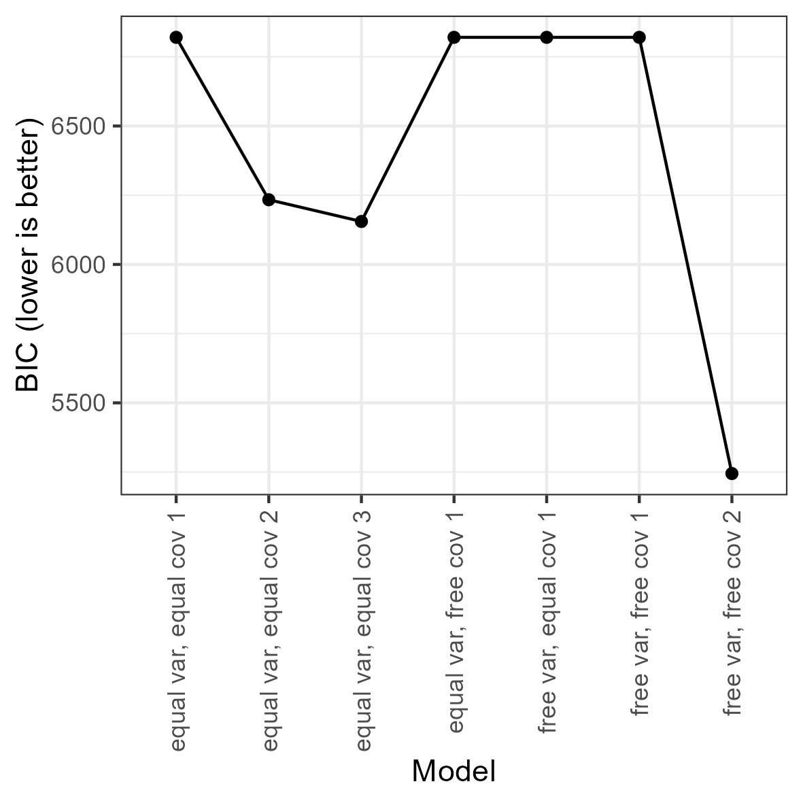

# Exploratory LPA for Ocean Microplastics

This is an example of exploratory latent class analysis (LCA) with
continuous indicators, otherwise known as latent profile analysis (LPA)
or finite Gaussian mixture modeling, using `tidySEM`. See Van Lissa, C.
J., Garnier-Villarreal, M., & Anadria, D. (2023). *Recommended Practices
in Latent Class Analysis using the Open-Source R-Package tidySEM.*
Structural Equation Modeling.
<https://doi.org/10.1080/10705511.2023.2250920>. The present example
uses data collected by Alkema as part of a study on ocean microplastics.
The purpose of this study was to provide a more nuanced model for the
distribution of different sizes of ocean microplastics than the commonly
used normal distribution. To this end, a mixture of normals was used.
Since there is no theoretical reason to expect a certain number of
classes, this is an exploratory LCA. To view its documentation, run the
command
[`?tidySEM::alkema_microplastics`](https://cjvanlissa.github.io/tidySEM/reference/alkema_microplastics.md)
in the R console. The original analyses are available at
<https://github.com/cjvanlissa/lise_microplastics>; in this vignette, we
take a different approach to the analysis to showcase other
possibilities.

## Loading the Data

To load the data, simply attach the `tidySEM` package. For convenience,
we assign the variables used for analysis to an object called `df`. As
explained in the paper, the classes are quite different for lines,
films, and fragments. For this reason, we here only use data from
fragments. The indicators are fragments’ length and width in
millimeters. The sample size was not planned.

``` r
# Load required packages
library(tidySEM)
library(ggplot2)
# Load data
df_analyze <- alkema_microplastics[alkema_microplastics$category ==
    "Fragment", ]
df <- df_analyze[, c("length", "width")]
```

## Descriptive statistics

As per the best practices, the first step in LCA is examining the
observed data. We use
[`tidySEM::descriptives()`](https://cjvanlissa.github.io/tidySEM/reference/descriptives.md)
to describe the data numerically. Because all items are continuous, we
remove columns for categorical data to de-clutter the table:

``` r
desc <- tidySEM::descriptives(df)
desc <- desc[, c("name", "type", "n", "unique", "mean", "median",
    "sd", "min", "max", "skew_2se", "kurt_2se")]
knitr::kable(desc, caption = "Descriptive statistics")
```

| name   | type    |    n | unique | mean | median |  sd | min |  max | skew_2se | kurt_2se |
|:-------|:--------|-----:|-------:|-----:|-------:|----:|----:|-----:|---------:|---------:|
| length | numeric | 5605 |   2086 |  2.9 |    2.4 | 1.9 | 1.0 | 69.2 |      137 |     2116 |
| width  | numeric | 5605 |   2079 |  2.0 |    1.6 | 1.1 | 0.2 |  6.8 |       22 |       37 |

Descriptive statistics

The data are correctly coded as `numeric` and the distributional
characteristics match the intended measurement level. The variable
scales are comparable (both in millimeters and no large discrepancies
between variances). There are no missing values; if any variables had
missing values, we would report an MCAR test with
[`mice::mcar()`](https://amices.org/mice/reference/mcar.html), and
explain that missing data are accounted for using FIML. Additionally, we
can plot the data. The `ggplot2` function
[`geom_density()`](https://ggplot2.tidyverse.org/reference/geom_density.html)
is useful to visualize continuous data:

``` r
df_plot <- df
names(df_plot) <- paste0("Value.", names(df_plot))
df_plot <- reshape(df_plot, varying = names(df_plot), direction = "long",
    timevar = "Variable")
ggplot(df_plot, aes(x = Value)) + geom_density() + facet_wrap(~Variable) +
    theme_bw()
```


Both the table above and the density plot indicate that the data are
extremely right-skewed and kurtotic. With this in mind, it can be useful
to transform and rescale the data. We will use a log transformation.

``` r
df_plot$Value <- log(df_plot$Value)
ggplot(df_plot, aes(x = Value)) + geom_density() + facet_wrap(~Variable) +
    theme_bw()
```


The log transformation addresses the aforementioned concerns regarding
skew and kurtosis. To confirm this, reshape the data to wide format and
examine a scatterplot:

``` r
df <- reshape(df_plot, direction = "wide", v.names = "Value")[,
    -1]
names(df) <- gsub("Value.", "", names(df), fixed = TRUE)
ggplot(df, aes(x = length, y = width)) + geom_point(alpha = 0.1) +
    theme_bw()
```


## Conducting Latent Profile Analysis

As all variables are continuous, we can use the convenience function
[`tidySEM::mx_profiles()`](https://cjvanlissa.github.io/tidySEM/reference/mx_profiles.md),
which is a wrapper for the generic function
[`mx_mixture()`](https://cjvanlissa.github.io/tidySEM/reference/mx_mixture.md)
optimized for continuous indicators. Its default settings are
appropriate for LPA, assuming fixed variances across classes and zero
covariances. Its arguments are `data` and number of `classes`. All
variables in `data` are included in the analysis, which is why we first
selected the indicator variables. The models are estimated using
simulated annealing, with start values determined via initial K-means
clustering.

As this is an exploratory LCA, we will conduct a rather extensive search
across model specifications and number of classes. We will set the
maximum number of classes $K$ to three to limit computational demands.
We set a seed to ensure replicable results.

As the analysis takes a long time to compute, it is prudent to save the
results to disk immediately, so as not to lose them. For this, we use
the function [`saveRDS()`](https://rdrr.io/r/base/readRDS.html). We can
later use `res <- readRDS("res_gmm.RData")` to load the analysis from
the file.

``` r
set.seed(123)
res <- mx_profiles(data = df, classes = 1:3, variances = c("equal",
    "varying"), covariances = c("equal", "varying"), expand_grid = TRUE)
saveRDS(res, "res_gmm.RData")
```

## Class Enumeration

To compare the fit of the estimated models, we create a model fit table
using
[`table_fit()`](https://cjvanlissa.github.io/tidySEM/reference/table_fit.md).
We will use the BIC for class enumeration.

``` r
fit <- table_fit(res)
```

First, we determine whether any models can be disqualified. There were
no indications of convergence problems during estimation, so this is not
a reason to disqualify solutions. Next, we check for global and local
identifiability. The global ratio of observations per parameter is
large, as the minimum `np_ratio` is 244. The smallest ratio of class
size to class-specific parameters is 18 (see `np_local`), which is no
cause for concern.

``` r
tbl <- fit[, c("Name", "LL", "Parameters", "BIC", "Entropy",
    "prob_min", "n_min", "np_ratio", "np_local")]
names(tbl) <- c("Name", "LL", "p", "BIC", "Ent.", "p_min", "n_min",
    "np_ratio", "np_local")
knitr::kable(tbl, caption = "Model fit table.")
```

| Name                   |    LL |   p |  BIC | Ent. | p_min | n_min | np_ratio | np_local |
|:-----------------------|------:|----:|-----:|-----:|------:|------:|---------:|---------:|
| equal var, equal cov 1 | -3389 |   5 | 6820 | 1.00 |  1.00 |  1.00 |     1121 |     1121 |
| equal var, equal cov 2 | -3082 |   8 | 6234 | 0.72 |  0.86 |  0.31 |      701 |      494 |
| equal var, equal cov 3 | -3030 |  11 | 6155 | 0.67 |  0.71 |  0.17 |      510 |      313 |
| free var, equal cov 1  | -3389 |   5 | 6820 | 1.00 |  1.00 |  1.00 |     1121 |     1121 |
| free var, equal cov 2  | -2545 |  10 | 5176 | 0.64 |  0.51 |  0.09 |      560 |      108 |
| free var, equal cov 3  | -2257 |  15 | 4643 | 0.68 |  0.54 |  0.06 |      374 |       83 |
| equal var, free cov 1  | -3389 |   5 | 6820 | 1.00 |  1.00 |  1.00 |     1121 |     1121 |
| equal var, free cov 2  | -2552 |   9 | 5181 | 0.65 |  0.52 |  0.09 |      623 |      121 |
| equal var, free cov 3  | -2368 |  13 | 4848 | 0.56 |  0.51 |  0.02 |      431 |       27 |
| free var, free cov 1   | -3389 |   5 | 6820 | 1.00 |  1.00 |  1.00 |     1121 |     1121 |
| free var, free cov 2   | -2575 |  11 | 5245 | 0.56 |  0.81 |  0.40 |      510 |      448 |
| free var, free cov 3   | -2111 |  17 | 4370 | 0.65 |  0.51 |  0.04 |      330 |       41 |

Model fit table.

However, note that we have a very large sample, and for many models, the
smallest class comprises only a very small percentage of the total
sample. Since the purpose of this analysis is to better represent the
distribution of ocean microplastics, we can wonder whether it makes
sense to allow for classes that only describe a small percentage of the
cases. We therefore only consider solutions that capture at least 10% of
the sample.

Another interesting characteristic of this data is that the BIC and the
entropy are strongly correlated. The raw correlation between these two
metrics is .66, `cor(fit$BIC, fit$Entropy)`. If we omit the 1-class
models, for which entropy is technically not defined, the correlation is
even as high as .85,
`cor(fit$BIC[!fit$Classes == 1], fit$Entropy[!fit$Classes == 1])`.

This strong correlation indicates that an increase in fit comes with a
decrease in class separability. This illustrates why entropy should not
be treated as a model fit criterion. It also illustrates that criteria
for class enumeration should be explicit, because we will likely come to
a different decision depending on which criteria are used.

As mentioned before, we drop models with \< 10% of cases in the smallest
class:

``` r
fit <- fit[!fit$n_min < 0.1, ]
```

If our strategy is to optimize fit, we can examine the fit table above,
or plot a scree plot for the BIC by calling `plot(fit)`. Note that, due
to the large sample size, all ICs give identical conclusions.

``` r
plot(fit) + theme(axis.text.x = element_text(angle = 90, vjust = 0.5,
    hjust = 1))
```



Bivariate profile plot

Looking at the blocks of 1-4 class models for each model specification,
it appears that the BIC keeps decreasing with the addition of more
classes. Across the blocks, the BIC keeps decreasing with increasingly
complex model specifications.

Out of the 16 models that remain after removing those with \< 10% of
cases in the smallest class, one model stands out: The 2-class model
with free (co)variances. We thus select this as our final model.

## Interpreting the Final Class Solution

We here request the estimates (`est`) and standardized estimates
`std_est`, because the latter allows us to interpret the correlations
between length and width. Note that standard errors and p-values are
relatively uninformative: With a sample size of 5606, every parameter is
significantly different from zero.

``` r
res_bic <- res[["free var, free cov 2"]]
cp <- class_prob(res_bic)
results <- table_results(res_bic, columns = c("label", "est",
    "std_est"))
results
```

| label                         |  est |
|:------------------------------|-----:|
| Means.length                  | 0.65 |
| Means.width                   | 0.34 |
| Variances.length              | 0.10 |
| Covariances.length.WITH.width | 0.09 |
| Variances.width               | 0.10 |
| Means.length                  | 1.33 |
| Means.width                   | 0.86 |
| Variances.length              | 0.19 |
| Covariances.length.WITH.width | 0.20 |
| Variances.width               | 0.28 |
| mix2.weights\[1,1\]           | 1.00 |
| mix2.weights\[1,2\]           | 0.75 |

Results of a 2-class model with free (co)variances

Interpreting the results is facilitated by examining a plot of the model
and data. Relevant plot functions are
[`plot_bivariate()`](https://cjvanlissa.github.io/tidySEM/reference/plot_bivariate.md),
[`plot_density()`](https://cjvanlissa.github.io/tidySEM/reference/plot_density.md),
and
[`plot_profiles()`](https://cjvanlissa.github.io/tidySEM/reference/plot_profiles.md).
However, we omit the density plots, because
[`plot_bivariate()`](https://cjvanlissa.github.io/tidySEM/reference/plot_bivariate.md)
also includes them.

``` r
plot_bivariate(res_bic)
```


Bivariate profile plot

On the diagonal of the bivariate plot are weighted density plots: normal
approximations of the density function of observed data, weighed by
class probability. On the off-diagonal are plots for each pair of
indicators, with the class means indicated by a point, class standard
deviations indicated by lines, and covariances indicated by circles.

The bivariate and marginal plots show that the classes are not clearly
separable, as also evident from the low entropy. At the same time
however, it is clear that the observed distributions are non-normal, and
the second class accounts for some of this non-normality (there is a
smaller ‘bump’ to the right of the mode, which could be the mean of a
second normal distribution). The first class (57%) accounts for smaller
fragments, and the second class (43%) accounts for some of the
right-skew in fragments’ length and width. We label class 1 as *small
fragments*, and class 2 as *larger fragments*.

It also appears that the correlation between length and width is
stronger for small fragments than for large fragments. To test the
difference, use `wald_test(res_bic, hypothesis = "c11 = c21")`. Results
indicate that the correlation is indeed significantly larger for small
fragments ($r = .92$) than for larger fragments ($r = .85$),
$\chi^{2}(1) = 11.56,p < .001$. Thus, small fragments are more
coextensive than large fragments.

There are, however, concerns about the interpretability of this
solutions: the entropy is `.56` and the minimum classification
probability is`.81`. This is because of substantial overlap in the
distributions of the two classes.

## Auxiliary Analyses

Finally, we may want to compare the different classes on auxiliary
variables or models. The
[`BCH()`](https://cjvanlissa.github.io/tidySEM/reference/BCH.md)
function applies three-step analysis, which compares the classes using a
multi-group model, controlling for classification error. For example, we
can test whether polymer type differs between the two classes. Because
polymer type is a nominal variable, we must convert it to dummies and
estimate a threshold for each dummy:

``` r
df_pt <- mx_dummies(df_analyze$poly_type)
aux_pt <- BCH(res_bic, model = "poly_typeOther | t1
                                poly_typePE | t1
                                poly_typePP | t1",
    data = df_pt)
aux_pt <- mxTryHardOrdinal(aux_pt)
```

To obtain an omnibus likelihood ratio test of the significance of the
differences in polymer type across classes, use `lr_test(aux_pt)`. The
results indicate that there are significant differences in polymer types
across classes, $\Delta LL(3) = 17.14,p < .001$. The results can be
reported in probability scale using `table_prob(aux_pt)`. To test
differences for specific polymer types, we can use Wald tests:

``` r
wald_test(aux_pt, "class1.Thresholds[1,1] = class2.Thresholds[1,1];
          class1.Thresholds[1,2] = class2.Thresholds[1,2];
          class1.Thresholds[1,3] = class2.Thresholds[1,3]")
```

The results indicate that there is no significant difference in the
prevalence of “Other” polymer types across classes. However, PE is
significantly more prevalent in class 1, and PP is significantly more
prevalent in class 2.
