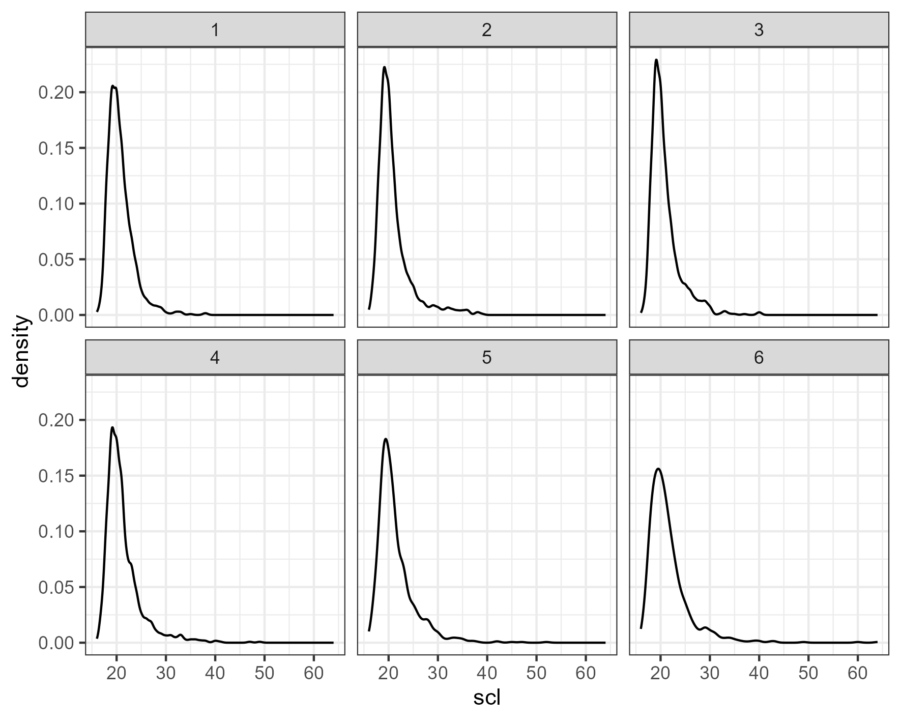
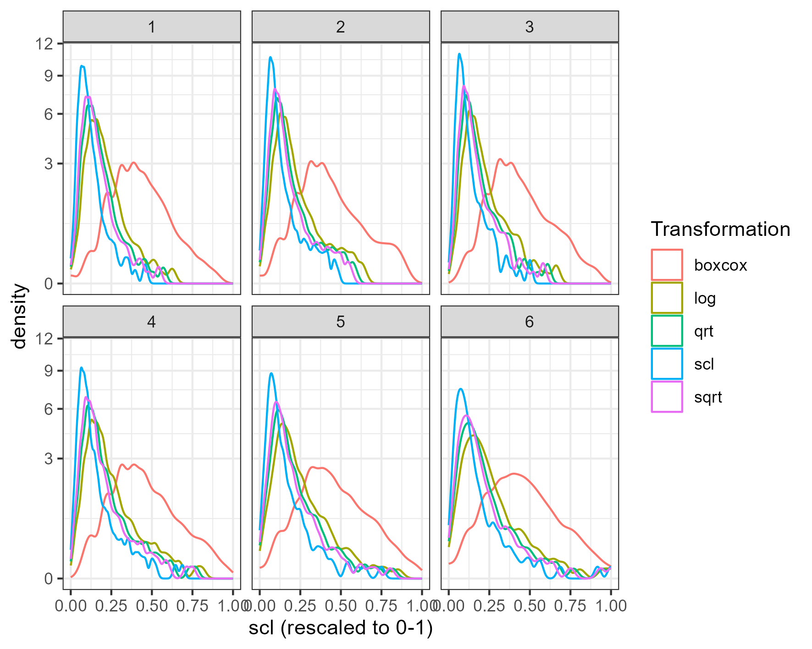
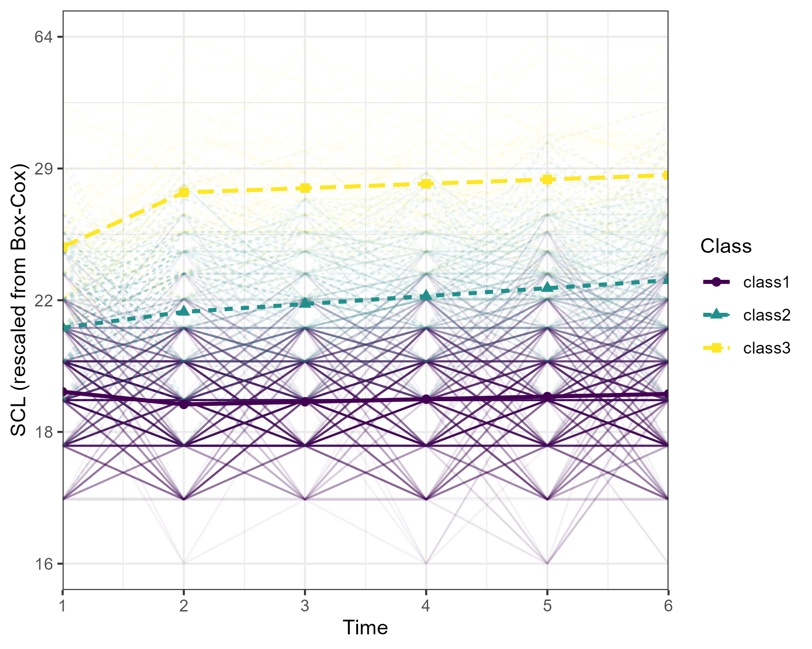

```{r, include = FALSE}
knitr::opts_chunk$set(
  collapse = TRUE,
  message = FALSE,
  warning = FALSE,
  comment = "#>"
)
run_everything <- FALSE
```

This vignette illustrated `tidySEM`'s ability to perform latent class growth analysis, or growth mixture modeling [@mcardleGrowthCurveAnalysis2003].
The simulated data used for this example are inspired by work in progress by Plas and colleagues,
on heterogeneity in depression trajectories among Dutch military personnel who were deployed to Afghanistan.
The original data were collected as part of the *Prospection in Stress-related Military Research (PRISMO)* study,
which examined of psychological problems after deployment in more than 1,000 Dutch military personnel from 2005-2019.

First, we load all required packages:

```{r setup}
library(tidySEM)
library(ggplot2)
library(MASS)
```

## Data preprocessing

We first examined the descriptive statistics for the sum score scales:

```{r, results='asis'}
# Get descriptives
df <- plas_depression
desc <- descriptives(df)
desc <- desc[, c("name", "mean", "median", "sd", "min", "max", 
"skew_2se", "kurt_2se")
]
knitr::kable(desc, caption = "Item descriptives")
```

Note that all variables were extremely right-skewed due to censoring at the lower end of the scale.

We can examine these distributions visually as well:

```{r echo = TRUE, eval = FALSE}
df_plot <- reshape(df, direction = "long", varying = names(df))
ggplot(df_plot, aes(x = scl)) +
  geom_density() +
  facet_wrap(~time) + theme_bw()
```
```{r, eval = run_everything, echo = FALSE}
df_plot <- reshape(df, direction = "long", varying = names(df))
p = ggplot(df_plot, aes(x = scl)) +
  geom_density() +
  facet_wrap(~time) + theme_bw()
ggsave("plot_dist.png", p, width = 150, height = 120, units = "mm")
```
```{r, echo = FALSE, out.width="50%"}
df_plot <- reshape(df, direction = "long", varying = names(df))

```


As this type of skew can result in convergence problems in LCGA,
we compared several transformations to reduce skew:
The square and cube root, log, inverse, and Box-Cox transformations.

```{r transform, results='hide'}
df_scores <- df_plot
# Store original range of SCL
rng_scl <- range(df_scores$scl)
# Log-transform
df_scores$log <- scales::rescale(log(df_scores$scl), to = c(0, 1))
# Square root transform
df_scores$sqrt <- scales::rescale(sqrt(df_scores$scl), to = c(0, 1))
# Cube root transform
df_scores$qrt <- scales::rescale(df_scores$scl^.33, to = c(0, 1))
# Reciprocal transform
df_scores$reciprocal <- scales::rescale(1/df_scores$scl, to = c(0, 1))
# Define function for Box-Cox transformation
bc <- function(x, lambda){
  (((x ^ lambda) - 1) / lambda)
}
# Inverse Box-Cox transformation
invbc <- function(x, lambda){
  ((x*lambda)+1)^(1/lambda)
}
# Box-Cox transform
b <- MASS::boxcox(lm(df_scores$scl ~ 1), plotit = FALSE)
lambda <- b$x[which.max(b$y)]
df_scores$boxcox <- bc(df_scores$scl, lambda)
# Store range of Box-Cox transformed data
rng_bc <- range(df_scores$boxcox)
df_scores$boxcox <- scales::rescale(df_scores$boxcox, to = c(0, 1))
# Rescale SCL
df_scores$scl <- scales::rescale(df_scores$scl, to = c(0, 1))
```

We can plot these transformations:

```{r, eval = FALSE, echo = TRUE}
# Make plot data
df_plot <- do.call(rbind, lapply(c("scl", "log", "sqrt", "qrt", "boxcox"), function(n){
  data.frame(df_scores[c("time", "id")],
             Value = df_scores[[n]],
             Transformation = n)
}))
# Plot
ggplot(df_plot, aes(x = Value, colour = Transformation)) +
  geom_density() +
  facet_wrap(~time) +
  scale_y_sqrt() +
  xlab("scl (rescaled to 0-1)") +
  theme_bw()
```
```{r, eval = run_everything, echo = FALSE}
# Make plot data
df_plot <- do.call(rbind, lapply(c("scl", "log", "sqrt", "qrt", "boxcox"), function(n){
  data.frame(df_scores[c("time", "id")],
             Value = df_scores[[n]],
             Transformation = n)
}))
# Plot
p <- ggplot(df_plot, aes(x = Value, colour = Transformation)) +
  geom_density() +
  facet_wrap(~time) +
  scale_y_sqrt() +
  xlab("scl (rescaled to 0-1)") +
  theme_bw()
ggsave("plot_trans.png", p, width = 150, height = 120, units = "mm")
```
```{r, echo = FALSE, eval = TRUE, out.width="50%"}

```


Evidently, the Box-Cox transformation reduced skew the most.
Consequently, we proceeded with the Box-Cox transformed scores for analysis.

```{r}
dat <- df_scores[, c("id", "time", "boxcox")]
dat <- reshape(dat, direction = "wide", v.names = "boxcox", timevar = "time", idvar = "id")
names(dat) <- gsub("boxcox.", "scl", names(dat))
```

# Latent Class Growth Analysis

Next, we estimated a latent class growth model
for SCL.
The model included an overall intercept, centered at T1, `i`.
To model the potential effect of deployment on
depresion,
we also included a dummy variable that was zero before
deployment, and 1 after deployment, `step`.
Finally, to model potential change (or recovery) in depression post-deployment,
we included a linear slope from T2-T6, `s`.
All variances of growth parameters were fixed to zero due to the sparse nature of the data.
In this vignette,
we do not consider more than 5 classes,
because the analyses are computationally very intensive and the data were simulated from a 3-class model.

**NOTE: The time scales in this model are not correct; it currently assumes that all measurements are equidistant. Feel free to experiment with adjusting this.**

```{r lcga, echo = TRUE, eval = run_everything}
set.seed(27796)
dat[["id"]] <- NULL
res_step <- mx_growth_mixture(
  model =
"i =~ 1*scl1 + 1*scl2 + 1*scl3 +1*scl4 +1*scl5 +1*scl6
step =~ 0*scl1 + 1*scl2 + 1*scl3 +1*scl4 +1*scl5 +1*scl6
s =~ 0*scl1 + 0*scl2 + 1*scl3 +2*scl4 +3*scl5 +4*scl6
scl1 ~~ vscl1*scl1
scl2 ~~ vscl2*scl2
scl3 ~~ vscl3*scl3
scl4 ~~ vscl4*scl4
scl5 ~~ vscl5*scl5
scl6 ~~ vscl6*scl6
i ~~ 0*i
step ~~ 0*step
s ~~ 0*s
i ~~ 0*s
i ~~ 0*step
s ~~ 0*step", classes = 1:5,
  data = dat)
# Additional iterations because of
# convergence problems for model 1:
res_step[[1]] <- mxTryHardWideSearch(res_step[[1]], extraTries = 50)
```

```{r echo = FALSE, eval = FALSE}
set.seed(27796)
dat[["id"]] <- NULL
res_step <- mx_growth_mixture(
  model =
"i =~ 1*scl1 + 1*scl2 + 1*scl3 +1*scl4 +1*scl5 +1*scl6
step =~ 0*scl1 + 1*scl2 + 1*scl3 +1*scl4 +1*scl5 +1*scl6
s =~ 0*scl1 + 0*scl2 + 1*scl3 +2*scl4 +3*scl5 +4*scl6
scl1 ~~ vscl1*scl1
scl2 ~~ vscl2*scl2
scl3 ~~ vscl3*scl3
scl4 ~~ vscl4*scl4
scl5 ~~ vscl5*scl5
scl6 ~~ vscl6*scl6
i ~~ 0*i
step ~~ 0*step
s ~~ 0*s
i ~~ 0*s
i ~~ 0*step
s ~~ 0*step", classes = 1:5,
  data = dat)
# Additional iterations because of
# convergence problems for model 1:
res_step[[1]] <- mxTryHardWideSearch(res_step[[1]], extraTries = 50)
saveRDS(res_step, "res_step.RData")
```
```{r, echo = FALSE, eval = TRUE}
res_step <- readRDS("res_step.RData")
```

Note that the first model showed convergence problems, throwing the error:
*The model does not satisfy the 
first-order optimality conditions to
the required accuracy, and no improved
point for the merit function could be
found during the final linesearch.*
To address this problem, we performed
additional iterations to  
find a better solution, using `OpenMx::mxTryHardWideSearch()`.
This also illustrates that `tidySEM` mixture models inherit from `OpenMx`'s `MxModel`,
and thus, different `OpenMx` functions can be used to act on models specified via `tidySEM`.

The fifth model also evidenced convergence problems, but this (as we will see) is because the solution is overfitted.

## Class enumeration

To determine the correct number of classes, we considered the following criteria:

1. We do not consider classes with, on average, fewer than 5 participants per parameter in a class due to potential local underidentification
1. Lower values for information criteria (AIC, BIC, saBIC) indicate better fit
1. Significant Lo-Mendell-Rubin LRT test indicates better fit for $k$ vs $k-1$ classes
1. We do not consider solutions with entropy < .90 because poor class separability compromises interpretability of the results
1. We do not consider solutions with minimum posterior classification probability < .90 because poor class separability compromises interpretability of the results

```{r tabfit, results = "asis"}
# Get fit table fit
tab_fit <- table_fit(res_step)
# Select columns
tab_fit <- tab_fit[,c("Name", "Minus2LogLikelihood", "Parameters", "df", "AIC", "BIC", "saBIC", "Entropy", "prob_min", 
"prob_max", "n_min", "n_max", "lmr_lr", "lmr_p")]
knitr::kable(tab_fit, digits = 2, caption = "Fit of LCGA models")
```

According to the Table, increasing the number of classes keeps increasing model fit according to all ICs except the BIC, which increased after 3 classes.

The first two LMR tests are significant,
indicating that a 2- and 3-class solution were a significant improvement over a 1- and 2-class solution, respectively.
However, solutions with >3 classes had entropy and minimum posterior classification probability below the pre-specified thresholds.
Models with >3 solutions also had fewer than five observations per parameter.
This suggests that the preferred model should be selected from 1-3 classes.

### Scree plot

A scree plot indicates that
the largest decrease in ICs occurs from 1-2 classes,
and the inflection point for all ICs is at 3 classes.
Moreover, the BIC increased after 3 classes.
A three-class solution thus appears to be the most parsimonious
solution with good fit.

```{r plotscree, echo = TRUE, eval = FALSE}
plot(tab_fit, statistics = c("AIC", "BIC", "saBIC"))
```
```{r echo = FALSE, eval = run_everything}
p <- plot(tab_fit, statistics = c("AIC", "BIC", "saBIC"))
ggsave("plot_fit.png", p, width = 150, height = 120, units = "mm")
```
```{r echo = FALSE, eval = TRUE, out.width="50%"}
knitr::include_graphics("plot_fit.png")
```

Based on the aforementioned criteria,
we selected a 3-class model for further analyses.
First, to prevent label switching,
we re-order these classes by the value of the intercept `i`.
Then, we report the estimated parameters.

```{r tabres, results='asis'}
res_final <- mx_switch_labels(res_step[[3]], param = "M[1,7]", decreasing = FALSE)
tab_res <- table_results(res_final, columns = NULL)
# Select rows and columns
tab_res <- tab_res[tab_res$Category %in% c("Means", "Variances"), c("Category", "lhs", "est", "se", "pval", "confint", "name")]
knitr::kable(tab_res, digits = 2, caption = "Results from 3-class LCGA model")
```

As evident from these results, 
Class 1 started at a relatively lower level of depressive symptoms,
experienced a decrease after deployment,
followed by increase over time.
Class 2 started at a moderate level of depressive symptoms,
experienced an increase after deployment,
followed by significant increase over time from T2-T6.
Class 3 started at a relatively higher level,
experienced an increase after deployment, followed by stability.

## Wald tests

To test whether parameters are significantly different between classes,
we can use Wald tests.
Wald tests can be specified for all parameters in the model,
using the hypothesis syntax from the `bain` package for informative hypothesis testing.

To identify the names of parameters in the model,
we can use the `name` column of the results table above.
Alternatively, to see all parameters in the model, run:

```{r params}
names(coef(res_final))
```

Next, specify equality constrained hypotheses.
For example, a hypothesis that states that the mean intercept is equal across groups is specified as follows:

`"class1.M[1,7] = class2.M[1,7] & class1.M[1,7] = class3.M[1,7]`

It is also possible to consider comparisons between two classes at a time.
When conducting many significance tests,
consider correcting for multiple comparisons however.

```{r waldtests, results='asis'}
wald_tests <- wald_test(res_final, 
                   "class1.M[1,7] = class2.M[1,7]&class1.M[1,7] = class3.M[1,7];class1.M[1,8] = class2.M[1,8]&class1.M[1,8] = class3.M[1,8];class1.M[1,9] = class2.M[1,9]&class1.M[1,9] = class3.M[1,9]")
# Rename the hypothesis
wald_tests$Hypothesis <- c("Mean i", "Mean step", "Mean slope")
knitr::kable(wald_tests, digits = 2, caption = "Wald tests")
```

All Wald tests are significant, indicating that there are significant differences between the intercepts, step function, and slopes of the three classes.

## Trajectory plot

Finally, we can plot the growth trajectories.
This can help interpret the results better,
as well as the residual heterogeneity around class trajectories.

```{r makelcgaplot, echo = TRUE, eval = FALSE}
p <- plot_growth(res_step[[3]], rawdata = TRUE, alpha_range = c(0, .05))
# Add Y-axis breaks in original scale
brks <- seq(0, 1, length.out = 5)
labs <- round(invbc(scales::rescale(brks, from = c(0, 1), to = rng_bc), lambda))
p <- p + scale_y_continuous(breaks = seq(0, 1, length.out = 5), labels = labs) + ylab("SCL (rescaled from Box-Cox)")
p
```
```{r echo = FALSE, eval = run_everything}
p <- plot_growth(res_step[[3]], rawdata = TRUE, alpha_range = c(0, .05))
# Add Y-axis breaks in original scale
brks <- seq(0, 1, length.out = 5)
labs <- round(invbc(scales::rescale(brks, from = c(0, 1), to = rng_bc), lambda))
p <- p + scale_y_continuous(breaks = seq(0, 1, length.out = 5), labels = labs) + ylab("SCL (rescaled from Box-Cox)")
ggsave("plot_traj.png", p, width = 150, height = 120, units = "mm")
```
```{r echo = FALSE, eval = TRUE, out.width="50%"}

```

Note that the observed individual trajectories show very high variability within classes.
