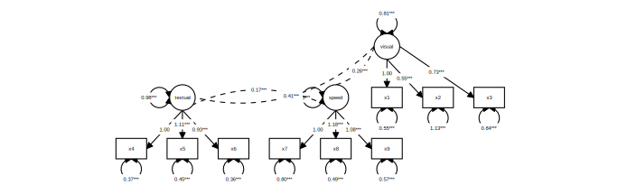
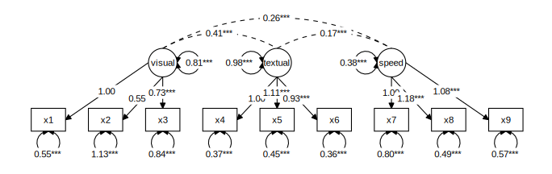
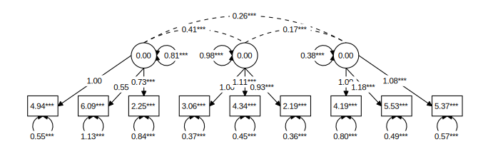
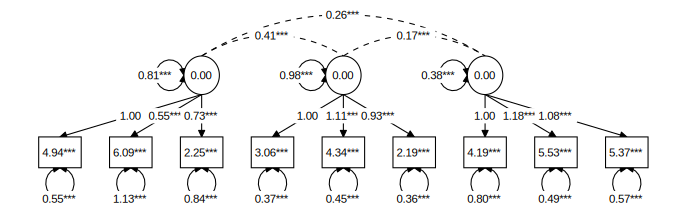
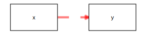
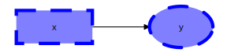
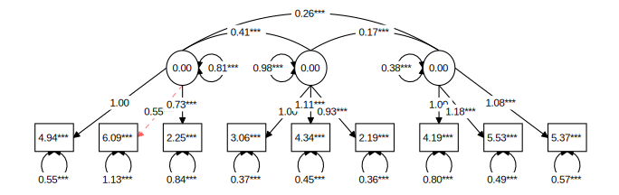

```{r, include = FALSE}
knitr::opts_chunk$set(
  collapse = TRUE,
  comment = "#>"
)
generate_svgs <- FALSE
```

`tidySEM` offers a user-friendly, tidy workflow for plotting graphs for SEM models. The workflow is largely *programmatic*, meaning that graphs are created mostly automatically from the output of an analysis. At the same time, all elements of the graph are stored as `data.frame`s, which allows swift and easy customization of graphics, and artistic freedom. Some existing graphing packages  automatically create a layout, but are very difficult to customize. Particularly for complex SEM models, it may be preferable to make the layout by hand, including only nodes one wishes to plot, and reporting the rest in a comprehensive table of coefficients (e.g., one obtained through `table_results()`.

For users wholly unfamiliar with SEM graphs, I recommend reading the 
[vignette about SEM graphing conventions](https://cjvanlissa.github.io/tidySEM/articles/sem_graph.html) first.

Let's load the required packages:

```{r setup, message=FALSE, warning = FALSE}
library(tidySEM)
library(lavaan)
library(ggplot2)
```

## The tidySEM workflow

The workflow underlying graphing in `tidySEM` is as follows:

1. Run an analysis, e.g., using `lavaan::sem()` or `MplusAutomation::mplusModeler()`, passing the output to an object, e.g., `fit`
2. Plot the graph using the function `graph(fit)`, or customize the graph further by following the optional steps below.
3. *Optionally* Examine what nodes and edges can be extracted from the fit model object, by running `get_nodes(fit)` and `get_edges(fit)`
4. *Optionally* Specify a layout for the graph using `get_layout()`
5. *Optionally*, prepare graph data before plotting, by running `prepare_graph(fit, layout)`. Store the resulting graph data in an object, e.g., `graph_data`
6. *Optionally*, access the nodes and edges in `graph_data` using `nodes(graph_data)` and `edges(graph_data)`
7. *Optionally*, modify the nodes and edges in `graph_data` using `nodes(graph_data) <- ...`and `edges(graph_data) <- ...`

This workflow ensures a high degree of transparency and customizability. Objects returned by all functions are "tidy" data, i.e., tabular `data.frames`, and can be modified using the familiar suite of functions in the 'tidyverse'.

## Example: Graphing a CFA

### Step 1: Run an analysis

As an example, let's make a graph for a classic `lavaan` tutorial example for CFA. First, we conduct the SEM analysis:

```{r, eval = FALSE, echo = TRUE}
library(lavaan)
HS.model <- ' visual  =~ x1 + x2 + x3
              textual =~ x4 + x5 + x6
              speed   =~ x7 + x8 + x9 '
fit <- cfa(HS.model, data=HolzingerSwineford1939)
```
```{r, eval = TRUE, echo = FALSE, message=FALSE}
library(lavaan)
suppressWarnings({
HS.model <- ' visual  =~ x1 + x2 + x3
              textual =~ x4 + x5 + x6
              speed   =~ x7 + x8 + x9 '
fit <- cfa(HS.model, data=HolzingerSwineford1939)
})
```

### Step 2: Plot the graph

At this point, we could simply plot the graph:

```{r, echo = TRUE, eval = FALSE}
graph_sem(model = fit)
```
```{r echo = FALSE, warning = FALSE, message = FALSE, out.width='100%'}
p <- graph_sem(model = fit, text_size = 2, fix_coord = TRUE)
if(generate_svgs) ggsave("pgfig1.svg", p, device = "svg", width= 9.5, height = 3)

```

This uses a default layout, provided by the `igraph` package. However, the node placement is not very aesthetically pleasing. One of the areas where `tidySEM` really excells is customization. Because every aspect of the graph is represented as tidy data (basically, a spreadsheet), it is easy to move nodes around and create a custom layout.

### Optional step 3: Customizing the layout

In `tidySEM`, the layout is specified as a matrix (grid) with node names and empty spaces (`NA` or `""`). There are essentially three ways to specify the layout:

1. Automatically, from the fit model
2. Manually in R
3. In a spreadsheet program

#### Automatically generate layout for a model

The example above used an automatically generated layout for the fit model (`lavaan` or `Mplus`). For this, the `graph_sem()` function makes use of the function `igraph::layout_as_tree()`, or other layout functions in the `igraph` package. To get this layout as a matrix, you can run:

```{r eval = TRUE, echo = TRUE}
get_layout(fit)
```
```{r, eval = FALSE, echo = FALSE, message=FALSE, warning = FALSE}
library(lavaan)
suppressWarnings({
fit <- cfa(' visual  =~ x1 + x2 + x3 ',
           data = HolzingerSwineford1939[1:50, ])
get_layout(fit)
})
```

Other layout functions from the `igraph` package can be used by specifying the `layout_algorithm = ...` argument:

```{r message=FALSE, warning = FALSE}
get_layout(fit, layout_algorithm = "layout_in_circle")
get_layout(fit, layout_algorithm = "layout_on_grid")
```

#### Specifying layout manually in R

Manually specifying the layout can be done by providing node names and empty spaces (`NA` or `""`), and the number of rows of the desired layout matrix. For example: 

```{r}
get_layout("c", NA,  "d",
           NA,  "e", NA, rows = 2)
```

Of course, it is also possible to simply define a matrix using `matrix()`.

#### Specifying layout in a spreadsheet program

Specifying the layout in a spreadsheet program is very user-friendly, because one can visually position the nodes, e.g.:


To obtain the layout matrix, one can save the spreadsheet as `.csv` file and load it in R like this:

```{r, eval = FALSE, echo = TRUE}
read.csv("example.csv")
```

```{r echo = FALSE, eval = FALSE}
write.csv(matrix(c("x1", "x2",  "x3", "",  "visual", ""), nrow = 2, byrow = TRUE), file = "example.csv", row.names = FALSE)
read.csv("example.csv")
file.remove("example.csv")
```

Alternatively, one can select the layout as in the image above, copy it to the clipboard, and then read it into R from the clipboard. This works differently on Windows and Mac.

On Windows, run:

```{r, eval = FALSE, echo = TRUE}
read.table("clipboard", sep = "\t")
```

On Mac, run:

```{r, eval = FALSE, echo = TRUE}
read.table(pipe("pbpaste"), sep="\t")
```

```{r echo = FALSE, eval = TRUE}
structure(list(V1 = structure(2:1, .Label = c("", "x1"), class = "factor"), 
    V2 = structure(2:1, .Label = c("visual", "x2"), class = "factor"), 
    V3 = structure(2:1, .Label = c("", "x3"), class = "factor")), class = "data.frame", row.names = c(NA, 
-2L))
HS.model <- ' visual  =~ x1 + x2 + x3
              textual =~ x4 + x5 + x6
              speed   =~ x7 + x8 + x9 '
fit <- cfa(HS.model, data=HolzingerSwineford1939)
```

### Examples of user-defined layout

We can specify a simple layout for two hypothetical nodes `x` and `y` is generated as follows:

```{r}
get_layout("x", "y", rows = 1)
```

For a mediation model, one might specify a layout like this:

```{r}
get_layout("", "m", "",
           "x", "", "y", rows = 2)
```

For a three-item CFA model, one might specify:

```{r}
get_layout("", "F", "",
           "y1", "y2", "y3", rows = 2)
```

And for the CFA model we estimated above:

```{r}
lay <- get_layout("", "", "visual","","textual","","speed","", "",
                  "x1", "x2", "x3", "x4", "x5", "x6", "x7", "x8", "x9", rows = 2)
```

We could plot the CFA model with this custom layout as follows:

```{r, eval = FALSE}
graph_sem(fit, layout = lay)
```
```{r echo = FALSE, warning = FALSE, message = FALSE, out.width='100%'}
p <- graph_sem(fit, layout = lay) + coord_fixed()
if(generate_svgs) ggsave("pgfig2_1.svg", p, device = "svg", width= 9.5, height = 3)

```


### Optional step 4: Examine nodes and edges

The function For the simple model above, it is easy to verify the names of the nodes and edges from the syntax above: The nodes consist of three latent variables (visual, textual, and speed), and nine observed variables (x1-x9). The edges are nine factor loadings - and three latent variable correlations, included by default. We can confirm which nodes are available by running `get_nodes()`:

```{r}
get_nodes(fit)
```

And for the edges:

```{r}
get_edges(fit)
```


### Optional step 5: accessing graph data before plotting

One important feature of `tidySEM` graphing is that the data used to compose the plot can be conveniently accessed an modified before plotting. First, use `prepare_graph()` to assign the plot data to an object.

```{r}
graph_data <- prepare_graph(model = fit, layout = lay)
```

### Optional step 6: Access the nodes and edges

The nodes and edges can be examined using `nodes(graph_data)` and `edges(graph_data)`:

```{r}
nodes(graph_data)
edges(graph_data)
```

### Optional step 7: Modify the nodes and edges

At this stage, we may want to improve the basic plot slightly. The functions `nodes(graph_data) <- ...` and `edges(graph_data) <- ...` can be used to modify the nodes and edges. These functions pair well with the general 'tidyverse' workflow. For example, we might want to print node labels for latent variables in *Title Case* instead of just using the variable names:

```{r, message=FALSE}
library(dplyr)
library(stringr)
nodes(graph_data) <- nodes(graph_data) %>%
  mutate(label = str_to_title(label))
```

```{r echo = FALSE}
# $label[1:3] <- str_to_title(nodes(graph_data)$label[1:3])
graph_data <- prepare_graph(model = fit, layout = lay)
```

Now, for the edges, we see that the default edging algorithm has connected some nodes side-to-side (based on the smallest possible Euclidian distance). However, in this simple graph, it makes more sense to connect all nodes top-to-bottom - except for the latent variable covariances. We can use the same conditional replacement for the edges:

```{r, eval = FALSE}
edges(graph_data) %>%
  mutate(connect_from = replace(connect_from, is.na(curvature), "bottom")) %>%
  mutate(connect_to = replace(connect_to, is.na(curvature), "top")) -> edges(graph_data)
```

### Plot the customized graph

We can plot a customized graph using `plot(graph_data)`; a generic plot method for `sem_graph` objects:

```{r, eval = FALSE}
plot(graph_data)
```
```{r echo = FALSE, warning = FALSE, message = FALSE, out.width='100%'}
p <- plot(graph_data) + coord_fixed()
if(generate_svgs) ggsave("pgfig2.svg", p, device = "svg", width= 9.5, height = 3)

```

## Connecting nodes

The functions `graph_sem()` and `prepare_graph()` will always try to connect nodes in an aesthetically pleasing way. To do this, they connect nodes by one of the four sides (top, bottom, left and right), based on the shortest distance between two nodes. Alternatively, users can specify a value to the `angle` parameter. This parameter connects nodes top-to-bottom when they are within `angle` degrees above and below each other. Remaining nodes are connected side-to-side. Thus, by increasing `angle` to a larger number (up to 180 degrees), we can also ensure that all nodes are connected top to bottom:

```{r, eval = FALSE}
graph_sem(model = fit, layout = lay, angle = 170)
```
```{r echo = FALSE, warning = FALSE, message = FALSE, out.width='100%'}
p <- graph_sem(model = fit, layout = lay, angle = 170)
if(generate_svgs) ggsave("pgfig3.svg", p, device = "svg", width= 9.5, height = 3)

```

## Visual aspects

The functions `graph_sem()` and `prepare_graph()` accept several optional visual parameters that can be used to customize the resulting image (see `?graph_sem()`). These parameters can be passed as extra columns to the `nodes()` and `edges()` objects. Specifically, edges have the following aesthetics (see `?geom_path()`):

* `linetype`: The type of line, e.g., continuous (`linetype = 1` or dashed `linetype = 2`)
* `colour`: The colour of the line (e.g., `colour = "red"` or `colour = "blue"`)
* `size`: The size of the line (e.g., `size = 1` or `size = 2`)
* `alpha`: The transparency of the line (e.g., `alpha = 1` or `alpha = .2`)


```{r, eval = FALSE}
edg <- data.frame(from = "x",
                  to = "y",
                  linetype = 2,
                  colour = "red",
                  size = 2,
                  alpha = .5)

graph_sem(edges = edg, layout = get_layout("x", "y", rows = 1))
```
```{r echo = FALSE, warning = FALSE, message = FALSE, out.width='30%'}
edg <- data.frame(from = "x",
                  to = "y",
                  linetype = 2,
                  colour = "red",
                  size = 2,
                  alpha = .5)

p <- graph_sem(edges = edg, layout = get_layout("x", "y", rows = 1))

if(generate_svgs) ggsave("pgfig4.svg", p, device = "svg", width= 4, height = 1)

```

Nodes have the following aesthetics (see `?geom_polygon()`):

* `linetype`: The type of line surrounding the node, e.g., continuous (`linetype = 1` or dashed `linetype = 2`)
* `colour`: The colour of the line surrounding the node (e.g., `colour = "red"` or `colour = "blue"`)
* `fill`: The interior colour of the node (e.g., `colour = "red"` or `colour = "blue"`)
* `size`: The size of the line (e.g., `size = 1` or `size = 2`)
* `alpha`: The transparency of the node (e.g., `alpha = 1` or `alpha = .2`)


```{r, eval = FALSE}
edg <- data.frame(from = "x",
                  to = "y")
nod <- data.frame(name = c("x", "y"),
                    shape = c("rect", "oval"),
                    linetype = c(2, 2),
                    colour = c("blue", "blue"),
                    fill = c("blue", "blue"),
                    size = c(2, 2),
                    alpha = .5)
graph_sem(edges = edg, nodes = nod, layout = get_layout("x", "y", rows = 1))
```
```{r echo = FALSE, warning = FALSE, message = FALSE, out.width='30%'}
edg <- data.frame(from = "x",
                  to = "y")
nod <- data.frame(name = c("x", "y"),
                    shape = c("rect", "oval"),
                    linetype = c(2, 2),
                    colour = c("blue", "blue"),
                    fill = c("blue", "blue"),
                    size = c(2, 2),
                    alpha = .5)
p <- graph_sem(edges = edg, nodes = nod, layout = get_layout("x", "y", rows = 1))

if(generate_svgs) ggsave("pgfig5.svg", p, device = "svg", width= 4, height = 1)

```

These aesthetics can also be passed to the `sem_graph` object after preparing the data, for example, for highlighting a specific model element, such as the low factor loading for x2 on visual in the CFA example from before:

```{r, eval = FALSE}
edges(graph_data) %>%
  mutate(colour = "black") %>%
  mutate(colour = replace(colour, from == "visual" & to == "x2", "red")) %>%
  mutate(linetype = 1) %>%
  mutate(linetype = replace(linetype, from == "visual" & to == "x2", 2)) %>%
  mutate(alpha = 1) %>%
  mutate(alpha = replace(alpha, from == "visual" & to == "x2", .5)) -> edges(graph_data)
plot(graph_data)
```
```{r echo = FALSE, warning = FALSE, message = FALSE, out.width='100%'}
edges(graph_data) %>%
  mutate(colour = "black") %>%
  mutate(colour = replace(colour, from == "visual" & to == "x2", "red")) %>%
  mutate(linetype = 1) %>%
  mutate(linetype = replace(linetype, from == "visual" & to == "x2", 2)) %>%
  mutate(alpha = 1) %>%
  mutate(alpha = replace(alpha, from == "visual" & to == "x2", .5)) -> edges(graph_data)
p <- plot(graph_data)

if(generate_svgs) ggsave("pgfig6.svg", p, device = "svg", width= 9.5, height = 3)

```

## Visual aspects of edge labels

Like nodes and edges, edge labels can be customized. Labels have the same aesthetics as the ggplot function `geom_label()` (see `?geom_label`). However, to disambiguate them from the edge aesthetics, all label aesthetics are prefaced by `"label_"`:

* `label_colour`: The colour of the label text (e.g., `label_colour = "red"`)
* `label_fill`: The colour of the rectangle behind the label text, ( e.g., `label_fill = "blue"`)
* `label_size`: The font size of the label (e.g., `label_size = 4`)
* `label_alpha`: The transparency of the label (e.g., `alpha = 1` or `alpha = .2`)
* `label_family`: The font family of the label text. By default, three are available: `"serif"`, `"sans"` and `"mono"`
* `label_fontface`: The face of the label text: `"plain"`, `"bold"`, `"italic"`, or "`bold.italic"`
* `label_hjust`: Horizontal justification of label text; either a string (`"left"`, `"center"`, `"right"`) or a number between 0 and 1 (left = 0, center = 0.5, right = 1)
* `label_vjust`: Vertical justification of label text; either a string (`"top"`, `"middle"`, `"bottom"`) or a number between 0 and 1 (top = 1, middle = 0.5, bottom = 0)
* `label_lineheight`: Line height for multiline text
* `label_location`: Where along the edge to plot the label; a number between 0 (beginning) and 1 (end)

```{r, eval = FALSE}
edg <- data.frame(from = "x",
                  to = "y",
                  label = "text",
                  label_colour = "blue",
                  label_fill = "red",
                  label_size = 6,
                  label_alpha = .5,
                  label_family = "mono",
                  label_fontface = "bold",
                  label_hjust = "left",
                  label_vjust = "top",
                  label_lineheight = 1.5,
                  label_location = .2
                  )

graph_sem(edges = edg, layout = get_layout("x", "y", rows = 1))
```
```{r echo = FALSE, warning = FALSE, message = FALSE, out.width='30%'}
edg <- data.frame(from = "x",
                  to = "y",
                  label = "text",
                  label_colour = "blue",
                  label_fill = "red",
                  label_size = 6,
                  label_alpha = .5,
                  label_family = "mono",
                  label_fontface = "bold",
                  label_hjust = "left",
                  label_vjust = "top",
                  label_lineheight = 1.5,
                  label_location = .2
                  )

p = graph_sem(edges = edg, layout = get_layout("x", "y", rows = 1))

if(generate_svgs) ggsave("pgfig7.svg", p, device = "svg", width= 4, height = 1)
knitr::include_graphics("pgfig7.svg")
```
