`tidySEM` offers a user-friendly, tidy workflow for plotting graphs for SEM models. The workflow is largely *programmatic*, meaning that graphs are created mostly automatically from the output of an analysis. At the same time, all elements of the graph are stored as `data.frame`s, which allows swift and easy customization of graphics, and artistic freedom. Some existing graphing packages  automatically create a layout, but are very difficult to customize. Particularly for complex SEM models, it may be preferable to make the layout by hand, including only nodes one wishes to plot, and reporting the rest in a comprehensive table of coefficients (e.g., one obtained through `table_results()`.

For users wholly unfamiliar with SEM graphs, I recommend reading the 
[vignette about SEM graphing conventions](https://cjvanlissa.github.io/tidySEM/articles/sem_graph.html) first.

Let's load the required packages:


``` r
library(tidySEM)
library(lavaan)
library(ggplot2)
library(dplyr)
```

## The tidySEM workflow

The workflow underlying graphing in `tidySEM` is as follows:

1. Run an analysis, e.g., using `lavaan::sem()` or `MplusAutomation::mplusModeler()`, passing the output to an object, e.g., `fit`
2. Plot the graph using the function `graph(fit)`, or customize the graph further by following the optional steps below.
3. *Optionally* Examine what nodes and edges can be extracted from the fit model object, by running `get_nodes(fit)` and `get_edges(fit)`
4. *Optionally* Specify a layout for the graph using `get_layout()`
5. *Optionally*, prepare graph data before plotting, by running `prepare_graph(fit, layout)`. Store the resulting graph data in an object, e.g., `graph_data`
6. *Optionally*, access the nodes and edges in `graph_data` using `nodes(graph_data)` and `edges(graph_data)`
7. *Optionally*, modify the nodes and edges in `graph_data` using `nodes(graph_data) <- ...`and `edges(graph_data) <- ...`

This workflow ensures a high degree of transparency and customizability. Objects returned by all functions are "tidy" data, i.e., tabular `data.frames`, and can be modified using the familiar suite of functions in the 'tidyverse'.

## Example: Graphing a CFA

### Step 1: Run an analysis

As an example, let's make a graph for a classic `lavaan` tutorial example for CFA. First, we conduct the SEM analysis:


``` r
library(lavaan)
HS.model <- ' visual  =~ x1 + x2 + x3
              textual =~ x4 + x5 + x6
              speed   =~ x7 + x8 + x9 '
fit <- cfa(HS.model, data=HolzingerSwineford1939)
```


### Step 2: Plot the graph

At this point, we could simply plot the graph:


``` r
graph_sem(model = fit)
```
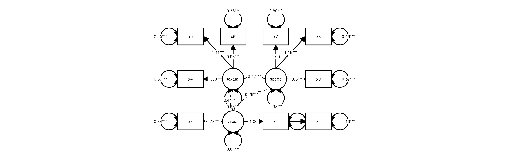

This uses a default layout. However, the node placement is not very aesthetically pleasing. One of the areas where `tidySEM` really excels is customization. Because every aspect of the graph is represented as tidy data (basically, a spreadsheet), it is easy to move nodes around and create a custom layout.

### Optional step 3: Customizing the layout

In `tidySEM`, the layout is specified as a matrix (grid) with node names and empty spaces (`NA` or `""`). There are essentially three ways to specify the layout:

1. Automatically, from the fit model
2. Manually in R
3. In a spreadsheet program

#### Automatically generate layout for a model

The example above used an automatically generated layout for the fit model (`lavaan` or `Mplus`).
If you open the help file for the function by running `?graph_sem`,
you can see that the default argument is `layout = get_layout(x = model)`, where model refers to the `model` argument of the same function.

The `get_layout()` function automatically generates a layout for a fit model object.
To get this layout as a matrix, you can run:


``` r
get_layout(fit)
#>      [,1] [,2]      [,3]     [,4]
#> [1,] "x4" "x5"      "x6"     "x1"
#> [2,] "x8" "textual" "visual" "x2"
#> [3,] "x9" "speed"   "x7"     "x3"
#> attr(,"class")
#> [1] "layout_matrix" "matrix"        "array"
```


The `get_layout()` function relies on the Fruchterman Reingold algorithm to place the nodes.
If the `igraph` package is installed, its layout algorithms can be used by specifying the `layout_algorithm = ...` argument:


``` r
if(requireNamespace("igraph", quietly = TRUE)){
  get_layout(fit, layout_algorithm = "layout_in_circle")
  get_layout(fit, layout_algorithm = "layout_on_grid")
}
```

#### Specifying layout manually in R

Manually specifying the layout can be done by providing node names and empty spaces (`NA` or `""`), and the number of rows of the desired layout matrix. For example: 


``` r
get_layout("c", NA,  "d",
           NA,  "e", NA, rows = 2)
#>      [,1] [,2] [,3]
#> [1,] "c"  NA   "d" 
#> [2,] NA   "e"  NA  
#> attr(,"class")
#> [1] "layout_matrix" "matrix"        "array"
```

Of course, it is also possible to simply define a matrix using `matrix()`.

#### Specifying layout in a spreadsheet program

Specifying the layout in a spreadsheet program is very user-friendly, because one can visually position the nodes, e.g.:

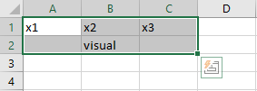

To obtain the layout matrix, one can save the spreadsheet as `.csv` file and load it in R like this:


``` r
read.csv("example.csv")
```


Alternatively, one can select the layout as in the image above, copy it to the clipboard, and then read it into R from the clipboard. This works differently on Windows and Mac.

On Windows, run:


``` r
read.table("clipboard", sep = "\t")
```

On Mac, run:


``` r
read.table(pipe("pbpaste"), sep="\t")
```


### Examples of user-defined layout

We can specify a simple layout for two hypothetical nodes `x` and `y` is generated as follows:


``` r
get_layout("x", "y", rows = 1)
#>      [,1] [,2]
#> [1,] "x"  "y" 
#> attr(,"class")
#> [1] "layout_matrix" "matrix"        "array"
```

For a mediation model, one might specify a layout like this:


``` r
get_layout("", "m", "",
           "x", "", "y", rows = 2)
#>      [,1] [,2] [,3]
#> [1,] ""   "m"  ""  
#> [2,] "x"  ""   "y" 
#> attr(,"class")
#> [1] "layout_matrix" "matrix"        "array"
```

For a three-item CFA model, one might specify:


``` r
get_layout("", "F", "",
           "y1", "y2", "y3", rows = 2)
#>      [,1] [,2] [,3]
#> [1,] ""   "F"  ""  
#> [2,] "y1" "y2" "y3"
#> attr(,"class")
#> [1] "layout_matrix" "matrix"        "array"
```

And for the CFA model we estimated above:


``` r
lay <- get_layout("", "", "visual","","textual","","speed","", "",
                  "x1", "x2", "x3", "x4", "x5", "x6", "x7", "x8", "x9", rows = 2)
```

We could plot the CFA model with this custom layout as follows:


``` r
graph_sem(fit, layout = lay)
```
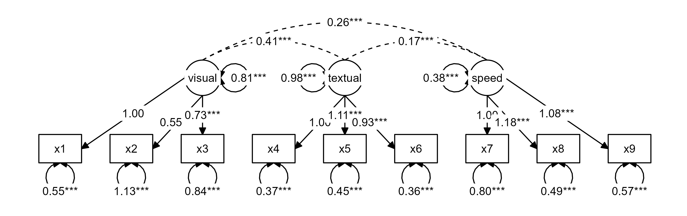

### Step 4: Customize nodes and edges

For the simple model above, it is easy to verify the names of the nodes and edges from the syntax above: The nodes consist of three latent variables (visual, textual, and speed), and nine observed variables (x1-x9). The edges are nine factor loadings - and three latent variable correlations, included by default. We can confirm which nodes are available by running `get_nodes()`:


``` r
get_nodes(fit)
#>       name shape   label
#> 1   visual  oval  visual
#> 2  textual  oval textual
#> 3    speed  oval   speed
#> 4       x1  rect      x1
#> 5       x2  rect      x2
#> 6       x3  rect      x3
#> 7       x4  rect      x4
#> 8       x5  rect      x5
#> 9       x6  rect      x6
#> 10      x7  rect      x7
#> 11      x8  rect      x8
#> 12      x9  rect      x9
```


And for the edges:


``` r
get_edges(fit)
#>       from      to arrow   label connect_from connect_to
#> 1   visual      x1  last    1.00           NA         NA
#> 2   visual      x2  last 0.55***           NA         NA
#> 3   visual      x3  last 0.73***           NA         NA
#> 4  textual      x4  last    1.00           NA         NA
#> 5  textual      x5  last 1.11***           NA         NA
#> 6  textual      x6  last 0.93***           NA         NA
#> 7    speed      x7  last    1.00           NA         NA
#> 8    speed      x8  last 1.18***           NA         NA
#> 9    speed      x9  last 1.08***           NA         NA
#> 10      x1      x1  both 0.55***           NA         NA
#> 11      x2      x2  both 1.13***           NA         NA
#> 12      x3      x3  both 0.84***           NA         NA
#> 13      x4      x4  both 0.37***           NA         NA
#> 14      x5      x5  both 0.45***           NA         NA
#> 15      x6      x6  both 0.36***           NA         NA
#> 16      x7      x7  both 0.80***           NA         NA
#> 17      x8      x8  both 0.49***           NA         NA
#> 18      x9      x9  both 0.57***           NA         NA
#> 19  visual  visual  both 0.81***           NA         NA
#> 20 textual textual  both 0.98***           NA         NA
#> 21   speed   speed  both 0.38***           NA         NA
#> 22  visual textual  none 0.41***           NA         NA
#> 23  visual   speed  none 0.26***           NA         NA
#> 24 textual   speed  none 0.17***           NA         NA
#>    curvature linetype     lhs op     rhs  est   se pval
#> 1         NA        1  visual =~      x1 1.00 0.00 <NA>
#> 2         NA        1  visual =~      x2 0.55 0.10 0.00
#> 3         NA        1  visual =~      x3 0.73 0.11 0.00
#> 4         NA        1 textual =~      x4 1.00 0.00 <NA>
#> 5         NA        1 textual =~      x5 1.11 0.07 0.00
#> 6         NA        1 textual =~      x6 0.93 0.06 0.00
#> 7         NA        1   speed =~      x7 1.00 0.00 <NA>
#> 8         NA        1   speed =~      x8 1.18 0.16 0.00
#> 9         NA        1   speed =~      x9 1.08 0.15 0.00
#> 10        NA        1      x1 ~~      x1 0.55 0.11 0.00
#> 11        NA        1      x2 ~~      x2 1.13 0.10 0.00
#> 12        NA        1      x3 ~~      x3 0.84 0.09 0.00
#> 13        NA        1      x4 ~~      x4 0.37 0.05 0.00
#> 14        NA        1      x5 ~~      x5 0.45 0.06 0.00
#> 15        NA        1      x6 ~~      x6 0.36 0.04 0.00
#> 16        NA        1      x7 ~~      x7 0.80 0.08 0.00
#> 17        NA        1      x8 ~~      x8 0.49 0.07 0.00
#> 18        NA        1      x9 ~~      x9 0.57 0.07 0.00
#> 19        NA        1  visual ~~  visual 0.81 0.15 0.00
#> 20        NA        1 textual ~~ textual 0.98 0.11 0.00
#> 21        NA        1   speed ~~   speed 0.38 0.09 0.00
#> 22        60        2  visual ~~ textual 0.41 0.07 0.00
#> 23        60        2  visual ~~   speed 0.26 0.06 0.00
#> 24        60        2 textual ~~   speed 0.17 0.05 0.00
#>         confint est_sig est_std se_std pval_std  confint_std
#> 1  [1.00, 1.00]    1.00    0.77   0.05     0.00 [0.66, 0.88]
#> 2  [0.36, 0.75] 0.55***    0.42   0.06     0.00 [0.31, 0.54]
#> 3  [0.52, 0.94] 0.73***    0.58   0.06     0.00 [0.47, 0.69]
#> 4  [1.00, 1.00]    1.00    0.85   0.02     0.00 [0.81, 0.90]
#> 5  [0.98, 1.24] 1.11***    0.86   0.02     0.00 [0.81, 0.90]
#> 6  [0.82, 1.03] 0.93***    0.84   0.02     0.00 [0.79, 0.88]
#> 7  [1.00, 1.00]    1.00    0.57   0.05     0.00 [0.47, 0.67]
#> 8  [0.86, 1.50] 1.18***    0.72   0.05     0.00 [0.62, 0.82]
#> 9  [0.79, 1.38] 1.08***    0.67   0.05     0.00 [0.56, 0.77]
#> 10 [0.33, 0.77] 0.55***    0.40   0.08     0.00 [0.24, 0.57]
#> 11 [0.93, 1.33] 1.13***    0.82   0.05     0.00 [0.72, 0.92]
#> 12 [0.67, 1.02] 0.84***    0.66   0.06     0.00 [0.54, 0.79]
#> 13 [0.28, 0.46] 0.37***    0.27   0.04     0.00 [0.20, 0.35]
#> 14 [0.33, 0.56] 0.45***    0.27   0.04     0.00 [0.19, 0.34]
#> 15 [0.27, 0.44] 0.36***    0.30   0.04     0.00 [0.22, 0.37]
#> 16 [0.64, 0.96] 0.80***    0.68   0.06     0.00 [0.56, 0.79]
#> 17 [0.34, 0.63] 0.49***    0.48   0.07     0.00 [0.33, 0.62]
#> 18 [0.43, 0.70] 0.57***    0.56   0.07     0.00 [0.42, 0.69]
#> 19 [0.52, 1.09] 0.81***    1.00   0.00     <NA> [1.00, 1.00]
#> 20 [0.76, 1.20] 0.98***    1.00   0.00     <NA> [1.00, 1.00]
#> 21 [0.21, 0.55] 0.38***    1.00   0.00     <NA> [1.00, 1.00]
#> 22 [0.26, 0.55] 0.41***    0.46   0.06     0.00 [0.33, 0.58]
#> 23 [0.15, 0.37] 0.26***    0.47   0.07     0.00 [0.33, 0.61]
#> 24 [0.08, 0.27] 0.17***    0.28   0.07     0.00 [0.15, 0.42]
#>    est_sig_std       label_results show
#> 1      0.77***        visual.BY.x1 TRUE
#> 2      0.42***        visual.BY.x2 TRUE
#> 3      0.58***        visual.BY.x3 TRUE
#> 4      0.85***       textual.BY.x4 TRUE
#> 5      0.86***       textual.BY.x5 TRUE
#> 6      0.84***       textual.BY.x6 TRUE
#> 7      0.57***         speed.BY.x7 TRUE
#> 8      0.72***         speed.BY.x8 TRUE
#> 9      0.67***         speed.BY.x9 TRUE
#> 10     0.40***        Variances.x1 TRUE
#> 11     0.82***        Variances.x2 TRUE
#> 12     0.66***        Variances.x3 TRUE
#> 13     0.27***        Variances.x4 TRUE
#> 14     0.27***        Variances.x5 TRUE
#> 15     0.30***        Variances.x6 TRUE
#> 16     0.68***        Variances.x7 TRUE
#> 17     0.48***        Variances.x8 TRUE
#> 18     0.56***        Variances.x9 TRUE
#> 19        1.00    Variances.visual TRUE
#> 20        1.00   Variances.textual TRUE
#> 21        1.00     Variances.speed TRUE
#> 22     0.46*** visual.WITH.textual TRUE
#> 23     0.47***   visual.WITH.speed TRUE
#> 24     0.28***  textual.WITH.speed TRUE
```

Note that only the first few columns are used for plotting (specifically, `from`, `to`, `arrow`, `label`, `connect_from`, `connect_to`, and `curvature`).
The remaining columns correspond to the output of `table_results(fit)`.
These auxiliary columns can be used to conditionally customize the graph (e.g., changing the color or linetype for significant paths only).

#### Customizing node and edge labels

The `get_nodes()` and `get_edges()` functions both call `table_results()` on the fit model object to get information about the nodes and edges.
Both functions have a `label` argument which can either be a character string referencing a column of the output of `table_results()`, or an expression that is evaluated in the context of that output.

This allows you to customize node and edge labels. For example, maybe you want to combine the parameter estimate and its confidence interval into an edge label:


``` r
get_edges(fit, label = paste(est, confint))
#>       from      to arrow             label connect_from
#> 1   visual      x1  last 1.00 [1.00, 1.00]           NA
#> 2   visual      x2  last 0.55 [0.36, 0.75]           NA
#> 3   visual      x3  last 0.73 [0.52, 0.94]           NA
#> 4  textual      x4  last 1.00 [1.00, 1.00]           NA
#> 5  textual      x5  last 1.11 [0.98, 1.24]           NA
#> 6  textual      x6  last 0.93 [0.82, 1.03]           NA
#> 7    speed      x7  last 1.00 [1.00, 1.00]           NA
#> 8    speed      x8  last 1.18 [0.86, 1.50]           NA
#> 9    speed      x9  last 1.08 [0.79, 1.38]           NA
#> 10      x1      x1  both 0.55 [0.33, 0.77]           NA
#> 11      x2      x2  both 1.13 [0.93, 1.33]           NA
#> 12      x3      x3  both 0.84 [0.67, 1.02]           NA
#> 13      x4      x4  both 0.37 [0.28, 0.46]           NA
#> 14      x5      x5  both 0.45 [0.33, 0.56]           NA
#> 15      x6      x6  both 0.36 [0.27, 0.44]           NA
#> 16      x7      x7  both 0.80 [0.64, 0.96]           NA
#> 17      x8      x8  both 0.49 [0.34, 0.63]           NA
#> 18      x9      x9  both 0.57 [0.43, 0.70]           NA
#> 19  visual  visual  both 0.81 [0.52, 1.09]           NA
#> 20 textual textual  both 0.98 [0.76, 1.20]           NA
#> 21   speed   speed  both 0.38 [0.21, 0.55]           NA
#> 22  visual textual  none 0.41 [0.26, 0.55]           NA
#> 23  visual   speed  none 0.26 [0.15, 0.37]           NA
#> 24 textual   speed  none 0.17 [0.08, 0.27]           NA
#>    connect_to curvature linetype     lhs op     rhs  est   se
#> 1          NA        NA        1  visual =~      x1 1.00 0.00
#> 2          NA        NA        1  visual =~      x2 0.55 0.10
#> 3          NA        NA        1  visual =~      x3 0.73 0.11
#> 4          NA        NA        1 textual =~      x4 1.00 0.00
#> 5          NA        NA        1 textual =~      x5 1.11 0.07
#> 6          NA        NA        1 textual =~      x6 0.93 0.06
#> 7          NA        NA        1   speed =~      x7 1.00 0.00
#> 8          NA        NA        1   speed =~      x8 1.18 0.16
#> 9          NA        NA        1   speed =~      x9 1.08 0.15
#> 10         NA        NA        1      x1 ~~      x1 0.55 0.11
#> 11         NA        NA        1      x2 ~~      x2 1.13 0.10
#> 12         NA        NA        1      x3 ~~      x3 0.84 0.09
#> 13         NA        NA        1      x4 ~~      x4 0.37 0.05
#> 14         NA        NA        1      x5 ~~      x5 0.45 0.06
#> 15         NA        NA        1      x6 ~~      x6 0.36 0.04
#> 16         NA        NA        1      x7 ~~      x7 0.80 0.08
#> 17         NA        NA        1      x8 ~~      x8 0.49 0.07
#> 18         NA        NA        1      x9 ~~      x9 0.57 0.07
#> 19         NA        NA        1  visual ~~  visual 0.81 0.15
#> 20         NA        NA        1 textual ~~ textual 0.98 0.11
#> 21         NA        NA        1   speed ~~   speed 0.38 0.09
#> 22         NA        60        2  visual ~~ textual 0.41 0.07
#> 23         NA        60        2  visual ~~   speed 0.26 0.06
#> 24         NA        60        2 textual ~~   speed 0.17 0.05
#>    pval      confint est_sig est_std se_std pval_std  confint_std
#> 1  <NA> [1.00, 1.00]    1.00    0.77   0.05     0.00 [0.66, 0.88]
#> 2  0.00 [0.36, 0.75] 0.55***    0.42   0.06     0.00 [0.31, 0.54]
#> 3  0.00 [0.52, 0.94] 0.73***    0.58   0.06     0.00 [0.47, 0.69]
#> 4  <NA> [1.00, 1.00]    1.00    0.85   0.02     0.00 [0.81, 0.90]
#> 5  0.00 [0.98, 1.24] 1.11***    0.86   0.02     0.00 [0.81, 0.90]
#> 6  0.00 [0.82, 1.03] 0.93***    0.84   0.02     0.00 [0.79, 0.88]
#> 7  <NA> [1.00, 1.00]    1.00    0.57   0.05     0.00 [0.47, 0.67]
#> 8  0.00 [0.86, 1.50] 1.18***    0.72   0.05     0.00 [0.62, 0.82]
#> 9  0.00 [0.79, 1.38] 1.08***    0.67   0.05     0.00 [0.56, 0.77]
#> 10 0.00 [0.33, 0.77] 0.55***    0.40   0.08     0.00 [0.24, 0.57]
#> 11 0.00 [0.93, 1.33] 1.13***    0.82   0.05     0.00 [0.72, 0.92]
#> 12 0.00 [0.67, 1.02] 0.84***    0.66   0.06     0.00 [0.54, 0.79]
#> 13 0.00 [0.28, 0.46] 0.37***    0.27   0.04     0.00 [0.20, 0.35]
#> 14 0.00 [0.33, 0.56] 0.45***    0.27   0.04     0.00 [0.19, 0.34]
#> 15 0.00 [0.27, 0.44] 0.36***    0.30   0.04     0.00 [0.22, 0.37]
#> 16 0.00 [0.64, 0.96] 0.80***    0.68   0.06     0.00 [0.56, 0.79]
#> 17 0.00 [0.34, 0.63] 0.49***    0.48   0.07     0.00 [0.33, 0.62]
#> 18 0.00 [0.43, 0.70] 0.57***    0.56   0.07     0.00 [0.42, 0.69]
#> 19 0.00 [0.52, 1.09] 0.81***    1.00   0.00     <NA> [1.00, 1.00]
#> 20 0.00 [0.76, 1.20] 0.98***    1.00   0.00     <NA> [1.00, 1.00]
#> 21 0.00 [0.21, 0.55] 0.38***    1.00   0.00     <NA> [1.00, 1.00]
#> 22 0.00 [0.26, 0.55] 0.41***    0.46   0.06     0.00 [0.33, 0.58]
#> 23 0.00 [0.15, 0.37] 0.26***    0.47   0.07     0.00 [0.33, 0.61]
#> 24 0.00 [0.08, 0.27] 0.17***    0.28   0.07     0.00 [0.15, 0.42]
#>    est_sig_std       label_results show
#> 1      0.77***        visual.BY.x1 TRUE
#> 2      0.42***        visual.BY.x2 TRUE
#> 3      0.58***        visual.BY.x3 TRUE
#> 4      0.85***       textual.BY.x4 TRUE
#> 5      0.86***       textual.BY.x5 TRUE
#> 6      0.84***       textual.BY.x6 TRUE
#> 7      0.57***         speed.BY.x7 TRUE
#> 8      0.72***         speed.BY.x8 TRUE
#> 9      0.67***         speed.BY.x9 TRUE
#> 10     0.40***        Variances.x1 TRUE
#> 11     0.82***        Variances.x2 TRUE
#> 12     0.66***        Variances.x3 TRUE
#> 13     0.27***        Variances.x4 TRUE
#> 14     0.27***        Variances.x5 TRUE
#> 15     0.30***        Variances.x6 TRUE
#> 16     0.68***        Variances.x7 TRUE
#> 17     0.48***        Variances.x8 TRUE
#> 18     0.56***        Variances.x9 TRUE
#> 19        1.00    Variances.visual TRUE
#> 20        1.00   Variances.textual TRUE
#> 21        1.00     Variances.speed TRUE
#> 22     0.46*** visual.WITH.textual TRUE
#> 23     0.47***   visual.WITH.speed TRUE
#> 24     0.28***  textual.WITH.speed TRUE
```

We can do the same for the nodes, but note that in the previous `lavaan` model, the mean structure was **not** part of the model.
As the nodes represent means and intercepts, `table_results()` will not retrieve any parameter estimates for the nodes when the mean structure is not part of the model.
In absence of additional information about the nodes, `get_nodes()` will use the node name as a label.To remove all node labels, specify `label = NULL`.

We can re-run the model with a mean structure to get more information about the nodes:


``` r
fit <- cfa(HS.model, data=HolzingerSwineford1939, meanstructure = TRUE)
```

Running `get_nodes()` now uses the estimated means in the label:


``` r
get_nodes(fit)
#>       name shape         label     lhs op rhs  est   se pval
#> 1    speed  oval   speed\n0.00   speed ~1     0.00 0.00 <NA>
#> 2  textual  oval textual\n0.00 textual ~1     0.00 0.00 <NA>
#> 3   visual  oval  visual\n0.00  visual ~1     0.00 0.00 <NA>
#> 4       x1  rect   x1\n4.94***      x1 ~1     4.94 0.07 0.00
#> 5       x2  rect   x2\n6.09***      x2 ~1     6.09 0.07 0.00
#> 6       x3  rect   x3\n2.25***      x3 ~1     2.25 0.07 0.00
#> 7       x4  rect   x4\n3.06***      x4 ~1     3.06 0.07 0.00
#> 8       x5  rect   x5\n4.34***      x5 ~1     4.34 0.07 0.00
#> 9       x6  rect   x6\n2.19***      x6 ~1     2.19 0.06 0.00
#> 10      x7  rect   x7\n4.19***      x7 ~1     4.19 0.06 0.00
#> 11      x8  rect   x8\n5.53***      x8 ~1     5.53 0.06 0.00
#> 12      x9  rect   x9\n5.37***      x9 ~1     5.37 0.06 0.00
#>         confint est_sig est_std se_std pval_std  confint_std
#> 1  [0.00, 0.00]    0.00    0.00   0.00     <NA> [0.00, 0.00]
#> 2  [0.00, 0.00]    0.00    0.00   0.00     <NA> [0.00, 0.00]
#> 3  [0.00, 0.00]    0.00    0.00   0.00     <NA> [0.00, 0.00]
#> 4  [4.80, 5.07] 4.94***    4.23   0.18     0.00 [3.88, 4.59]
#> 5  [5.96, 6.22] 6.09***    5.18   0.22     0.00 [4.75, 5.61]
#> 6  [2.12, 2.38] 2.25***    1.99   0.10     0.00 [1.80, 2.19]
#> 7  [2.93, 3.19] 3.06***    2.63   0.12     0.00 [2.39, 2.87]
#> 8  [4.19, 4.49] 4.34***    3.37   0.15     0.00 [3.08, 3.66]
#> 9  [2.06, 2.31] 2.19***    2.00   0.10     0.00 [1.80, 2.19]
#> 10 [4.06, 4.31] 4.19***    3.85   0.17     0.00 [3.52, 4.18]
#> 11 [5.41, 5.64] 5.53***    5.47   0.23     0.00 [5.02, 5.92]
#> 12 [5.26, 5.49] 5.37***    5.33   0.22     0.00 [4.89, 5.78]
#>    est_sig_std label_results
#> 1         0.00   Means.speed
#> 2         0.00 Means.textual
#> 3         0.00  Means.visual
#> 4      4.23***      Means.x1
#> 5      5.18***      Means.x2
#> 6      1.99***      Means.x3
#> 7      2.63***      Means.x4
#> 8      3.37***      Means.x5
#> 9      2.00***      Means.x6
#> 10     3.85***      Means.x7
#> 11     5.47***      Means.x8
#> 12     5.33***      Means.x9
```

These labels can be further customized as shown below:


``` r
get_nodes(fit, label = paste0(name, "\n", est, " ", confint))
#>       name shape                      label     lhs op rhs  est
#> 1    speed  oval   speed\n0.00 [0.00, 0.00]   speed ~1     0.00
#> 2  textual  oval textual\n0.00 [0.00, 0.00] textual ~1     0.00
#> 3   visual  oval  visual\n0.00 [0.00, 0.00]  visual ~1     0.00
#> 4       x1  rect      x1\n4.94 [4.80, 5.07]      x1 ~1     4.94
#> 5       x2  rect      x2\n6.09 [5.96, 6.22]      x2 ~1     6.09
#> 6       x3  rect      x3\n2.25 [2.12, 2.38]      x3 ~1     2.25
#> 7       x4  rect      x4\n3.06 [2.93, 3.19]      x4 ~1     3.06
#> 8       x5  rect      x5\n4.34 [4.19, 4.49]      x5 ~1     4.34
#> 9       x6  rect      x6\n2.19 [2.06, 2.31]      x6 ~1     2.19
#> 10      x7  rect      x7\n4.19 [4.06, 4.31]      x7 ~1     4.19
#> 11      x8  rect      x8\n5.53 [5.41, 5.64]      x8 ~1     5.53
#> 12      x9  rect      x9\n5.37 [5.26, 5.49]      x9 ~1     5.37
#>      se pval      confint est_sig est_std se_std pval_std
#> 1  0.00 <NA> [0.00, 0.00]    0.00    0.00   0.00     <NA>
#> 2  0.00 <NA> [0.00, 0.00]    0.00    0.00   0.00     <NA>
#> 3  0.00 <NA> [0.00, 0.00]    0.00    0.00   0.00     <NA>
#> 4  0.07 0.00 [4.80, 5.07] 4.94***    4.23   0.18     0.00
#> 5  0.07 0.00 [5.96, 6.22] 6.09***    5.18   0.22     0.00
#> 6  0.07 0.00 [2.12, 2.38] 2.25***    1.99   0.10     0.00
#> 7  0.07 0.00 [2.93, 3.19] 3.06***    2.63   0.12     0.00
#> 8  0.07 0.00 [4.19, 4.49] 4.34***    3.37   0.15     0.00
#> 9  0.06 0.00 [2.06, 2.31] 2.19***    2.00   0.10     0.00
#> 10 0.06 0.00 [4.06, 4.31] 4.19***    3.85   0.17     0.00
#> 11 0.06 0.00 [5.41, 5.64] 5.53***    5.47   0.23     0.00
#> 12 0.06 0.00 [5.26, 5.49] 5.37***    5.33   0.22     0.00
#>     confint_std est_sig_std label_results
#> 1  [0.00, 0.00]        0.00   Means.speed
#> 2  [0.00, 0.00]        0.00 Means.textual
#> 3  [0.00, 0.00]        0.00  Means.visual
#> 4  [3.88, 4.59]     4.23***      Means.x1
#> 5  [4.75, 5.61]     5.18***      Means.x2
#> 6  [1.80, 2.19]     1.99***      Means.x3
#> 7  [2.39, 2.87]     2.63***      Means.x4
#> 8  [3.08, 3.66]     3.37***      Means.x5
#> 9  [1.80, 2.19]     2.00***      Means.x6
#> 10 [3.52, 4.18]     3.85***      Means.x7
#> 11 [5.02, 5.92]     5.47***      Means.x8
#> 12 [4.89, 5.78]     5.33***      Means.x9
```

#### Customize labels of a `sem_graph`

Instead of customizing the node and edge labels in the call to `get_nodes()` and `get_edges()`,
it is also possible to use the auxiliary columns in the `nodes` and `edges` elements of a `sem_graph` object to customize the labels (or other properties of the plot) later.
First, let's generate a `sem_graph` object and examine the `edges` element:
<!-- Refer back to the output above of `get_edges(fit)` to see that, by default, -->
<!-- all columns returned by `table_results()` are included. -->
<!-- Let's use these columns  -->


``` r
p <- prepare_graph(fit)
edges(p)
#>       from      to arrow   label connect_from connect_to
#> 1   visual      x1  last    1.00         left      right
#> 2   visual      x2  last 0.55***         left      right
#> 3   visual      x3  last 0.73***         left      right
#> 4  textual      x4  last    1.00        right       left
#> 5  textual      x5  last 1.11***        right       left
#> 6  textual      x6  last 0.93***        right       left
#> 7    speed      x7  last    1.00        right       left
#> 8    speed      x8  last 1.18***        right       left
#> 9    speed      x9  last 1.08***         left      right
#> 10      x1      x1  both 0.55***         left       left
#> 11      x2      x2  both 1.13***         left       left
#> 12      x3      x3  both 0.84***         left       left
#> 13      x4      x4  both 0.37***        right      right
#> 14      x5      x5  both 0.45***        right      right
#> 15      x6      x6  both 0.36***        right      right
#> 16      x7      x7  both 0.80***        right      right
#> 17      x8      x8  both 0.49***        right      right
#> 18      x9      x9  both 0.57***         left       left
#> 19  visual  visual  both 0.81***       bottom     bottom
#> 20 textual textual  both 0.98***       bottom     bottom
#> 21   speed   speed  both 0.38***       bottom     bottom
#> 22  visual textual  none 0.41***        right       left
#> 23  visual   speed  none 0.26***        right       left
#> 24 textual   speed  none 0.17***         left      right
#>    curvature linetype     lhs op     rhs  est   se pval
#> 1         NA        1  visual =~      x1 1.00 0.00 <NA>
#> 2         NA        1  visual =~      x2 0.55 0.10 0.00
#> 3         NA        1  visual =~      x3 0.73 0.11 0.00
#> 4         NA        1 textual =~      x4 1.00 0.00 <NA>
#> 5         NA        1 textual =~      x5 1.11 0.07 0.00
#> 6         NA        1 textual =~      x6 0.93 0.06 0.00
#> 7         NA        1   speed =~      x7 1.00 0.00 <NA>
#> 8         NA        1   speed =~      x8 1.18 0.16 0.00
#> 9         NA        1   speed =~      x9 1.08 0.15 0.00
#> 10        NA        1      x1 ~~      x1 0.55 0.11 0.00
#> 11        NA        1      x2 ~~      x2 1.13 0.10 0.00
#> 12        NA        1      x3 ~~      x3 0.84 0.09 0.00
#> 13        NA        1      x4 ~~      x4 0.37 0.05 0.00
#> 14        NA        1      x5 ~~      x5 0.45 0.06 0.00
#> 15        NA        1      x6 ~~      x6 0.36 0.04 0.00
#> 16        NA        1      x7 ~~      x7 0.80 0.08 0.00
#> 17        NA        1      x8 ~~      x8 0.49 0.07 0.00
#> 18        NA        1      x9 ~~      x9 0.57 0.07 0.00
#> 19        NA        1  visual ~~  visual 0.81 0.15 0.00
#> 20        NA        1 textual ~~ textual 0.98 0.11 0.00
#> 21        NA        1   speed ~~   speed 0.38 0.09 0.00
#> 22        60        2  visual ~~ textual 0.41 0.07 0.00
#> 23        60        2  visual ~~   speed 0.26 0.06 0.00
#> 24        60        2 textual ~~   speed 0.17 0.05 0.00
#>         confint est_sig est_std se_std pval_std  confint_std
#> 1  [1.00, 1.00]    1.00    0.77   0.05     0.00 [0.66, 0.88]
#> 2  [0.36, 0.75] 0.55***    0.42   0.06     0.00 [0.31, 0.54]
#> 3  [0.52, 0.94] 0.73***    0.58   0.06     0.00 [0.47, 0.69]
#> 4  [1.00, 1.00]    1.00    0.85   0.02     0.00 [0.81, 0.90]
#> 5  [0.98, 1.24] 1.11***    0.86   0.02     0.00 [0.81, 0.90]
#> 6  [0.82, 1.03] 0.93***    0.84   0.02     0.00 [0.79, 0.88]
#> 7  [1.00, 1.00]    1.00    0.57   0.05     0.00 [0.47, 0.67]
#> 8  [0.86, 1.50] 1.18***    0.72   0.05     0.00 [0.62, 0.82]
#> 9  [0.79, 1.38] 1.08***    0.67   0.05     0.00 [0.56, 0.77]
#> 10 [0.33, 0.77] 0.55***    0.40   0.08     0.00 [0.24, 0.57]
#> 11 [0.93, 1.33] 1.13***    0.82   0.05     0.00 [0.72, 0.92]
#> 12 [0.67, 1.02] 0.84***    0.66   0.06     0.00 [0.54, 0.79]
#> 13 [0.28, 0.46] 0.37***    0.27   0.04     0.00 [0.20, 0.35]
#> 14 [0.33, 0.56] 0.45***    0.27   0.04     0.00 [0.19, 0.34]
#> 15 [0.27, 0.44] 0.36***    0.30   0.04     0.00 [0.22, 0.37]
#> 16 [0.64, 0.96] 0.80***    0.68   0.06     0.00 [0.56, 0.79]
#> 17 [0.34, 0.63] 0.49***    0.48   0.07     0.00 [0.33, 0.62]
#> 18 [0.43, 0.70] 0.57***    0.56   0.07     0.00 [0.42, 0.69]
#> 19 [0.52, 1.09] 0.81***    1.00   0.00     <NA> [1.00, 1.00]
#> 20 [0.76, 1.20] 0.98***    1.00   0.00     <NA> [1.00, 1.00]
#> 21 [0.21, 0.55] 0.38***    1.00   0.00     <NA> [1.00, 1.00]
#> 22 [0.26, 0.55] 0.41***    0.46   0.06     0.00 [0.33, 0.58]
#> 23 [0.15, 0.37] 0.26***    0.47   0.07     0.00 [0.33, 0.61]
#> 24 [0.08, 0.27] 0.17***    0.28   0.07     0.00 [0.15, 0.42]
#>    est_sig_std       label_results show
#> 1      0.77***        visual.BY.x1 TRUE
#> 2      0.42***        visual.BY.x2 TRUE
#> 3      0.58***        visual.BY.x3 TRUE
#> 4      0.85***       textual.BY.x4 TRUE
#> 5      0.86***       textual.BY.x5 TRUE
#> 6      0.84***       textual.BY.x6 TRUE
#> 7      0.57***         speed.BY.x7 TRUE
#> 8      0.72***         speed.BY.x8 TRUE
#> 9      0.67***         speed.BY.x9 TRUE
#> 10     0.40***        Variances.x1 TRUE
#> 11     0.82***        Variances.x2 TRUE
#> 12     0.66***        Variances.x3 TRUE
#> 13     0.27***        Variances.x4 TRUE
#> 14     0.27***        Variances.x5 TRUE
#> 15     0.30***        Variances.x6 TRUE
#> 16     0.68***        Variances.x7 TRUE
#> 17     0.48***        Variances.x8 TRUE
#> 18     0.56***        Variances.x9 TRUE
#> 19        1.00    Variances.visual TRUE
#> 20        1.00   Variances.textual TRUE
#> 21        1.00     Variances.speed TRUE
#> 22     0.46*** visual.WITH.textual TRUE
#> 23     0.47***   visual.WITH.speed TRUE
#> 24     0.28***  textual.WITH.speed TRUE
```

All of the columns in the edges element can be used to manually construct labels, using the `edit_graph()` function:


``` r
prepare_graph(fit) %>%
  edit_graph({ label = paste(est_sig_std, "\n", confint_std) }) %>%
  plot()
```

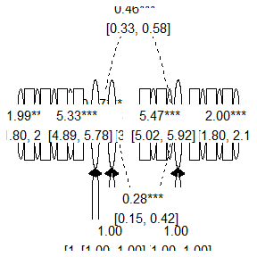<!-- -->

The same can be done for the node labels:


``` r
prepare_graph(fit) %>%
  edit_graph({ label = paste(est_sig_std, "\n", confint_std) }) %>%
  edit_graph({ label = paste(name, "\n", est_sig_std, "\n", confint_std) }, element = "nodes") %>%
  plot()
```

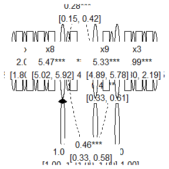<!-- -->

Note that, by specifying both `"nodes"` and `"edges")`, both nodes and edges are edited - but in the preceding example, we actually want different labels for the nodes and edges (so that node labels are shown).
For example, we can change the label color for both nodes and edges:


``` r
prepare_graph(fit) %>%
  edit_graph({ label_color = "blue" }) %>%
  plot()
```

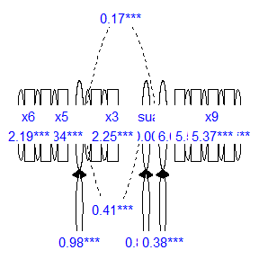<!-- -->


The section on **Visual aspects** further demonstrates how to use these auxiliary columns to customize visual properties of the graph.

### Optional step 5: accessing graph data before plotting

One important feature of `tidySEM` graphing is that the data used to compose the plot can be conveniently accessed an modified before plotting. First, use `prepare_graph()` to assign the plot data to an object.


``` r
graph_data <- prepare_graph(model = fit, layout = lay)
```

### Optional step 6: Access the nodes and edges

The nodes and edges can be examined using `nodes(graph_data)` and `edges(graph_data)`:


``` r
nodes(graph_data)
#>       name shape         label  x y node_xmin node_xmax node_ymin
#> 1    speed  oval   speed\n0.00 14 4      13.5      14.5       3.5
#> 2  textual  oval textual\n0.00 10 4       9.5      10.5       3.5
#> 3   visual  oval  visual\n0.00  6 4       5.5       6.5       3.5
#> 4       x1  rect   x1\n4.94***  2 2       1.4       2.6       1.6
#> 5       x2  rect   x2\n6.09***  4 2       3.4       4.6       1.6
#> 6       x3  rect   x3\n2.25***  6 2       5.4       6.6       1.6
#> 7       x4  rect   x4\n3.06***  8 2       7.4       8.6       1.6
#> 8       x5  rect   x5\n4.34*** 10 2       9.4      10.6       1.6
#> 9       x6  rect   x6\n2.19*** 12 2      11.4      12.6       1.6
#> 10      x7  rect   x7\n4.19*** 14 2      13.4      14.6       1.6
#> 11      x8  rect   x8\n5.53*** 16 2      15.4      16.6       1.6
#> 12      x9  rect   x9\n5.37*** 18 2      17.4      18.6       1.6
#>    node_ymax     lhs op rhs  est   se pval      confint est_sig
#> 1        4.5   speed ~1     0.00 0.00 <NA> [0.00, 0.00]    0.00
#> 2        4.5 textual ~1     0.00 0.00 <NA> [0.00, 0.00]    0.00
#> 3        4.5  visual ~1     0.00 0.00 <NA> [0.00, 0.00]    0.00
#> 4        2.4      x1 ~1     4.94 0.07 0.00 [4.80, 5.07] 4.94***
#> 5        2.4      x2 ~1     6.09 0.07 0.00 [5.96, 6.22] 6.09***
#> 6        2.4      x3 ~1     2.25 0.07 0.00 [2.12, 2.38] 2.25***
#> 7        2.4      x4 ~1     3.06 0.07 0.00 [2.93, 3.19] 3.06***
#> 8        2.4      x5 ~1     4.34 0.07 0.00 [4.19, 4.49] 4.34***
#> 9        2.4      x6 ~1     2.19 0.06 0.00 [2.06, 2.31] 2.19***
#> 10       2.4      x7 ~1     4.19 0.06 0.00 [4.06, 4.31] 4.19***
#> 11       2.4      x8 ~1     5.53 0.06 0.00 [5.41, 5.64] 5.53***
#> 12       2.4      x9 ~1     5.37 0.06 0.00 [5.26, 5.49] 5.37***
#>    est_std se_std pval_std  confint_std est_sig_std label_results
#> 1     0.00   0.00     <NA> [0.00, 0.00]        0.00   Means.speed
#> 2     0.00   0.00     <NA> [0.00, 0.00]        0.00 Means.textual
#> 3     0.00   0.00     <NA> [0.00, 0.00]        0.00  Means.visual
#> 4     4.23   0.18     0.00 [3.88, 4.59]     4.23***      Means.x1
#> 5     5.18   0.22     0.00 [4.75, 5.61]     5.18***      Means.x2
#> 6     1.99   0.10     0.00 [1.80, 2.19]     1.99***      Means.x3
#> 7     2.63   0.12     0.00 [2.39, 2.87]     2.63***      Means.x4
#> 8     3.37   0.15     0.00 [3.08, 3.66]     3.37***      Means.x5
#> 9     2.00   0.10     0.00 [1.80, 2.19]     2.00***      Means.x6
#> 10    3.85   0.17     0.00 [3.52, 4.18]     3.85***      Means.x7
#> 11    5.47   0.23     0.00 [5.02, 5.92]     5.47***      Means.x8
#> 12    5.33   0.22     0.00 [4.89, 5.78]     5.33***      Means.x9
#>    show
#> 1  TRUE
#> 2  TRUE
#> 3  TRUE
#> 4  TRUE
#> 5  TRUE
#> 6  TRUE
#> 7  TRUE
#> 8  TRUE
#> 9  TRUE
#> 10 TRUE
#> 11 TRUE
#> 12 TRUE
edges(graph_data)
#>       from      to arrow   label connect_from connect_to
#> 1   visual      x1  last    1.00         left      right
#> 2   visual      x2  last 0.55***       bottom      right
#> 3   visual      x3  last 0.73***       bottom        top
#> 4  textual      x4  last    1.00       bottom      right
#> 5  textual      x5  last 1.11***       bottom        top
#> 6  textual      x6  last 0.93***       bottom       left
#> 7    speed      x7  last    1.00       bottom        top
#> 8    speed      x8  last 1.18***       bottom       left
#> 9    speed      x9  last 1.08***        right       left
#> 10      x1      x1  both 0.55***         left       left
#> 11      x2      x2  both 1.13***         left       left
#> 12      x3      x3  both 0.84***       bottom     bottom
#> 13      x4      x4  both 0.37***         left       left
#> 14      x5      x5  both 0.45***       bottom     bottom
#> 15      x6      x6  both 0.36***        right      right
#> 16      x7      x7  both 0.80***       bottom     bottom
#> 17      x8      x8  both 0.49***        right      right
#> 18      x9      x9  both 0.57***        right      right
#> 19  visual  visual  both 0.81***          top        top
#> 20 textual textual  both 0.98***          top        top
#> 21   speed   speed  both 0.38***          top        top
#> 22  visual textual  none 0.41***        right       left
#> 23  visual   speed  none 0.26***        right       left
#> 24 textual   speed  none 0.17***        right       left
#>    curvature linetype     lhs op     rhs  est   se pval
#> 1         NA        1  visual =~      x1 1.00 0.00 <NA>
#> 2         NA        1  visual =~      x2 0.55 0.10 0.00
#> 3         NA        1  visual =~      x3 0.73 0.11 0.00
#> 4         NA        1 textual =~      x4 1.00 0.00 <NA>
#> 5         NA        1 textual =~      x5 1.11 0.07 0.00
#> 6         NA        1 textual =~      x6 0.93 0.06 0.00
#> 7         NA        1   speed =~      x7 1.00 0.00 <NA>
#> 8         NA        1   speed =~      x8 1.18 0.16 0.00
#> 9         NA        1   speed =~      x9 1.08 0.15 0.00
#> 10        NA        1      x1 ~~      x1 0.55 0.11 0.00
#> 11        NA        1      x2 ~~      x2 1.13 0.10 0.00
#> 12        NA        1      x3 ~~      x3 0.84 0.09 0.00
#> 13        NA        1      x4 ~~      x4 0.37 0.05 0.00
#> 14        NA        1      x5 ~~      x5 0.45 0.06 0.00
#> 15        NA        1      x6 ~~      x6 0.36 0.04 0.00
#> 16        NA        1      x7 ~~      x7 0.80 0.08 0.00
#> 17        NA        1      x8 ~~      x8 0.49 0.07 0.00
#> 18        NA        1      x9 ~~      x9 0.57 0.07 0.00
#> 19        NA        1  visual ~~  visual 0.81 0.15 0.00
#> 20        NA        1 textual ~~ textual 0.98 0.11 0.00
#> 21        NA        1   speed ~~   speed 0.38 0.09 0.00
#> 22        60        2  visual ~~ textual 0.41 0.07 0.00
#> 23        60        2  visual ~~   speed 0.26 0.06 0.00
#> 24        60        2 textual ~~   speed 0.17 0.05 0.00
#>         confint est_sig est_std se_std pval_std  confint_std
#> 1  [1.00, 1.00]    1.00    0.77   0.05     0.00 [0.66, 0.88]
#> 2  [0.36, 0.75] 0.55***    0.42   0.06     0.00 [0.31, 0.54]
#> 3  [0.52, 0.94] 0.73***    0.58   0.06     0.00 [0.47, 0.69]
#> 4  [1.00, 1.00]    1.00    0.85   0.02     0.00 [0.81, 0.90]
#> 5  [0.98, 1.24] 1.11***    0.86   0.02     0.00 [0.81, 0.90]
#> 6  [0.82, 1.03] 0.93***    0.84   0.02     0.00 [0.79, 0.88]
#> 7  [1.00, 1.00]    1.00    0.57   0.05     0.00 [0.47, 0.67]
#> 8  [0.86, 1.50] 1.18***    0.72   0.05     0.00 [0.62, 0.82]
#> 9  [0.79, 1.38] 1.08***    0.67   0.05     0.00 [0.56, 0.77]
#> 10 [0.33, 0.77] 0.55***    0.40   0.08     0.00 [0.24, 0.57]
#> 11 [0.93, 1.33] 1.13***    0.82   0.05     0.00 [0.72, 0.92]
#> 12 [0.67, 1.02] 0.84***    0.66   0.06     0.00 [0.54, 0.79]
#> 13 [0.28, 0.46] 0.37***    0.27   0.04     0.00 [0.20, 0.35]
#> 14 [0.33, 0.56] 0.45***    0.27   0.04     0.00 [0.19, 0.34]
#> 15 [0.27, 0.44] 0.36***    0.30   0.04     0.00 [0.22, 0.37]
#> 16 [0.64, 0.96] 0.80***    0.68   0.06     0.00 [0.56, 0.79]
#> 17 [0.34, 0.63] 0.49***    0.48   0.07     0.00 [0.33, 0.62]
#> 18 [0.43, 0.70] 0.57***    0.56   0.07     0.00 [0.42, 0.69]
#> 19 [0.52, 1.09] 0.81***    1.00   0.00     <NA> [1.00, 1.00]
#> 20 [0.76, 1.20] 0.98***    1.00   0.00     <NA> [1.00, 1.00]
#> 21 [0.21, 0.55] 0.38***    1.00   0.00     <NA> [1.00, 1.00]
#> 22 [0.26, 0.55] 0.41***    0.46   0.06     0.00 [0.33, 0.58]
#> 23 [0.15, 0.37] 0.26***    0.47   0.07     0.00 [0.33, 0.61]
#> 24 [0.08, 0.27] 0.17***    0.28   0.07     0.00 [0.15, 0.42]
#>    est_sig_std       label_results show
#> 1      0.77***        visual.BY.x1 TRUE
#> 2      0.42***        visual.BY.x2 TRUE
#> 3      0.58***        visual.BY.x3 TRUE
#> 4      0.85***       textual.BY.x4 TRUE
#> 5      0.86***       textual.BY.x5 TRUE
#> 6      0.84***       textual.BY.x6 TRUE
#> 7      0.57***         speed.BY.x7 TRUE
#> 8      0.72***         speed.BY.x8 TRUE
#> 9      0.67***         speed.BY.x9 TRUE
#> 10     0.40***        Variances.x1 TRUE
#> 11     0.82***        Variances.x2 TRUE
#> 12     0.66***        Variances.x3 TRUE
#> 13     0.27***        Variances.x4 TRUE
#> 14     0.27***        Variances.x5 TRUE
#> 15     0.30***        Variances.x6 TRUE
#> 16     0.68***        Variances.x7 TRUE
#> 17     0.48***        Variances.x8 TRUE
#> 18     0.56***        Variances.x9 TRUE
#> 19        1.00    Variances.visual TRUE
#> 20        1.00   Variances.textual TRUE
#> 21        1.00     Variances.speed TRUE
#> 22     0.46*** visual.WITH.textual TRUE
#> 23     0.47***   visual.WITH.speed TRUE
#> 24     0.28***  textual.WITH.speed TRUE
```

### Optional step 7: Modify the nodes and edges

At this stage, we may want to improve the basic plot slightly. The functions `nodes(graph_data) <- ...` and `edges(graph_data) <- ...` can be used to modify the nodes and edges. These functions pair well with the general 'tidyverse' workflow. For example, we might want to print node labels for latent variables in *Title Case* instead of just using the variable names:


``` r
library(dplyr)
library(stringr)
#> Warning: package 'stringr' was built under R version 4.6.1
nodes(graph_data) <- nodes(graph_data) %>%
  mutate(label = str_to_title(label))
```


Now, for the edges, we see that the default edging algorithm has connected some nodes side-to-side (based on the smallest possible Euclidian distance). However, in this simple graph, it makes more sense to connect all nodes top-to-bottom - except for the latent variable covariances. We can use the same conditional replacement for the edges:


``` r
edges(graph_data) %>%
  mutate(connect_from = replace(connect_from, is.na(curvature), "bottom")) %>%
  mutate(connect_to = replace(connect_to, is.na(curvature), "top")) -> edges(graph_data)
```

### Plot the customized graph

We can plot a customized graph using `plot(graph_data)`; a generic plot method for `sem_graph` objects:


``` r
plot(graph_data)
```
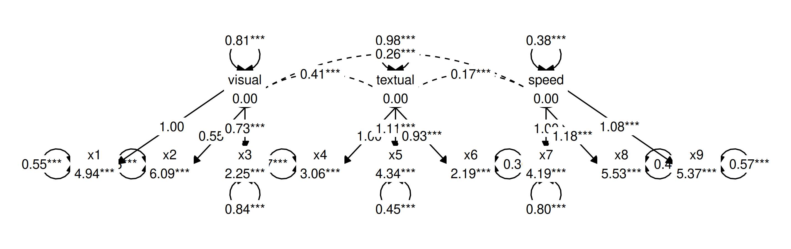

## Connecting nodes

The functions `graph_sem()` and `prepare_graph()` will always try to connect nodes in an aesthetically pleasing way. To do this, they connect nodes by one of the four sides (top, bottom, left and right), based on the shortest distance between two nodes. Alternatively, users can specify a value to the `angle` parameter. This parameter connects nodes top-to-bottom when they are within `angle` degrees above and below each other. Remaining nodes are connected side-to-side. Thus, by increasing `angle` to a larger number (up to 180 degrees), we can also ensure that all nodes are connected top to bottom:


``` r
graph_sem(model = fit, layout = lay, angle = 170)
```
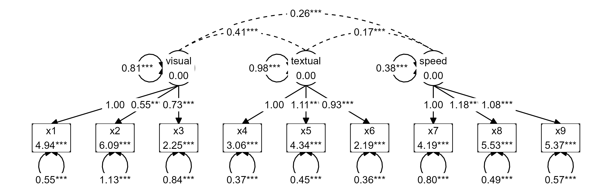

## Visual aspects

The visual aspects of graphs created using `graph_sem()` and `prepare_graph()` can be easily customized (see `?graph_sem()`).
These functions construct a graph based on a data.frame of nodes, and a data.frame of edges.
The visual aspects can be customized by adding **extra columns** to those data.frames.

### Visual aspects of edges

Edges have the following aesthetics (see `?geom_path()`):

* `linetype`: The type of line, e.g., continuous (`linetype = 1` or dashed `linetype = 2`)
* `colour` or `color`: The color of the line (e.g., `colour = "red"` or `colour = "blue"`)
* `size`: The size of the line (e.g., `size = 1` or `size = 2`)
* `alpha`: The transparency of the line (e.g., `alpha = 1` or `alpha = .2`)

These aesthetics can be customized by adding columns to the edges data.frame, whose names correspond to the aesthetics. For example:


``` r
edg <- data.frame(from = "x",
                  to = "y",
                  linetype = 2,
                  colour = "red",
                  size = 2,
                  alpha = .5)

graph_sem(edges = edg, layout = get_layout("x", "y", rows = 1))
```
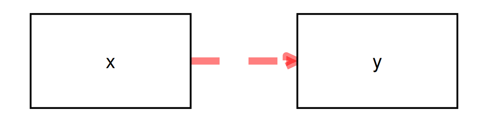

### Visual aspects of nodes

Nodes have the following aesthetics (see `?geom_polygon()`):

* `linetype`: The type of line surrounding the node, e.g., continuous (`linetype = 1` or dashed `linetype = 2`)
* `colour` or `color`: The color of the line surrounding the node (e.g., `colour = "red"` or `colour = "blue"`)
* `fill`: The interior color of the node (e.g., `colour = "red"` or `colour = "blue"`)
* `size`: The size of the line (e.g., `size = 1` or `size = 2`)
* `alpha`: The transparency of the node (e.g., `alpha = 1` or `alpha = .2`)

These, too, can be appended as extra columns to the nodes data.frame:


``` r
edg <- data.frame(from = "x",
                  to = "y")
nod <- data.frame(name = c("x", "y"),
                    shape = c("rect", "oval"),
                    linetype = c(2, 2),
                    colour = c("blue", "blue"),
                    fill = c("blue", "blue"),
                    size = c(2, 2),
                    alpha = .5)
graph_sem(edges = edg, nodes = nod, layout = get_layout("x", "y", rows = 1))
```
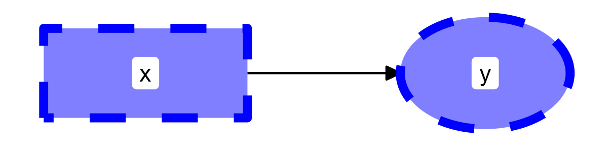

These aesthetics can also be passed to the `sem_graph` object after preparing the data, for example, for highlighting a specific model element, such as the low factor loading for x2 on visual in the CFA example from before:


``` r
edges(graph_data) %>%
  mutate(colour = "black") %>%
  mutate(colour = replace(colour, from == "visual" & to == "x2", "red")) %>%
  mutate(linetype = 1) %>%
  mutate(linetype = replace(linetype, from == "visual" & to == "x2", 2)) %>%
  mutate(alpha = 1) %>%
  mutate(alpha = replace(alpha, from == "visual" & to == "x2", .5)) -> edges(graph_data)
plot(graph_data)
```
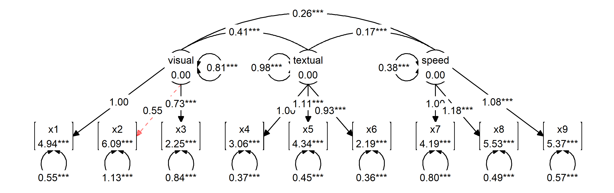

### Visual aspects of edge labels

Like nodes and edges, edge labels can be customized. Labels have the same aesthetics as the ggplot function `geom_label()` (see `?geom_label`). However, to disambiguate them from the edge aesthetics, all label aesthetics are prefaced by `"label_"`:

* `label_colour` or `label_color`: The color of the label text (e.g., `label_colour = "red"`)
* `label_fill`: The color of the rectangle behind the label text, ( e.g., `label_fill = "blue"`)
* `label_size`: The font size of the label (e.g., `label_size = 4`)
* `label_alpha`: The transparency of the label (e.g., `alpha = 1` or `alpha = .2`)
* `label_family`: The font family of the label text. By default, three are available: `"serif"`, `"sans"` and `"mono"`
* `label_fontface`: The face of the label text: `"plain"`, `"bold"`, `"italic"`, or "`bold.italic"`
* `label_hjust`: Horizontal justification of label text; either a string (`"left"`, `"center"`, `"right"`) or a number between 0 and 1 (left = 0, center = 0.5, right = 1)
* `label_vjust`: Vertical justification of label text; either a string (`"top"`, `"middle"`, `"bottom"`) or a number between 0 and 1 (top = 1, middle = 0.5, bottom = 0)
* `label_lineheight`: Line height for multiline text
* `label_location`: Where along the edge to plot the label; a number between 0 (beginning) and 1 (end)


``` r
edg <- data.frame(from = "x",
                  to = "y",
                  label = "text",
                  label_colour = "blue",
                  label_fill = "red",
                  label_size = 6,
                  label_alpha = .5,
                  label_family = "mono",
                  label_fontface = "bold",
                  label_hjust = "left",
                  label_vjust = "top",
                  label_lineheight = 1.5,
                  label_location = .2
                  )

graph_sem(edges = edg, layout = get_layout("x", "y", rows = 1))
```
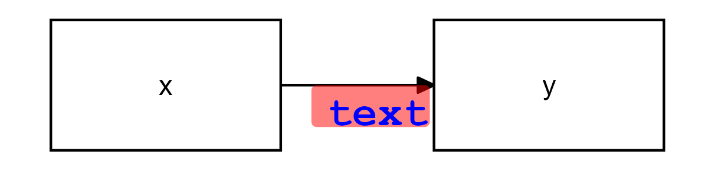

### Conditionally customize visual aspects

The functions `get_edges()` and `get_nodes()` rely on `table_results()` to
extract information about nodes and edges from SEM models.
All of the columns returned by `table_results()` can be used to conditionally
customize visual aspects of the graph.
Let's estimate a model and look at all of the columns extracted by `get_edges()`:


```
#>   from  to arrow    label connect_from connect_to curvature
#> 1  cyl mpg  last -2.50***           NA         NA        NA
#> 2   am mpg  last    2.57*           NA         NA        NA
#> 3  mpg mpg  both  8.48***           NA         NA        NA
#> 4  cyl cyl  both     3.09           NA         NA        NA
#> 5  cyl  am  none    -0.45           NA         NA        60
#> 6   am  am  both     0.24           NA         NA        NA
#>   linetype lhs op rhs   est   se pval        confint  est_sig
#> 1        1 mpg  ~ cyl -2.50 0.34 0.00 [-3.17, -1.83] -2.50***
#> 2        1 mpg  ~  am  2.57 1.23 0.04   [0.16, 4.98]    2.57*
#> 3        1 mpg ~~ mpg  8.48 2.12 0.00  [4.32, 12.64]  8.48***
#> 4        1 cyl ~~ cyl  3.09 0.00 <NA>   [3.09, 3.09]     3.09
#> 5        2 cyl ~~  am -0.45 0.00 <NA> [-0.45, -0.45]    -0.45
#> 6        1  am ~~  am  0.24 0.00 <NA>   [0.24, 0.24]     0.24
#>   est_std se_std pval_std    confint_std est_sig_std
#> 1   -0.74   0.08     0.00 [-0.89, -0.59]    -0.74***
#> 2    0.21   0.10     0.03   [0.02, 0.41]       0.21*
#> 3    0.24   0.06     0.00   [0.13, 0.36]     0.24***
#> 4    1.00   0.00     <NA>   [1.00, 1.00]        1.00
#> 5   -0.52   0.00     <NA> [-0.52, -0.52]       -0.52
#> 6    1.00   0.00     <NA>   [1.00, 1.00]        1.00
#>   label_results  show
#> 1    mpg.ON.cyl  TRUE
#> 2     mpg.ON.am  TRUE
#> 3 Variances.mpg  TRUE
#> 4 Variances.cyl FALSE
#> 5   cyl.WITH.am FALSE
#> 6  Variances.am FALSE
```

Any of these columns can be used to conditionally format the graph.
For example, note that one of the regression paths is positive and the other negative.
We might want to color positive edges green:


``` r
set.seed(6)
prepare_graph(fit) %>%
  color_pos_edges("green") %>%
  plot()
```
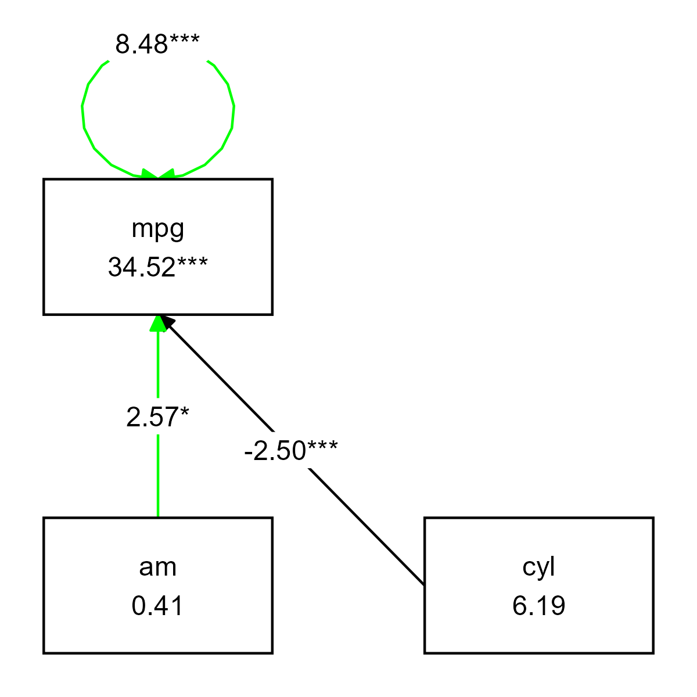

However, the variance arrow is also colored green, because it is an edge as well.
This is where other conditional formatting functions come in handy. 
Imagine we want to color the negative regression path red, and color the variance black - and make the variance transparent as well, to reduce its visual importance:


``` r
prepare_graph(fit) %>%
  color_pos_edges("green") %>%
  color_neg_edges("red") %>%
  color_var("black") %>%
  alpha_var(.2) %>%
  plot()
```
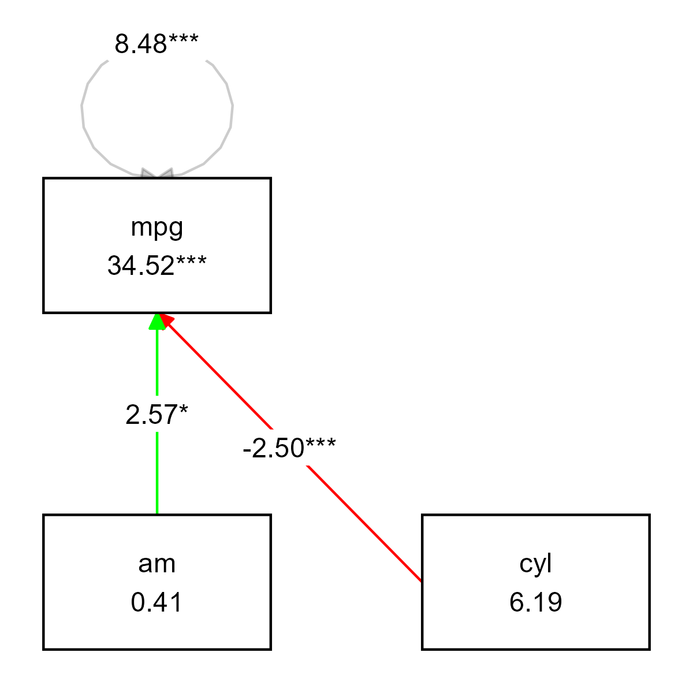

There are many dedicated conditional customization functions like these.
They make use of the generic function `if_edit()`, and are documented in its help file (see `?if_edit`).

The function `if_edit()` takes an expression and a condition as arguments.
This makes custom conditional formatting possible.
For example, imagine that we want to color every graph element with the number "4" in the column `est` blue, you could use:


``` r
prepare_graph(fit) %>%
  # Add color column to the graph elements
  edit_graph({ color = "black" }) %>% 
  # Conditionally change color to blue when the column 'est' contains the number 4
  if_edit(grepl("4", est), {color = "blue"}) %>%
  plot()
```
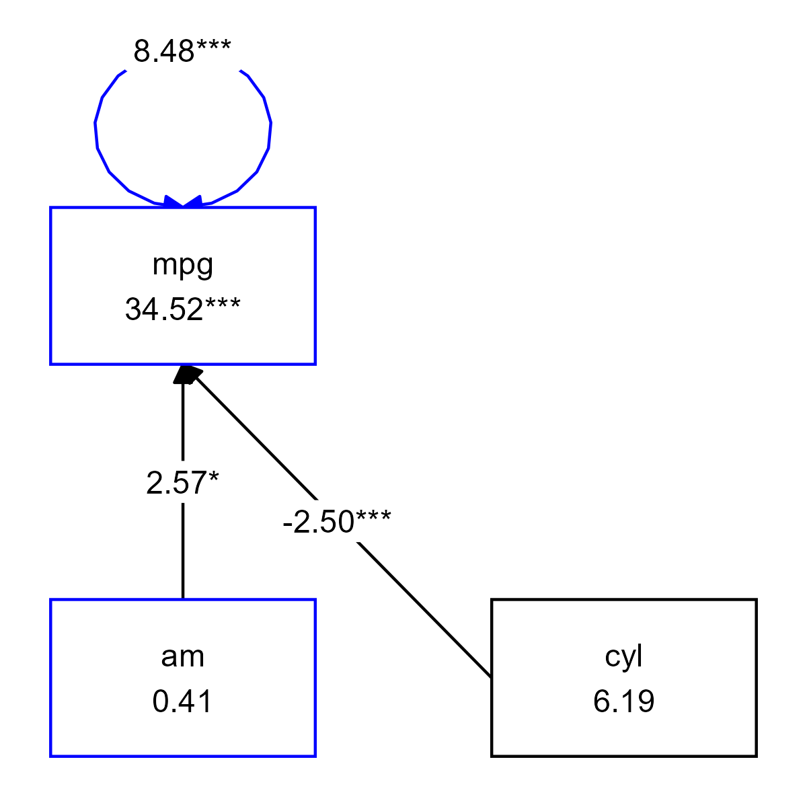

## Math Notation in Graphs

Since the objects created by `prepare_graph()` and `graph_sem()` are `ggplot` objects, we can use the full functionality of `ggplot` to customize them.
The following example, based on code provided by GitHub user `dumaskvn`, showcases how `plotmath` labels can be displayed (see `?plotmath`).
There are several ways to do this; this is just one example.


``` r
model <- "
  Sepal.Length ~ Sepal.Width + Petal.Length
  Sepal.Width ~ Petal.Length
"
# fit model
fit <- sem(model, data = iris)
# specify layout for consistency
layout <- get_layout("", "Sepal.Width", "",
                     "Petal.Length", "", "Sepal.Length", rows = 2)
# get data from prepare_graph
p <- prepare_graph(fit, layout = layout, angle = 180)

# standard graph
plot(p)

# Duplicate node data.frame
df_nodes <- p$nodes
# Add mathematical notation to node label
df_nodes$label <- paste("atop(", p$nodes$label, ", ", c("alpha-div", # Add a Greek letter
                                                 paste0("R^2 ==", formatC(inspect(fit, "r2"), digits = 2, format = "f"))), ")")  # Add R2 to node labels
# Set original labels to blank
p$nodes$label <- "" 

# Plot, treat as ggplot object and add parsed node labels
plot(p) + geom_text(data = df_nodes, aes(x=x, y=y, label=label), parse = TRUE)

```

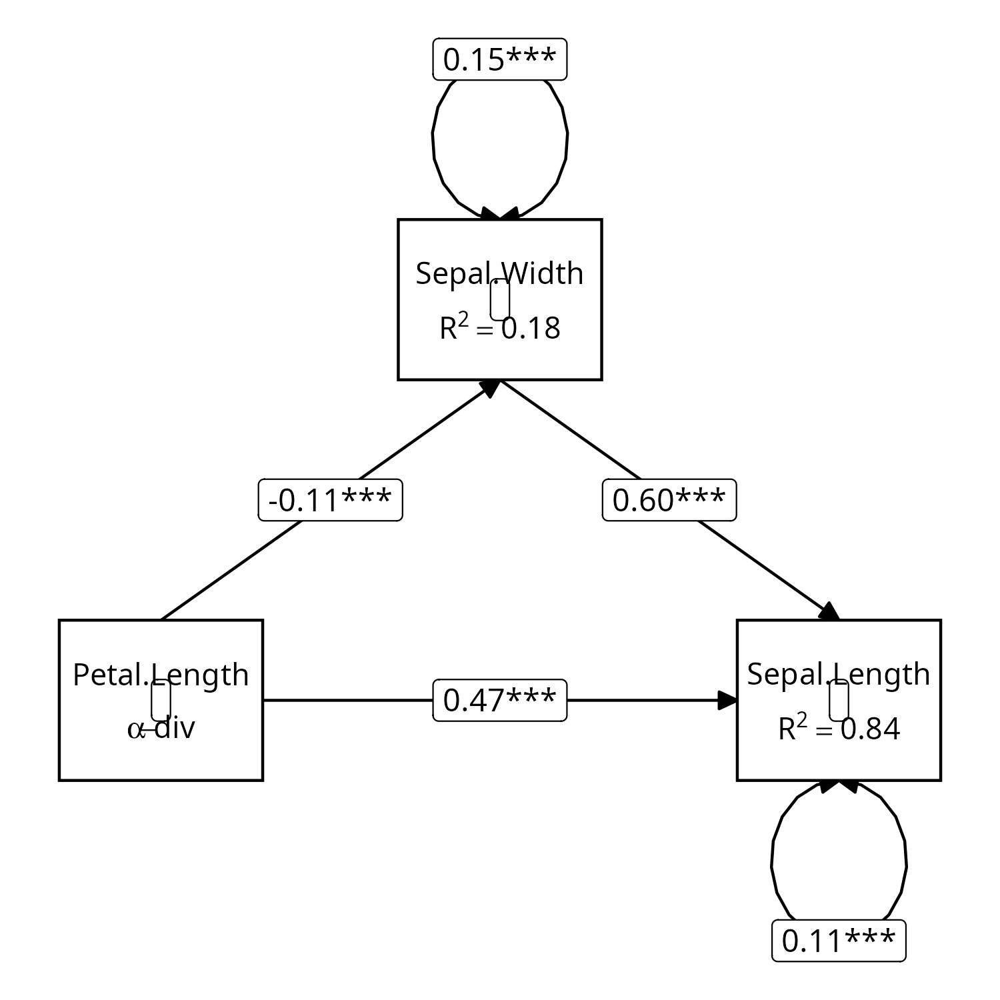

<!--As explained before, the functions `get_edges()` and `get_nodes()`,
which are used in the default arguments of `prepare_graph()` and `graph_sem()`,
have an argument `columns` which adds auxiliary columns to the resulting data.frames.
This can be used to customize visual aspects of the edges and nodes based on, for example, the value of the estimates:

```r, eval = TRUE, echo = FALSE, warning = FALSE, message = FALSE, out.width='30%'}
fit <- sem("mpg ~ cyl
           mpg ~ am", data = mtcars)

p <- prepare_graph(fit,
                   edges = get_edges(fit, columns = "est"),
                   fix_coord = TRUE)
edges(p) %>%
  mutate(color = "black",
         color = replace(color, arrow == "last" & as.numeric(est) < 0, "red"),
         color = replace(color, arrow == "last" & as.numeric(est) > 0, "green")) -> edges(p)

plot(p)
```
```r, eval = FALSE, echo = FALSE, warning = FALSE, message = FALSE, out.width='30%'}
fit <- sem("mpg ~ cyl
           mpg ~ am", data = mtcars)
set.seed(15)
p <- prepare_graph(fit,
                   edges = get_edges(fit, columns = "est"),
                   fix_coord = TRUE)
edges(p) %>%
  mutate(color = "black",
         color = replace(color, arrow == "last" & as.numeric(est) < 0, "red"),
         color = replace(color, arrow == "last" & as.numeric(est) > 0, "green")) -> edges(p)

p <- plot(p)

ggsave("pgfig8.png", p, device = "png", width= 4, height = 4)

```
-->
