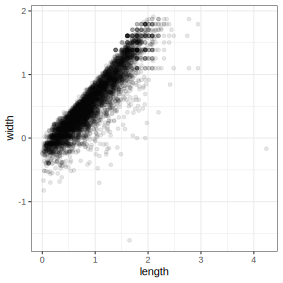
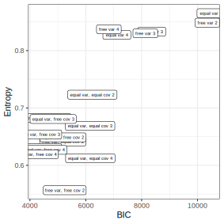
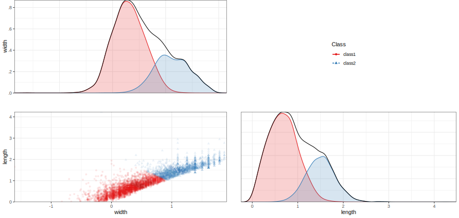

```{r, include = FALSE, cache = FALSE}
library(yaml)
library(scales)
knitr::opts_chunk$set(
  collapse = TRUE,
  comment = "#>",
  message = FALSE,
  warning = FALSE
)
options(scipen = 1, digits = 2)
run_everything = FALSE
```

This is an example of exploratory LCA with continuous indicators,
or finite Gaussian mixture modeling, using `tidySEM`.
The present example uses data collected by Alkema as part of a study on ocean microplastics.
To view its documentation,
run the command `?tidySEM::alkema_microplastics` in the R console.
The original analyses are available at https://github.com/cjvanlissa/lise_microplastics;
in this vignette, we take a different approach to the analysis to showcase other possibilities.

## Loading the Data

To load the data, simply attach the `tidySEM` package.
For convenience, we assign the variables used for analysis to an object called `df`.
As explained in the paper, the classes are quite different for lines, films, and fragments.
For this reason, we here only use data from fragments.
The indicators are fragments' length and width.

```{r, echo = TRUE, eval=TRUE}
# Load required packages
library(tidySEM) 
library(ggplot2)
# Load data
df_analyze <- alkema_microplastics[alkema_microplastics$category == "Fragment", ]
df <- df_analyze[ ,c("length", "width")]
```

## Examining the Data

As per the best practices,
the first step in LCA is examining the observed data.
We use `tidySEM::descriptives()` to describe the data numerically.
Because all items are categorical,
we remove columns for continuous data to de-clutter the table:

```{r tabdesc, echo = TRUE, eval=TRUE, results='asis'}
desc <- tidySEM::descriptives(df)
desc <- desc[, c("name", "type", "n", "missing", "unique", 
"mean", "median", "sd", "min", "max", "skew_2se", "kurt_2se")]
knitr::kable(desc, caption = "Descriptive statistics")
```

Additionally, we can plot the data.
The `ggplot2` function `geom_density()` is useful for continuous data:

```{r, echo = TRUE, eval = FALSE}
df_plot <- df
names(df_plot) <- paste0("Value.", names(df_plot))
df_plot <- reshape(df_plot, varying = names(df_plot), direction = "long",
                   timevar = "Variable")
ggplot(df_plot, aes(x = Value)) +
  geom_density() +
  facet_wrap(~Variable)+
  theme_bw()
```
```{r, echo = FALSE, eval = run_everything}
df_plot <- df
names(df_plot) <- paste0("Value.", names(df_plot))
df_plot <- reshape(df_plot, varying = names(df_plot), direction = "long",
                   timevar = "Variable")
p <- ggplot(df_plot, aes(x = Value)) +
  geom_density() +
  facet_wrap(~Variable)+
  theme_bw()
ggsave("plot_gmm_desc.svg", p, device = "svg", width = 100, height = 100, units = "mm")
```
```{r figdesc, echo = FALSE, eval = TRUE}
df_plot <- df
names(df_plot) <- paste0("Value.", names(df_plot))
df_plot <- reshape(df_plot, varying = names(df_plot), direction = "long",
                   timevar = "Variable")
knitr::include_graphics("plot_gmm_desc.svg")
```

The data are correctly coded as `numeric`.
There are no missing values; if any variables had missing values, we would report an MCAR test with `mice::mcar()`,
and explain that missing data are accounted for using FIML.
Note that the data are extremely right-skewed and kurtotic,
as also evident from the plot.
With this in mind, it can be useful to transform and rescale the data.
We will use a log transformation.

```{r, echo = TRUE, eval = FALSE}
df_plot$Value <- log(df_plot$Value)
ggplot(df_plot, aes(x = Value)) +
  geom_density() +
  facet_wrap(~Variable)+
  theme_bw()
```
```{r, echo = FALSE, eval = run_everything}
df_plot$Value <- log(df_plot$Value)
p <- ggplot(df_plot, aes(x = Value)) +
  geom_density() +
  facet_wrap(~Variable)+
  theme_bw()
ggsave("plot_gmm_desc_log.svg", p, device = "svg", width = 100, height = 100, units = "mm")
```
```{r figdesclog, echo = FALSE, eval = TRUE}
knitr::include_graphics("plot_gmm_desc_log.svg")
```

The log transformation addresses all aforementioned concerns regarding skew and kurtosis.
Let's reshape the data to wide format
and examine a scatterplot:

```{r, eval = FALSE, echo = TRUE}
df <- reshape(df_plot, direction = "wide", v.names = "Value")[, -1]
names(df) <- gsub("Value.", "", names(df), fixed = TRUE)
ggplot(df, aes(x = length, y = width)) +
  geom_point(alpha = .1) +
  theme_bw()
```
```{r, eval = run_everything, echo = FALSE}
df <- reshape(df_plot, direction = "wide", v.names = "Value")[, -1]
names(df) <- gsub("Value.", "", names(df), fixed = TRUE)
p <- ggplot(df, aes(x = length, y = width)) +
  geom_point(alpha = .1) +
  theme_bw()
ggsave("plot_gmm_scatter.svg", p, device = "svg", width = 100, height = 100, units = "mm")
```
```{r figscatter, eval = TRUE, echo = FALSE}

```

<!-- As evident from the scatterplot, there is a very strong linear tend in the data. -->
<!-- This indicates that fragments tend to be coextensive (when length goes up, width goes up). -->
<!-- We can analyze these data in their original dimensions (length and width). -->
<!-- Alternatively, we can use PCA to rotate the data such that the first dimension can be interpreted as "size", -->
<!-- and the second dimension can be interpreted as "shape": -->

```{r echo = FALSE, eval = FALSE}
pca <- princomp(df)
df <- data.frame(pca$scores)
names(df) <- c("pc1", "pc2")
```

## Conducting Latent Profile Analysis

As all variables are continuous, we can use the convenience function
`tidySEM::mx_profiles()`,
which is a wrapper for the generic function `mx_mixture()` optimized for continuous indicators.
Its default settings are appropriate for LPA, assuming fixed variances across classes and zero covariances.
Its arguments are `data` and number of `classes`.
All variables in `data` are included in the analysis,
which is why we first selected the indicator variables.

As this is an exploratory LCA,
we will conduct a rather extensive search across model specifications and number of classes.
We will set the maximum number of classes $K$ to four; depending on the results, we can always choose to increase it later.
We set a seed to ensure replicable results.
As the analysis takes a long time to compute,
it is prudent to save the results to disk immediately, so as not to lose them.
For this, we use the function `saveRDS()`.
We can later use `res <- readRDS("res_gmm.RData")` to load the analysis from the file.

```{r fitlca, eval = FALSE, echo = TRUE}
set.seed(123)
res <- mx_profiles(data = df,
                   classes = 1:4,
                   variances = c("equal", "varying"),
                   covariances = c("zero", "equal",
                                   "varying"),
                   expand_grid = TRUE)
saveRDS(res, "res_gmm.RData")
```
```{r eval = run_everything, echo = FALSE}
set.seed(123)
res <- mx_profiles(data = df,
                   classes = 1:4,
                   variances = c("equal", "varying"),
                   covariances = c("zero", "equal",
                                   "varying"),
                   expand_grid = TRUE)
saveRDS(res, "res_gmm.RData")
fit <- table_fit(res)
fit$par_ratio <- (5605*fit$n_min) / (fit$Parameters/fit$Classes)
write.csv(fit, "gmm_tabfit.csv", row.names = FALSE)
#"Warning: In model 'mix4' Optimizer returned a non-zero status code 6. The model does not satisfy the first-order optimality conditions to the required accuracy, and no improved point for the merit function could be found during the final linesearch (Mx status RED)"
```
```{r eval = TRUE, echo = FALSE}
fit <- read.csv("gmm_tabfit.csv", stringsAsFactors = FALSE)
class(fit) <- c("tidy_fit", "data.frame")
```

<!-- Note that one model (the most complex one) returns the following warning: -->

<!-- > Warning: In model 'mix4' Optimizer returned a non-zero status code 6. The model does not satisfy the first-order optimality conditions to the required accuracy, and no improved point for the merit function could be found during the final linesearch (Mx status RED) -->

<!-- This suggests a potential problem with with model convergence. -->
<!-- To try and get this model to converge, it is possible to use the function `mxTryHard()`, which permutes the starting values and tries to find a better solution. -->
<!-- To do this, run `res[[24]] <- mxTryHard(res[[24]])`. -->
<!-- However, at present, we will skip this step, -->
<!-- because there are also other indications that this 4-class model is overfitted (see below). -->

## Class Enumeration

To compare the fit of the estimated models,
we create a model fit table using
`table_fit()` and retain relevant columns.
We also determine whether any models can be disqualified.

```{r include = TRUE, eval=F}
fit <- table_fit(res)
```

There were no indications of convergence problems during estimation.
Next, we check for local identifiability.
The sample size is `5605`.
We can calculate the ratio of observations to parameters and append it to the fit table as follows:

```{r echo = TRUE, eval = FALSE}
fit$par_ratio <- (5605*fit$n_min) / (fit$Parameters/fit$Classes)
```

As can be seen from the fit table below,
the lowest ratio of observations to parameters is 18, which is no cause for concern.
However, these classes comprise a very small percentage of the total sample size.

There are, however,
concerns about the interpretability of all solutions,
as many of the entropies and minimum classification probabilities are low.
Only a few models have acceptable entropies around `.86` and minimum classification probabilities around `.94`.
Note that the BIC and the entropy are strongly correlated.
If we omit the 1-class models, for which entropy is technically not defined,
we see that `cor(fit$BIC[!fit$Classes == 1], fit$Entropy[!fit$Classes == 1])` returns `0.85`.
This strong correlation indicates that an increase in fit comes with a decrease in class separability.
This illustrates why entropy should not be treated as a model fit criterion.


```{r echo = TRUE, eval=F}
fit[ , c("Name", "LL", "Parameters", "par_ratio",
         "BIC", "Entropy",
         "prob_min", "prob_max", 
         "n_min", "n_max",
         "lmr_p")]
```
```{r tabfit, echo = FALSE, eval = TRUE}
knitr::kable(fit[ , c("Name", "LL", "Parameters", "par_ratio",
         "BIC", "Entropy",
         "prob_min", "prob_max", 
         "n_min", "n_max",
         "lmr_p")], caption = "Model fit table")
```


Next, we plot a scree plot for the BIC by calling `plot(fit)`:

```{r echo = TRUE, eval = FALSE}
plot(fit) + theme(axis.text.x = element_text(angle = 90, vjust = 0.5, hjust=1))
```
```{r echo = FALSE, eval = run_everything}
p <- plot(fit) + theme(axis.text.x = element_text(angle = 90, vjust = 0.5, hjust=1))
ggsave("gmm_plotfit.svg", p, device = "svg", width = 100, height = 100, units = "mm", scale = 1)
```
```{r echo = FALSE, eval = TRUE, fig.cap="Bivariate profile plot", out.width="100%"}
knitr::include_graphics("gmm_plotfit.svg")
```

It is not immediately clear which solution to prefer.
Looking at the blocks of 1-4 class models for each model specification,
it appears that the BIC keeps decreasing with the addition of more classes.
Across the blocks, the BIC keeps decreasing with increasingly complex model specifications.
Similarly, all LMR tests are significant.
The function `ic_weights(fit)` allows us to compute IC weights for all models in the set;
it prefers the most complex model with a posterior model probability of nearly 100%.
However, the smallest class in this model contains only 85 cases, about 1.6% of the sample.
We can wonder whether such a small class has a meaningful interpretation.

The analysis thus indicates support for increasingly complex models,
and those complex models are ever less interpretable and relevant,
as indicated by low entropy and class size, respectively.
This suggests a potential risk of overfitting.
We may instead choose the most parsimoneous model that fits the data well.
To aid in this decision, we plot the BIC and the Entropy,
omitting the 1-class solutions because there is clear evidence that more classes are needed:

```{r echo = TRUE, eval = FALSE}
df_plot <- fit
df_plot <- df_plot[!df_plot$Classes == 1, ]
ggplot(df_plot, aes(x = BIC, y = Entropy, label = Name)) +
  geom_point() +
  geom_label() +
  theme_bw()
```
```{r echo = FALSE, eval = run_everything}
df_plot <- fit
df_plot <- df_plot[!df_plot$Classes == 1, ]
ggplot(df_plot, aes(x = BIC, y = Entropy, label = Name)) +
  geom_point() +
  geom_label(size = 2) +
  theme_bw() -> p
ggsave("gmm_bic_entropy.svg", p, device = "svg", width = 100, height = 100, units = "mm", scale = 1)
```
```{r echo = FALSE, eval = TRUE, fig.cap="BIC and Entropy plot", out.width="100%"}

```

It appears that the 2-class model with equal variances and covariances has an above-average fit, and relatively high entropy.
We thus proceed with this model.

<!-- For each block of models, -->
<!-- the decrease in BIC levels off after 2 classes. -->
<!-- This suggests a preference for a 2-class model. -->
<!-- Furthermore, we observe that the largest change in BIC is between models with equal variances, and those with free variances across classes. -->
<!-- Differences in the BIC curve for models with free variances are negligible for models with zero, equal, or free covariances. -->
<!-- We should thus prefer the simpler models. -->
<!-- However, the fit table tells us that the classification diagnostics for the models with zero covariances are poor: entropies < .64 and minimum classification probabilities < .53. -->
<!-- While these statistics are low for all models, this block is particularly low. -->
<!-- We thus select the 2-class model out of the next block: with free variances and equal covariances. -->

## Interpreting the Final Class Solution

For convenience, we assign the final model to a separate object:

```{r, echo = TRUE, eval =FALSE}
res_final <- res[["equal var, equal cov 2"]]
```
```{r, echo = FALSE, eval = run_everything}
res_final <- res[["equal var, equal cov 2"]]
cp <- class_prob(res_final)
```

The 4-class model yielded classes of reasonable size;
the largest class comprised 68%,
and the smallest comprised 32% of cases.
The entropy was relatively low, $S = .72$, indicating poor class separability.
Furthermore, the posterior classification probability ranged from $[.86, .95]$, which means that classification error was non-negligible.
We produce a table of the results below.

```{r echo = TRUE, eval = FALSE}
table_results(res_final, columns = c("label", "est", "se", "confint", "class"))
```
```{r echo = FALSE, eval = run_everything}
tab <- table_results(res_final, columns = c("label", "est", "se", "confint", "class"))
write.csv(tab, "gmm_tab_res.csv", row.names = FALSE)
```
```{r, eval = TRUE, echo=FALSE}
tab <- read.csv("gmm_tab_res.csv", stringsAsFactors = FALSE)
knitr::kable(tab, caption = "Two-class model results")
```

The results are best interpreted by examining a plot of the model and data, however.
Relevant plot functions are `plot_bivariate()`, `plot_density()`, and `plot_profiles()`.
However, we omit the density plots, because `plot_bivariate()` also includes them.

```{r echo = TRUE, eval = FALSE}
plot_bivariate(res_final)
```
```{r echo = FALSE, eval = run_everything}
p <- plot_bivariate(res_final)
ggsave("gmm_bivariate.svg", p, device = "svg", width = 210, height = 100, units = "mm", scale = 1.5)
```
```{r echo = FALSE, eval = TRUE, fig.cap="Bivariate profile plot", out.width="100%"}

```
On the diagonal of the bivariate plot are weighted density plots:
normal approximations of the density function of observed data,
weighed by class probability.
On the off-diagonal are plots for each pair of indicators,
with the class means indicated by a point,
class standard deviations indicated by lines,
and covariances indicated by circles.

The bivariate and marginal plots show that the classes are not clearly separable, as also evident from the low entropy.
At the same time however, it is clear that the distributions are non-normal, and the second class accounts for some of this non-normality.
The first class (68%) accounts for smaller fragments, and the second class (32%) accounts for some of the right-skew in fragments' length and width.
We can simply label class 1 as *small fragments*,
and class 2 as *larger fragments*.

## Auxiliary Analyses

Finally, we may want to compare the different classes on auxiliary variables or models.
The `BCH()` function applies three-step analysis,
which compares the classes using a multi-group model,
controlling for classification error.
For example, we can test whether polymer type differs between the two classes:

```{r echo = TRUE, eval=FALSE}
df_pt <- mx_dummies(df_analyze$poly_type)
aux_pt <- BCH(res_final, model = "poly_typeOther | t1
                                  poly_typePE | t1
                                  poly_typePP | t1", data = df_pt)
aux_pt <- mxTryHardOrdinal(aux_pt)
```
```{r echo = FALSE, eval=run_everything}
df_pt <- mx_dummies(df_analyze$poly_type)
aux_pt <- BCH(res_final, model = "poly_typeOther | t1
                                  poly_typePE | t1
                                  poly_typePP | t1", data = df_pt)
aux_pt <- mxTryHardOrdinal(aux_pt)
saveRDS(aux_pt, "gmm_aux_pt.RData")
```
```{r echo = FALSE, eval=FALSE}
aux_pt <- readRDS("gmm_aux_pt.RData")
```

To obtain an omnibus likelihood ratio test of the significance of the differences in polymer type across classes,
use `lr_test(aux_pt)`.
The results indicate that there are significant differences in polymer types across classes, $\Delta LL(3) = 14.08, p = .003$.
The results can be reported in probability scale using `table_prob(aux_pt)`.
To test differences for specific polymer types, we can use Wald tests:

```{r echo = TRUE, eval = FALSE}
wald_test(aux_pt, "class1.Thresholds[1,1] = class2.Thresholds[1,1];class1.Thresholds[1,2] = class2.Thresholds[1,2];class1.Thresholds[1,3] = class2.Thresholds[1,3]")
```

The results indicate that there is no significant difference in the prevalence of "Other" polymer types across classes.
However, PE is significantly more prevalent in class 2, and PP is significantly more prevalent in class 1.


