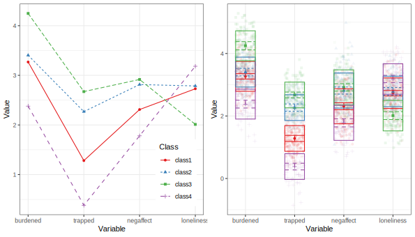

```{r, include = FALSE, cache = FALSE}
library(yaml)
library(scales)
knitr::opts_chunk$set(
  collapse = TRUE,
  comment = "#>",
  message = FALSE,
  warning = FALSE
)
options(scipen = 1, digits = 2)
run_everything = TRUE
```

This is an example of exploratory LCA with continuous indicators,
or finite Gaussian mixture modeling, using `tidySEM`.
The present example uses data collected by Alkema as part of a study on ocean microplastics.
To view its documentation,
run the command `?tidySEM::alkema_microplastics` in the R console.
The original analyses are available at https://github.com/cjvanlissa/lise_microplastics;
in this vignette, we take a different approach to the analysis to showcase other possibilities.

## Loading the Data

To load the data, simply attach the `tidySEM` package.
For convenience, we assign the variables used for analysis to an object called `df`.
As explained in the paper, the classes are quite different for lines, films, and fragments.
For this reason, we here only use data from fragments.
The indicators are fragments' length and width.

```{r, echo = TRUE, eval=TRUE}
# Load required packages
library(tidySEM) 
library(ggplot2)
# Load data
df <- alkema_microplastics[alkema_microplastics$category == "Fragment",
                           c("length", "width")]
```

## Examining the Data

As per the best practices,
the first step in LCA is examining the observed data.
We use `tidySEM::descriptives()` to describe the data numerically.
Because all items are categorical,
we remove columns for continuous data to de-clutter the table:

```{r tabdesc, echo = TRUE, eval=TRUE, results='asis'}
desc <- tidySEM::descriptives(df)
desc <- desc[, c("name", "type", "n", "missing", "unique", 
"mean", "median", "sd", "min", "max", "skew_2se", "kurt_2se")]
knitr::kable(desc, caption = "Descriptive statistics")
```

Additionally, we can plot the data.
The `ggplot2` function `geom_density()` is useful for continuous data:

```{r, echo = TRUE, eval = FALSE}
df_plot <- df
names(df_plot) <- paste0("Value.", names(df_plot))
df_plot <- reshape(df_plot, varying = names(df_plot), direction = "long",
                   timevar = "Variable")
ggplot(df_plot, aes(x = Value)) +
  geom_density() +
  facet_wrap(~Variable)+
  theme_bw()
```
```{r, echo = FALSE, eval = run_everything}
df_plot <- df
names(df_plot) <- paste0("Value.", names(df_plot))
df_plot <- reshape(df_plot, varying = names(df_plot), direction = "long",
                   timevar = "Variable")
p <- ggplot(df_plot, aes(x = Value)) +
  geom_density() +
  facet_wrap(~Variable)+
  theme_bw()
ggsave("plot_gmm_desc.svg", p, device = "svg", width = 100, height = 100, units = "mm")
```
```{r figdesc, echo = FALSE, eval = TRUE}
df_plot <- df
names(df_plot) <- paste0("Value.", names(df_plot))
df_plot <- reshape(df_plot, varying = names(df_plot), direction = "long",
                   timevar = "Variable")
knitr::include_graphics("plot_gmm_desc.svg")
```

The data are correctly coded as `numeric`.
There are no missing values; if any variables had missing values, we would report an MCAR test with `mice::mcar()`,
and explain that missing data are accounted for using FIML.
Note that the data are extremely right-skewed and kurtotic,
as also evident from the plot.
With this in mind, it can be useful to transform and rescale the data.
We will use a log transformation.

```{r, echo = TRUE, eval = FALSE}
df_plot$Value <- log(df_plot$Value)
ggplot(df_plot, aes(x = Value)) +
  geom_density() +
  facet_wrap(~Variable)+
  theme_bw()
```
```{r, echo = FALSE, eval = run_everything}
df_plot$Value <- log(df_plot$Value)
p <- ggplot(df_plot, aes(x = Value)) +
  geom_density() +
  facet_wrap(~Variable)+
  theme_bw()
ggsave("plot_gmm_desc_log.svg", p, device = "svg", width = 100, height = 100, units = "mm")
```
```{r figdesclog, echo = FALSE, eval = TRUE}
knitr::include_graphics("plot_gmm_desc_log.svg")
```

The log transformation addresses all aforementioned concerns regarding skew and kurtosis.
Let's reshape the data to wide format
and examine a scatterplot:

```{r, eval = FALSE, echo = TRUE}
df <- reshape(df_plot, direction = "wide", v.names = "Value")[, -1]
names(df) <- gsub("Value.", "", names(df), fixed = TRUE)
ggplot(df, aes(x = length, y = width)) +
  geom_point(alpha = .1) +
  theme_bw()
```
```{r, eval = run_everything, echo = FALSE}
df <- reshape(df_plot, direction = "wide", v.names = "Value")[, -1]
names(df) <- gsub("Value.", "", names(df), fixed = TRUE)
p <- ggplot(df, aes(x = length, y = width)) +
  geom_point(alpha = .1) +
  theme_bw()
ggsave("plot_gmm_scatter.svg", p, device = "svg", width = 100, height = 100, units = "mm")
```
```{r figscatter, eval = TRUE, echo = FALSE}
knitr::include_graphics("plot_gmm_scatter.svg")
```

As evident from the scatterplot, there is a very strong linear tend in the data.
This indicates that fragments tend to be coextensive (when length goes up, width goes up).
We can analyze these data in their original dimensions (length and width).
Alternatively, we can use PCA to rotate the data such that the first dimension can be interpreted as "size",
and the second dimension can be interpreted as "shape":

```{r}
pca <- princomp(df)
df <- data.frame(pca$scores)
names(df) <- c("pc1", "pc2")
```

## Conducting Latent Profile Analysis

As all variables are continuous, we can use the convenience function
`tidySEM::mx_profiles()`,
which is a wrapper for the generic function `mx_mixture()` optimized for continuous indicators.
Its default settings are appropriate for LPA, assuming fixed variances across classes and zero covariances.
Its arguments are `data` and number of `classes`.
All variables in `data` are included in the analysis,
which is why we first selected the indicator variables.

As this is an exploratory LCA,
we will conduct a rather extensive search across model specifications and number of classes.
We will set the maximum number of classes $K$ to four; depending on the results, we can always choose to increase it later.
We set a seed to ensure replicable results.
As the analysis takes a long time to compute,
it is prudent to save the results to disk immediately, so as not to lose them.
For this, we use the function `saveRDS()`.

```{r fitlca, eval = FALSE, echo = TRUE}
set.seed(123)
res <- mx_profiles(data = df,
                   classes = 1:4,
                   variances = c("equal", "varying"),
                   covariances = c("zero", "equal",
                                   "varying"),
                   expand_grid = TRUE)
saveRDS(res, "res_gmm.RData")
```
```{r eval = run_everything, echo = FALSE}
set.seed(123)
res <- mx_profiles(data = df,
                   classes = 1:4,
                   variances = c("equal", "varying"),
                   covariances = c("zero", "equal",
                                   "varying"),
                   expand_grid = TRUE)
saveRDS(res, "res_gmm.RData")
fit <- table_fit(res)
fit$par_ratio <- (5605*fit$n_min) / (fit$Parameters/fit$Classes)
write.csv(fit, "gmm_tabfit.csv", row.names = FALSE)
#"Warning: In model 'mix4' Optimizer returned a non-zero status code 6. The model does not satisfy the first-order optimality conditions to the required accuracy, and no improved point for the merit function could be found during the final linesearch (Mx status RED)"
```
```{r eval = TRUE, echo = FALSE}
fit <- read.csv("gmm_tabfit.csv", stringsAsFactors = FALSE)
class(fit) <- c("tidy_fit", "data.frame")
```

Note that one model (the most complex one) returns the following warning:

> Warning: In model 'mix4' Optimizer returned a non-zero status code 6. The model does not satisfy the first-order optimality conditions to the required accuracy, and no improved point for the merit function could be found during the final linesearch (Mx status RED)

This suggests a potential problem with with model convergence.
To try and get this model to converge, it is possible to use the function `mxTryHard()`, which permutes the starting values and tries to find a better solution.
To do this, run `res[[24]] <- mxTryHard(res[[24]])`.
However, at present, we will skip this step,
because there are also other indications that this 4-class model is overfitted (see below).

## Class Enumeration

To compare the fit of the estimated models,
we create a model fit table using
`table_fit()` and retain relevant columns.
We also determine whether any models can be disqualified.

```{r fit_table, include = TRUE, eval=F}
fit <- table_fit(res)
```

We already established that one model had potential convergence problems.
Next, we check for local identifiability.
The sample size is `5605`.
We can calculate the ratio of observations to parameters and append it to the fit table as follows:

```{r echo = TRUE, eval = FALSE}
fit$par_ratio <- (5605*fit$n_min) / (fit$Parameters/fit$Classes)
```

As can be seen from the fit table below,
the lowest ratio of observations to parameters is 36, which is no cause for concern.

There are, however,
concerns about the interpretability of all solutions,
as the entropies and minimum classification probabilities are all low.
At best, we see entropies around `.72` and minimum classification probabilities around `.89`.

```{r fit_table, echo = TRUE, eval=F}
fit[ , c("Name", "LL", "Parameters", "par_ratio",
         "BIC", "Entropy",
         "prob_min", "prob_max", 
         "n_min", "n_max",
         "lmr_p")]
```
```{r tabfit, echo = FALSE, eval = TRUE}
knitr::kable(fit[ , c("Name", "LL", "Parameters", "par_ratio",
         "BIC", "Entropy",
         "prob_min", "prob_max", 
         "n_min", "n_max",
         "lmr_p")], caption = "Model fit table")
```

It is not immediately clear which solution to prefer.
Looking at the blocks of 1-4 class models for each model specification,
it appears that the BIC keeps decreasing with the addition of more classes.
Across the blocks, the BIC keeps decreasing with increasingly complex model specifications.
The function `ic_weights(fit)` allows us to compute IC weights for all models in the set;
it prefers the most complex model with a posterior model probability of 99%.
Recall that this model had potential convergence problems.
The analysis thus indicates support for increasingly complex models, up to a point where those models may be too complex to converge.
This suggests a potential risk of overfitting.
We may instead choose the most parsimoneous model that fits the data well.

Next, we plot a scree plot for the BIC by calling `plot(fit)`:

```{r echo = TRUE, eval = FALSE}
plot(fit) + theme(axis.text.x = element_text(angle = 90, vjust = 0.5, hjust=1))
```
```{r echo = FALSE, eval = run_everything}
p <- plot(fit) + theme(axis.text.x = element_text(angle = 90, vjust = 0.5, hjust=1))
ggsave("gmm_plotfit.svg", p, device = "svg", width = 100, height = 100, units = "mm", scale = 1)
```
```{r echo = FALSE, eval = TRUE, fig.cap="Bivariate profile plot", out.width="100%"}
knitr::include_graphics("gmm_plotfit.svg")
```

For each block of models,
the decrease in BIC levels off after 2 classes.
This suggests a preference for a 2-class model.
Furthermore, we observe that the largest change in BIC is between models with equal variances, and those with free variances across classes.
Differences in the BIC curve for models with free variances are negligible for models with zero, equal, or free covariances.
We should thus prefer the simpler models.
However, the fit table tells us that the classification diagnostics for the models with zero covariances are poor: entropies < .64 and minimum classification probabilities < .53.
While these statistics are low for all models, this block is particularly low.
We thus select the 2-class model out of the next block: with free variances and equal covariances.

## Interpreting the Final Class Solution

For convenience, we assign the final model to a separate object:

```{r, echo = TRUE, eval =FALSE}
res_final <- res[["free var, equal cov 2"]]
```
```{r, echo = FALSE, eval = run_everything}
res_final <- res[["free var, equal cov 2"]]
cp <- class_prob(res_final)
```

The 4-class model yielded classes of reasonable size;
the largest class comprised 86%,
and the smallest comprised 14% of cases.
However, the entropy was low, $S = .75$, indicating poor class separability.
Furthermore, the posterior classification probability ranged from $[.81, .92]$, which means that at least some classes had a high classification error.
We produce a table of the results below.

```{r echo = TRUE, eval = FALSE}
table_results(res_final, columns = c("label", "est", "se", "confint", "class"))
```
```{r echo = FALSE, eval = run_everything}
tab <- table_results(res_final, columns = c("label", "est", "se", "confint", "class"))
write.csv(tab, "lpa_tab_res.csv", row.names = FALSE)
```
```{r, eval = TRUE, echo=FALSE}
tab <- read.csv("lpa_tab_res.csv", stringsAsFactors = FALSE)
knitr::kable(tab, caption = "Four-class model results")
```

The results are best interpreted by examining a plot of the model and data, however.
Relevant plot functions are `plot_bivariate()`, `plot_density()`, and `plot_profiles()`.
However, we omit the density plots, because `plot_bivariate()` also includes them.

```{r echo = TRUE, eval = FALSE}
plot_bivariate(res_final)
```
```{r echo = FALSE, eval = run_everything}
p <- plot_bivariate(res_final, return_list = TRUE)
p[[1]] <- p[[1]] + scale_y_continuous(breaks= c(0, .1, .2, .3), labels = c(".0", ".1", ".2", ".3"))
p <- tidySEM:::merge_corplots(p)
ggsave("lpa_bivariate.svg", p, device = "svg", width = 210, height = 100, units = "mm", scale = 1.5)
```
```{r echo = FALSE, eval = TRUE, fig.cap="Bivariate profile plot", out.width="100%"}
knitr::include_graphics("lpa_bivariate.svg")
```
On the diagonal of the bivariate plot are weighted density plots:
normal approximations of the density function of observed data,
weighed by class probability.
On the off-diagonal are plots for each pair of indicators,
with the class means indicated by a point,
class standard deviations indicated by lines,
and covariances indicated by circles.
As this model has zero covariances,
all circles are round (albeit warped by the different scales of the X and Y axes)

The marginal density plots show that trappedness distinguishes classes rather well.
For all other indicators, groups are not always clearly separated in terms of marginal density: class 2 and 3 coalesce on negative affect, 1 and 2 coalesce on loneliness, and 1 and 2 coalesce on burden.
Nevertheless, the off-diagonal scatterplots show reasonable bivariate separation for all classes.

We can obtain a more classic profile plot using `plot_profiles(res_final)`.
This plot conveys less information than the bivariate plot,
but is readily interpretable.
Below is a comparison between the most common type of visualization
for LPA, and the best-practices visualization provided by `tidySEM`.
Note that the best practices plot includes class means and error bars,
standard deviations,
and a ribbon plot of raw data weighted by class probability to indicate how well the classes describe the observed distribution.
The overlap between the classes is clearly visible in this figure;
this is why the entropy and classification probabilities are relatively low.

Based on the bivariate plot, we can label class 1 as the *balanced* type (33%),
class 2 as the *imbalanced* type (29%), class 3 as the *entrapped* type (22%),
and class 4 as the *lonely* type (16%).

```{r echo = TRUE, eval = FALSE}
plot_profiles(res_final)
```
```{r echo = FALSE, eval = run_everything}
p1 <- plot_profiles(res_final, ci = NULL, sd= FALSE, add_line = TRUE, rawdata = FALSE)
p1 <- p1 + theme(legend.position = c(.85, .2))
p2 <- plot_profiles(res_final)
p2 <- p2 + theme(legend.position = "none")
p <- ggpubr::ggarrange(p1, p2)
ggsave("lpa_profiles.svg", p, device = "svg", width = 210, height = 100, units = "mm", scale = 1)
```
```{r echo = FALSE, eval = TRUE, fig.cap="Bivariate profile plot", out.width="100%"}

```

## Auxiliary Analyses

Finally, we may want to compare the different classes on auxiliary variables or models.
The `BCH()` function applies three-step analysis,
which compares the classes using a multi-group model,
controlling for classification error.
We consider two examples: a single variable, and an auxiliary model.

### Comparing Means or Proportions Across Classes

For a single (continuous or ordinal) variable,
we can call the BCH function and simply supply the auxiliary variable to the `data` argument, omitting the `model` argument.
Below, we estimate an auxiliary model to compare the sex of patients between classes:

```{r echo = TRUE, eval=FALSE}
aux_sex <- BCH(res_final, data = zegwaard_carecompass$sexpatient)
```
```{r echo = FALSE, eval=run_everything}
aux_sex <- BCH(res_final, data = zegwaard_carecompass$sexpatient)
saveRDS(aux_sex, "lpa_aux_sex.RData")
```
```{r echo = FALSE, eval=FALSE}
aux_sex <- readRDS("lpa_aux_sex.RData")
```

To obtain an omnibus likelihood ratio test of the significance of these sex differences across classes,
as well as pairwise comparisons between classes,
use `lr_test(aux_sex)`.
The results indicate that there are significant sex differences across classes, $\Delta LL(1) = 8.7, p = .003$.
Pairwise comparisons indicate that class 3 differs significantly from classes 1 and 2.
The results can be reported in probability scale using `table_prob(aux_sex)`.
It appears that the entrapped class disproportionately cares for female patients.

### Comparing Auxiliary Models Across Classes

Finally, we compare a simple model between classes.
Specifically, we will examine whether the distance predicts the frequency of visits differently across classes (treated as continuous).

```{r echo = TRUE, eval=FALSE}
df_aux <- zegwaard_carecompass[, c("freqvisit", "distance")]
df_aux$freqvisit <- as.numeric(df_aux$freqvisit)
aux_model <- BCH(res_final, model = "freqvisit ~ distance",
                 data = df_aux)
```
```{r echo = FALSE, eval=run_everything}
df_aux <- zegwaard_carecompass[, c("freqvisit", "distance")]
df_aux$freqvisit <- as.numeric(df_aux$freqvisit)
aux_model <- BCH(res_final, model = "freqvisit ~ distance",
               data = df_aux)
saveRDS(aux_model, "lpa_aux_model.RData")
```
```{r echo = FALSE, eval=FALSE}
aux_model <- readRDS("lpa_aux_model.RData")
```

To obtain an omnibus likelihood ratio test of the difference in regression coefficients across classes
and pairwise comparisons between classes,
use `lr_test(aux_model, compare = "A")`.
The results indicate that there are no significant sex differences across classes, $\Delta LL(3) = 0.98, p = .81$.
The results can be reported using `table_results(aux_model)`.

```{r echo = FALSE, eval = TRUE}
yaml::write_yaml(out, "lpa.yml")
```


```{r}
  res <- mx_profiles(df, classes = 1:4, variances = "varying", covariances = "varying")
```

