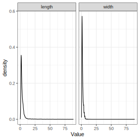
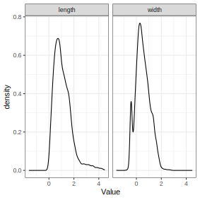

```{r, include = FALSE, cache = FALSE}
knitr::opts_chunk$set(
  collapse = TRUE,
  comment = "#>",
  message = FALSE,
  warning = FALSE
)
options(scipen = 1, digits = 2)
run_everything = FALSE
```

This is an example of exploratory LCA with continuous indicators,
or finite Gaussian mixture modeling, using `tidySEM`.
The present example uses data collected by Alkema as part of a study on ocean microplastics.
To view its documentation,
run the command `?tidySEM::alkema_microplastics` in the R console.

## Loading the Data

To load the data, simply attach the `tidySEM` package.
For convenience, we assign the variables used for analysis to an object called `df`.
We will use the particles' length and width.

```{r, echo = TRUE, eval=TRUE}
# Load required packages
library(tidySEM) 
library(ggplot2)
# Load data
df <- alkema_microplastics[alkema_microplastics$category == "Fragment", c("length", "width")]
```

## Examining the Data

As per the best practices,
the first step in LCA is examining the observed data.
We use `tidySEM::descriptives()` to describe the data numerically.
Because all items are categorical,
we remove columns for continuous data to de-clutter the table:

```{r tabdesc, echo = TRUE, eval=TRUE, results='asis'}
desc <- tidySEM::descriptives(df)
desc <- desc[, c("name", "type", "n", "missing", "unique", 
"mean", "median", "sd", "min", "max", "skew_2se", "kurt_2se")]
knitr::kable(desc, caption = "Descriptive statistics")
```

Additionally, we can plot the data.
The `ggplot2` function `geom_density()` is useful for continuous data:

```{r, echo = TRUE, eval = FALSE}
names(df) <- paste0("Value.", names(df))
df_plot <- reshape(df, varying = names(df), direction = "long",
                   timevar = "Variable")
ggplot(df_plot, aes(x = Value)) +
  geom_density() +
  facet_wrap(~Variable)+
  theme_bw()
```
```{r, echo = FALSE, eval = run_everything}
names(df) <- paste0("Value.", names(df))
df_plot <- reshape(df, varying = names(df), direction = "long",
                   timevar = "Variable")
p <- ggplot(df_plot, aes(x = Value)) +
  geom_density() +
  facet_wrap(~Variable)+
  theme_bw()
ggsave("plot_gmm_desc.svg", p, device = "svg", width = 100, height = 100, units = "mm")
```
```{r figdesc, echo = FALSE, eval = TRUE}

```

The data are correctly coded as `numeric`.
There are no missing values; if any variables had missing values, we would report an MCAR test with `mice::mcar()`,
and explain that missing data are accounted for using FIML.
Note that the standard deviation of length is much larger than that of width.
In fact, the variance of length is almost 26 times larger than that of width.
Furthermore, as also evident from the plot, the data are extremely right-skewed and kurtotic.
With this in mind, it can be useful to transform and rescale the data.
We will use a log transformation.

```{r, echo = TRUE, eval = TRUE}
df_plot$Value <- log(df_plot$Value)
ggplot(df_plot, aes(x = Value)) +
  geom_density() +
  facet_wrap(~Variable)+
  theme_bw()
```
```{r, echo = FALSE, eval = run_everything}
df_plot$Value <- log(df_plot$Value)
p <- ggplot(df_plot, aes(x = Value)) +
  geom_density() +
  facet_wrap(~Variable)+
  theme_bw()
ggsave("plot_gmm_desc_log.svg", p, device = "svg", width = 100, height = 100, units = "mm")
```
```{r figdesc, echo = FALSE, eval = TRUE}

```

The log transformation addresses all aforementioned concerns regarding skew, kurtosis, and difference in scales.
Let's reshape the data to wide format,
and examine a scatterplot:

```{r, eval = TRUE, echo = TRUE}
df <- reshape(df_plot, direction = "wide", v.names = "Value")[, -1]
names(df) <- gsub("Value.", "", names(df), fixed = TRUE)
ggplot(df, aes(x = length, y = width)) +
  geom_point(alpha = .1) +
  theme_bw()
```

Note that all lines do not have a defined width.
This poses a challenge in model specification.
We will most likely need freely estimated variances to capture the near-zero variance of lines,
or need to fix the variance of one class to a small value.

## Conducting Latent Class Analysis

Before we fit a series of LCA models, we set a random seed using
`set.seed()`.
This is important because there is some inherent randomness in the estimation procedure,
and using a seed ensures that we (and others) can exactly reproduce the results.

Next, we fit the LCA models.
As all variables are ordinal, we can use the convenience function
`tidySEM::mx_profiles()`, which is a wrapper for the generic function `mx_mixture()` optimized for continuous indicators.
Its arguments are `data` and number of `classes`.
All variables in `data` are included in the analysis,
so relevant variables must be selected first.
Below, we fit 1 to 4 class solutions:

```{r fitlca, eval = run_everything, echo = FALSE}
set.seed(123) # setting seed 
res <- mx_profiles(data = df,
                   classes = 1:3,
                   variances = "varying",
                   covariances = "equal") # fitting LCA 1 to 4 class solutions
saveRDS(res, "res_gmm.RData")
```
```{r eval = FALSE, echo = TRUE}
set.seed(123)
res <- mx_lca(data = df, classes = 1:4)
table_fit(res)
```
```{r eval = TRUE, echo = FALSE}
res <- readRDS("res.RData")
```

In this example, all models converge without issues.
If this is not the case, however, we can try to aid convergence using `mxTryHardOrdinal()`, which expands the search for optimal parameter values for models with ordinal indicators.
It is part of the family of functions based on `mxTryHard()`.

## Class Enumeration

In class enumeration, we want to compare a sequence of LCA models fitted
to the data. To aid the process, we create a model fit table using
`tidySEM::table_fit()` with the results object as the input. As the
output contains a lot of information on each of the four fitted models,
we select a subset of helpful model fit indices and classification
diagnostics.

```{r fit_table, include = TRUE, eval=F}
fit_table <- table_fit(res) # model fit table
fit_table[ , c("Name", "LL", "Parameters", 
               "AIC", "BIC", "Entropy", 
               "prob_min", "prob_max", 
               "n_min", "n_max")] # our selection
```

Our selection of fit indices and classification diagnostics includes:

```{r, echo=F}
Selection <- c(
    "Name", "LL", "Parameters", 
    "AIC", "BIC", "prob_min", 
    "prob_max", "n_min", "n_max")

Description <- c(
    "Number of classes $K$",
    "Basic fit measure of the natural log of the likelihood of the data",
    "Total number of model parameters (in all classes)",
    "Relative fit measure: Akaike Information Criterion",
    "Relative fit measure: Bayesian Information Criterion",
    "Lowest average posterior class probability for class cases were assigned to",
    "Highest average posterior class probability for class cases were assigned to",
    "Proportion of cases in the smallest class based on posterior class probability",
    "Proportion of cases in the largest class based on posterior class probability")

selection <- cbind(Selection, Description)

knitr::kable(selection, format = 'pipe', 
             caption = "Selection of Fit Indices and 
                        Classification Diagnostics")
```


We discussed several possible strategies to select the final class
solution. Here, we apply our own.

To aid our interpretation of the results, we create an elbow plot
showing the trends in information criteria across four models.

```{r elbow_plot, include = TRUE, message=F, warning=F, eval=F}
library(tidyverse) # for data-wrangling
library(ggplot2) # for plots

elbow_plot <- fit_table[ , c("Name", "AIC", "BIC")] # extract ICs
elbow_plot <- pivot_longer(elbow_plot, cols = c("AIC", "BIC"), 
                           names_to = "IC", values_to = "Value") # to long format

ggplot(elbow_plot, aes(x = Name, y = Value, group = IC))+
  geom_point(aes(color = IC))+
  geom_line(aes(color = IC))+
  labs(title="Elbow Plot of Information Criteria per Class Solution", 
       x = "Class Solution", y = " Value")+
  scale_color_manual(name = "Information Criterion", 
                     values = c(AIC = 'blue', BIC = 'red'))+
  theme_minimal()

```

From the elbow plot, we see that AIC has a lower penalty for model
complexity. However, we are more interested in the BIC values, which are
similar for the one, two and three-class solutions, but the four-class
solution fits significantly worse. For this reason, we eliminate the
four-class solution from the selection process.

Then we examine the model fit table. As expected, the -2\*log likelihood
falls successively with each added class. As previously stated,
classification diagnostics should not be used for model selection, but
they can be used to disqualify certain solutions because they are
uninterpretable. We see that prob_min and n_min for the four-class solution is
low, knowing that this solution also has a high BIC, we disqualify this
solution.

Out of the remaining three solutions, we notice that entropy is the
highest for the three-class solution, and it has a satisfactory prob_min
and n_min. Based on this, we retain the three class solution in model
selection. Note that entropy for the one-class solution will always
equal to one, as it is 100% true that every case is in that class. Based
on the low entropy of the two-class solution, we eliminate this model.

Finally, when comparing the one and three-class solutions, we inspect
the information criteria. For BIC, the one-class solution fits better,
but the difference is marginal. AIC tells us that the added complexity
of having three classes still explains the data better than a one-class
solution. Therefore, we select the three-class solution as our
final-class solution.

## Interpreting the Final Class Solution

To aid our understanding of the final class solution, we use
`ggplot2::plot_prob()` with the results of the three-class model as the
input. The resulting graph shows response patterns on all the indicators
for each group.

If we want to know the probability of each response option's endorsement
for each class, we can use `tidySEM::table_prob`. These are thresholds
for ordinal dependent variables in the probability scale.

```{r plot_prob, include = TRUE, eval=F}
plot_prob(res[[3]]) # visualizing the response patterns for the final model
table_prob(res[[3]]) # tabulating the response patterns for the final model
```

In the plot, we can see the distributions of the response probabilities
on the indicators for each of the three classes. For instance, we see
that in Class 1 the most common response to u2 is 2, while in Class 2
and Class 3 this is 0. We can also see that response 1 is a rare
response not forming the majority in any class. Class 2 distinguishes
itself because the majority scores the response 0 category of u3 and u4,
while in Class 1 and 2 this is not the case. Class 3 distinguishes
itself because the most common response to u3 and u4 is 3.

We can also interpret the response patterns numerically. It is a matter of 
preferences on how to interpret these probabilities. Here is where you would
**name** each class, such that each response pattern is theoretically meaningful.

## Extracting Posterior Class Probabilities

Another step is to extract posterior class probabilities. This is done
by the use of `tidySEM::class_prob` with the results of the final class
solution as the input.

```{r extract_Post_Class_Prob, include = TRUE, eval=F}
probs <- class_prob(res[[3]]) # extracting the posterior class probabilities
probs$mostlikely.class # posterior probabilities by most likely class membership
probs$individual # individual posterior class probabilities
```
