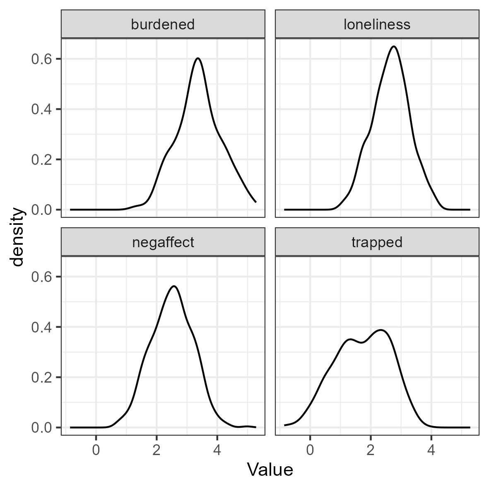
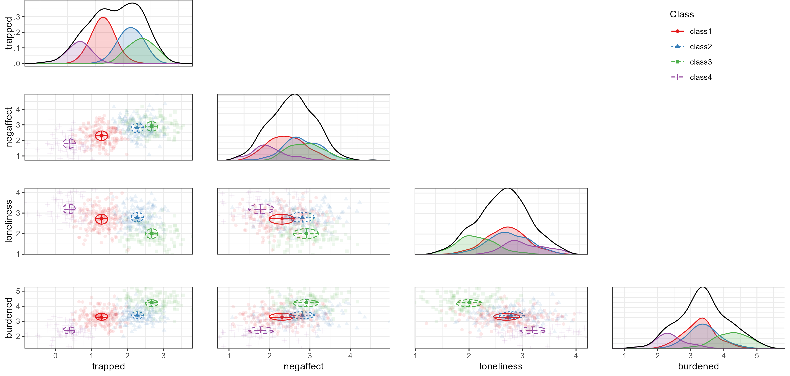
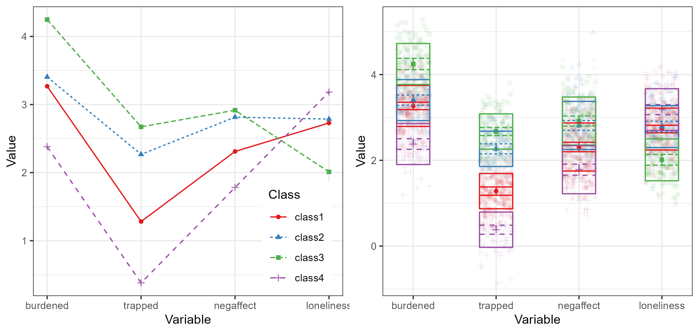

```{r setup, include = FALSE}
library(yaml)
library(scales)

knitr::opts_chunk$set(
  collapse = TRUE,
  comment = "#>",
  message = FALSE,
  warning = FALSE,
  results = "hide",
  tidy.opts = list(width.cutoff = 60), tidy = TRUE
)
options(scipen = 1, digits = 2)
eval_results <- FALSE
if(suppressWarnings(tryCatch({isTRUE(as.logical(readLines("pkgdown.txt")))}, error = function(e){FALSE}))){
  eval_results <- TRUE
  knitr::opts_chunk$set(
  results = "markup"
)
}
run_everything = suppressWarnings(tryCatch({isTRUE(as.logical(readLines("run_everything.txt")))}, error = function(e){FALSE}))
```

This is an example of confirmatory LPA using `tidySEM`,
as explained in Van Lissa, C. J., Garnier-Villarreal, M., & Anadria, D. (2023). *Recommended Practices in Latent Class Analysis using the Open-Source R-Package tidySEM.* Structural Equation Modeling. <https://doi.org/10.1080/10705511.2023.2250920>.
The simulated data are based on work by Zegwaard and colleagues,
who sought to establish a typology of caregivers who support a close other receiving outpatient psychological care.
Qualitative research among experts resulted in a theory postulating the existence of four types of caregivers (translated from the original Dutch):

**Balanced**

> The balanced caregiver experiences relative balance between the costs and benefits of caring for a close other.

**Imbalanced**

> The imbalanced caregiver experiences a precarious balance between the costs and benefits of caring for a close other.

**Lonely**

> The lonely caregiver experiences a strong sense of isolation.

**Entrapped**

> The entrapped caregiver strongly feels a sense of being entangled in responsibilities which are difficult to fulfill.

The goal of this confirmatory study was to validate this hypothesized class solution in a sample of caregivers.
A convenience sample was used, with no prior sample size justification.
To view the data documentation,
run the command `?tidySEM::zegwaard_carecompass` in the R console.

## Loading the Data

To load the data, simply attach the `tidySEM` package.
For convenience, we assign the variables used for analysis to an object called `df`.
We first only use the four scales: `c("burdened", "trapped", "negaffect", "loneliness")`.

```{r, echo = TRUE, eval=TRUE}
# Load required packages
library(tidySEM) 
library(ggplot2)
# Load data
df <- zegwaard_carecompass[, c("burdened", "trapped", "negaffect", "loneliness")]
```

## Descriptive statistics

We use `tidySEM::descriptives()` to describe the data numerically.
Because all scales are continuous,
we select only columns for continuous data to de-clutter the table:

```{r echo = TRUE, eval=FALSE}
desc <- tidySEM::descriptives(df)
desc <- desc[, c("name", "n", "missing", "unique",
                 "mean", "median", "sd", "min", "max",
                 "skew_2se", "kurt_2se")]
desc
```
```{r tabdesc, echo = FALSE, eval=TRUE}
desc <- tidySEM::descriptives(df)
desc <- desc[, c("name", "n", "missing", "unique",
                 "mean", "median", "sd", "min", "max",
                 "skew_2se", "kurt_2se")]
knitr::kable(desc, caption = "Descriptive statistics")
```

The table indicates two potential causes for concern:
there is a small percentage of missingness,
and all variables have relatively high kurtosis.
Since there are some missing values,
we can conduct an MCAR test using `mice::mcar(df)`.
According to Hawkins' test,
there is no evidence to reject the assumptions of multivariate normality and MCAR, $\tilde{\chi^2}(6) = 3.78, \tilde{p} = 0.71$.
Missing data will be accounted for using FIML.

Additionally, we can plot the data.
The `ggplot2` function `geom_density()` is useful for continuous data.
Visual inspection confirms the conclusions from the `descriptives()` table:
the data are kurtotic (peaked).

```{r, echo = TRUE, eval = FALSE}
df_plot <- df
names(df_plot) <- paste0("Value.", names(df_plot))
df_plot <- reshape(df_plot, varying = names(df_plot), direction = "long",
                   timevar = "Variable")
ggplot(df_plot, aes(x = Value)) +
  geom_density() +
  facet_wrap(~Variable)+
  theme_bw()
```
```{r, echo = FALSE, eval = run_everything}
# mcartest <- mice::mcar(df)
df_plot <- df
names(df_plot) <- paste0("Value.", names(df_plot))
df_plot <- reshape(df_plot, varying = names(df_plot), direction = "long",
                   timevar = "Variable")
p <- ggplot(df_plot, aes(x = Value)) +
  geom_density() +
  facet_wrap(~Variable)+
  theme_bw()
ggsave("plot_lpa_desc.png", p, device = "png", width = 100, height = 100, units = "mm")
```
```{r figdesc, echo = FALSE, eval = eval_results, out.width="80%"}

```

## Conducting Latent Profile Analysis

As all variables are continuous, we can use the convenience function
`tidySEM::mx_profiles()`,
which is a wrapper for the generic function `mx_mixture()` optimized for continuous indicators.
Its default settings are appropriate for LPA, assuming fixed variances across classes and zero covariances.
Its arguments are `data` and number of `classes`.
All variables in `data` are included in the analysis,
which is why we first selected the indicator variables.
As this is a confirmatory LCA,
we do not follow a strictly data-driven class enumeration procedure.
We will set the maximum number of classes $K$ to one more than the theoretically expected number.
We set a seed to ensure replicable results.

```{r fitlca, eval = run_everything, echo = FALSE}
set.seed(123) # setting seed 
res <- mx_profiles(data = df,
                   classes = 1:5)
saveRDS(res, "res_lpa.RData")
fit <- table_fit(res)
write.csv(fit, "lpatabfit.csv", row.names = FALSE)
```
```{r eval = FALSE, echo = TRUE}
set.seed(123)
res <- mx_profiles(data = df,
                   classes = 1:5)
```
```{r eval = eval_results, echo = FALSE}
fit <- read.csv("lpatabfit.csv", stringsAsFactors = FALSE)
class(fit) <- c("tidy_fit", "data.frame")
```

This analysis should produce some messages about cluster initialization.
These relate to the selection of starting values,
which relies on the K-means algorithm and is not robust to missing data.
The algorithm automatically switches to hierarchical clustering, no further action is required.

## Class Enumeration

To compare the fit of the theoretical model against other models,
we create a model fit table using
`table_fit()` and retain relevant columns.
We also determine whether any models can be disqualified.

In this example, all models converge without issues.
If, for example, the two-class solution had not converged, we could use the function `res[[2]] <- mxTryHard(res[[2]])` to aid convergence.

Next, we check for local identifiability.
The sample size is consistently reported as 513,
which means that partially missing cases were indeed included via FIML.
The smallest class size occurs in the 5-class model,
where the smallest class is assigned 7% of cases, or 38 cases.
This model has 28 parameters, approximately 6 per class.
We thus have at least five observations per parameter in every class,
and do not disqualify the 5-class model.

There are concerns about theoretical interpretability of all solutions,
as the entropies and minimum classification probabilities are all low.
However, in this confirmatory use case, we address this when interpreting the results.

```{r fit_table, include = TRUE, eval=F}
fit <- table_fit(res) # model fit table
fit[ , c("Name", "LL", "Parameters", "n",
         "BIC", "Entropy",
         "prob_min", "prob_max", 
         "n_min", "n_max",
         "np_ratio", "np_local")]
```
```{r tabfit, echo = FALSE, eval = eval_results}
tbl <- fit[ , c("Name", "LL", "Parameters", "n",
         "BIC", "Entropy",
         "prob_min", "prob_max", 
         "n_min", "n_max")]
names(tbl) <- c("Name", "LL", "p", "n",
         "BIC", "Entropy",
         "p_min", "p_max", 
         "n_min", "n_max")
knitr::kable(tbl, caption = "Model fit table")
```

### Using ICs

the 4-class solution has the lowest BIC,
which means it is preferred over all other solutions including a 1-class solution and a solution with more classes.
Note that a scree plot for the BIC can be plotted by calling `plot(fit)`.
Following the elbow criterion, a three-class solution would also be defensible.
The function `ic_weights(fit)` allows us to compute IC weights;
it indicates that, conditional on the set of models,
the 4-class model has a posterior model probability of nearly 100%.

### Using LMR tests

If we conduct LMR tests, we find that the tests are significant for all pairwise model comparisons, except for the 5-class model:

```{r lmr_table, echo = TRUE, eval=FALSE}
lr_lmr(res)
```

```{r tablmr, echo = FALSE, eval = run_everything}
res <- readRDS("res_lpa.RData")
tbl <- lr_lmr(res)
write.csv(tbl, "lpatablmr.csv", row.names = FALSE)
```

```{r echo = FALSE, eval = TRUE}
tbl <- read.csv("lpatablmr.csv", stringsAsFactors = FALSE)
knitr::kable(tbl, caption = "LMR test table", digits = 2)
```

### Using BLRT tests

We can also use the BLRT test.
As it is very computationally expensive,
we will use a low number of replications here.
In practice, one might use a much higher number (1000+) for published research.
Keep in mind that the p-value of the BLRT is subject to Monte Carlo error;
if it fluctuates when analyses are replicated or its value is very close to the critical threshold, consider increasing the number of replications.

To accelerate computations, we can use the `future` package for parallel computing (see `?plan` to select the appropriate back-end for your system).
To track the function's progress,
we use the `progressr` ecosystem,
which allows users to choose how they want to be informed.
The example below uses a progress bar:

```{r eval = FALSE, echo = TRUE}
library(future)
library(progressr)
plan(multisession) # Parallel processing for Windows
handlers("progress") # Progress bar
set.seed(1)
res_blrt <- BLRT(res, replications = 20)
```
```{r eval = run_everything, echo = FALSE}
library(future)
library(progressr)
plan(multisession) # Parallel processing for Windows
handlers("progress") # Progress bar
set.seed(1)
res_blrt <- BLRT(res, replications = 20)
write.csv(res_blrt, "appendixbresblrt.csv", row.names = FALSE)
```
```{r eval = eval_results, echo = FALSE}
res_blrt <- read.csv("appendixbresblrt.csv", stringsAsFactors = FALSE)
knitr::kable(res_blrt, caption = "BLRT test table", digits = 2)
```

In sum, across all class enumeration criteria, there is strong support for a 4-class solution.

## Optional: Alternative Model Specifications

In the case of confirmatory LCA, the theory would be refuted by strong evidence against the hypothesized model and number of classes.
In the preceding, we only compared the theoretical model against models with different number of classes.
Imagine, however, that a Reviewer argues that variance ought to be freely estimated across classes.
We could compare our theoretical model against their competing model as follows.
Note that we can put two models into a list to compare them.

```{r eval = run_everything, echo = FALSE}
res_alt <- mx_profiles(df, classes = 4, variances = "varying")
compare <- list(res[[4]], res_alt)
fit_compare <- table_fit(compare)
write.csv(fit_compare, "lpa_fit_compare.csv", row.names = FALSE)
```
```{r, echo = TRUE, eval = FALSE}
res_alt <- mx_profiles(df, classes = 4, variances = "varying")
compare <- list(res[[4]], res_alt)
table_fit(compare)
```
```{r tabfitcomp, echo = FALSE, eval = eval_results}
fit_compare <- read.csv("lpa_fit_compare.csv", stringsAsFactors = FALSE)
class(fit_compare) <- c("tidy_fit", "data.frame")
knitr::kable(fit_compare[ , c("Name", "LL", "Parameters",
         "BIC", "Entropy",
         "prob_min", "prob_max", 
         "n_min", "n_max")], caption = "Comparing competing theoretical models")
```

The alternative model incurs 12 additional parameters for the free variances.
Yet, it has a higher BIC, which indicates that this additional complexity does not outweigh the increase in fit.

## Interpreting the Final Class Solution

To interpret the final class solution,
we first reorder the 4-class model by class size.
This helps prevent label switching.

```{r, echo = TRUE, eval =FALSE}
res_final <- mx_switch_labels(res[[4]])
```
```{r, echo = FALSE, eval = run_everything}
res_final <- mx_switch_labels(res[[4]])
cp <- class_prob(res_final)
out <- list(counts = cp$sum.posterior$proportion)
```

The 4-class model yielded classes of reasonable size;
using `class_pro`the largest class comprised 33%,
and the smallest comprised 16% of cases.
However, the entropy was low, $S = .75$, indicating poor class separability.
Furthermore, the posterior classification probability ranged from $[.81, .92]$, which means that at least some classes had a high classification error.
We produce a table of the results below.

```{r echo = TRUE, eval = FALSE}
table_results(res_final, columns = c("label", "est", "se", "confint", "class"))
```
```{r echo = FALSE, eval = run_everything}
tab <- table_results(res_final, columns = c("label", "est", "se", "confint", "class"))
write.csv(tab, "lpa_tab_res.csv", row.names = FALSE)
```
```{r, eval = eval_results, echo=FALSE}
tab <- read.csv("lpa_tab_res.csv", stringsAsFactors = FALSE)
knitr::kable(tab, caption = "Four-class model results")
```

The results are best interpreted by examining a plot of the model and data, however.
Relevant plot functions are `plot_bivariate()`, `plot_density()`, and `plot_profiles()`.
However, we omit the density plots, because `plot_bivariate()` also includes them.

```{r echo = TRUE, eval = FALSE}
plot_bivariate(res_final)
```
```{r echo = FALSE, eval = run_everything}
p <- plot_bivariate(res_final, return_list = TRUE)
p[[1]] <- p[[1]] + scale_y_continuous(breaks= c(0, .1, .2, .3), labels = c(".0", ".1", ".2", ".3"))
p <- tidySEM:::merge_corplots(p)
ggsave("lpa_bivariate.png", p, device = "png", width = 210, height = 100, units = "mm", scale = 1.5)
```
```{r echo = FALSE, eval = eval_results, fig.cap="Bivariate profile plot", out.width="80%"}

```
On the diagonal of the bivariate plot are weighted density plots:
normal approximations of the density function of observed data,
weighed by class probability.
On the off-diagonal are plots for each pair of indicators,
with the class means indicated by a point,
class standard deviations indicated by lines,
and covariances indicated by circles.
As this model has zero covariances,
all circles are round (albeit warped by the different scales of the X and Y axes)

The marginal density plots show that trappedness distinguishes classes rather well.
For all other indicators, groups are not always clearly separated in terms of marginal density: class 2 and 3 coalesce on negative affect, 1 and 2 coalesce on loneliness, and 1 and 2 coalesce on burden.
Nevertheless, the off-diagonal scatterplots show reasonable bivariate separation for all classes.

We can obtain a more classic profile plot using `plot_profiles(res_final)`.
This plot conveys less information than the bivariate plot,
but is readily interpretable.
Below is a comparison between the most common type of visualization
for LPA, and the best-practices visualization provided by `tidySEM`.
Note that the best practices plot includes class means and error bars,
standard deviations,
and a ribbon plot of raw data weighted by class probability to indicate how well the classes describe the observed distribution.
The overlap between the classes is clearly visible in this figure;
this is why the entropy and classification probabilities are relatively low.

Based on the bivariate plot, we can label class 1 as the *balanced* type (33%),
class 2 as the *imbalanced* type (29%), class 3 as the *entrapped* type (22%),
and class 4 as the *lonely* type (16%).
Note however that the observed classes do not match the hypothesized pattern of class parameters exactly.

```{r echo = TRUE, eval = FALSE}
plot_profiles(res_final)
```
```{r echo = FALSE, eval = run_everything}
p1 <- plot_profiles(res_final, ci = NULL, sd= FALSE, add_line = TRUE, rawdata = FALSE)
p1 <- p1 + theme(legend.position = c(.85, .2))
p2 <- plot_profiles(res_final)
p2 <- p2 + theme(legend.position = "none")
p <- ggpubr::ggarrange(p1, p2)
ggsave("lpa_profiles.png", p, device = "png", width = 210, height = 100, units = "mm", scale = 1)
```
```{r echo = FALSE, eval = eval_results, fig.cap="Bivariate profile plot", out.width="80%"}

```

## Auxiliary Analyses

We may want to compare the different classes on auxiliary variables or models.
The `BCH()` function applies three-step analysis,
which compares the classes using a multi-group model,
controlling for classification error.
We consider two examples: a single variable, and an auxiliary model.

### Comparing Means or Proportions Across Classes

For a single (continuous or ordinal) variable,
we can call the BCH function and simply supply the auxiliary variable to the `data` argument, omitting the `model` argument.
Below, we estimate an auxiliary model to compare the sex of patients between classes:

```{r echo = TRUE, eval=FALSE}
aux_sex <- BCH(res_final, data = zegwaard_carecompass$sexpatient)
```
```{r echo = FALSE, eval=run_everything}
aux_sex <- BCH(res_final, data = zegwaard_carecompass$sexpatient)
saveRDS(aux_sex, "lpa_aux_sex.RData")
```
```{r echo = FALSE, eval=FALSE}
aux_sex <- readRDS("lpa_aux_sex.RData")
```

To obtain an omnibus likelihood ratio test of the significance of these sex differences across classes,
as well as pairwise comparisons between classes,
use `lr_test(aux_sex)`.
The results indicate that there are significant sex differences across classes, $\Delta LL(1) = 8.7, p = .003$.
Pairwise comparisons indicate that class 3 differs significantly from classes 1 and 2.
The results can be reported in probability scale using `table_prob(aux_sex)`.
It appears that the entrapped class disproportionately cares for female patients.

### Comparing Auxiliary Models Across Classes

We can also compare a simple model between classes.
Specifically, we will examine whether the distance predicts the frequency of visits differently across classes (treated as continuous).

```{r echo = TRUE, eval=FALSE}
df_aux <- zegwaard_carecompass[, c("freqvisit", "distance")]
df_aux$freqvisit <- as.numeric(df_aux$freqvisit)
aux_model <- BCH(res_final, model = "freqvisit ~ distance",
                 data = df_aux)
```
```{r echo = FALSE, eval=run_everything}
df_aux <- zegwaard_carecompass[, c("freqvisit", "distance")]
df_aux$freqvisit <- as.numeric(df_aux$freqvisit)
aux_model <- BCH(res_final, model = "freqvisit ~ distance",
               data = df_aux)
saveRDS(aux_model, "lpa_aux_model.RData")
```
```{r echo = FALSE, eval=FALSE}
aux_model <- readRDS("lpa_aux_model.RData")
```

To obtain an omnibus likelihood ratio test of the difference in regression coefficients across classes
and pairwise comparisons between classes,
use `lr_test(aux_model, compare = "A")`.
The results indicate that there are no significant sex differences across classes, $\Delta LL(3) = 0.98, p = .81$.
The results can be reported using `table_results(aux_model)`.

## Predicting class membership

This LCA model was developed to help classify care providers in a clinical context,
so that mental healthcare professionals can provide tailored support to those who take care of their clients.
In `tidySEM`, it is possible to predict class membership for new data.
Imagine that we administer the care compass questionnaire to a new individual.
We can assign their scale scores to a `data.frame`,
and supply it to the `predict()` function via the `newdata` argument.
The result includes the individual's most likely class,
as well as posterior probabilities for all classes.

```{r echo = TRUE, eval = FALSE}
df_new <- data.frame(
  burdened = 2,
  trapped = 0.5,
  negaffect = 1.5,
  loneliness = 4
)
predict(res_final, newdata = df_new)
```
```{r echo = FALSE, eval = TRUE}
structure(c(0.000808074819286418, 1.35412723878036e-15, 0.999191879285034, 
4.58956785816116e-08, 3), dim = c(1L, 5L), dimnames = list(NULL, 
    c("class1", "class2", "class3", "class4", "predicted")))
```

