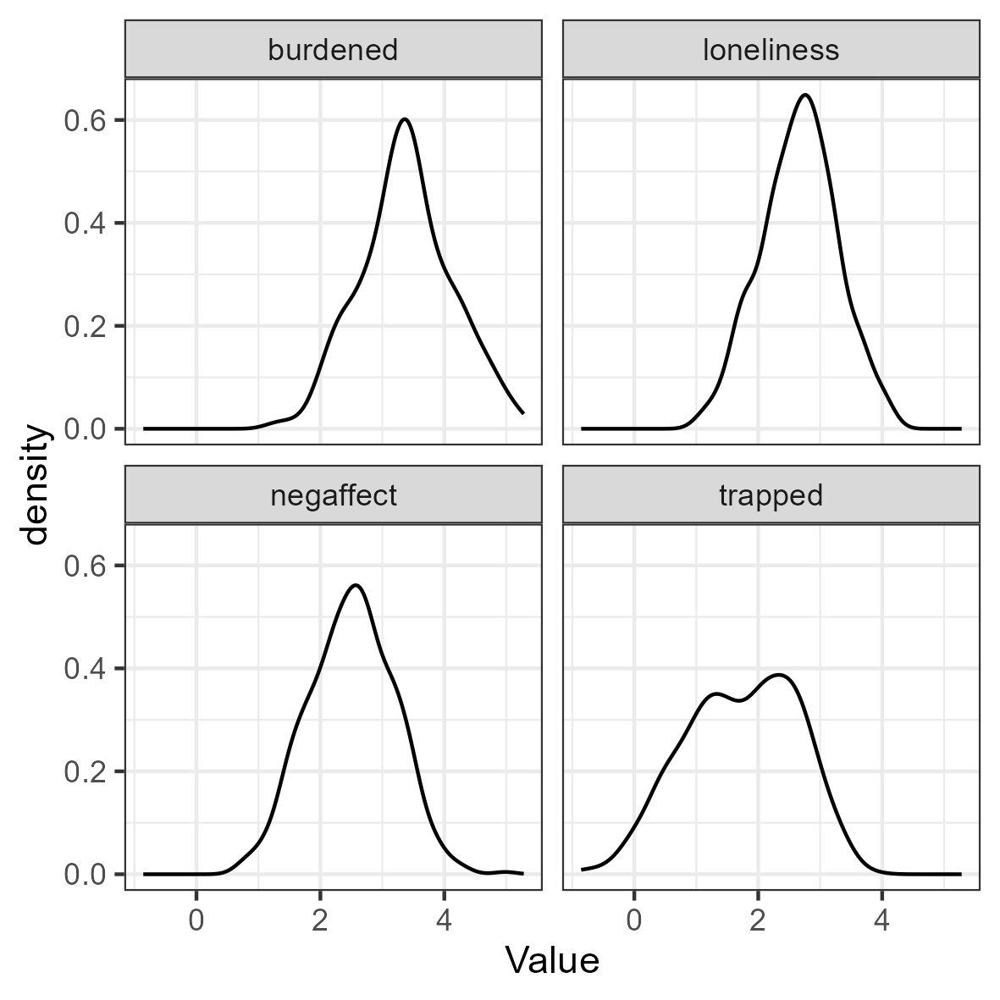
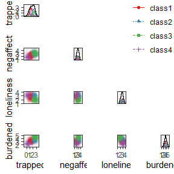
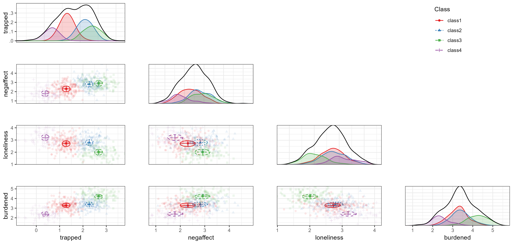
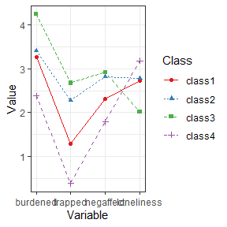
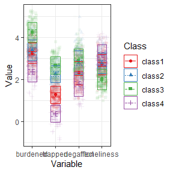
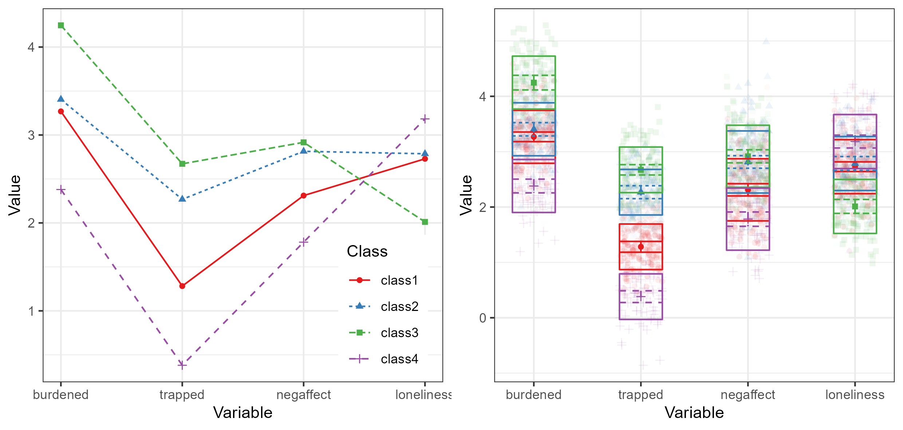

This is an example of confirmatory LPA using `tidySEM`,
as explained in Van Lissa, C. J., Garnier-Villarreal, M., & Anadria, D. (2023). *Recommended Practices in Latent Class Analysis using the Open-Source R-Package tidySEM.* Structural Equation Modeling. <https://doi.org/10.1080/10705511.2023.2250920>.
The simulated data are based on work by Zegwaard and colleagues,
who sought to establish a typology of caregivers who support a close other receiving outpatient psychological care.
Qualitative research among experts resulted in a theory postulating the existence of four types of caregivers (translated from the original Dutch):

**Balanced**

> The balanced caregiver experiences relative balance between the costs and benefits of caring for a close other.

**Imbalanced**

> The imbalanced caregiver experiences a precarious balance between the costs and benefits of caring for a close other.

**Lonely**

> The lonely caregiver experiences a strong sense of isolation.

**Entrapped**

> The entrapped caregiver strongly feels a sense of being entangled in responsibilities which are difficult to fulfill.

The goal of this confirmatory study was to validate this hypothesized class solution in a sample of caregivers.
A convenience sample was used, with no prior sample size justification.
To view the data documentation,
run the command `?tidySEM::zegwaard_carecompass` in the R console.

## Loading the Data

To load the data, simply attach the `tidySEM` package.
For convenience, we assign the variables used for analysis to an object called `df`.
We first only use the four scales: `c("burdened", "trapped", "negaffect", "loneliness")`.


``` r
# Load required packages
library(tidySEM)
library(ggplot2)
library(OpenMx)
# Load data
df <- zegwaard_carecompass[, c("burdened", "trapped", "negaffect",
    "loneliness")]
```

## Descriptive statistics

We use `tidySEM::descriptives()` to describe the data numerically.
Because all scales are continuous,
we select only columns for continuous data to de-clutter the table:


``` r
desc <- tidySEM::descriptives(df)
desc <- desc[, c("name", "n", "missing", "unique", "mean", "median",
    "sd", "min", "max", "skew_2se", "kurt_2se")]
desc
```


Table: Descriptive statistics

|name       |   n| missing| unique| mean| median|   sd|   min| max| skew_2se| kurt_2se|
|:----------|---:|-------:|------:|----:|------:|----:|-----:|---:|--------:|--------:|
|burdened   | 509|    0.01|    509|  3.4|    3.4| 0.75|  1.20| 5.3|     0.17|    -0.41|
|trapped    | 505|    0.02|    505|  1.7|    1.8| 0.90| -0.86| 3.8|    -1.03|    -1.52|
|negaffect  | 506|    0.01|    506|  2.5|    2.5| 0.69|  0.71| 5.0|     0.08|    -0.38|
|loneliness | 510|    0.01|    510|  2.7|    2.7| 0.62|  0.98| 4.2|    -0.33|    -0.62|


The table indicates two potential causes for concern:
there is a small percentage of missingness,
and all variables have relatively high kurtosis.
Since there are some missing values,
we can conduct an MCAR test using `mice::mcar(df)`.
According to Hawkins' test,
there is no evidence to reject the assumptions of multivariate normality and MCAR, $\tilde{\chi^2}(6) = 3.78, \tilde{p} = 0.71$.
Missing data will be accounted for using FIML.

Additionally, we can plot the data.
The `ggplot2` function `geom_density()` is useful for continuous data.
Visual inspection confirms the conclusions from the `descriptives()` table:
the data are kurtotic (peaked).


``` r
df_plot <- df
names(df_plot) <- paste0("Value.", names(df_plot))
df_plot <- reshape(df_plot, varying = names(df_plot), direction = "long",
    timevar = "Variable")
ggplot(df_plot, aes(x = Value)) + geom_density() + facet_wrap(~Variable) +
    theme_bw()
```



## Conducting Latent Profile Analysis

As all variables are continuous, we can use the convenience function
`tidySEM::mx_profiles()`,
which is a wrapper for the generic function `mx_mixture()` optimized for continuous indicators.
Its default settings are appropriate for LPA, assuming fixed variances across classes and zero covariances.
Its arguments are `data` and number of `classes`.
All variables in `data` are included in the analysis,
which is why we first selected the indicator variables.
As this is a confirmatory LCA,
we do not follow a strictly data-driven class enumeration procedure.
We will set the maximum number of classes $K$ to one more than the theoretically expected number.
We set a seed to ensure replicable results.


```
#> 
MxComputeSimAnnealing(tsallis1996) evaluations 819 fit 11277.1 change 74.77
MxComputeSimAnnealing(tsallis1996) evaluations 1676 fit 11202.4 change -28.05
MxComputeSimAnnealing(tsallis1996) evaluations 2543 fit 8308.23 change 2100  
MxComputeSimAnnealing(tsallis1996) evaluations 3395 fit 5162.13 change 7.67
MxComputeSimAnnealing(tsallis1996) evaluations 4249 fit 4144.4 change -4887
MxComputeSimAnnealing(tsallis1996) evaluations 5096 fit 8190.97 change 43.44
MxComputeSimAnnealing(tsallis1996) evaluations 5935 fit 4155.54 change -886.6
MxComputeSimAnnealing(tsallis1996) evaluations 6763 fit 6203.96 change 2123  
MxComputeSimAnnealing(tsallis1996) evaluations 7592 fit 4139.99 change -3423
MxComputeSimAnnealing(tsallis1996) evaluations 8402 fit 4062.8 change -0.8286
MxComputeSimAnnealing(tsallis1996) evaluations 9229 fit 7535.26 change -20.41
MxComputeSimAnnealing(tsallis1996) evaluations 10000 fit 4314.96 change 252.2
MxComputeSimAnnealing(tsallis1996) evaluations 10788 fit 7545.84 change -29  
MxComputeSimAnnealing(tsallis1996) evaluations 11610 fit 4064.09 change -78.65
MxComputeSimAnnealing(tsallis1996) evaluations 12441 fit 4065.77 change 2.612 
MxComputeSimAnnealing(tsallis1996) evaluations 13243 fit 4614.28 change 551.5
MxComputeSimAnnealing(tsallis1996) evaluations 14056 fit 6306.34 change 2243 
MxComputeSimAnnealing(tsallis1996) evaluations 14897 fit 4062.74 change -336.7
MxComputeSimAnnealing(tsallis1996) evaluations 15710 fit 4063.23 change 0.4752
MxComputeSimAnnealing(tsallis1996) evaluations 16502 fit 4062.74 change -0.001139
                                                                                 
#> 
MxComputeSimAnnealing(tsallis1996) evaluations 472 fit 4581.67 change 0.9096
MxComputeSimAnnealing(tsallis1996) evaluations 1047 fit 4580.76 change 8.001
MxComputeSimAnnealing(tsallis1996) evaluations 1617 fit 5457.81 change 11.66
MxComputeSimAnnealing(tsallis1996) evaluations 2177 fit 5195.56 change -19.84
MxComputeSimAnnealing(tsallis1996) evaluations 2760 fit 6435.85 change 1854  
MxComputeSimAnnealing(tsallis1996) evaluations 3328 fit 5287.88 change -238.7
MxComputeSimAnnealing(tsallis1996) evaluations 3893 fit 4610.42 change 0.02812
MxComputeSimAnnealing(tsallis1996) evaluations 4458 fit 4850.72 change -1765  
MxComputeSimAnnealing(tsallis1996) evaluations 5015 fit 8424.22 change -266.7
MxComputeSimAnnealing(tsallis1996) evaluations 5586 fit 6895.84 change 2929  
MxComputeSimAnnealing(tsallis1996) evaluations 6166 fit 5188.42 change 1274
MxComputeSimAnnealing(tsallis1996) evaluations 6717 fit 4691.67 change 8.398
MxComputeSimAnnealing(tsallis1996) evaluations 7311 fit 3907.26 change -620.2
MxComputeSimAnnealing(tsallis1996) evaluations 7877 fit 7218.68 change 3224  
MxComputeSimAnnealing(tsallis1996) evaluations 8434 fit 4004.87 change 81.53
MxComputeSimAnnealing(tsallis1996) evaluations 9009 fit 3903.82 change -441.6
MxComputeSimAnnealing(tsallis1996) evaluations 9576 fit 5041.42 change 1126  
MxComputeSimAnnealing(tsallis1996) evaluations 10136 fit 3908.1 change -1142
MxComputeSimAnnealing(tsallis1996) evaluations 10688 fit 3952 change -1660  
MxComputeSimAnnealing(tsallis1996) evaluations 11245 fit 5634.27 change 12.2
MxComputeSimAnnealing(tsallis1996) evaluations 11799 fit 3903.96 change 0.1539
MxComputeSimAnnealing(tsallis1996) evaluations 12361 fit 3904.29 change -848.3
MxComputeSimAnnealing(tsallis1996) evaluations 12923 fit 3920.72 change 17.95 
MxComputeSimAnnealing(tsallis1996) evaluations 13477 fit 5659.94 change 1756 
MxComputeSimAnnealing(tsallis1996) evaluations 14031 fit 3902.8 change -125 
MxComputeSimAnnealing(tsallis1996) evaluations 14584 fit 3902.76 change 0.03476
MxComputeSimAnnealing(tsallis1996) evaluations 15112 fit 3905.29 change 2.561  
MxComputeSimAnnealing(tsallis1996) evaluations 15663 fit 3903.37 change 0.4264
MxComputeSimAnnealing(tsallis1996) evaluations 16202 fit 3902.71 change -0.04162
MxComputeSimAnnealing(tsallis1996) evaluations 16737 fit 3902.96 change -1753   
MxComputeSimAnnealing(tsallis1996) evaluations 17296 fit 3903.05 change -1763
MxComputeSimAnnealing(tsallis1996) evaluations 17851 fit 3902.71 change -1767
MxComputeSimAnnealing(tsallis1996) evaluations 18420 fit 4145.15 change -615.1
MxComputeSimAnnealing(tsallis1996) evaluations 18971 fit 3903.72 change -7.944
MxComputeSimAnnealing(tsallis1996) evaluations 19527 fit 3902.91 change 0.1964
MxComputeSimAnnealing(tsallis1996) evaluations 20085 fit 3902.8 change 6.406e-06
MxComputeSimAnnealing(tsallis1996) evaluations 20658 fit 5670.97 change 1768    
MxComputeSimAnnealing(tsallis1996) evaluations 21218 fit 5655.97 change 1753
MxComputeSimAnnealing(tsallis1996) evaluations 21769 fit 4151.83 change 249.1
MxComputeSimAnnealing(tsallis1996) evaluations 22323 fit 4819.55 change 916.8
MxComputeSimAnnealing(tsallis1996) evaluations 22869 fit 3906.14 change 3.415
                                                                             
#> 
MxComputeSimAnnealing(tsallis1996) evaluations 183 fit 4631.25 change -610
MxComputeSimAnnealing(tsallis1996) evaluations 624 fit 3955.82 change -684.7
MxComputeSimAnnealing(tsallis1996) evaluations 1052 fit 5494.07 change 12.23
MxComputeSimAnnealing(tsallis1996) evaluations 1498 fit 3955.82 change -684.7
MxComputeSimAnnealing(tsallis1996) evaluations 1926 fit 5494.07 change 12.23 
MxComputeSimAnnealing(tsallis1996) evaluations 2347 fit 4640.49 change 0.8943
MxComputeSimAnnealing(tsallis1996) evaluations 2760 fit 4639.6 change 8.347  
MxComputeSimAnnealing(tsallis1996) evaluations 3206 fit 4974.07 change -5212
MxComputeSimAnnealing(tsallis1996) evaluations 3634 fit 4634.82 change 8.346
MxComputeSimAnnealing(tsallis1996) evaluations 4059 fit 7050.87 change -1998
MxComputeSimAnnealing(tsallis1996) evaluations 4486 fit 3944.12 change -689.8
MxComputeSimAnnealing(tsallis1996) evaluations 4931 fit 4963.24 change 862.8 
MxComputeSimAnnealing(tsallis1996) evaluations 5353 fit 5450.15 change 8.192
MxComputeSimAnnealing(tsallis1996) evaluations 5786 fit 8907.64 change 4215 
MxComputeSimAnnealing(tsallis1996) evaluations 6216 fit 3900.59 change -54.76
MxComputeSimAnnealing(tsallis1996) evaluations 6639 fit 5014.63 change -466.7
MxComputeSimAnnealing(tsallis1996) evaluations 7052 fit 5477.83 change 292.5 
MxComputeSimAnnealing(tsallis1996) evaluations 7481 fit 3968.35 change -1.316
MxComputeSimAnnealing(tsallis1996) evaluations 7914 fit 3881.59 change -329.1
MxComputeSimAnnealing(tsallis1996) evaluations 8344 fit 4760.11 change -194.7
MxComputeSimAnnealing(tsallis1996) evaluations 8765 fit 4586.33 change -17.46
MxComputeSimAnnealing(tsallis1996) evaluations 9183 fit 4308.19 change 3.973 
MxComputeSimAnnealing(tsallis1996) evaluations 9606 fit 4945.85 change 1104 
MxComputeSimAnnealing(tsallis1996) evaluations 10037 fit 3842.65 change 1.862
MxComputeSimAnnealing(tsallis1996) evaluations 10464 fit 4198.78 change -438.6
MxComputeSimAnnealing(tsallis1996) evaluations 10898 fit 4460.64 change 593.5 
MxComputeSimAnnealing(tsallis1996) evaluations 11316 fit 3843.65 change -94.74
MxComputeSimAnnealing(tsallis1996) evaluations 11747 fit 3842.76 change -898.3
MxComputeSimAnnealing(tsallis1996) evaluations 12175 fit 3884.72 change 50.47 
MxComputeSimAnnealing(tsallis1996) evaluations 12600 fit 4606 change 748.6   
MxComputeSimAnnealing(tsallis1996) evaluations 13023 fit 4439.24 change -5.136
MxComputeSimAnnealing(tsallis1996) evaluations 13448 fit 4811.38 change 15.9  
MxComputeSimAnnealing(tsallis1996) evaluations 13875 fit 4475.59 change 142.1
MxComputeSimAnnealing(tsallis1996) evaluations 14298 fit 4380.01 change -409.9
MxComputeSimAnnealing(tsallis1996) evaluations 14718 fit 3832.75 change -0.1112
MxComputeSimAnnealing(tsallis1996) evaluations 15144 fit 3832.94 change 0.299  
MxComputeSimAnnealing(tsallis1996) evaluations 15552 fit 3832.62 change -657.6
MxComputeSimAnnealing(tsallis1996) evaluations 15978 fit 3860.93 change -656  
MxComputeSimAnnealing(tsallis1996) evaluations 16403 fit 3928.47 change -569.9
MxComputeSimAnnealing(tsallis1996) evaluations 16825 fit 4808.11 change 966.5 
MxComputeSimAnnealing(tsallis1996) evaluations 17249 fit 3832.54 change -59.59
MxComputeSimAnnealing(tsallis1996) evaluations 17661 fit 3832.73 change -323.9
MxComputeSimAnnealing(tsallis1996) evaluations 18081 fit 3960.96 change -628.5
MxComputeSimAnnealing(tsallis1996) evaluations 18500 fit 3833.51 change -4439 
MxComputeSimAnnealing(tsallis1996) evaluations 18922 fit 4299.67 change 402.4
MxComputeSimAnnealing(tsallis1996) evaluations 19335 fit 4782.98 change 950.3
MxComputeSimAnnealing(tsallis1996) evaluations 19731 fit 3832.62 change 0.09746
MxComputeSimAnnealing(tsallis1996) evaluations 20151 fit 3848.43 change -733.5 
MxComputeSimAnnealing(tsallis1996) evaluations 20584 fit 3832.95 change -502.5
MxComputeSimAnnealing(tsallis1996) evaluations 21004 fit 3832.52 change -669  
MxComputeSimAnnealing(tsallis1996) evaluations 21428 fit 3832.52 change -0.01287
MxComputeSimAnnealing(tsallis1996) evaluations 21847 fit 3918.73 change 86.2    
MxComputeSimAnnealing(tsallis1996) evaluations 22267 fit 3839.58 change -738.4
MxComputeSimAnnealing(tsallis1996) evaluations 22689 fit 3988.83 change 155.5 
MxComputeSimAnnealing(tsallis1996) evaluations 23110 fit 3870.66 change 38.12
MxComputeSimAnnealing(tsallis1996) evaluations 23530 fit 4578.4 change 745.9 
MxComputeSimAnnealing(tsallis1996) evaluations 23931 fit 3841.15 change 8.623
MxComputeSimAnnealing(tsallis1996) evaluations 24351 fit 3832.57 change -937.7
MxComputeSimAnnealing(tsallis1996) evaluations 24772 fit 3985.92 change -590.9
MxComputeSimAnnealing(tsallis1996) evaluations 25197 fit 5118.51 change 1286  
MxComputeSimAnnealing(tsallis1996) evaluations 25616 fit 3832.52 change -943.8
MxComputeSimAnnealing(tsallis1996) evaluations 26036 fit 4580.31 change 747.8 
MxComputeSimAnnealing(tsallis1996) evaluations 26446 fit 3832.98 change -798.5
MxComputeSimAnnealing(tsallis1996) evaluations 26876 fit 3833.65 change 1.137 
MxComputeSimAnnealing(tsallis1996) evaluations 27285 fit 3832.54 change -2.905
MxComputeSimAnnealing(tsallis1996) evaluations 27703 fit 3832.67 change -69.92
MxComputeSimAnnealing(tsallis1996) evaluations 28085 fit 3832.55 change 0.02614
MxComputeSimAnnealing(tsallis1996) evaluations 28499 fit 3832.53 change 0.01631
MxComputeSimAnnealing(tsallis1996) evaluations 28902 fit 3832.56 change -0.5818
MxComputeSimAnnealing(tsallis1996) evaluations 29312 fit 3967.12 change 134.6  
                                                                             
#> 
MxComputeSimAnnealing(tsallis1996) evaluations 311 fit 4571.53 change 0.005152
MxComputeSimAnnealing(tsallis1996) evaluations 652 fit 8422.27 change 4521    
MxComputeSimAnnealing(tsallis1996) evaluations 990 fit 12012.1 change 5176
MxComputeSimAnnealing(tsallis1996) evaluations 1331 fit 12447.1 change 3929
MxComputeSimAnnealing(tsallis1996) evaluations 1658 fit 3902.12 change -0.04703
MxComputeSimAnnealing(tsallis1996) evaluations 1988 fit 4560.99 change 278     
MxComputeSimAnnealing(tsallis1996) evaluations 2329 fit 3902.17 change 0.7477
MxComputeSimAnnealing(tsallis1996) evaluations 2660 fit 4560.96 change 276.8 
MxComputeSimAnnealing(tsallis1996) evaluations 3002 fit 3902 change -0.04672
MxComputeSimAnnealing(tsallis1996) evaluations 3337 fit 3902.05 change 0.7469
MxComputeSimAnnealing(tsallis1996) evaluations 3678 fit 7504.51 change 2875  
MxComputeSimAnnealing(tsallis1996) evaluations 4023 fit 4802.31 change 14.54
MxComputeSimAnnealing(tsallis1996) evaluations 4365 fit 4276.1 change -1.836
MxComputeSimAnnealing(tsallis1996) evaluations 4687 fit 5083.78 change -1625
MxComputeSimAnnealing(tsallis1996) evaluations 5027 fit 4512.47 change -570.4
MxComputeSimAnnealing(tsallis1996) evaluations 5355 fit 3893.87 change -2.066
MxComputeSimAnnealing(tsallis1996) evaluations 5698 fit 5507.22 change 245.7 
MxComputeSimAnnealing(tsallis1996) evaluations 6026 fit 3896.46 change -0.5318
MxComputeSimAnnealing(tsallis1996) evaluations 6359 fit 4582.47 change 0.005339
MxComputeSimAnnealing(tsallis1996) evaluations 6696 fit 3895.65 change -686.8  
MxComputeSimAnnealing(tsallis1996) evaluations 7044 fit 4739.82 change -5632 
MxComputeSimAnnealing(tsallis1996) evaluations 7385 fit 4984.39 change -22.55
MxComputeSimAnnealing(tsallis1996) evaluations 7721 fit 4416.42 change -590.5
MxComputeSimAnnealing(tsallis1996) evaluations 8048 fit 4365.11 change -3737 
MxComputeSimAnnealing(tsallis1996) evaluations 8385 fit 3846.99 change -3853
MxComputeSimAnnealing(tsallis1996) evaluations 8721 fit 4678.22 change 639.2
MxComputeSimAnnealing(tsallis1996) evaluations 9050 fit 3885.65 change -0.7486
MxComputeSimAnnealing(tsallis1996) evaluations 9389 fit 5164.08 change 207.9  
MxComputeSimAnnealing(tsallis1996) evaluations 9729 fit 3972.51 change 73.42
MxComputeSimAnnealing(tsallis1996) evaluations 10066 fit 4299.99 change -176.2
MxComputeSimAnnealing(tsallis1996) evaluations 10409 fit 4740.62 change 605.1 
MxComputeSimAnnealing(tsallis1996) evaluations 10747 fit 4760.98 change 19.36
MxComputeSimAnnealing(tsallis1996) evaluations 11089 fit 4575.32 change 9.095
MxComputeSimAnnealing(tsallis1996) evaluations 11419 fit 3831.38 change -38.56
MxComputeSimAnnealing(tsallis1996) evaluations 11774 fit 3831.21 change -3373 
MxComputeSimAnnealing(tsallis1996) evaluations 12116 fit 4614.63 change -141.9
MxComputeSimAnnealing(tsallis1996) evaluations 12452 fit 4100.54 change 272.5 
MxComputeSimAnnealing(tsallis1996) evaluations 12789 fit 4150.49 change 322.7
MxComputeSimAnnealing(tsallis1996) evaluations 13124 fit 4280.89 change -475.2
MxComputeSimAnnealing(tsallis1996) evaluations 13461 fit 4650.46 change -18.92
MxComputeSimAnnealing(tsallis1996) evaluations 13795 fit 4744.06 change 11.91 
MxComputeSimAnnealing(tsallis1996) evaluations 14130 fit 3906.81 change -41.24
MxComputeSimAnnealing(tsallis1996) evaluations 14464 fit 3827.67 change -511.6
MxComputeSimAnnealing(tsallis1996) evaluations 14792 fit 3838.34 change -1.531
MxComputeSimAnnealing(tsallis1996) evaluations 15128 fit 4125.66 change 256.7 
MxComputeSimAnnealing(tsallis1996) evaluations 15462 fit 3860.18 change 29.59
MxComputeSimAnnealing(tsallis1996) evaluations 15799 fit 3827.03 change -33.16
MxComputeSimAnnealing(tsallis1996) evaluations 16139 fit 3831.35 change 3.875 
MxComputeSimAnnealing(tsallis1996) evaluations 16475 fit 3827.28 change 0.1495
MxComputeSimAnnealing(tsallis1996) evaluations 16811 fit 3861.1 change 34.63  
MxComputeSimAnnealing(tsallis1996) evaluations 17145 fit 3826.86 change -96.3
MxComputeSimAnnealing(tsallis1996) evaluations 17479 fit 3853.07 change -2.335
MxComputeSimAnnealing(tsallis1996) evaluations 17817 fit 4104.66 change 278.4 
MxComputeSimAnnealing(tsallis1996) evaluations 18146 fit 4580.03 change 654.2
MxComputeSimAnnealing(tsallis1996) evaluations 18483 fit 3826.12 change -751.5
MxComputeSimAnnealing(tsallis1996) evaluations 18823 fit 3826.15 change 0.09664
MxComputeSimAnnealing(tsallis1996) evaluations 19157 fit 3849.59 change 23.54  
MxComputeSimAnnealing(tsallis1996) evaluations 19494 fit 3825.82 change -22.31
MxComputeSimAnnealing(tsallis1996) evaluations 19828 fit 3825.8 change -753   
MxComputeSimAnnealing(tsallis1996) evaluations 20159 fit 3895.85 change 68.46
MxComputeSimAnnealing(tsallis1996) evaluations 20496 fit 4573.54 change 747.4
MxComputeSimAnnealing(tsallis1996) evaluations 20840 fit 4070.61 change 230.4
MxComputeSimAnnealing(tsallis1996) evaluations 21177 fit 3860.9 change 34.54 
MxComputeSimAnnealing(tsallis1996) evaluations 21502 fit 4459.17 change -2.543
MxComputeSimAnnealing(tsallis1996) evaluations 21836 fit 4325.12 change 499.8 
MxComputeSimAnnealing(tsallis1996) evaluations 22172 fit 3825.2 change -0.4847
MxComputeSimAnnealing(tsallis1996) evaluations 22508 fit 3847.03 change 21.95 
MxComputeSimAnnealing(tsallis1996) evaluations 22844 fit 4478.04 change 652.7
MxComputeSimAnnealing(tsallis1996) evaluations 23179 fit 3825.16 change -2.595
MxComputeSimAnnealing(tsallis1996) evaluations 23518 fit 3825.53 change -658.1
MxComputeSimAnnealing(tsallis1996) evaluations 23856 fit 3825.05 change 0.1902
MxComputeSimAnnealing(tsallis1996) evaluations 24188 fit 3835.57 change 10.6  
MxComputeSimAnnealing(tsallis1996) evaluations 24536 fit 6177.03 change 2352
MxComputeSimAnnealing(tsallis1996) evaluations 24860 fit 3824.78 change 0.0008851
MxComputeSimAnnealing(tsallis1996) evaluations 25195 fit 4654.22 change 829.4    
MxComputeSimAnnealing(tsallis1996) evaluations 25529 fit 3827.28 change 1.422
MxComputeSimAnnealing(tsallis1996) evaluations 25865 fit 3931.88 change 95.39
MxComputeSimAnnealing(tsallis1996) evaluations 26198 fit 3824.76 change -1.302
MxComputeSimAnnealing(tsallis1996) evaluations 26532 fit 4757.94 change 932.7 
MxComputeSimAnnealing(tsallis1996) evaluations 26865 fit 3836.09 change 11.33
MxComputeSimAnnealing(tsallis1996) evaluations 27198 fit 3824.77 change -2.506
MxComputeSimAnnealing(tsallis1996) evaluations 27537 fit 3834.09 change 2.411 
MxComputeSimAnnealing(tsallis1996) evaluations 27870 fit 3852.66 change 27.9 
MxComputeSimAnnealing(tsallis1996) evaluations 28190 fit 4506.3 change 681.4
MxComputeSimAnnealing(tsallis1996) evaluations 28529 fit 3824.82 change 0.04285
MxComputeSimAnnealing(tsallis1996) evaluations 28867 fit 3824.75 change -654.1 
MxComputeSimAnnealing(tsallis1996) evaluations 29202 fit 3827.04 change -382.8
MxComputeSimAnnealing(tsallis1996) evaluations 29535 fit 3824.84 change -2.385
MxComputeSimAnnealing(tsallis1996) evaluations 29868 fit 3828.24 change -928.8
MxComputeSimAnnealing(tsallis1996) evaluations 30203 fit 3824.76 change -0.003067
MxComputeSimAnnealing(tsallis1996) evaluations 30538 fit 3826.92 change 2.132    
MxComputeSimAnnealing(tsallis1996) evaluations 30872 fit 4758.26 change 930.7
MxComputeSimAnnealing(tsallis1996) evaluations 31211 fit 3825.12 change -2.252
MxComputeSimAnnealing(tsallis1996) evaluations 31538 fit 3825.42 change -918.7
MxComputeSimAnnealing(tsallis1996) evaluations 31872 fit 7278.16 change 3453  
MxComputeSimAnnealing(tsallis1996) evaluations 32207 fit 3825.01 change -12.26
MxComputeSimAnnealing(tsallis1996) evaluations 32542 fit 3824.76 change -0.001369
MxComputeSimAnnealing(tsallis1996) evaluations 32876 fit 3824.76 change -0.0133  
MxComputeSimAnnealing(tsallis1996) evaluations 33211 fit 3824.81 change -14.54 
MxComputeSimAnnealing(tsallis1996) evaluations 33546 fit 3888.96 change 64.21 
MxComputeSimAnnealing(tsallis1996) evaluations 33879 fit 3861.43 change 36.66
MxComputeSimAnnealing(tsallis1996) evaluations 34230 fit 3825.86 change -1407
MxComputeSimAnnealing(tsallis1996) evaluations 34566 fit 3909.21 change 84.45
MxComputeSimAnnealing(tsallis1996) evaluations 34886 fit 3836.53 change -651.5
MxComputeSimAnnealing(tsallis1996) evaluations 35214 fit 3845.16 change 20.39 
MxComputeSimAnnealing(tsallis1996) evaluations 35538 fit 3824.78 change 0.01847
MxComputeSimAnnealing(tsallis1996) evaluations 35866 fit 4483 change 658       
                                                                        
```

``` r
set.seed(123)
res <- mx_profiles(data = df, classes = 1:5)
```


This analysis should produce some messages about cluster initialization.
These relate to the selection of starting values,
which relies on the K-means algorithm and is not robust to missing data.
The algorithm automatically switches to hierarchical clustering, no further action is required.

## Class Enumeration

To compare the fit of the theoretical model against other models,
we create a model fit table using
`table_fit()` and retain relevant columns.
We also determine whether any models can be disqualified.

In this example, all models converge without issues.
If, for example, the two-class solution had not converged, we could use the function `res[[2]] <- mxTryHard(res[[2]])` to aid convergence.

Next, we check for local identifiability.
The sample size is consistently reported as 513,
which means that partially missing cases were indeed included via FIML.
The smallest class size occurs in the 5-class model,
where the smallest class is assigned 7% of cases, or 38 cases.
This model has 28 parameters, approximately 6 per class.
We thus have at least five observations per parameter in every class,
and do not disqualify the 5-class model.

There are concerns about theoretical interpretability of all solutions,
as the entropies and minimum classification probabilities are all low.
However, in this confirmatory use case, we address this when interpreting the results.


``` r
fit <- table_fit(res)  # model fit table
fit[, c("Name", "LL", "Parameters", "n", "BIC", "Entropy", "prob_min",
    "prob_max", "n_min", "n_max", "np_ratio", "np_local")]
```


Table: Model fit table

|Name        |    LL|  p|   n|  BIC| Entropy| p_min| p_max| n_min| n_max|
|:-----------|-----:|--:|---:|----:|-------:|-----:|-----:|-----:|-----:|
|equal var 1 | -2242|  8| 513| 4534|    1.00|  1.00|  1.00|  1.00|  1.00|
|equal var 2 | -2031| 13| 513| 4144|    0.74|  0.91|  0.93|  0.42|  0.58|
|equal var 3 | -1951| 18| 513| 4015|    0.78|  0.89|  0.91|  0.19|  0.54|
|equal var 4 | -1916| 23| 513| 3976|    0.75|  0.81|  0.92|  0.16|  0.34|
|equal var 5 | -1912| 28| 513| 3999|    0.79|  0.81|  0.92|  0.00|  0.34|


### Using ICs

the 4-class solution has the lowest BIC,
which means it is preferred over all other solutions including a 1-class solution and a solution with more classes.
Note that a scree plot for the BIC can be plotted by calling `plot(fit)`.
Following the elbow criterion, a three-class solution would also be defensible.
The function `ic_weights(fit)` allows us to compute IC weights;
it indicates that, conditional on the set of models,
the 4-class model has a posterior model probability of nearly 100%.

### Using LMR tests

If we conduct LMR tests, we find that the tests are significant for all pairwise model comparisons, except for the 5-class model:


``` r
lr_lmr(res)
```


Table: LMR test table

|null |alt  |    lr| df|    p|   w2| p_w2|
|:----|:----|-----:|--:|----:|----:|----:|
|mix1 |mix2 | 10.25|  5| 0.00| 0.82|    0|
|mix2 |mix3 |  5.30|  5| 0.00| 0.44|    0|
|mix3 |mix4 |  4.14|  5| 0.00| 0.14|    0|
|mix4 |mix5 |  0.88|  5| 0.19| 0.04|    0|


### Using BLRT tests

We can also use the BLRT test.
As it is very computationally expensive,
we will use a low number of replications here.
In practice, one might use a much higher number (1000+) for published research.
Keep in mind that the p-value of the BLRT is subject to Monte Carlo error;
if it fluctuates when analyses are replicated or its value is very close to the critical threshold, consider increasing the number of replications.

To accelerate computations, we can use the `future` package for parallel computing (see `?plan` to select the appropriate back-end for your system).
To track the function's progress,
we use the `progressr` ecosystem,
which allows users to choose how they want to be informed.
The example below uses a progress bar:


``` r
library(future)
library(progressr)
plan(multisession)  # Parallel processing for Windows
handlers("progress")  # Progress bar
set.seed(1)
res_blrt <- BLRT(res, replications = 100)
```


Table: BLRT test table

|null |alt  |    lr| df| blrt_p| samples|
|:----|:----|-----:|--:|------:|-------:|
|mix1 |mix2 | 421.2|  5|   0.00|     100|
|mix2 |mix3 | 160.0|  5|   0.00|     100|
|mix3 |mix4 |  70.2|  5|   0.00|     100|
|mix4 |mix5 |   7.8|  5|   0.36|     100|


In sum, across all class enumeration criteria, there is strong support for a 4-class solution.

## Optional: Alternative Model Specifications

In the case of confirmatory LCA, the theory would be refuted by strong evidence against the hypothesized model and number of classes.
In the preceding, we only compared the theoretical model against models with different number of classes.
Imagine, however, that a Reviewer argues that variance ought to be freely estimated across classes.
We could compare our theoretical model against their competing model as follows.
Note that we can put two models into a list to compare them.


```
#> 
MxComputeSimAnnealing(tsallis1996) evaluations 107 fit 3924.48 change -1.102
MxComputeSimAnnealing(tsallis1996) evaluations 532 fit 7270.07 change 3346  
MxComputeSimAnnealing(tsallis1996) evaluations 949 fit 3925.97 change 0.382
MxComputeSimAnnealing(tsallis1996) evaluations 1363 fit 4536.98 change 0.008813
MxComputeSimAnnealing(tsallis1996) evaluations 1773 fit 5150.05 change -23.7   
MxComputeSimAnnealing(tsallis1996) evaluations 2191 fit 4522.23 change -654.7
MxComputeSimAnnealing(tsallis1996) evaluations 2616 fit 4430.33 change -745.9
MxComputeSimAnnealing(tsallis1996) evaluations 3025 fit 5717.83 change -9.715
MxComputeSimAnnealing(tsallis1996) evaluations 3438 fit 6234.12 change -366.7
MxComputeSimAnnealing(tsallis1996) evaluations 3839 fit 5152.17 change 2.12  
MxComputeSimAnnealing(tsallis1996) evaluations 4255 fit 4779.05 change 95.2
MxComputeSimAnnealing(tsallis1996) evaluations 4663 fit 6735.83 change 910.7
MxComputeSimAnnealing(tsallis1996) evaluations 5083 fit 5697.49 change -2633
MxComputeSimAnnealing(tsallis1996) evaluations 5509 fit 5672.4 change -6.591
MxComputeSimAnnealing(tsallis1996) evaluations 5937 fit 5168.08 change 581  
MxComputeSimAnnealing(tsallis1996) evaluations 6370 fit 3926 change 2.599 
MxComputeSimAnnealing(tsallis1996) evaluations 6799 fit 7083.14 change 1617
MxComputeSimAnnealing(tsallis1996) evaluations 7213 fit 3923.77 change -0.1482
MxComputeSimAnnealing(tsallis1996) evaluations 7630 fit 3911.87 change 34.47  
MxComputeSimAnnealing(tsallis1996) evaluations 8058 fit 6264.36 change 708.3
MxComputeSimAnnealing(tsallis1996) evaluations 8485 fit 5419.11 change -7.019
MxComputeSimAnnealing(tsallis1996) evaluations 8908 fit 4180.01 change -1242 
MxComputeSimAnnealing(tsallis1996) evaluations 9335 fit 5160.5 change 25    
MxComputeSimAnnealing(tsallis1996) evaluations 9763 fit 4502.24 change 500.7
MxComputeSimAnnealing(tsallis1996) evaluations 10192 fit 5699.39 change 1757
MxComputeSimAnnealing(tsallis1996) evaluations 10618 fit 5394.68 change -112.9
MxComputeSimAnnealing(tsallis1996) evaluations 11050 fit 5124.07 change 24.34 
MxComputeSimAnnealing(tsallis1996) evaluations 11452 fit 6953.29 change 3090 
MxComputeSimAnnealing(tsallis1996) evaluations 11869 fit 3943.53 change 21.61
MxComputeSimAnnealing(tsallis1996) evaluations 12277 fit 4498.14 change 21.35
MxComputeSimAnnealing(tsallis1996) evaluations 12691 fit 5095.28 change 0    
MxComputeSimAnnealing(tsallis1996) evaluations 13106 fit 3991.97 change -1594
MxComputeSimAnnealing(tsallis1996) evaluations 13523 fit 5618.57 change 1770 
MxComputeSimAnnealing(tsallis1996) evaluations 13942 fit 5617.05 change 1387
MxComputeSimAnnealing(tsallis1996) evaluations 14363 fit 5556.61 change 1678
MxComputeSimAnnealing(tsallis1996) evaluations 14782 fit 4273.76 change 427.2
MxComputeSimAnnealing(tsallis1996) evaluations 15201 fit 5559.01 change 1712 
MxComputeSimAnnealing(tsallis1996) evaluations 15604 fit 4582.07 change 0   
MxComputeSimAnnealing(tsallis1996) evaluations 16022 fit 4366.8 change -246.4
MxComputeSimAnnealing(tsallis1996) evaluations 16441 fit 4608.18 change -425.5
MxComputeSimAnnealing(tsallis1996) evaluations 16860 fit 5024.89 change 1043  
MxComputeSimAnnealing(tsallis1996) evaluations 17270 fit 3839.99 change -70.31
MxComputeSimAnnealing(tsallis1996) evaluations 17685 fit 3839.89 change -1891 
MxComputeSimAnnealing(tsallis1996) evaluations 18096 fit 4050.54 change 211.7
MxComputeSimAnnealing(tsallis1996) evaluations 18506 fit 4464.96 change 276.4
MxComputeSimAnnealing(tsallis1996) evaluations 18928 fit 3863.93 change -746.7
MxComputeSimAnnealing(tsallis1996) evaluations 19348 fit 4621.17 change 730.3 
MxComputeSimAnnealing(tsallis1996) evaluations 19750 fit 4203.82 change 357.5
MxComputeSimAnnealing(tsallis1996) evaluations 20163 fit 3836.91 change -10.39
MxComputeSimAnnealing(tsallis1996) evaluations 20631 fit 3864.1 change 25.06  
MxComputeSimAnnealing(tsallis1996) evaluations 21045 fit 5344.2 change 1495 
MxComputeSimAnnealing(tsallis1996) evaluations 21455 fit 3884.41 change -271.3
MxComputeSimAnnealing(tsallis1996) evaluations 21865 fit 3832.77 change -1.718
MxComputeSimAnnealing(tsallis1996) evaluations 22279 fit 3934.31 change 85.84 
MxComputeSimAnnealing(tsallis1996) evaluations 22687 fit 3863.04 change -192.3
MxComputeSimAnnealing(tsallis1996) evaluations 23094 fit 4642.59 change 808   
MxComputeSimAnnealing(tsallis1996) evaluations 23509 fit 4747.17 change 438.9
MxComputeSimAnnealing(tsallis1996) evaluations 23917 fit 3830.91 change 1.99 
MxComputeSimAnnealing(tsallis1996) evaluations 24330 fit 4281.23 change 278.4
MxComputeSimAnnealing(tsallis1996) evaluations 24738 fit 3827.46 change -828.2
MxComputeSimAnnealing(tsallis1996) evaluations 25144 fit 3825.55 change -210.7
MxComputeSimAnnealing(tsallis1996) evaluations 25557 fit 3881.48 change 56.45 
MxComputeSimAnnealing(tsallis1996) evaluations 25994 fit 4663.49 change -3.495
MxComputeSimAnnealing(tsallis1996) evaluations 26397 fit 3824.03 change 0.004563
MxComputeSimAnnealing(tsallis1996) evaluations 26797 fit 3823.61 change -846.7  
MxComputeSimAnnealing(tsallis1996) evaluations 27215 fit 4376.81 change 550.5 
MxComputeSimAnnealing(tsallis1996) evaluations 27636 fit 3822.09 change -824.5
MxComputeSimAnnealing(tsallis1996) evaluations 28028 fit 3821.56 change -289.5
MxComputeSimAnnealing(tsallis1996) evaluations 28420 fit 3823.89 change -717.6
MxComputeSimAnnealing(tsallis1996) evaluations 28829 fit 4606.52 change 261.6 
MxComputeSimAnnealing(tsallis1996) evaluations 29243 fit 3821.39 change -1067
MxComputeSimAnnealing(tsallis1996) evaluations 29658 fit 3819.62 change 0.1167
MxComputeSimAnnealing(tsallis1996) evaluations 30067 fit 3819.45 change -0.1598
MxComputeSimAnnealing(tsallis1996) evaluations 30475 fit 3820.38 change -20.1  
MxComputeSimAnnealing(tsallis1996) evaluations 30886 fit 4001.39 change -839.7
MxComputeSimAnnealing(tsallis1996) evaluations 31298 fit 3819.05 change -0.01331
MxComputeSimAnnealing(tsallis1996) evaluations 31714 fit 4668.21 change -3.162  
MxComputeSimAnnealing(tsallis1996) evaluations 32115 fit 3818.72 change -9.493
MxComputeSimAnnealing(tsallis1996) evaluations 32528 fit 3818.74 change 0.04872
MxComputeSimAnnealing(tsallis1996) evaluations 32936 fit 3971.76 change 103.3  
MxComputeSimAnnealing(tsallis1996) evaluations 33347 fit 3818.66 change -21.87
MxComputeSimAnnealing(tsallis1996) evaluations 33759 fit 3818.62 change -1.725
MxComputeSimAnnealing(tsallis1996) evaluations 34159 fit 3836.2 change -919.5 
MxComputeSimAnnealing(tsallis1996) evaluations 34569 fit 3818.56 change -126.6
MxComputeSimAnnealing(tsallis1996) evaluations 34985 fit 3818.63 change -188.2
MxComputeSimAnnealing(tsallis1996) evaluations 35391 fit 3818.67 change 0.1493
MxComputeSimAnnealing(tsallis1996) evaluations 35798 fit 3818.55 change -0.2598
MxComputeSimAnnealing(tsallis1996) evaluations 36195 fit 4700.45 change 866.6  
MxComputeSimAnnealing(tsallis1996) evaluations 36606 fit 3818.55 change 0.05156
MxComputeSimAnnealing(tsallis1996) evaluations 37021 fit 3993.06 change 174.6  
MxComputeSimAnnealing(tsallis1996) evaluations 37438 fit 3820.03 change 1.541
MxComputeSimAnnealing(tsallis1996) evaluations 37851 fit 4066.97 change 248.5
MxComputeSimAnnealing(tsallis1996) evaluations 38263 fit 3848.36 change 29.14
MxComputeSimAnnealing(tsallis1996) evaluations 38677 fit 3895.57 change -205.9
MxComputeSimAnnealing(tsallis1996) evaluations 39092 fit 3818.49 change 4.089e-05
MxComputeSimAnnealing(tsallis1996) evaluations 39502 fit 3818.5 change -2.26     
MxComputeSimAnnealing(tsallis1996) evaluations 39912 fit 3820.55 change -169.1
MxComputeSimAnnealing(tsallis1996) evaluations 40322 fit 3818.55 change -0.04612
MxComputeSimAnnealing(tsallis1996) evaluations 40764 fit 4598.91 change 774.7   
MxComputeSimAnnealing(tsallis1996) evaluations 41171 fit 3818.62 change 0.1275
MxComputeSimAnnealing(tsallis1996) evaluations 41569 fit 3904.5 change -691   
MxComputeSimAnnealing(tsallis1996) evaluations 41982 fit 3818.51 change -887.1
MxComputeSimAnnealing(tsallis1996) evaluations 42394 fit 3818.48 change -0.01278
MxComputeSimAnnealing(tsallis1996) evaluations 42799 fit 3847.66 change -924.7  
MxComputeSimAnnealing(tsallis1996) evaluations 43213 fit 4598.08 change 779.2 
MxComputeSimAnnealing(tsallis1996) evaluations 43630 fit 3818.73 change 0.2495
MxComputeSimAnnealing(tsallis1996) evaluations 44023 fit 4106.58 change 288.1 
MxComputeSimAnnealing(tsallis1996) evaluations 44438 fit 3818.51 change 0.01826
MxComputeSimAnnealing(tsallis1996) evaluations 44839 fit 3818.78 change 0.3022 
                                                                              
```

``` r
res_alt <- mx_profiles(df, classes = 4, variances = "varying")
compare <- list(res[[4]], res_alt)
table_fit(compare)
```


Table: Comparing competing theoretical models

| Name|    LL| Parameters|  BIC| Entropy| prob_min| prob_max| n_min| n_max|
|----:|-----:|----------:|----:|-------:|--------:|--------:|-----:|-----:|
|    1| -1916|         23| 3976|    0.75|     0.81|     0.92|  0.16|  0.34|
|    2| -1909|         35| 4037|    0.78|     0.84|     0.92|  0.16|  0.32|


The alternative model incurs 12 additional parameters for the free variances.
Yet, it has a higher BIC, which indicates that this additional complexity does not outweigh the increase in fit.

## Interpreting the Final Class Solution

To interpret the final class solution,
we first reorder the 4-class model by class size.
This helps prevent label switching.


``` r
res_final <- mx_switch_labels(res[[4]])
```

```
#> 
MxComputeNumericDeriv 41/276
MxComputeNumericDeriv 177/276
                             
```

The 4-class model yielded classes of reasonable size;
using `class_pro`the largest class comprised 33%,
and the smallest comprised 16% of cases.
However, the entropy was low, $S = .75$, indicating poor class separability.
Furthermore, the posterior classification probability ranged from $[.81, .92]$, which means that at least some classes had a high classification error.
We produce a table of the results below.


``` r
table_results(res_final, columns = c("label", "est", "se", "confint",
    "class"))
```


Table: Four-class model results

|label                |  est|   se|confint      |class  |
|:--------------------|----:|----:|:------------|:------|
|Means.burdened       | 3.27| 0.04|[3.18, 3.36] |class1 |
|Means.trapped        | 1.28| 0.05|[1.18, 1.38] |class1 |
|Means.negaffect      | 2.31| 0.06|[2.20, 2.42] |class1 |
|Means.loneliness     | 2.73| 0.04|[2.64, 2.82] |class1 |
|Variances.burdened   | 0.23| 0.02|[0.19, 0.27] |class1 |
|Variances.trapped    | 0.17| 0.02|[0.14, 0.20] |class1 |
|Variances.negaffect  | 0.31| 0.02|[0.27, 0.36] |class1 |
|Variances.loneliness | 0.24| 0.02|[0.20, 0.28] |class1 |
|Means.burdened       | 3.40| 0.06|[3.28, 3.52] |class2 |
|Means.trapped        | 2.27| 0.06|[2.15, 2.38] |class2 |
|Means.negaffect      | 2.81| 0.06|[2.70, 2.93] |class2 |
|Means.loneliness     | 2.79| 0.06|[2.66, 2.91] |class2 |
|Means.burdened       | 4.25| 0.07|[4.12, 4.38] |class3 |
|Means.trapped        | 2.67| 0.05|[2.58, 2.77] |class3 |
|Means.negaffect      | 2.92| 0.06|[2.80, 3.03] |class3 |
|Means.loneliness     | 2.01| 0.06|[1.89, 2.14] |class3 |
|Means.burdened       | 2.38| 0.06|[2.26, 2.50] |class4 |
|Means.trapped        | 0.38| 0.05|[0.28, 0.49] |class4 |
|Means.negaffect      | 1.78| 0.07|[1.65, 1.91] |class4 |
|Means.loneliness     | 3.18| 0.06|[3.07, 3.30] |class4 |
|mix4.weights[1,1]    | 1.00|   NA|NA           |NA     |
|mix4.weights[1,2]    | 0.86| 0.15|[0.56, 1.15] |NA     |
|mix4.weights[1,3]    | 0.66| 0.11|[0.44, 0.88] |NA     |
|mix4.weights[1,4]    | 0.47| 0.08|[0.32, 0.63] |NA     |


The results are best interpreted by examining a plot of the model and data, however.
Relevant plot functions are `plot_bivariate()`, `plot_density()`, and `plot_profiles()`.
However, we omit the density plots, because `plot_bivariate()` also includes them.


``` r
plot_bivariate(res_final)
```
<!-- -->
<div class="figure">

<p class="caption">Bivariate profile plot</p>
</div>

On the diagonal of the bivariate plot are weighted density plots:
normal approximations of the density function of observed data,
weighed by class probability.
On the off-diagonal are plots for each pair of indicators,
with the class means indicated by a point,
class standard deviations indicated by lines,
and covariances indicated by circles.
As this model has zero covariances,
all circles are round (albeit warped by the different scales of the X and Y axes)

The marginal density plots show that trappedness distinguishes classes rather well.
For all other indicators, groups are not always clearly separated in terms of marginal density: class 2 and 3 coalesce on negative affect, 1 and 2 coalesce on loneliness, and 1 and 2 coalesce on burden.
Nevertheless, the off-diagonal scatterplots show reasonable bivariate separation for all classes.

We can obtain a more classic profile plot using `plot_profiles(res_final)`.
This plot conveys less information than the bivariate plot,
but is readily interpretable.
Below is a comparison between the most common type of visualization
for LPA, and the best-practices visualization provided by `tidySEM`.
Note that the best practices plot includes class means and error bars,
standard deviations,
and a ribbon plot of raw data weighted by class probability to indicate how well the classes describe the observed distribution.
The overlap between the classes is clearly visible in this figure;
this is why the entropy and classification probabilities are relatively low.

Based on the bivariate plot, we can label class 1 as the *balanced* type (33%),
class 2 as the *imbalanced* type (29%), class 3 as the *entrapped* type (22%),
and class 4 as the *lonely* type (16%).
Note however that the observed classes do not match the hypothesized pattern of class parameters exactly.


``` r
plot_profiles(res_final)
```
<!-- --><!-- -->
<div class="figure">

<p class="caption">Bivariate profile plot</p>
</div>

## Auxiliary Analyses

We may want to compare the different classes on auxiliary variables or models.
The `BCH()` function applies three-step analysis,
which compares the classes using a multi-group model,
controlling for classification error.
We consider two examples: a single variable, and an auxiliary model.

### Comparing Means or Proportions Across Classes

For a single (continuous or ordinal) variable,
we can call the BCH function and simply supply the auxiliary variable to the `data` argument, omitting the `model` argument.
Below, we estimate an auxiliary model to compare the sex of patients between classes:


``` r
aux_sex <- BCH(res_final, data = zegwaard_carecompass$sexpatient)
```


To obtain an omnibus likelihood ratio test of the significance of these sex differences across classes,
as well as pairwise comparisons between classes,
use `lr_test(aux_sex)`.
The results indicate that there are significant sex differences across classes, $\Delta LL(1) = 8.7, p = .003$.
Pairwise comparisons indicate that class 3 differs significantly from classes 1 and 2.
The results can be reported in probability scale using `table_prob(aux_sex)`.
It appears that the entrapped class disproportionately cares for female patients.

### Comparing Auxiliary Models Across Classes

We can also compare a simple model between classes.
Specifically, we will examine whether the distance predicts the frequency of visits differently across classes (treated as continuous).


``` r
df_aux <- zegwaard_carecompass[, c("freqvisit", "distance")]
df_aux$freqvisit <- as.numeric(df_aux$freqvisit)
aux_model <- BCH(res_final, model = "freqvisit ~ distance", data = df_aux)
```


To obtain an omnibus likelihood ratio test of the difference in regression coefficients across classes
and pairwise comparisons between classes,
use `lr_test(aux_model, compare = "A")`.
The results indicate that there are no significant sex differences across classes, $\Delta LL(3) = 0.98, p = .81$.
The results can be reported using `table_results(aux_model)`:


``` r
table_results(aux_model)
```


```
#>                                label    est_sig     se pval
#> 1  Regressions.freqvisit.ON.distance       0.00   0.00 0.80
#> 2                    Means.freqvisit    3.99***   0.18 0.00
#> 3                     Means.distance  155.25***   3.80 0.00
#> 4                Variances.freqvisit    0.53***   0.06 0.00
#> 5                 Variances.distance 2464.07*** 266.70 0.00
#> 6  Regressions.freqvisit.ON.distance       0.00   0.00 0.77
#> 7                    Means.freqvisit    3.66***   0.43 0.00
#> 8                     Means.distance  159.52***   2.79 0.00
#> 9                Variances.freqvisit    1.19***   0.14 0.00
#> 10                Variances.distance 1144.27*** 133.42 0.00
#> 11 Regressions.freqvisit.ON.distance      -0.00   0.00 0.35
#> 12                   Means.freqvisit    3.95***   0.27 0.00
#> 13                    Means.distance  147.24***   6.09 0.00
#> 14               Variances.freqvisit    1.29***   0.17 0.00
#> 15                Variances.distance 4200.66*** 558.63 0.00
#> 16 Regressions.freqvisit.ON.distance      -0.00   0.00 0.91
#> 17                   Means.freqvisit    3.32***   0.38 0.00
#> 18                    Means.distance  167.02***   7.06 0.00
#> 19               Variances.freqvisit    1.48***   0.23 0.00
#> 20                Variances.distance 3989.68*** 630.52 0.00
#>               confint  group
#> 1       [-0.00, 0.00] class1
#> 2        [3.64, 4.35] class1
#> 3    [147.80, 162.70] class1
#> 4        [0.42, 0.64] class1
#> 5  [1941.34, 2986.79] class1
#> 6       [-0.00, 0.01] class2
#> 7        [2.81, 4.51] class2
#> 8    [154.05, 164.98] class2
#> 9        [0.92, 1.46] class2
#> 10  [882.77, 1405.76] class2
#> 11      [-0.00, 0.00] class3
#> 12       [3.43, 4.47] class3
#> 13   [135.30, 159.18] class3
#> 14       [0.95, 1.63] class3
#> 15 [3105.75, 5295.56] class3
#> 16      [-0.00, 0.00] class4
#> 17       [2.57, 4.08] class4
#> 18   [153.18, 180.86] class4
#> 19       [1.02, 1.93] class4
#> 20 [2753.87, 5225.48] class4
```


## Predicting class membership

This LCA model was developed to help classify care providers in a clinical context,
so that mental healthcare professionals can provide tailored support to those who take care of their clients.
In `tidySEM`, it is possible to predict class membership for new data.
Imagine that we administer the care compass questionnaire to a new individual.
We can assign their scale scores to a `data.frame`,
and supply it to the `predict_class()` function (in previous versions, we overloaded the `predict()` function) via the `newdata` argument.
The result includes the individual's most likely class,
as well as posterior probabilities for all classes.


``` r
df_new <- data.frame(burdened = 2, trapped = 0.5, negaffect = 1.5,
    loneliness = 4)
predict_class(res_final, newdata = df_new)
#>       class1  class2  class3 class4 predicted
#> [1,] 0.00081 4.6e-08 1.4e-15      1         4
```
