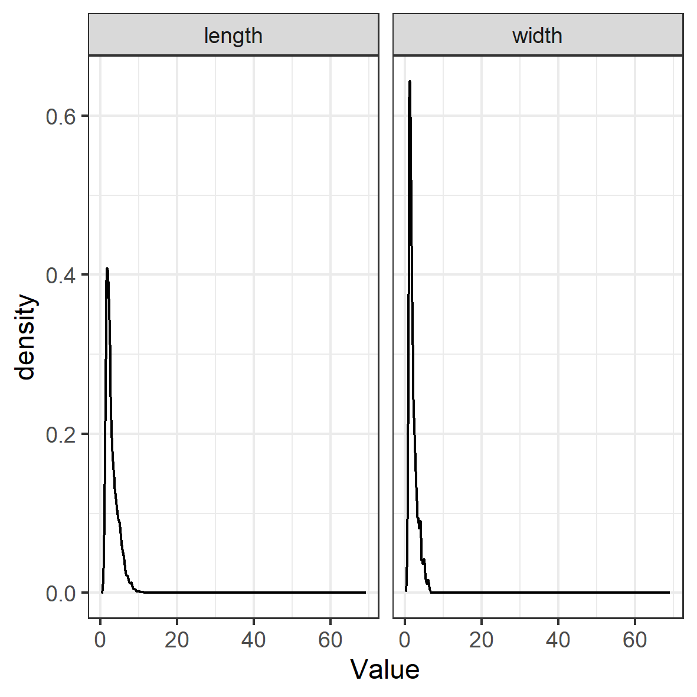
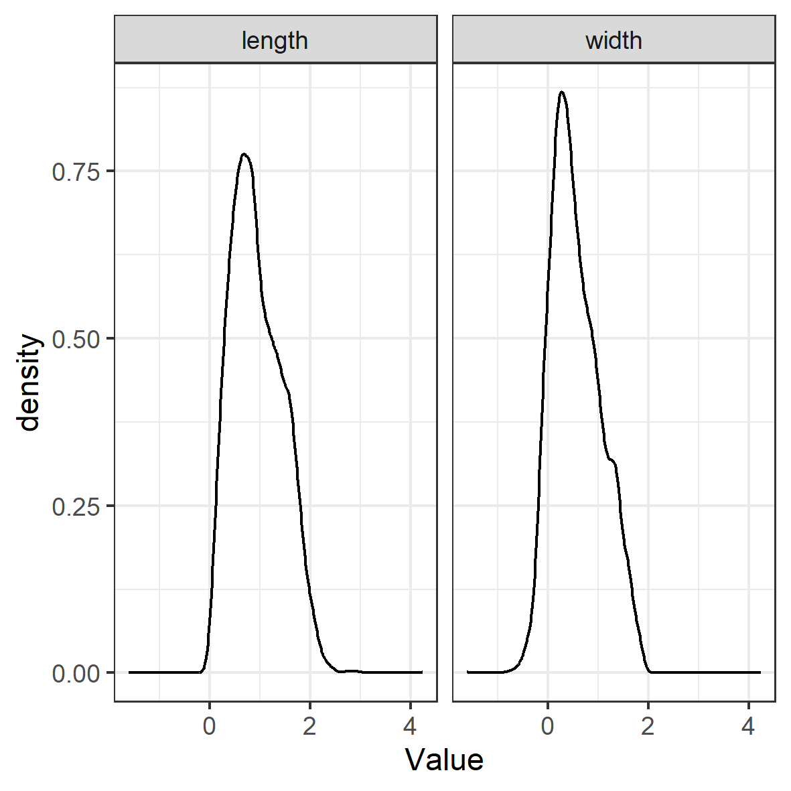
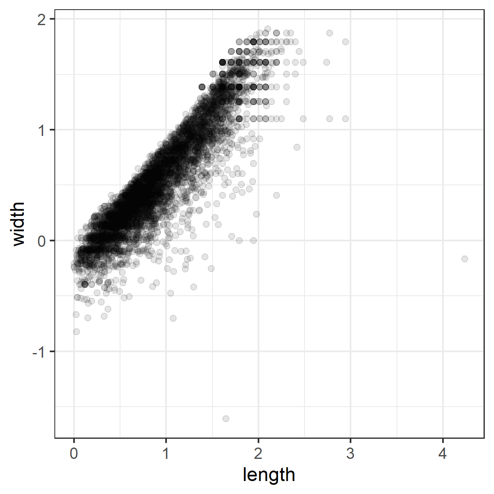
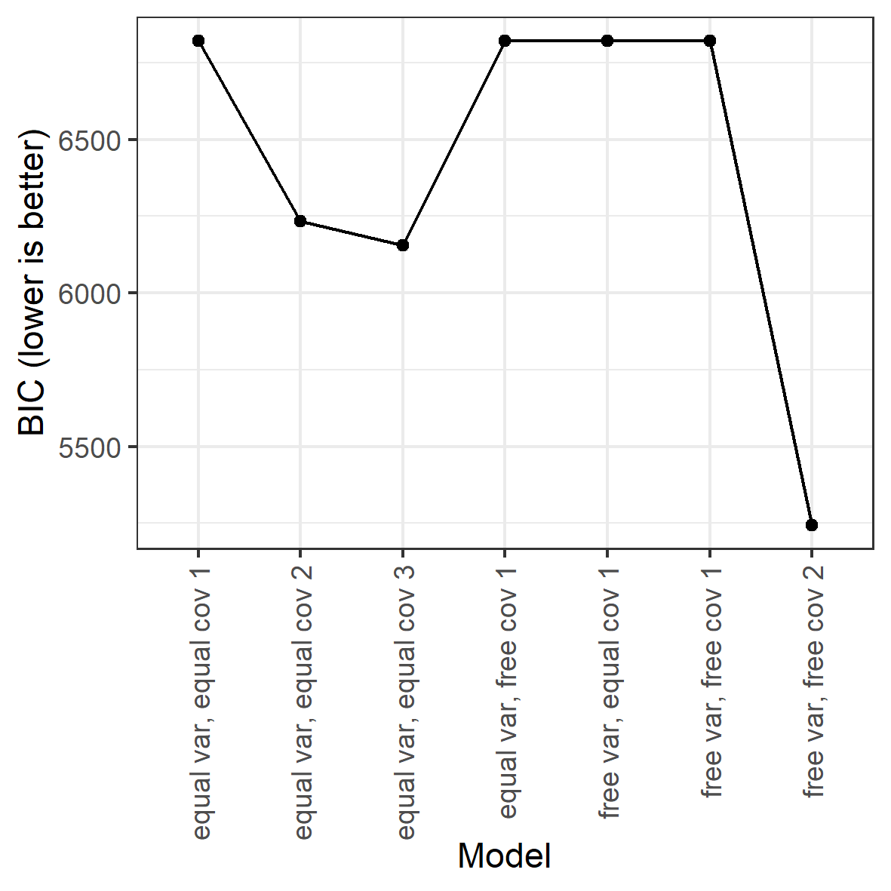
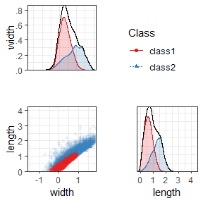
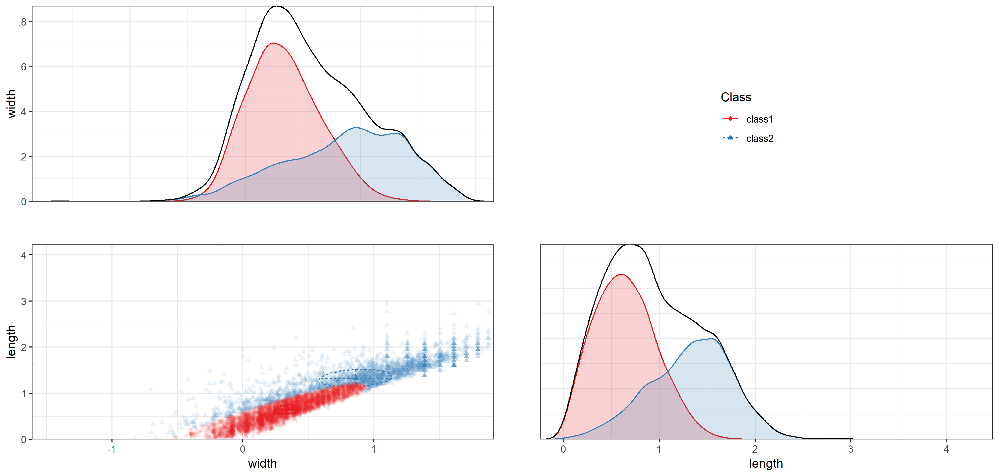

This is an example of exploratory latent class analysis (LCA) with continuous indicators,
otherwise known as latent profile analysis (LPA) or finite Gaussian mixture modeling, using `tidySEM`.
See Van Lissa, C. J., Garnier-Villarreal, M., & Anadria, D. (2023). *Recommended Practices in Latent Class Analysis using the Open-Source R-Package tidySEM.* Structural Equation Modeling. https://doi.org/10.1080/10705511.2023.2250920.
The present example uses data collected by Alkema as part of a study on ocean microplastics.
The purpose of this study was to provide a more nuanced model for the distribution of different sizes of ocean microplastics than the commonly used normal distribution.
To this end, a mixture of normals was used.
Since there is no theoretical reason to expect a certain number of classes, this is an exploratory LCA.
To view its documentation,
run the command `?tidySEM::alkema_microplastics` in the R console.
The original analyses are available at https://github.com/cjvanlissa/lise_microplastics;
in this vignette, we take a different approach to the analysis to showcase other possibilities.

## Loading the Data

To load the data, simply attach the `tidySEM` package.
For convenience, we assign the variables used for analysis to an object called `df`.
As explained in the paper, the classes are quite different for lines, films, and fragments.
For this reason, we here only use data from fragments.
The indicators are fragments' length and width in millimeters.
The sample size was not planned.


``` r
# Load required packages
library(tidySEM)
library(ggplot2)
# Load data
df_analyze <- alkema_microplastics[alkema_microplastics$category ==
    "Fragment", ]
df <- df_analyze[, c("length", "width")]
```

## Descriptive statistics

As per the best practices,
the first step in LCA is examining the observed data.
We use `tidySEM::descriptives()` to describe the data numerically.
Because all items are continuous,
we remove columns for categorical data to de-clutter the table:


``` r
desc <- tidySEM::descriptives(df)
desc <- desc[, c("name", "type", "n", "unique", "mean", "median",
    "sd", "min", "max", "skew_2se", "kurt_2se")]
knitr::kable(desc, caption = "Descriptive statistics")
```


Table: Descriptive statistics

|name   |type    |    n| unique| mean| median|  sd| min|  max| skew_2se| kurt_2se|
|:------|:-------|----:|------:|----:|------:|---:|---:|----:|--------:|--------:|
|length |numeric | 5605|   2086|  2.9|    2.4| 1.9| 1.0| 69.2|      137|     2095|
|width  |numeric | 5605|   2079|  2.0|    1.6| 1.1| 0.2|  6.8|       22|       14|


The data are correctly coded as `numeric`
and the distributional characteristics match the intended measurement level.
The variable scales are comparable (both in millimeters and no large discrepancies between variances).
There are no missing values; if any variables had missing values, we would report an MCAR test with `mice::mcar()`,
and explain that missing data are accounted for using FIML.
Additionally, we can plot the data.
The `ggplot2` function `geom_density()` is useful to visualize continuous data:


``` r
df_plot <- df
names(df_plot) <- paste0("Value.", names(df_plot))
df_plot <- reshape(df_plot, varying = names(df_plot), direction = "long",
    timevar = "Variable")
ggplot(df_plot, aes(x = Value)) + geom_density() + facet_wrap(~Variable) +
    theme_bw()
```

<!-- -->

Both the table above and the density plot indicate that the data are extremely right-skewed and kurtotic.
With this in mind, it can be useful to transform and rescale the data.
We will use a log transformation.


``` r
df_plot$Value <- log(df_plot$Value)
ggplot(df_plot, aes(x = Value)) + geom_density() + facet_wrap(~Variable) +
    theme_bw()
```

<!-- -->

The log transformation addresses the aforementioned concerns regarding skew and kurtosis.
To confirm this, reshape the data to wide format
and examine a scatterplot:


``` r
df <- reshape(df_plot, direction = "wide", v.names = "Value")[,
    -1]
names(df) <- gsub("Value.", "", names(df), fixed = TRUE)
ggplot(df, aes(x = length, y = width)) + geom_point(alpha = 0.1) +
    theme_bw()
```

<!-- -->

<!-- As evident from the scatterplot, there is a very strong linear tend in the data. -->
<!-- This indicates that fragments tend to be coextensive (when length goes up, width goes up). -->
<!-- We can analyze these data in their original dimensions (length and width). -->
<!-- Alternatively, we can use PCA to rotate the data such that the first dimension can be interpreted as "size", -->
<!-- and the second dimension can be interpreted as "shape": -->


## Conducting Latent Profile Analysis

As all variables are continuous, we can use the convenience function
`tidySEM::mx_profiles()`,
which is a wrapper for the generic function `mx_mixture()` optimized for continuous indicators.
Its default settings are appropriate for LPA, assuming fixed variances across classes and zero covariances.
Its arguments are `data` and number of `classes`.
All variables in `data` are included in the analysis,
which is why we first selected the indicator variables.
The models are estimated using simulated annealing,
with start values determined via initial K-means clustering.

As this is an exploratory LCA,
we will conduct a rather extensive search across model specifications and number of classes.
We will set the maximum number of classes $K$ to three to limit computational demands.
We set a seed to ensure replicable results.

As the analysis takes a long time to compute,
it is prudent to save the results to disk immediately, so as not to lose them.
For this, we use the function `saveRDS()`.
We can later use `res <- readRDS("res_gmm.RData")` to load the analysis from the file.


``` r
library(OpenMx)
set.seed(123)
res <- mx_profiles(data = df, classes = 1:3, variances = c("equal",
    "varying"), covariances = c("equal", "varying"), expand_grid = TRUE)
saveRDS(res, "res_gmm.RData")
```

```
#> 
MxComputeSimAnnealing(tsallis1996) evaluations 9 fit 46195.8 change -1.355e+05
MxComputeSimAnnealing(tsallis1996) evaluations 139 fit 27902.6 change -1.829e+04
MxComputeSimAnnealing(tsallis1996) evaluations 272 fit 74571.4 change 3.916e+04 
MxComputeSimAnnealing(tsallis1996) evaluations 403 fit 27902.6 change -1.829e+04
MxComputeSimAnnealing(tsallis1996) evaluations 533 fit 29834.5 change 1932      
MxComputeSimAnnealing(tsallis1996) evaluations 664 fit 65697 change 2736  
MxComputeSimAnnealing(tsallis1996) evaluations 795 fit 27902.6 change -1.829e+04
MxComputeSimAnnealing(tsallis1996) evaluations 929 fit 46195.8 change -7178     
MxComputeSimAnnealing(tsallis1996) evaluations 1058 fit 46195.8 change 0   
MxComputeSimAnnealing(tsallis1996) evaluations 1189 fit 29449 change 1546
MxComputeSimAnnealing(tsallis1996) evaluations 1321 fit 46195.8 change 2.577e+04
MxComputeSimAnnealing(tsallis1996) evaluations 1451 fit 27902.6 change -1.824e+04
MxComputeSimAnnealing(tsallis1996) evaluations 1584 fit 60066.4 change 2.873e+04 
MxComputeSimAnnealing(tsallis1996) evaluations 1714 fit 46195.8 change 0        
MxComputeSimAnnealing(tsallis1996) evaluations 1844 fit 27902.6 change 0
MxComputeSimAnnealing(tsallis1996) evaluations 1974 fit 49549.5 change 3.798e+04
MxComputeSimAnnealing(tsallis1996) evaluations 2105 fit 46195.8 change -7.314e+04
MxComputeSimAnnealing(tsallis1996) evaluations 2234 fit 46195.8 change 0         
MxComputeSimAnnealing(tsallis1996) evaluations 2365 fit 10716.6 change -1.719e+04
MxComputeSimAnnealing(tsallis1996) evaluations 2497 fit 46534.6 change -3703     
MxComputeSimAnnealing(tsallis1996) evaluations 2626 fit 46324.9 change 0    
MxComputeSimAnnealing(tsallis1996) evaluations 2756 fit 26481.5 change 3782
MxComputeSimAnnealing(tsallis1996) evaluations 2889 fit 45807.2 change 3.939e+04
MxComputeSimAnnealing(tsallis1996) evaluations 3017 fit 46324.9 change 3.122e+04
MxComputeSimAnnealing(tsallis1996) evaluations 3145 fit 42757.2 change 2.171e+04
MxComputeSimAnnealing(tsallis1996) evaluations 3275 fit 27252.1 change -1.931e+04
MxComputeSimAnnealing(tsallis1996) evaluations 3404 fit 27229.6 change 1.979e+04 
MxComputeSimAnnealing(tsallis1996) evaluations 3537 fit 46597.3 change 4.025e+04
MxComputeSimAnnealing(tsallis1996) evaluations 3666 fit 46135 change -462.3     
MxComputeSimAnnealing(tsallis1996) evaluations 3820 fit 26875.7 change 2.043e+04
MxComputeSimAnnealing(tsallis1996) evaluations 3984 fit 16518.7 change 9977     
MxComputeSimAnnealing(tsallis1996) evaluations 4143 fit 6325.03 change -9296
MxComputeSimAnnealing(tsallis1996) evaluations 4305 fit 46960.8 change 2.202e+04
MxComputeSimAnnealing(tsallis1996) evaluations 4466 fit 47524.4 change 7544     
MxComputeSimAnnealing(tsallis1996) evaluations 4626 fit 6299.65 change -4.085e+04
MxComputeSimAnnealing(tsallis1996) evaluations 4789 fit 6288.7 change -1.571e+04 
MxComputeSimAnnealing(tsallis1996) evaluations 4953 fit 6312.15 change -527.8   
MxComputeSimAnnealing(tsallis1996) evaluations 5110 fit 6831.79 change -2.839e+04
MxComputeSimAnnealing(tsallis1996) evaluations 5272 fit 65813 change 5.948e+04   
MxComputeSimAnnealing(tsallis1996) evaluations 5433 fit 7774.7 change -1.057e+04
MxComputeSimAnnealing(tsallis1996) evaluations 5594 fit 11576.8 change -3.641e+04
MxComputeSimAnnealing(tsallis1996) evaluations 5753 fit 48528.1 change 4.121e+04 
MxComputeSimAnnealing(tsallis1996) evaluations 5912 fit 27209.7 change 1.996e+04
MxComputeSimAnnealing(tsallis1996) evaluations 6072 fit 6269.97 change -7253    
MxComputeSimAnnealing(tsallis1996) evaluations 6231 fit 6513.64 change -1.054e+04
MxComputeSimAnnealing(tsallis1996) evaluations 6389 fit 6271.39 change -1.749e+04
MxComputeSimAnnealing(tsallis1996) evaluations 6549 fit 6548.63 change -387.9    
MxComputeSimAnnealing(tsallis1996) evaluations 6709 fit 6399.3 change -1.366e+04
MxComputeSimAnnealing(tsallis1996) evaluations 6867 fit 6242.08 change -1.41    
MxComputeSimAnnealing(tsallis1996) evaluations 7026 fit 7573.89 change -9877
MxComputeSimAnnealing(tsallis1996) evaluations 7185 fit 6241.74 change -5.407e+04
MxComputeSimAnnealing(tsallis1996) evaluations 7345 fit 6237.47 change 0.2582    
MxComputeSimAnnealing(tsallis1996) evaluations 7502 fit 7835.8 change -1536  
MxComputeSimAnnealing(tsallis1996) evaluations 7664 fit 7461.91 change 1191
MxComputeSimAnnealing(tsallis1996) evaluations 7823 fit 8032.91 change 1521
MxComputeSimAnnealing(tsallis1996) evaluations 7984 fit 101271 change 9.485e+04
MxComputeSimAnnealing(tsallis1996) evaluations 8144 fit 6251.3 change 32.05    
MxComputeSimAnnealing(tsallis1996) evaluations 8305 fit 6251.07 change -1.592e+04
MxComputeSimAnnealing(tsallis1996) evaluations 8465 fit 6218.47 change -46.51    
MxComputeSimAnnealing(tsallis1996) evaluations 8624 fit 8891.03 change 2675  
MxComputeSimAnnealing(tsallis1996) evaluations 8782 fit 6637.26 change 397.6
MxComputeSimAnnealing(tsallis1996) evaluations 8939 fit 9231.26 change 3028 
MxComputeSimAnnealing(tsallis1996) evaluations 9096 fit 16353.1 change 1.014e+04
MxComputeSimAnnealing(tsallis1996) evaluations 9253 fit 6216.08 change -18.83   
MxComputeSimAnnealing(tsallis1996) evaluations 9411 fit 6204.62 change -354.3
MxComputeSimAnnealing(tsallis1996) evaluations 9570 fit 6197.2 change -3425  
MxComputeSimAnnealing(tsallis1996) evaluations 9727 fit 6195.7 change -1464
MxComputeSimAnnealing(tsallis1996) evaluations 9885 fit 6189.34 change -1.497e+04
MxComputeSimAnnealing(tsallis1996) evaluations 10042 fit 45883.4 change 3.961e+04
MxComputeSimAnnealing(tsallis1996) evaluations 10201 fit 6188.65 change -8189    
                                                                             
#> 
MxComputeSimAnnealing(tsallis1996) evaluations 58 fit 17364.9 change 0
MxComputeSimAnnealing(tsallis1996) evaluations 169 fit 21471.3 change 4106
MxComputeSimAnnealing(tsallis1996) evaluations 279 fit 21471.3 change 4106
MxComputeSimAnnealing(tsallis1996) evaluations 390 fit 21471.3 change 0   
MxComputeSimAnnealing(tsallis1996) evaluations 500 fit 21471.3 change 0
MxComputeSimAnnealing(tsallis1996) evaluations 609 fit 21471.3 change 4106
MxComputeSimAnnealing(tsallis1996) evaluations 718 fit 17364.9 change 0   
MxComputeSimAnnealing(tsallis1996) evaluations 828 fit 17364.9 change 0
MxComputeSimAnnealing(tsallis1996) evaluations 939 fit 21471.3 change 4106
MxComputeSimAnnealing(tsallis1996) evaluations 1049 fit 21471.3 change 4106
MxComputeSimAnnealing(tsallis1996) evaluations 1158 fit 17364.9 change 0   
MxComputeSimAnnealing(tsallis1996) evaluations 1267 fit 17364.9 change -8868
MxComputeSimAnnealing(tsallis1996) evaluations 1377 fit 17364.9 change -8868
MxComputeSimAnnealing(tsallis1996) evaluations 1487 fit 17364.9 change -8868
MxComputeSimAnnealing(tsallis1996) evaluations 1598 fit 17364.9 change 0    
MxComputeSimAnnealing(tsallis1996) evaluations 1708 fit 17130.4 change 0
MxComputeSimAnnealing(tsallis1996) evaluations 1817 fit 17130.4 change -9102
MxComputeSimAnnealing(tsallis1996) evaluations 1927 fit 17130.4 change -9102
MxComputeSimAnnealing(tsallis1996) evaluations 2037 fit 17142.2 change -9090
MxComputeSimAnnealing(tsallis1996) evaluations 2146 fit 26231.8 change 1.925e+04
MxComputeSimAnnealing(tsallis1996) evaluations 2255 fit 26231.8 change -9.595e+04
MxComputeSimAnnealing(tsallis1996) evaluations 2365 fit 26231.8 change -4729     
MxComputeSimAnnealing(tsallis1996) evaluations 2474 fit 27236.4 change -2.876e+04
MxComputeSimAnnealing(tsallis1996) evaluations 2585 fit 26229.8 change -1.438e+04
MxComputeSimAnnealing(tsallis1996) evaluations 2692 fit 98364.7 change 6.09e+04  
MxComputeSimAnnealing(tsallis1996) evaluations 2801 fit 19144.6 change -8237   
MxComputeSimAnnealing(tsallis1996) evaluations 2911 fit 32753.2 change 4422 
MxComputeSimAnnealing(tsallis1996) evaluations 3021 fit 12471.3 change -1.65e+04
MxComputeSimAnnealing(tsallis1996) evaluations 3131 fit 38678.8 change 1.179e+04
MxComputeSimAnnealing(tsallis1996) evaluations 3241 fit 8848.58 change -1.463e+04
MxComputeSimAnnealing(tsallis1996) evaluations 3349 fit 19578.4 change -1005     
MxComputeSimAnnealing(tsallis1996) evaluations 3459 fit 21304.2 change 0    
MxComputeSimAnnealing(tsallis1996) evaluations 3569 fit 21304.2 change 0
MxComputeSimAnnealing(tsallis1996) evaluations 3679 fit 21304.2 change 0
MxComputeSimAnnealing(tsallis1996) evaluations 3788 fit 6544.86 change 58.27
MxComputeSimAnnealing(tsallis1996) evaluations 3898 fit 20427.7 change 2847 
MxComputeSimAnnealing(tsallis1996) evaluations 4007 fit 17581 change 2882  
MxComputeSimAnnealing(tsallis1996) evaluations 4116 fit 17581 change -8537
MxComputeSimAnnealing(tsallis1996) evaluations 4226 fit 17581 change -8418
MxComputeSimAnnealing(tsallis1996) evaluations 4335 fit 25258 change 3389 
MxComputeSimAnnealing(tsallis1996) evaluations 4445 fit 25258 change 0   
MxComputeSimAnnealing(tsallis1996) evaluations 4553 fit 28774.1 change 1.266e+04
MxComputeSimAnnealing(tsallis1996) evaluations 4662 fit 7417.14 change -1.083e+04
MxComputeSimAnnealing(tsallis1996) evaluations 4773 fit 69081 change 6.265e+04   
MxComputeSimAnnealing(tsallis1996) evaluations 4880 fit 21171.4 change 1.231e+04
MxComputeSimAnnealing(tsallis1996) evaluations 4989 fit 10531.4 change -7653    
MxComputeSimAnnealing(tsallis1996) evaluations 5098 fit 19323.6 change 4458 
MxComputeSimAnnealing(tsallis1996) evaluations 5207 fit 19462.1 change 2951
MxComputeSimAnnealing(tsallis1996) evaluations 5316 fit 16363.1 change 0   
MxComputeSimAnnealing(tsallis1996) evaluations 5425 fit 16190.1 change -542.6
MxComputeSimAnnealing(tsallis1996) evaluations 5533 fit 25265.5 change 7916  
MxComputeSimAnnealing(tsallis1996) evaluations 5643 fit 25380.8 change -7.388e+04
MxComputeSimAnnealing(tsallis1996) evaluations 5752 fit 6824.55 change -4.42e+04 
MxComputeSimAnnealing(tsallis1996) evaluations 5863 fit 25570.7 change 1.925e+04
MxComputeSimAnnealing(tsallis1996) evaluations 5969 fit 37439.5 change 1.131e+04
MxComputeSimAnnealing(tsallis1996) evaluations 6079 fit 9675.79 change 3323     
MxComputeSimAnnealing(tsallis1996) evaluations 6187 fit 19177.9 change 0   
MxComputeSimAnnealing(tsallis1996) evaluations 6297 fit 18353.7 change 1.204e+04
MxComputeSimAnnealing(tsallis1996) evaluations 6405 fit 6288.29 change -9528    
MxComputeSimAnnealing(tsallis1996) evaluations 6514 fit 15897.3 change -670.1
MxComputeSimAnnealing(tsallis1996) evaluations 6622 fit 25540.1 change 1.917e+04
MxComputeSimAnnealing(tsallis1996) evaluations 6732 fit 25484.1 change 3909     
MxComputeSimAnnealing(tsallis1996) evaluations 6841 fit 6597.29 change 147.1
MxComputeSimAnnealing(tsallis1996) evaluations 6951 fit 16045.4 change -5.281e+04
MxComputeSimAnnealing(tsallis1996) evaluations 7058 fit 6257.89 change -5815     
MxComputeSimAnnealing(tsallis1996) evaluations 7165 fit 17413.9 change 1.006e+04
MxComputeSimAnnealing(tsallis1996) evaluations 7273 fit 14873.7 change -9685    
MxComputeSimAnnealing(tsallis1996) evaluations 7383 fit 12631.2 change 6199 
MxComputeSimAnnealing(tsallis1996) evaluations 7492 fit 6180.8 change -1.567e+04
MxComputeSimAnnealing(tsallis1996) evaluations 7601 fit 10515.2 change -6.072e+04
MxComputeSimAnnealing(tsallis1996) evaluations 7711 fit 6296.35 change -7.677e+04
MxComputeSimAnnealing(tsallis1996) evaluations 7816 fit 7006.34 change 688       
MxComputeSimAnnealing(tsallis1996) evaluations 7924 fit 16611.6 change 1.044e+04
MxComputeSimAnnealing(tsallis1996) evaluations 8032 fit 6179.24 change -112.8   
MxComputeSimAnnealing(tsallis1996) evaluations 8139 fit 19542.9 change -2.369e+04
MxComputeSimAnnealing(tsallis1996) evaluations 8249 fit 30946.5 change 1.975e+04 
MxComputeSimAnnealing(tsallis1996) evaluations 8356 fit 6150.19 change -1.411e+04
MxComputeSimAnnealing(tsallis1996) evaluations 8465 fit 6141.52 change -4.378    
MxComputeSimAnnealing(tsallis1996) evaluations 8573 fit 6189.75 change -2262 
MxComputeSimAnnealing(tsallis1996) evaluations 8682 fit 13901.5 change 7731 
MxComputeSimAnnealing(tsallis1996) evaluations 8789 fit 21522.9 change -6.319e+04
MxComputeSimAnnealing(tsallis1996) evaluations 8896 fit 7125.38 change -6.317e+04
MxComputeSimAnnealing(tsallis1996) evaluations 9002 fit 15717.9 change 9323      
MxComputeSimAnnealing(tsallis1996) evaluations 9109 fit 7064.84 change 496.6
MxComputeSimAnnealing(tsallis1996) evaluations 9217 fit 7350.13 change 986.3
MxComputeSimAnnealing(tsallis1996) evaluations 9323 fit 10678.9 change 3907 
MxComputeSimAnnealing(tsallis1996) evaluations 9430 fit 6134.76 change -135.9
MxComputeSimAnnealing(tsallis1996) evaluations 9538 fit 25187.5 change 0     
MxComputeSimAnnealing(tsallis1996) evaluations 9647 fit 6124.22 change -2901
MxComputeSimAnnealing(tsallis1996) evaluations 9751 fit 15024.3 change -433.3
MxComputeSimAnnealing(tsallis1996) evaluations 9857 fit 12056.9 change 5622  
MxComputeSimAnnealing(tsallis1996) evaluations 9965 fit 33824.8 change 2.771e+04
MxComputeSimAnnealing(tsallis1996) evaluations 10071 fit 6138.65 change 25.22   
MxComputeSimAnnealing(tsallis1996) evaluations 10179 fit 6182.79 change 57.3 
MxComputeSimAnnealing(tsallis1996) evaluations 10286 fit 25072.5 change 1.893e+04
MxComputeSimAnnealing(tsallis1996) evaluations 10395 fit 25152.4 change 1.821e+04
MxComputeSimAnnealing(tsallis1996) evaluations 10501 fit 6108.06 change -1434    
MxComputeSimAnnealing(tsallis1996) evaluations 10608 fit 14667.8 change 1392 
MxComputeSimAnnealing(tsallis1996) evaluations 10714 fit 19026.1 change 6217
MxComputeSimAnnealing(tsallis1996) evaluations 10820 fit 6106 change -0.02958
MxComputeSimAnnealing(tsallis1996) evaluations 10927 fit 14506.2 change 7696 
MxComputeSimAnnealing(tsallis1996) evaluations 11033 fit 6114.1 change -88.15
MxComputeSimAnnealing(tsallis1996) evaluations 11141 fit 9140.64 change 3006 
MxComputeSimAnnealing(tsallis1996) evaluations 11248 fit 12021.8 change -2051
MxComputeSimAnnealing(tsallis1996) evaluations 11356 fit 6282.55 change 187.3
MxComputeSimAnnealing(tsallis1996) evaluations 11463 fit 6085.83 change -157.4
MxComputeSimAnnealing(tsallis1996) evaluations 11568 fit 21444.5 change 1.011e+04
MxComputeSimAnnealing(tsallis1996) evaluations 11675 fit 13269.7 change 7180     
MxComputeSimAnnealing(tsallis1996) evaluations 11782 fit 22465.5 change 1.638e+04
MxComputeSimAnnealing(tsallis1996) evaluations 11887 fit 6086.8 change 4.774     
MxComputeSimAnnealing(tsallis1996) evaluations 11995 fit 6536.55 change -7262
MxComputeSimAnnealing(tsallis1996) evaluations 12100 fit 6081.8 change -3766 
MxComputeSimAnnealing(tsallis1996) evaluations 12206 fit 6081.63 change 0.2091
MxComputeSimAnnealing(tsallis1996) evaluations 12314 fit 13806.2 change 7724  
MxComputeSimAnnealing(tsallis1996) evaluations 12420 fit 26025.5 change 1.995e+04
MxComputeSimAnnealing(tsallis1996) evaluations 12526 fit 7548.39 change 1351     
MxComputeSimAnnealing(tsallis1996) evaluations 12631 fit 9215.85 change -2217
MxComputeSimAnnealing(tsallis1996) evaluations 12738 fit 6078.47 change -3.036e+04
MxComputeSimAnnealing(tsallis1996) evaluations 12842 fit 12683.7 change -825.6    
MxComputeSimAnnealing(tsallis1996) evaluations 12949 fit 11313.7 change 5208  
MxComputeSimAnnealing(tsallis1996) evaluations 13054 fit 6094.58 change -88.54
MxComputeSimAnnealing(tsallis1996) evaluations 13160 fit 6095.22 change 15.01 
MxComputeSimAnnealing(tsallis1996) evaluations 13265 fit 6079.35 change -2388
MxComputeSimAnnealing(tsallis1996) evaluations 13371 fit 6076.74 change -7348
MxComputeSimAnnealing(tsallis1996) evaluations 13477 fit 6102.51 change -2.029e+04
MxComputeSimAnnealing(tsallis1996) evaluations 13585 fit 26526.3 change 1.93e+04  
MxComputeSimAnnealing(tsallis1996) evaluations 13691 fit 8508.56 change -673    
MxComputeSimAnnealing(tsallis1996) evaluations 13798 fit 6078.6 change -61.92
MxComputeSimAnnealing(tsallis1996) evaluations 13904 fit 26716.2 change 2.064e+04
MxComputeSimAnnealing(tsallis1996) evaluations 14010 fit 36170.8 change 2.938e+04
                                                                                 
#> 
MxComputeSimAnnealing(tsallis1996) evaluations 74 fit 28979.3 change 0
MxComputeSimAnnealing(tsallis1996) evaluations 238 fit 45297.7 change 0
MxComputeSimAnnealing(tsallis1996) evaluations 399 fit 45297.7 change 0
MxComputeSimAnnealing(tsallis1996) evaluations 560 fit 45297.7 change 0
MxComputeSimAnnealing(tsallis1996) evaluations 722 fit 25162.4 change 5374
MxComputeSimAnnealing(tsallis1996) evaluations 882 fit 18179.1 change 1828
MxComputeSimAnnealing(tsallis1996) evaluations 1043 fit 28979.3 change 0  
MxComputeSimAnnealing(tsallis1996) evaluations 1205 fit 27305.9 change -1673
MxComputeSimAnnealing(tsallis1996) evaluations 1365 fit 34587.8 change 5608 
MxComputeSimAnnealing(tsallis1996) evaluations 1528 fit 45297.7 change 0   
MxComputeSimAnnealing(tsallis1996) evaluations 1688 fit 45297.7 change 0
MxComputeSimAnnealing(tsallis1996) evaluations 1850 fit 45297.7 change 0
MxComputeSimAnnealing(tsallis1996) evaluations 2010 fit 45297.7 change 0
MxComputeSimAnnealing(tsallis1996) evaluations 2170 fit 45297.7 change 0
MxComputeSimAnnealing(tsallis1996) evaluations 2332 fit 28979.3 change 2.174e+04
MxComputeSimAnnealing(tsallis1996) evaluations 2493 fit 28717.4 change 1.435e+04
MxComputeSimAnnealing(tsallis1996) evaluations 2654 fit 28669.4 change 0        
MxComputeSimAnnealing(tsallis1996) evaluations 2815 fit 21571.8 change 4966
MxComputeSimAnnealing(tsallis1996) evaluations 2975 fit 6351.37 change -2.393e+04
MxComputeSimAnnealing(tsallis1996) evaluations 3135 fit 22554.4 change -7731     
MxComputeSimAnnealing(tsallis1996) evaluations 3296 fit 19458.9 change -5423
MxComputeSimAnnealing(tsallis1996) evaluations 3458 fit 45143.2 change 0    
MxComputeSimAnnealing(tsallis1996) evaluations 3618 fit 6078.5 change -3.906e+04
MxComputeSimAnnealing(tsallis1996) evaluations 3776 fit 45143.2 change 1.163e+04
MxComputeSimAnnealing(tsallis1996) evaluations 3936 fit 16876.3 change 9755     
MxComputeSimAnnealing(tsallis1996) evaluations 4095 fit 6115.45 change -1839
MxComputeSimAnnealing(tsallis1996) evaluations 4254 fit 8066.41 change -2.354e+04
MxComputeSimAnnealing(tsallis1996) evaluations 4414 fit 31942.6 change 0         
MxComputeSimAnnealing(tsallis1996) evaluations 4574 fit 6408.2 change -2.553e+04
MxComputeSimAnnealing(tsallis1996) evaluations 4733 fit 5762.97 change -22.2    
MxComputeSimAnnealing(tsallis1996) evaluations 4893 fit 31158.3 change 9402 
MxComputeSimAnnealing(tsallis1996) evaluations 5051 fit 10323.8 change 1882
MxComputeSimAnnealing(tsallis1996) evaluations 5211 fit 31272.6 change -1.222e+04
MxComputeSimAnnealing(tsallis1996) evaluations 5370 fit 5762.56 change -1.755e+04
MxComputeSimAnnealing(tsallis1996) evaluations 5529 fit 9793.09 change -3.468e+04
MxComputeSimAnnealing(tsallis1996) evaluations 5688 fit 26149.3 change 1.818e+04 
MxComputeSimAnnealing(tsallis1996) evaluations 5848 fit 5730 change -1.155e+04  
MxComputeSimAnnealing(tsallis1996) evaluations 6008 fit 5908.89 change -3.927e+04
MxComputeSimAnnealing(tsallis1996) evaluations 6165 fit 5988.13 change 259.7     
MxComputeSimAnnealing(tsallis1996) evaluations 6321 fit 6006.23 change -630.1
MxComputeSimAnnealing(tsallis1996) evaluations 6479 fit 45525.9 change 3.816e+04
MxComputeSimAnnealing(tsallis1996) evaluations 6638 fit 9594.13 change 749.6    
MxComputeSimAnnealing(tsallis1996) evaluations 6797 fit 7337.98 change -3.833e+04
MxComputeSimAnnealing(tsallis1996) evaluations 6954 fit 17220.5 change 1.132e+04 
MxComputeSimAnnealing(tsallis1996) evaluations 7111 fit 6364.8 change 703.1     
MxComputeSimAnnealing(tsallis1996) evaluations 7270 fit 45382.7 change 3.972e+04
MxComputeSimAnnealing(tsallis1996) evaluations 7428 fit 28643.4 change -1.468e+04
MxComputeSimAnnealing(tsallis1996) evaluations 7586 fit 5645.32 change -14.2     
MxComputeSimAnnealing(tsallis1996) evaluations 7744 fit 5619.93 change 0.2881
MxComputeSimAnnealing(tsallis1996) evaluations 7902 fit 7180.43 change -2.084e+04
MxComputeSimAnnealing(tsallis1996) evaluations 8058 fit 7001.29 change 1419      
MxComputeSimAnnealing(tsallis1996) evaluations 8216 fit 45063.6 change 3.854e+04
MxComputeSimAnnealing(tsallis1996) evaluations 8373 fit 5582.31 change -2.211e+04
MxComputeSimAnnealing(tsallis1996) evaluations 8530 fit 44801.3 change 3.922e+04 
MxComputeSimAnnealing(tsallis1996) evaluations 8686 fit 5704.81 change 121.4    
MxComputeSimAnnealing(tsallis1996) evaluations 8844 fit 5659.22 change -1.38e+04
MxComputeSimAnnealing(tsallis1996) evaluations 9000 fit 44834.9 change 1.694e+04
MxComputeSimAnnealing(tsallis1996) evaluations 9157 fit 5622.36 change -3.919e+04
MxComputeSimAnnealing(tsallis1996) evaluations 9314 fit 5565.53 change 5.15      
MxComputeSimAnnealing(tsallis1996) evaluations 9470 fit 5553.2 change -3428
MxComputeSimAnnealing(tsallis1996) evaluations 9625 fit 5551.76 change -2.16e+04
MxComputeSimAnnealing(tsallis1996) evaluations 9782 fit 9467.72 change -9176    
MxComputeSimAnnealing(tsallis1996) evaluations 9939 fit 8027.04 change -3.663e+04
MxComputeSimAnnealing(tsallis1996) evaluations 10094 fit 5533.8 change -2.082e+04
MxComputeSimAnnealing(tsallis1996) evaluations 10251 fit 5519.43 change -3.768e+04
MxComputeSimAnnealing(tsallis1996) evaluations 10408 fit 5530.3 change -8247      
MxComputeSimAnnealing(tsallis1996) evaluations 10565 fit 5585.78 change 67.38
MxComputeSimAnnealing(tsallis1996) evaluations 10722 fit 26214.7 change 0    
MxComputeSimAnnealing(tsallis1996) evaluations 10879 fit 18390.9 change -2.571e+04
MxComputeSimAnnealing(tsallis1996) evaluations 11034 fit 5508.15 change 1.602     
MxComputeSimAnnealing(tsallis1996) evaluations 11191 fit 20867.8 change 1.528e+04
MxComputeSimAnnealing(tsallis1996) evaluations 11349 fit 5505.37 change -1.401e+04
MxComputeSimAnnealing(tsallis1996) evaluations 11508 fit 6197.28 change -3.805e+04
MxComputeSimAnnealing(tsallis1996) evaluations 11663 fit 5500.43 change 2.977     
MxComputeSimAnnealing(tsallis1996) evaluations 11818 fit 31270.6 change 2.571e+04
MxComputeSimAnnealing(tsallis1996) evaluations 11975 fit 5494.74 change 0.5342   
MxComputeSimAnnealing(tsallis1996) evaluations 12132 fit 25794.4 change 1.083e+04
MxComputeSimAnnealing(tsallis1996) evaluations 12289 fit 43448.6 change 3.728e+04
MxComputeSimAnnealing(tsallis1996) evaluations 12445 fit 5703.56 change -1.971e+04
MxComputeSimAnnealing(tsallis1996) evaluations 12599 fit 43207 change 3.773e+04   
MxComputeSimAnnealing(tsallis1996) evaluations 12755 fit 5466.79 change -0.2727
                                                                               
#> 
MxComputeSimAnnealing(tsallis1996) evaluations 18 fit 22802.2 change 0
MxComputeSimAnnealing(tsallis1996) evaluations 108 fit 22802.2 change 0
MxComputeSimAnnealing(tsallis1996) evaluations 198 fit 22802.2 change 0
MxComputeSimAnnealing(tsallis1996) evaluations 287 fit 14824 change -2304
MxComputeSimAnnealing(tsallis1996) evaluations 377 fit 18552.3 change 1425
MxComputeSimAnnealing(tsallis1996) evaluations 466 fit 17127.7 change 0   
MxComputeSimAnnealing(tsallis1996) evaluations 556 fit 17127.7 change 0
MxComputeSimAnnealing(tsallis1996) evaluations 646 fit 17127.7 change 0
MxComputeSimAnnealing(tsallis1996) evaluations 737 fit 18026.8 change 899.1
MxComputeSimAnnealing(tsallis1996) evaluations 826 fit 17127.7 change 0    
MxComputeSimAnnealing(tsallis1996) evaluations 916 fit 17127.7 change 0
MxComputeSimAnnealing(tsallis1996) evaluations 1005 fit 17127.7 change 0
MxComputeSimAnnealing(tsallis1996) evaluations 1095 fit 17127.7 change 0
MxComputeSimAnnealing(tsallis1996) evaluations 1184 fit 17127.7 change 0
MxComputeSimAnnealing(tsallis1996) evaluations 1274 fit 17127.7 change 534.4
MxComputeSimAnnealing(tsallis1996) evaluations 1364 fit 15714.7 change -1413
MxComputeSimAnnealing(tsallis1996) evaluations 1453 fit 17127.7 change -1.013e+04
MxComputeSimAnnealing(tsallis1996) evaluations 1543 fit 14315.6 change -1.294e+04
MxComputeSimAnnealing(tsallis1996) evaluations 1633 fit 16637.3 change -1.062e+04
MxComputeSimAnnealing(tsallis1996) evaluations 1723 fit 16308.1 change -1.095e+04
MxComputeSimAnnealing(tsallis1996) evaluations 1812 fit 27254.4 change 0         
MxComputeSimAnnealing(tsallis1996) evaluations 1902 fit 27254.4 change 5.479e-09
MxComputeSimAnnealing(tsallis1996) evaluations 1991 fit 27254.4 change 0        
MxComputeSimAnnealing(tsallis1996) evaluations 2081 fit 27254.4 change 0
MxComputeSimAnnealing(tsallis1996) evaluations 2171 fit 27254.4 change 2446
MxComputeSimAnnealing(tsallis1996) evaluations 2261 fit 27254.4 change 0   
MxComputeSimAnnealing(tsallis1996) evaluations 2350 fit 27254.4 change 0
MxComputeSimAnnealing(tsallis1996) evaluations 2440 fit 15644.3 change -1.161e+04
MxComputeSimAnnealing(tsallis1996) evaluations 2528 fit 20305.7 change -1.373e+04
MxComputeSimAnnealing(tsallis1996) evaluations 2618 fit 25609.9 change 5260      
MxComputeSimAnnealing(tsallis1996) evaluations 2707 fit 47233.4 change 1.544e+04
MxComputeSimAnnealing(tsallis1996) evaluations 2796 fit 15325.5 change -7477    
MxComputeSimAnnealing(tsallis1996) evaluations 2886 fit 17253.1 change 5572 
MxComputeSimAnnealing(tsallis1996) evaluations 2975 fit 22802.2 change 0   
MxComputeSimAnnealing(tsallis1996) evaluations 3064 fit 22802.2 change 8098
MxComputeSimAnnealing(tsallis1996) evaluations 3153 fit 22802.2 change 1.178e+04
MxComputeSimAnnealing(tsallis1996) evaluations 3242 fit 18223 change 1095       
MxComputeSimAnnealing(tsallis1996) evaluations 3332 fit 22763.3 change 8179
MxComputeSimAnnealing(tsallis1996) evaluations 3422 fit 22763.3 change 1.633e+04
MxComputeSimAnnealing(tsallis1996) evaluations 3512 fit 22763.3 change 6220     
MxComputeSimAnnealing(tsallis1996) evaluations 3600 fit 17187.9 change 6258
MxComputeSimAnnealing(tsallis1996) evaluations 3689 fit 8919.79 change -8268
MxComputeSimAnnealing(tsallis1996) evaluations 3778 fit 16912 change -1.027e+04
MxComputeSimAnnealing(tsallis1996) evaluations 3867 fit 26832.3 change -353.6  
MxComputeSimAnnealing(tsallis1996) evaluations 3957 fit 27186 change 814.5   
MxComputeSimAnnealing(tsallis1996) evaluations 4046 fit 27186 change 0    
MxComputeSimAnnealing(tsallis1996) evaluations 4135 fit 27186 change 6100
MxComputeSimAnnealing(tsallis1996) evaluations 4223 fit 22689.8 change -2.7e+04
MxComputeSimAnnealing(tsallis1996) evaluations 4312 fit 37427.8 change 2.592e+04
MxComputeSimAnnealing(tsallis1996) evaluations 4402 fit 39868.7 change 2.593e+04
MxComputeSimAnnealing(tsallis1996) evaluations 4491 fit 14341.6 change 8221     
MxComputeSimAnnealing(tsallis1996) evaluations 4580 fit 6459.13 change -1588
MxComputeSimAnnealing(tsallis1996) evaluations 4669 fit 22907.2 change 0    
MxComputeSimAnnealing(tsallis1996) evaluations 4759 fit 22907.2 change 4492
MxComputeSimAnnealing(tsallis1996) evaluations 4848 fit 22907.2 change 0   
MxComputeSimAnnealing(tsallis1996) evaluations 4939 fit 22907.2 change 0
MxComputeSimAnnealing(tsallis1996) evaluations 5028 fit 10401.2 change -9167
MxComputeSimAnnealing(tsallis1996) evaluations 5117 fit 23166.4 change 7080 
MxComputeSimAnnealing(tsallis1996) evaluations 5206 fit 16279.6 change 0   
MxComputeSimAnnealing(tsallis1996) evaluations 5295 fit 12083.8 change -4196
MxComputeSimAnnealing(tsallis1996) evaluations 5385 fit 16279.6 change 3719 
MxComputeSimAnnealing(tsallis1996) evaluations 5474 fit 16279.6 change 748 
MxComputeSimAnnealing(tsallis1996) evaluations 5563 fit 16279.6 change -1.058e+04
MxComputeSimAnnealing(tsallis1996) evaluations 5653 fit 16279.6 change -1.058e+04
MxComputeSimAnnealing(tsallis1996) evaluations 5741 fit 26859.5 change 1.286e+04 
MxComputeSimAnnealing(tsallis1996) evaluations 5831 fit 24103.9 change 1.655e+04
MxComputeSimAnnealing(tsallis1996) evaluations 5920 fit 26859.5 change 7087     
MxComputeSimAnnealing(tsallis1996) evaluations 6008 fit 25379.5 change 1.928e+04
MxComputeSimAnnealing(tsallis1996) evaluations 6097 fit 46590.3 change 3.933e+04
MxComputeSimAnnealing(tsallis1996) evaluations 6186 fit 6095.73 change -1.688e+04
MxComputeSimAnnealing(tsallis1996) evaluations 6276 fit 6330.68 change -1.678e+04
MxComputeSimAnnealing(tsallis1996) evaluations 6364 fit 22742.6 change 1.583e+04 
MxComputeSimAnnealing(tsallis1996) evaluations 6454 fit 16872.7 change -6234    
MxComputeSimAnnealing(tsallis1996) evaluations 6543 fit 23108.1 change 0    
MxComputeSimAnnealing(tsallis1996) evaluations 6631 fit 5938.96 change -9731
MxComputeSimAnnealing(tsallis1996) evaluations 6720 fit 15668.3 change 2535 
MxComputeSimAnnealing(tsallis1996) evaluations 6808 fit 10344.8 change -1.774e+04
MxComputeSimAnnealing(tsallis1996) evaluations 6897 fit 16586.1 change -1.037e+04
MxComputeSimAnnealing(tsallis1996) evaluations 6986 fit 27349.7 change 1.099e+04 
MxComputeSimAnnealing(tsallis1996) evaluations 7075 fit 15878.4 change -1.147e+04
MxComputeSimAnnealing(tsallis1996) evaluations 7165 fit 16675.9 change 9466      
MxComputeSimAnnealing(tsallis1996) evaluations 7252 fit 58641 change 4.994e+04
MxComputeSimAnnealing(tsallis1996) evaluations 7340 fit 20485 change -3173    
MxComputeSimAnnealing(tsallis1996) evaluations 7429 fit 19242.4 change 7619
MxComputeSimAnnealing(tsallis1996) evaluations 7517 fit 6820.99 change -6509
MxComputeSimAnnealing(tsallis1996) evaluations 7607 fit 23637 change 9243   
MxComputeSimAnnealing(tsallis1996) evaluations 7696 fit 6905.68 change -7488
MxComputeSimAnnealing(tsallis1996) evaluations 7785 fit 14217.3 change -176.6
MxComputeSimAnnealing(tsallis1996) evaluations 7874 fit 13367.2 change -1031 
MxComputeSimAnnealing(tsallis1996) evaluations 7962 fit 9070.4 change -552.8
MxComputeSimAnnealing(tsallis1996) evaluations 8052 fit 5744.24 change -2.154e+04
MxComputeSimAnnealing(tsallis1996) evaluations 8140 fit 27473.7 change 0         
MxComputeSimAnnealing(tsallis1996) evaluations 8228 fit 27473.7 change 2.133e+04
MxComputeSimAnnealing(tsallis1996) evaluations 8317 fit 36237.1 change 2.951e+04
MxComputeSimAnnealing(tsallis1996) evaluations 8405 fit 12608.9 change -1.149e+04
MxComputeSimAnnealing(tsallis1996) evaluations 8494 fit 24203.1 change 1.842e+04 
MxComputeSimAnnealing(tsallis1996) evaluations 8583 fit 24203.1 change 0        
MxComputeSimAnnealing(tsallis1996) evaluations 8672 fit 14487.8 change 506.2
MxComputeSimAnnealing(tsallis1996) evaluations 8760 fit 5813.74 change -3693
MxComputeSimAnnealing(tsallis1996) evaluations 8848 fit 13900.4 change -1.44e+04
MxComputeSimAnnealing(tsallis1996) evaluations 8937 fit 27988.7 change 0        
MxComputeSimAnnealing(tsallis1996) evaluations 9025 fit 28391 change 1.707e+04
MxComputeSimAnnealing(tsallis1996) evaluations 9113 fit 5735.17 change -4.939e+04
MxComputeSimAnnealing(tsallis1996) evaluations 9201 fit 5747.73 change 12.58     
MxComputeSimAnnealing(tsallis1996) evaluations 9289 fit 24797.1 change 1.23e+04
MxComputeSimAnnealing(tsallis1996) evaluations 9378 fit 15622.5 change 7040    
MxComputeSimAnnealing(tsallis1996) evaluations 9466 fit 5748.51 change -4524
MxComputeSimAnnealing(tsallis1996) evaluations 9554 fit 13535.5 change 3974 
MxComputeSimAnnealing(tsallis1996) evaluations 9642 fit 28863 change -0.002543
MxComputeSimAnnealing(tsallis1996) evaluations 9731 fit 5777.15 change -1.57e+04
MxComputeSimAnnealing(tsallis1996) evaluations 9820 fit 29079.5 change 1.367e+04
MxComputeSimAnnealing(tsallis1996) evaluations 9908 fit 14502.2 change 8823     
MxComputeSimAnnealing(tsallis1996) evaluations 9996 fit 17982.5 change 1.224e+04
MxComputeSimAnnealing(tsallis1996) evaluations 10085 fit 5641.42 change -2014   
MxComputeSimAnnealing(tsallis1996) evaluations 10174 fit 5757.96 change -193.8
MxComputeSimAnnealing(tsallis1996) evaluations 10262 fit 5729.23 change 88.49 
MxComputeSimAnnealing(tsallis1996) evaluations 10350 fit 5648.16 change -7541
MxComputeSimAnnealing(tsallis1996) evaluations 10439 fit 13178.2 change 1872 
MxComputeSimAnnealing(tsallis1996) evaluations 10526 fit 29331.9 change 2.37e+04
MxComputeSimAnnealing(tsallis1996) evaluations 10615 fit 29331.9 change 0       
MxComputeSimAnnealing(tsallis1996) evaluations 10702 fit 19843.6 change 1.368e+04
MxComputeSimAnnealing(tsallis1996) evaluations 10791 fit 5639.28 change -1.888e+04
MxComputeSimAnnealing(tsallis1996) evaluations 10879 fit 5634.68 change -34.97    
MxComputeSimAnnealing(tsallis1996) evaluations 10967 fit 10327.2 change -2839 
MxComputeSimAnnealing(tsallis1996) evaluations 11056 fit 5638.11 change -7509
MxComputeSimAnnealing(tsallis1996) evaluations 11144 fit 13005.7 change 619.4
MxComputeSimAnnealing(tsallis1996) evaluations 11232 fit 5648.51 change -85.79
MxComputeSimAnnealing(tsallis1996) evaluations 11320 fit 5611.28 change -3297 
MxComputeSimAnnealing(tsallis1996) evaluations 11407 fit 54563.9 change 3.922e+04
MxComputeSimAnnealing(tsallis1996) evaluations 11496 fit 5601.39 change -3385    
MxComputeSimAnnealing(tsallis1996) evaluations 11585 fit 24185.5 change 1.711e+04
MxComputeSimAnnealing(tsallis1996) evaluations 11674 fit 5602.66 change -1.862e+04
MxComputeSimAnnealing(tsallis1996) evaluations 11761 fit 12707.3 change -0.01181  
MxComputeSimAnnealing(tsallis1996) evaluations 11849 fit 6737.88 change -358    
MxComputeSimAnnealing(tsallis1996) evaluations 11936 fit 7841.06 change -5224
MxComputeSimAnnealing(tsallis1996) evaluations 12025 fit 29063.2 change 0    
MxComputeSimAnnealing(tsallis1996) evaluations 12111 fit 5610.76 change -1.872e+04
MxComputeSimAnnealing(tsallis1996) evaluations 12199 fit 13829.2 change -1.043e+04
MxComputeSimAnnealing(tsallis1996) evaluations 12287 fit 5878.48 change -6777     
MxComputeSimAnnealing(tsallis1996) evaluations 12375 fit 12576.2 change -78.89
MxComputeSimAnnealing(tsallis1996) evaluations 12462 fit 28452.8 change 2.27e+04
MxComputeSimAnnealing(tsallis1996) evaluations 12550 fit 28481.1 change 2.137e+04
MxComputeSimAnnealing(tsallis1996) evaluations 12638 fit 6405.84 change -1.263e+04
MxComputeSimAnnealing(tsallis1996) evaluations 12726 fit 5548.56 change -0.4009   
MxComputeSimAnnealing(tsallis1996) evaluations 12814 fit 7029.5 change 1280    
MxComputeSimAnnealing(tsallis1996) evaluations 12903 fit 23513.1 change 0  
MxComputeSimAnnealing(tsallis1996) evaluations 12992 fit 23489.4 change 1.102e+04
MxComputeSimAnnealing(tsallis1996) evaluations 13078 fit 9178.9 change 3629      
MxComputeSimAnnealing(tsallis1996) evaluations 13166 fit 5561.27 change -2969
MxComputeSimAnnealing(tsallis1996) evaluations 13255 fit 28958.8 change 2857 
MxComputeSimAnnealing(tsallis1996) evaluations 13342 fit 5546.14 change 0.005684
MxComputeSimAnnealing(tsallis1996) evaluations 13431 fit 5546.27 change -5.776  
MxComputeSimAnnealing(tsallis1996) evaluations 13518 fit 5657.04 change -1.752e+04
MxComputeSimAnnealing(tsallis1996) evaluations 13606 fit 12017.9 change 6473      
MxComputeSimAnnealing(tsallis1996) evaluations 13693 fit 12201.5 change -1.68e+04
MxComputeSimAnnealing(tsallis1996) evaluations 13781 fit 5544.57 change -2.341e+04
MxComputeSimAnnealing(tsallis1996) evaluations 13870 fit 13447.1 change -1.555e+04
MxComputeSimAnnealing(tsallis1996) evaluations 13957 fit 5669.39 change -2.33e+04 
MxComputeSimAnnealing(tsallis1996) evaluations 14045 fit 5550.04 change 6.156    
MxComputeSimAnnealing(tsallis1996) evaluations 14133 fit 5620.07 change -1.745e+04
MxComputeSimAnnealing(tsallis1996) evaluations 14221 fit 5543.41 change -4.062    
MxComputeSimAnnealing(tsallis1996) evaluations 14308 fit 6660.9 change -2.048e+04
MxComputeSimAnnealing(tsallis1996) evaluations 14395 fit 5645.34 change -116.7   
MxComputeSimAnnealing(tsallis1996) evaluations 14482 fit 5509.84 change -1302 
MxComputeSimAnnealing(tsallis1996) evaluations 14570 fit 22797.7 change 1.73e+04
MxComputeSimAnnealing(tsallis1996) evaluations 14657 fit 5498.54 change -6654   
MxComputeSimAnnealing(tsallis1996) evaluations 14746 fit 12137.8 change 6651 
MxComputeSimAnnealing(tsallis1996) evaluations 14832 fit 5484.59 change -2.226e+04
MxComputeSimAnnealing(tsallis1996) evaluations 14919 fit 78576.7 change 7.304e+04 
MxComputeSimAnnealing(tsallis1996) evaluations 15006 fit 5480.65 change -1.661e+04
MxComputeSimAnnealing(tsallis1996) evaluations 15093 fit 5480.9 change -263.4     
MxComputeSimAnnealing(tsallis1996) evaluations 15181 fit 5473.02 change -1.301
MxComputeSimAnnealing(tsallis1996) evaluations 15268 fit 5522.49 change 38.93 
MxComputeSimAnnealing(tsallis1996) evaluations 15355 fit 28888.7 change 2.301e+04
MxComputeSimAnnealing(tsallis1996) evaluations 15443 fit 28922 change 2.345e+04  
MxComputeSimAnnealing(tsallis1996) evaluations 15530 fit 5468.89 change -21.63 
MxComputeSimAnnealing(tsallis1996) evaluations 15618 fit 22013.1 change 1.655e+04
MxComputeSimAnnealing(tsallis1996) evaluations 15705 fit 5469.9 change -3531     
MxComputeSimAnnealing(tsallis1996) evaluations 15792 fit 28999.3 change 2.353e+04
MxComputeSimAnnealing(tsallis1996) evaluations 15879 fit 7919.87 change 2400     
MxComputeSimAnnealing(tsallis1996) evaluations 15966 fit 15416.4 change 9509
MxComputeSimAnnealing(tsallis1996) evaluations 16054 fit 5473.89 change 7.121
MxComputeSimAnnealing(tsallis1996) evaluations 16142 fit 21806.8 change 9798 
MxComputeSimAnnealing(tsallis1996) evaluations 16229 fit 5566.87 change -6457
MxComputeSimAnnealing(tsallis1996) evaluations 16316 fit 5467.01 change -1.541e+04
MxComputeSimAnnealing(tsallis1996) evaluations 16402 fit 5451.38 change -3429     
MxComputeSimAnnealing(tsallis1996) evaluations 16488 fit 5433.3 change -412.3
MxComputeSimAnnealing(tsallis1996) evaluations 16574 fit 5830.57 change -1555
MxComputeSimAnnealing(tsallis1996) evaluations 16661 fit 5403.41 change -57.03
MxComputeSimAnnealing(tsallis1996) evaluations 16748 fit 8519.83 change 3115  
MxComputeSimAnnealing(tsallis1996) evaluations 16836 fit 15091.2 change 9699
MxComputeSimAnnealing(tsallis1996) evaluations 16924 fit 20934.7 change 1.552e+04
MxComputeSimAnnealing(tsallis1996) evaluations 17011 fit 11646.8 change 5509     
MxComputeSimAnnealing(tsallis1996) evaluations 17097 fit 27880 change 1164  
MxComputeSimAnnealing(tsallis1996) evaluations 17184 fit 28412 change 471 
MxComputeSimAnnealing(tsallis1996) evaluations 17271 fit 5390.55 change -1.147e+04
MxComputeSimAnnealing(tsallis1996) evaluations 17358 fit 20786.9 change 1.462e+04 
MxComputeSimAnnealing(tsallis1996) evaluations 17445 fit 5393.96 change -9.934   
MxComputeSimAnnealing(tsallis1996) evaluations 17533 fit 11460.9 change -1.685e+04
MxComputeSimAnnealing(tsallis1996) evaluations 17620 fit 8248.84 change 2875      
MxComputeSimAnnealing(tsallis1996) evaluations 17707 fit 34501.8 change 2.911e+04
MxComputeSimAnnealing(tsallis1996) evaluations 17795 fit 5369.68 change -20.8    
MxComputeSimAnnealing(tsallis1996) evaluations 17881 fit 5365.72 change -5947
MxComputeSimAnnealing(tsallis1996) evaluations 17967 fit 28463.4 change 0    
MxComputeSimAnnealing(tsallis1996) evaluations 18055 fit 28496.4 change 1.014e+04
MxComputeSimAnnealing(tsallis1996) evaluations 18142 fit 5361.38 change -2.427e+04
MxComputeSimAnnealing(tsallis1996) evaluations 18230 fit 20509.8 change 1.515e+04 
MxComputeSimAnnealing(tsallis1996) evaluations 18318 fit 5598.81 change -1.493e+04
MxComputeSimAnnealing(tsallis1996) evaluations 18404 fit 11185.4 change -165.8    
MxComputeSimAnnealing(tsallis1996) evaluations 18491 fit 5349.56 change -7.556
MxComputeSimAnnealing(tsallis1996) evaluations 18576 fit 19116.8 change 1.373e+04
MxComputeSimAnnealing(tsallis1996) evaluations 18662 fit 5350.45 change -6022    
MxComputeSimAnnealing(tsallis1996) evaluations 18750 fit 6032.83 change 684.3
MxComputeSimAnnealing(tsallis1996) evaluations 18836 fit 22139.6 change -6039
MxComputeSimAnnealing(tsallis1996) evaluations 18922 fit 5346.9 change 0.01686
MxComputeSimAnnealing(tsallis1996) evaluations 19009 fit 12651.4 change 7276  
MxComputeSimAnnealing(tsallis1996) evaluations 19095 fit 11384.4 change 5483
MxComputeSimAnnealing(tsallis1996) evaluations 19182 fit 28286.9 change 2.279e+04
                                                                                 
#> 
MxComputeSimAnnealing(tsallis1996) evaluations 155 fit 27285.8 change -1.968e+04
MxComputeSimAnnealing(tsallis1996) evaluations 319 fit 27285.8 change 0         
MxComputeSimAnnealing(tsallis1996) evaluations 482 fit 31029.7 change 3744
MxComputeSimAnnealing(tsallis1996) evaluations 643 fit 27285.8 change 0   
MxComputeSimAnnealing(tsallis1996) evaluations 806 fit 36329.4 change 9044
MxComputeSimAnnealing(tsallis1996) evaluations 968 fit 36334 change 9048  
MxComputeSimAnnealing(tsallis1996) evaluations 1132 fit 46966.6 change -3.177e+04
MxComputeSimAnnealing(tsallis1996) evaluations 1293 fit 20908.5 change 4138      
MxComputeSimAnnealing(tsallis1996) evaluations 1458 fit 46966.6 change 0   
MxComputeSimAnnealing(tsallis1996) evaluations 1620 fit 46966.6 change 0
MxComputeSimAnnealing(tsallis1996) evaluations 1782 fit 46966.6 change 0
MxComputeSimAnnealing(tsallis1996) evaluations 1945 fit 46966.6 change 0
MxComputeSimAnnealing(tsallis1996) evaluations 2107 fit 27312.6 change -1.993e+04
MxComputeSimAnnealing(tsallis1996) evaluations 2269 fit 47243.1 change 0         
MxComputeSimAnnealing(tsallis1996) evaluations 2431 fit 47243.1 change 175.1
MxComputeSimAnnealing(tsallis1996) evaluations 2595 fit 6791.23 change -2.032e+04
MxComputeSimAnnealing(tsallis1996) evaluations 2757 fit 27114.5 change 0         
MxComputeSimAnnealing(tsallis1996) evaluations 2918 fit 7128.35 change 909
MxComputeSimAnnealing(tsallis1996) evaluations 3079 fit 47999.2 change 0  
MxComputeSimAnnealing(tsallis1996) evaluations 3239 fit 26434.5 change -2.133e+04
MxComputeSimAnnealing(tsallis1996) evaluations 3400 fit 48683.1 change 3.061e+04 
MxComputeSimAnnealing(tsallis1996) evaluations 3562 fit 48683.1 change 4584     
MxComputeSimAnnealing(tsallis1996) evaluations 3725 fit 6747.29 change -4.201e+04
MxComputeSimAnnealing(tsallis1996) evaluations 3885 fit 51144.4 change 4.502e+04 
MxComputeSimAnnealing(tsallis1996) evaluations 4045 fit 13876.8 change 7095     
MxComputeSimAnnealing(tsallis1996) evaluations 4206 fit 6181.17 change -1.772e+04
MxComputeSimAnnealing(tsallis1996) evaluations 4366 fit 6605.44 change -6257     
MxComputeSimAnnealing(tsallis1996) evaluations 4527 fit 52191.5 change 0    
MxComputeSimAnnealing(tsallis1996) evaluations 4686 fit 62427.8 change 5.361e+04
MxComputeSimAnnealing(tsallis1996) evaluations 4845 fit 21226.8 change -3836    
MxComputeSimAnnealing(tsallis1996) evaluations 5007 fit 6478.42 change -1.854e+04
MxComputeSimAnnealing(tsallis1996) evaluations 5167 fit 52074.2 change 898       
MxComputeSimAnnealing(tsallis1996) evaluations 5328 fit 6147.37 change -3987
MxComputeSimAnnealing(tsallis1996) evaluations 5490 fit 5979.86 change -4.689e+04
MxComputeSimAnnealing(tsallis1996) evaluations 5648 fit 9399.42 change 2510      
MxComputeSimAnnealing(tsallis1996) evaluations 5808 fit 6506.54 change -1.27e+04
MxComputeSimAnnealing(tsallis1996) evaluations 5967 fit 53300.5 change 0        
MxComputeSimAnnealing(tsallis1996) evaluations 6127 fit 53298.2 change 3.558e+04
MxComputeSimAnnealing(tsallis1996) evaluations 6285 fit 24724.2 change 0        
MxComputeSimAnnealing(tsallis1996) evaluations 6443 fit 5977.26 change -4.8e+04
MxComputeSimAnnealing(tsallis1996) evaluations 6601 fit 24155.3 change 0       
MxComputeSimAnnealing(tsallis1996) evaluations 6759 fit 18651.3 change 1.277e+04
MxComputeSimAnnealing(tsallis1996) evaluations 6917 fit 6446.1 change 545.7     
MxComputeSimAnnealing(tsallis1996) evaluations 7075 fit 53751.4 change 270.4
MxComputeSimAnnealing(tsallis1996) evaluations 7232 fit 28245.5 change 1.39e+04
MxComputeSimAnnealing(tsallis1996) evaluations 7393 fit 5962.35 change -499.4  
MxComputeSimAnnealing(tsallis1996) evaluations 7551 fit 39715.4 change -1.295e+04
MxComputeSimAnnealing(tsallis1996) evaluations 7711 fit 53440.1 change 4.745e+04 
MxComputeSimAnnealing(tsallis1996) evaluations 7868 fit 5863.09 change -5184    
MxComputeSimAnnealing(tsallis1996) evaluations 8026 fit 5859.72 change -65.9
MxComputeSimAnnealing(tsallis1996) evaluations 8184 fit 5835.81 change -0.6396
MxComputeSimAnnealing(tsallis1996) evaluations 8343 fit 52858.9 change 4.694e+04
MxComputeSimAnnealing(tsallis1996) evaluations 8500 fit 23094.7 change 1.599e+04
MxComputeSimAnnealing(tsallis1996) evaluations 8658 fit 53647.6 change 2.356e+04
MxComputeSimAnnealing(tsallis1996) evaluations 8816 fit 30386.5 change 2.429e+04
MxComputeSimAnnealing(tsallis1996) evaluations 8973 fit 52067.1 change -8671    
MxComputeSimAnnealing(tsallis1996) evaluations 9129 fit 21408.9 change 1.562e+04
MxComputeSimAnnealing(tsallis1996) evaluations 9287 fit 5885.91 change 129.9    
MxComputeSimAnnealing(tsallis1996) evaluations 9443 fit 5749.36 change 0.2531
MxComputeSimAnnealing(tsallis1996) evaluations 9600 fit 5752.35 change -1.646e+04
MxComputeSimAnnealing(tsallis1996) evaluations 9757 fit 7226.3 change 1295       
MxComputeSimAnnealing(tsallis1996) evaluations 9915 fit 24708.6 change -9433
MxComputeSimAnnealing(tsallis1996) evaluations 10074 fit 8998.8 change 3268 
MxComputeSimAnnealing(tsallis1996) evaluations 10232 fit 5724.24 change -77.76
MxComputeSimAnnealing(tsallis1996) evaluations 10390 fit 5719.64 change -1.6e+04
MxComputeSimAnnealing(tsallis1996) evaluations 10546 fit 49760.7 change 4.399e+04
MxComputeSimAnnealing(tsallis1996) evaluations 10701 fit 5713.09 change -4.408e+04
MxComputeSimAnnealing(tsallis1996) evaluations 10859 fit 6465.05 change 744.4     
MxComputeSimAnnealing(tsallis1996) evaluations 11016 fit 49606.6 change 0    
MxComputeSimAnnealing(tsallis1996) evaluations 11173 fit 5703.31 change -1752
MxComputeSimAnnealing(tsallis1996) evaluations 11329 fit 49594.7 change -1.353e+04
MxComputeSimAnnealing(tsallis1996) evaluations 11485 fit 5851.69 change 151.3     
                                                                             
#> 
MxComputeSimAnnealing(tsallis1996) evaluations 71 fit 23761.8 change 5831
MxComputeSimAnnealing(tsallis1996) evaluations 180 fit 23673.7 change 0  
MxComputeSimAnnealing(tsallis1996) evaluations 287 fit 15763.9 change 0
MxComputeSimAnnealing(tsallis1996) evaluations 396 fit 23068.3 change 5138
MxComputeSimAnnealing(tsallis1996) evaluations 504 fit 55522 change 3.185e+04
MxComputeSimAnnealing(tsallis1996) evaluations 613 fit 15763.9 change 0      
MxComputeSimAnnealing(tsallis1996) evaluations 721 fit 21603 change 3672
MxComputeSimAnnealing(tsallis1996) evaluations 830 fit 23673.7 change -4.519e+04
MxComputeSimAnnealing(tsallis1996) evaluations 938 fit 15763.9 change 0         
MxComputeSimAnnealing(tsallis1996) evaluations 1048 fit 72528.6 change -983.3
MxComputeSimAnnealing(tsallis1996) evaluations 1157 fit 15763.9 change -7910 
MxComputeSimAnnealing(tsallis1996) evaluations 1265 fit 17930.8 change 0    
MxComputeSimAnnealing(tsallis1996) evaluations 1374 fit 23673.7 change -1.418e+04
MxComputeSimAnnealing(tsallis1996) evaluations 1482 fit 15763.9 change -7910     
MxComputeSimAnnealing(tsallis1996) evaluations 1590 fit 17930.8 change 0    
MxComputeSimAnnealing(tsallis1996) evaluations 1698 fit 53657.1 change -9148
MxComputeSimAnnealing(tsallis1996) evaluations 1806 fit 23673.7 change 277.6
MxComputeSimAnnealing(tsallis1996) evaluations 1915 fit 17930.8 change 0    
MxComputeSimAnnealing(tsallis1996) evaluations 2023 fit 38356.1 change -3052
MxComputeSimAnnealing(tsallis1996) evaluations 2133 fit 15763.9 change 0    
MxComputeSimAnnealing(tsallis1996) evaluations 2241 fit 17930.8 change 0
MxComputeSimAnnealing(tsallis1996) evaluations 2351 fit 23381.3 change -292.4
MxComputeSimAnnealing(tsallis1996) evaluations 2458 fit 15763.9 change 0     
MxComputeSimAnnealing(tsallis1996) evaluations 2567 fit 19658 change 1727
MxComputeSimAnnealing(tsallis1996) evaluations 2676 fit 23673.7 change 3486
MxComputeSimAnnealing(tsallis1996) evaluations 2784 fit 15763.9 change 0   
MxComputeSimAnnealing(tsallis1996) evaluations 2892 fit 23777.9 change 5847
MxComputeSimAnnealing(tsallis1996) evaluations 3001 fit 23673.7 change 0   
MxComputeSimAnnealing(tsallis1996) evaluations 3108 fit 15763.9 change 0
MxComputeSimAnnealing(tsallis1996) evaluations 3216 fit 17934.5 change 0
MxComputeSimAnnealing(tsallis1996) evaluations 3323 fit 27588.9 change -3.545e+04
MxComputeSimAnnealing(tsallis1996) evaluations 3432 fit 15763.9 change -7905     
MxComputeSimAnnealing(tsallis1996) evaluations 3539 fit 17934.5 change 2171 
MxComputeSimAnnealing(tsallis1996) evaluations 3646 fit 6323.93 change -1.161e+04
MxComputeSimAnnealing(tsallis1996) evaluations 3753 fit 23539 change -6.205e+04  
MxComputeSimAnnealing(tsallis1996) evaluations 3862 fit 15874.7 change 0       
MxComputeSimAnnealing(tsallis1996) evaluations 3968 fit 18002.9 change 2335
MxComputeSimAnnealing(tsallis1996) evaluations 4076 fit 7713.97 change -1.6e+04
MxComputeSimAnnealing(tsallis1996) evaluations 4184 fit 23347.3 change 0       
MxComputeSimAnnealing(tsallis1996) evaluations 4290 fit 15634.5 change -7711
MxComputeSimAnnealing(tsallis1996) evaluations 4398 fit 16174.4 change -581.6
MxComputeSimAnnealing(tsallis1996) evaluations 4504 fit 13733.6 change -2683 
MxComputeSimAnnealing(tsallis1996) evaluations 4612 fit 39182.5 change 1.807e+04
MxComputeSimAnnealing(tsallis1996) evaluations 4720 fit 15821.2 change 0        
MxComputeSimAnnealing(tsallis1996) evaluations 4828 fit 6361.93 change -9572
MxComputeSimAnnealing(tsallis1996) evaluations 4936 fit 21243.4 change -1.589e+04
MxComputeSimAnnealing(tsallis1996) evaluations 5044 fit 15737.4 change -5506     
MxComputeSimAnnealing(tsallis1996) evaluations 5152 fit 6310.7 change -9972 
MxComputeSimAnnealing(tsallis1996) evaluations 5261 fit 20930.5 change 1.065e+04
MxComputeSimAnnealing(tsallis1996) evaluations 5370 fit 15508 change 0          
MxComputeSimAnnealing(tsallis1996) evaluations 5478 fit 15893.6 change 0
MxComputeSimAnnealing(tsallis1996) evaluations 5585 fit 291818 change 2.829e+05
MxComputeSimAnnealing(tsallis1996) evaluations 5693 fit 22476.9 change 293.4   
MxComputeSimAnnealing(tsallis1996) evaluations 5801 fit 15857.5 change 145  
MxComputeSimAnnealing(tsallis1996) evaluations 5910 fit 21372.4 change 1485
MxComputeSimAnnealing(tsallis1996) evaluations 6018 fit 22115.2 change -1460
MxComputeSimAnnealing(tsallis1996) evaluations 6126 fit 15417.8 change -95.19
MxComputeSimAnnealing(tsallis1996) evaluations 6236 fit 23574.5 change 1.543e+04
MxComputeSimAnnealing(tsallis1996) evaluations 6342 fit 24176.1 change 6529     
MxComputeSimAnnealing(tsallis1996) evaluations 6450 fit 15149.1 change 8378
MxComputeSimAnnealing(tsallis1996) evaluations 6559 fit 8541.74 change -7258
MxComputeSimAnnealing(tsallis1996) evaluations 6666 fit 26471.1 change 1892 
MxComputeSimAnnealing(tsallis1996) evaluations 6773 fit 15154 change 9143  
MxComputeSimAnnealing(tsallis1996) evaluations 6881 fit 5769.79 change -9899
MxComputeSimAnnealing(tsallis1996) evaluations 6988 fit 5767.44 change -62.84
MxComputeSimAnnealing(tsallis1996) evaluations 7096 fit 18388.9 change 1.189e+04
MxComputeSimAnnealing(tsallis1996) evaluations 7203 fit 14983.1 change 0        
MxComputeSimAnnealing(tsallis1996) evaluations 7311 fit 5992.56 change 164.2
MxComputeSimAnnealing(tsallis1996) evaluations 7419 fit 24186.6 change -4822
MxComputeSimAnnealing(tsallis1996) evaluations 7526 fit 24123.9 change 1.825e+04
MxComputeSimAnnealing(tsallis1996) evaluations 7634 fit 15668.3 change 9902     
MxComputeSimAnnealing(tsallis1996) evaluations 7740 fit 6675.25 change -8992
MxComputeSimAnnealing(tsallis1996) evaluations 7848 fit 9717.43 change 3540 
MxComputeSimAnnealing(tsallis1996) evaluations 7954 fit 5746.95 change -3.616e+04
MxComputeSimAnnealing(tsallis1996) evaluations 8063 fit 15527.4 change 9794      
MxComputeSimAnnealing(tsallis1996) evaluations 8171 fit 5723.43 change -54.52
MxComputeSimAnnealing(tsallis1996) evaluations 8277 fit 5775.9 change -372.5 
MxComputeSimAnnealing(tsallis1996) evaluations 8385 fit 5966.77 change -1.897e+04
MxComputeSimAnnealing(tsallis1996) evaluations 8492 fit 15439.1 change 744       
MxComputeSimAnnealing(tsallis1996) evaluations 8600 fit 5760.15 change 2.674
MxComputeSimAnnealing(tsallis1996) evaluations 8708 fit 23243.2 change -7917
MxComputeSimAnnealing(tsallis1996) evaluations 8815 fit 13958.3 change -651 
MxComputeSimAnnealing(tsallis1996) evaluations 8923 fit 7628.8 change -7860
MxComputeSimAnnealing(tsallis1996) evaluations 9030 fit 27974.5 change 5138
MxComputeSimAnnealing(tsallis1996) evaluations 9137 fit 17004.6 change -7890
MxComputeSimAnnealing(tsallis1996) evaluations 9244 fit 13642.7 change 7881 
MxComputeSimAnnealing(tsallis1996) evaluations 9350 fit 15404.9 change 8769
MxComputeSimAnnealing(tsallis1996) evaluations 9458 fit 21651.8 change 1.595e+04
MxComputeSimAnnealing(tsallis1996) evaluations 9566 fit 24714.5 change -224.3   
MxComputeSimAnnealing(tsallis1996) evaluations 9672 fit 5859.54 change 173.1 
MxComputeSimAnnealing(tsallis1996) evaluations 9779 fit 15415.1 change 9745 
MxComputeSimAnnealing(tsallis1996) evaluations 9886 fit 5660.34 change 8.678
MxComputeSimAnnealing(tsallis1996) evaluations 9994 fit 44185 change 3.799e+04
MxComputeSimAnnealing(tsallis1996) evaluations 10102 fit 14284.5 change 0     
MxComputeSimAnnealing(tsallis1996) evaluations 10208 fit 14789.2 change 3093
MxComputeSimAnnealing(tsallis1996) evaluations 10315 fit 6523 change -8226  
MxComputeSimAnnealing(tsallis1996) evaluations 10422 fit 24402.9 change -2.412e+04
MxComputeSimAnnealing(tsallis1996) evaluations 10528 fit 9067.83 change -1028     
MxComputeSimAnnealing(tsallis1996) evaluations 10634 fit 14006.4 change 8221 
MxComputeSimAnnealing(tsallis1996) evaluations 10740 fit 5627.37 change 3.341
MxComputeSimAnnealing(tsallis1996) evaluations 10848 fit 18514.9 change 1.289e+04
MxComputeSimAnnealing(tsallis1996) evaluations 10955 fit 24599.6 change 1.771e+04
MxComputeSimAnnealing(tsallis1996) evaluations 11062 fit 24844.8 change 0        
MxComputeSimAnnealing(tsallis1996) evaluations 11168 fit 5620.64 change -8058
MxComputeSimAnnealing(tsallis1996) evaluations 11276 fit 14457.2 change 485.8
MxComputeSimAnnealing(tsallis1996) evaluations 11383 fit 15470.8 change 9851 
MxComputeSimAnnealing(tsallis1996) evaluations 11491 fit 25017.7 change 5652
MxComputeSimAnnealing(tsallis1996) evaluations 11597 fit 5650.75 change -117.6
MxComputeSimAnnealing(tsallis1996) evaluations 11704 fit 14375.2 change 0     
MxComputeSimAnnealing(tsallis1996) evaluations 11811 fit 5809.58 change -8341
MxComputeSimAnnealing(tsallis1996) evaluations 11918 fit 62333.8 change 3.722e+04
MxComputeSimAnnealing(tsallis1996) evaluations 12024 fit 5611.53 change 2.212    
MxComputeSimAnnealing(tsallis1996) evaluations 12131 fit 5809.46 change -7152
MxComputeSimAnnealing(tsallis1996) evaluations 12238 fit 14145.8 change 8423 
MxComputeSimAnnealing(tsallis1996) evaluations 12345 fit 5674.86 change -1023
MxComputeSimAnnealing(tsallis1996) evaluations 12452 fit 5593.16 change -2048
MxComputeSimAnnealing(tsallis1996) evaluations 12560 fit 7586.73 change 1995 
MxComputeSimAnnealing(tsallis1996) evaluations 12666 fit 5591.78 change -2.278
MxComputeSimAnnealing(tsallis1996) evaluations 12772 fit 5582.34 change 0.1816
MxComputeSimAnnealing(tsallis1996) evaluations 12878 fit 12373.7 change -8405 
MxComputeSimAnnealing(tsallis1996) evaluations 12985 fit 5765.09 change -604.5
MxComputeSimAnnealing(tsallis1996) evaluations 13092 fit 13220.3 change 7539  
MxComputeSimAnnealing(tsallis1996) evaluations 13197 fit 9843.47 change 4284
MxComputeSimAnnealing(tsallis1996) evaluations 13303 fit 13619.7 change 8055
MxComputeSimAnnealing(tsallis1996) evaluations 13410 fit 5555.55 change -1.398e+04
MxComputeSimAnnealing(tsallis1996) evaluations 13517 fit 75686.3 change 5.123e+04 
MxComputeSimAnnealing(tsallis1996) evaluations 13622 fit 6562.34 change 723.3    
MxComputeSimAnnealing(tsallis1996) evaluations 13728 fit 13299.5 change -1.118e+04
MxComputeSimAnnealing(tsallis1996) evaluations 13835 fit 13516.4 change 7970      
MxComputeSimAnnealing(tsallis1996) evaluations 13942 fit 5546.44 change -0.03852
MxComputeSimAnnealing(tsallis1996) evaluations 14050 fit 5625.48 change -1.888e+04
MxComputeSimAnnealing(tsallis1996) evaluations 14156 fit 23934.3 change 1.653e+04 
MxComputeSimAnnealing(tsallis1996) evaluations 14263 fit 13316.5 change 7752     
MxComputeSimAnnealing(tsallis1996) evaluations 14370 fit 5543.21 change -204.8
MxComputeSimAnnealing(tsallis1996) evaluations 14476 fit 38835.6 change 3.329e+04
MxComputeSimAnnealing(tsallis1996) evaluations 14584 fit 5556.77 change -1.887e+04
MxComputeSimAnnealing(tsallis1996) evaluations 14690 fit 13355.5 change 7812      
MxComputeSimAnnealing(tsallis1996) evaluations 14795 fit 5542.06 change -0.5398
MxComputeSimAnnealing(tsallis1996) evaluations 14901 fit 5541.91 change -176.5 
MxComputeSimAnnealing(tsallis1996) evaluations 15007 fit 13417.6 change 7883  
MxComputeSimAnnealing(tsallis1996) evaluations 15113 fit 5571.98 change 42.67
MxComputeSimAnnealing(tsallis1996) evaluations 15219 fit 5551.85 change 22.97
MxComputeSimAnnealing(tsallis1996) evaluations 15325 fit 24275.5 change 1.872e+04
MxComputeSimAnnealing(tsallis1996) evaluations 15430 fit 24245 change 1.867e+04  
MxComputeSimAnnealing(tsallis1996) evaluations 15536 fit 12980.8 change 0      
MxComputeSimAnnealing(tsallis1996) evaluations 15642 fit 13221.4 change 7694
MxComputeSimAnnealing(tsallis1996) evaluations 15748 fit 5526.86 change -11.45
MxComputeSimAnnealing(tsallis1996) evaluations 15854 fit 17967.9 change 1.244e+04
MxComputeSimAnnealing(tsallis1996) evaluations 15960 fit 24189.8 change 7325     
MxComputeSimAnnealing(tsallis1996) evaluations 16066 fit 6067.55 change 534.7
MxComputeSimAnnealing(tsallis1996) evaluations 16172 fit 12998.3 change -1.123e+04
MxComputeSimAnnealing(tsallis1996) evaluations 16278 fit 5528.7 change -7476      
MxComputeSimAnnealing(tsallis1996) evaluations 16383 fit 5518.32 change -0.5659
MxComputeSimAnnealing(tsallis1996) evaluations 16489 fit 5553.42 change -7627  
MxComputeSimAnnealing(tsallis1996) evaluations 16595 fit 8430.08 change 2916 
                                                                            
#> 
MxComputeSimAnnealing(tsallis1996) evaluations 45 fit 32164 change 825.3
MxComputeSimAnnealing(tsallis1996) evaluations 206 fit 37587.2 change -2031
MxComputeSimAnnealing(tsallis1996) evaluations 367 fit 32164 change 0      
MxComputeSimAnnealing(tsallis1996) evaluations 529 fit 32164 change 0
MxComputeSimAnnealing(tsallis1996) evaluations 690 fit 36907.4 change -2711
MxComputeSimAnnealing(tsallis1996) evaluations 851 fit 32164 change 0      
MxComputeSimAnnealing(tsallis1996) evaluations 1011 fit 39618.2 change 0
MxComputeSimAnnealing(tsallis1996) evaluations 1172 fit 39161.4 change 1.019e+04
MxComputeSimAnnealing(tsallis1996) evaluations 1333 fit 32164 change 0          
MxComputeSimAnnealing(tsallis1996) evaluations 1494 fit 39618.2 change 4161
MxComputeSimAnnealing(tsallis1996) evaluations 1654 fit 32164 change -9.116e-05
MxComputeSimAnnealing(tsallis1996) evaluations 1815 fit 19385.1 change -2.023e+04
MxComputeSimAnnealing(tsallis1996) evaluations 1976 fit 39618.2 change 0         
MxComputeSimAnnealing(tsallis1996) evaluations 2137 fit 31861.9 change 1.367e+04
MxComputeSimAnnealing(tsallis1996) evaluations 2297 fit 39796 change 0          
MxComputeSimAnnealing(tsallis1996) evaluations 2458 fit 9648.64 change -2.221e+04
MxComputeSimAnnealing(tsallis1996) evaluations 2617 fit 39446.3 change 410.5     
MxComputeSimAnnealing(tsallis1996) evaluations 2777 fit 13025 change -1.884e+04
MxComputeSimAnnealing(tsallis1996) evaluations 2938 fit 31861.9 change 1.576e+04
MxComputeSimAnnealing(tsallis1996) evaluations 3098 fit 39796 change 1.974e+04  
MxComputeSimAnnealing(tsallis1996) evaluations 3257 fit 31700.8 change 1.769e+04
MxComputeSimAnnealing(tsallis1996) evaluations 3416 fit 19418.8 change 1.021e+04
MxComputeSimAnnealing(tsallis1996) evaluations 3575 fit 12210.9 change -2.676e+04
MxComputeSimAnnealing(tsallis1996) evaluations 3736 fit 39905.9 change 3.352e+04 
MxComputeSimAnnealing(tsallis1996) evaluations 3896 fit 5895.47 change -2.559e+04
MxComputeSimAnnealing(tsallis1996) evaluations 4056 fit 24873.9 change -1.41e+04 
MxComputeSimAnnealing(tsallis1996) evaluations 4215 fit 7076.92 change 712.5    
MxComputeSimAnnealing(tsallis1996) evaluations 4375 fit 16807.5 change -2.194e+04
MxComputeSimAnnealing(tsallis1996) evaluations 4536 fit 33896.4 change 2.801e+04 
MxComputeSimAnnealing(tsallis1996) evaluations 4696 fit 38483.1 change 0        
MxComputeSimAnnealing(tsallis1996) evaluations 4856 fit 17267.9 change -1.869e+04
MxComputeSimAnnealing(tsallis1996) evaluations 5016 fit 21669.9 change -1.445e+04
MxComputeSimAnnealing(tsallis1996) evaluations 5173 fit 36404.6 change 1.172e+04 
MxComputeSimAnnealing(tsallis1996) evaluations 5333 fit 36199.7 change 2.441e+04
MxComputeSimAnnealing(tsallis1996) evaluations 5492 fit 35840.1 change 1.563e+04
MxComputeSimAnnealing(tsallis1996) evaluations 5651 fit 35973.6 change 0        
MxComputeSimAnnealing(tsallis1996) evaluations 5810 fit 36391.6 change 0
MxComputeSimAnnealing(tsallis1996) evaluations 5970 fit 6433.28 change -2.938e+04
MxComputeSimAnnealing(tsallis1996) evaluations 6129 fit 5695.58 change -3.057e+04
MxComputeSimAnnealing(tsallis1996) evaluations 6287 fit 35817.9 change 2.927e+04 
MxComputeSimAnnealing(tsallis1996) evaluations 6446 fit 12940.5 change 7302     
MxComputeSimAnnealing(tsallis1996) evaluations 6605 fit 16128.9 change -2.023e+04
MxComputeSimAnnealing(tsallis1996) evaluations 6763 fit 34641 change 1.429e+04   
MxComputeSimAnnealing(tsallis1996) evaluations 6921 fit 19198.8 change -1.716e+04
MxComputeSimAnnealing(tsallis1996) evaluations 7080 fit 33903.3 change 2.825e+04 
MxComputeSimAnnealing(tsallis1996) evaluations 7238 fit 36315.9 change 2079     
MxComputeSimAnnealing(tsallis1996) evaluations 7397 fit 5581.85 change -2.861e+04
MxComputeSimAnnealing(tsallis1996) evaluations 7556 fit 8204.63 change -2.499e+04
MxComputeSimAnnealing(tsallis1996) evaluations 7713 fit 5738.32 change -3.07e+04 
MxComputeSimAnnealing(tsallis1996) evaluations 7872 fit 33374.6 change 2.769e+04
MxComputeSimAnnealing(tsallis1996) evaluations 8030 fit 37318.5 change 2.548e+04
MxComputeSimAnnealing(tsallis1996) evaluations 8188 fit 5538.81 change -0.9178  
MxComputeSimAnnealing(tsallis1996) evaluations 8346 fit 13148.5 change -2.022e+04
MxComputeSimAnnealing(tsallis1996) evaluations 8505 fit 12835.9 change -2.331e+04
MxComputeSimAnnealing(tsallis1996) evaluations 8664 fit 6046.98 change -1.244e+04
MxComputeSimAnnealing(tsallis1996) evaluations 8822 fit 27921.3 change -4987     
MxComputeSimAnnealing(tsallis1996) evaluations 8979 fit 5528.59 change -319.8
MxComputeSimAnnealing(tsallis1996) evaluations 9137 fit 31653.2 change 0     
MxComputeSimAnnealing(tsallis1996) evaluations 9295 fit 11781.4 change 1118
MxComputeSimAnnealing(tsallis1996) evaluations 9453 fit 5472.99 change -3.067e+04
MxComputeSimAnnealing(tsallis1996) evaluations 9611 fit 30720.8 change 0         
MxComputeSimAnnealing(tsallis1996) evaluations 9768 fit 5567.66 change 121.2
MxComputeSimAnnealing(tsallis1996) evaluations 9925 fit 8136.11 change -2.797e+04
MxComputeSimAnnealing(tsallis1996) evaluations 10083 fit 9881.36 change -1.964e+04
MxComputeSimAnnealing(tsallis1996) evaluations 10239 fit 29270.1 change 0         
MxComputeSimAnnealing(tsallis1996) evaluations 10397 fit 36404.3 change 0
MxComputeSimAnnealing(tsallis1996) evaluations 10554 fit 5420.81 change -2267
MxComputeSimAnnealing(tsallis1996) evaluations 10710 fit 5473.78 change -2695
MxComputeSimAnnealing(tsallis1996) evaluations 10869 fit 36809.5 change 3.002e+04
MxComputeSimAnnealing(tsallis1996) evaluations 11026 fit 36585.3 change 3.117e+04
MxComputeSimAnnealing(tsallis1996) evaluations 11184 fit 20067.8 change 1.388e+04
MxComputeSimAnnealing(tsallis1996) evaluations 11341 fit 5396.47 change 3.891    
MxComputeSimAnnealing(tsallis1996) evaluations 11496 fit 37135.2 change 0    
MxComputeSimAnnealing(tsallis1996) evaluations 11654 fit 5931.84 change 240.3
MxComputeSimAnnealing(tsallis1996) evaluations 11810 fit 12051 change 6485   
MxComputeSimAnnealing(tsallis1996) evaluations 11967 fit 6760.36 change 1385
MxComputeSimAnnealing(tsallis1996) evaluations 12124 fit 18725.3 change -1.867e+04
MxComputeSimAnnealing(tsallis1996) evaluations 12281 fit 5365.66 change -79.79    
MxComputeSimAnnealing(tsallis1996) evaluations 12438 fit 26687.7 change 2.133e+04
MxComputeSimAnnealing(tsallis1996) evaluations 12596 fit 37357.3 change 0        
MxComputeSimAnnealing(tsallis1996) evaluations 12752 fit 5345.83 change -1.193
MxComputeSimAnnealing(tsallis1996) evaluations 12909 fit 6624.78 change 629   
MxComputeSimAnnealing(tsallis1996) evaluations 13064 fit 6005.45 change -381.2
MxComputeSimAnnealing(tsallis1996) evaluations 13220 fit 5330.65 change -1145 
MxComputeSimAnnealing(tsallis1996) evaluations 13376 fit 38173.5 change 1.372e+04
MxComputeSimAnnealing(tsallis1996) evaluations 13532 fit 5489.11 change 168.6    
MxComputeSimAnnealing(tsallis1996) evaluations 13689 fit 5311.11 change -1.405
MxComputeSimAnnealing(tsallis1996) evaluations 13846 fit 13344 change -1.102e+04
MxComputeSimAnnealing(tsallis1996) evaluations 14004 fit 5333.17 change -136    
                                                                            
#> 
MxComputeSimAnnealing(tsallis1996) evaluations 48 fit 16414.3 change 320.1
MxComputeSimAnnealing(tsallis1996) evaluations 155 fit 23789.2 change 4288
MxComputeSimAnnealing(tsallis1996) evaluations 262 fit 78998.9 change 4.364e+04
MxComputeSimAnnealing(tsallis1996) evaluations 370 fit 16110.2 change -1.41e+04
MxComputeSimAnnealing(tsallis1996) evaluations 478 fit 23789.2 change 0        
MxComputeSimAnnealing(tsallis1996) evaluations 586 fit 30210.4 change -2.494e+04
MxComputeSimAnnealing(tsallis1996) evaluations 693 fit 16004.4 change -1.421e+04
MxComputeSimAnnealing(tsallis1996) evaluations 800 fit 23789.2 change 7375      
MxComputeSimAnnealing(tsallis1996) evaluations 908 fit 45262.5 change 2.328e+04
MxComputeSimAnnealing(tsallis1996) evaluations 1015 fit 30210.4 change 0       
MxComputeSimAnnealing(tsallis1996) evaluations 1123 fit 13453.5 change -2961
MxComputeSimAnnealing(tsallis1996) evaluations 1230 fit 32422.3 change 8633 
MxComputeSimAnnealing(tsallis1996) evaluations 1338 fit 30210.4 change 0   
MxComputeSimAnnealing(tsallis1996) evaluations 1445 fit 16414.3 change 0
MxComputeSimAnnealing(tsallis1996) evaluations 1553 fit 35670.2 change 1.188e+04
MxComputeSimAnnealing(tsallis1996) evaluations 1661 fit 30210.4 change 0        
MxComputeSimAnnealing(tsallis1996) evaluations 1768 fit 16414.3 change 627
MxComputeSimAnnealing(tsallis1996) evaluations 1876 fit 27436.8 change 3648
MxComputeSimAnnealing(tsallis1996) evaluations 1983 fit 30210.4 change 0   
MxComputeSimAnnealing(tsallis1996) evaluations 2090 fit 16414.3 change 2715
MxComputeSimAnnealing(tsallis1996) evaluations 2198 fit 19821.6 change -3968
MxComputeSimAnnealing(tsallis1996) evaluations 2305 fit 30210.4 change 0    
MxComputeSimAnnealing(tsallis1996) evaluations 2412 fit 16414.3 change 0
MxComputeSimAnnealing(tsallis1996) evaluations 2520 fit 23789.2 change 0
MxComputeSimAnnealing(tsallis1996) evaluations 2628 fit 23547.5 change -6663
MxComputeSimAnnealing(tsallis1996) evaluations 2736 fit 16414.3 change 2988 
MxComputeSimAnnealing(tsallis1996) evaluations 2842 fit 13194.1 change -1.06e+04
MxComputeSimAnnealing(tsallis1996) evaluations 2950 fit 30210.4 change 7432     
MxComputeSimAnnealing(tsallis1996) evaluations 3057 fit 16414.3 change 0   
MxComputeSimAnnealing(tsallis1996) evaluations 3165 fit 14964.8 change -8824
MxComputeSimAnnealing(tsallis1996) evaluations 3272 fit 22040.8 change -5109
MxComputeSimAnnealing(tsallis1996) evaluations 3380 fit 16414.3 change 243.1
MxComputeSimAnnealing(tsallis1996) evaluations 3487 fit 23789.2 change 0    
MxComputeSimAnnealing(tsallis1996) evaluations 3594 fit 22315.1 change 5227
MxComputeSimAnnealing(tsallis1996) evaluations 3702 fit 15935.8 change -1.414e+04
MxComputeSimAnnealing(tsallis1996) evaluations 3808 fit 16139.7 change 7817      
MxComputeSimAnnealing(tsallis1996) evaluations 3916 fit 6373.27 change -1.556e+04
MxComputeSimAnnealing(tsallis1996) evaluations 4022 fit 30292.2 change 0         
MxComputeSimAnnealing(tsallis1996) evaluations 4130 fit 15955.1 change 3905
MxComputeSimAnnealing(tsallis1996) evaluations 4237 fit 23908.1 change 1.428e+04
MxComputeSimAnnealing(tsallis1996) evaluations 4344 fit 30259.9 change 7549     
MxComputeSimAnnealing(tsallis1996) evaluations 4451 fit 15784.2 change 1112
MxComputeSimAnnealing(tsallis1996) evaluations 4558 fit 23908.1 change 5598
MxComputeSimAnnealing(tsallis1996) evaluations 4666 fit 24235.4 change 9984
MxComputeSimAnnealing(tsallis1996) evaluations 4773 fit 15497.3 change -1.43e+04
MxComputeSimAnnealing(tsallis1996) evaluations 4880 fit 6117.8 change -9379     
MxComputeSimAnnealing(tsallis1996) evaluations 4986 fit 6110.26 change -1.826e+04
MxComputeSimAnnealing(tsallis1996) evaluations 5093 fit 7534.62 change -2.226e+04
MxComputeSimAnnealing(tsallis1996) evaluations 5200 fit 15497.3 change 0         
MxComputeSimAnnealing(tsallis1996) evaluations 5307 fit 6317.48 change -1.805e+04
MxComputeSimAnnealing(tsallis1996) evaluations 5414 fit 11374.2 change 3725      
MxComputeSimAnnealing(tsallis1996) evaluations 5520 fit 29780.4 change 0   
MxComputeSimAnnealing(tsallis1996) evaluations 5628 fit 24495.9 change 9194
MxComputeSimAnnealing(tsallis1996) evaluations 5735 fit 19170 change -5326 
MxComputeSimAnnealing(tsallis1996) evaluations 5842 fit 26567.5 change 9345
MxComputeSimAnnealing(tsallis1996) evaluations 5949 fit 15245.5 change 9369
MxComputeSimAnnealing(tsallis1996) evaluations 6056 fit 22441.6 change 9948
MxComputeSimAnnealing(tsallis1996) evaluations 6162 fit 22298.9 change 5461
MxComputeSimAnnealing(tsallis1996) evaluations 6269 fit 14967.2 change -1.259e+04
MxComputeSimAnnealing(tsallis1996) evaluations 6376 fit 8378.14 change -6585     
MxComputeSimAnnealing(tsallis1996) evaluations 6483 fit 6357.08 change -846.2
MxComputeSimAnnealing(tsallis1996) evaluations 6589 fit 23408.8 change -4156 
MxComputeSimAnnealing(tsallis1996) evaluations 6696 fit 14908.3 change 0    
MxComputeSimAnnealing(tsallis1996) evaluations 6803 fit 5765.71 change -1.612e+04
MxComputeSimAnnealing(tsallis1996) evaluations 6910 fit 21448 change 9402        
MxComputeSimAnnealing(tsallis1996) evaluations 7017 fit 14521.1 change -1.326e+04
MxComputeSimAnnealing(tsallis1996) evaluations 7123 fit 14390.3 change 8647      
MxComputeSimAnnealing(tsallis1996) evaluations 7230 fit 8282.49 change -1.361e+04
MxComputeSimAnnealing(tsallis1996) evaluations 7337 fit 27724.7 change 0         
MxComputeSimAnnealing(tsallis1996) evaluations 7443 fit 14373.7 change 0
MxComputeSimAnnealing(tsallis1996) evaluations 7550 fit 21884.8 change 0
MxComputeSimAnnealing(tsallis1996) evaluations 7657 fit 11068.3 change -1.188e+04
MxComputeSimAnnealing(tsallis1996) evaluations 7763 fit 5964.24 change -5441     
MxComputeSimAnnealing(tsallis1996) evaluations 7870 fit 14102.9 change 1335 
MxComputeSimAnnealing(tsallis1996) evaluations 7977 fit 16884.3 change -5086
MxComputeSimAnnealing(tsallis1996) evaluations 8083 fit 16204.2 change 7160 
MxComputeSimAnnealing(tsallis1996) evaluations 8189 fit 8050.37 change -2.073e+04
MxComputeSimAnnealing(tsallis1996) evaluations 8296 fit 14030.1 change 6775      
MxComputeSimAnnealing(tsallis1996) evaluations 8403 fit 5760.8 change -1.787e+04
MxComputeSimAnnealing(tsallis1996) evaluations 8510 fit 6248.86 change -2.278e+04
MxComputeSimAnnealing(tsallis1996) evaluations 8617 fit 11479.3 change 1763      
MxComputeSimAnnealing(tsallis1996) evaluations 8723 fit 24068.2 change 8583
MxComputeSimAnnealing(tsallis1996) evaluations 8829 fit 18399.9 change -5702
MxComputeSimAnnealing(tsallis1996) evaluations 8936 fit 28913.7 change 1.299e+04
MxComputeSimAnnealing(tsallis1996) evaluations 9043 fit 12729.7 change 1047     
MxComputeSimAnnealing(tsallis1996) evaluations 9149 fit 13549 change 4819  
MxComputeSimAnnealing(tsallis1996) evaluations 9255 fit 5476.73 change -1.087e+04
MxComputeSimAnnealing(tsallis1996) evaluations 9361 fit 19831.8 change -3645     
MxComputeSimAnnealing(tsallis1996) evaluations 9468 fit 12649.7 change 0    
MxComputeSimAnnealing(tsallis1996) evaluations 9575 fit 22706.3 change 1.725e+04
MxComputeSimAnnealing(tsallis1996) evaluations 9681 fit 6675.52 change 1192     
MxComputeSimAnnealing(tsallis1996) evaluations 9788 fit 12553.8 change -1.541e+04
MxComputeSimAnnealing(tsallis1996) evaluations 9895 fit 22773.4 change 1.022e+04 
MxComputeSimAnnealing(tsallis1996) evaluations 10001 fit 23069.2 change -40.5   
MxComputeSimAnnealing(tsallis1996) evaluations 10108 fit 11565 change -1.59e+04
MxComputeSimAnnealing(tsallis1996) evaluations 10214 fit 11919.6 change 0      
MxComputeSimAnnealing(tsallis1996) evaluations 10321 fit 5515.96 change -5363
MxComputeSimAnnealing(tsallis1996) evaluations 10427 fit 20456.6 change -2872
MxComputeSimAnnealing(tsallis1996) evaluations 10533 fit 27606.8 change 0    
MxComputeSimAnnealing(tsallis1996) evaluations 10640 fit 8583.79 change -3299
MxComputeSimAnnealing(tsallis1996) evaluations 10747 fit 24067.4 change 1.837e+04
MxComputeSimAnnealing(tsallis1996) evaluations 10853 fit 5878.77 change 495      
MxComputeSimAnnealing(tsallis1996) evaluations 10959 fit 28024.2 change 9717
MxComputeSimAnnealing(tsallis1996) evaluations 11065 fit 8588.3 change -2952
MxComputeSimAnnealing(tsallis1996) evaluations 11171 fit 23747.3 change 1.819e+04
MxComputeSimAnnealing(tsallis1996) evaluations 11277 fit 28514.7 change 4630     
MxComputeSimAnnealing(tsallis1996) evaluations 11383 fit 27592.3 change 2.199e+04
MxComputeSimAnnealing(tsallis1996) evaluations 11489 fit 11517.3 change 0        
MxComputeSimAnnealing(tsallis1996) evaluations 11595 fit 5359.84 change -6120
MxComputeSimAnnealing(tsallis1996) evaluations 11702 fit 22420.4 change 1.704e+04
MxComputeSimAnnealing(tsallis1996) evaluations 11808 fit 27345.2 change 0        
MxComputeSimAnnealing(tsallis1996) evaluations 11915 fit 6429.46 change -4891
MxComputeSimAnnealing(tsallis1996) evaluations 12021 fit 23727.6 change 0    
MxComputeSimAnnealing(tsallis1996) evaluations 12128 fit 7239.97 change -3383
MxComputeSimAnnealing(tsallis1996) evaluations 12234 fit 5614.53 change -2.15e+04
MxComputeSimAnnealing(tsallis1996) evaluations 12340 fit 11237.6 change 0        
MxComputeSimAnnealing(tsallis1996) evaluations 12446 fit 24436.6 change 0
MxComputeSimAnnealing(tsallis1996) evaluations 12552 fit 6397.42 change -2943
MxComputeSimAnnealing(tsallis1996) evaluations 12658 fit 27491.3 change 0    
MxComputeSimAnnealing(tsallis1996) evaluations 12763 fit 11121.4 change 5669
MxComputeSimAnnealing(tsallis1996) evaluations 12870 fit 23944.9 change 1.332e+04
MxComputeSimAnnealing(tsallis1996) evaluations 12976 fit 5413.07 change 72.78    
MxComputeSimAnnealing(tsallis1996) evaluations 13081 fit 27164.8 change 2.182e+04
MxComputeSimAnnealing(tsallis1996) evaluations 13187 fit 27153.2 change 2.072e+04
MxComputeSimAnnealing(tsallis1996) evaluations 13293 fit 5238.2 change -5468     
MxComputeSimAnnealing(tsallis1996) evaluations 13399 fit 6234.4 change -1.794e+04
MxComputeSimAnnealing(tsallis1996) evaluations 13504 fit 31534.4 change 1.055e+04
MxComputeSimAnnealing(tsallis1996) evaluations 13610 fit 8687.12 change -1.814e+04
MxComputeSimAnnealing(tsallis1996) evaluations 13716 fit 10554.7 change 0         
MxComputeSimAnnealing(tsallis1996) evaluations 13822 fit 10027.5 change -463.4
MxComputeSimAnnealing(tsallis1996) evaluations 13927 fit 5207.64 change 11.66 
MxComputeSimAnnealing(tsallis1996) evaluations 14033 fit 26515.2 change 2.132e+04
MxComputeSimAnnealing(tsallis1996) evaluations 14138 fit 11477.4 change 1454     
MxComputeSimAnnealing(tsallis1996) evaluations 14244 fit 10145 change 0     
MxComputeSimAnnealing(tsallis1996) evaluations 14350 fit 5172.38 change -17.38
MxComputeSimAnnealing(tsallis1996) evaluations 14456 fit 5169.97 change -54.43
MxComputeSimAnnealing(tsallis1996) evaluations 14562 fit 17180.5 change 1.041e+04
MxComputeSimAnnealing(tsallis1996) evaluations 14668 fit 9957.38 change 0        
MxComputeSimAnnealing(tsallis1996) evaluations 14774 fit 24950.4 change 1.937e+04
MxComputeSimAnnealing(tsallis1996) evaluations 14880 fit 5169.68 change -132.8   
MxComputeSimAnnealing(tsallis1996) evaluations 14986 fit 7870.39 change 2704  
MxComputeSimAnnealing(tsallis1996) evaluations 15092 fit 9855.6 change 4690 
MxComputeSimAnnealing(tsallis1996) evaluations 15197 fit 9846.63 change 0  
MxComputeSimAnnealing(tsallis1996) evaluations 15302 fit 5161.65 change -125.1
MxComputeSimAnnealing(tsallis1996) evaluations 15408 fit 18587.2 change 1.241e+04
MxComputeSimAnnealing(tsallis1996) evaluations 15514 fit 5573.99 change -2.118e+04
MxComputeSimAnnealing(tsallis1996) evaluations 15620 fit 9758.68 change 483.8     
MxComputeSimAnnealing(tsallis1996) evaluations 15725 fit 5172.09 change -46.98
MxComputeSimAnnealing(tsallis1996) evaluations 15830 fit 25022.1 change 1.988e+04
MxComputeSimAnnealing(tsallis1996) evaluations 15936 fit 15767.4 change 9162     
MxComputeSimAnnealing(tsallis1996) evaluations 16042 fit 5152.47 change -7925
MxComputeSimAnnealing(tsallis1996) evaluations 16148 fit 9550.03 change 0    
MxComputeSimAnnealing(tsallis1996) evaluations 16253 fit 6638.38 change 1455
MxComputeSimAnnealing(tsallis1996) evaluations 16359 fit 7574.91 change -8458
MxComputeSimAnnealing(tsallis1996) evaluations 16466 fit 14614.3 change -1.188e+04
MxComputeSimAnnealing(tsallis1996) evaluations 16572 fit 5143.89 change -4364     
MxComputeSimAnnealing(tsallis1996) evaluations 16678 fit 5136.41 change -540 
MxComputeSimAnnealing(tsallis1996) evaluations 16783 fit 6251.29 change 1001
MxComputeSimAnnealing(tsallis1996) evaluations 16889 fit 19424 change 1.429e+04
MxComputeSimAnnealing(tsallis1996) evaluations 16995 fit 26432.2 change 2.123e+04
MxComputeSimAnnealing(tsallis1996) evaluations 17101 fit 9392.37 change 0        
MxComputeSimAnnealing(tsallis1996) evaluations 17207 fit 25222.1 change 1.959e+04
MxComputeSimAnnealing(tsallis1996) evaluations 17313 fit 5186.03 change 60.48    
MxComputeSimAnnealing(tsallis1996) evaluations 17419 fit 5124.65 change -2.003
MxComputeSimAnnealing(tsallis1996) evaluations 17525 fit 9344.41 change 0     
MxComputeSimAnnealing(tsallis1996) evaluations 17631 fit 5374.3 change 225.5
MxComputeSimAnnealing(tsallis1996) evaluations 17737 fit 5305.57 change 113.6
MxComputeSimAnnealing(tsallis1996) evaluations 17842 fit 5134.24 change -2.112e+04
MxComputeSimAnnealing(tsallis1996) evaluations 17948 fit 5363.5 change -1.542e+04 
MxComputeSimAnnealing(tsallis1996) evaluations 18054 fit 9289.95 change 0        
MxComputeSimAnnealing(tsallis1996) evaluations 18160 fit 5109.14 change -6.617
MxComputeSimAnnealing(tsallis1996) evaluations 18266 fit 5106.71 change -314.1
MxComputeSimAnnealing(tsallis1996) evaluations 18371 fit 26054.5 change 2.082e+04
MxComputeSimAnnealing(tsallis1996) evaluations 18477 fit 5111.47 change -4137    
MxComputeSimAnnealing(tsallis1996) evaluations 18583 fit 25101.6 change 1.392e+04
MxComputeSimAnnealing(tsallis1996) evaluations 18689 fit 5107.47 change -1.978e+04
MxComputeSimAnnealing(tsallis1996) evaluations 18795 fit 19108.8 change -6924     
MxComputeSimAnnealing(tsallis1996) evaluations 18900 fit 8858.27 change 3362 
MxComputeSimAnnealing(tsallis1996) evaluations 19006 fit 5230.38 change -3965
MxComputeSimAnnealing(tsallis1996) evaluations 19112 fit 24643.4 change 1.397e+04
MxComputeSimAnnealing(tsallis1996) evaluations 19217 fit 5090.55 change 0.176    
MxComputeSimAnnealing(tsallis1996) evaluations 19323 fit 12362.4 change 7271 
MxComputeSimAnnealing(tsallis1996) evaluations 19428 fit 9123.6 change 3943 
MxComputeSimAnnealing(tsallis1996) evaluations 19534 fit 5085.87 change -1.551
MxComputeSimAnnealing(tsallis1996) evaluations 19639 fit 5085.6 change -1162  
MxComputeSimAnnealing(tsallis1996) evaluations 19745 fit 14308.4 change 9222
MxComputeSimAnnealing(tsallis1996) evaluations 19851 fit 24149.5 change 1.907e+04
MxComputeSimAnnealing(tsallis1996) evaluations 19956 fit 5078.42 change -76.76   
MxComputeSimAnnealing(tsallis1996) evaluations 20063 fit 8861.82 change -1.686e+04
MxComputeSimAnnealing(tsallis1996) evaluations 20168 fit 5076.43 change -70.25    
MxComputeSimAnnealing(tsallis1996) evaluations 20274 fit 25582.4 change 2.05e+04
MxComputeSimAnnealing(tsallis1996) evaluations 20379 fit 6253.95 change 1181    
MxComputeSimAnnealing(tsallis1996) evaluations 20484 fit 5794.23 change -1276
MxComputeSimAnnealing(tsallis1996) evaluations 20590 fit 9219.98 change -1.653e+04
MxComputeSimAnnealing(tsallis1996) evaluations 20696 fit 5070.92 change -557.3    
MxComputeSimAnnealing(tsallis1996) evaluations 20802 fit 5071.33 change -66.83
MxComputeSimAnnealing(tsallis1996) evaluations 20908 fit 7712.47 change -1074 
MxComputeSimAnnealing(tsallis1996) evaluations 21013 fit 6173.16 change 1104 
MxComputeSimAnnealing(tsallis1996) evaluations 21119 fit 5067.21 change -1.132
MxComputeSimAnnealing(tsallis1996) evaluations 21225 fit 25297.7 change 1.198e+04
MxComputeSimAnnealing(tsallis1996) evaluations 21330 fit 10781.8 change -1.449e+04
MxComputeSimAnnealing(tsallis1996) evaluations 21436 fit 8311.82 change 3247      
MxComputeSimAnnealing(tsallis1996) evaluations 21542 fit 16997.2 change -8934
MxComputeSimAnnealing(tsallis1996) evaluations 21647 fit 5063.87 change -0.3067
MxComputeSimAnnealing(tsallis1996) evaluations 21753 fit 10459.8 change -1.466e+04
                                                                                  
```


<!-- Note that one model (the most complex one) returns the following warning: -->

<!-- > Warning: In model 'mix4' Optimizer returned a non-zero status code 6. The model does not satisfy the first-order optimality conditions to the required accuracy, and no improved point for the merit function could be found during the final linesearch (Mx status RED) -->

<!-- This suggests a potential problem with with model convergence. -->
<!-- To try and get this model to converge, it is possible to use the function `mxTryHard()`, which permutes the starting values and tries to find a better solution. -->
<!-- To do this, run `res[[24]] <- mxTryHard(res[[24]])`. -->
<!-- However, at present, we will skip this step, -->
<!-- because there are also other indications that this 4-class model is overfitted (see below). -->

## Class Enumeration

To compare the fit of the estimated models,
we create a model fit table using
`table_fit()`.
We will use the BIC for class enumeration.


``` r
fit <- table_fit(res)
```


First, we determine whether any models can be disqualified.
There were no indications of convergence problems during estimation,
so this is not a reason to disqualify solutions.
Next, we check for global and local identifiability.
The global ratio of observations per parameter is large, as the minimum `np_ratio` is 244.
The smallest ratio of class size to class-specific parameters is 18 (see `np_local`), which is no cause for concern.


``` r
tbl <- fit[, c("Name", "LL", "Parameters", "BIC", "Entropy",
    "prob_min", "n_min", "np_ratio", "np_local")]
names(tbl) <- c("Name", "LL", "p", "BIC", "Ent.", "p_min", "n_min",
    "np_ratio", "np_local")
knitr::kable(tbl, caption = "Model fit table.")
```


Table: Model fit table.

|Name                   |    LL|  p|  BIC| Ent.| p_min| n_min| np_ratio| np_local|
|:----------------------|-----:|--:|----:|----:|-----:|-----:|--------:|--------:|
|equal var, equal cov 1 | -3389|  5| 6820| 1.00|  1.00|  1.00|     1121|     1121|
|equal var, equal cov 2 | -3082|  8| 6234| 0.72|  0.86|  0.31|      701|      494|
|equal var, equal cov 3 | -3030| 11| 6155| 0.67|  0.71|  0.17|      510|      313|
|free var, equal cov 1  | -3389|  5| 6820| 1.00|  1.00|  1.00|     1121|     1121|
|free var, equal cov 2  | -2545| 10| 5176| 0.64|  0.51|  0.09|      560|      108|
|free var, equal cov 3  | -2257| 15| 4643| 0.68|  0.54|  0.06|      374|       83|
|equal var, free cov 1  | -3389|  5| 6820| 1.00|  1.00|  1.00|     1121|     1121|
|equal var, free cov 2  | -2552|  9| 5181| 0.65|  0.52|  0.09|      623|      121|
|equal var, free cov 3  | -2368| 13| 4848| 0.56|  0.51|  0.02|      431|       27|
|free var, free cov 1   | -3389|  5| 6820| 1.00|  1.00|  1.00|     1121|     1121|
|free var, free cov 2   | -2575| 11| 5245| 0.56|  0.81|  0.40|      510|      448|
|free var, free cov 3   | -2111| 17| 4370| 0.65|  0.51|  0.04|      330|       41|


However, note that we have a very large sample, and for many models, the smallest class comprises only a very small percentage of the total sample.
Since the purpose of this analysis is to better represent the distribution of ocean microplastics, we can wonder whether it makes sense to allow for classes that only describe a small percentage of the cases.
We therefore only consider solutions that capture at least 10% of the sample.

Another interesting characteristic of this data is that
the BIC and the entropy are strongly correlated.
The raw correlation between these two metrics is .66, `cor(fit$BIC, fit$Entropy)`.
If we omit the 1-class models, for which entropy is technically not defined,
the correlation is even as high as .85, `cor(fit$BIC[!fit$Classes == 1], fit$Entropy[!fit$Classes == 1])`.

This strong correlation indicates that an increase in fit comes with a decrease in class separability.
This illustrates why entropy should not be treated as a model fit criterion.
It also illustrates that criteria for class enumeration should be explicit,
because we will likely come to a different decision depending on which criteria are used.

As mentioned before, we drop models with < 10% of cases in the smallest class:


``` r
fit <- fit[!fit$n_min < 0.1, ]
```

If our strategy is to optimize fit,
we can examine the fit table above,
or plot a scree plot for the BIC by calling `plot(fit)`.
Note that, due to the large sample size, all ICs give identical conclusions.


``` r
plot(fit) + theme(axis.text.x = element_text(angle = 90, vjust = 0.5,
    hjust = 1))
```

<div class="figure">

<p class="caption">Bivariate profile plot</p>
</div>

Looking at the blocks of 1-4 class models for each model specification,
it appears that the BIC keeps decreasing with the addition of more classes.
Across the blocks, the BIC keeps decreasing with increasingly complex model specifications.

Out of the 16 models that remain after removing those with < 10% of cases in the smallest class,
one model stands out:
The 2-class model with free (co)variances.
<!-- The function `ic_weights(fit)` allows us to compute IC weights for all models in the set; -->
<!-- it prefers the most complex model out of the 16 models with a posterior model probability of nearly 100%. -->
We thus select this as our final model. 

## Interpreting the Final Class Solution

We here request the estimates (`est`) and standardized estimates `std_est`, because the latter allows us to interpret the correlations between length and width.
Note that standard errors and p-values are relatively uninformative:
With a sample size of 5606, every parameter is significantly different from zero.


``` r
res_bic <- res[["free var, free cov 2"]]
cp <- class_prob(res_bic)
results <- table_results(res_bic, columns = c("label", "est",
    "std_est"))
results
```


Table: Results of a 2-class model with free (co)variances

|label                         |  est|
|:-----------------------------|----:|
|Means.length                  | 0.65|
|Means.width                   | 0.34|
|Variances.length              | 0.10|
|Covariances.length.WITH.width | 0.09|
|Variances.width               | 0.10|
|Means.length                  | 1.33|
|Means.width                   | 0.86|
|Variances.length              | 0.19|
|Covariances.length.WITH.width | 0.20|
|Variances.width               | 0.28|
|mix2.weights[1,1]             | 1.00|
|mix2.weights[1,2]             | 0.75|


Interpreting the results is facilitated by examining a plot of the model and data.
Relevant plot functions are `plot_bivariate()`, `plot_density()`, and `plot_profiles()`.
However, we omit the density plots, because `plot_bivariate()` also includes them.


``` r
plot_bivariate(res_bic)
```
<!-- -->
<div class="figure">

<p class="caption">Bivariate profile plot</p>
</div>

On the diagonal of the bivariate plot are weighted density plots:
normal approximations of the density function of observed data,
weighed by class probability.
On the off-diagonal are plots for each pair of indicators,
with the class means indicated by a point,
class standard deviations indicated by lines,
and covariances indicated by circles.

The bivariate and marginal plots show that the classes are not clearly separable, as also evident from the low entropy.
At the same time however, it is clear that the observed distributions are non-normal, and the second class accounts for some of this non-normality (there is a smaller 'bump' to the right of the mode, which could be the mean of a second normal distribution).
The first class (57%) accounts for smaller fragments, and the second class (43%) accounts for some of the right-skew in fragments' length and width.
We label class 1 as *small fragments*,
and class 2 as *larger fragments*.

It also appears that the correlation between length and width is stronger for small fragments than for large fragments.
To test the difference, use `wald_test(res_bic, hypothesis = "c11 = c21")`.
Results indicate that the correlation is indeed significantly larger for small fragments ($r = .92$) than for larger fragments ($r = .85$), $\chi^2(1) = 11.56, p < .001$.
Thus, small fragments are more coextensive than large fragments.

There are, however,
concerns about the interpretability of this solutions:
the entropy is `.56` and the minimum classification probability is`.81`.
This is because of substantial overlap in the distributions of the two classes.

## Auxiliary Analyses

Finally, we may want to compare the different classes on auxiliary variables or models.
The `BCH()` function applies three-step analysis,
which compares the classes using a multi-group model,
controlling for classification error.
For example, we can test whether polymer type differs between the two classes.
Because polymer type is a nominal variable,
we must convert it to dummies and estimate a threshold for each dummy:


``` r
df_pt <- mx_dummies(df_analyze$poly_type)
aux_pt <- BCH(res_bic, model = "poly_typeOther | t1
                                poly_typePE | t1
                                poly_typePP | t1",
    data = df_pt)
```


To obtain an omnibus likelihood ratio test of the significance of the differences in polymer type across classes,
use `lr_test(aux_pt)`:


``` r
lr_test(aux_pt)
```


```
#> BCH test for equality across classes
#> 
#> Overall likelihood ratio test:
#>  LL_baseline LL_restricted LL_dif df       p
#>         5289          5306     17  3 0.00066
#> 
#> Pairwise comparisons using likelihood ratio tests:
#>  Model1 Model2 LL_baseline LL_restricted LL_dif df       p
#>  class1 class2        5289          5306     17  3 0.00066
```

The results indicate that there are significant differences in polymer types across classes, $\Delta LL(3) = 17.14, p < .001$.
The results can be reported in probability scale using `table_prob(aux_pt)`.
To test differences for specific polymer types, we can use Wald tests:


``` r
wald_test(aux_pt, "class1.Thresholds[1,1] = class2.Thresholds[1,1];
          class1.Thresholds[1,2] = class2.Thresholds[1,2];
          class1.Thresholds[1,3] = class2.Thresholds[1,3]")
```

The results indicate that there is no significant difference in the prevalence of "Other" polymer types across classes.
However, PE is significantly more prevalent in class 1, and PP is significantly more prevalent in class 2.
