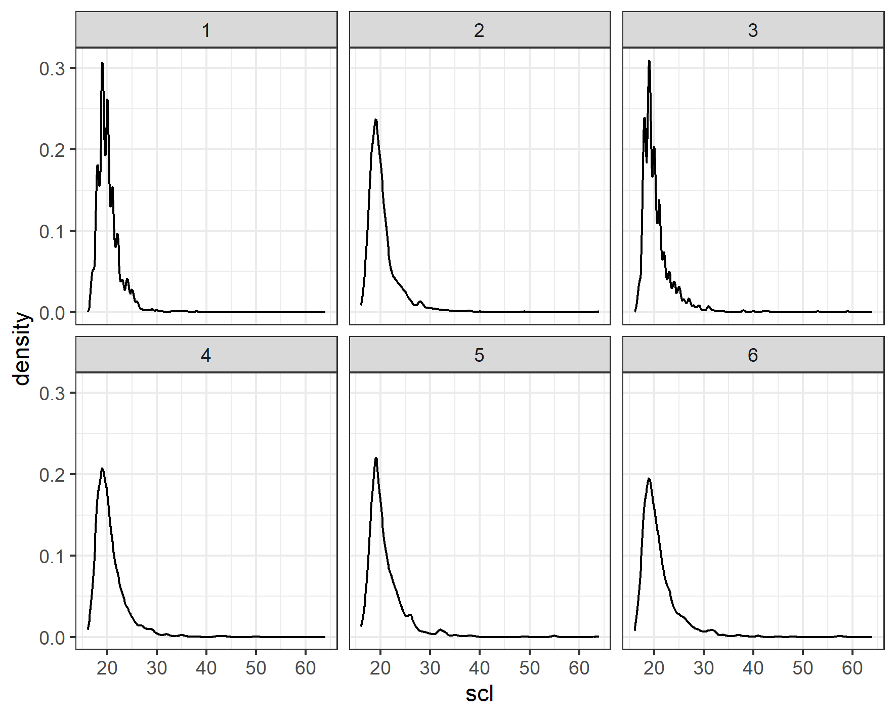
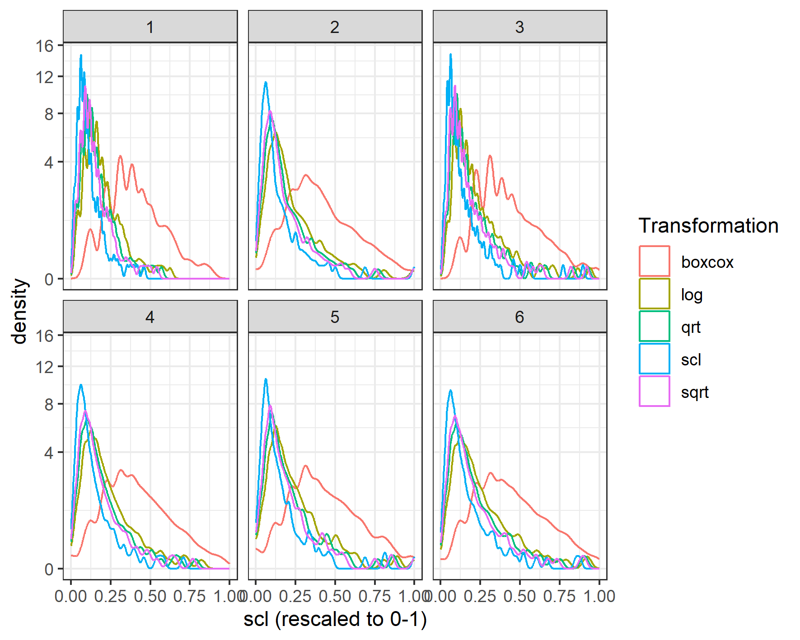
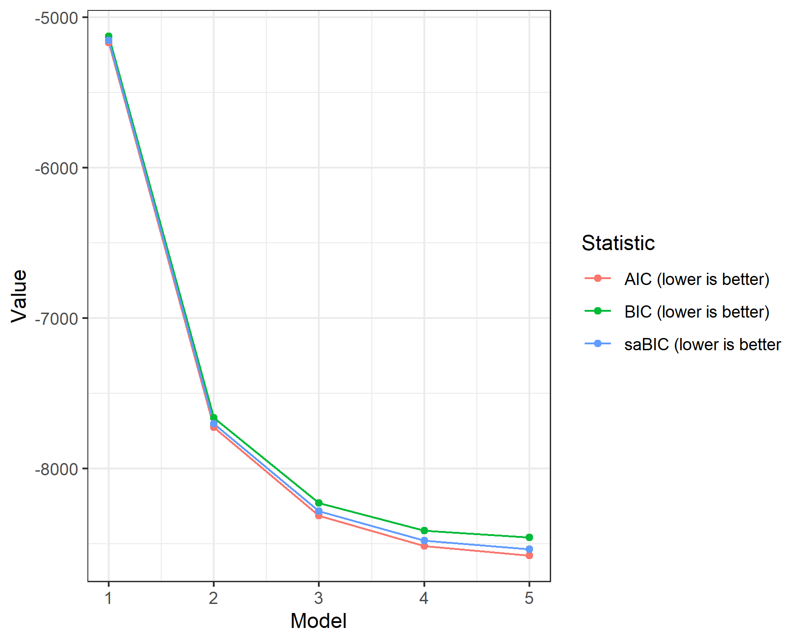
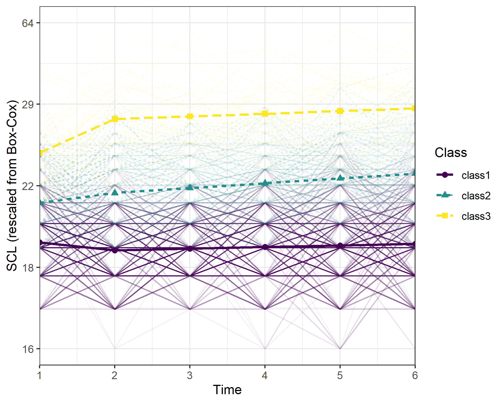

This vignette illustrated `tidySEM`'s ability to perform latent class growth analysis, or growth mixture modeling,
as explained in Van Lissa, C. J., Garnier-Villarreal, M., & Anadria, D. (2023). *Recommended Practices in Latent Class Analysis using the Open-Source R-Package tidySEM.* Structural Equation Modeling. https://doi.org/10.1080/10705511.2023.2250920.
The simulated data used for this example are inspired by work in progress by Plas and colleagues,
on heterogeneity in depression trajectories among Dutch military personnel who were deployed to Afghanistan.
The original data were collected as part of the *Prospection in Stress-related Military Research (PRISMO)* study,
which examined of psychological problems after deployment in more than 1,000 Dutch military personnel from 2005-2019.

First, we load all required packages:


``` r
library(tidySEM)
library(ggplot2)
library(MASS)
```

## Data preprocessing

We first examined the descriptive statistics for the sum score scales:


``` r
# Get descriptives
df <- plas_depression
desc <- descriptives(df)
desc <- desc[, c("name", "mean", "median", "sd", "min", "max",
    "skew_2se", "kurt_2se")]
knitr::kable(desc, caption = "Item descriptives")
```


Table: Item descriptives

|name  | mean| median|  sd| min| max| skew_2se| kurt_2se|
|:-----|----:|------:|---:|---:|---:|--------:|--------:|
|scl.1 |   20|     20| 2.4|  17|  38|       15|       40|
|scl.2 |   20|     19| 3.5|  16|  64|       26|      112|
|scl.3 |   20|     20| 3.4|  17|  59|       26|      107|
|scl.4 |   21|     20| 3.4|  16|  50|       18|       54|
|scl.5 |   21|     20| 4.1|  16|  64|       25|       93|
|scl.6 |   21|     20| 4.1|  16|  58|       20|       66|


Note that all variables were extremely right-skewed due to censoring at the lower end of the scale.

We can examine these distributions visually as well:


``` r
df_plot <- reshape(df, direction = "long", varying = names(df))
ggplot(df_plot, aes(x = scl)) + geom_density() + facet_wrap(~time) +
    theme_bw()
```




As this type of skew can result in convergence problems in LCGA,
we compared several transformations to reduce skew:
The square and cube root, log, inverse, and Box-Cox transformations.


``` r
df_scores <- df_plot
# Store original range of SCL
rng_scl <- range(df_scores$scl)
# Log-transform
df_scores$log <- scales::rescale(log(df_scores$scl), to = c(0,
    1))
# Square root transform
df_scores$sqrt <- scales::rescale(sqrt(df_scores$scl), to = c(0,
    1))
# Cube root transform
df_scores$qrt <- scales::rescale(df_scores$scl^0.33, to = c(0,
    1))
# Reciprocal transform
df_scores$reciprocal <- scales::rescale(1/df_scores$scl, to = c(0,
    1))
# Define function for Box-Cox transformation
bc <- function(x, lambda) {
    (((x^lambda) - 1)/lambda)
}
# Inverse Box-Cox transformation
invbc <- function(x, lambda) {
    ((x * lambda) + 1)^(1/lambda)
}
# Box-Cox transform
b <- MASS::boxcox(lm(df_scores$scl ~ 1), plotit = FALSE)
lambda <- b$x[which.max(b$y)]
df_scores$boxcox <- bc(df_scores$scl, lambda)
# Store range of Box-Cox transformed data
rng_bc <- range(df_scores$boxcox)
df_scores$boxcox <- scales::rescale(df_scores$boxcox, to = c(0,
    1))
# Rescale SCL
df_scores$scl <- scales::rescale(df_scores$scl, to = c(0, 1))
```

We can plot these transformations:


``` r
# Make plot data
df_plot <- do.call(rbind, lapply(c("scl", "log", "sqrt", "qrt",
    "boxcox"), function(n) {
    data.frame(df_scores[c("time", "id")], Value = df_scores[[n]],
        Transformation = n)
}))
# Plot
ggplot(df_plot, aes(x = Value, colour = Transformation)) + geom_density() +
    facet_wrap(~time) + scale_y_sqrt() + xlab("scl (rescaled to 0-1)") +
    theme_bw()
```




Evidently, the Box-Cox transformation reduced skew the most.
Consequently, we proceeded with the Box-Cox transformed scores for analysis.


``` r
dat <- df_scores[, c("id", "time", "boxcox")]
dat <- reshape(dat, direction = "wide", v.names = "boxcox", timevar = "time",
    idvar = "id")
names(dat) <- gsub("boxcox.", "scl", names(dat))
```

# Latent Class Growth Analysis

Next, we estimated a latent class growth model
for SCL.
The model included an overall intercept, centered at T1, `i`.
To model the potential effect of deployment on
depresion,
we also included a dummy variable that was zero before
deployment, and 1 after deployment, `step`.
Finally, to model potential change (or recovery) in depression post-deployment,
we included a linear slope from T2-T6, `s`.
All variances of growth parameters were fixed to zero due to the sparse nature of the data.
In this vignette,
we do not consider more than 5 classes,
because the analyses are computationally very intensive and the data were simulated from a 3-class model.

It is important to highlight that in LCGA, the subgroups will be limited by
the specify growth structure, meaning that LCA will identify distinctive
growth patterns within the intercept, step, and slope growth. For
example, if there is a subgroup that follows a quadratic growth pattern
this models will not be able to identify it.

**NOTE: The time scales in this model are not correct; it currently assumes that all measurements are equidistant. Feel free to experiment with adjusting this.**


``` r
set.seed(27796)
dat[["id"]] <- NULL
res_step <- mx_growth_mixture(model = "
  i =~ 1*scl1 + 1*scl2 + 1*scl3 +1*scl4 +1*scl5 +1*scl6
  step =~ 0*scl1 + 1*scl2 + 1*scl3 +1*scl4 +1*scl5 +1*scl6
  s =~ 0*scl1 + 0*scl2 + 1*scl3 +2*scl4 +3*scl5 +4*scl6
  scl1 ~~ vscl1*scl1
  scl2 ~~ vscl2*scl2
  scl3 ~~ vscl3*scl3
  scl4 ~~ vscl4*scl4
  scl5 ~~ vscl5*scl5
  scl6 ~~ vscl6*scl6
  i ~~ 0*i
  step ~~ 0*step
  s ~~ 0*s
  i ~~ 0*s
  i ~~ 0*step
  s ~~ 0*step",
    classes = 1:5, data = dat)
# Additional iterations because of convergence problems for
# model 1:
res_step[[1]] <- mxTryHardWideSearch(res_step[[1]], extraTries = 50)
```


```
#> 
MxComputeSimAnnealing(tsallis1996) evaluations 282 fit 9783.76 change 5704
MxComputeSimAnnealing(tsallis1996) evaluations 808 fit -1176.2 change -1.335e+04
MxComputeSimAnnealing(tsallis1996) evaluations 1338 fit 12175.6 change 1.069e+04
MxComputeSimAnnealing(tsallis1996) evaluations 1864 fit -4362.75 change -3187   
MxComputeSimAnnealing(tsallis1996) evaluations 2396 fit -1176.2 change 0     
MxComputeSimAnnealing(tsallis1996) evaluations 2921 fit 2744.94 change 5770
MxComputeSimAnnealing(tsallis1996) evaluations 3450 fit 1065.21 change 2241
MxComputeSimAnnealing(tsallis1996) evaluations 3981 fit -7668.28 change -6492
MxComputeSimAnnealing(tsallis1996) evaluations 4512 fit 12237.7 change 0     
MxComputeSimAnnealing(tsallis1996) evaluations 5040 fit 5434.94 change 1.243e+04
MxComputeSimAnnealing(tsallis1996) evaluations 5567 fit -1326.84 change 0       
MxComputeSimAnnealing(tsallis1996) evaluations 6098 fit 13082.6 change 1.449e-06
MxComputeSimAnnealing(tsallis1996) evaluations 6626 fit -367.498 change 7308    
MxComputeSimAnnealing(tsallis1996) evaluations 7147 fit -7614.28 change -1539
MxComputeSimAnnealing(tsallis1996) evaluations 7671 fit 13683.2 change 562.8 
MxComputeSimAnnealing(tsallis1996) evaluations 8198 fit 2398.02 change 5461 
MxComputeSimAnnealing(tsallis1996) evaluations 8724 fit -7695.52 change -2.198e+04
MxComputeSimAnnealing(tsallis1996) evaluations 9250 fit -5045.8 change -1317      
MxComputeSimAnnealing(tsallis1996) evaluations 9775 fit 13969.9 change 2.102e+04
MxComputeSimAnnealing(tsallis1996) evaluations 10299 fit -1530.55 change 6214   
MxComputeSimAnnealing(tsallis1996) evaluations 10823 fit -7496.02 change 253.3
MxComputeSimAnnealing(tsallis1996) evaluations 11347 fit -7657.36 change -3454
MxComputeSimAnnealing(tsallis1996) evaluations 11862 fit -181.015 change 7561 
MxComputeSimAnnealing(tsallis1996) evaluations 12385 fit -6284.08 change 1460
MxComputeSimAnnealing(tsallis1996) evaluations 12905 fit -7596.96 change -132.5
MxComputeSimAnnealing(tsallis1996) evaluations 13426 fit -7748.1 change -1930  
MxComputeSimAnnealing(tsallis1996) evaluations 13948 fit 14479 change 2.022e+04
MxComputeSimAnnealing(tsallis1996) evaluations 14467 fit -7654.23 change 94.24 
MxComputeSimAnnealing(tsallis1996) evaluations 14985 fit -7741.48 change -375.8
MxComputeSimAnnealing(tsallis1996) evaluations 15501 fit -6589.42 change 1161  
MxComputeSimAnnealing(tsallis1996) evaluations 16016 fit -7656.55 change -1.129e+04
MxComputeSimAnnealing(tsallis1996) evaluations 16530 fit -7748.91 change -6.192    
                                                                               
#> 
MxComputeSimAnnealing(tsallis1996) evaluations 339 fit 586.668 change 0
MxComputeSimAnnealing(tsallis1996) evaluations 689 fit 5769.33 change 2591
MxComputeSimAnnealing(tsallis1996) evaluations 1039 fit -6193.33 change 0 
MxComputeSimAnnealing(tsallis1996) evaluations 1388 fit 4379.74 change 3536
MxComputeSimAnnealing(tsallis1996) evaluations 1738 fit -6024.25 change 0  
MxComputeSimAnnealing(tsallis1996) evaluations 2089 fit 586.668 change 0 
MxComputeSimAnnealing(tsallis1996) evaluations 2435 fit -6024.25 change 0
MxComputeSimAnnealing(tsallis1996) evaluations 2787 fit 586.668 change 0 
MxComputeSimAnnealing(tsallis1996) evaluations 3142 fit 586.668 change -5049
MxComputeSimAnnealing(tsallis1996) evaluations 3488 fit -6024.25 change 169.1
MxComputeSimAnnealing(tsallis1996) evaluations 3840 fit 586.668 change 0     
MxComputeSimAnnealing(tsallis1996) evaluations 4188 fit -3700.17 change 2324
MxComputeSimAnnealing(tsallis1996) evaluations 4537 fit 586.668 change 0    
MxComputeSimAnnealing(tsallis1996) evaluations 4888 fit -6514.74 change -695
MxComputeSimAnnealing(tsallis1996) evaluations 5234 fit 586.668 change 0    
MxComputeSimAnnealing(tsallis1996) evaluations 5582 fit -7919.04 change -1192
MxComputeSimAnnealing(tsallis1996) evaluations 5934 fit -5797.24 change 0    
MxComputeSimAnnealing(tsallis1996) evaluations 6284 fit 542.199 change -1624
MxComputeSimAnnealing(tsallis1996) evaluations 6631 fit -5766.39 change 0   
MxComputeSimAnnealing(tsallis1996) evaluations 6980 fit -7241.8 change 844.7
MxComputeSimAnnealing(tsallis1996) evaluations 7329 fit -5990.73 change 966.3
MxComputeSimAnnealing(tsallis1996) evaluations 7676 fit 4080.31 change 8714  
MxComputeSimAnnealing(tsallis1996) evaluations 8025 fit -5847.08 change 0  
MxComputeSimAnnealing(tsallis1996) evaluations 8371 fit -3440.72 change -296.5
MxComputeSimAnnealing(tsallis1996) evaluations 8720 fit 5645.97 change 0      
MxComputeSimAnnealing(tsallis1996) evaluations 9069 fit -5932.59 change 2385
MxComputeSimAnnealing(tsallis1996) evaluations 9418 fit -8304.94 change -1.279e+04
MxComputeSimAnnealing(tsallis1996) evaluations 9769 fit -6331.49 change -2772     
MxComputeSimAnnealing(tsallis1996) evaluations 10120 fit -6960.53 change 1184
MxComputeSimAnnealing(tsallis1996) evaluations 10470 fit -3685.5 change 569.6
MxComputeSimAnnealing(tsallis1996) evaluations 10818 fit -8332.84 change -262.4
MxComputeSimAnnealing(tsallis1996) evaluations 11164 fit -8337.32 change -1149 
MxComputeSimAnnealing(tsallis1996) evaluations 11508 fit 5181.36 change 0     
MxComputeSimAnnealing(tsallis1996) evaluations 11855 fit -7618.48 change 670.2
MxComputeSimAnnealing(tsallis1996) evaluations 12203 fit 4500.46 change 1.202e+04
MxComputeSimAnnealing(tsallis1996) evaluations 12551 fit -7017.67 change 0       
MxComputeSimAnnealing(tsallis1996) evaluations 12898 fit -6769.11 change 253.2
MxComputeSimAnnealing(tsallis1996) evaluations 13243 fit -5587.67 change 1717 
MxComputeSimAnnealing(tsallis1996) evaluations 13591 fit -5224.31 change 3108
MxComputeSimAnnealing(tsallis1996) evaluations 13939 fit 5037.09 change 0    
MxComputeSimAnnealing(tsallis1996) evaluations 14282 fit -5577.33 change 0
MxComputeSimAnnealing(tsallis1996) evaluations 14629 fit -8107.86 change -348.9
MxComputeSimAnnealing(tsallis1996) evaluations 14975 fit -8345.85 change -1499 
MxComputeSimAnnealing(tsallis1996) evaluations 15321 fit -8346.06 change -649.3
MxComputeSimAnnealing(tsallis1996) evaluations 15670 fit 3385.76 change -4268  
MxComputeSimAnnealing(tsallis1996) evaluations 16015 fit -5577.94 change 2640
MxComputeSimAnnealing(tsallis1996) evaluations 16362 fit -5956.95 change -1177
MxComputeSimAnnealing(tsallis1996) evaluations 16709 fit 5195.1 change 1.289e+04
MxComputeSimAnnealing(tsallis1996) evaluations 17052 fit -5561.58 change 2750   
MxComputeSimAnnealing(tsallis1996) evaluations 17397 fit -7418.89 change 647.5
MxComputeSimAnnealing(tsallis1996) evaluations 17744 fit -2657.69 change 3552 
MxComputeSimAnnealing(tsallis1996) evaluations 18089 fit -8245.28 change -2657
MxComputeSimAnnealing(tsallis1996) evaluations 18435 fit -8339.79 change 2.552
MxComputeSimAnnealing(tsallis1996) evaluations 18782 fit -8295.53 change -8300
MxComputeSimAnnealing(tsallis1996) evaluations 19127 fit -7136.53 change -1550
MxComputeSimAnnealing(tsallis1996) evaluations 19475 fit -7530.37 change 807.9
MxComputeSimAnnealing(tsallis1996) evaluations 19819 fit -8346.11 change -2.882
MxComputeSimAnnealing(tsallis1996) evaluations 20159 fit -5971.15 change -2129 
MxComputeSimAnnealing(tsallis1996) evaluations 20502 fit -5875.99 change 2471 
MxComputeSimAnnealing(tsallis1996) evaluations 20845 fit -7189.02 change 1158
MxComputeSimAnnealing(tsallis1996) evaluations 21191 fit -8288.58 change 12.72
MxComputeSimAnnealing(tsallis1996) evaluations 21536 fit -8344.55 change -1.076e+04
                                                                                   
#> 
MxComputeSimAnnealing(tsallis1996) evaluations 169 fit -7023.02 change 419.2
MxComputeSimAnnealing(tsallis1996) evaluations 429 fit 12439.3 change 4615  
MxComputeSimAnnealing(tsallis1996) evaluations 690 fit -3788.3 change 0   
MxComputeSimAnnealing(tsallis1996) evaluations 952 fit -2801.01 change 4619
MxComputeSimAnnealing(tsallis1996) evaluations 1215 fit -3788.3 change 0   
MxComputeSimAnnealing(tsallis1996) evaluations 1477 fit -5700.69 change 1720
MxComputeSimAnnealing(tsallis1996) evaluations 1739 fit -3788.3 change 0    
MxComputeSimAnnealing(tsallis1996) evaluations 2000 fit -7420.42 change 0
MxComputeSimAnnealing(tsallis1996) evaluations 2262 fit 4037.6 change 3654
MxComputeSimAnnealing(tsallis1996) evaluations 2524 fit -7420.42 change -397.4
MxComputeSimAnnealing(tsallis1996) evaluations 2783 fit 3533.95 change 1734   
MxComputeSimAnnealing(tsallis1996) evaluations 3044 fit -7442.24 change 0  
MxComputeSimAnnealing(tsallis1996) evaluations 3304 fit -7370.74 change 49.68
MxComputeSimAnnealing(tsallis1996) evaluations 3567 fit -3788.3 change 0     
MxComputeSimAnnealing(tsallis1996) evaluations 3828 fit -7420.42 change 0
MxComputeSimAnnealing(tsallis1996) evaluations 4092 fit -3788.3 change 0 
MxComputeSimAnnealing(tsallis1996) evaluations 4352 fit -7420.42 change 0
MxComputeSimAnnealing(tsallis1996) evaluations 4612 fit -2637.54 change -5015
MxComputeSimAnnealing(tsallis1996) evaluations 4873 fit -7013.12 change 453.1
MxComputeSimAnnealing(tsallis1996) evaluations 5132 fit -3828.11 change 1906 
MxComputeSimAnnealing(tsallis1996) evaluations 5393 fit -3741.74 change 0   
MxComputeSimAnnealing(tsallis1996) evaluations 5654 fit -7422.66 change 0
MxComputeSimAnnealing(tsallis1996) evaluations 5916 fit -4470.27 change 3224
MxComputeSimAnnealing(tsallis1996) evaluations 6179 fit -8370.18 change -946.7
MxComputeSimAnnealing(tsallis1996) evaluations 6440 fit -7561.98 change -5324 
MxComputeSimAnnealing(tsallis1996) evaluations 6702 fit -7076.32 change 0    
MxComputeSimAnnealing(tsallis1996) evaluations 6963 fit 3627.49 change -1.105e+04
MxComputeSimAnnealing(tsallis1996) evaluations 7220 fit -3861.06 change 23.92    
MxComputeSimAnnealing(tsallis1996) evaluations 7482 fit -7427.3 change 0     
MxComputeSimAnnealing(tsallis1996) evaluations 7744 fit -3490.47 change 3335
MxComputeSimAnnealing(tsallis1996) evaluations 8003 fit -7090.06 change 0   
MxComputeSimAnnealing(tsallis1996) evaluations 8267 fit -2232.33 change 5281
MxComputeSimAnnealing(tsallis1996) evaluations 8524 fit -7936.69 change -4753
MxComputeSimAnnealing(tsallis1996) evaluations 8784 fit -7431.84 change 0    
MxComputeSimAnnealing(tsallis1996) evaluations 9046 fit -2677.85 change -4323
MxComputeSimAnnealing(tsallis1996) evaluations 9303 fit -8418 change -832.3  
MxComputeSimAnnealing(tsallis1996) evaluations 9562 fit -8085.94 change -546.7
MxComputeSimAnnealing(tsallis1996) evaluations 9823 fit -2656.77 change 4117  
MxComputeSimAnnealing(tsallis1996) evaluations 10082 fit -7077.13 change -2.923
MxComputeSimAnnealing(tsallis1996) evaluations 10344 fit 2781.34 change -5484  
MxComputeSimAnnealing(tsallis1996) evaluations 10603 fit -8394.36 change -4964
MxComputeSimAnnealing(tsallis1996) evaluations 10862 fit -8504.2 change -937  
MxComputeSimAnnealing(tsallis1996) evaluations 11122 fit -6520.41 change -4740
MxComputeSimAnnealing(tsallis1996) evaluations 11384 fit -7354.43 change 0    
MxComputeSimAnnealing(tsallis1996) evaluations 11641 fit -3599.9 change 4065
MxComputeSimAnnealing(tsallis1996) evaluations 11902 fit -8460.37 change -3826
MxComputeSimAnnealing(tsallis1996) evaluations 12161 fit -7325.27 change 0    
MxComputeSimAnnealing(tsallis1996) evaluations 12421 fit -6787.7 change -1574
MxComputeSimAnnealing(tsallis1996) evaluations 12680 fit -1520.83 change 0   
MxComputeSimAnnealing(tsallis1996) evaluations 12940 fit -8121.31 change 368.9
MxComputeSimAnnealing(tsallis1996) evaluations 13199 fit -3660.24 change 4862 
MxComputeSimAnnealing(tsallis1996) evaluations 13459 fit -7546.55 change -5841
MxComputeSimAnnealing(tsallis1996) evaluations 13716 fit -7383.75 change 851.8
MxComputeSimAnnealing(tsallis1996) evaluations 13974 fit -8521.28 change -150.2
MxComputeSimAnnealing(tsallis1996) evaluations 14234 fit -1365.88 change 0     
MxComputeSimAnnealing(tsallis1996) evaluations 14494 fit -7838.17 change -448.8
MxComputeSimAnnealing(tsallis1996) evaluations 14757 fit 8062.96 change 1.65e+04
MxComputeSimAnnealing(tsallis1996) evaluations 15014 fit -7479.29 change 975.5  
MxComputeSimAnnealing(tsallis1996) evaluations 15272 fit -7845.53 change -25.34
MxComputeSimAnnealing(tsallis1996) evaluations 15532 fit -7163.08 change -3404 
MxComputeSimAnnealing(tsallis1996) evaluations 15788 fit -8318.62 change 222.4
MxComputeSimAnnealing(tsallis1996) evaluations 16045 fit -8528.69 change -964.6
MxComputeSimAnnealing(tsallis1996) evaluations 16305 fit -2461.4 change 6077   
MxComputeSimAnnealing(tsallis1996) evaluations 16563 fit -2721.51 change 5683
MxComputeSimAnnealing(tsallis1996) evaluations 16823 fit -7434.34 change 0   
MxComputeSimAnnealing(tsallis1996) evaluations 17086 fit -8377.61 change 124.7
MxComputeSimAnnealing(tsallis1996) evaluations 17344 fit -7677.2 change -7122 
MxComputeSimAnnealing(tsallis1996) evaluations 17602 fit -8141.65 change -701.8
MxComputeSimAnnealing(tsallis1996) evaluations 17860 fit -8533.97 change 3.278 
MxComputeSimAnnealing(tsallis1996) evaluations 18115 fit -8552.12 change -1909
MxComputeSimAnnealing(tsallis1996) evaluations 18373 fit -8551.37 change -7528
MxComputeSimAnnealing(tsallis1996) evaluations 18631 fit -8552.94 change -1103
MxComputeSimAnnealing(tsallis1996) evaluations 18889 fit -7832.79 change 382.2
MxComputeSimAnnealing(tsallis1996) evaluations 19148 fit -8312.91 change -5768
MxComputeSimAnnealing(tsallis1996) evaluations 19406 fit -8453.09 change 100.1
MxComputeSimAnnealing(tsallis1996) evaluations 19665 fit 15578.9 change 2.413e+04
MxComputeSimAnnealing(tsallis1996) evaluations 19923 fit -8283.53 change -26.55  
MxComputeSimAnnealing(tsallis1996) evaluations 20181 fit -8322.17 change -916  
MxComputeSimAnnealing(tsallis1996) evaluations 20434 fit -7483.26 change 618.7
MxComputeSimAnnealing(tsallis1996) evaluations 20692 fit -8493.79 change -293.5
MxComputeSimAnnealing(tsallis1996) evaluations 20953 fit -8551.85 change -10.83
MxComputeSimAnnealing(tsallis1996) evaluations 21209 fit -8554.65 change -6.91 
MxComputeSimAnnealing(tsallis1996) evaluations 21467 fit -7891.07 change 661.9
MxComputeSimAnnealing(tsallis1996) evaluations 21725 fit -8441.73 change 70.82
MxComputeSimAnnealing(tsallis1996) evaluations 21984 fit -494.353 change 7966 
MxComputeSimAnnealing(tsallis1996) evaluations 22244 fit -7882.75 change 0   
MxComputeSimAnnealing(tsallis1996) evaluations 22499 fit -7335.36 change 1220
MxComputeSimAnnealing(tsallis1996) evaluations 22756 fit -8470.78 change -1270
MxComputeSimAnnealing(tsallis1996) evaluations 23014 fit -8555.63 change -218 
MxComputeSimAnnealing(tsallis1996) evaluations 23273 fit -8555.6 change -1.631
MxComputeSimAnnealing(tsallis1996) evaluations 23530 fit -8555.7 change -1.442e+04
MxComputeSimAnnealing(tsallis1996) evaluations 23786 fit -5210 change -8091       
MxComputeSimAnnealing(tsallis1996) evaluations 24043 fit -7422.36 change -1186
MxComputeSimAnnealing(tsallis1996) evaluations 24302 fit -8492.3 change -607.7
MxComputeSimAnnealing(tsallis1996) evaluations 24561 fit -4803.34 change -4452
MxComputeSimAnnealing(tsallis1996) evaluations 24817 fit -8555.79 change -547.1
MxComputeSimAnnealing(tsallis1996) evaluations 25075 fit -7486.29 change -62.85
MxComputeSimAnnealing(tsallis1996) evaluations 25333 fit -7740.19 change 154.2 
MxComputeSimAnnealing(tsallis1996) evaluations 25591 fit 1684.34 change 9920  
MxComputeSimAnnealing(tsallis1996) evaluations 25848 fit -386.172 change 7449
MxComputeSimAnnealing(tsallis1996) evaluations 26104 fit -8539.65 change -1074
MxComputeSimAnnealing(tsallis1996) evaluations 26362 fit -1845.19 change 6710 
MxComputeSimAnnealing(tsallis1996) evaluations 26623 fit -274.936 change 8069
MxComputeSimAnnealing(tsallis1996) evaluations 26878 fit -8471.43 change 59.51
                                                                              
#> 
MxComputeSimAnnealing(tsallis1996) evaluations 189 fit 10826.5 change -237.7
MxComputeSimAnnealing(tsallis1996) evaluations 398 fit -7825.65 change 0    
MxComputeSimAnnealing(tsallis1996) evaluations 607 fit -7367.16 change 0
MxComputeSimAnnealing(tsallis1996) evaluations 815 fit 7778.95 change -9756
MxComputeSimAnnealing(tsallis1996) evaluations 1023 fit -7825.65 change 0  
MxComputeSimAnnealing(tsallis1996) evaluations 1229 fit -7027.27 change 0
MxComputeSimAnnealing(tsallis1996) evaluations 1437 fit 12510.1 change -2902
MxComputeSimAnnealing(tsallis1996) evaluations 1645 fit -7295.31 change 0   
MxComputeSimAnnealing(tsallis1996) evaluations 1854 fit -7027.27 change 0
MxComputeSimAnnealing(tsallis1996) evaluations 2063 fit 922.236 change -1235
MxComputeSimAnnealing(tsallis1996) evaluations 2270 fit -7295.31 change 0   
MxComputeSimAnnealing(tsallis1996) evaluations 2477 fit -7027.27 change 438.6
MxComputeSimAnnealing(tsallis1996) evaluations 2685 fit -3462.32 change -472.4
MxComputeSimAnnealing(tsallis1996) evaluations 2892 fit 8547.47 change -1302  
MxComputeSimAnnealing(tsallis1996) evaluations 3097 fit -7825.65 change 0   
MxComputeSimAnnealing(tsallis1996) evaluations 3305 fit -7367.16 change -339.9
MxComputeSimAnnealing(tsallis1996) evaluations 3511 fit -5612.25 change 1286  
MxComputeSimAnnealing(tsallis1996) evaluations 3721 fit -7825.65 change -530.3
MxComputeSimAnnealing(tsallis1996) evaluations 3930 fit -7367.16 change -339.9
MxComputeSimAnnealing(tsallis1996) evaluations 4140 fit -1385.15 change -3150 
MxComputeSimAnnealing(tsallis1996) evaluations 4347 fit -7825.65 change 0    
MxComputeSimAnnealing(tsallis1996) evaluations 4555 fit -7367.16 change -339.9
MxComputeSimAnnealing(tsallis1996) evaluations 4760 fit -6156.03 change -2738 
MxComputeSimAnnealing(tsallis1996) evaluations 4970 fit -7295.31 change 0    
MxComputeSimAnnealing(tsallis1996) evaluations 5178 fit -7027.27 change 0
MxComputeSimAnnealing(tsallis1996) evaluations 5388 fit 4732.9 change 1.136e+04
MxComputeSimAnnealing(tsallis1996) evaluations 5594 fit -7965.25 change -669.9 
MxComputeSimAnnealing(tsallis1996) evaluations 5800 fit -7465.85 change 0     
MxComputeSimAnnealing(tsallis1996) evaluations 6008 fit -5076.65 change 2291
MxComputeSimAnnealing(tsallis1996) evaluations 6215 fit -4263.04 change -6234
MxComputeSimAnnealing(tsallis1996) evaluations 6422 fit -7862.69 change -37.03
MxComputeSimAnnealing(tsallis1996) evaluations 6628 fit -7027.27 change 0     
MxComputeSimAnnealing(tsallis1996) evaluations 6835 fit -6048.69 change -883
MxComputeSimAnnealing(tsallis1996) evaluations 7044 fit -7295.4 change 0    
MxComputeSimAnnealing(tsallis1996) evaluations 7252 fit -7015.74 change 464.2
MxComputeSimAnnealing(tsallis1996) evaluations 7459 fit -7000.77 change 1430 
MxComputeSimAnnealing(tsallis1996) evaluations 7668 fit -7291.86 change -3462
MxComputeSimAnnealing(tsallis1996) evaluations 7875 fit -7479.97 change 0    
MxComputeSimAnnealing(tsallis1996) evaluations 8083 fit -7339.94 change 35.9
MxComputeSimAnnealing(tsallis1996) evaluations 8287 fit -7727.5 change 691.6
MxComputeSimAnnealing(tsallis1996) evaluations 8496 fit -8327.73 change -995.6
MxComputeSimAnnealing(tsallis1996) evaluations 8705 fit -7390.49 change -385.8
MxComputeSimAnnealing(tsallis1996) evaluations 8913 fit 1230.78 change 41.45  
MxComputeSimAnnealing(tsallis1996) evaluations 9121 fit -7792.07 change -459.8
MxComputeSimAnnealing(tsallis1996) evaluations 9329 fit -7004.29 change 0     
MxComputeSimAnnealing(tsallis1996) evaluations 9538 fit -1919.56 change 6518
MxComputeSimAnnealing(tsallis1996) evaluations 9745 fit -7332.44 change 0   
MxComputeSimAnnealing(tsallis1996) evaluations 9952 fit -6980.4 change 610.3
MxComputeSimAnnealing(tsallis1996) evaluations 10159 fit -6639.14 change -882.3
MxComputeSimAnnealing(tsallis1996) evaluations 10367 fit -6960.41 change -8566 
MxComputeSimAnnealing(tsallis1996) evaluations 10576 fit -7533.94 change 893.5
MxComputeSimAnnealing(tsallis1996) evaluations 10785 fit -8230.45 change -3430
MxComputeSimAnnealing(tsallis1996) evaluations 10994 fit -7316.11 change 0    
MxComputeSimAnnealing(tsallis1996) evaluations 11202 fit -7113.59 change 1316
MxComputeSimAnnealing(tsallis1996) evaluations 11410 fit -6374.2 change 640.5
MxComputeSimAnnealing(tsallis1996) evaluations 11618 fit -7331.87 change 397.1
MxComputeSimAnnealing(tsallis1996) evaluations 11823 fit -7777.18 change 202.9
MxComputeSimAnnealing(tsallis1996) evaluations 12032 fit -7497.63 change 0    
MxComputeSimAnnealing(tsallis1996) evaluations 12240 fit 1169.98 change -6401
MxComputeSimAnnealing(tsallis1996) evaluations 12447 fit -7864.15 change -72.84
MxComputeSimAnnealing(tsallis1996) evaluations 12655 fit -7517.98 change -515.5
MxComputeSimAnnealing(tsallis1996) evaluations 12867 fit -2014.88 change 411.3 
MxComputeSimAnnealing(tsallis1996) evaluations 13073 fit -7815.7 change 0     
MxComputeSimAnnealing(tsallis1996) evaluations 13281 fit -7603.52 change -93.67
MxComputeSimAnnealing(tsallis1996) evaluations 13488 fit -5987.69 change 2190  
MxComputeSimAnnealing(tsallis1996) evaluations 13694 fit -7261.52 change 460.2
MxComputeSimAnnealing(tsallis1996) evaluations 13901 fit -7491.91 change 0    
MxComputeSimAnnealing(tsallis1996) evaluations 14110 fit -8114.36 change 322.7
MxComputeSimAnnealing(tsallis1996) evaluations 14319 fit -7258.21 change 1190 
MxComputeSimAnnealing(tsallis1996) evaluations 14526 fit -7506.49 change 0   
MxComputeSimAnnealing(tsallis1996) evaluations 14733 fit -8474.99 change -314.9
MxComputeSimAnnealing(tsallis1996) evaluations 14939 fit -463.416 change -2432 
MxComputeSimAnnealing(tsallis1996) evaluations 15147 fit -8455.27 change -271.5
MxComputeSimAnnealing(tsallis1996) evaluations 15353 fit -7342.44 change 0     
MxComputeSimAnnealing(tsallis1996) evaluations 15561 fit -4741.11 change -5853
MxComputeSimAnnealing(tsallis1996) evaluations 15769 fit -7219.56 change 0    
MxComputeSimAnnealing(tsallis1996) evaluations 15977 fit -8466.65 change -834.9
MxComputeSimAnnealing(tsallis1996) evaluations 16184 fit -8518.44 change -1.37 
MxComputeSimAnnealing(tsallis1996) evaluations 16393 fit -7228.64 change 1100 
MxComputeSimAnnealing(tsallis1996) evaluations 16599 fit -7545.66 change 436 
MxComputeSimAnnealing(tsallis1996) evaluations 16808 fit -8114.93 change -308.2
MxComputeSimAnnealing(tsallis1996) evaluations 17016 fit 1477.98 change 5256   
MxComputeSimAnnealing(tsallis1996) evaluations 17223 fit -8360.67 change -380.7
MxComputeSimAnnealing(tsallis1996) evaluations 17430 fit -8527.86 change -1062 
MxComputeSimAnnealing(tsallis1996) evaluations 17636 fit -5545.24 change 2920 
MxComputeSimAnnealing(tsallis1996) evaluations 17845 fit -7242.03 change 784.4
MxComputeSimAnnealing(tsallis1996) evaluations 18052 fit -8518.23 change 12.82
MxComputeSimAnnealing(tsallis1996) evaluations 18258 fit -8104.69 change -241.7
MxComputeSimAnnealing(tsallis1996) evaluations 18467 fit -8294.94 change -1531 
MxComputeSimAnnealing(tsallis1996) evaluations 18673 fit -8008.2 change 0.02421
MxComputeSimAnnealing(tsallis1996) evaluations 18879 fit -8292.5 change -614.8 
MxComputeSimAnnealing(tsallis1996) evaluations 19086 fit -8206.85 change 337.4
MxComputeSimAnnealing(tsallis1996) evaluations 19295 fit -7161.73 change 1117 
MxComputeSimAnnealing(tsallis1996) evaluations 19503 fit -8436.65 change 117.5
MxComputeSimAnnealing(tsallis1996) evaluations 19711 fit -8554.85 change 0.2173
MxComputeSimAnnealing(tsallis1996) evaluations 19918 fit -8185.71 change -1.809e+04
MxComputeSimAnnealing(tsallis1996) evaluations 20123 fit -8011.31 change 544.6     
MxComputeSimAnnealing(tsallis1996) evaluations 20332 fit -7865.16 change 64.65
MxComputeSimAnnealing(tsallis1996) evaluations 20537 fit -8272.31 change -1704
MxComputeSimAnnealing(tsallis1996) evaluations 20743 fit -8556.23 change -1381
MxComputeSimAnnealing(tsallis1996) evaluations 20950 fit -8203.48 change -542.4
MxComputeSimAnnealing(tsallis1996) evaluations 21156 fit -7872.01 change 687.2 
MxComputeSimAnnealing(tsallis1996) evaluations 21363 fit -8559.68 change -6.316
MxComputeSimAnnealing(tsallis1996) evaluations 21571 fit -8434.76 change 125.6 
MxComputeSimAnnealing(tsallis1996) evaluations 21779 fit -7452.38 change 0    
MxComputeSimAnnealing(tsallis1996) evaluations 21986 fit -8553.46 change -34.03
MxComputeSimAnnealing(tsallis1996) evaluations 22194 fit -8561.3 change -45.11 
MxComputeSimAnnealing(tsallis1996) evaluations 22397 fit -8457.27 change 92   
MxComputeSimAnnealing(tsallis1996) evaluations 22604 fit -7518.53 change 926.3
MxComputeSimAnnealing(tsallis1996) evaluations 22809 fit -8562.45 change -123 
MxComputeSimAnnealing(tsallis1996) evaluations 23017 fit -6591.41 change 784.8
MxComputeSimAnnealing(tsallis1996) evaluations 23222 fit -8077.67 change -150.7
MxComputeSimAnnealing(tsallis1996) evaluations 23429 fit -7505.79 change 0     
MxComputeSimAnnealing(tsallis1996) evaluations 23634 fit -8562.67 change 0.1158
MxComputeSimAnnealing(tsallis1996) evaluations 23842 fit -8563.12 change -5281 
MxComputeSimAnnealing(tsallis1996) evaluations 24048 fit -8554.13 change 9.144
MxComputeSimAnnealing(tsallis1996) evaluations 24253 fit -8560.66 change -1055
MxComputeSimAnnealing(tsallis1996) evaluations 24460 fit -8412.19 change 140.4
MxComputeSimAnnealing(tsallis1996) evaluations 24668 fit -8527.64 change -140.4
MxComputeSimAnnealing(tsallis1996) evaluations 24874 fit -7553.7 change 318.3  
MxComputeSimAnnealing(tsallis1996) evaluations 25081 fit -7890.62 change 672.9
MxComputeSimAnnealing(tsallis1996) evaluations 25288 fit -8561.88 change 1.643
MxComputeSimAnnealing(tsallis1996) evaluations 25494 fit -7303.1 change 0     
MxComputeSimAnnealing(tsallis1996) evaluations 25701 fit -7554.33 change 0
MxComputeSimAnnealing(tsallis1996) evaluations 25907 fit -8558.29 change -18.32
MxComputeSimAnnealing(tsallis1996) evaluations 26115 fit -8466.79 change 23.32 
MxComputeSimAnnealing(tsallis1996) evaluations 26320 fit -8535.21 change -2.704
MxComputeSimAnnealing(tsallis1996) evaluations 26525 fit -8564.39 change -0.1176
MxComputeSimAnnealing(tsallis1996) evaluations 26731 fit -7896.8 change 464     
MxComputeSimAnnealing(tsallis1996) evaluations 26937 fit -8433.12 change 128.2
MxComputeSimAnnealing(tsallis1996) evaluations 27144 fit -8564.18 change -6.805
MxComputeSimAnnealing(tsallis1996) evaluations 27351 fit -7590.21 change 0     
MxComputeSimAnnealing(tsallis1996) evaluations 27556 fit -8561.24 change 1.83
MxComputeSimAnnealing(tsallis1996) evaluations 27761 fit -8489.44 change 75.74
MxComputeSimAnnealing(tsallis1996) evaluations 27967 fit -6497.85 change 1876 
MxComputeSimAnnealing(tsallis1996) evaluations 28173 fit -7735.1 change 457.5
MxComputeSimAnnealing(tsallis1996) evaluations 28379 fit -8564.49 change -548.3
MxComputeSimAnnealing(tsallis1996) evaluations 28585 fit -7815.05 change 750.4 
MxComputeSimAnnealing(tsallis1996) evaluations 28791 fit -8552.98 change -1.088e+04
MxComputeSimAnnealing(tsallis1996) evaluations 28997 fit -7708.66 change 793.5     
MxComputeSimAnnealing(tsallis1996) evaluations 29203 fit -7675.97 change 890  
MxComputeSimAnnealing(tsallis1996) evaluations 29408 fit -8538.13 change 23.99
MxComputeSimAnnealing(tsallis1996) evaluations 29612 fit -3713.56 change -4802
MxComputeSimAnnealing(tsallis1996) evaluations 29819 fit -7633.88 change -181.7
MxComputeSimAnnealing(tsallis1996) evaluations 30026 fit -8566.63 change -728.1
MxComputeSimAnnealing(tsallis1996) evaluations 30231 fit -7886.78 change 0     
MxComputeSimAnnealing(tsallis1996) evaluations 30436 fit -7149.69 change 1417
MxComputeSimAnnealing(tsallis1996) evaluations 30642 fit -8567.48 change -2795
MxComputeSimAnnealing(tsallis1996) evaluations 30847 fit -8563.8 change -675.9
MxComputeSimAnnealing(tsallis1996) evaluations 31052 fit -8567.71 change 0.03155
MxComputeSimAnnealing(tsallis1996) evaluations 31256 fit -8064.69 change 503.5  
MxComputeSimAnnealing(tsallis1996) evaluations 31461 fit -8569.36 change 0.03576
MxComputeSimAnnealing(tsallis1996) evaluations 31666 fit -8569.16 change -3994  
MxComputeSimAnnealing(tsallis1996) evaluations 31873 fit -7327.41 change 841.4
                                                                              
#> 
Beginning initial fit attempt
Fit attempt 0, fit=-5186.90412866336, new current best! (was -5186.90412866336)
Beginning fit attempt 1 of at maximum 50 extra tries                           
Beginning fit attempt 2 of at maximum 50 extra tries
Beginning fit attempt 3 of at maximum 50 extra tries
Beginning fit attempt 4 of at maximum 50 extra tries
Beginning fit attempt 5 of at maximum 50 extra tries
Beginning fit attempt 6 of at maximum 50 extra tries
Beginning fit attempt 7 of at maximum 50 extra tries
Beginning fit attempt 8 of at maximum 50 extra tries
Beginning fit attempt 9 of at maximum 50 extra tries
Beginning fit attempt 10 of at maximum 50 extra tries
Beginning fit attempt 11 of at maximum 50 extra tries
Beginning fit attempt 12 of at maximum 50 extra tries
Beginning fit attempt 13 of at maximum 50 extra tries
Beginning fit attempt 14 of at maximum 50 extra tries
Beginning fit attempt 15 of at maximum 50 extra tries
Beginning fit attempt 16 of at maximum 50 extra tries
Beginning fit attempt 17 of at maximum 50 extra tries
Beginning fit attempt 18 of at maximum 50 extra tries
Beginning fit attempt 19 of at maximum 50 extra tries
Beginning fit attempt 20 of at maximum 50 extra tries
Beginning fit attempt 21 of at maximum 50 extra tries
Beginning fit attempt 22 of at maximum 50 extra tries
Beginning fit attempt 23 of at maximum 50 extra tries
Beginning fit attempt 24 of at maximum 50 extra tries
Beginning fit attempt 25 of at maximum 50 extra tries
Beginning fit attempt 26 of at maximum 50 extra tries
Beginning fit attempt 27 of at maximum 50 extra tries
Beginning fit attempt 28 of at maximum 50 extra tries
Beginning fit attempt 29 of at maximum 50 extra tries
Beginning fit attempt 30 of at maximum 50 extra tries
Beginning fit attempt 31 of at maximum 50 extra tries
Beginning fit attempt 32 of at maximum 50 extra tries
Beginning fit attempt 33 of at maximum 50 extra tries
Beginning fit attempt 34 of at maximum 50 extra tries
Beginning fit attempt 35 of at maximum 50 extra tries
Beginning fit attempt 36 of at maximum 50 extra tries
Beginning fit attempt 37 of at maximum 50 extra tries
Beginning fit attempt 38 of at maximum 50 extra tries
Beginning fit attempt 39 of at maximum 50 extra tries
Beginning fit attempt 40 of at maximum 50 extra tries
Beginning fit attempt 41 of at maximum 50 extra tries
Beginning fit attempt 42 of at maximum 50 extra tries
Beginning fit attempt 43 of at maximum 50 extra tries
Beginning fit attempt 44 of at maximum 50 extra tries
Beginning fit attempt 45 of at maximum 50 extra tries
Beginning fit attempt 46 of at maximum 50 extra tries
Beginning fit attempt 47 of at maximum 50 extra tries
Beginning fit attempt 48 of at maximum 50 extra tries
Beginning fit attempt 49 of at maximum 50 extra tries
Beginning fit attempt 50 of at maximum 50 extra tries
                                                     
```


Note that the first model showed convergence problems, throwing the error:
*The model does not satisfy the 
first-order optimality conditions to
the required accuracy, and no improved
point for the merit function could be
found during the final linesearch.*
To address this problem, we performed
additional iterations to  
find a better solution, using `OpenMx::mxTryHardWideSearch()`.
This also illustrates that `tidySEM` mixture models inherit from `OpenMx`'s `MxModel`,
and thus, different `OpenMx` functions can be used to act on models specified via `tidySEM`.

The fifth model also evidenced convergence problems, but this (as we will see) is because the solution is overfitted.

## Class enumeration

To determine the correct number of classes, we considered the following criteria:

1. We do not consider classes with, on average, fewer than 5 participants per parameter in a class due to potential local underidentification
1. Lower values for information criteria (AIC, BIC, saBIC) indicate better fit
1. Significant Lo-Mendell-Rubin LRT test indicates better fit for $k$ vs $k-1$ classes
1. We do not consider solutions with entropy < .90 because poor class separability compromises interpretability of the results
1. We do not consider solutions with minimum posterior classification probability < .90 because poor class separability compromises interpretability of the results


``` r
# Get fit table fit
tab_fit <- table_fit(res_step)
# Select columns
tab_fit[, c("Name", "Classes", "LL", "Parameters", "BIC", "Entropy",
    "prob_min", "n_min", "warning", "lmr_p")]
```


Table: Fit of LCGA models

| Name| Classes|   LL| Parameters|   BIC| Entropy| prob_min| n_min|
|----:|-------:|----:|----------:|-----:|-------:|--------:|-----:|
|    1|       1| 2593|          9| -5125|    1.00|     1.00|  1.00|
|    2|       2| 3876|         13| -7662|    0.94|     0.97|  0.24|
|    3|       3| 4174|         17| -8230|    0.93|     0.93|  0.06|
|    4|       4| 4278|         21| -8412|    0.89|     0.85|  0.04|
|    5|       5| 4315|         25| -8457|    0.86|     0.73|  0.04|


According to the Table, increasing the number of classes keeps increasing model fit according to all ICs except the BIC, which increased after 3 classes.

The first two LMR tests are significant,
indicating that a 2- and 3-class solution were a significant improvement over a 1- and 2-class solution, respectively.
However, solutions with >3 classes had entropy and minimum posterior classification probability below the pre-specified thresholds.
Models with >3 solutions also had fewer than five observations per parameter.
This suggests that the preferred model should be selected from 1-3 classes.

### Scree plot

A scree plot indicates that
the largest decrease in ICs occurs from 1-2 classes,
and the inflection point for all ICs is at 3 classes.
Moreover, the BIC increased after 3 classes.
A three-class solution thus appears to be the most parsimonious
solution with good fit.


``` r
plot(tab_fit, statistics = c("AIC", "BIC", "saBIC"))
```



Based on the aforementioned criteria,
we selected a 3-class model for further analyses.
First, to prevent label switching,
we re-order these classes by the value of the intercept `i`.
Then, we report the estimated parameters.

``` r
res_final <- mx_switch_labels(res_step[[3]], param = "M[1,7]",
    decreasing = FALSE)
tab_res <- table_results(res_final, columns = NULL)
# Select rows and columns
tab_res <- tab_res[tab_res$Category %in% c("Means", "Variances"),
    c("Category", "lhs", "est", "se", "pval", "confint", "name")]
tab_res
```


Table: Results from 3-class LCGA model

|   |Category  |lhs  |   est|   se| pval|confint        |name          |
|:--|:---------|:----|-----:|----:|----:|:--------------|:-------------|
|16 |Means     |i    |  0.33| 0.00| 0.00|[0.32, 0.33]   |class1.M[1,7] |
|17 |Means     |step | -0.02| 0.01| 0.00|[-0.03, -0.01] |class1.M[1,8] |
|18 |Means     |s    |  0.00| 0.00| 0.00|[0.00, 0.01]   |class1.M[1,9] |
|19 |Variances |scl1 |  0.01| 0.00| 0.00|[0.01, 0.01]   |class1.S[1,1] |
|20 |Variances |scl2 |  0.01| 0.00| 0.00|[0.01, 0.01]   |class1.S[2,2] |
|21 |Variances |scl3 |  0.01| 0.00| 0.00|[0.01, 0.01]   |class1.S[3,3] |
|22 |Variances |scl4 |  0.01| 0.00| 0.00|[0.01, 0.01]   |class1.S[4,4] |
|23 |Variances |scl5 |  0.01| 0.00| 0.00|[0.01, 0.01]   |class1.S[5,5] |
|24 |Variances |scl6 |  0.01| 0.00| 0.00|[0.01, 0.02]   |class1.S[6,6] |
|40 |Means     |i    |  0.45| 0.01| 0.00|[0.43, 0.46]   |class2.M[1,7] |
|41 |Means     |step |  0.03| 0.01| 0.00|[0.01, 0.05]   |class2.M[1,8] |
|42 |Means     |s    |  0.02| 0.00| 0.00|[0.01, 0.02]   |class2.M[1,9] |
|43 |Variances |scl1 |  0.01| 0.00| 0.00|[0.01, 0.01]   |class2.S[1,1] |
|44 |Variances |scl2 |  0.01| 0.00| 0.00|[0.01, 0.01]   |class2.S[2,2] |
|45 |Variances |scl3 |  0.01| 0.00| 0.00|[0.01, 0.01]   |class2.S[3,3] |
|46 |Variances |scl4 |  0.01| 0.00| 0.00|[0.01, 0.01]   |class2.S[4,4] |
|47 |Variances |scl5 |  0.01| 0.00| 0.00|[0.01, 0.01]   |class2.S[5,5] |
|48 |Variances |scl6 |  0.01| 0.00| 0.00|[0.01, 0.02]   |class2.S[6,6] |
|64 |Means     |i    |  0.60| 0.01| 0.00|[0.57, 0.63]   |class3.M[1,7] |
|65 |Means     |step |  0.10| 0.02| 0.00|[0.07, 0.14]   |class3.M[1,8] |
|66 |Means     |s    |  0.01| 0.00| 0.08|[-0.00, 0.02]  |class3.M[1,9] |
|67 |Variances |scl1 |  0.01| 0.00| 0.00|[0.01, 0.01]   |class3.S[1,1] |
|68 |Variances |scl2 |  0.01| 0.00| 0.00|[0.01, 0.01]   |class3.S[2,2] |
|69 |Variances |scl3 |  0.01| 0.00| 0.00|[0.01, 0.01]   |class3.S[3,3] |
|70 |Variances |scl4 |  0.01| 0.00| 0.00|[0.01, 0.01]   |class3.S[4,4] |
|71 |Variances |scl5 |  0.01| 0.00| 0.00|[0.01, 0.01]   |class3.S[5,5] |
|72 |Variances |scl6 |  0.01| 0.00| 0.00|[0.01, 0.02]   |class3.S[6,6] |


As evident from these results, 
Class 1 started at a relatively lower level of depressive symptoms,
experienced a decrease after deployment,
followed by increase over time.
Class 2 started at a moderate level of depressive symptoms,
experienced an increase after deployment,
followed by significant increase over time from T2-T6.
Class 3 started at a relatively higher level,
experienced an increase after deployment, followed by stability.

## Wald tests

To test whether parameters are significantly different between classes,
we can use Wald tests.
Wald tests can be specified for all parameters in the model,
using the hypothesis syntax from the `bain` package for informative hypothesis testing.

To identify the names of parameters in the model,
we can use the `name` column of the results table above.
Alternatively, to see all parameters in the model, run:


``` r
names(coef(res_final))
```

```
#>  [1] "mix3.weights[1,2]" "mix3.weights[1,3]" "vscl1"             "vscl2"             "vscl3"            
#>  [6] "vscl4"             "vscl5"             "vscl6"             "class1.M[1,7]"     "class1.M[1,8]"    
#> [11] "class1.M[1,9]"     "class2.M[1,7]"     "class2.M[1,8]"     "class2.M[1,9]"     "class3.M[1,7]"    
#> [16] "class3.M[1,8]"     "class3.M[1,9]"
```

Next, specify equality constrained hypotheses.
For example, a hypothesis that states that the mean intercept is equal across groups is specified as follows:

`"class1.M[1,7] = class2.M[1,7] & class1.M[1,7] = class3.M[1,7]`

It is also possible to consider comparisons between two classes at a time.
When conducting many significance tests,
consider correcting for multiple comparisons however.


``` r
wald_tests <- wald_test(res_final, "
                   class1.M[1,7] = class2.M[1,7]&
                   class1.M[1,7] = class3.M[1,7];
                   class1.M[1,8] = class2.M[1,8]&
                   class1.M[1,8] = class3.M[1,8];
                   class1.M[1,9] = class2.M[1,9]&
                   class1.M[1,9] = class3.M[1,9]")
# Rename the hypothesis
wald_tests$Hypothesis <- c("Mean i", "Mean step", "Mean slope")
knitr::kable(wald_tests, digits = 2, caption = "Wald tests")
```


Table: Wald tests

|Hypothesis | df| chisq|  p|
|:----------|--:|-----:|--:|
|Mean i     |  2|   468|  0|
|Mean step  |  2|    69|  0|
|Mean slope |  2|    13|  0|


All Wald tests are significant, indicating that there are significant differences between the intercepts, step function, and slopes of the three classes.

## Trajectory plot

Finally, we can plot the growth trajectories.
This can help interpret the results better,
as well as the residual heterogeneity around class trajectories.


``` r
p <- plot_growth(res_step[[3]], rawdata = TRUE, alpha_range = c(0,
    0.05))
# Add Y-axis breaks in original scale
brks <- seq(0, 1, length.out = 5)
labs <- round(invbc(scales::rescale(brks, from = c(0, 1), to = rng_bc),
    lambda))
p <- p + scale_y_continuous(breaks = seq(0, 1, length.out = 5),
    labels = labs) + ylab("SCL (rescaled from Box-Cox)")
p
```



Note that the observed individual trajectories show very high variability within classes.
