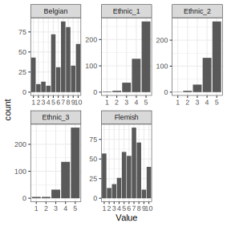
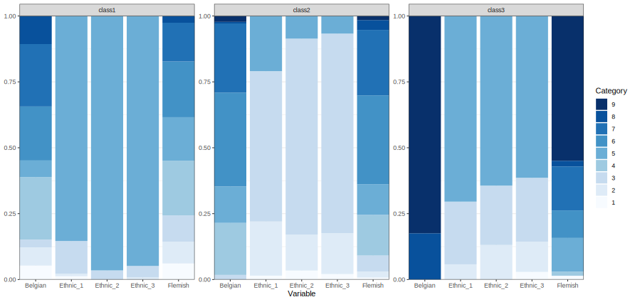

```{r, include = FALSE, cache = FALSE}
library(yaml)
library(scales)
knitr::opts_chunk$set(
  collapse = TRUE,
  comment = "#>",
  message = FALSE,
  warning = FALSE
)
options(scipen = 1, digits = 2)
run_everything = FALSE
```

This is an example of exploratory LCA with ordinal indicators using `tidySEM`.
The present example uses synthetic data based on a study by Maene and colleagues.
In a sample of Flemish (Belgian) high-school students with a migration background,
this study set out to identify distinct classes based on ordinal indicators of National, Regional, and Heritage identity.

The approach to class enumeration was semi-theory driven:
The researchers expected to find profiles that were distinct on all three types of identity (national, regional, and heritage) - but the exact number of classes was not pre-specified (hypothesis 1).

Hypothesis 2 stated that adolescents who are nationally integrated would have lower depressive feelings than students from students with other combinations of identifications (hypothesis 2).
Hypothesis 3 was that, for assimilated and separated adolescents, there would not be a significant effect of perceived teacher discrimination on depressive symptoms.

Use the command `?tidySEM::maene_identity` to view the data documentation.

## Loading the Data

To load the data, simply attach the `tidySEM` package.
For convenience, we assign the indicator data to an object called `df`:

```{r, echo = TRUE, eval=TRUE}
# Load required packages
library(tidySEM) 
library(ggplot2)
# Load data
df <- maene_identity[1:5]
```

## Examining the Data

As per the best practices,
the first step in LCA is examining the observed data.
We use `tidySEM::descriptives()` to describe the data numerically.
Because all items are categorical,
we remove columns for continuous data to de-clutter the table:

```{r echo = TRUE, eval=FALSE, results='asis'}
desc <- tidySEM::descriptives(df)
desc <- desc[, c("name", "type", "n", "missing", "unique", 
"mode", "mode_value", "v")
]
desc
```
```{r echo = FALSE, eval=run_everything, results='asis'}
desc <- tidySEM::descriptives(df)
desc <- desc[, c("name", "type", "n", "missing", "unique", 
"mode", "mode_value", "v")
]
write.csv(desc, "lca_desc.csv", row.names = FALSE)
```
```{r tabdesc, echo = FALSE, eval=TRUE, results='asis'}
desc <- read.csv("lca_desc.csv", stringsAsFactors = FALSE)
knitr::kable(desc, caption = "Descriptive statistics for ordinal items")
```

Additionally, we can plot the data.
The `ggplot2` function `geom_bar()` is useful for ordinal data:

```{r, echo = TRUE, eval = FALSE}
df_plot <- df
names(df_plot) <- paste0("Value.", names(df_plot))
df_plot <- reshape(df_plot, varying = names(df_plot), direction = "long")
ggplot(df_plot, aes(x = Value)) +
  geom_bar() +
  facet_wrap(~time, scales = "free")+
  theme_bw()
```
```{r, echo = FALSE, eval = run_everything}
df_plot <- df
names(df_plot) <- paste0("Value.", names(df_plot))
df_plot <- reshape(df_plot, varying = names(df_plot), direction = "long")
p = ggplot(df_plot, aes(x = Value)) +
  geom_bar() +
  facet_wrap(~time, scales = "free")+
  theme_bw()
ggsave("lca_plot_desc.svg", p, device = "svg", width = 100, height = 100, units = "mm")
```

```{r, echo = FALSE, eval=TRUE, fig.cap="Bar charts for ordinal indicators"}

```

As we can see, the `descriptives()` table provides invaluable information about the measurement level of the indicators,
which is used to specify the model correctly.
If these data had not been coded as ordinal factors,
these descriptive statistics would have revealed that each variable has only 5-10 unique values.
The proportion of missing values is reported in the `"missing"` column.
If any variables had missing values, we would report an MCAR test with `mice::mcar()`,
and explain that missing data are accounted for using FIML.
In our example, we see that there are no missing values, hence we
proceed with our analysis.
Note that the ethic identification variables are very right-skewed.

## Conducting Latent Class Analysis

Before we fit a series of LCA models, we set a random seed using
`set.seed()`.
This is important because there is some inherent randomness in the estimation procedure,
and using a seed ensures that we (and others) can exactly reproduce the results.

Next, we fit the LCA models.
As all variables are ordinal, we can use the convenience function
`tidySEM::mx_lca()`, which is a wrapper for the generic function `mx_mixture()` optimized for LCA with ordinal data.
Any mixture model can be specified through `mx_mixture()`.
At the time of writing, there are two other wrapper functions for special cases:
`mx_profiles()`, for latent profile analysis, and `mx_growth_mixture()`, for latent growth analysis and growth mixture models.
All of these functions have arguments `data` and number of `classes`.
All variables in `data` are included in the analysis,
so relevant variables must be selected first.

We here consider 1-6 class models,
but note that this may be overfit, as some of the indicators have only 5 response categories.

```{r fitlca, eval = run_everything, echo = FALSE}
set.seed(123)
res <- mx_lca(data = df, classes = 1:6)
saveRDS(res, "lca_res.RData")
```
```{r eval = FALSE, echo = TRUE}
set.seed(123)
res <- mx_lca(data = df, classes = 1:6)
```
```{r eval = FALSE, echo = FALSE}
res <- readRDS("lca_res.RData")
```

## Class Enumeration

In class enumeration, we want to compare a sequence of LCA models fitted
to the data. 
First, note that all models converged without issues.
If this had not been the case,
it is possible to aid convergence using `mxTryHardOrdinal()`, which expands the search for optimal parameter values for models with ordinal indicators.
It is part of the family of functions based on `mxTryHard()`.

Next, we create a model fit table using
`table_fit()` and retain relevant columns.
We also determine whether any models can be disqualified.

```{r echo = TRUE, eval=F}
fit <- table_fit(res)
fit[ , c("Name", "LL", "Parameters", "n",
         "BIC", "Entropy",
         "prob_min", "prob_max", 
         "n_min", "n_max",
         "lmr_p")]
```
```{r echo = FALSE, eval = run_everything}
fit <- table_fit(res)
write.csv(fit, "lca_fit.csv", row.names = FALSE)
```
```{r tabfit, echo = FALSE, eval = TRUE, results='asis'}
fit <- read.csv("lca_fit.csv", stringsAsFactors = FALSE)
class(fit) <- c("tidy_fit", "data.frame")
knitr::kable(fit[ , c("Name", "LL", "Parameters", "n",
         "BIC", "Entropy",
         "prob_min", "prob_max", 
         "n_min", "n_max",
         "lmr_p")], caption = "Model fit table")
```

Next, we check for local identifiability by checking whether the size of the smallest class is consistently larger (about 5x as large) as the number of parameter per class.
We can simply calculate this by running:

```{r, echo = TRUE, eval = TRUE}
(fit$n_min * 439) / ((fit$Parameters)/c(1:6))
```

Note that, for models of 3 or more classes, there are just a few observations per parameter in the smallest class.
This is a good reason to disqualify those classes.
Here, we will eliminate classes 4-6 on those criteria,
but in real data applications, the 3-class solution might also be disqualified.

In terms of classification diagnostics,
note that the entropy is high for all models except the two-class model,
and the minimum classification probabilities are high for all models.
This indicates that all classes are distinct.

Based on the BIC, we would prefer the 2-class model.
This decision is also validated by a scree plot of the BIC,
obtained by running `plot(fit)`.

Note that the LMR test indicates that adding classes keeps significantly improving model fit, up until 6 classes.
However, due to the aforementioned concerns about low numbers of cases per parameter in the smallest classes,
we will not consider solutions with more than 3 classes.
We thus proceed with the 3-class solution.

```{r echo = TRUE, eval = FALSE}
res_final <- res[[3]]
```
```{r echo = FALSE, eval = run_everything}
res_final <- res[[3]]
```

## Interpreting the Final Class Solution

```{r, echo = FALSE, eval = run_everything}
cp <- class_prob(res_final)
out <- list(counts = cp$sum.posterior$proportion)
```

The 3-class model yielded classes of reasonable size;
the largest class comprised 33%,
and the smallest comprised 16% of cases.
The entropy was high, $S = .93$, indicating good class separability.
Furthermore, the posterior classification probability ranged from $[.94, .99]$, which means that all classes had low classification error.
We can produce a table of results using `table_results(res_final)`.
However, the results are thresholds,
indicating quantiles of a standardized normal distribution.
These may be difficult to interpret.
Therefore, we ask for the results in probability scale:

```{r echo = TRUE, eval = FALSE}
tab <- table_prob(res_final)
reshape(tab, direction = "wide", v.names = "Probability", timevar = "group", idvar = c("Variable", "Category"))
```
```{r echo = FALSE, eval = run_everything}
tab <- table_prob(res_final)
tab <- reshape(tab, direction = "wide", v.names = "Probability", timevar = "group", idvar = c("Variable", "Category"))
write.csv(tab, "lca_tab_prob.csv", row.names = FALSE)
```
```{r, eval = TRUE, echo=FALSE, results='asis'}
tab <- read.csv("lca_tab_prob.csv", stringsAsFactors = FALSE)
knitr::kable(tab, caption = "Three-class model results in probability scale")
```

The results can also be interpreted by plotting the response probabilities:

```{r echo = TRUE, eval = FALSE}
plot_prob(res_final)
```
```{r echo = FALSE, eval = run_everything}
p <- plot_prob(res_final)
ggsave("lca_prob.svg", p, device = "svg", width = 210, height = 100, units = "mm", scale = 1.5)
```
```{r echo = FALSE, eval = TRUE, fig.cap="Probability plot", out.width="100%"}

```

Note that the first class (33%) has relatively high identification with the ethnic indicators and relatively low identification with Belgian and Flemish identity.
The second class (16%) has moderate identification with Belgian and Flemish identity,
and relatively low identification with ethnic identity.
Finally, the third class (50%) has high identification with all identities.

Based on the probability plot, we can label class 1 as *ethic identifiers*,
class 2 as *low identifiers*, and class 3 as *high identifiers*.

## Auxiliary Analyses

To address the remaining two hypotheses,
we will perform auxiliary analyses.
Hypothesis 2 stated that adolescents who are nationally integrated would have lower depressive feelings than students from students with other combinations of identifications (hypothesis 2).

To test this hypothesis,
we can call the BCH function and supply the auxiliary variable depression to the `data` argument, omitting the `model` argument.
Below, we estimate an auxiliary model to compare depressive symptoms across classes:

```{r echo = TRUE, eval=FALSE}
aux_dep <- BCH(res_final, data = maene_identity$depression)
```
```{r echo = FALSE, eval=run_everything}
aux_dep <- BCH(res_final, data = maene_identity$depression)
saveRDS(aux_dep, "lca_aux_dep.RData")
```
```{r echo = FALSE, eval=FALSE}
aux_dep <- readRDS("lca_aux_dep.RData")
```

To obtain an omnibus likelihood ratio test of the significance of depression differences across classes,
as well as pairwise comparisons between classes,
use `lr_test(aux_dep)`.
The results indicate that there are no significant differences in depression across classes, $\Delta LL(5) = 4.32, p = .50$.

Hypothesis 3 was that, for assimilated and separated adolescents, there would not be a significant effect of perceived teacher discrimination on depressive symptoms.
To test this hypothesis, 
we will compare the regression coefficient of discrimination on depressive symptoms across classes.

```{r echo = TRUE, eval=FALSE}
df_aux <- maene_identity[, c("vict_teacher", "depression")]
# Dummy-code vict_teacher
df_aux$vict_teacher <- (as.integer(df_aux$vict_teacher)-1)
aux_model <- BCH(res_final, 
                 model = "depression ~ vict_teacher",
                 data = df_aux)
```
```{r echo = FALSE, eval=run_everything}
df_aux <- maene_identity[, c("vict_teacher", "depression")]
# Dummy-code vict_teacher
df_aux$vict_teacher <- (as.integer(df_aux$vict_teacher)-1)
aux_model <- BCH(res_final, 
                 model = "depression ~ vict_teacher",
                 data = df_aux)
saveRDS(aux_model, "lca_aux_model.RData")
```
```{r echo = FALSE, eval=FALSE}
aux_model <- readRDS("lca_aux_model.RData")
```

To view the coefficients of this model,
we can use either `coef(aux_model)` or `table_results(aux_model, columns = NULL)`.
As evident from the results table,
the coefficients labeled `class1.A[1,2]` are the regression coefficients.

There are two ways to test the difference in regression coefficients across classes:
using `lr_test(aux_model, compare = "A")`,
to compare the 'A matrix' (regression coefficients) across classes,
or `wald_test(aux_model, "class1.A[1,2]=class2.A[1,2]&class1.A[1,2]=class3.A[1,2]")`.
The results indicate that there are no significant differences in the regression coefficients across classes, $\chi^2 (2) = 1.16, p = .56$.
