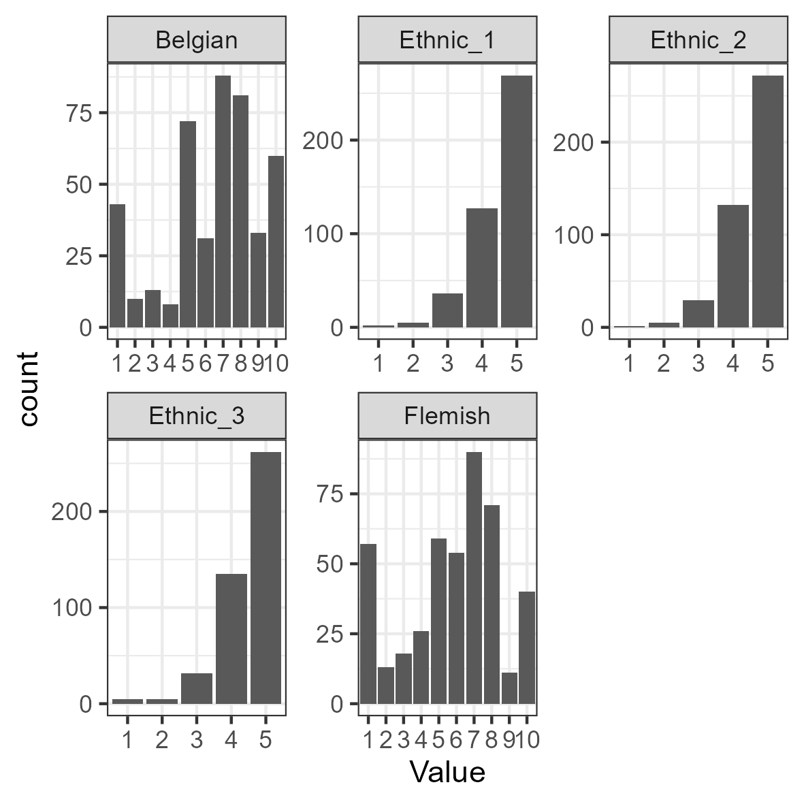
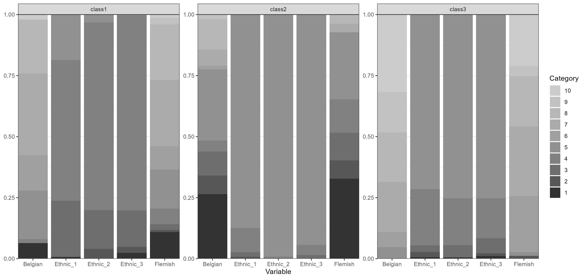

This is an example of exploratory LCA with ordinal indicators using `tidySEM`,
as explained in Van Lissa, C. J., Garnier-Villarreal, M., & Anadria, D. (2023). *Recommended Practices in Latent Class Analysis using the Open-Source R-Package tidySEM.* Structural Equation Modeling. https://doi.org/10.1080/10705511.2023.2250920.
The present example uses synthetic data based on a study by Maene and colleagues.
In a convenience sample of Flemish (Belgian) high-school students with a migration background,
this study set out to identify distinct classes based on ordinal indicators of National, Regional, and Heritage identity.
Sample size was not justified.

The approach to class enumeration was semi-theory driven:
The researchers expected to find profiles that were distinct on all three types of identity (national, regional, and heritage) - but the exact number of classes was not pre-specified (hypothesis 1).

Hypothesis 2 stated that adolescents who are nationally integrated would have lower depressive feelings than students from students with other combinations of identifications (hypothesis 2).
Hypothesis 3 was that, for assimilated and separated adolescents, there would not be a significant effect of perceived teacher discrimination on depressive symptoms.

Use the command `?tidySEM::maene_identity` to view the data documentation.

## Loading the Data

To load the data, simply attach the `tidySEM` package.
For convenience, we assign the indicator data to an object called `df`:


``` r
# Load required packages
library(tidySEM)
library(ggplot2)
# Load data
df <- maene_identity[1:5]
```

## Examining the Data

We use `tidySEM::descriptives()` to describe the data numerically.
Because all items are categorical,
we remove columns for continuous data to de-clutter the table:


``` r
desc <- tidySEM::descriptives(df)
desc <- desc[, c("name", "type", "n", "missing", "unique", "mode",
    "mode_value", "v")]
desc
```


Table: Descriptive statistics for ordinal items

|name     |type            |   n| missing| unique| mode| mode_value|    v|
|:--------|:---------------|---:|-------:|------:|----:|----------:|----:|
|Ethnic_1 |ordered, factor | 439|       0|      6|  269|          5| 0.53|
|Ethnic_2 |ordered, factor | 439|       0|      6|  272|          5| 0.52|
|Ethnic_3 |ordered, factor | 439|       0|      6|  262|          5| 0.54|
|Belgian  |ordered, factor | 439|       0|     11|   88|          7| 0.86|
|Flemish  |ordered, factor | 439|       0|     11|   90|          7| 0.87|


Additionally, we can plot the data.
The `ggplot2` function `geom_bar()` is useful for ordinal data:


``` r
df_plot <- df
names(df_plot) <- paste0("Value.", names(df_plot))
df_plot <- reshape(df_plot, varying = names(df_plot), direction = "long")
ggplot(df_plot, aes(x = Value)) + geom_bar() + facet_wrap(~time,
    scales = "free") + theme_bw()
```


<div class="figure">

<p class="caption">Bar charts for ordinal indicators</p>
</div>

As we can see, the `descriptives()` table provides invaluable information about the measurement level of the indicators,
which is used to specify the model correctly.
If these data had not been coded as ordinal factors,
these descriptive statistics would have revealed that each variable has only 5-10 unique values.
The proportion of missing values is reported in the `"missing"` column.
If any variables had missing values, we would report an MCAR test with `mice::mcar()`
and explain that missing data are accounted for using FIML.
In our example, we see that there are no missing values, hence we
proceed with our analysis.
Note that the ethic identification variables are very right-skewed
and some response categories have near-zero frequencies;
this can cause problems in model specification and convergence.
One potential solution would be to merge small adjacent categories.
We will not do this here, however.

## Conducting Latent Class Analysis

Before we fit a series of LCA models, we set a random seed using
`set.seed()`.
This is important because there is some inherent randomness in the estimation procedure,
and using a seed ensures that we (and others) can exactly reproduce the results.

Next, we fit the LCA models.
As all variables are ordinal, we can use the convenience function
`tidySEM::mx_lca()`, which is a wrapper for the generic function `mx_mixture()` optimized for LCA with ordinal data.
Any mixture model can be specified through `mx_mixture()`.
At the time of writing, there are two other wrapper functions for special cases:
`mx_profiles()`, for latent profile analysis, and `mx_growth_mixture()`, for latent growth analysis and growth mixture models.
All of these functions have arguments `data` and number of `classes`.
All variables in `data` are included in the analysis,
so relevant variables must be selected first.

We here consider 1-6 class models,
but note that this may be overfit, as some of the indicators have only 5 response categories.


```
#> 
Beginning initial fit attempt
Beginning fit attempt 1 of at maximum 10 extra tries
MxComputeGradientDescent(SLSQP) evaluations 2594 fit 6151.07 change -0.07829
                                                                            

Beginning fit attempt 2 of at maximum 10 extra tries
MxComputeGradientDescent(SLSQP) evaluations 2770 fit 6151.06 change -8.849e-08
                                                                              

Beginning fit attempt 3 of at maximum 10 extra tries
Beginning fit attempt 4 of at maximum 10 extra tries
MxComputeGradientDescent(SLSQP) evaluations 337 fit 6211.19 change -21.37
                                                                         

Beginning fit attempt 5 of at maximum 10 extra tries
MxComputeGradientDescent(SLSQP) evaluations 402 fit 6223.16 change -16.24
                                                                         

Beginning fit attempt 6 of at maximum 10 extra tries
MxComputeGradientDescent(SLSQP) evaluations 268 fit 6247.23 change -49.5
                                                                        

Beginning fit attempt 7 of at maximum 10 extra tries
MxComputeGradientDescent(SLSQP) evaluations 269 fit 6210.66 change -52.14
                                                                         

Beginning fit attempt 8 of at maximum 10 extra tries
MxComputeGradientDescent(SLSQP) evaluations 597 fit 6189.4 change -2.353
                                                                        

Beginning fit attempt 9 of at maximum 10 extra tries
MxComputeGradientDescent(SLSQP) evaluations 731 fit 6225.65 change -0.4931
                                                                          

Beginning fit attempt 10 of at maximum 10 extra tries
MxComputeGradientDescent(SLSQP) evaluations 465 fit 6191.99 change -4.818
                                                                         

Final run, for Hessian and/or standard errors and/or confidence intervals
MxComputeNumericDeriv 117/465
                             

                                                                         
#> 
Beginning initial fit attempt
Fit attempt 0, fit=6151.0620761862, new current best! (was 6151.06207618622)
Beginning fit attempt 1 of at maximum 10 extra tries                        
MxComputeGradientDescent(SLSQP) evaluations 126 fit 6424.28
MxComputeGradientDescent(SLSQP) evaluations 1538 fit 5863.2 change -6.493
MxComputeGradientDescent(SLSQP) evaluations 3068 fit 5773.43 change -6.512
MxComputeGradientDescent(SLSQP) evaluations 4460 fit 5747.93 change -4.257
MxComputeGradientDescent(SLSQP) evaluations 5974 fit 5723.74 change -2.75 
MxComputeGradientDescent(SLSQP) evaluations 7484 fit 5705.32 change -1.56
MxComputeGradientDescent(SLSQP) evaluations 8978 fit 5689.52 change -0.00495
                                                                            

Fit attempt 1, fit=5689.5176471879, new current best! (was 6151.0620761862)
Beginning fit attempt 2 of at maximum 10 extra tries                       
MxComputeGradientDescent(SLSQP) evaluations 260 fit 6818.17 change -234.6
MxComputeGradientDescent(SLSQP) evaluations 1669 fit 5791.08 change -6.255
MxComputeGradientDescent(SLSQP) evaluations 3059 fit 5766.56 change -1.183
MxComputeGradientDescent(SLSQP) evaluations 4571 fit 5756.41 change -0.4034
MxComputeGradientDescent(SLSQP) evaluations 6083 fit 5755.15 change -0.2518
MxComputeGradientDescent(SLSQP) evaluations 7467 fit 5754.57 change -0.1115
MxComputeGradientDescent(SLSQP) evaluations 8960 fit 5754.07 change -0.1225
MxComputeGradientDescent(SLSQP) evaluations 10457 fit 5726.69 change -1.145
MxComputeGradientDescent(SLSQP) evaluations 12070 fit 5691.3 change -1.101 
MxComputeGradientDescent(SLSQP) evaluations 13558 fit 5689.52 change -0.0005032
MxComputeGradientDescent(SLSQP) evaluations 15046 fit 5689.52 change -1.411e-06
                                                                               

Beginning fit attempt 3 of at maximum 10 extra tries
MxComputeGradientDescent(SLSQP) evaluations 1030 fit 5725.21 change -4.907
MxComputeGradientDescent(SLSQP) evaluations 2551 fit 5705.99 change -1.852
MxComputeGradientDescent(SLSQP) evaluations 3940 fit 5696.12 change -0.05008
MxComputeGradientDescent(SLSQP) evaluations 5454 fit 5694.58 change -0.1075 
MxComputeGradientDescent(SLSQP) evaluations 6967 fit 5694.13 change -0.1047
MxComputeGradientDescent(SLSQP) evaluations 8463 fit 5689.52 change -0.0004919
                                                                              

Fit attempt 3, fit=5689.51764718499, new current best! (was 5689.5176471879)
Beginning fit attempt 4 of at maximum 10 extra tries                        
MxComputeGradientDescent(SLSQP) evaluations 903 fit 5936.29 change -5.14
MxComputeGradientDescent(SLSQP) evaluations 2311 fit 5848.05 change -7.736
MxComputeGradientDescent(SLSQP) evaluations 3835 fit 5766.93 change -4.517
MxComputeGradientDescent(SLSQP) evaluations 5348 fit 5746.67 change -0.5524
MxComputeGradientDescent(SLSQP) evaluations 6859 fit 5740.35 change -0.4455
MxComputeGradientDescent(SLSQP) evaluations 8364 fit 5734.7 change -0.481  
MxComputeGradientDescent(SLSQP) evaluations 9979 fit 5700.22 change -2.214
MxComputeGradientDescent(SLSQP) evaluations 11467 fit 5689.53 change -0.01569
MxComputeGradientDescent(SLSQP) evaluations 12955 fit 5689.52 change -1.273e-07
                                                                               

Beginning fit attempt 5 of at maximum 10 extra tries
MxComputeGradientDescent(SLSQP) evaluations 1410 fit 5744.04 change -2.129
MxComputeGradientDescent(SLSQP) evaluations 2803 fit 5733.62 change -1.79 
MxComputeGradientDescent(SLSQP) evaluations 4318 fit 5729.98 change -0.428
MxComputeGradientDescent(SLSQP) evaluations 5830 fit 5723.32 change -0.2901
MxComputeGradientDescent(SLSQP) evaluations 7342 fit 5713.91 change -0.8631
MxComputeGradientDescent(SLSQP) evaluations 8836 fit 5689.52 change -9.062e-05
                                                                              

Beginning fit attempt 6 of at maximum 10 extra tries
MxComputeGradientDescent(SLSQP) evaluations 1159 fit 5796.31 change -4.755
MxComputeGradientDescent(SLSQP) evaluations 2559 fit 5722.44 change -21.14
MxComputeGradientDescent(SLSQP) evaluations 4071 fit 5694.96 change -0.7659
MxComputeGradientDescent(SLSQP) evaluations 5583 fit 5691.02 change -0.0873
MxComputeGradientDescent(SLSQP) evaluations 6969 fit 5690.07 change -0.03915
MxComputeGradientDescent(SLSQP) evaluations 8468 fit 5689.55 change -0.1537 
                                                                           

Fit attempt 6, fit=5689.51766180467, worse than previous best (5689.51764718499)
Beginning fit attempt 7 of at maximum 10 extra tries                            
MxComputeGradientDescent(SLSQP) evaluations 775 fit 5742.74 change -11.15
MxComputeGradientDescent(SLSQP) evaluations 2170 fit 5709.54 change -0.6123
MxComputeGradientDescent(SLSQP) evaluations 3682 fit 5695.4 change -0.5367 
MxComputeGradientDescent(SLSQP) evaluations 5195 fit 5692.01 change -0.1257
MxComputeGradientDescent(SLSQP) evaluations 6705 fit 5690.79 change -0.1864
MxComputeGradientDescent(SLSQP) evaluations 8208 fit 5689.54 change -0.06825
                                                                            

Fit attempt 7, fit=5689.51767099739, worse than previous best (5689.51764718499)
Beginning fit attempt 8 of at maximum 10 extra tries                            
MxComputeGradientDescent(SLSQP) evaluations 260 fit 6363.74 change -171.5
MxComputeGradientDescent(SLSQP) evaluations 1666 fit 5748.47 change -4.196
MxComputeGradientDescent(SLSQP) evaluations 3181 fit 5721.01 change -1.965
MxComputeGradientDescent(SLSQP) evaluations 4693 fit 5709.7 change -0.269 
MxComputeGradientDescent(SLSQP) evaluations 6205 fit 5703.31 change -0.3056
MxComputeGradientDescent(SLSQP) evaluations 7711 fit 5697.9 change -0.367  
MxComputeGradientDescent(SLSQP) evaluations 9202 fit 5695.55 change -0.0001181
MxComputeGradientDescent(SLSQP) evaluations 10691 fit 5695.55 change -0.0001026
MxComputeGradientDescent(SLSQP) evaluations 12186 fit 5695.54 change -0.001729 
MxComputeGradientDescent(SLSQP) evaluations 13685 fit 5695.36 change -0.06827 
MxComputeGradientDescent(SLSQP) evaluations 15177 fit 5689.52 change -0.0001915
                                                                               

Beginning fit attempt 9 of at maximum 10 extra tries
MxComputeGradientDescent(SLSQP) evaluations 903 fit 5743.88 change -12.33
MxComputeGradientDescent(SLSQP) evaluations 2296 fit 5711.55 change -0.8043
MxComputeGradientDescent(SLSQP) evaluations 3809 fit 5701.58 change -0.06552
MxComputeGradientDescent(SLSQP) evaluations 5322 fit 5699.58 change -0.1604 
MxComputeGradientDescent(SLSQP) evaluations 6834 fit 5697.44 change -0.1494
MxComputeGradientDescent(SLSQP) evaluations 8209 fit 5691.38 change -0.06426
MxComputeGradientDescent(SLSQP) evaluations 9698 fit 5689.52 change -0.0008744
                                                                              

Fit attempt 9, fit=5689.51764718433, new current best! (was 5689.51764718499)
Beginning fit attempt 10 of at maximum 10 extra tries                        
MxComputeGradientDescent(SLSQP) evaluations 1027 fit 5723.75 change -6.061
MxComputeGradientDescent(SLSQP) evaluations 2544 fit 5707.48 change -0.3908
MxComputeGradientDescent(SLSQP) evaluations 4056 fit 5703.7 change -0.3081 
MxComputeGradientDescent(SLSQP) evaluations 5568 fit 5700.72 change -0.1132
MxComputeGradientDescent(SLSQP) evaluations 7078 fit 5698.46 change -0.1067
MxComputeGradientDescent(SLSQP) evaluations 8577 fit 5689.52 change -0.002756
                                                                             

Fit attempt 10, fit=5689.51764718182, new current best! (was 5689.51764718433)
Final run, for Hessian and/or standard errors and/or confidence intervals     
MxComputeNumericDeriv 117/1891
MxComputeNumericDeriv 367/1891
MxComputeNumericDeriv 617/1891
MxComputeNumericDeriv 867/1891
MxComputeNumericDeriv 1117/1891
MxComputeNumericDeriv 1367/1891
MxComputeNumericDeriv 1618/1891
MxComputeNumericDeriv 1868/1891
                               

                                                                         
#> 
Beginning initial fit attempt
Fit attempt 0, fit=6151.06207618621, new current best! (was 6151.06207618622)
Beginning fit attempt 1 of at maximum 10 extra tries                         
MxComputeGradientDescent(SLSQP) evaluations 380 fit 6136.47 change -202.2
MxComputeGradientDescent(SLSQP) evaluations 1330 fit 5591.09 change -30.69
MxComputeGradientDescent(SLSQP) evaluations 2466 fit 5521.92 change -6.371
MxComputeGradientDescent(SLSQP) evaluations 3409 fit 5502.91 change -3.524
MxComputeGradientDescent(SLSQP) evaluations 4539 fit 5492.36 change -1.082
MxComputeGradientDescent(SLSQP) evaluations 5479 fit 5487.76 change -0.8834
MxComputeGradientDescent(SLSQP) evaluations 6607 fit 5485.55 change -0.2293
MxComputeGradientDescent(SLSQP) evaluations 7735 fit 5484.93 change -0.08279
MxComputeGradientDescent(SLSQP) evaluations 8675 fit 5484.41 change -0.1015 
MxComputeGradientDescent(SLSQP) evaluations 9803 fit 5483.93 change -0.04536
MxComputeGradientDescent(SLSQP) evaluations 10743 fit 5483.45 change -0.07356
MxComputeGradientDescent(SLSQP) evaluations 11868 fit 5482.95 change -0.07709
MxComputeGradientDescent(SLSQP) evaluations 12992 fit 5482.49 change -0.02518
MxComputeGradientDescent(SLSQP) evaluations 13928 fit 5482.34 change -0.01814
MxComputeGradientDescent(SLSQP) evaluations 15050 fit 5482.19 change -0.002986
MxComputeGradientDescent(SLSQP) evaluations 15981 fit 5482.15 change -0.01087 
MxComputeGradientDescent(SLSQP) evaluations 17101 fit 5482.14 change -0.000186
MxComputeGradientDescent(SLSQP) evaluations 18223 fit 5482.14 change -0.0001891
MxComputeGradientDescent(SLSQP) evaluations 19158 fit 5482.14 change -0.0001759
MxComputeGradientDescent(SLSQP) evaluations 20280 fit 5482.14 change -0.0004433
MxComputeGradientDescent(SLSQP) evaluations 21213 fit 5482.13 change -0.0003978
MxComputeGradientDescent(SLSQP) evaluations 22332 fit 5482.13 change -0.0007606
MxComputeGradientDescent(SLSQP) evaluations 23449 fit 5482.12 change -0.0009421
MxComputeGradientDescent(SLSQP) evaluations 24380 fit 5482.1 change -0.003069  
MxComputeGradientDescent(SLSQP) evaluations 25501 fit 5481.49 change -0.1485 
MxComputeGradientDescent(SLSQP) evaluations 26622 fit 5480.14 change -0.04342
MxComputeGradientDescent(SLSQP) evaluations 27553 fit 5479.93 change -0.05606
MxComputeGradientDescent(SLSQP) evaluations 28670 fit 5479.81 change -0.02118
MxComputeGradientDescent(SLSQP) evaluations 29786 fit 5479.75 change -0.00256
MxComputeGradientDescent(SLSQP) evaluations 30716 fit 5479.75 change -1.875e-05
MxComputeGradientDescent(SLSQP) evaluations 31834 fit 5479.75 change -2.018e-05
MxComputeGradientDescent(SLSQP) evaluations 32956 fit 5479.75 change -9.232e-06
MxComputeGradientDescent(SLSQP) evaluations 33891 fit 5479.75 change -6.011e-06
MxComputeGradientDescent(SLSQP) evaluations 35013 fit 5479.75 change -1.358e-05
MxComputeGradientDescent(SLSQP) evaluations 36131 fit 5479.75 change -1.985e-05
MxComputeGradientDescent(SLSQP) evaluations 37066 fit 5479.75 change -3.766e-05
MxComputeGradientDescent(SLSQP) evaluations 38188 fit 5479.75 change -1.211e-05
MxComputeGradientDescent(SLSQP) evaluations 39310 fit 5479.75 change -4.291e-06
MxComputeGradientDescent(SLSQP) evaluations 40245 fit 5479.75 change -1.921e-06
MxComputeGradientDescent(SLSQP) evaluations 41367 fit 5479.75 change -8.371e-07
MxComputeGradientDescent(SLSQP) evaluations 42489 fit 5479.75 change -4.915e-07
MxComputeGradientDescent(SLSQP) evaluations 43424 fit 5479.75 change -4.946e-07
MxComputeGradientDescent(SLSQP) evaluations 44546 fit 5479.75 change -1.096e-06
MxComputeGradientDescent(SLSQP) evaluations 45665 fit 5479.75 change -2.196e-05
MxComputeGradientDescent(SLSQP) evaluations 46600 fit 5479.75 change -1.038e-05
MxComputeGradientDescent(SLSQP) evaluations 47722 fit 5479.75 change -7.046e-06
MxComputeGradientDescent(SLSQP) evaluations 48844 fit 5479.75 change -3.492e-06
MxComputeGradientDescent(SLSQP) evaluations 49779 fit 5479.75 change -9.413e-07
MxComputeGradientDescent(SLSQP) evaluations 50900 fit 5479.75 change -1.365e-06
MxComputeGradientDescent(SLSQP) evaluations 51830 fit 5479.75 change -2.016e-05
MxComputeGradientDescent(SLSQP) evaluations 52951 fit 5479.75 change -4.785e-07
MxComputeGradientDescent(SLSQP) evaluations 54073 fit 5479.75 change -3.689e-07
MxComputeGradientDescent(SLSQP) evaluations 55008 fit 5479.75 change -2.833e-07
MxComputeGradientDescent(SLSQP) evaluations 56130 fit 5479.75 change -1.129e-06
MxComputeGradientDescent(SLSQP) evaluations 57249 fit 5479.75 change -9.409e-07
MxComputeGradientDescent(SLSQP) evaluations 58179 fit 5479.75 change -5.824e-07
MxComputeGradientDescent(SLSQP) evaluations 59295 fit 5479.75 change -1.301e-05
MxComputeGradientDescent(SLSQP) evaluations 60411 fit 5479.75 change -1.663e-06
MxComputeGradientDescent(SLSQP) evaluations 61344 fit 5479.75 change -9.214e-06
MxComputeGradientDescent(SLSQP) evaluations 62466 fit 5479.75 change -0.0004853
                                                                               

Fit attempt 1, fit=5479.74604716611, new current best! (was 6151.06207618621)
Beginning fit attempt 2 of at maximum 10 extra tries                         
MxComputeGradientDescent(SLSQP) evaluations 772 fit 5558.69 change -106.2
MxComputeGradientDescent(SLSQP) evaluations 1719 fit 5515.2 change -3.936
MxComputeGradientDescent(SLSQP) evaluations 2847 fit 5495.22 change -1.132
MxComputeGradientDescent(SLSQP) evaluations 3787 fit 5491.91 change -0.4888
MxComputeGradientDescent(SLSQP) evaluations 4915 fit 5488.03 change -0.4696
MxComputeGradientDescent(SLSQP) evaluations 6043 fit 5486.02 change -0.3418
MxComputeGradientDescent(SLSQP) evaluations 6983 fit 5484.9 change -0.1837 
MxComputeGradientDescent(SLSQP) evaluations 8111 fit 5483.71 change -0.07093
MxComputeGradientDescent(SLSQP) evaluations 9051 fit 5483.19 change -0.1058 
MxComputeGradientDescent(SLSQP) evaluations 10179 fit 5482.61 change -0.07073
MxComputeGradientDescent(SLSQP) evaluations 11118 fit 5482.26 change -0.1235 
MxComputeGradientDescent(SLSQP) evaluations 12244 fit 5481.7 change -0.07246
MxComputeGradientDescent(SLSQP) evaluations 13367 fit 5481.14 change -0.06786
MxComputeGradientDescent(SLSQP) evaluations 14303 fit 5481.04 change -0.03312
MxComputeGradientDescent(SLSQP) evaluations 15422 fit 5479.97 change -0.4958 
MxComputeGradientDescent(SLSQP) evaluations 16538 fit 5479.75 change -2.466e-06
MxComputeGradientDescent(SLSQP) evaluations 17468 fit 5479.75 change -0.0003671
MxComputeGradientDescent(SLSQP) evaluations 18589 fit 5479.73 change -0.001185 
                                                                              

Fit attempt 2, fit=5479.73407619241, new current best! (was 5479.74604716611)
Beginning fit attempt 3 of at maximum 10 extra tries                         
MxComputeGradientDescent(SLSQP) evaluations 1151 fit 5672.92 change -30.14
MxComputeGradientDescent(SLSQP) evaluations 2099 fit 5624.73 change -12.38
MxComputeGradientDescent(SLSQP) evaluations 3238 fit 5565.52 change -6.466
MxComputeGradientDescent(SLSQP) evaluations 4182 fit 5549.77 change -2.074
MxComputeGradientDescent(SLSQP) evaluations 5314 fit 5533.18 change -3.416
MxComputeGradientDescent(SLSQP) evaluations 6444 fit 5513.5 change -3.133 
MxComputeGradientDescent(SLSQP) evaluations 7384 fit 5504.63 change -0.9921
MxComputeGradientDescent(SLSQP) evaluations 8512 fit 5495.58 change -0.967 
MxComputeGradientDescent(SLSQP) evaluations 9640 fit 5491.4 change -0.4205
MxComputeGradientDescent(SLSQP) evaluations 10580 fit 5490.07 change -0.2726
MxComputeGradientDescent(SLSQP) evaluations 11707 fit 5488.55 change -0.2295
MxComputeGradientDescent(SLSQP) evaluations 12645 fit 5487.56 change -0.3707
MxComputeGradientDescent(SLSQP) evaluations 13770 fit 5486.73 change -0.1325
MxComputeGradientDescent(SLSQP) evaluations 14705 fit 5486.31 change -0.0408
MxComputeGradientDescent(SLSQP) evaluations 15822 fit 5484.89 change -0.02132
MxComputeGradientDescent(SLSQP) evaluations 16938 fit 5484.88 change -0.0004827
MxComputeGradientDescent(SLSQP) evaluations 17871 fit 5482.53 change -0.7898   
MxComputeGradientDescent(SLSQP) evaluations 18987 fit 5482.12 change -0.0094
MxComputeGradientDescent(SLSQP) evaluations 19917 fit 5482.11 change -0.0001343
MxComputeGradientDescent(SLSQP) evaluations 21033 fit 5482.11 change -2.543e-07
MxComputeGradientDescent(SLSQP) evaluations 22149 fit 5482.11 change -2.217e-05
MxComputeGradientDescent(SLSQP) evaluations 23079 fit 5482.11 change -1.085e-06
                                                                               

Fit attempt 3, fit=5482.10710221786, worse than previous best (5479.73407619241)
Beginning fit attempt 4 of at maximum 10 extra tries                            
MxComputeGradientDescent(SLSQP) evaluations 189 fit 7399.67
MxComputeGradientDescent(SLSQP) evaluations 1150 fit 5752.91 change -27.2
MxComputeGradientDescent(SLSQP) evaluations 2098 fit 5671.12 change -4.644
MxComputeGradientDescent(SLSQP) evaluations 2850 fit 5656.77 change -1.118
MxComputeGradientDescent(SLSQP) evaluations 3790 fit 5647.86 change -1.57 
MxComputeGradientDescent(SLSQP) evaluations 4730 fit 5644.66 change -0.3416
MxComputeGradientDescent(SLSQP) evaluations 5670 fit 5642.61 change -0.3621
MxComputeGradientDescent(SLSQP) evaluations 6610 fit 5641.22 change -0.1249
MxComputeGradientDescent(SLSQP) evaluations 7550 fit 5640.76 change -0.07724
MxComputeGradientDescent(SLSQP) evaluations 8490 fit 5640.32 change -0.1318 
MxComputeGradientDescent(SLSQP) evaluations 9430 fit 5639.96 change -0.05332
MxComputeGradientDescent(SLSQP) evaluations 10369 fit 5639.65 change -0.119 
MxComputeGradientDescent(SLSQP) evaluations 11308 fit 5639.32 change -0.09467
MxComputeGradientDescent(SLSQP) evaluations 12244 fit 5636.38 change -0.5556 
MxComputeGradientDescent(SLSQP) evaluations 13181 fit 5627.58 change -0.5694
MxComputeGradientDescent(SLSQP) evaluations 14117 fit 5619.82 change -2.104 
MxComputeGradientDescent(SLSQP) evaluations 15050 fit 5597.33 change -8.427
MxComputeGradientDescent(SLSQP) evaluations 15981 fit 5589.39 change -0.242
MxComputeGradientDescent(SLSQP) evaluations 16911 fit 5588.97 change -0.01543
MxComputeGradientDescent(SLSQP) evaluations 18027 fit 5588.95 change -0.000257
MxComputeGradientDescent(SLSQP) evaluations 18957 fit 5588.95 change -2.133e-06
MxComputeGradientDescent(SLSQP) evaluations 19887 fit 5588.95 change -9.732e-08
                                                                               

Fit attempt 4, fit=5588.95448778031, worse than previous best (5479.73407619241)
Beginning fit attempt 5 of at maximum 10 extra tries                            
MxComputeGradientDescent(SLSQP) evaluations 769 fit 5609.27 change -58.47
MxComputeGradientDescent(SLSQP) evaluations 1716 fit 5550.47 change -5.326
MxComputeGradientDescent(SLSQP) evaluations 2846 fit 5532.95 change -2.461
MxComputeGradientDescent(SLSQP) evaluations 3786 fit 5516.95 change -2.334
MxComputeGradientDescent(SLSQP) evaluations 4726 fit 5507.44 change -2.685
MxComputeGradientDescent(SLSQP) evaluations 5854 fit 5495.7 change -0.5794
MxComputeGradientDescent(SLSQP) evaluations 6794 fit 5490.02 change -0.9044
MxComputeGradientDescent(SLSQP) evaluations 7734 fit 5486.26 change -0.7591
MxComputeGradientDescent(SLSQP) evaluations 8674 fit 5484.69 change -0.3189
MxComputeGradientDescent(SLSQP) evaluations 9614 fit 5483.26 change -0.287 
MxComputeGradientDescent(SLSQP) evaluations 10742 fit 5482.53 change -0.04618
MxComputeGradientDescent(SLSQP) evaluations 11682 fit 5482.4 change -0.02352 
MxComputeGradientDescent(SLSQP) evaluations 12619 fit 5482.29 change -0.02514
MxComputeGradientDescent(SLSQP) evaluations 13554 fit 5482.18 change -0.01595
MxComputeGradientDescent(SLSQP) evaluations 14675 fit 5482.14 change -0.008721
MxComputeGradientDescent(SLSQP) evaluations 15608 fit 5482.14 change -1.279e-05
MxComputeGradientDescent(SLSQP) evaluations 16540 fit 5482.08 change -0.016    
MxComputeGradientDescent(SLSQP) evaluations 17472 fit 5482.04 change -0.0009281
                                                                               

Fit attempt 5, fit=5482.03786746167, worse than previous best (5479.73407619241)
Beginning fit attempt 6 of at maximum 10 extra tries                            
MxComputeGradientDescent(SLSQP) evaluations 578 fit 5931.59 change -297.8
MxComputeGradientDescent(SLSQP) evaluations 1527 fit 5645.26 change -6.273
MxComputeGradientDescent(SLSQP) evaluations 2473 fit 5607.02 change -3.913
MxComputeGradientDescent(SLSQP) evaluations 3603 fit 5581.43 change -5.019
MxComputeGradientDescent(SLSQP) evaluations 4543 fit 5563.13 change -3.514
MxComputeGradientDescent(SLSQP) evaluations 5483 fit 5546.7 change -1.75  
MxComputeGradientDescent(SLSQP) evaluations 6423 fit 5541.18 change -0.8381
MxComputeGradientDescent(SLSQP) evaluations 7363 fit 5537.08 change -1.126 
MxComputeGradientDescent(SLSQP) evaluations 8491 fit 5534.94 change -0.1725
MxComputeGradientDescent(SLSQP) evaluations 9431 fit 5534.23 change -0.1394
MxComputeGradientDescent(SLSQP) evaluations 10371 fit 5533.45 change -0.1435
MxComputeGradientDescent(SLSQP) evaluations 11311 fit 5532.9 change -0.1188 
MxComputeGradientDescent(SLSQP) evaluations 12250 fit 5531.97 change -0.06965
MxComputeGradientDescent(SLSQP) evaluations 13188 fit 5531.67 change -0.01832
MxComputeGradientDescent(SLSQP) evaluations 14123 fit 5531.53 change -0.01065
MxComputeGradientDescent(SLSQP) evaluations 15243 fit 5531.36 change -0.01986
MxComputeGradientDescent(SLSQP) evaluations 16173 fit 5531.33 change -0.002096
MxComputeGradientDescent(SLSQP) evaluations 17103 fit 5531.32 change -0.0001266
MxComputeGradientDescent(SLSQP) evaluations 17847 fit 5531.32 change -1.018e-05
MxComputeGradientDescent(SLSQP) evaluations 18777 fit 5531.32 change -9.475e-06
MxComputeGradientDescent(SLSQP) evaluations 19521 fit 5531.32 change -3.337e-06
MxComputeGradientDescent(SLSQP) evaluations 20265 fit 5531.32 change -3.022e-07
MxComputeGradientDescent(SLSQP) evaluations 20823 fit 5531.32 change -7.779e-07
                                                                               

Fit attempt 6, fit=5531.32321207093, worse than previous best (5479.73407619241)
Beginning fit attempt 7 of at maximum 10 extra tries                            
MxComputeGradientDescent(SLSQP) evaluations 579 fit 5708.03 change -238.7
MxComputeGradientDescent(SLSQP) evaluations 1528 fit 5529.98 change -7.466
MxComputeGradientDescent(SLSQP) evaluations 2470 fit 5515.46 change -1.369
MxComputeGradientDescent(SLSQP) evaluations 3600 fit 5502.47 change -1.685
MxComputeGradientDescent(SLSQP) evaluations 4728 fit 5494.56 change -0.6821
MxComputeGradientDescent(SLSQP) evaluations 5668 fit 5490.37 change -0.7487
MxComputeGradientDescent(SLSQP) evaluations 6796 fit 5487.79 change -0.226 
MxComputeGradientDescent(SLSQP) evaluations 7736 fit 5486.13 change -0.3626
MxComputeGradientDescent(SLSQP) evaluations 8864 fit 5484.5 change -0.3271 
MxComputeGradientDescent(SLSQP) evaluations 9992 fit 5483.66 change -0.03821
MxComputeGradientDescent(SLSQP) evaluations 10932 fit 5483.4 change -0.07884
MxComputeGradientDescent(SLSQP) evaluations 12056 fit 5483.01 change -0.05231
MxComputeGradientDescent(SLSQP) evaluations 12993 fit 5482.75 change -0.02318
MxComputeGradientDescent(SLSQP) evaluations 14116 fit 5482.55 change -0.03375
MxComputeGradientDescent(SLSQP) evaluations 15237 fit 5482.38 change -0.006742
MxComputeGradientDescent(SLSQP) evaluations 16167 fit 5482.04 change -0.01607 
MxComputeGradientDescent(SLSQP) evaluations 17283 fit 5482.04 change -1.995e-05
MxComputeGradientDescent(SLSQP) evaluations 18402 fit 5481.49 change -0.2558   
MxComputeGradientDescent(SLSQP) evaluations 19333 fit 5479.77 change -0.08597
MxComputeGradientDescent(SLSQP) evaluations 20449 fit 5479.75 change -2.423e-07
MxComputeGradientDescent(SLSQP) evaluations 21565 fit 5479.75 change -1.953e-05
MxComputeGradientDescent(SLSQP) evaluations 22499 fit 5479.74 change -0.003997 
MxComputeGradientDescent(SLSQP) evaluations 23616 fit 5479.73 change -1.654e-06
                                                                               

Fit attempt 7, fit=5479.73406442051, new current best! (was 5479.73407619241)
Beginning fit attempt 8 of at maximum 10 extra tries                         
MxComputeGradientDescent(SLSQP) evaluations 772 fit 5948.44 change -208.6
MxComputeGradientDescent(SLSQP) evaluations 1722 fit 5687.58 change -19.97
MxComputeGradientDescent(SLSQP) evaluations 2672 fit 5624.13 change -5.451
MxComputeGradientDescent(SLSQP) evaluations 3807 fit 5606.45 change -1.877
MxComputeGradientDescent(SLSQP) evaluations 4749 fit 5592.48 change -2.16 
MxComputeGradientDescent(SLSQP) evaluations 5689 fit 5576.37 change -3.023
MxComputeGradientDescent(SLSQP) evaluations 6629 fit 5572.41 change -0.3894
MxComputeGradientDescent(SLSQP) evaluations 7757 fit 5570.62 change -0.1497
MxComputeGradientDescent(SLSQP) evaluations 8697 fit 5570.13 change -0.07316
MxComputeGradientDescent(SLSQP) evaluations 9825 fit 5569.61 change -0.03784
MxComputeGradientDescent(SLSQP) evaluations 10765 fit 5569.33 change -0.07636
MxComputeGradientDescent(SLSQP) evaluations 11703 fit 5568.92 change -0.1742 
MxComputeGradientDescent(SLSQP) evaluations 12827 fit 5568.54 change -0.1059
MxComputeGradientDescent(SLSQP) evaluations 13762 fit 5567.91 change -0.0908
MxComputeGradientDescent(SLSQP) evaluations 14879 fit 5567.83 change -0.0007722
MxComputeGradientDescent(SLSQP) evaluations 15809 fit 5567.82 change -5.879e-05
MxComputeGradientDescent(SLSQP) evaluations 16739 fit 5567.82 change -4.519e-06
MxComputeGradientDescent(SLSQP) evaluations 17858 fit 5567.82 change -4.543e-06
MxComputeGradientDescent(SLSQP) evaluations 18793 fit 5567.82 change -3.347e-06
                                                                               

Fit attempt 8, fit=5567.82337867246, worse than previous best (5479.73406442051)
Beginning fit attempt 9 of at maximum 10 extra tries                            
MxComputeGradientDescent(SLSQP) evaluations 957 fit 5592.75 change -32.52
MxComputeGradientDescent(SLSQP) evaluations 2095 fit 5538.01 change -3.135
MxComputeGradientDescent(SLSQP) evaluations 3041 fit 5522.31 change -3.059
MxComputeGradientDescent(SLSQP) evaluations 3982 fit 5507.27 change -1.671
MxComputeGradientDescent(SLSQP) evaluations 5110 fit 5501.37 change -0.8202
MxComputeGradientDescent(SLSQP) evaluations 6238 fit 5496.98 change -0.3539
MxComputeGradientDescent(SLSQP) evaluations 7366 fit 5494.83 change -0.4691
MxComputeGradientDescent(SLSQP) evaluations 8306 fit 5491.92 change -0.5213
MxComputeGradientDescent(SLSQP) evaluations 9434 fit 5489.1 change -0.3085 
MxComputeGradientDescent(SLSQP) evaluations 10374 fit 5484.76 change -1.103
MxComputeGradientDescent(SLSQP) evaluations 11501 fit 5483.27 change -0.1276
MxComputeGradientDescent(SLSQP) evaluations 12628 fit 5482.67 change -0.07923
MxComputeGradientDescent(SLSQP) evaluations 13565 fit 5482.42 change -0.0184 
MxComputeGradientDescent(SLSQP) evaluations 14686 fit 5482.17 change -0.001764
MxComputeGradientDescent(SLSQP) evaluations 15617 fit 5482.12 change -0.004332
MxComputeGradientDescent(SLSQP) evaluations 16733 fit 5482.12 change -7.299e-05
MxComputeGradientDescent(SLSQP) evaluations 17852 fit 5482.11 change -0.0005686
MxComputeGradientDescent(SLSQP) evaluations 18786 fit 5482.11 change -0.0001167
                                                                               

Fit attempt 9, fit=5482.10711640248, worse than previous best (5479.73406442051)
Beginning fit attempt 10 of at maximum 10 extra tries                           
MxComputeGradientDescent(SLSQP) evaluations 583 fit 5745.23 change -401.1
MxComputeGradientDescent(SLSQP) evaluations 1534 fit 5576.21 change -6.544
MxComputeGradientDescent(SLSQP) evaluations 2478 fit 5564.58 change -1.335
MxComputeGradientDescent(SLSQP) evaluations 3419 fit 5555.18 change -3.731
MxComputeGradientDescent(SLSQP) evaluations 4548 fit 5533.82 change -0.8597
MxComputeGradientDescent(SLSQP) evaluations 5488 fit 5530.27 change -0.9344
MxComputeGradientDescent(SLSQP) evaluations 6428 fit 5526.51 change -0.4574
MxComputeGradientDescent(SLSQP) evaluations 7368 fit 5525.14 change -0.203 
MxComputeGradientDescent(SLSQP) evaluations 8308 fit 5524.14 change -0.3154
MxComputeGradientDescent(SLSQP) evaluations 9436 fit 5522.54 change -0.1655
MxComputeGradientDescent(SLSQP) evaluations 10376 fit 5521.7 change -0.2455
MxComputeGradientDescent(SLSQP) evaluations 11316 fit 5516.61 change -1.128
MxComputeGradientDescent(SLSQP) evaluations 12253 fit 5494.17 change -17.43
MxComputeGradientDescent(SLSQP) evaluations 13188 fit 5482.55 change -1.21 
MxComputeGradientDescent(SLSQP) evaluations 14311 fit 5479.95 change -0.1635
MxComputeGradientDescent(SLSQP) evaluations 15244 fit 5479.75 change -0.002751
                                                                              

Fit attempt 10, fit=5479.74705149055, worse than previous best (5479.73406442051)
Final run, for Hessian and/or standard errors and/or confidence intervals        
MxComputeNumericDeriv 45/4278
MxComputeNumericDeriv 222/4278
MxComputeNumericDeriv 398/4278
MxComputeNumericDeriv 574/4278
MxComputeNumericDeriv 750/4278
MxComputeNumericDeriv 926/4278
MxComputeNumericDeriv 1102/4278
MxComputeNumericDeriv 1280/4278
MxComputeNumericDeriv 1457/4278
MxComputeNumericDeriv 1635/4278
MxComputeNumericDeriv 1809/4278
MxComputeNumericDeriv 1987/4278
MxComputeNumericDeriv 2164/4278
MxComputeNumericDeriv 2341/4278
MxComputeNumericDeriv 2517/4278
MxComputeNumericDeriv 2695/4278
MxComputeNumericDeriv 2872/4278
MxComputeNumericDeriv 3049/4278
MxComputeNumericDeriv 3226/4278
MxComputeNumericDeriv 3403/4278
MxComputeNumericDeriv 3581/4278
MxComputeNumericDeriv 3757/4278
MxComputeNumericDeriv 3933/4278
MxComputeNumericDeriv 4110/4278
                               

                                                                         
#> 
Beginning initial fit attempt
Fit attempt 0, fit=6151.0620761862, new current best! (was 6151.06207618622)
Beginning fit attempt 1 of at maximum 10 extra tries                        
MxComputeGradientDescent(SLSQP) evaluations 252 fit 6469.88
MxComputeGradientDescent(SLSQP) evaluations 1013 fit 5930.31 change -199.7
MxComputeGradientDescent(SLSQP) evaluations 1769 fit 5555.57 change -34.9 
MxComputeGradientDescent(SLSQP) evaluations 2525 fit 5481.59 change -16.57
MxComputeGradientDescent(SLSQP) evaluations 3278 fit 5440.3 change -11.46 
MxComputeGradientDescent(SLSQP) evaluations 4031 fit 5418.43 change -7.806
MxComputeGradientDescent(SLSQP) evaluations 5032 fit 5397.14 change -5.263
MxComputeGradientDescent(SLSQP) evaluations 5782 fit 5381.75 change -3.196
MxComputeGradientDescent(SLSQP) evaluations 6532 fit 5365.13 change -6.284
MxComputeGradientDescent(SLSQP) evaluations 7282 fit 5352.4 change -2.989 
MxComputeGradientDescent(SLSQP) evaluations 8032 fit 5347 change -1.183  
MxComputeGradientDescent(SLSQP) evaluations 9032 fit 5341.77 change -0.8767
MxComputeGradientDescent(SLSQP) evaluations 9782 fit 5337.67 change -1.279 
MxComputeGradientDescent(SLSQP) evaluations 10532 fit 5334.09 change -1.062
MxComputeGradientDescent(SLSQP) evaluations 11282 fit 5332.66 change -0.4551
MxComputeGradientDescent(SLSQP) evaluations 12282 fit 5331.17 change -0.3121
MxComputeGradientDescent(SLSQP) evaluations 13032 fit 5330.17 change -0.3109
MxComputeGradientDescent(SLSQP) evaluations 13782 fit 5329.44 change -0.1492
MxComputeGradientDescent(SLSQP) evaluations 14782 fit 5328.57 change -0.2314
MxComputeGradientDescent(SLSQP) evaluations 15532 fit 5327.91 change -0.2369
MxComputeGradientDescent(SLSQP) evaluations 16282 fit 5327.45 change -0.06287
MxComputeGradientDescent(SLSQP) evaluations 17032 fit 5327.13 change -0.08979
MxComputeGradientDescent(SLSQP) evaluations 18029 fit 5326.17 change -0.1801 
MxComputeGradientDescent(SLSQP) evaluations 18776 fit 5325.72 change -0.1812
MxComputeGradientDescent(SLSQP) evaluations 19523 fit 5325.37 change -0.04651
MxComputeGradientDescent(SLSQP) evaluations 20519 fit 5325.11 change -0.07324
MxComputeGradientDescent(SLSQP) evaluations 21266 fit 5324.98 change -0.04956
MxComputeGradientDescent(SLSQP) evaluations 22013 fit 5324.81 change -0.01243
MxComputeGradientDescent(SLSQP) evaluations 22760 fit 5324.7 change -0.02385 
MxComputeGradientDescent(SLSQP) evaluations 23506 fit 5324.68 change -0.002276
MxComputeGradientDescent(SLSQP) evaluations 24253 fit 5324.61 change -0.04436 
MxComputeGradientDescent(SLSQP) evaluations 25000 fit 5324.43 change -0.01642
MxComputeGradientDescent(SLSQP) evaluations 25747 fit 5324.28 change -0.05416
MxComputeGradientDescent(SLSQP) evaluations 26494 fit 5324.12 change -0.04793
MxComputeGradientDescent(SLSQP) evaluations 27238 fit 5324.05 change -0.01758
MxComputeGradientDescent(SLSQP) evaluations 27982 fit 5324.05 change -0.0006254
MxComputeGradientDescent(SLSQP) evaluations 28726 fit 5324.04 change -0.0005031
MxComputeGradientDescent(SLSQP) evaluations 29470 fit 5324.04 change -0.000679 
MxComputeGradientDescent(SLSQP) evaluations 30214 fit 5324.04 change -2.147e-05
MxComputeGradientDescent(SLSQP) evaluations 30958 fit 5324.04 change -6.602e-06
MxComputeGradientDescent(SLSQP) evaluations 31702 fit 5324.04 change -2.553e-05
MxComputeGradientDescent(SLSQP) evaluations 32447 fit 5324.04 change -1.864e-05
MxComputeGradientDescent(SLSQP) evaluations 33194 fit 5324.04 change -2.462e-05
MxComputeGradientDescent(SLSQP) evaluations 33941 fit 5324.04 change -2.176e-05
MxComputeGradientDescent(SLSQP) evaluations 34688 fit 5324.04 change -1.661e-05
MxComputeGradientDescent(SLSQP) evaluations 35435 fit 5324.04 change -1.194e-05
MxComputeGradientDescent(SLSQP) evaluations 36182 fit 5324.04 change -5.355e-06
MxComputeGradientDescent(SLSQP) evaluations 36927 fit 5324.04 change -4.582e-06
MxComputeGradientDescent(SLSQP) evaluations 37671 fit 5324.04 change -3.753e-06
MxComputeGradientDescent(SLSQP) evaluations 38417 fit 5324.04 change -4.692e-06
MxComputeGradientDescent(SLSQP) evaluations 39161 fit 5324.04 change -6.984e-06
MxComputeGradientDescent(SLSQP) evaluations 40156 fit 5324.04 change -2.376e-06
MxComputeGradientDescent(SLSQP) evaluations 40903 fit 5324.04 change -1.617e-06
MxComputeGradientDescent(SLSQP) evaluations 41650 fit 5324.04 change -1.094e-06
MxComputeGradientDescent(SLSQP) evaluations 42397 fit 5324.04 change -7.5e-07  
MxComputeGradientDescent(SLSQP) evaluations 43144 fit 5324.04 change -1.35e-06
MxComputeGradientDescent(SLSQP) evaluations 43888 fit 5324.04 change -1.58e-07
MxComputeGradientDescent(SLSQP) evaluations 44632 fit 5324.04 change -1.059e-06
MxComputeGradientDescent(SLSQP) evaluations 45376 fit 5324.04 change -4.92e-06 
MxComputeGradientDescent(SLSQP) evaluations 46122 fit 5324.04 change -3.724e-07
MxComputeGradientDescent(SLSQP) evaluations 46869 fit 5324.04 change -2.912e-07
MxComputeGradientDescent(SLSQP) evaluations 47616 fit 5324.04 change -3.883e-07
MxComputeGradientDescent(SLSQP) evaluations 48363 fit 5324.04 change -2.489e-07
MxComputeGradientDescent(SLSQP) evaluations 49110 fit 5324.04 change -1.248e-07
                                                                               

Fit attempt 1, fit=5324.04088155413, new current best! (was 6151.0620761862)
Beginning fit attempt 2 of at maximum 10 extra tries                        
MxComputeGradientDescent(SLSQP) evaluations 252 fit 6205.67
MxComputeGradientDescent(SLSQP) evaluations 765 fit 5703.46 change -432.8
MxComputeGradientDescent(SLSQP) evaluations 1521 fit 5479.7 change -41.42
MxComputeGradientDescent(SLSQP) evaluations 2275 fit 5417.85 change -7.392
MxComputeGradientDescent(SLSQP) evaluations 3027 fit 5403.37 change -6.746
MxComputeGradientDescent(SLSQP) evaluations 3777 fit 5394.6 change -2.315 
MxComputeGradientDescent(SLSQP) evaluations 4528 fit 5389.36 change -1.165
MxComputeGradientDescent(SLSQP) evaluations 5278 fit 5383.63 change -2.575
MxComputeGradientDescent(SLSQP) evaluations 6028 fit 5376.96 change -2.214
MxComputeGradientDescent(SLSQP) evaluations 6778 fit 5372.74 change -0.9231
MxComputeGradientDescent(SLSQP) evaluations 7528 fit 5370.19 change -1.04  
MxComputeGradientDescent(SLSQP) evaluations 8278 fit 5368.64 change -0.5735
MxComputeGradientDescent(SLSQP) evaluations 9028 fit 5366.58 change -0.6637
MxComputeGradientDescent(SLSQP) evaluations 9778 fit 5364.98 change -0.5321
MxComputeGradientDescent(SLSQP) evaluations 10528 fit 5364.01 change -0.2943
MxComputeGradientDescent(SLSQP) evaluations 11278 fit 5363.25 change -0.3272
MxComputeGradientDescent(SLSQP) evaluations 12028 fit 5362.31 change -0.2777
MxComputeGradientDescent(SLSQP) evaluations 12778 fit 5361.08 change -0.3556
MxComputeGradientDescent(SLSQP) evaluations 13528 fit 5359.9 change -0.332  
MxComputeGradientDescent(SLSQP) evaluations 14278 fit 5359.26 change -0.1333
MxComputeGradientDescent(SLSQP) evaluations 15028 fit 5358.83 change -0.1247
MxComputeGradientDescent(SLSQP) evaluations 15778 fit 5358.15 change -0.223 
MxComputeGradientDescent(SLSQP) evaluations 16528 fit 5357.35 change -0.1399
MxComputeGradientDescent(SLSQP) evaluations 17277 fit 5357.07 change -0.06838
MxComputeGradientDescent(SLSQP) evaluations 18025 fit 5352.01 change -3.455  
MxComputeGradientDescent(SLSQP) evaluations 18772 fit 5349.53 change -0.7215
MxComputeGradientDescent(SLSQP) evaluations 19519 fit 5342.18 change -1.339 
MxComputeGradientDescent(SLSQP) evaluations 20266 fit 5341.05 change -0.2816
MxComputeGradientDescent(SLSQP) evaluations 21013 fit 5340.42 change -0.09549
MxComputeGradientDescent(SLSQP) evaluations 21759 fit 5340.17 change -0.05037
MxComputeGradientDescent(SLSQP) evaluations 22503 fit 5340.16 change -5.521e-05
                                                                               

Fit attempt 2, fit=5340.16458950085, worse than previous best (5324.04088155413)
Beginning fit attempt 3 of at maximum 10 extra tries                            
MxComputeGradientDescent(SLSQP) evaluations 252 fit 5876.4
MxComputeGradientDescent(SLSQP) evaluations 1010 fit 5477.82 change -50.65
MxComputeGradientDescent(SLSQP) evaluations 1763 fit 5433.81 change -9.073
MxComputeGradientDescent(SLSQP) evaluations 2516 fit 5417.52 change -4.838
MxComputeGradientDescent(SLSQP) evaluations 3268 fit 5403.98 change -5.113
MxComputeGradientDescent(SLSQP) evaluations 4019 fit 5394.69 change -3.55 
MxComputeGradientDescent(SLSQP) evaluations 4771 fit 5382.89 change -3.588
MxComputeGradientDescent(SLSQP) evaluations 5522 fit 5373.3 change -2.722 
MxComputeGradientDescent(SLSQP) evaluations 6272 fit 5368.44 change -1.392
MxComputeGradientDescent(SLSQP) evaluations 7022 fit 5365.87 change -0.555
MxComputeGradientDescent(SLSQP) evaluations 7772 fit 5364.05 change -0.4368
MxComputeGradientDescent(SLSQP) evaluations 8522 fit 5362.69 change -0.3289
MxComputeGradientDescent(SLSQP) evaluations 9272 fit 5361.41 change -0.3305
MxComputeGradientDescent(SLSQP) evaluations 10022 fit 5360.84 change -0.1658
MxComputeGradientDescent(SLSQP) evaluations 10772 fit 5360.06 change -0.2908
MxComputeGradientDescent(SLSQP) evaluations 11522 fit 5358.69 change -0.4805
MxComputeGradientDescent(SLSQP) evaluations 12272 fit 5357.85 change -0.2473
MxComputeGradientDescent(SLSQP) evaluations 13022 fit 5356.86 change -0.5645
MxComputeGradientDescent(SLSQP) evaluations 13773 fit 5353.34 change -0.2729
MxComputeGradientDescent(SLSQP) evaluations 14523 fit 5352.17 change -0.5834
MxComputeGradientDescent(SLSQP) evaluations 15273 fit 5350 change -0.6112   
MxComputeGradientDescent(SLSQP) evaluations 16273 fit 5344.23 change -2.601
MxComputeGradientDescent(SLSQP) evaluations 17023 fit 5339.5 change -0.5648
MxComputeGradientDescent(SLSQP) evaluations 17772 fit 5337.3 change -0.8661
MxComputeGradientDescent(SLSQP) evaluations 18520 fit 5330.6 change -1.22  
MxComputeGradientDescent(SLSQP) evaluations 19267 fit 5327.44 change -0.7915
MxComputeGradientDescent(SLSQP) evaluations 20015 fit 5325.45 change -0.7367
MxComputeGradientDescent(SLSQP) evaluations 20762 fit 5324.57 change -0.1401
MxComputeGradientDescent(SLSQP) evaluations 21509 fit 5324.22 change -0.2406
MxComputeGradientDescent(SLSQP) evaluations 22256 fit 5324.14 change -0.01625
MxComputeGradientDescent(SLSQP) evaluations 23001 fit 5324.09 change -0.004107
MxComputeGradientDescent(SLSQP) evaluations 23745 fit 5324.08 change -0.001391
MxComputeGradientDescent(SLSQP) evaluations 24489 fit 5324.08 change -0.0003208
MxComputeGradientDescent(SLSQP) evaluations 25233 fit 5324.08 change -6.921e-06
                                                                               

Fit attempt 3, fit=5324.08172250738, worse than previous best (5324.04088155413)
Beginning fit attempt 4 of at maximum 10 extra tries                            
MxComputeGradientDescent(SLSQP) evaluations 252 fit 6259.19
MxComputeGradientDescent(SLSQP) evaluations 1010 fit 5653.25 change -108
MxComputeGradientDescent(SLSQP) evaluations 1766 fit 5553.45 change -14.82
MxComputeGradientDescent(SLSQP) evaluations 2521 fit 5524.38 change -11.56
MxComputeGradientDescent(SLSQP) evaluations 3025 fit 5505.52 change -10.12
MxComputeGradientDescent(SLSQP) evaluations 3779 fit 5469.42 change -10.88
MxComputeGradientDescent(SLSQP) evaluations 4532 fit 5441.47 change -9.985
MxComputeGradientDescent(SLSQP) evaluations 5284 fit 5400.29 change -13.45
MxComputeGradientDescent(SLSQP) evaluations 6034 fit 5382.9 change -6.597 
MxComputeGradientDescent(SLSQP) evaluations 6784 fit 5369.79 change -3.429
MxComputeGradientDescent(SLSQP) evaluations 7784 fit 5363.23 change -1.543
MxComputeGradientDescent(SLSQP) evaluations 8534 fit 5360.51 change -0.5858
MxComputeGradientDescent(SLSQP) evaluations 9284 fit 5358.8 change -0.512  
MxComputeGradientDescent(SLSQP) evaluations 10034 fit 5357.69 change -0.1833
MxComputeGradientDescent(SLSQP) evaluations 10784 fit 5357.02 change -0.2003
MxComputeGradientDescent(SLSQP) evaluations 11534 fit 5356.58 change -0.08138
MxComputeGradientDescent(SLSQP) evaluations 12284 fit 5356.43 change -0.0404 
MxComputeGradientDescent(SLSQP) evaluations 13034 fit 5356.3 change -0.04396
MxComputeGradientDescent(SLSQP) evaluations 13784 fit 5356.18 change -0.03743
MxComputeGradientDescent(SLSQP) evaluations 14534 fit 5356.05 change -0.04126
MxComputeGradientDescent(SLSQP) evaluations 15284 fit 5355.92 change -0.05023
MxComputeGradientDescent(SLSQP) evaluations 16034 fit 5355.77 change -0.04536
MxComputeGradientDescent(SLSQP) evaluations 16784 fit 5355.61 change -0.0552 
MxComputeGradientDescent(SLSQP) evaluations 17532 fit 5355.46 change -0.08242
MxComputeGradientDescent(SLSQP) evaluations 18279 fit 5355.29 change -0.03355
MxComputeGradientDescent(SLSQP) evaluations 19026 fit 5355.2 change -0.03774 
MxComputeGradientDescent(SLSQP) evaluations 19774 fit 5355.1 change -0.02159
MxComputeGradientDescent(SLSQP) evaluations 20523 fit 5355.07 change -0.004272
MxComputeGradientDescent(SLSQP) evaluations 21270 fit 5355.05 change -0.005045
MxComputeGradientDescent(SLSQP) evaluations 22015 fit 5350.68 change -4.307   
MxComputeGradientDescent(SLSQP) evaluations 22761 fit 5343.4 change -1.295 
MxComputeGradientDescent(SLSQP) evaluations 23505 fit 5340.71 change -0.231
MxComputeGradientDescent(SLSQP) evaluations 24249 fit 5340.57 change -0.007835
MxComputeGradientDescent(SLSQP) evaluations 24993 fit 5340.57 change -0.0003501
MxComputeGradientDescent(SLSQP) evaluations 25737 fit 5340.57 change -0.0009358
MxComputeGradientDescent(SLSQP) evaluations 26481 fit 5340.57 change -0.0001098
MxComputeGradientDescent(SLSQP) evaluations 27225 fit 5340.57 change -2.496e-05
MxComputeGradientDescent(SLSQP) evaluations 28217 fit 5340.57 change -2.084e-06
MxComputeGradientDescent(SLSQP) evaluations 28961 fit 5340.57 change -1.547e-06
MxComputeGradientDescent(SLSQP) evaluations 29707 fit 5340.57 change -3.428e-07
MxComputeGradientDescent(SLSQP) evaluations 30452 fit 5340.57 change -7.741e-07
                                                                               

Fit attempt 4, fit=5340.56833902572, worse than previous best (5324.04088155413)
Beginning fit attempt 5 of at maximum 10 extra tries                            
MxComputeGradientDescent(SLSQP) evaluations 505 fit 5597.5 change -321.3
MxComputeGradientDescent(SLSQP) evaluations 1260 fit 5361.31 change -5.751
MxComputeGradientDescent(SLSQP) evaluations 2011 fit 5349.35 change -2.311
MxComputeGradientDescent(SLSQP) evaluations 2762 fit 5340.21 change -1.787
MxComputeGradientDescent(SLSQP) evaluations 3512 fit 5335.39 change -1.401
MxComputeGradientDescent(SLSQP) evaluations 4262 fit 5332.07 change -1.119
MxComputeGradientDescent(SLSQP) evaluations 5012 fit 5330.47 change -0.5551
MxComputeGradientDescent(SLSQP) evaluations 5762 fit 5329.25 change -0.3894
MxComputeGradientDescent(SLSQP) evaluations 6512 fit 5328.4 change -0.2655 
MxComputeGradientDescent(SLSQP) evaluations 7262 fit 5327.89 change -0.1767
MxComputeGradientDescent(SLSQP) evaluations 8012 fit 5327.47 change -0.1456
MxComputeGradientDescent(SLSQP) evaluations 8762 fit 5326.99 change -0.1561
MxComputeGradientDescent(SLSQP) evaluations 9512 fit 5326.49 change -0.1435
MxComputeGradientDescent(SLSQP) evaluations 10262 fit 5326.05 change -0.1161
MxComputeGradientDescent(SLSQP) evaluations 11012 fit 5325.83 change -0.05028
MxComputeGradientDescent(SLSQP) evaluations 11762 fit 5325.63 change -0.05785
MxComputeGradientDescent(SLSQP) evaluations 12512 fit 5325.4 change -0.08605 
MxComputeGradientDescent(SLSQP) evaluations 13262 fit 5325.22 change -0.0737
MxComputeGradientDescent(SLSQP) evaluations 14012 fit 5325.07 change -0.04693
MxComputeGradientDescent(SLSQP) evaluations 14762 fit 5324.95 change -0.0248 
MxComputeGradientDescent(SLSQP) evaluations 15510 fit 5324.76 change -0.05475
MxComputeGradientDescent(SLSQP) evaluations 16260 fit 5324.64 change -0.02841
MxComputeGradientDescent(SLSQP) evaluations 17009 fit 5324.54 change -0.05348
MxComputeGradientDescent(SLSQP) evaluations 17756 fit 5324.43 change -0.009483
MxComputeGradientDescent(SLSQP) evaluations 18503 fit 5324.29 change -0.03922 
MxComputeGradientDescent(SLSQP) evaluations 19251 fit 5324.25 change -0.01175
MxComputeGradientDescent(SLSQP) evaluations 19999 fit 5324.21 change -0.005946
MxComputeGradientDescent(SLSQP) evaluations 20746 fit 5324.14 change -0.05798 
MxComputeGradientDescent(SLSQP) evaluations 21493 fit 5324.06 change -0.05494
MxComputeGradientDescent(SLSQP) evaluations 22237 fit 5324.04 change -6.015e-05
MxComputeGradientDescent(SLSQP) evaluations 23229 fit 5324.04 change -1.148e-05
MxComputeGradientDescent(SLSQP) evaluations 23973 fit 5324.04 change -6.856e-05
MxComputeGradientDescent(SLSQP) evaluations 24720 fit 5324.04 change -5.138e-06
MxComputeGradientDescent(SLSQP) evaluations 25467 fit 5324.04 change -2.793e-06
MxComputeGradientDescent(SLSQP) evaluations 26214 fit 5324.04 change -1.501e-06
MxComputeGradientDescent(SLSQP) evaluations 26961 fit 5324.04 change -8.325e-07
MxComputeGradientDescent(SLSQP) evaluations 27708 fit 5324.04 change -4.831e-07
MxComputeGradientDescent(SLSQP) evaluations 28455 fit 5324.04 change -3.035e-07
MxComputeGradientDescent(SLSQP) evaluations 29202 fit 5324.04 change -3.808e-07
MxComputeGradientDescent(SLSQP) evaluations 29947 fit 5324.04 change -3.096e-07
MxComputeGradientDescent(SLSQP) evaluations 30691 fit 5324.04 change -2.816e-06
MxComputeGradientDescent(SLSQP) evaluations 31435 fit 5324.04 change -1.632e-05
MxComputeGradientDescent(SLSQP) evaluations 32179 fit 5324.04 change -7.181e-08
MxComputeGradientDescent(SLSQP) evaluations 32923 fit 5324.04 change -6.834e-07
MxComputeGradientDescent(SLSQP) evaluations 33667 fit 5324.04 change -3.013e-06
MxComputeGradientDescent(SLSQP) evaluations 34413 fit 5324.04 change -8.663e-08
                                                                               

Fit attempt 5, fit=5324.04087870806, new current best! (was 5324.04088155413)
Beginning fit attempt 6 of at maximum 10 extra tries                         
MxComputeGradientDescent(SLSQP) evaluations 252 fit 6423.31
MxComputeGradientDescent(SLSQP) evaluations 1021 fit 5565.67 change -193.2
MxComputeGradientDescent(SLSQP) evaluations 1775 fit 5464.35 change -27.08
MxComputeGradientDescent(SLSQP) evaluations 2530 fit 5434.89 change -8.18 
MxComputeGradientDescent(SLSQP) evaluations 3284 fit 5417.92 change -6.489
MxComputeGradientDescent(SLSQP) evaluations 4037 fit 5398.29 change -7.885
MxComputeGradientDescent(SLSQP) evaluations 4788 fit 5379.76 change -4.678
MxComputeGradientDescent(SLSQP) evaluations 5539 fit 5372.1 change -1.646 
MxComputeGradientDescent(SLSQP) evaluations 6289 fit 5368.5 change -1.017
MxComputeGradientDescent(SLSQP) evaluations 7039 fit 5366.25 change -0.9484
MxComputeGradientDescent(SLSQP) evaluations 7789 fit 5363.89 change -0.7103
MxComputeGradientDescent(SLSQP) evaluations 8539 fit 5361.92 change -0.6894
MxComputeGradientDescent(SLSQP) evaluations 9289 fit 5360.34 change -0.3327
MxComputeGradientDescent(SLSQP) evaluations 10039 fit 5356.93 change -1.569
MxComputeGradientDescent(SLSQP) evaluations 10789 fit 5354.8 change -0.5055
MxComputeGradientDescent(SLSQP) evaluations 11539 fit 5353.69 change -0.3274
MxComputeGradientDescent(SLSQP) evaluations 12289 fit 5352.24 change -0.5227
MxComputeGradientDescent(SLSQP) evaluations 13039 fit 5350.94 change -0.3445
MxComputeGradientDescent(SLSQP) evaluations 13789 fit 5350.05 change -0.37  
MxComputeGradientDescent(SLSQP) evaluations 14539 fit 5349.51 change -0.08682
MxComputeGradientDescent(SLSQP) evaluations 15289 fit 5349.11 change -0.1291 
MxComputeGradientDescent(SLSQP) evaluations 16039 fit 5348.89 change -0.04964
MxComputeGradientDescent(SLSQP) evaluations 16789 fit 5348.36 change -0.2272 
MxComputeGradientDescent(SLSQP) evaluations 17539 fit 5347.77 change -0.2478
MxComputeGradientDescent(SLSQP) evaluations 18286 fit 5346.92 change -0.1694
MxComputeGradientDescent(SLSQP) evaluations 19033 fit 5345.38 change -0.7545
MxComputeGradientDescent(SLSQP) evaluations 19781 fit 5343.62 change -0.4733
MxComputeGradientDescent(SLSQP) evaluations 20528 fit 5337.24 change -1.586 
MxComputeGradientDescent(SLSQP) evaluations 21275 fit 5328.09 change -3.951
MxComputeGradientDescent(SLSQP) evaluations 22022 fit 5325.55 change -0.3344
MxComputeGradientDescent(SLSQP) evaluations 22767 fit 5325.11 change -0.03695
MxComputeGradientDescent(SLSQP) evaluations 23759 fit 5325.1 change -0.0001918
MxComputeGradientDescent(SLSQP) evaluations 24504 fit 5325.09 change -0.003305
MxComputeGradientDescent(SLSQP) evaluations 25252 fit 5325.02 change -0.03499 
MxComputeGradientDescent(SLSQP) evaluations 25996 fit 5324.99 change -0.003841
MxComputeGradientDescent(SLSQP) evaluations 26740 fit 5324.99 change -7.468e-07
MxComputeGradientDescent(SLSQP) evaluations 27484 fit 5324.99 change -3.185e-06
MxComputeGradientDescent(SLSQP) evaluations 28228 fit 5324.99 change -3.222e-05
MxComputeGradientDescent(SLSQP) evaluations 28972 fit 5324.99 change -6.143e-06
                                                                               

Fit attempt 6, fit=5324.98939755428, worse than previous best (5324.04087870806)
Beginning fit attempt 7 of at maximum 10 extra tries                            
MxComputeGradientDescent(SLSQP) evaluations 769 fit 5582.92 change -190.6
MxComputeGradientDescent(SLSQP) evaluations 1273 fit 5414 change -50.77  
MxComputeGradientDescent(SLSQP) evaluations 2027 fit 5369.22 change -11.31
MxComputeGradientDescent(SLSQP) evaluations 2778 fit 5355.44 change -3.385
MxComputeGradientDescent(SLSQP) evaluations 3528 fit 5348.9 change -2.306 
MxComputeGradientDescent(SLSQP) evaluations 4279 fit 5343.34 change -1.535
MxComputeGradientDescent(SLSQP) evaluations 5029 fit 5339.65 change -0.9041
MxComputeGradientDescent(SLSQP) evaluations 5779 fit 5337.5 change -0.5863 
MxComputeGradientDescent(SLSQP) evaluations 6529 fit 5335.34 change -0.6915
MxComputeGradientDescent(SLSQP) evaluations 7279 fit 5332.33 change -0.7574
MxComputeGradientDescent(SLSQP) evaluations 8029 fit 5330.94 change -0.2986
MxComputeGradientDescent(SLSQP) evaluations 8779 fit 5330.3 change -0.2424 
MxComputeGradientDescent(SLSQP) evaluations 9529 fit 5329.83 change -0.1072
MxComputeGradientDescent(SLSQP) evaluations 10279 fit 5329.33 change -0.2066
MxComputeGradientDescent(SLSQP) evaluations 11029 fit 5328.79 change -0.1694
MxComputeGradientDescent(SLSQP) evaluations 11779 fit 5328.44 change -0.06747
MxComputeGradientDescent(SLSQP) evaluations 12529 fit 5328.21 change -0.04497
MxComputeGradientDescent(SLSQP) evaluations 13279 fit 5328.02 change -0.07131
MxComputeGradientDescent(SLSQP) evaluations 14029 fit 5327.83 change -0.07016
MxComputeGradientDescent(SLSQP) evaluations 14779 fit 5327.69 change -0.03713
MxComputeGradientDescent(SLSQP) evaluations 15529 fit 5327.6 change -0.02835 
MxComputeGradientDescent(SLSQP) evaluations 16278 fit 5327.48 change -0.02852
MxComputeGradientDescent(SLSQP) evaluations 17028 fit 5327.38 change -0.03869
MxComputeGradientDescent(SLSQP) evaluations 17777 fit 5327.27 change -0.05624
MxComputeGradientDescent(SLSQP) evaluations 18524 fit 5327.15 change -0.01932
MxComputeGradientDescent(SLSQP) evaluations 19271 fit 5327.09 change -0.01967
MxComputeGradientDescent(SLSQP) evaluations 20267 fit 5326.85 change -0.0309 
MxComputeGradientDescent(SLSQP) evaluations 21013 fit 5325.27 change -0.2994
MxComputeGradientDescent(SLSQP) evaluations 21758 fit 5324.38 change -0.01812
MxComputeGradientDescent(SLSQP) evaluations 22502 fit 5324.38 change -3.885e-05
MxComputeGradientDescent(SLSQP) evaluations 23246 fit 5324.38 change -0.000218 
MxComputeGradientDescent(SLSQP) evaluations 23995 fit 5324.17 change -0.04348 
MxComputeGradientDescent(SLSQP) evaluations 24740 fit 5324.09 change -0.02672
MxComputeGradientDescent(SLSQP) evaluations 25486 fit 5324.08 change -0.0009165
MxComputeGradientDescent(SLSQP) evaluations 26230 fit 5324.08 change -1.153e-06
MxComputeGradientDescent(SLSQP) evaluations 26974 fit 5324.08 change -2.16e-06 
MxComputeGradientDescent(SLSQP) evaluations 27718 fit 5324.08 change -1.896e-05
MxComputeGradientDescent(SLSQP) evaluations 28462 fit 5324.08 change -3.927e-06
MxComputeGradientDescent(SLSQP) evaluations 29206 fit 5324.08 change -1.778e-06
MxComputeGradientDescent(SLSQP) evaluations 29950 fit 5324.08 change -2.643e-06
                                                                               

Fit attempt 7, fit=5324.08165167333, worse than previous best (5324.04087870806)
Beginning fit attempt 8 of at maximum 10 extra tries                            
MxComputeGradientDescent(SLSQP) evaluations 252 fit 6080.9
MxComputeGradientDescent(SLSQP) evaluations 763 fit 5727.83 change -263.7
MxComputeGradientDescent(SLSQP) evaluations 1519 fit 5571.43 change -26.03
MxComputeGradientDescent(SLSQP) evaluations 2273 fit 5503.16 change -34.06
MxComputeGradientDescent(SLSQP) evaluations 3028 fit 5433.04 change -17.68
MxComputeGradientDescent(SLSQP) evaluations 3782 fit 5415.57 change -5.649
MxComputeGradientDescent(SLSQP) evaluations 4533 fit 5408.57 change -1.919
MxComputeGradientDescent(SLSQP) evaluations 5283 fit 5403.71 change -1.056
MxComputeGradientDescent(SLSQP) evaluations 6033 fit 5393.02 change -4.522
MxComputeGradientDescent(SLSQP) evaluations 6784 fit 5380.96 change -4.205
MxComputeGradientDescent(SLSQP) evaluations 7534 fit 5375.73 change -1.659
MxComputeGradientDescent(SLSQP) evaluations 8284 fit 5371.41 change -0.9012
MxComputeGradientDescent(SLSQP) evaluations 9034 fit 5369.53 change -0.6994
MxComputeGradientDescent(SLSQP) evaluations 9784 fit 5367.34 change -0.6855
MxComputeGradientDescent(SLSQP) evaluations 10534 fit 5364.94 change -0.735
MxComputeGradientDescent(SLSQP) evaluations 11284 fit 5364.24 change -0.1356
MxComputeGradientDescent(SLSQP) evaluations 12034 fit 5363.92 change -0.08568
MxComputeGradientDescent(SLSQP) evaluations 12784 fit 5363.6 change -0.1196  
MxComputeGradientDescent(SLSQP) evaluations 13534 fit 5363.28 change -0.1295
MxComputeGradientDescent(SLSQP) evaluations 14284 fit 5362.77 change -0.14  
MxComputeGradientDescent(SLSQP) evaluations 15034 fit 5362.5 change -0.05797
MxComputeGradientDescent(SLSQP) evaluations 15784 fit 5362.09 change -0.2327
MxComputeGradientDescent(SLSQP) evaluations 16534 fit 5360.83 change -0.4245
MxComputeGradientDescent(SLSQP) evaluations 17532 fit 5358.39 change -1.154 
MxComputeGradientDescent(SLSQP) evaluations 18280 fit 5356.45 change -0.6187
MxComputeGradientDescent(SLSQP) evaluations 19028 fit 5354.53 change -0.6197
MxComputeGradientDescent(SLSQP) evaluations 19775 fit 5352.68 change -0.3654
MxComputeGradientDescent(SLSQP) evaluations 20522 fit 5350.88 change -0.7442
MxComputeGradientDescent(SLSQP) evaluations 21020 fit 5348.84 change -1.141 
MxComputeGradientDescent(SLSQP) evaluations 21767 fit 5345.41 change -1.102
MxComputeGradientDescent(SLSQP) evaluations 22512 fit 5345.04 change -0.03704
MxComputeGradientDescent(SLSQP) evaluations 23008 fit 5345.02 change -0.001876
MxComputeGradientDescent(SLSQP) evaluations 23752 fit 5345.02 change -2.665e-06
MxComputeGradientDescent(SLSQP) evaluations 24249 fit 5345.02 change -2.279e-06
MxComputeGradientDescent(SLSQP) evaluations 24993 fit 5345.02 change -8.533e-06
MxComputeGradientDescent(SLSQP) evaluations 25737 fit 5345.02 change -0.0003928
MxComputeGradientDescent(SLSQP) evaluations 26234 fit 5344.92 change -0.02707  
MxComputeGradientDescent(SLSQP) evaluations 26981 fit 5344.84 change -0.02404
MxComputeGradientDescent(SLSQP) evaluations 27728 fit 5344.77 change -0.01561
MxComputeGradientDescent(SLSQP) evaluations 28230 fit 5344.73 change -0.01132
MxComputeGradientDescent(SLSQP) evaluations 28983 fit 5344.71 change -0.00396
MxComputeGradientDescent(SLSQP) evaluations 29485 fit 5344.7 change -0.005734
MxComputeGradientDescent(SLSQP) evaluations 30237 fit 5344.67 change -0.01352
MxComputeGradientDescent(SLSQP) evaluations 30737 fit 5344.64 change -0.01671
MxComputeGradientDescent(SLSQP) evaluations 31488 fit 5344.62 change -0.001994
MxComputeGradientDescent(SLSQP) evaluations 32240 fit 5344.62 change -0.002494
MxComputeGradientDescent(SLSQP) evaluations 32740 fit 5344.61 change -0.003223
MxComputeGradientDescent(SLSQP) evaluations 33490 fit 5344.59 change -0.01133 
MxComputeGradientDescent(SLSQP) evaluations 33990 fit 5344.58 change -0.002861
MxComputeGradientDescent(SLSQP) evaluations 34741 fit 5344.58 change -0.000771
MxComputeGradientDescent(SLSQP) evaluations 35491 fit 5344.57 change -0.0003668
MxComputeGradientDescent(SLSQP) evaluations 35991 fit 5344.57 change -0.000411 
MxComputeGradientDescent(SLSQP) evaluations 36741 fit 5344.57 change -0.000894
MxComputeGradientDescent(SLSQP) evaluations 37241 fit 5344.57 change -0.0006515
MxComputeGradientDescent(SLSQP) evaluations 37991 fit 5344.57 change -0.0002164
MxComputeGradientDescent(SLSQP) evaluations 38741 fit 5344.57 change -0.0001046
MxComputeGradientDescent(SLSQP) evaluations 39241 fit 5344.57 change -4.17e-05 
MxComputeGradientDescent(SLSQP) evaluations 39991 fit 5344.57 change -1.355e-05
MxComputeGradientDescent(SLSQP) evaluations 40491 fit 5344.57 change -3.997e-06
MxComputeGradientDescent(SLSQP) evaluations 41241 fit 5344.57 change -1.057e-05
MxComputeGradientDescent(SLSQP) evaluations 41991 fit 5344.57 change -6.819e-06
MxComputeGradientDescent(SLSQP) evaluations 42491 fit 5344.57 change -2.336e-06
MxComputeGradientDescent(SLSQP) evaluations 43241 fit 5344.57 change -1.895e-07
MxComputeGradientDescent(SLSQP) evaluations 43990 fit 5344.57 change -5.351e-07
MxComputeGradientDescent(SLSQP) evaluations 44489 fit 5344.57 change -1.29e-07 
MxComputeGradientDescent(SLSQP) evaluations 45238 fit 5344.57 change -1.444e-07
MxComputeGradientDescent(SLSQP) evaluations 45736 fit 5344.57 change -1.197e-07
                                                                               

Fit attempt 8, fit=5344.56862418128, worse than previous best (5324.04087870806)
Beginning fit attempt 9 of at maximum 10 extra tries                            
MxComputeGradientDescent(SLSQP) evaluations 514 fit 6333.2 change -80.78
MxComputeGradientDescent(SLSQP) evaluations 1272 fit 5408.92 change -53.32
MxComputeGradientDescent(SLSQP) evaluations 2026 fit 5369.41 change -7.843
MxComputeGradientDescent(SLSQP) evaluations 2777 fit 5359.52 change -2.445
MxComputeGradientDescent(SLSQP) evaluations 3528 fit 5353.1 change -2.404 
MxComputeGradientDescent(SLSQP) evaluations 4278 fit 5346.13 change -2.687
MxComputeGradientDescent(SLSQP) evaluations 5028 fit 5339.42 change -1.726
MxComputeGradientDescent(SLSQP) evaluations 5778 fit 5336.72 change -0.7543
MxComputeGradientDescent(SLSQP) evaluations 6528 fit 5335.2 change -0.4679 
MxComputeGradientDescent(SLSQP) evaluations 7278 fit 5333.41 change -0.5805
MxComputeGradientDescent(SLSQP) evaluations 8028 fit 5332.22 change -0.3085
MxComputeGradientDescent(SLSQP) evaluations 8778 fit 5331.39 change -0.2777
MxComputeGradientDescent(SLSQP) evaluations 9528 fit 5330.88 change -0.1345
MxComputeGradientDescent(SLSQP) evaluations 10278 fit 5330.32 change -0.2049
MxComputeGradientDescent(SLSQP) evaluations 11028 fit 5329.85 change -0.1493
MxComputeGradientDescent(SLSQP) evaluations 11778 fit 5329.35 change -0.1812
MxComputeGradientDescent(SLSQP) evaluations 12528 fit 5329.07 change -0.08632
MxComputeGradientDescent(SLSQP) evaluations 13278 fit 5328.8 change -0.07526 
MxComputeGradientDescent(SLSQP) evaluations 14028 fit 5328.51 change -0.09792
MxComputeGradientDescent(SLSQP) evaluations 14778 fit 5328.21 change -0.08247
MxComputeGradientDescent(SLSQP) evaluations 15528 fit 5328.01 change -0.05694
MxComputeGradientDescent(SLSQP) evaluations 16277 fit 5327.8 change -0.05934 
MxComputeGradientDescent(SLSQP) evaluations 17027 fit 5327.58 change -0.07955
MxComputeGradientDescent(SLSQP) evaluations 17775 fit 5327.33 change -0.08228
MxComputeGradientDescent(SLSQP) evaluations 18522 fit 5327.15 change -0.08434
MxComputeGradientDescent(SLSQP) evaluations 19269 fit 5326.99 change -0.04343
MxComputeGradientDescent(SLSQP) evaluations 20016 fit 5326.77 change -0.05582
MxComputeGradientDescent(SLSQP) evaluations 20763 fit 5326.35 change -0.324  
MxComputeGradientDescent(SLSQP) evaluations 21509 fit 5324.25 change -0.1726
MxComputeGradientDescent(SLSQP) evaluations 22253 fit 5324.08 change -0.0006607
MxComputeGradientDescent(SLSQP) evaluations 22997 fit 5324.08 change -1.342e-07
MxComputeGradientDescent(SLSQP) evaluations 23741 fit 5324.08 change -3.696e-06
MxComputeGradientDescent(SLSQP) evaluations 24485 fit 5324.08 change -1.9e-05  
MxComputeGradientDescent(SLSQP) evaluations 25229 fit 5324.08 change -1.885e-06
MxComputeGradientDescent(SLSQP) evaluations 26221 fit 5324.08 change -1.936e-07
MxComputeGradientDescent(SLSQP) evaluations 26965 fit 5324.08 change -1.65e-06 
MxComputeGradientDescent(SLSQP) evaluations 27712 fit 5324.08 change -9.99e-07
MxComputeGradientDescent(SLSQP) evaluations 28459 fit 5324.08 change -5.918e-07
MxComputeGradientDescent(SLSQP) evaluations 29208 fit 5324.08 change -5.478e-07
MxComputeGradientDescent(SLSQP) evaluations 29961 fit 5324.08 change -1.978e-07
MxComputeGradientDescent(SLSQP) evaluations 30714 fit 5324.08 change -1.766e-07
MxComputeGradientDescent(SLSQP) evaluations 31466 fit 5324.08 change -8.213e-08
                                                                               

Fit attempt 9, fit=5324.08164960098, worse than previous best (5324.04087870806)
Beginning fit attempt 10 of at maximum 10 extra tries                           
MxComputeGradientDescent(SLSQP) evaluations 505 fit 5731.9 change -558.9
MxComputeGradientDescent(SLSQP) evaluations 1009 fit 5412.24 change -71.85
MxComputeGradientDescent(SLSQP) evaluations 1762 fit 5379.24 change -3.253
MxComputeGradientDescent(SLSQP) evaluations 2515 fit 5365.54 change -2.427
MxComputeGradientDescent(SLSQP) evaluations 3266 fit 5358.23 change -2.776
MxComputeGradientDescent(SLSQP) evaluations 4016 fit 5352.51 change -2.073
MxComputeGradientDescent(SLSQP) evaluations 5017 fit 5342.89 change -2.387
MxComputeGradientDescent(SLSQP) evaluations 5769 fit 5339.41 change -0.9504
MxComputeGradientDescent(SLSQP) evaluations 6519 fit 5337.16 change -0.4177
MxComputeGradientDescent(SLSQP) evaluations 7269 fit 5335.64 change -0.362 
MxComputeGradientDescent(SLSQP) evaluations 8019 fit 5334.34 change -0.2914
MxComputeGradientDescent(SLSQP) evaluations 8769 fit 5333.33 change -0.3211
MxComputeGradientDescent(SLSQP) evaluations 9519 fit 5332.63 change -0.2066
MxComputeGradientDescent(SLSQP) evaluations 10269 fit 5332.09 change -0.1624
MxComputeGradientDescent(SLSQP) evaluations 11019 fit 5331.66 change -0.1099
MxComputeGradientDescent(SLSQP) evaluations 11769 fit 5331.26 change -0.1605
MxComputeGradientDescent(SLSQP) evaluations 12519 fit 5330.91 change -0.1442
MxComputeGradientDescent(SLSQP) evaluations 13269 fit 5330.56 change -0.1094
MxComputeGradientDescent(SLSQP) evaluations 14019 fit 5330.33 change -0.04634
MxComputeGradientDescent(SLSQP) evaluations 14769 fit 5330.11 change -0.06955
MxComputeGradientDescent(SLSQP) evaluations 15519 fit 5329.86 change -0.106  
MxComputeGradientDescent(SLSQP) evaluations 16269 fit 5329.6 change -0.06284
MxComputeGradientDescent(SLSQP) evaluations 17018 fit 5329.4 change -0.07266
MxComputeGradientDescent(SLSQP) evaluations 17766 fit 5329.09 change -0.1875
MxComputeGradientDescent(SLSQP) evaluations 18514 fit 5328.77 change -0.07988
MxComputeGradientDescent(SLSQP) evaluations 19262 fit 5328.39 change -0.1633 
MxComputeGradientDescent(SLSQP) evaluations 20009 fit 5327.83 change -0.3391
MxComputeGradientDescent(SLSQP) evaluations 20756 fit 5327.07 change -0.2481
MxComputeGradientDescent(SLSQP) evaluations 21503 fit 5324.52 change -0.7026
MxComputeGradientDescent(SLSQP) evaluations 22248 fit 5324.08 change -0.02942
MxComputeGradientDescent(SLSQP) evaluations 22992 fit 5324.08 change -1.452e-06
                                                                               

Fit attempt 10, fit=5324.08164296728, worse than previous best (5324.04087870806)
Final run, for Hessian and/or standard errors and/or confidence intervals        
MxComputeNumericDeriv 63/7626
MxComputeNumericDeriv 189/7626
MxComputeNumericDeriv 315/7626
MxComputeNumericDeriv 441/7626
MxComputeNumericDeriv 567/7626
MxComputeNumericDeriv 694/7626
MxComputeNumericDeriv 820/7626
MxComputeNumericDeriv 947/7626
MxComputeNumericDeriv 1073/7626
MxComputeNumericDeriv 1200/7626
MxComputeNumericDeriv 1327/7626
MxComputeNumericDeriv 1454/7626
MxComputeNumericDeriv 1580/7626
MxComputeNumericDeriv 1706/7626
MxComputeNumericDeriv 1833/7626
MxComputeNumericDeriv 1959/7626
MxComputeNumericDeriv 2086/7626
MxComputeNumericDeriv 2212/7626
MxComputeNumericDeriv 2339/7626
MxComputeNumericDeriv 2465/7626
MxComputeNumericDeriv 2592/7626
MxComputeNumericDeriv 2719/7626
MxComputeNumericDeriv 2845/7626
MxComputeNumericDeriv 2971/7626
MxComputeNumericDeriv 3098/7626
MxComputeNumericDeriv 3225/7626
MxComputeNumericDeriv 3349/7626
MxComputeNumericDeriv 3476/7626
MxComputeNumericDeriv 3602/7626
MxComputeNumericDeriv 3729/7626
MxComputeNumericDeriv 3856/7626
MxComputeNumericDeriv 3982/7626
MxComputeNumericDeriv 4107/7626
MxComputeNumericDeriv 4233/7626
MxComputeNumericDeriv 4359/7626
MxComputeNumericDeriv 4486/7626
MxComputeNumericDeriv 4612/7626
MxComputeNumericDeriv 4739/7626
MxComputeNumericDeriv 4865/7626
MxComputeNumericDeriv 4992/7626
MxComputeNumericDeriv 5118/7626
MxComputeNumericDeriv 5245/7626
MxComputeNumericDeriv 5372/7626
MxComputeNumericDeriv 5499/7626
MxComputeNumericDeriv 5625/7626
MxComputeNumericDeriv 5752/7626
MxComputeNumericDeriv 5878/7626
MxComputeNumericDeriv 6004/7626
MxComputeNumericDeriv 6131/7626
MxComputeNumericDeriv 6257/7626
MxComputeNumericDeriv 6384/7626
MxComputeNumericDeriv 6510/7626
MxComputeNumericDeriv 6637/7626
MxComputeNumericDeriv 6763/7626
MxComputeNumericDeriv 6890/7626
MxComputeNumericDeriv 7017/7626
MxComputeNumericDeriv 7143/7626
MxComputeNumericDeriv 7270/7626
MxComputeNumericDeriv 7397/7626
MxComputeNumericDeriv 7523/7626
                               

                                                                         
#> 
Beginning initial fit attempt
MxComputeGradientDescent(SLSQP) evaluations 627 fit 6151.06 change -1e-11
                                                                         

Fit attempt 0, fit=6151.0620761862, new current best! (was 6151.06207618622)
Beginning fit attempt 1 of at maximum 10 extra tries                        
MxComputeGradientDescent(SLSQP) evaluations 629 fit 5940.07 change -292.5
MxComputeGradientDescent(SLSQP) evaluations 1257 fit 5574.85 change -179.2
MxComputeGradientDescent(SLSQP) evaluations 1884 fit 5496.56 change -27.97
MxComputeGradientDescent(SLSQP) evaluations 2512 fit 5417.15 change -45.21
MxComputeGradientDescent(SLSQP) evaluations 3139 fit 5360.71 change -32.78
MxComputeGradientDescent(SLSQP) evaluations 3765 fit 5314.22 change -18.58
MxComputeGradientDescent(SLSQP) evaluations 4391 fit 5280.12 change -15.6 
MxComputeGradientDescent(SLSQP) evaluations 5015 fit 5265.21 change -5.936
MxComputeGradientDescent(SLSQP) evaluations 5639 fit 5250.6 change -4.848 
MxComputeGradientDescent(SLSQP) evaluations 6263 fit 5242.79 change -4.11
MxComputeGradientDescent(SLSQP) evaluations 6887 fit 5236.07 change -3.607
MxComputeGradientDescent(SLSQP) evaluations 7199 fit 5232.73 change -3.337
MxComputeGradientDescent(SLSQP) evaluations 7823 fit 5226.9 change -2.603 
MxComputeGradientDescent(SLSQP) evaluations 8447 fit 5221.94 change -3.339
MxComputeGradientDescent(SLSQP) evaluations 9071 fit 5218.51 change -1.828
MxComputeGradientDescent(SLSQP) evaluations 9695 fit 5215.47 change -1.389
MxComputeGradientDescent(SLSQP) evaluations 10319 fit 5213.86 change -0.6576
MxComputeGradientDescent(SLSQP) evaluations 10943 fit 5212.41 change -0.8193
MxComputeGradientDescent(SLSQP) evaluations 11567 fit 5210.67 change -1.114 
MxComputeGradientDescent(SLSQP) evaluations 12191 fit 5209.24 change -0.6203
MxComputeGradientDescent(SLSQP) evaluations 12815 fit 5208.36 change -0.4756
MxComputeGradientDescent(SLSQP) evaluations 13439 fit 5207.65 change -0.3119
MxComputeGradientDescent(SLSQP) evaluations 14063 fit 5207.09 change -0.2132
MxComputeGradientDescent(SLSQP) evaluations 14687 fit 5206.44 change -0.4017
MxComputeGradientDescent(SLSQP) evaluations 14999 fit 5206.16 change -0.286 
MxComputeGradientDescent(SLSQP) evaluations 15623 fit 5205.5 change -0.3399
MxComputeGradientDescent(SLSQP) evaluations 16247 fit 5205.05 change -0.3027
MxComputeGradientDescent(SLSQP) evaluations 16871 fit 5204.6 change -0.3065 
MxComputeGradientDescent(SLSQP) evaluations 17495 fit 5204.22 change -0.2266
MxComputeGradientDescent(SLSQP) evaluations 18119 fit 5203.94 change -0.1354
MxComputeGradientDescent(SLSQP) evaluations 18743 fit 5203.52 change -0.2612
MxComputeGradientDescent(SLSQP) evaluations 19367 fit 5203.19 change -0.2136
MxComputeGradientDescent(SLSQP) evaluations 19991 fit 5202.93 change -0.1046
MxComputeGradientDescent(SLSQP) evaluations 20615 fit 5202.65 change -0.1824
MxComputeGradientDescent(SLSQP) evaluations 21239 fit 5202.43 change -0.07228
MxComputeGradientDescent(SLSQP) evaluations 21861 fit 5202.02 change -0.1958 
MxComputeGradientDescent(SLSQP) evaluations 22483 fit 5201.85 change -0.08498
MxComputeGradientDescent(SLSQP) evaluations 23106 fit 5201.73 change -0.07811
MxComputeGradientDescent(SLSQP) evaluations 23417 fit 5201.57 change -0.1615 
MxComputeGradientDescent(SLSQP) evaluations 24039 fit 5201.47 change -0.04849
MxComputeGradientDescent(SLSQP) evaluations 24661 fit 5201.33 change -0.07876
MxComputeGradientDescent(SLSQP) evaluations 25283 fit 5201.24 change -0.02729
MxComputeGradientDescent(SLSQP) evaluations 25905 fit 5201.16 change -0.03948
MxComputeGradientDescent(SLSQP) evaluations 26527 fit 5201.13 change -0.01224
MxComputeGradientDescent(SLSQP) evaluations 27149 fit 5201.07 change -0.04364
MxComputeGradientDescent(SLSQP) evaluations 27772 fit 5201.05 change -0.00461
MxComputeGradientDescent(SLSQP) evaluations 28394 fit 5201.02 change -0.02681
MxComputeGradientDescent(SLSQP) evaluations 29016 fit 5201 change -0.01317   
MxComputeGradientDescent(SLSQP) evaluations 29638 fit 5200.97 change -0.01031
MxComputeGradientDescent(SLSQP) evaluations 30260 fit 5200.95 change -0.01644
MxComputeGradientDescent(SLSQP) evaluations 30571 fit 5200.94 change -0.009161
MxComputeGradientDescent(SLSQP) evaluations 31193 fit 5200.93 change -0.00495 
MxComputeGradientDescent(SLSQP) evaluations 31815 fit 5200.92 change -0.003651
MxComputeGradientDescent(SLSQP) evaluations 32435 fit 5200.91 change -0.002589
MxComputeGradientDescent(SLSQP) evaluations 33055 fit 5200.91 change -0.001562
MxComputeGradientDescent(SLSQP) evaluations 33365 fit 5200.91 change -0.001955
MxComputeGradientDescent(SLSQP) evaluations 33987 fit 5200.91 change -0.0001007
MxComputeGradientDescent(SLSQP) evaluations 34609 fit 5200.91 change -0.0001074
MxComputeGradientDescent(SLSQP) evaluations 34920 fit 5200.91 change -0.0001597
MxComputeGradientDescent(SLSQP) evaluations 35541 fit 5200.91 change -0.0002805
MxComputeGradientDescent(SLSQP) evaluations 35851 fit 5200.91 change -0.0001904
MxComputeGradientDescent(SLSQP) evaluations 36473 fit 5200.91 change -4.419e-05
MxComputeGradientDescent(SLSQP) evaluations 36784 fit 5200.91 change -4.107e-05
MxComputeGradientDescent(SLSQP) evaluations 37406 fit 5200.91 change -3.212e-05
MxComputeGradientDescent(SLSQP) evaluations 37717 fit 5200.91 change -2.882e-05
MxComputeGradientDescent(SLSQP) evaluations 38339 fit 5200.91 change -2.704e-05
MxComputeGradientDescent(SLSQP) evaluations 38650 fit 5200.91 change -3.822e-05
MxComputeGradientDescent(SLSQP) evaluations 39271 fit 5200.91 change -4.864e-05
MxComputeGradientDescent(SLSQP) evaluations 39581 fit 5200.91 change -6.174e-05
MxComputeGradientDescent(SLSQP) evaluations 40201 fit 5200.91 change -5.468e-05
MxComputeGradientDescent(SLSQP) evaluations 40512 fit 5200.91 change -6.638e-06
MxComputeGradientDescent(SLSQP) evaluations 41134 fit 5200.91 change -1.136e-05
MxComputeGradientDescent(SLSQP) evaluations 41755 fit 5200.91 change -1.969e-05
MxComputeGradientDescent(SLSQP) evaluations 42065 fit 5200.91 change -4.169e-05
MxComputeGradientDescent(SLSQP) evaluations 42685 fit 5200.91 change -3.599e-05
MxComputeGradientDescent(SLSQP) evaluations 42995 fit 5200.91 change -2.724e-05
MxComputeGradientDescent(SLSQP) evaluations 43617 fit 5200.91 change -6.653e-07
MxComputeGradientDescent(SLSQP) evaluations 43928 fit 5200.91 change -7.988e-07
MxComputeGradientDescent(SLSQP) evaluations 44550 fit 5200.91 change -1.428e-06
MxComputeGradientDescent(SLSQP) evaluations 44860 fit 5200.91 change -1.382e-06
MxComputeGradientDescent(SLSQP) evaluations 45480 fit 5200.91 change -2.049e-06
MxComputeGradientDescent(SLSQP) evaluations 45790 fit 5200.91 change -3.301e-06
MxComputeGradientDescent(SLSQP) evaluations 46411 fit 5200.91 change -6.936e-07
MxComputeGradientDescent(SLSQP) evaluations 46722 fit 5200.91 change -6.933e-07
MxComputeGradientDescent(SLSQP) evaluations 47344 fit 5200.91 change -4.817e-07
MxComputeGradientDescent(SLSQP) evaluations 47655 fit 5200.91 change -3.893e-07
MxComputeGradientDescent(SLSQP) evaluations 48277 fit 5200.91 change -2.532e-07
MxComputeGradientDescent(SLSQP) evaluations 48588 fit 5200.91 change -2.041e-07
MxComputeGradientDescent(SLSQP) evaluations 49210 fit 5200.91 change -1.375e-07
MxComputeGradientDescent(SLSQP) evaluations 49521 fit 5200.91 change -1.119e-07
MxComputeGradientDescent(SLSQP) evaluations 50143 fit 5200.91 change -7.799e-08
MxComputeGradientDescent(SLSQP) evaluations 50454 fit 5200.91 change -6.557e-08
                                                                               

Fit attempt 1, fit=5200.90533966978, new current best! (was 6151.0620761862)
Beginning fit attempt 2 of at maximum 10 extra tries                        
MxComputeGradientDescent(SLSQP) evaluations 315 fit 5992.61
MxComputeGradientDescent(SLSQP) evaluations 950 fit 5535.83 change -239.6
MxComputeGradientDescent(SLSQP) evaluations 1264 fit 5463.85 change -71.98
MxComputeGradientDescent(SLSQP) evaluations 1578 fit 5364.13 change -99.71
MxComputeGradientDescent(SLSQP) evaluations 2206 fit 5318.24 change -18.91
MxComputeGradientDescent(SLSQP) evaluations 2519 fit 5309.26 change -8.982
MxComputeGradientDescent(SLSQP) evaluations 2833 fit 5300.32 change -8.937
MxComputeGradientDescent(SLSQP) evaluations 3458 fit 5292.4 change -2.944 
MxComputeGradientDescent(SLSQP) evaluations 3770 fit 5290.19 change -2.204
MxComputeGradientDescent(SLSQP) evaluations 4394 fit 5285.65 change -2.468
MxComputeGradientDescent(SLSQP) evaluations 4706 fit 5283.92 change -1.733
MxComputeGradientDescent(SLSQP) evaluations 5018 fit 5282.55 change -1.367
MxComputeGradientDescent(SLSQP) evaluations 5642 fit 5279.14 change -1.922
MxComputeGradientDescent(SLSQP) evaluations 5954 fit 5277.74 change -1.4  
MxComputeGradientDescent(SLSQP) evaluations 6578 fit 5275.25 change -1.198
MxComputeGradientDescent(SLSQP) evaluations 6890 fit 5272.89 change -2.364
MxComputeGradientDescent(SLSQP) evaluations 7514 fit 5268.79 change -2.095
MxComputeGradientDescent(SLSQP) evaluations 7826 fit 5267.08 change -1.701
MxComputeGradientDescent(SLSQP) evaluations 8138 fit 5265.4 change -1.683 
MxComputeGradientDescent(SLSQP) evaluations 8762 fit 5262.33 change -1.483
MxComputeGradientDescent(SLSQP) evaluations 9074 fit 5260.32 change -2.014
MxComputeGradientDescent(SLSQP) evaluations 9698 fit 5257.5 change -1.299 
MxComputeGradientDescent(SLSQP) evaluations 10010 fit 5255.62 change -1.871
MxComputeGradientDescent(SLSQP) evaluations 10322 fit 5252.86 change -2.768
MxComputeGradientDescent(SLSQP) evaluations 10946 fit 5248.27 change -2.554
MxComputeGradientDescent(SLSQP) evaluations 11258 fit 5244.09 change -4.18 
MxComputeGradientDescent(SLSQP) evaluations 11883 fit 5240.4 change -1.474
MxComputeGradientDescent(SLSQP) evaluations 12195 fit 5239.3 change -1.097
MxComputeGradientDescent(SLSQP) evaluations 12507 fit 5238.64 change -0.6677
MxComputeGradientDescent(SLSQP) evaluations 13131 fit 5237.34 change -0.6531
MxComputeGradientDescent(SLSQP) evaluations 13443 fit 5236.65 change -0.6892
MxComputeGradientDescent(SLSQP) evaluations 14067 fit 5235.7 change -0.4824 
MxComputeGradientDescent(SLSQP) evaluations 14379 fit 5235.44 change -0.2609
MxComputeGradientDescent(SLSQP) evaluations 15003 fit 5234.01 change -0.5249
MxComputeGradientDescent(SLSQP) evaluations 15315 fit 5233.42 change -0.5809
MxComputeGradientDescent(SLSQP) evaluations 15627 fit 5232.93 change -0.4949
MxComputeGradientDescent(SLSQP) evaluations 16251 fit 5232.49 change -0.1958
MxComputeGradientDescent(SLSQP) evaluations 16563 fit 5232.39 change -0.1056
MxComputeGradientDescent(SLSQP) evaluations 17187 fit 5231.97 change -0.1345
MxComputeGradientDescent(SLSQP) evaluations 17499 fit 5231.66 change -0.3105
MxComputeGradientDescent(SLSQP) evaluations 17811 fit 5231.42 change -0.2372
MxComputeGradientDescent(SLSQP) evaluations 18435 fit 5230.56 change -0.4218
MxComputeGradientDescent(SLSQP) evaluations 18747 fit 5230.24 change -0.3223
MxComputeGradientDescent(SLSQP) evaluations 19371 fit 5229.32 change -0.3216
MxComputeGradientDescent(SLSQP) evaluations 19683 fit 5228.71 change -0.6123
MxComputeGradientDescent(SLSQP) evaluations 19995 fit 5227.87 change -0.8391
MxComputeGradientDescent(SLSQP) evaluations 20619 fit 5224.08 change -2.543 
MxComputeGradientDescent(SLSQP) evaluations 20931 fit 5223.15 change -0.9277
MxComputeGradientDescent(SLSQP) evaluations 21554 fit 5221.49 change -0.9556
MxComputeGradientDescent(SLSQP) evaluations 21865 fit 5215.67 change -5.821 
MxComputeGradientDescent(SLSQP) evaluations 22488 fit 5207.89 change -1.524
MxComputeGradientDescent(SLSQP) evaluations 22800 fit 5207.26 change -0.6352
MxComputeGradientDescent(SLSQP) evaluations 23112 fit 5206.16 change -1.101 
MxComputeGradientDescent(SLSQP) evaluations 23734 fit 5202.93 change -1.216
MxComputeGradientDescent(SLSQP) evaluations 24046 fit 5202.27 change -0.6618
MxComputeGradientDescent(SLSQP) evaluations 24669 fit 5201.81 change -0.2266
MxComputeGradientDescent(SLSQP) evaluations 24980 fit 5201.42 change -0.3821
MxComputeGradientDescent(SLSQP) evaluations 25291 fit 5201.26 change -0.1592
MxComputeGradientDescent(SLSQP) evaluations 25914 fit 5201.14 change -0.04328
MxComputeGradientDescent(SLSQP) evaluations 26225 fit 5201.1 change -0.04124 
MxComputeGradientDescent(SLSQP) evaluations 26847 fit 5200.97 change -0.0458
MxComputeGradientDescent(SLSQP) evaluations 27158 fit 5200.94 change -0.03361
MxComputeGradientDescent(SLSQP) evaluations 27470 fit 5200.94 change -0.004293
MxComputeGradientDescent(SLSQP) evaluations 28092 fit 5200.92 change -0.009917
MxComputeGradientDescent(SLSQP) evaluations 28403 fit 5200.92 change -0.00218 
MxComputeGradientDescent(SLSQP) evaluations 29025 fit 5200.92 change -0.001112
MxComputeGradientDescent(SLSQP) evaluations 29335 fit 5200.92 change -0.002262
MxComputeGradientDescent(SLSQP) evaluations 29646 fit 5200.92 change -0.0005606
MxComputeGradientDescent(SLSQP) evaluations 30266 fit 5200.91 change -0.002067 
MxComputeGradientDescent(SLSQP) evaluations 30576 fit 5200.91 change -0.001923
MxComputeGradientDescent(SLSQP) evaluations 31196 fit 5200.91 change -0.0005297
MxComputeGradientDescent(SLSQP) evaluations 31506 fit 5200.91 change -0.0002278
MxComputeGradientDescent(SLSQP) evaluations 31816 fit 5200.91 change -0.0001189
MxComputeGradientDescent(SLSQP) evaluations 32436 fit 5200.91 change -2.578e-05
MxComputeGradientDescent(SLSQP) evaluations 32746 fit 5200.91 change -1.276e-05
MxComputeGradientDescent(SLSQP) evaluations 33366 fit 5200.91 change -2.856e-06
MxComputeGradientDescent(SLSQP) evaluations 33676 fit 5200.91 change -1.449e-06
MxComputeGradientDescent(SLSQP) evaluations 33986 fit 5200.91 change -7.533e-07
MxComputeGradientDescent(SLSQP) evaluations 34606 fit 5200.91 change -3.048e-07
MxComputeGradientDescent(SLSQP) evaluations 34916 fit 5200.91 change -3.384e-07
MxComputeGradientDescent(SLSQP) evaluations 35537 fit 5200.91 change -9.774e-08
                                                                               

Beginning fit attempt 3 of at maximum 10 extra tries
MxComputeGradientDescent(SLSQP) evaluations 315 fit 6306.99
MxComputeGradientDescent(SLSQP) evaluations 630 fit 5488.19 change -818.8
MxComputeGradientDescent(SLSQP) evaluations 944 fit 5372.91 change -115.3
MxComputeGradientDescent(SLSQP) evaluations 1572 fit 5249.15 change -18.94
MxComputeGradientDescent(SLSQP) evaluations 1885 fit 5240.24 change -8.914
MxComputeGradientDescent(SLSQP) evaluations 2198 fit 5237.45 change -2.786
MxComputeGradientDescent(SLSQP) evaluations 2510 fit 5235.8 change -1.652 
MxComputeGradientDescent(SLSQP) evaluations 2822 fit 5232.07 change -3.733
MxComputeGradientDescent(SLSQP) evaluations 3135 fit 5229.16 change -2.909
MxComputeGradientDescent(SLSQP) evaluations 3447 fit 5226.32 change -2.841
MxComputeGradientDescent(SLSQP) evaluations 3759 fit 5224.03 change -2.289
MxComputeGradientDescent(SLSQP) evaluations 4071 fit 5222.43 change -1.6  
MxComputeGradientDescent(SLSQP) evaluations 4383 fit 5221 change -1.425 
MxComputeGradientDescent(SLSQP) evaluations 4695 fit 5219.96 change -1.039
MxComputeGradientDescent(SLSQP) evaluations 5007 fit 5218.92 change -1.044
MxComputeGradientDescent(SLSQP) evaluations 5319 fit 5218.09 change -0.834
MxComputeGradientDescent(SLSQP) evaluations 5631 fit 5217.23 change -0.8511
MxComputeGradientDescent(SLSQP) evaluations 5943 fit 5216.53 change -0.7077
MxComputeGradientDescent(SLSQP) evaluations 6255 fit 5215.67 change -0.8529
MxComputeGradientDescent(SLSQP) evaluations 6567 fit 5214.68 change -0.9919
MxComputeGradientDescent(SLSQP) evaluations 6879 fit 5213.78 change -0.899 
MxComputeGradientDescent(SLSQP) evaluations 7191 fit 5212.95 change -0.8287
MxComputeGradientDescent(SLSQP) evaluations 7503 fit 5212.05 change -0.9078
MxComputeGradientDescent(SLSQP) evaluations 7815 fit 5211.55 change -0.497 
MxComputeGradientDescent(SLSQP) evaluations 8127 fit 5211.21 change -0.336
MxComputeGradientDescent(SLSQP) evaluations 8439 fit 5210.77 change -0.4382
MxComputeGradientDescent(SLSQP) evaluations 8751 fit 5210.56 change -0.2142
MxComputeGradientDescent(SLSQP) evaluations 9063 fit 5210.11 change -0.4473
MxComputeGradientDescent(SLSQP) evaluations 9375 fit 5209.78 change -0.3326
MxComputeGradientDescent(SLSQP) evaluations 9687 fit 5209.39 change -0.3917
MxComputeGradientDescent(SLSQP) evaluations 9999 fit 5209.08 change -0.3051
MxComputeGradientDescent(SLSQP) evaluations 10311 fit 5208.66 change -0.4201
MxComputeGradientDescent(SLSQP) evaluations 10623 fit 5208.07 change -0.5907
MxComputeGradientDescent(SLSQP) evaluations 10935 fit 5207.52 change -0.5515
MxComputeGradientDescent(SLSQP) evaluations 11247 fit 5207.11 change -0.4134
MxComputeGradientDescent(SLSQP) evaluations 11559 fit 5206.7 change -0.4037 
MxComputeGradientDescent(SLSQP) evaluations 11871 fit 5206.42 change -0.2824
MxComputeGradientDescent(SLSQP) evaluations 12183 fit 5206.22 change -0.2045
MxComputeGradientDescent(SLSQP) evaluations 12495 fit 5205.92 change -0.2955
MxComputeGradientDescent(SLSQP) evaluations 12807 fit 5205.68 change -0.2465
MxComputeGradientDescent(SLSQP) evaluations 13119 fit 5205.31 change -0.3643
MxComputeGradientDescent(SLSQP) evaluations 13431 fit 5204.98 change -0.3318
MxComputeGradientDescent(SLSQP) evaluations 13743 fit 5204.66 change -0.3236
MxComputeGradientDescent(SLSQP) evaluations 14055 fit 5204.44 change -0.2188
MxComputeGradientDescent(SLSQP) evaluations 14367 fit 5204.2 change -0.2333 
MxComputeGradientDescent(SLSQP) evaluations 14679 fit 5204.01 change -0.1987
MxComputeGradientDescent(SLSQP) evaluations 14991 fit 5203.79 change -0.216 
MxComputeGradientDescent(SLSQP) evaluations 15303 fit 5203.63 change -0.1603
MxComputeGradientDescent(SLSQP) evaluations 15615 fit 5203.48 change -0.1483
MxComputeGradientDescent(SLSQP) evaluations 15927 fit 5203.39 change -0.09134
MxComputeGradientDescent(SLSQP) evaluations 16239 fit 5203.25 change -0.1416 
MxComputeGradientDescent(SLSQP) evaluations 16551 fit 5203.09 change -0.1539
MxComputeGradientDescent(SLSQP) evaluations 16863 fit 5202.96 change -0.1294
MxComputeGradientDescent(SLSQP) evaluations 17175 fit 5202.83 change -0.1341
MxComputeGradientDescent(SLSQP) evaluations 17487 fit 5202.66 change -0.1678
MxComputeGradientDescent(SLSQP) evaluations 17799 fit 5202.57 change -0.09289
MxComputeGradientDescent(SLSQP) evaluations 18111 fit 5202.42 change -0.1466 
MxComputeGradientDescent(SLSQP) evaluations 18423 fit 5202.33 change -0.09786
MxComputeGradientDescent(SLSQP) evaluations 18735 fit 5202.25 change -0.07157
MxComputeGradientDescent(SLSQP) evaluations 19047 fit 5202.16 change -0.09158
MxComputeGradientDescent(SLSQP) evaluations 19359 fit 5202.08 change -0.08379
MxComputeGradientDescent(SLSQP) evaluations 19670 fit 5202 change -0.08253   
MxComputeGradientDescent(SLSQP) evaluations 19982 fit 5201.94 change -0.06002
MxComputeGradientDescent(SLSQP) evaluations 20294 fit 5201.81 change -0.1297 
MxComputeGradientDescent(SLSQP) evaluations 20606 fit 5201.69 change -0.1146
MxComputeGradientDescent(SLSQP) evaluations 20918 fit 5201.64 change -0.0494
MxComputeGradientDescent(SLSQP) evaluations 21230 fit 5201.56 change -0.08121
MxComputeGradientDescent(SLSQP) evaluations 21542 fit 5201.51 change -0.05228
MxComputeGradientDescent(SLSQP) evaluations 21853 fit 5201.44 change -0.06411
MxComputeGradientDescent(SLSQP) evaluations 22164 fit 5201.33 change -0.1195 
MxComputeGradientDescent(SLSQP) evaluations 22476 fit 5201.27 change -0.05236
MxComputeGradientDescent(SLSQP) evaluations 22787 fit 5201.2 change -0.07456 
MxComputeGradientDescent(SLSQP) evaluations 23098 fit 5201.18 change -0.02246
MxComputeGradientDescent(SLSQP) evaluations 23409 fit 5201.16 change -0.02059
MxComputeGradientDescent(SLSQP) evaluations 23720 fit 5201.07 change -0.08182
MxComputeGradientDescent(SLSQP) evaluations 24031 fit 5201.01 change -0.06138
MxComputeGradientDescent(SLSQP) evaluations 24342 fit 5201 change -0.01437   
MxComputeGradientDescent(SLSQP) evaluations 24653 fit 5200.98 change -0.01649
MxComputeGradientDescent(SLSQP) evaluations 24964 fit 5200.95 change -0.02701
MxComputeGradientDescent(SLSQP) evaluations 25275 fit 5200.94 change -0.01824
MxComputeGradientDescent(SLSQP) evaluations 25586 fit 5200.93 change -0.007161
MxComputeGradientDescent(SLSQP) evaluations 25897 fit 5200.93 change -0.002627
MxComputeGradientDescent(SLSQP) evaluations 26208 fit 5200.92 change -0.006111
MxComputeGradientDescent(SLSQP) evaluations 26519 fit 5200.91 change -0.005443
MxComputeGradientDescent(SLSQP) evaluations 26830 fit 5200.91 change -0.00447 
MxComputeGradientDescent(SLSQP) evaluations 27142 fit 5200.91 change -0.000829
MxComputeGradientDescent(SLSQP) evaluations 27453 fit 5200.91 change -0.001062
MxComputeGradientDescent(SLSQP) evaluations 27763 fit 5200.91 change -0.0009187
MxComputeGradientDescent(SLSQP) evaluations 28074 fit 5200.91 change -0.0002386
MxComputeGradientDescent(SLSQP) evaluations 28384 fit 5200.91 change -0.0007483
MxComputeGradientDescent(SLSQP) evaluations 28696 fit 5200.91 change -0.0002749
MxComputeGradientDescent(SLSQP) evaluations 29007 fit 5200.91 change -0.0002912
MxComputeGradientDescent(SLSQP) evaluations 29318 fit 5200.91 change -0.0002715
MxComputeGradientDescent(SLSQP) evaluations 29629 fit 5200.91 change -3.908e-06
MxComputeGradientDescent(SLSQP) evaluations 29940 fit 5200.91 change -2.479e-05
MxComputeGradientDescent(SLSQP) evaluations 30250 fit 5200.91 change -4.281e-07
MxComputeGradientDescent(SLSQP) evaluations 30560 fit 5200.91 change -1.11e-06 
MxComputeGradientDescent(SLSQP) evaluations 30870 fit 5200.91 change -2.534e-06
MxComputeGradientDescent(SLSQP) evaluations 31180 fit 5200.91 change -5.11e-06 
MxComputeGradientDescent(SLSQP) evaluations 31490 fit 5200.91 change -1.077e-05
MxComputeGradientDescent(SLSQP) evaluations 31800 fit 5200.91 change -2.109e-05
MxComputeGradientDescent(SLSQP) evaluations 32110 fit 5200.91 change -9.762e-06
MxComputeGradientDescent(SLSQP) evaluations 32420 fit 5200.91 change -1.235e-05
MxComputeGradientDescent(SLSQP) evaluations 32730 fit 5200.91 change -2.627e-06
MxComputeGradientDescent(SLSQP) evaluations 33040 fit 5200.91 change -1.175e-06
MxComputeGradientDescent(SLSQP) evaluations 33350 fit 5200.91 change -3.334e-06
MxComputeGradientDescent(SLSQP) evaluations 33660 fit 5200.91 change -5.383e-06
MxComputeGradientDescent(SLSQP) evaluations 33970 fit 5200.91 change -1.171e-05
MxComputeGradientDescent(SLSQP) evaluations 34281 fit 5200.91 change -1.06e-06 
MxComputeGradientDescent(SLSQP) evaluations 34592 fit 5200.91 change -2.255e-06
MxComputeGradientDescent(SLSQP) evaluations 34903 fit 5200.91 change -1.92e-06 
MxComputeGradientDescent(SLSQP) evaluations 35214 fit 5200.91 change -1.589e-06
MxComputeGradientDescent(SLSQP) evaluations 35525 fit 5200.91 change -1.324e-06
MxComputeGradientDescent(SLSQP) evaluations 35836 fit 5200.91 change -1.112e-06
MxComputeGradientDescent(SLSQP) evaluations 36147 fit 5200.91 change -1.153e-06
MxComputeGradientDescent(SLSQP) evaluations 36458 fit 5200.91 change -1.268e-06
MxComputeGradientDescent(SLSQP) evaluations 36769 fit 5200.91 change -1.399e-06
MxComputeGradientDescent(SLSQP) evaluations 37080 fit 5200.91 change -1.468e-06
MxComputeGradientDescent(SLSQP) evaluations 37390 fit 5200.91 change -7.505e-07
MxComputeGradientDescent(SLSQP) evaluations 37700 fit 5200.91 change -4.141e-07
MxComputeGradientDescent(SLSQP) evaluations 38010 fit 5200.91 change -2.492e-06
MxComputeGradientDescent(SLSQP) evaluations 38320 fit 5200.91 change -4.43e-06 
MxComputeGradientDescent(SLSQP) evaluations 38630 fit 5200.91 change -9.432e-06
MxComputeGradientDescent(SLSQP) evaluations 38940 fit 5200.91 change -1.478e-05
MxComputeGradientDescent(SLSQP) evaluations 39250 fit 5200.91 change -1.488e-05
MxComputeGradientDescent(SLSQP) evaluations 39561 fit 5200.91 change -9.109e-07
MxComputeGradientDescent(SLSQP) evaluations 39872 fit 5200.91 change -1.189e-06
MxComputeGradientDescent(SLSQP) evaluations 40183 fit 5200.91 change -8.869e-07
MxComputeGradientDescent(SLSQP) evaluations 40494 fit 5200.91 change -6.624e-07
MxComputeGradientDescent(SLSQP) evaluations 40805 fit 5200.91 change -5.06e-07 
MxComputeGradientDescent(SLSQP) evaluations 41116 fit 5200.91 change -3.941e-07
MxComputeGradientDescent(SLSQP) evaluations 41427 fit 5200.91 change -3.106e-07
MxComputeGradientDescent(SLSQP) evaluations 41738 fit 5200.91 change -2.453e-07
MxComputeGradientDescent(SLSQP) evaluations 42049 fit 5200.91 change -1.974e-07
MxComputeGradientDescent(SLSQP) evaluations 42360 fit 5200.91 change -1.589e-07
MxComputeGradientDescent(SLSQP) evaluations 42671 fit 5200.91 change -1.281e-07
MxComputeGradientDescent(SLSQP) evaluations 42982 fit 5200.91 change -1.016e-07
MxComputeGradientDescent(SLSQP) evaluations 43293 fit 5200.91 change -7.969e-08
                                                                               

Beginning fit attempt 4 of at maximum 10 extra tries
MxComputeGradientDescent(SLSQP) evaluations 315 fit 6439.58
MxComputeGradientDescent(SLSQP) evaluations 632 fit 5988.2 change -451.4
MxComputeGradientDescent(SLSQP) evaluations 948 fit 5746.8 change -241.4
MxComputeGradientDescent(SLSQP) evaluations 1262 fit 5531.08 change -215.7
MxComputeGradientDescent(SLSQP) evaluations 1576 fit 5449.91 change -81.18
MxComputeGradientDescent(SLSQP) evaluations 1890 fit 5425.41 change -24.5 
MxComputeGradientDescent(SLSQP) evaluations 2204 fit 5401.29 change -24.12
MxComputeGradientDescent(SLSQP) evaluations 2517 fit 5393.35 change -7.942
MxComputeGradientDescent(SLSQP) evaluations 2830 fit 5377.47 change -15.88
MxComputeGradientDescent(SLSQP) evaluations 3143 fit 5372.51 change -4.969
MxComputeGradientDescent(SLSQP) evaluations 3456 fit 5368.9 change -3.606 
MxComputeGradientDescent(SLSQP) evaluations 3769 fit 5365.48 change -3.424
MxComputeGradientDescent(SLSQP) evaluations 4081 fit 5361.81 change -3.666
MxComputeGradientDescent(SLSQP) evaluations 4393 fit 5357.43 change -4.375
MxComputeGradientDescent(SLSQP) evaluations 4705 fit 5353.39 change -4.044
MxComputeGradientDescent(SLSQP) evaluations 5017 fit 5349.42 change -3.967
MxComputeGradientDescent(SLSQP) evaluations 5329 fit 5345.77 change -3.657
MxComputeGradientDescent(SLSQP) evaluations 5642 fit 5342.7 change -3.066 
MxComputeGradientDescent(SLSQP) evaluations 5954 fit 5339.3 change -3.402
MxComputeGradientDescent(SLSQP) evaluations 6266 fit 5336.73 change -2.564
MxComputeGradientDescent(SLSQP) evaluations 6578 fit 5334.36 change -2.375
MxComputeGradientDescent(SLSQP) evaluations 6890 fit 5332.45 change -1.91 
MxComputeGradientDescent(SLSQP) evaluations 7202 fit 5330.57 change -1.884
MxComputeGradientDescent(SLSQP) evaluations 7514 fit 5328.58 change -1.982
MxComputeGradientDescent(SLSQP) evaluations 7826 fit 5325.56 change -3.025
MxComputeGradientDescent(SLSQP) evaluations 8138 fit 5323.05 change -2.508
MxComputeGradientDescent(SLSQP) evaluations 8450 fit 5320.47 change -2.581
MxComputeGradientDescent(SLSQP) evaluations 8762 fit 5318.28 change -2.186
MxComputeGradientDescent(SLSQP) evaluations 9074 fit 5317.16 change -1.126
MxComputeGradientDescent(SLSQP) evaluations 9386 fit 5315.02 change -2.135
MxComputeGradientDescent(SLSQP) evaluations 9698 fit 5312.58 change -2.446
MxComputeGradientDescent(SLSQP) evaluations 10010 fit 5310.65 change -1.922
MxComputeGradientDescent(SLSQP) evaluations 10322 fit 5309.64 change -1.012
MxComputeGradientDescent(SLSQP) evaluations 10634 fit 5307.66 change -1.984
MxComputeGradientDescent(SLSQP) evaluations 10946 fit 5305.62 change -2.04 
MxComputeGradientDescent(SLSQP) evaluations 11258 fit 5303.52 change -2.094
MxComputeGradientDescent(SLSQP) evaluations 11570 fit 5301.02 change -2.5  
MxComputeGradientDescent(SLSQP) evaluations 11882 fit 5297.7 change -3.322
MxComputeGradientDescent(SLSQP) evaluations 12194 fit 5294.19 change -3.514
MxComputeGradientDescent(SLSQP) evaluations 12506 fit 5290.82 change -3.371
MxComputeGradientDescent(SLSQP) evaluations 12818 fit 5286.6 change -4.217 
MxComputeGradientDescent(SLSQP) evaluations 13130 fit 5283.66 change -2.937
MxComputeGradientDescent(SLSQP) evaluations 13442 fit 5281.16 change -2.501
MxComputeGradientDescent(SLSQP) evaluations 13754 fit 5278.18 change -2.984
MxComputeGradientDescent(SLSQP) evaluations 14066 fit 5275.73 change -2.451
MxComputeGradientDescent(SLSQP) evaluations 14378 fit 5271.86 change -3.862
MxComputeGradientDescent(SLSQP) evaluations 14691 fit 5267.51 change -4.352
MxComputeGradientDescent(SLSQP) evaluations 15004 fit 5264.45 change -3.059
MxComputeGradientDescent(SLSQP) evaluations 15316 fit 5259.22 change -5.232
MxComputeGradientDescent(SLSQP) evaluations 15628 fit 5256.62 change -2.604
MxComputeGradientDescent(SLSQP) evaluations 15940 fit 5254.39 change -2.225
MxComputeGradientDescent(SLSQP) evaluations 16252 fit 5253.44 change -0.9537
MxComputeGradientDescent(SLSQP) evaluations 16564 fit 5252.07 change -1.373 
MxComputeGradientDescent(SLSQP) evaluations 16876 fit 5250.8 change -1.268 
MxComputeGradientDescent(SLSQP) evaluations 17188 fit 5246.98 change -3.813
MxComputeGradientDescent(SLSQP) evaluations 17500 fit 5243.81 change -3.18 
MxComputeGradientDescent(SLSQP) evaluations 17812 fit 5239.15 change -4.653
MxComputeGradientDescent(SLSQP) evaluations 18124 fit 5235.27 change -3.886
MxComputeGradientDescent(SLSQP) evaluations 18436 fit 5231.52 change -3.746
MxComputeGradientDescent(SLSQP) evaluations 18748 fit 5229.67 change -1.854
MxComputeGradientDescent(SLSQP) evaluations 19060 fit 5228.5 change -1.165 
MxComputeGradientDescent(SLSQP) evaluations 19372 fit 5227.27 change -1.228
MxComputeGradientDescent(SLSQP) evaluations 19684 fit 5226.14 change -1.139
MxComputeGradientDescent(SLSQP) evaluations 19996 fit 5224.94 change -1.193
MxComputeGradientDescent(SLSQP) evaluations 20308 fit 5223.78 change -1.159
MxComputeGradientDescent(SLSQP) evaluations 20620 fit 5220.98 change -2.799
MxComputeGradientDescent(SLSQP) evaluations 20932 fit 5219.31 change -1.674
MxComputeGradientDescent(SLSQP) evaluations 21244 fit 5217.88 change -1.43 
MxComputeGradientDescent(SLSQP) evaluations 21556 fit 5217.26 change -0.6152
MxComputeGradientDescent(SLSQP) evaluations 21868 fit 5216.68 change -0.5862
MxComputeGradientDescent(SLSQP) evaluations 22179 fit 5216.26 change -0.4221
MxComputeGradientDescent(SLSQP) evaluations 22491 fit 5215.74 change -0.5124
MxComputeGradientDescent(SLSQP) evaluations 22802 fit 5214.93 change -0.8177
MxComputeGradientDescent(SLSQP) evaluations 23114 fit 5214.27 change -0.6564
MxComputeGradientDescent(SLSQP) evaluations 23425 fit 5213.88 change -0.3874
MxComputeGradientDescent(SLSQP) evaluations 23736 fit 5213.58 change -0.3034
MxComputeGradientDescent(SLSQP) evaluations 24047 fit 5213.34 change -0.2338
MxComputeGradientDescent(SLSQP) evaluations 24359 fit 5213.03 change -0.3177
MxComputeGradientDescent(SLSQP) evaluations 24670 fit 5212.09 change -0.9376
MxComputeGradientDescent(SLSQP) evaluations 24982 fit 5211.5 change -0.5922 
MxComputeGradientDescent(SLSQP) evaluations 25294 fit 5211.09 change -0.405
MxComputeGradientDescent(SLSQP) evaluations 25606 fit 5210.94 change -0.1488
MxComputeGradientDescent(SLSQP) evaluations 25917 fit 5210.64 change -0.3079
MxComputeGradientDescent(SLSQP) evaluations 26228 fit 5210.23 change -0.4053
MxComputeGradientDescent(SLSQP) evaluations 26539 fit 5209.53 change -0.6998
MxComputeGradientDescent(SLSQP) evaluations 26851 fit 5209.4 change -0.1314 
MxComputeGradientDescent(SLSQP) evaluations 27162 fit 5209.27 change -0.1307
MxComputeGradientDescent(SLSQP) evaluations 27473 fit 5208.71 change -0.555 
MxComputeGradientDescent(SLSQP) evaluations 27784 fit 5208.65 change -0.06556
MxComputeGradientDescent(SLSQP) evaluations 28095 fit 5208.57 change -0.07408
MxComputeGradientDescent(SLSQP) evaluations 28406 fit 5208.35 change -0.2216 
MxComputeGradientDescent(SLSQP) evaluations 28718 fit 5208.34 change -0.01238
MxComputeGradientDescent(SLSQP) evaluations 29029 fit 5208.26 change -0.07724
MxComputeGradientDescent(SLSQP) evaluations 29340 fit 5208.25 change -0.01207
MxComputeGradientDescent(SLSQP) evaluations 29651 fit 5208.24 change -0.006031
MxComputeGradientDescent(SLSQP) evaluations 29962 fit 5208.21 change -0.03876 
MxComputeGradientDescent(SLSQP) evaluations 30272 fit 5208.2 change -0.004569
MxComputeGradientDescent(SLSQP) evaluations 30582 fit 5208.2 change -0.001217
MxComputeGradientDescent(SLSQP) evaluations 30892 fit 5208.2 change -0.0008721
MxComputeGradientDescent(SLSQP) evaluations 31202 fit 5208.2 change -7.055e-05
MxComputeGradientDescent(SLSQP) evaluations 31512 fit 5208.2 change -1.501e-05
MxComputeGradientDescent(SLSQP) evaluations 31822 fit 5208.2 change -8.476e-06
MxComputeGradientDescent(SLSQP) evaluations 32132 fit 5208.2 change -1.333e-05
MxComputeGradientDescent(SLSQP) evaluations 32442 fit 5208.2 change -3.442e-05
MxComputeGradientDescent(SLSQP) evaluations 32752 fit 5208.2 change -7.176e-05
MxComputeGradientDescent(SLSQP) evaluations 33062 fit 5208.2 change -0.0001446
MxComputeGradientDescent(SLSQP) evaluations 33372 fit 5208.2 change -0.000234 
MxComputeGradientDescent(SLSQP) evaluations 33682 fit 5208.2 change -0.0002544
MxComputeGradientDescent(SLSQP) evaluations 33992 fit 5208.2 change -0.0001308
MxComputeGradientDescent(SLSQP) evaluations 34302 fit 5208.2 change -5.32e-05 
MxComputeGradientDescent(SLSQP) evaluations 34612 fit 5208.2 change -6.098e-05
MxComputeGradientDescent(SLSQP) evaluations 34923 fit 5208.2 change -2.397e-05
MxComputeGradientDescent(SLSQP) evaluations 35234 fit 5208.2 change -2.516e-05
MxComputeGradientDescent(SLSQP) evaluations 35545 fit 5208.2 change -2.129e-05
MxComputeGradientDescent(SLSQP) evaluations 35856 fit 5208.2 change -1.755e-05
MxComputeGradientDescent(SLSQP) evaluations 36167 fit 5208.2 change -1.431e-05
MxComputeGradientDescent(SLSQP) evaluations 36478 fit 5208.2 change -1.162e-05
MxComputeGradientDescent(SLSQP) evaluations 36789 fit 5208.2 change -9.391e-06
MxComputeGradientDescent(SLSQP) evaluations 37100 fit 5208.2 change -7.559e-06
MxComputeGradientDescent(SLSQP) evaluations 37413 fit 5208.2 change -5.401e-06
MxComputeGradientDescent(SLSQP) evaluations 37726 fit 5208.2 change -2.305e-06
MxComputeGradientDescent(SLSQP) evaluations 38039 fit 5208.2 change -2.251e-06
MxComputeGradientDescent(SLSQP) evaluations 38352 fit 5208.2 change -1.27e-06 
MxComputeGradientDescent(SLSQP) evaluations 38665 fit 5208.2 change -1.24e-06
MxComputeGradientDescent(SLSQP) evaluations 38978 fit 5208.2 change -8.491e-07
MxComputeGradientDescent(SLSQP) evaluations 39291 fit 5208.2 change -1.413e-06
MxComputeGradientDescent(SLSQP) evaluations 39604 fit 5208.2 change -1.233e-06
MxComputeGradientDescent(SLSQP) evaluations 39917 fit 5208.2 change -6.305e-07
MxComputeGradientDescent(SLSQP) evaluations 40229 fit 5208.2 change -5.327e-07
MxComputeGradientDescent(SLSQP) evaluations 40541 fit 5208.2 change -4.361e-07
MxComputeGradientDescent(SLSQP) evaluations 40853 fit 5208.2 change -2.079e-07
MxComputeGradientDescent(SLSQP) evaluations 41166 fit 5208.2 change -1.505e-07
MxComputeGradientDescent(SLSQP) evaluations 41478 fit 5208.2 change -1.195e-07
                                                                              

Fit attempt 4, fit=5208.19761849795, worse than previous best (5200.90533966978)
Beginning fit attempt 5 of at maximum 10 extra tries                            
MxComputeGradientDescent(SLSQP) evaluations 315 fit 6124.61
MxComputeGradientDescent(SLSQP) evaluations 632 fit 5710.85 change -413.8
MxComputeGradientDescent(SLSQP) evaluations 947 fit 5450.03 change -260.8
MxComputeGradientDescent(SLSQP) evaluations 1261 fit 5364.68 change -85.35
MxComputeGradientDescent(SLSQP) evaluations 1575 fit 5318 change -46.68   
MxComputeGradientDescent(SLSQP) evaluations 1889 fit 5299.33 change -18.67
MxComputeGradientDescent(SLSQP) evaluations 2203 fit 5293.76 change -5.574
MxComputeGradientDescent(SLSQP) evaluations 2516 fit 5287.71 change -6.04 
MxComputeGradientDescent(SLSQP) evaluations 2829 fit 5281.24 change -6.473
MxComputeGradientDescent(SLSQP) evaluations 3141 fit 5279.35 change -1.895
MxComputeGradientDescent(SLSQP) evaluations 3453 fit 5276.47 change -2.88 
MxComputeGradientDescent(SLSQP) evaluations 3765 fit 5274.09 change -2.373
MxComputeGradientDescent(SLSQP) evaluations 4077 fit 5270.48 change -3.617
MxComputeGradientDescent(SLSQP) evaluations 4389 fit 5268.89 change -1.586
MxComputeGradientDescent(SLSQP) evaluations 4701 fit 5266.94 change -1.949
MxComputeGradientDescent(SLSQP) evaluations 5013 fit 5265.57 change -1.372
MxComputeGradientDescent(SLSQP) evaluations 5325 fit 5263.53 change -2.036
MxComputeGradientDescent(SLSQP) evaluations 5637 fit 5261.63 change -1.9  
MxComputeGradientDescent(SLSQP) evaluations 5949 fit 5259.08 change -2.556
MxComputeGradientDescent(SLSQP) evaluations 6261 fit 5256.53 change -2.546
MxComputeGradientDescent(SLSQP) evaluations 6573 fit 5254.22 change -2.309
MxComputeGradientDescent(SLSQP) evaluations 6885 fit 5252.48 change -1.744
MxComputeGradientDescent(SLSQP) evaluations 7197 fit 5251.13 change -1.347
MxComputeGradientDescent(SLSQP) evaluations 7509 fit 5250.24 change -0.8927
MxComputeGradientDescent(SLSQP) evaluations 7821 fit 5249.41 change -0.8256
MxComputeGradientDescent(SLSQP) evaluations 8133 fit 5248.96 change -0.4569
MxComputeGradientDescent(SLSQP) evaluations 8445 fit 5248.2 change -0.7575 
MxComputeGradientDescent(SLSQP) evaluations 8757 fit 5247.65 change -0.5523
MxComputeGradientDescent(SLSQP) evaluations 9069 fit 5247.26 change -0.3853
MxComputeGradientDescent(SLSQP) evaluations 9381 fit 5246.76 change -0.5029
MxComputeGradientDescent(SLSQP) evaluations 9693 fit 5246.28 change -0.4749
MxComputeGradientDescent(SLSQP) evaluations 10005 fit 5245.64 change -0.6417
MxComputeGradientDescent(SLSQP) evaluations 10317 fit 5244.91 change -0.7306
MxComputeGradientDescent(SLSQP) evaluations 10629 fit 5244.05 change -0.858 
MxComputeGradientDescent(SLSQP) evaluations 10941 fit 5242.54 change -1.51 
MxComputeGradientDescent(SLSQP) evaluations 11253 fit 5241.65 change -0.895
MxComputeGradientDescent(SLSQP) evaluations 11565 fit 5240.89 change -0.7585
MxComputeGradientDescent(SLSQP) evaluations 11877 fit 5240.26 change -0.6292
MxComputeGradientDescent(SLSQP) evaluations 12189 fit 5239.82 change -0.4464
MxComputeGradientDescent(SLSQP) evaluations 12501 fit 5239.5 change -0.318  
MxComputeGradientDescent(SLSQP) evaluations 12813 fit 5239.17 change -0.3307
MxComputeGradientDescent(SLSQP) evaluations 13125 fit 5238.78 change -0.3868
MxComputeGradientDescent(SLSQP) evaluations 13437 fit 5238.27 change -0.5078
MxComputeGradientDescent(SLSQP) evaluations 13749 fit 5237.41 change -0.8606
MxComputeGradientDescent(SLSQP) evaluations 14061 fit 5236.51 change -0.9001
MxComputeGradientDescent(SLSQP) evaluations 14373 fit 5234.66 change -1.849 
MxComputeGradientDescent(SLSQP) evaluations 14685 fit 5232.32 change -2.339
MxComputeGradientDescent(SLSQP) evaluations 14997 fit 5230.08 change -2.239
MxComputeGradientDescent(SLSQP) evaluations 15309 fit 5228.3 change -1.783 
MxComputeGradientDescent(SLSQP) evaluations 15621 fit 5226.79 change -1.508
MxComputeGradientDescent(SLSQP) evaluations 15933 fit 5225.83 change -0.9604
MxComputeGradientDescent(SLSQP) evaluations 16245 fit 5224.95 change -0.8784
MxComputeGradientDescent(SLSQP) evaluations 16557 fit 5223.67 change -1.282 
MxComputeGradientDescent(SLSQP) evaluations 16869 fit 5222.45 change -1.218
MxComputeGradientDescent(SLSQP) evaluations 17180 fit 5220.48 change -1.975
MxComputeGradientDescent(SLSQP) evaluations 17492 fit 5217.69 change -2.794
MxComputeGradientDescent(SLSQP) evaluations 17803 fit 5215.98 change -1.702
MxComputeGradientDescent(SLSQP) evaluations 18115 fit 5214.19 change -1.789
MxComputeGradientDescent(SLSQP) evaluations 18427 fit 5212.11 change -2.082
MxComputeGradientDescent(SLSQP) evaluations 18739 fit 5210.74 change -1.372
MxComputeGradientDescent(SLSQP) evaluations 19051 fit 5209.1 change -1.644 
MxComputeGradientDescent(SLSQP) evaluations 19363 fit 5207.75 change -1.342
MxComputeGradientDescent(SLSQP) evaluations 19675 fit 5206.74 change -1.014
MxComputeGradientDescent(SLSQP) evaluations 19987 fit 5205.62 change -1.119
MxComputeGradientDescent(SLSQP) evaluations 20298 fit 5205.07 change -0.5492
MxComputeGradientDescent(SLSQP) evaluations 20610 fit 5204.17 change -0.899 
MxComputeGradientDescent(SLSQP) evaluations 20922 fit 5203.42 change -0.7495
MxComputeGradientDescent(SLSQP) evaluations 21234 fit 5203.01 change -0.4168
MxComputeGradientDescent(SLSQP) evaluations 21546 fit 5202.66 change -0.3465
MxComputeGradientDescent(SLSQP) evaluations 21857 fit 5202.21 change -0.4486
MxComputeGradientDescent(SLSQP) evaluations 22169 fit 5201.76 change -0.454 
MxComputeGradientDescent(SLSQP) evaluations 22481 fit 5201.47 change -0.2847
MxComputeGradientDescent(SLSQP) evaluations 22793 fit 5201.35 change -0.1267
MxComputeGradientDescent(SLSQP) evaluations 23105 fit 5201.26 change -0.08111
MxComputeGradientDescent(SLSQP) evaluations 23417 fit 5201.21 change -0.05012
MxComputeGradientDescent(SLSQP) evaluations 23728 fit 5201.2 change -0.01197 
MxComputeGradientDescent(SLSQP) evaluations 24039 fit 5201.17 change -0.02833
MxComputeGradientDescent(SLSQP) evaluations 24350 fit 5201.13 change -0.04222
MxComputeGradientDescent(SLSQP) evaluations 24661 fit 5201.09 change -0.04417
MxComputeGradientDescent(SLSQP) evaluations 24973 fit 5201.06 change -0.02323
MxComputeGradientDescent(SLSQP) evaluations 25284 fit 5201.06 change -0.005465
MxComputeGradientDescent(SLSQP) evaluations 25595 fit 5201.04 change -0.02089 
MxComputeGradientDescent(SLSQP) evaluations 25906 fit 5201.01 change -0.03052
MxComputeGradientDescent(SLSQP) evaluations 26218 fit 5200.99 change -0.01347
MxComputeGradientDescent(SLSQP) evaluations 26529 fit 5200.99 change -0.007718
MxComputeGradientDescent(SLSQP) evaluations 26840 fit 5200.98 change -0.003388
MxComputeGradientDescent(SLSQP) evaluations 27151 fit 5200.98 change -0.004693
MxComputeGradientDescent(SLSQP) evaluations 27462 fit 5200.97 change -0.008262
MxComputeGradientDescent(SLSQP) evaluations 27773 fit 5200.95 change -0.01521 
MxComputeGradientDescent(SLSQP) evaluations 28084 fit 5200.95 change -0.005956
MxComputeGradientDescent(SLSQP) evaluations 28395 fit 5200.94 change -0.009358
MxComputeGradientDescent(SLSQP) evaluations 28707 fit 5200.93 change -0.009575
MxComputeGradientDescent(SLSQP) evaluations 29018 fit 5200.92 change -0.008106
MxComputeGradientDescent(SLSQP) evaluations 29329 fit 5200.91 change -0.009571
MxComputeGradientDescent(SLSQP) evaluations 29640 fit 5200.91 change -0.001065
MxComputeGradientDescent(SLSQP) evaluations 29951 fit 5200.91 change -0.003053
MxComputeGradientDescent(SLSQP) evaluations 30261 fit 5200.91 change -0.001465
MxComputeGradientDescent(SLSQP) evaluations 30571 fit 5200.91 change -3.233e-05
MxComputeGradientDescent(SLSQP) evaluations 30881 fit 5200.91 change -1.289e-05
MxComputeGradientDescent(SLSQP) evaluations 31191 fit 5200.91 change -9.105e-05
MxComputeGradientDescent(SLSQP) evaluations 31501 fit 5200.91 change -0.0003769
MxComputeGradientDescent(SLSQP) evaluations 31811 fit 5200.91 change -0.0003441
MxComputeGradientDescent(SLSQP) evaluations 32121 fit 5200.91 change -0.0001773
MxComputeGradientDescent(SLSQP) evaluations 32431 fit 5200.91 change -8.458e-05
MxComputeGradientDescent(SLSQP) evaluations 32741 fit 5200.91 change -4.784e-05
MxComputeGradientDescent(SLSQP) evaluations 33051 fit 5200.91 change -3.526e-05
MxComputeGradientDescent(SLSQP) evaluations 33361 fit 5200.91 change -2.66e-05 
MxComputeGradientDescent(SLSQP) evaluations 33672 fit 5200.91 change -8.502e-07
MxComputeGradientDescent(SLSQP) evaluations 33983 fit 5200.91 change -6.742e-07
MxComputeGradientDescent(SLSQP) evaluations 34294 fit 5200.91 change -5.454e-07
MxComputeGradientDescent(SLSQP) evaluations 34605 fit 5200.91 change -4.503e-07
MxComputeGradientDescent(SLSQP) evaluations 34916 fit 5200.91 change -3.88e-07 
MxComputeGradientDescent(SLSQP) evaluations 35227 fit 5200.91 change -3.871e-07
MxComputeGradientDescent(SLSQP) evaluations 35538 fit 5200.91 change -4.749e-07
MxComputeGradientDescent(SLSQP) evaluations 35849 fit 5200.91 change -6.843e-07
MxComputeGradientDescent(SLSQP) evaluations 36160 fit 5200.91 change -9.483e-07
MxComputeGradientDescent(SLSQP) evaluations 36471 fit 5200.91 change -2.048e-06
MxComputeGradientDescent(SLSQP) evaluations 36782 fit 5200.91 change -5.09e-06 
MxComputeGradientDescent(SLSQP) evaluations 37093 fit 5200.91 change -1.307e-06
MxComputeGradientDescent(SLSQP) evaluations 37404 fit 5200.91 change -1.721e-06
MxComputeGradientDescent(SLSQP) evaluations 37715 fit 5200.91 change -1.422e-06
MxComputeGradientDescent(SLSQP) evaluations 38026 fit 5200.91 change -1.214e-06
MxComputeGradientDescent(SLSQP) evaluations 38337 fit 5200.91 change -1.079e-06
MxComputeGradientDescent(SLSQP) evaluations 38648 fit 5200.91 change -1.008e-06
MxComputeGradientDescent(SLSQP) evaluations 38959 fit 5200.91 change -9.77e-07 
MxComputeGradientDescent(SLSQP) evaluations 39270 fit 5200.91 change -8.913e-07
MxComputeGradientDescent(SLSQP) evaluations 39581 fit 5200.91 change -8.057e-07
MxComputeGradientDescent(SLSQP) evaluations 39892 fit 5200.91 change -7.488e-07
MxComputeGradientDescent(SLSQP) evaluations 40203 fit 5200.91 change -7.228e-07
MxComputeGradientDescent(SLSQP) evaluations 40514 fit 5200.91 change -7.183e-07
MxComputeGradientDescent(SLSQP) evaluations 40825 fit 5200.91 change -7.398e-07
MxComputeGradientDescent(SLSQP) evaluations 41136 fit 5200.91 change -7.7e-07  
MxComputeGradientDescent(SLSQP) evaluations 41447 fit 5200.91 change -8.186e-07
MxComputeGradientDescent(SLSQP) evaluations 41758 fit 5200.91 change -8.739e-07
MxComputeGradientDescent(SLSQP) evaluations 42069 fit 5200.91 change -6.692e-07
MxComputeGradientDescent(SLSQP) evaluations 42380 fit 5200.91 change -5.431e-07
MxComputeGradientDescent(SLSQP) evaluations 42691 fit 5200.91 change -4.673e-07
MxComputeGradientDescent(SLSQP) evaluations 43002 fit 5200.91 change -6.704e-07
MxComputeGradientDescent(SLSQP) evaluations 43313 fit 5200.91 change -5.625e-07
MxComputeGradientDescent(SLSQP) evaluations 43624 fit 5200.91 change -6.704e-07
MxComputeGradientDescent(SLSQP) evaluations 43935 fit 5200.91 change -1.008e-06
MxComputeGradientDescent(SLSQP) evaluations 44246 fit 5200.91 change -9.34e-07 
MxComputeGradientDescent(SLSQP) evaluations 44557 fit 5200.91 change -1.237e-06
MxComputeGradientDescent(SLSQP) evaluations 44868 fit 5200.91 change -1.196e-06
MxComputeGradientDescent(SLSQP) evaluations 45179 fit 5200.91 change -1.135e-06
MxComputeGradientDescent(SLSQP) evaluations 45490 fit 5200.91 change -8.66e-07 
MxComputeGradientDescent(SLSQP) evaluations 45801 fit 5200.91 change -9.837e-07
MxComputeGradientDescent(SLSQP) evaluations 46112 fit 5200.91 change -1.067e-06
MxComputeGradientDescent(SLSQP) evaluations 46423 fit 5200.91 change -8.868e-07
MxComputeGradientDescent(SLSQP) evaluations 46734 fit 5200.91 change -9.925e-07
MxComputeGradientDescent(SLSQP) evaluations 47045 fit 5200.91 change -7.009e-07
MxComputeGradientDescent(SLSQP) evaluations 47356 fit 5200.91 change -8.219e-07
MxComputeGradientDescent(SLSQP) evaluations 47667 fit 5200.91 change -1.055e-06
MxComputeGradientDescent(SLSQP) evaluations 47978 fit 5200.91 change -1.089e-06
MxComputeGradientDescent(SLSQP) evaluations 48288 fit 5200.91 change -9.126e-07
MxComputeGradientDescent(SLSQP) evaluations 48598 fit 5200.91 change -7.795e-07
MxComputeGradientDescent(SLSQP) evaluations 48908 fit 5200.91 change -6.17e-07 
                                                                              

Fit attempt 5, fit=5200.90537719701, worse than previous best (5200.90533966978)
Beginning fit attempt 6 of at maximum 10 extra tries                            
MxComputeGradientDescent(SLSQP) evaluations 315 fit 6286.38
MxComputeGradientDescent(SLSQP) evaluations 642 fit 6134.41 change -152
MxComputeGradientDescent(SLSQP) evaluations 957 fit 5886.38 change -248
MxComputeGradientDescent(SLSQP) evaluations 1271 fit 5809.28 change -77.09
MxComputeGradientDescent(SLSQP) evaluations 1585 fit 5734.12 change -75.16
MxComputeGradientDescent(SLSQP) evaluations 1898 fit 5680.48 change -53.65
MxComputeGradientDescent(SLSQP) evaluations 2212 fit 5668.63 change -11.84
MxComputeGradientDescent(SLSQP) evaluations 2525 fit 5648.94 change -19.69
MxComputeGradientDescent(SLSQP) evaluations 2839 fit 5615.21 change -33.73
MxComputeGradientDescent(SLSQP) evaluations 3153 fit 5598.25 change -16.96
MxComputeGradientDescent(SLSQP) evaluations 3465 fit 5588.3 change -9.947 
MxComputeGradientDescent(SLSQP) evaluations 3778 fit 5578.84 change -9.462
MxComputeGradientDescent(SLSQP) evaluations 4091 fit 5569.48 change -9.359
MxComputeGradientDescent(SLSQP) evaluations 4404 fit 5560.23 change -9.257
MxComputeGradientDescent(SLSQP) evaluations 4717 fit 5544.87 change -15.36
MxComputeGradientDescent(SLSQP) evaluations 5030 fit 5531.33 change -13.54
MxComputeGradientDescent(SLSQP) evaluations 5343 fit 5526.45 change -4.885
MxComputeGradientDescent(SLSQP) evaluations 5657 fit 5525.25 change -1.201
MxComputeGradientDescent(SLSQP) evaluations 5970 fit 5516.57 change -8.675
MxComputeGradientDescent(SLSQP) evaluations 6284 fit 5513.98 change -2.586
MxComputeGradientDescent(SLSQP) evaluations 6597 fit 5507.5 change -6.481 
MxComputeGradientDescent(SLSQP) evaluations 6910 fit 5502.16 change -5.342
MxComputeGradientDescent(SLSQP) evaluations 7223 fit 5498.13 change -4.029
MxComputeGradientDescent(SLSQP) evaluations 7536 fit 5492.34 change -5.787
MxComputeGradientDescent(SLSQP) evaluations 7848 fit 5485.48 change -6.869
MxComputeGradientDescent(SLSQP) evaluations 8161 fit 5478.15 change -7.323
MxComputeGradientDescent(SLSQP) evaluations 8474 fit 5471.31 change -6.845
MxComputeGradientDescent(SLSQP) evaluations 8787 fit 5464.57 change -6.737
MxComputeGradientDescent(SLSQP) evaluations 9100 fit 5461.06 change -3.515
MxComputeGradientDescent(SLSQP) evaluations 9412 fit 5458.89 change -2.166
MxComputeGradientDescent(SLSQP) evaluations 9724 fit 5457.65 change -1.245
MxComputeGradientDescent(SLSQP) evaluations 10036 fit 5456.7 change -0.9482
MxComputeGradientDescent(SLSQP) evaluations 10348 fit 5455.76 change -0.9341
MxComputeGradientDescent(SLSQP) evaluations 10660 fit 5455.01 change -0.7543
MxComputeGradientDescent(SLSQP) evaluations 10972 fit 5454.33 change -0.6836
MxComputeGradientDescent(SLSQP) evaluations 11284 fit 5453.92 change -0.4065
MxComputeGradientDescent(SLSQP) evaluations 11596 fit 5453.09 change -0.8248
MxComputeGradientDescent(SLSQP) evaluations 11908 fit 5452.52 change -0.5698
MxComputeGradientDescent(SLSQP) evaluations 12220 fit 5451.75 change -0.7768
MxComputeGradientDescent(SLSQP) evaluations 12532 fit 5451.05 change -0.6941
MxComputeGradientDescent(SLSQP) evaluations 12844 fit 5450.41 change -0.6391
MxComputeGradientDescent(SLSQP) evaluations 13156 fit 5450.07 change -0.3481
MxComputeGradientDescent(SLSQP) evaluations 13468 fit 5449.54 change -0.5215
MxComputeGradientDescent(SLSQP) evaluations 13780 fit 5449.17 change -0.371 
MxComputeGradientDescent(SLSQP) evaluations 14092 fit 5448.71 change -0.4616
MxComputeGradientDescent(SLSQP) evaluations 14404 fit 5448.26 change -0.4514
MxComputeGradientDescent(SLSQP) evaluations 14716 fit 5447.34 change -0.9231
MxComputeGradientDescent(SLSQP) evaluations 15027 fit 5437.68 change -9.661 
MxComputeGradientDescent(SLSQP) evaluations 15339 fit 5414.92 change -22.76
MxComputeGradientDescent(SLSQP) evaluations 15652 fit 5401.98 change -12.93
MxComputeGradientDescent(SLSQP) evaluations 15965 fit 5397.75 change -4.229
MxComputeGradientDescent(SLSQP) evaluations 16278 fit 5395.47 change -2.284
MxComputeGradientDescent(SLSQP) evaluations 16591 fit 5391.97 change -3.495
MxComputeGradientDescent(SLSQP) evaluations 16903 fit 5387.23 change -4.748
MxComputeGradientDescent(SLSQP) evaluations 17215 fit 5383.04 change -4.19 
MxComputeGradientDescent(SLSQP) evaluations 17529 fit 5381.55 change -1.488
MxComputeGradientDescent(SLSQP) evaluations 17842 fit 5375.74 change -5.806
MxComputeGradientDescent(SLSQP) evaluations 18154 fit 5370.09 change -5.651
MxComputeGradientDescent(SLSQP) evaluations 18466 fit 5365.32 change -4.772
MxComputeGradientDescent(SLSQP) evaluations 18778 fit 5356.13 change -9.192
MxComputeGradientDescent(SLSQP) evaluations 19090 fit 5351.72 change -4.413
MxComputeGradientDescent(SLSQP) evaluations 19402 fit 5342.47 change -9.245
MxComputeGradientDescent(SLSQP) evaluations 19714 fit 5334.02 change -8.447
MxComputeGradientDescent(SLSQP) evaluations 20026 fit 5326.01 change -8.01 
MxComputeGradientDescent(SLSQP) evaluations 20338 fit 5319.87 change -6.145
MxComputeGradientDescent(SLSQP) evaluations 20650 fit 5314.62 change -5.25 
MxComputeGradientDescent(SLSQP) evaluations 20962 fit 5309.44 change -5.181
MxComputeGradientDescent(SLSQP) evaluations 21274 fit 5306.13 change -3.31 
MxComputeGradientDescent(SLSQP) evaluations 21586 fit 5304.7 change -1.425
MxComputeGradientDescent(SLSQP) evaluations 21898 fit 5303.47 change -1.231
MxComputeGradientDescent(SLSQP) evaluations 22210 fit 5302.45 change -1.02 
MxComputeGradientDescent(SLSQP) evaluations 22522 fit 5301.59 change -0.8576
MxComputeGradientDescent(SLSQP) evaluations 22833 fit 5300.41 change -1.183 
MxComputeGradientDescent(SLSQP) evaluations 23145 fit 5299.2 change -1.211 
MxComputeGradientDescent(SLSQP) evaluations 23457 fit 5298.65 change -0.5527
MxComputeGradientDescent(SLSQP) evaluations 23769 fit 5298.29 change -0.3561
MxComputeGradientDescent(SLSQP) evaluations 24081 fit 5298.03 change -0.2587
MxComputeGradientDescent(SLSQP) evaluations 24392 fit 5297.62 change -0.4164
MxComputeGradientDescent(SLSQP) evaluations 24703 fit 5297.3 change -0.3182 
MxComputeGradientDescent(SLSQP) evaluations 25014 fit 5296.91 change -0.3891
MxComputeGradientDescent(SLSQP) evaluations 25326 fit 5296.78 change -0.126 
MxComputeGradientDescent(SLSQP) evaluations 25638 fit 5296.66 change -0.119
MxComputeGradientDescent(SLSQP) evaluations 25949 fit 5296.59 change -0.07619
MxComputeGradientDescent(SLSQP) evaluations 26261 fit 5296.34 change -0.2505 
MxComputeGradientDescent(SLSQP) evaluations 26572 fit 5295.97 change -0.3687
MxComputeGradientDescent(SLSQP) evaluations 26884 fit 5295.91 change -0.06216
MxComputeGradientDescent(SLSQP) evaluations 27195 fit 5295.77 change -0.1408 
MxComputeGradientDescent(SLSQP) evaluations 27506 fit 5295.54 change -0.2228
MxComputeGradientDescent(SLSQP) evaluations 27817 fit 5295.42 change -0.1204
MxComputeGradientDescent(SLSQP) evaluations 28128 fit 5295.38 change -0.0455
MxComputeGradientDescent(SLSQP) evaluations 28439 fit 5295.22 change -0.1589
MxComputeGradientDescent(SLSQP) evaluations 28750 fit 5295 change -0.214    
MxComputeGradientDescent(SLSQP) evaluations 29061 fit 5294.93 change -0.06927
MxComputeGradientDescent(SLSQP) evaluations 29372 fit 5294.68 change -0.2557 
MxComputeGradientDescent(SLSQP) evaluations 29682 fit 5294.45 change -0.2331
MxComputeGradientDescent(SLSQP) evaluations 29992 fit 5294.28 change -0.1643
MxComputeGradientDescent(SLSQP) evaluations 30302 fit 5294.21 change -0.07056
MxComputeGradientDescent(SLSQP) evaluations 30612 fit 5294.18 change -0.03093
MxComputeGradientDescent(SLSQP) evaluations 30922 fit 5294.16 change -0.01748
MxComputeGradientDescent(SLSQP) evaluations 31232 fit 5294.15 change -0.009923
MxComputeGradientDescent(SLSQP) evaluations 31542 fit 5294.15 change -0.005165
MxComputeGradientDescent(SLSQP) evaluations 31852 fit 5294.14 change -0.003277
MxComputeGradientDescent(SLSQP) evaluations 32162 fit 5294.14 change -0.002643
MxComputeGradientDescent(SLSQP) evaluations 32472 fit 5294.14 change -0.002428
MxComputeGradientDescent(SLSQP) evaluations 32782 fit 5294.14 change -0.002919
MxComputeGradientDescent(SLSQP) evaluations 33093 fit 5294.14 change -0.0008594
MxComputeGradientDescent(SLSQP) evaluations 33404 fit 5294.13 change -0.0007852
MxComputeGradientDescent(SLSQP) evaluations 33715 fit 5294.13 change -0.0007443
MxComputeGradientDescent(SLSQP) evaluations 34026 fit 5294.13 change -0.000731 
MxComputeGradientDescent(SLSQP) evaluations 34337 fit 5294.13 change -0.0007333
MxComputeGradientDescent(SLSQP) evaluations 34648 fit 5294.13 change -0.0008264
MxComputeGradientDescent(SLSQP) evaluations 34959 fit 5294.13 change -0.0009722
MxComputeGradientDescent(SLSQP) evaluations 35270 fit 5294.13 change -0.001133 
MxComputeGradientDescent(SLSQP) evaluations 35581 fit 5294.13 change -0.001766
MxComputeGradientDescent(SLSQP) evaluations 35892 fit 5294.12 change -0.003148
MxComputeGradientDescent(SLSQP) evaluations 36203 fit 5294.12 change -0.002158
MxComputeGradientDescent(SLSQP) evaluations 36514 fit 5294.12 change -0.001577
MxComputeGradientDescent(SLSQP) evaluations 36825 fit 5294.12 change -0.001692
MxComputeGradientDescent(SLSQP) evaluations 37136 fit 5294.12 change -0.001653
MxComputeGradientDescent(SLSQP) evaluations 37447 fit 5294.12 change -0.00176 
MxComputeGradientDescent(SLSQP) evaluations 37758 fit 5294.11 change -0.003123
MxComputeGradientDescent(SLSQP) evaluations 38069 fit 5294.11 change -0.003314
MxComputeGradientDescent(SLSQP) evaluations 38380 fit 5294.1 change -0.004538 
MxComputeGradientDescent(SLSQP) evaluations 38691 fit 5294.1 change -0.005794
MxComputeGradientDescent(SLSQP) evaluations 39002 fit 5294.09 change -0.006198
MxComputeGradientDescent(SLSQP) evaluations 39313 fit 5294.09 change -0.007243
MxComputeGradientDescent(SLSQP) evaluations 39624 fit 5294.08 change -0.008544
MxComputeGradientDescent(SLSQP) evaluations 39935 fit 5294.07 change -0.009949
MxComputeGradientDescent(SLSQP) evaluations 40246 fit 5294.06 change -0.01026 
MxComputeGradientDescent(SLSQP) evaluations 40557 fit 5294.04 change -0.01313
MxComputeGradientDescent(SLSQP) evaluations 40868 fit 5294.03 change -0.01392
MxComputeGradientDescent(SLSQP) evaluations 41179 fit 5294.02 change -0.01305
MxComputeGradientDescent(SLSQP) evaluations 41490 fit 5294 change -0.01187   
MxComputeGradientDescent(SLSQP) evaluations 41801 fit 5293.99 change -0.01074
MxComputeGradientDescent(SLSQP) evaluations 42111 fit 5293.92 change -0.07352
MxComputeGradientDescent(SLSQP) evaluations 42423 fit 5293.92 change -0.003111
MxComputeGradientDescent(SLSQP) evaluations 42735 fit 5293.92 change -0.001388
MxComputeGradientDescent(SLSQP) evaluations 43045 fit 5293.64 change -0.2787  
MxComputeGradientDescent(SLSQP) evaluations 43356 fit 5292.78 change -0.8617
MxComputeGradientDescent(SLSQP) evaluations 43667 fit 5291.05 change -1.723 
MxComputeGradientDescent(SLSQP) evaluations 43979 fit 5290.64 change -0.4139
MxComputeGradientDescent(SLSQP) evaluations 44290 fit 5289.69 change -0.9494
MxComputeGradientDescent(SLSQP) evaluations 44602 fit 5289.69 change -0.002863
MxComputeGradientDescent(SLSQP) evaluations 44913 fit 5287.55 change -2.139   
MxComputeGradientDescent(SLSQP) evaluations 45224 fit 5285.34 change -2.21 
MxComputeGradientDescent(SLSQP) evaluations 45535 fit 5284.27 change -1.064
MxComputeGradientDescent(SLSQP) evaluations 45846 fit 5282.96 change -1.312
MxComputeGradientDescent(SLSQP) evaluations 46157 fit 5282.56 change -0.4019
MxComputeGradientDescent(SLSQP) evaluations 46468 fit 5281.04 change -1.517 
MxComputeGradientDescent(SLSQP) evaluations 46778 fit 5280.34 change -0.6967
MxComputeGradientDescent(SLSQP) evaluations 47088 fit 5280.05 change -0.2948
MxComputeGradientDescent(SLSQP) evaluations 47398 fit 5279.89 change -0.163 
MxComputeGradientDescent(SLSQP) evaluations 47708 fit 5279.77 change -0.117
MxComputeGradientDescent(SLSQP) evaluations 48018 fit 5279.67 change -0.09804
MxComputeGradientDescent(SLSQP) evaluations 48328 fit 5279.52 change -0.1547 
MxComputeGradientDescent(SLSQP) evaluations 48638 fit 5279.4 change -0.1204 
MxComputeGradientDescent(SLSQP) evaluations 48948 fit 5279.22 change -0.174
MxComputeGradientDescent(SLSQP) evaluations 49259 fit 5279.08 change -0.1387
MxComputeGradientDescent(SLSQP) evaluations 49569 fit 5279 change -0.08692  
MxComputeGradientDescent(SLSQP) evaluations 49879 fit 5278.56 change -0.4381
MxComputeGradientDescent(SLSQP) evaluations 50189 fit 5277.99 change -0.5647
MxComputeGradientDescent(SLSQP) evaluations 50499 fit 5276.78 change -1.212 
MxComputeGradientDescent(SLSQP) evaluations 50809 fit 5275.91 change -0.8726
MxComputeGradientDescent(SLSQP) evaluations 51119 fit 5275.37 change -0.5385
MxComputeGradientDescent(SLSQP) evaluations 51429 fit 5274.83 change -0.5382
MxComputeGradientDescent(SLSQP) evaluations 51739 fit 5274.34 change -0.4889
MxComputeGradientDescent(SLSQP) evaluations 52049 fit 5273.06 change -1.281 
MxComputeGradientDescent(SLSQP) evaluations 52360 fit 5271.61 change -1.456
MxComputeGradientDescent(SLSQP) evaluations 52671 fit 5270.79 change -0.8118
MxComputeGradientDescent(SLSQP) evaluations 52982 fit 5270.03 change -0.769 
MxComputeGradientDescent(SLSQP) evaluations 53293 fit 5267.42 change -2.609
MxComputeGradientDescent(SLSQP) evaluations 53603 fit 5265.48 change -1.933
MxComputeGradientDescent(SLSQP) evaluations 53913 fit 5263.1 change -2.38  
MxComputeGradientDescent(SLSQP) evaluations 54223 fit 5262.64 change -0.4676
MxComputeGradientDescent(SLSQP) evaluations 54533 fit 5261.94 change -0.6948
MxComputeGradientDescent(SLSQP) evaluations 54844 fit 5261.7 change -0.2409 
MxComputeGradientDescent(SLSQP) evaluations 55155 fit 5261.01 change -0.6902
MxComputeGradientDescent(SLSQP) evaluations 55466 fit 5260.33 change -0.6759
MxComputeGradientDescent(SLSQP) evaluations 55777 fit 5259.71 change -0.6249
MxComputeGradientDescent(SLSQP) evaluations 56087 fit 5259.56 change -0.1491
MxComputeGradientDescent(SLSQP) evaluations 56398 fit 5259.47 change -0.08611
MxComputeGradientDescent(SLSQP) evaluations 56709 fit 5259.42 change -0.05226
MxComputeGradientDescent(SLSQP) evaluations 57019 fit 5259.32 change -0.1016 
MxComputeGradientDescent(SLSQP) evaluations 57329 fit 5259.2 change -0.1247 
MxComputeGradientDescent(SLSQP) evaluations 57639 fit 5259.13 change -0.06563
MxComputeGradientDescent(SLSQP) evaluations 57949 fit 5259.12 change -0.01307
MxComputeGradientDescent(SLSQP) evaluations 58259 fit 5259.11 change -0.007776
MxComputeGradientDescent(SLSQP) evaluations 58569 fit 5259.11 change -0.001537
MxComputeGradientDescent(SLSQP) evaluations 58879 fit 5259.11 change -0.000653
MxComputeGradientDescent(SLSQP) evaluations 59189 fit 5259.11 change -0.0005706
MxComputeGradientDescent(SLSQP) evaluations 59499 fit 5259.11 change -0.000877 
MxComputeGradientDescent(SLSQP) evaluations 59809 fit 5259.1 change -0.005404 
MxComputeGradientDescent(SLSQP) evaluations 60120 fit 5259.08 change -0.01787
MxComputeGradientDescent(SLSQP) evaluations 60431 fit 5258.52 change -0.5606 
MxComputeGradientDescent(SLSQP) evaluations 60744 fit 5258.52 change -0.001615
MxComputeGradientDescent(SLSQP) evaluations 61054 fit 5257.62 change -0.8975  
MxComputeGradientDescent(SLSQP) evaluations 61365 fit 5256.7 change -0.9184 
MxComputeGradientDescent(SLSQP) evaluations 61675 fit 5255.23 change -1.476
MxComputeGradientDescent(SLSQP) evaluations 61986 fit 5253.39 change -1.838
MxComputeGradientDescent(SLSQP) evaluations 62296 fit 5253.21 change -0.1808
MxComputeGradientDescent(SLSQP) evaluations 62606 fit 5253.15 change -0.05617
MxComputeGradientDescent(SLSQP) evaluations 62916 fit 5253.14 change -0.01562
MxComputeGradientDescent(SLSQP) evaluations 63226 fit 5253.13 change -0.005524
MxComputeGradientDescent(SLSQP) evaluations 63536 fit 5253.13 change -0.00367 
MxComputeGradientDescent(SLSQP) evaluations 63846 fit 5253.13 change -0.001677
MxComputeGradientDescent(SLSQP) evaluations 64156 fit 5253.13 change -0.0007839
MxComputeGradientDescent(SLSQP) evaluations 64466 fit 5253.13 change -0.0003938
MxComputeGradientDescent(SLSQP) evaluations 64776 fit 5253.13 change -0.0003722
MxComputeGradientDescent(SLSQP) evaluations 65086 fit 5253.12 change -0.0006921
MxComputeGradientDescent(SLSQP) evaluations 65396 fit 5253.12 change -0.0008721
MxComputeGradientDescent(SLSQP) evaluations 65706 fit 5253.12 change -0.001222 
MxComputeGradientDescent(SLSQP) evaluations 66016 fit 5253.12 change -0.003091
MxComputeGradientDescent(SLSQP) evaluations 66327 fit 5253.11 change -0.005587
MxComputeGradientDescent(SLSQP) evaluations 66638 fit 5253.1 change -0.009196 
MxComputeGradientDescent(SLSQP) evaluations 66949 fit 5253.09 change -0.01671
MxComputeGradientDescent(SLSQP) evaluations 67259 fit 5253.03 change -0.06038
MxComputeGradientDescent(SLSQP) evaluations 67569 fit 5252.79 change -0.2357 
MxComputeGradientDescent(SLSQP) evaluations 67879 fit 5251.83 change -0.9604
MxComputeGradientDescent(SLSQP) evaluations 68190 fit 5251.49 change -0.3399
MxComputeGradientDescent(SLSQP) evaluations 68502 fit 5251.48 change -0.009793
MxComputeGradientDescent(SLSQP) evaluations 68813 fit 5251.08 change -0.3994  
MxComputeGradientDescent(SLSQP) evaluations 69124 fit 5250.75 change -0.3292
MxComputeGradientDescent(SLSQP) evaluations 69435 fit 5250.02 change -0.7288
MxComputeGradientDescent(SLSQP) evaluations 69745 fit 5249.59 change -0.4328
MxComputeGradientDescent(SLSQP) evaluations 70055 fit 5249.4 change -0.1898 
MxComputeGradientDescent(SLSQP) evaluations 70365 fit 5249.32 change -0.07803
MxComputeGradientDescent(SLSQP) evaluations 70675 fit 5249.29 change -0.03771
MxComputeGradientDescent(SLSQP) evaluations 70985 fit 5249.26 change -0.02702
MxComputeGradientDescent(SLSQP) evaluations 71295 fit 5249.25 change -0.004985
MxComputeGradientDescent(SLSQP) evaluations 71605 fit 5249.25 change -0.0005224
MxComputeGradientDescent(SLSQP) evaluations 71915 fit 5249.25 change -6.925e-05
MxComputeGradientDescent(SLSQP) evaluations 72225 fit 5249.25 change -1.859e-05
MxComputeGradientDescent(SLSQP) evaluations 72535 fit 5249.25 change -8.027e-06
MxComputeGradientDescent(SLSQP) evaluations 72845 fit 5249.25 change -1.572e-06
MxComputeGradientDescent(SLSQP) evaluations 73156 fit 5249.25 change -7.933e-08
MxComputeGradientDescent(SLSQP) evaluations 73466 fit 5249.25 change -5.141e-07
                                                                               

Fit attempt 6, fit=5249.25348190868, worse than previous best (5200.90533966978)
Beginning fit attempt 7 of at maximum 10 extra tries                            
MxComputeGradientDescent(SLSQP) evaluations 315 fit 6130.67
MxComputeGradientDescent(SLSQP) evaluations 640 fit 6033.45 change -97.22
MxComputeGradientDescent(SLSQP) evaluations 954 fit 5737.48 change -296  
MxComputeGradientDescent(SLSQP) evaluations 1268 fit 5559.7 change -177.8
MxComputeGradientDescent(SLSQP) evaluations 1582 fit 5515.39 change -44.31
MxComputeGradientDescent(SLSQP) evaluations 1896 fit 5469.46 change -45.93
MxComputeGradientDescent(SLSQP) evaluations 2210 fit 5444.8 change -24.66 
MxComputeGradientDescent(SLSQP) evaluations 2524 fit 5408.79 change -36.01
MxComputeGradientDescent(SLSQP) evaluations 2838 fit 5385.85 change -22.95
MxComputeGradientDescent(SLSQP) evaluations 3151 fit 5373.11 change -12.73
MxComputeGradientDescent(SLSQP) evaluations 3464 fit 5366.4 change -6.71  
MxComputeGradientDescent(SLSQP) evaluations 3776 fit 5361.4 change -5.007
MxComputeGradientDescent(SLSQP) evaluations 4088 fit 5357.57 change -3.827
MxComputeGradientDescent(SLSQP) evaluations 4400 fit 5353.85 change -3.716
MxComputeGradientDescent(SLSQP) evaluations 4712 fit 5350.49 change -3.362
MxComputeGradientDescent(SLSQP) evaluations 5024 fit 5344.92 change -5.574
MxComputeGradientDescent(SLSQP) evaluations 5336 fit 5339.77 change -5.148
MxComputeGradientDescent(SLSQP) evaluations 5648 fit 5333.11 change -6.657
MxComputeGradientDescent(SLSQP) evaluations 5960 fit 5323.49 change -9.621
MxComputeGradientDescent(SLSQP) evaluations 6272 fit 5313.28 change -10.21
MxComputeGradientDescent(SLSQP) evaluations 6585 fit 5303.51 change -9.777
MxComputeGradientDescent(SLSQP) evaluations 6897 fit 5293.55 change -9.96 
MxComputeGradientDescent(SLSQP) evaluations 7209 fit 5283.39 change -10.16
MxComputeGradientDescent(SLSQP) evaluations 7522 fit 5277.65 change -5.736
MxComputeGradientDescent(SLSQP) evaluations 7834 fit 5271.1 change -6.556 
MxComputeGradientDescent(SLSQP) evaluations 8146 fit 5267.04 change -4.057
MxComputeGradientDescent(SLSQP) evaluations 8458 fit 5262.68 change -4.364
MxComputeGradientDescent(SLSQP) evaluations 8770 fit 5260.03 change -2.644
MxComputeGradientDescent(SLSQP) evaluations 9082 fit 5257.54 change -2.492
MxComputeGradientDescent(SLSQP) evaluations 9394 fit 5254.73 change -2.812
MxComputeGradientDescent(SLSQP) evaluations 9706 fit 5251.42 change -3.309
MxComputeGradientDescent(SLSQP) evaluations 10018 fit 5248.44 change -2.986
MxComputeGradientDescent(SLSQP) evaluations 10330 fit 5244.52 change -3.921
MxComputeGradientDescent(SLSQP) evaluations 10642 fit 5241.94 change -2.572
MxComputeGradientDescent(SLSQP) evaluations 10954 fit 5239.51 change -2.431
MxComputeGradientDescent(SLSQP) evaluations 11266 fit 5237.76 change -1.755
MxComputeGradientDescent(SLSQP) evaluations 11578 fit 5236.19 change -1.572
MxComputeGradientDescent(SLSQP) evaluations 11890 fit 5234.66 change -1.525
MxComputeGradientDescent(SLSQP) evaluations 12202 fit 5233.24 change -1.417
MxComputeGradientDescent(SLSQP) evaluations 12514 fit 5232 change -1.24    
MxComputeGradientDescent(SLSQP) evaluations 12826 fit 5230.07 change -1.938
MxComputeGradientDescent(SLSQP) evaluations 13138 fit 5228.78 change -1.287
MxComputeGradientDescent(SLSQP) evaluations 13450 fit 5227.44 change -1.34 
MxComputeGradientDescent(SLSQP) evaluations 13762 fit 5226.03 change -1.411
MxComputeGradientDescent(SLSQP) evaluations 14074 fit 5224.9 change -1.126 
MxComputeGradientDescent(SLSQP) evaluations 14386 fit 5223.18 change -1.721
MxComputeGradientDescent(SLSQP) evaluations 14698 fit 5222.39 change -0.7866
MxComputeGradientDescent(SLSQP) evaluations 15010 fit 5221.37 change -1.026 
MxComputeGradientDescent(SLSQP) evaluations 15322 fit 5220.54 change -0.8254
MxComputeGradientDescent(SLSQP) evaluations 15634 fit 5219.29 change -1.254 
MxComputeGradientDescent(SLSQP) evaluations 15946 fit 5218.48 change -0.8134
MxComputeGradientDescent(SLSQP) evaluations 16258 fit 5216.95 change -1.526 
MxComputeGradientDescent(SLSQP) evaluations 16570 fit 5215.97 change -0.9759
MxComputeGradientDescent(SLSQP) evaluations 16882 fit 5214.64 change -1.337 
MxComputeGradientDescent(SLSQP) evaluations 17194 fit 5213.9 change -0.7326
MxComputeGradientDescent(SLSQP) evaluations 17506 fit 5213.17 change -0.7311
MxComputeGradientDescent(SLSQP) evaluations 17818 fit 5212.67 change -0.5004
MxComputeGradientDescent(SLSQP) evaluations 18130 fit 5211.91 change -0.76  
MxComputeGradientDescent(SLSQP) evaluations 18442 fit 5211.34 change -0.5708
MxComputeGradientDescent(SLSQP) evaluations 18754 fit 5210.84 change -0.4972
MxComputeGradientDescent(SLSQP) evaluations 19066 fit 5210.17 change -0.6788
MxComputeGradientDescent(SLSQP) evaluations 19378 fit 5209.79 change -0.3755
MxComputeGradientDescent(SLSQP) evaluations 19690 fit 5209.34 change -0.4467
MxComputeGradientDescent(SLSQP) evaluations 20002 fit 5209.02 change -0.3221
MxComputeGradientDescent(SLSQP) evaluations 20314 fit 5208.83 change -0.1947
MxComputeGradientDescent(SLSQP) evaluations 20626 fit 5208.73 change -0.09584
MxComputeGradientDescent(SLSQP) evaluations 20938 fit 5208.53 change -0.2014 
MxComputeGradientDescent(SLSQP) evaluations 21250 fit 5208.35 change -0.175 
MxComputeGradientDescent(SLSQP) evaluations 21561 fit 5208.01 change -0.3469
MxComputeGradientDescent(SLSQP) evaluations 21873 fit 5207.76 change -0.2507
MxComputeGradientDescent(SLSQP) evaluations 22185 fit 5207.44 change -0.3195
MxComputeGradientDescent(SLSQP) evaluations 22497 fit 5207.23 change -0.2093
MxComputeGradientDescent(SLSQP) evaluations 22808 fit 5207.14 change -0.08542
MxComputeGradientDescent(SLSQP) evaluations 23120 fit 5206.99 change -0.1491 
MxComputeGradientDescent(SLSQP) evaluations 23431 fit 5206.6 change -0.397  
MxComputeGradientDescent(SLSQP) evaluations 23743 fit 5206.31 change -0.2875
MxComputeGradientDescent(SLSQP) evaluations 24054 fit 5206.13 change -0.1779
MxComputeGradientDescent(SLSQP) evaluations 24365 fit 5205.96 change -0.1722
MxComputeGradientDescent(SLSQP) evaluations 24676 fit 5205.84 change -0.116 
MxComputeGradientDescent(SLSQP) evaluations 24988 fit 5205.74 change -0.1071
MxComputeGradientDescent(SLSQP) evaluations 25299 fit 5205.61 change -0.1229
MxComputeGradientDescent(SLSQP) evaluations 25610 fit 5205.57 change -0.04056
MxComputeGradientDescent(SLSQP) evaluations 25922 fit 5205.49 change -0.07717
MxComputeGradientDescent(SLSQP) evaluations 26234 fit 5205.45 change -0.04626
MxComputeGradientDescent(SLSQP) evaluations 26545 fit 5205.27 change -0.1755 
MxComputeGradientDescent(SLSQP) evaluations 26856 fit 5205.24 change -0.03058
MxComputeGradientDescent(SLSQP) evaluations 27167 fit 5205.21 change -0.02971
MxComputeGradientDescent(SLSQP) evaluations 27478 fit 5205.21 change -0.006777
MxComputeGradientDescent(SLSQP) evaluations 27789 fit 5205.19 change -0.02038 
MxComputeGradientDescent(SLSQP) evaluations 28100 fit 5205.13 change -0.05289
MxComputeGradientDescent(SLSQP) evaluations 28411 fit 5205.13 change -0.003361
MxComputeGradientDescent(SLSQP) evaluations 28722 fit 5205.12 change -0.007085
MxComputeGradientDescent(SLSQP) evaluations 29033 fit 5205.12 change -0.004086
MxComputeGradientDescent(SLSQP) evaluations 29344 fit 5205.12 change -0.000359
MxComputeGradientDescent(SLSQP) evaluations 29654 fit 5205.11 change -0.005264
MxComputeGradientDescent(SLSQP) evaluations 29964 fit 5205.11 change -0.001066
MxComputeGradientDescent(SLSQP) evaluations 30274 fit 5205.11 change -0.00333 
MxComputeGradientDescent(SLSQP) evaluations 30584 fit 5205.08 change -0.02388
MxComputeGradientDescent(SLSQP) evaluations 30895 fit 5205.01 change -0.0775 
MxComputeGradientDescent(SLSQP) evaluations 31206 fit 5204.82 change -0.183 
MxComputeGradientDescent(SLSQP) evaluations 31517 fit 5204.55 change -0.273
MxComputeGradientDescent(SLSQP) evaluations 31828 fit 5204.28 change -0.2667
MxComputeGradientDescent(SLSQP) evaluations 32139 fit 5204.06 change -0.2244
MxComputeGradientDescent(SLSQP) evaluations 32451 fit 5203.68 change -0.3808
MxComputeGradientDescent(SLSQP) evaluations 32762 fit 5203.52 change -0.1572
MxComputeGradientDescent(SLSQP) evaluations 33072 fit 5202.11 change -1.412 
MxComputeGradientDescent(SLSQP) evaluations 33382 fit 5201.39 change -0.717
MxComputeGradientDescent(SLSQP) evaluations 33692 fit 5201.27 change -0.1254
MxComputeGradientDescent(SLSQP) evaluations 34002 fit 5201.13 change -0.1367
MxComputeGradientDescent(SLSQP) evaluations 34312 fit 5201.04 change -0.08583
MxComputeGradientDescent(SLSQP) evaluations 34622 fit 5201.02 change -0.02299
MxComputeGradientDescent(SLSQP) evaluations 34932 fit 5201.02 change -0.002563
MxComputeGradientDescent(SLSQP) evaluations 35242 fit 5201.02 change -0.0006201
MxComputeGradientDescent(SLSQP) evaluations 35552 fit 5201.02 change -0.000285 
MxComputeGradientDescent(SLSQP) evaluations 35862 fit 5201.02 change -0.0008504
MxComputeGradientDescent(SLSQP) evaluations 36172 fit 5201.02 change -0.001791 
MxComputeGradientDescent(SLSQP) evaluations 36482 fit 5201.01 change -0.00177 
MxComputeGradientDescent(SLSQP) evaluations 36792 fit 5201.01 change -0.001835
MxComputeGradientDescent(SLSQP) evaluations 37102 fit 5201.01 change -0.00578 
MxComputeGradientDescent(SLSQP) evaluations 37414 fit 5201 change -0.004009  
MxComputeGradientDescent(SLSQP) evaluations 37726 fit 5200.99 change -0.01077
MxComputeGradientDescent(SLSQP) evaluations 38038 fit 5200.97 change -0.02086
MxComputeGradientDescent(SLSQP) evaluations 38350 fit 5200.96 change -0.01123
MxComputeGradientDescent(SLSQP) evaluations 38663 fit 5200.96 change -0.001611
MxComputeGradientDescent(SLSQP) evaluations 38974 fit 5200.94 change -0.021   
MxComputeGradientDescent(SLSQP) evaluations 39284 fit 5200.92 change -0.01851
MxComputeGradientDescent(SLSQP) evaluations 39594 fit 5200.91 change -0.006124
MxComputeGradientDescent(SLSQP) evaluations 39904 fit 5200.91 change -0.004232
MxComputeGradientDescent(SLSQP) evaluations 40214 fit 5200.91 change -0.001719
MxComputeGradientDescent(SLSQP) evaluations 40524 fit 5200.91 change -0.000191
MxComputeGradientDescent(SLSQP) evaluations 40834 fit 5200.91 change -1.546e-05
MxComputeGradientDescent(SLSQP) evaluations 41144 fit 5200.91 change -1.115e-06
MxComputeGradientDescent(SLSQP) evaluations 41454 fit 5200.91 change -1.024e-06
MxComputeGradientDescent(SLSQP) evaluations 41764 fit 5200.91 change -2.82e-06 
MxComputeGradientDescent(SLSQP) evaluations 42074 fit 5200.91 change -6.564e-06
MxComputeGradientDescent(SLSQP) evaluations 42384 fit 5200.91 change -1.536e-05
MxComputeGradientDescent(SLSQP) evaluations 42694 fit 5200.91 change -3.197e-05
MxComputeGradientDescent(SLSQP) evaluations 43004 fit 5200.91 change -5.809e-05
MxComputeGradientDescent(SLSQP) evaluations 43314 fit 5200.91 change -8.25e-05 
MxComputeGradientDescent(SLSQP) evaluations 43624 fit 5200.91 change -6.89e-05
MxComputeGradientDescent(SLSQP) evaluations 43934 fit 5200.91 change -3.164e-05
MxComputeGradientDescent(SLSQP) evaluations 44244 fit 5200.91 change -1.59e-05 
MxComputeGradientDescent(SLSQP) evaluations 44554 fit 5200.91 change -1.326e-05
MxComputeGradientDescent(SLSQP) evaluations 44864 fit 5200.91 change -1.147e-05
MxComputeGradientDescent(SLSQP) evaluations 45174 fit 5200.91 change -8.719e-06
MxComputeGradientDescent(SLSQP) evaluations 45485 fit 5200.91 change -8.442e-07
MxComputeGradientDescent(SLSQP) evaluations 45796 fit 5200.91 change -1.299e-06
MxComputeGradientDescent(SLSQP) evaluations 46107 fit 5200.91 change -1.015e-06
MxComputeGradientDescent(SLSQP) evaluations 46418 fit 5200.91 change -7.974e-07
MxComputeGradientDescent(SLSQP) evaluations 46729 fit 5200.91 change -6.293e-07
MxComputeGradientDescent(SLSQP) evaluations 47040 fit 5200.91 change -5.003e-07
MxComputeGradientDescent(SLSQP) evaluations 47351 fit 5200.91 change -3.977e-07
MxComputeGradientDescent(SLSQP) evaluations 47662 fit 5200.91 change -3.183e-07
MxComputeGradientDescent(SLSQP) evaluations 47973 fit 5200.91 change -2.512e-07
MxComputeGradientDescent(SLSQP) evaluations 48284 fit 5200.91 change -2.049e-07
MxComputeGradientDescent(SLSQP) evaluations 48595 fit 5200.91 change -1.62e-07 
MxComputeGradientDescent(SLSQP) evaluations 48906 fit 5200.91 change -1.305e-07
MxComputeGradientDescent(SLSQP) evaluations 49217 fit 5200.91 change -1.048e-07
MxComputeGradientDescent(SLSQP) evaluations 49528 fit 5200.91 change -8.455e-08
MxComputeGradientDescent(SLSQP) evaluations 49839 fit 5200.91 change -6.75e-08 
                                                                              

Beginning fit attempt 8 of at maximum 10 extra tries
MxComputeGradientDescent(SLSQP) evaluations 315 fit 5773.04
MxComputeGradientDescent(SLSQP) evaluations 636 fit 5716.57 change -56.47
MxComputeGradientDescent(SLSQP) evaluations 950 fit 5415.08 change -301.5
MxComputeGradientDescent(SLSQP) evaluations 1264 fit 5348.91 change -66.17
MxComputeGradientDescent(SLSQP) evaluations 1578 fit 5297.71 change -51.2 
MxComputeGradientDescent(SLSQP) evaluations 1891 fit 5283.46 change -14.26
MxComputeGradientDescent(SLSQP) evaluations 2205 fit 5274.88 change -8.576
MxComputeGradientDescent(SLSQP) evaluations 2518 fit 5270.73 change -4.152
MxComputeGradientDescent(SLSQP) evaluations 2831 fit 5268.58 change -2.15 
MxComputeGradientDescent(SLSQP) evaluations 3144 fit 5263.46 change -5.114
MxComputeGradientDescent(SLSQP) evaluations 3456 fit 5261.56 change -1.904
MxComputeGradientDescent(SLSQP) evaluations 3769 fit 5259.17 change -2.39 
MxComputeGradientDescent(SLSQP) evaluations 4081 fit 5256.66 change -2.512
MxComputeGradientDescent(SLSQP) evaluations 4393 fit 5253.24 change -3.414
MxComputeGradientDescent(SLSQP) evaluations 4705 fit 5249.83 change -3.411
MxComputeGradientDescent(SLSQP) evaluations 5017 fit 5244.71 change -5.121
MxComputeGradientDescent(SLSQP) evaluations 5329 fit 5240.88 change -3.834
MxComputeGradientDescent(SLSQP) evaluations 5641 fit 5237.63 change -3.246
MxComputeGradientDescent(SLSQP) evaluations 5953 fit 5233.43 change -4.199
MxComputeGradientDescent(SLSQP) evaluations 6266 fit 5230.97 change -2.466
MxComputeGradientDescent(SLSQP) evaluations 6578 fit 5227.96 change -3.005
MxComputeGradientDescent(SLSQP) evaluations 6890 fit 5225.67 change -2.286
MxComputeGradientDescent(SLSQP) evaluations 7202 fit 5223.36 change -2.31 
MxComputeGradientDescent(SLSQP) evaluations 7514 fit 5221.74 change -1.623
MxComputeGradientDescent(SLSQP) evaluations 7826 fit 5220.6 change -1.142 
MxComputeGradientDescent(SLSQP) evaluations 8138 fit 5219.59 change -1.011
MxComputeGradientDescent(SLSQP) evaluations 8450 fit 5219.03 change -0.5598
MxComputeGradientDescent(SLSQP) evaluations 8762 fit 5218.45 change -0.5762
MxComputeGradientDescent(SLSQP) evaluations 9074 fit 5217.98 change -0.4751
MxComputeGradientDescent(SLSQP) evaluations 9386 fit 5217.57 change -0.4066
MxComputeGradientDescent(SLSQP) evaluations 9698 fit 5217.1 change -0.4715 
MxComputeGradientDescent(SLSQP) evaluations 10010 fit 5216.78 change -0.3184
MxComputeGradientDescent(SLSQP) evaluations 10322 fit 5216.55 change -0.2328
MxComputeGradientDescent(SLSQP) evaluations 10634 fit 5216.32 change -0.2313
MxComputeGradientDescent(SLSQP) evaluations 10946 fit 5216.1 change -0.2125 
MxComputeGradientDescent(SLSQP) evaluations 11258 fit 5215.94 change -0.1639
MxComputeGradientDescent(SLSQP) evaluations 11570 fit 5215.73 change -0.211 
MxComputeGradientDescent(SLSQP) evaluations 11882 fit 5215.56 change -0.1645
MxComputeGradientDescent(SLSQP) evaluations 12194 fit 5215.37 change -0.1924
MxComputeGradientDescent(SLSQP) evaluations 12506 fit 5215.17 change -0.2054
MxComputeGradientDescent(SLSQP) evaluations 12818 fit 5214.94 change -0.2273
MxComputeGradientDescent(SLSQP) evaluations 13130 fit 5214.74 change -0.1984
MxComputeGradientDescent(SLSQP) evaluations 13442 fit 5214.49 change -0.2547
MxComputeGradientDescent(SLSQP) evaluations 13754 fit 5214.31 change -0.1812
MxComputeGradientDescent(SLSQP) evaluations 14066 fit 5214.22 change -0.08441
MxComputeGradientDescent(SLSQP) evaluations 14378 fit 5214.09 change -0.1295 
MxComputeGradientDescent(SLSQP) evaluations 14690 fit 5214.02 change -0.07129
MxComputeGradientDescent(SLSQP) evaluations 15002 fit 5213.92 change -0.1008 
MxComputeGradientDescent(SLSQP) evaluations 15314 fit 5213.81 change -0.1135
MxComputeGradientDescent(SLSQP) evaluations 15626 fit 5213.68 change -0.1215
MxComputeGradientDescent(SLSQP) evaluations 15938 fit 5213.57 change -0.1122
MxComputeGradientDescent(SLSQP) evaluations 16250 fit 5213.47 change -0.1034
MxComputeGradientDescent(SLSQP) evaluations 16562 fit 5213.34 change -0.1301
MxComputeGradientDescent(SLSQP) evaluations 16874 fit 5213.22 change -0.1157
MxComputeGradientDescent(SLSQP) evaluations 17186 fit 5213.05 change -0.1684
MxComputeGradientDescent(SLSQP) evaluations 17498 fit 5212.96 change -0.0925
MxComputeGradientDescent(SLSQP) evaluations 17810 fit 5212.84 change -0.1225
MxComputeGradientDescent(SLSQP) evaluations 18122 fit 5212.78 change -0.05506
MxComputeGradientDescent(SLSQP) evaluations 18434 fit 5212.7 change -0.08356 
MxComputeGradientDescent(SLSQP) evaluations 18746 fit 5212.64 change -0.05592
MxComputeGradientDescent(SLSQP) evaluations 19058 fit 5212.5 change -0.1471  
MxComputeGradientDescent(SLSQP) evaluations 19370 fit 5212.43 change -0.06939
MxComputeGradientDescent(SLSQP) evaluations 19682 fit 5212.24 change -0.1843 
MxComputeGradientDescent(SLSQP) evaluations 19994 fit 5212.17 change -0.07115
MxComputeGradientDescent(SLSQP) evaluations 20306 fit 5211.94 change -0.2279 
MxComputeGradientDescent(SLSQP) evaluations 20618 fit 5211.82 change -0.1242
MxComputeGradientDescent(SLSQP) evaluations 20930 fit 5211.69 change -0.1357
MxComputeGradientDescent(SLSQP) evaluations 21242 fit 5211.52 change -0.1615
MxComputeGradientDescent(SLSQP) evaluations 21554 fit 5211.42 change -0.1052
MxComputeGradientDescent(SLSQP) evaluations 21866 fit 5211.28 change -0.1371
MxComputeGradientDescent(SLSQP) evaluations 22177 fit 5211.03 change -0.2474
MxComputeGradientDescent(SLSQP) evaluations 22488 fit 5210.86 change -0.1743
MxComputeGradientDescent(SLSQP) evaluations 22800 fit 5210.64 change -0.2221
MxComputeGradientDescent(SLSQP) evaluations 23111 fit 5210.16 change -0.4773
MxComputeGradientDescent(SLSQP) evaluations 23422 fit 5209.82 change -0.3353
MxComputeGradientDescent(SLSQP) evaluations 23734 fit 5209.34 change -0.4898
MxComputeGradientDescent(SLSQP) evaluations 24045 fit 5208.81 change -0.5206
MxComputeGradientDescent(SLSQP) evaluations 24356 fit 5208.18 change -0.6352
MxComputeGradientDescent(SLSQP) evaluations 24667 fit 5206.61 change -1.571 
MxComputeGradientDescent(SLSQP) evaluations 24978 fit 5205.21 change -1.397
MxComputeGradientDescent(SLSQP) evaluations 25289 fit 5204.92 change -0.2933
MxComputeGradientDescent(SLSQP) evaluations 25600 fit 5204.12 change -0.798 
MxComputeGradientDescent(SLSQP) evaluations 25911 fit 5203.2 change -0.9175
MxComputeGradientDescent(SLSQP) evaluations 26222 fit 5202.34 change -0.86 
MxComputeGradientDescent(SLSQP) evaluations 26533 fit 5202.12 change -0.2219
MxComputeGradientDescent(SLSQP) evaluations 26844 fit 5201.87 change -0.246 
MxComputeGradientDescent(SLSQP) evaluations 27155 fit 5201.43 change -0.4413
MxComputeGradientDescent(SLSQP) evaluations 27466 fit 5201.34 change -0.08935
MxComputeGradientDescent(SLSQP) evaluations 27777 fit 5201.25 change -0.09092
MxComputeGradientDescent(SLSQP) evaluations 28088 fit 5201.12 change -0.1319 
MxComputeGradientDescent(SLSQP) evaluations 28399 fit 5201 change -0.1255   
MxComputeGradientDescent(SLSQP) evaluations 28710 fit 5200.99 change -0.01007
MxComputeGradientDescent(SLSQP) evaluations 29021 fit 5200.93 change -0.05174
MxComputeGradientDescent(SLSQP) evaluations 29332 fit 5200.91 change -0.0207 
MxComputeGradientDescent(SLSQP) evaluations 29643 fit 5200.91 change -0.002873
MxComputeGradientDescent(SLSQP) evaluations 29954 fit 5200.91 change -0.003962
MxComputeGradientDescent(SLSQP) evaluations 30264 fit 5200.91 change -0.0007801
MxComputeGradientDescent(SLSQP) evaluations 30574 fit 5200.91 change -6.054e-05
MxComputeGradientDescent(SLSQP) evaluations 30884 fit 5200.91 change -1.054e-05
MxComputeGradientDescent(SLSQP) evaluations 31194 fit 5200.91 change -1.779e-06
MxComputeGradientDescent(SLSQP) evaluations 31504 fit 5200.91 change -5.142e-07
MxComputeGradientDescent(SLSQP) evaluations 31814 fit 5200.91 change -2.325e-06
MxComputeGradientDescent(SLSQP) evaluations 32124 fit 5200.91 change -4.268e-06
MxComputeGradientDescent(SLSQP) evaluations 32434 fit 5200.91 change -1.156e-05
MxComputeGradientDescent(SLSQP) evaluations 32744 fit 5200.91 change -2.412e-05
MxComputeGradientDescent(SLSQP) evaluations 33054 fit 5200.91 change -4.665e-05
MxComputeGradientDescent(SLSQP) evaluations 33364 fit 5200.91 change -7.063e-05
MxComputeGradientDescent(SLSQP) evaluations 33674 fit 5200.91 change -6.463e-05
MxComputeGradientDescent(SLSQP) evaluations 33985 fit 5200.91 change -3.967e-06
MxComputeGradientDescent(SLSQP) evaluations 34296 fit 5200.91 change -3.994e-06
MxComputeGradientDescent(SLSQP) evaluations 34607 fit 5200.91 change -2.936e-06
MxComputeGradientDescent(SLSQP) evaluations 34918 fit 5200.91 change -2.213e-06
MxComputeGradientDescent(SLSQP) evaluations 35229 fit 5200.91 change -1.704e-06
MxComputeGradientDescent(SLSQP) evaluations 35540 fit 5200.91 change -1.329e-06
MxComputeGradientDescent(SLSQP) evaluations 35851 fit 5200.91 change -1.048e-06
MxComputeGradientDescent(SLSQP) evaluations 36162 fit 5200.91 change -8.346e-07
MxComputeGradientDescent(SLSQP) evaluations 36473 fit 5200.91 change -6.697e-07
MxComputeGradientDescent(SLSQP) evaluations 36784 fit 5200.91 change -5.41e-07 
MxComputeGradientDescent(SLSQP) evaluations 37095 fit 5200.91 change -4.399e-07
MxComputeGradientDescent(SLSQP) evaluations 37406 fit 5200.91 change -3.583e-07
MxComputeGradientDescent(SLSQP) evaluations 37717 fit 5200.91 change -2.927e-07
MxComputeGradientDescent(SLSQP) evaluations 38028 fit 5200.91 change -2.416e-07
MxComputeGradientDescent(SLSQP) evaluations 38339 fit 5200.91 change -2.013e-07
MxComputeGradientDescent(SLSQP) evaluations 38650 fit 5200.91 change -1.691e-07
MxComputeGradientDescent(SLSQP) evaluations 38961 fit 5200.91 change -1.42e-07 
MxComputeGradientDescent(SLSQP) evaluations 39272 fit 5200.91 change -1.237e-07
MxComputeGradientDescent(SLSQP) evaluations 39583 fit 5200.91 change -1.074e-07
MxComputeGradientDescent(SLSQP) evaluations 39894 fit 5200.91 change -9.633e-08
MxComputeGradientDescent(SLSQP) evaluations 40205 fit 5200.91 change -8.655e-08
MxComputeGradientDescent(SLSQP) evaluations 40516 fit 5200.91 change -8.186e-08
MxComputeGradientDescent(SLSQP) evaluations 40827 fit 5200.91 change -7.849e-08
MxComputeGradientDescent(SLSQP) evaluations 41138 fit 5200.91 change -7.664e-08
MxComputeGradientDescent(SLSQP) evaluations 41449 fit 5200.91 change -8.328e-08
MxComputeGradientDescent(SLSQP) evaluations 41760 fit 5200.91 change -1.296e-07
MxComputeGradientDescent(SLSQP) evaluations 42071 fit 5200.91 change -2.257e-07
MxComputeGradientDescent(SLSQP) evaluations 42381 fit 5200.91 change -2.661e-07
MxComputeGradientDescent(SLSQP) evaluations 42691 fit 5200.91 change -2.193e-07
MxComputeGradientDescent(SLSQP) evaluations 43001 fit 5200.91 change -4.113e-07
MxComputeGradientDescent(SLSQP) evaluations 43311 fit 5200.91 change -1.178e-06
MxComputeGradientDescent(SLSQP) evaluations 43621 fit 5200.91 change -2.702e-06
MxComputeGradientDescent(SLSQP) evaluations 43931 fit 5200.91 change -6.158e-06
MxComputeGradientDescent(SLSQP) evaluations 44241 fit 5200.91 change -1.15e-05 
MxComputeGradientDescent(SLSQP) evaluations 44551 fit 5200.91 change -1.787e-05
MxComputeGradientDescent(SLSQP) evaluations 44861 fit 5200.91 change -1.469e-05
MxComputeGradientDescent(SLSQP) evaluations 45171 fit 5200.91 change -5.302e-06
MxComputeGradientDescent(SLSQP) evaluations 45481 fit 5200.91 change -2.025e-06
MxComputeGradientDescent(SLSQP) evaluations 45792 fit 5200.91 change -2.419e-07
MxComputeGradientDescent(SLSQP) evaluations 46103 fit 5200.91 change -2.984e-07
MxComputeGradientDescent(SLSQP) evaluations 46414 fit 5200.91 change -3.031e-07
MxComputeGradientDescent(SLSQP) evaluations 46725 fit 5200.91 change -2.327e-07
MxComputeGradientDescent(SLSQP) evaluations 47036 fit 5200.91 change -1.796e-07
MxComputeGradientDescent(SLSQP) evaluations 47347 fit 5200.91 change -1.396e-07
MxComputeGradientDescent(SLSQP) evaluations 47658 fit 5200.91 change -1.076e-07
MxComputeGradientDescent(SLSQP) evaluations 47969 fit 5200.91 change -8.538e-08
MxComputeGradientDescent(SLSQP) evaluations 48280 fit 5200.91 change -6.817e-08
                                                                               

Fit attempt 8, fit=5200.90533219725, new current best! (was 5200.90533966978)
Beginning fit attempt 9 of at maximum 10 extra tries                         
MxComputeGradientDescent(SLSQP) evaluations 315 fit 6438.42
MxComputeGradientDescent(SLSQP) evaluations 632 fit 6095.38 change -343
MxComputeGradientDescent(SLSQP) evaluations 946 fit 5745.76 change -349.6
MxComputeGradientDescent(SLSQP) evaluations 1260 fit 5523.27 change -222.5
MxComputeGradientDescent(SLSQP) evaluations 1574 fit 5462.9 change -60.37 
MxComputeGradientDescent(SLSQP) evaluations 1888 fit 5431.37 change -31.53
MxComputeGradientDescent(SLSQP) evaluations 2202 fit 5393.88 change -37.5 
MxComputeGradientDescent(SLSQP) evaluations 2516 fit 5378.95 change -14.92
MxComputeGradientDescent(SLSQP) evaluations 2828 fit 5369.36 change -9.592
MxComputeGradientDescent(SLSQP) evaluations 3140 fit 5365.5 change -3.866 
MxComputeGradientDescent(SLSQP) evaluations 3453 fit 5359.64 change -5.851
MxComputeGradientDescent(SLSQP) evaluations 3766 fit 5354.97 change -4.67 
MxComputeGradientDescent(SLSQP) evaluations 4079 fit 5347.84 change -7.137
MxComputeGradientDescent(SLSQP) evaluations 4392 fit 5344.31 change -3.532
MxComputeGradientDescent(SLSQP) evaluations 4705 fit 5340.15 change -4.157
MxComputeGradientDescent(SLSQP) evaluations 5017 fit 5333.13 change -7.015
MxComputeGradientDescent(SLSQP) evaluations 5329 fit 5329.14 change -3.991
MxComputeGradientDescent(SLSQP) evaluations 5641 fit 5324.84 change -4.301
MxComputeGradientDescent(SLSQP) evaluations 5953 fit 5321.95 change -2.889
MxComputeGradientDescent(SLSQP) evaluations 6265 fit 5318.44 change -3.515
MxComputeGradientDescent(SLSQP) evaluations 6577 fit 5314.51 change -3.927
MxComputeGradientDescent(SLSQP) evaluations 6889 fit 5311.41 change -3.098
MxComputeGradientDescent(SLSQP) evaluations 7201 fit 5306.43 change -4.977
MxComputeGradientDescent(SLSQP) evaluations 7513 fit 5302.66 change -3.773
MxComputeGradientDescent(SLSQP) evaluations 7825 fit 5298.84 change -3.821
MxComputeGradientDescent(SLSQP) evaluations 8137 fit 5296.71 change -2.13 
MxComputeGradientDescent(SLSQP) evaluations 8449 fit 5295.24 change -1.466
MxComputeGradientDescent(SLSQP) evaluations 8761 fit 5294.08 change -1.164
MxComputeGradientDescent(SLSQP) evaluations 9073 fit 5293.2 change -0.8847
MxComputeGradientDescent(SLSQP) evaluations 9385 fit 5291.84 change -1.352
MxComputeGradientDescent(SLSQP) evaluations 9697 fit 5290.13 change -1.709
MxComputeGradientDescent(SLSQP) evaluations 10009 fit 5287.66 change -2.474
MxComputeGradientDescent(SLSQP) evaluations 10321 fit 5285.54 change -2.12 
MxComputeGradientDescent(SLSQP) evaluations 10633 fit 5283.17 change -2.369
MxComputeGradientDescent(SLSQP) evaluations 10945 fit 5278.92 change -4.248
MxComputeGradientDescent(SLSQP) evaluations 11257 fit 5277.04 change -1.885
MxComputeGradientDescent(SLSQP) evaluations 11569 fit 5275.07 change -1.969
MxComputeGradientDescent(SLSQP) evaluations 11881 fit 5272.97 change -2.095
MxComputeGradientDescent(SLSQP) evaluations 12193 fit 5271.33 change -1.642
MxComputeGradientDescent(SLSQP) evaluations 12505 fit 5269.15 change -2.184
MxComputeGradientDescent(SLSQP) evaluations 12817 fit 5267.43 change -1.72 
MxComputeGradientDescent(SLSQP) evaluations 13129 fit 5266.27 change -1.157
MxComputeGradientDescent(SLSQP) evaluations 13441 fit 5263.89 change -2.383
MxComputeGradientDescent(SLSQP) evaluations 13753 fit 5260.31 change -3.574
MxComputeGradientDescent(SLSQP) evaluations 14065 fit 5256.57 change -3.745
MxComputeGradientDescent(SLSQP) evaluations 14377 fit 5250.81 change -5.757
MxComputeGradientDescent(SLSQP) evaluations 14689 fit 5244.75 change -6.063
MxComputeGradientDescent(SLSQP) evaluations 15001 fit 5241.57 change -3.18 
MxComputeGradientDescent(SLSQP) evaluations 15313 fit 5237.46 change -4.108
MxComputeGradientDescent(SLSQP) evaluations 15625 fit 5233.36 change -4.099
MxComputeGradientDescent(SLSQP) evaluations 15937 fit 5231.01 change -2.348
MxComputeGradientDescent(SLSQP) evaluations 16249 fit 5229.29 change -1.727
MxComputeGradientDescent(SLSQP) evaluations 16561 fit 5227.58 change -1.704
MxComputeGradientDescent(SLSQP) evaluations 16873 fit 5225.37 change -2.213
MxComputeGradientDescent(SLSQP) evaluations 17185 fit 5222.86 change -2.505
MxComputeGradientDescent(SLSQP) evaluations 17497 fit 5219.49 change -3.379
MxComputeGradientDescent(SLSQP) evaluations 17809 fit 5215 change -4.489   
MxComputeGradientDescent(SLSQP) evaluations 18121 fit 5213.19 change -1.809
MxComputeGradientDescent(SLSQP) evaluations 18433 fit 5211.84 change -1.35 
MxComputeGradientDescent(SLSQP) evaluations 18745 fit 5211.34 change -0.4924
MxComputeGradientDescent(SLSQP) evaluations 19057 fit 5210.51 change -0.8399
MxComputeGradientDescent(SLSQP) evaluations 19369 fit 5209.94 change -0.561 
MxComputeGradientDescent(SLSQP) evaluations 19681 fit 5209.42 change -0.5274
MxComputeGradientDescent(SLSQP) evaluations 19992 fit 5208.46 change -0.9579
MxComputeGradientDescent(SLSQP) evaluations 20304 fit 5208.05 change -0.4091
MxComputeGradientDescent(SLSQP) evaluations 20616 fit 5207.53 change -0.5245
MxComputeGradientDescent(SLSQP) evaluations 20928 fit 5207.23 change -0.2974
MxComputeGradientDescent(SLSQP) evaluations 21240 fit 5207.09 change -0.1381
MxComputeGradientDescent(SLSQP) evaluations 21552 fit 5206.98 change -0.1133
MxComputeGradientDescent(SLSQP) evaluations 21864 fit 5206.86 change -0.1206
MxComputeGradientDescent(SLSQP) evaluations 22175 fit 5206.75 change -0.1011
MxComputeGradientDescent(SLSQP) evaluations 22487 fit 5206.68 change -0.07169
MxComputeGradientDescent(SLSQP) evaluations 22799 fit 5206.66 change -0.01942
MxComputeGradientDescent(SLSQP) evaluations 23111 fit 5206.63 change -0.03089
MxComputeGradientDescent(SLSQP) evaluations 23423 fit 5206.61 change -0.02275
MxComputeGradientDescent(SLSQP) evaluations 23735 fit 5206.6 change -0.01216 
MxComputeGradientDescent(SLSQP) evaluations 24046 fit 5206.58 change -0.01765
MxComputeGradientDescent(SLSQP) evaluations 24357 fit 5206.55 change -0.03026
MxComputeGradientDescent(SLSQP) evaluations 24669 fit 5206.53 change -0.01722
MxComputeGradientDescent(SLSQP) evaluations 24981 fit 5206.52 change -0.008477
MxComputeGradientDescent(SLSQP) evaluations 25292 fit 5206.52 change -0.005578
MxComputeGradientDescent(SLSQP) evaluations 25603 fit 5206.51 change -0.007691
MxComputeGradientDescent(SLSQP) evaluations 25914 fit 5206.5 change -0.01141  
MxComputeGradientDescent(SLSQP) evaluations 26225 fit 5206.49 change -0.006161
MxComputeGradientDescent(SLSQP) evaluations 26536 fit 5206.49 change -0.002815
MxComputeGradientDescent(SLSQP) evaluations 26847 fit 5206.49 change -0.001643
MxComputeGradientDescent(SLSQP) evaluations 27158 fit 5206.49 change -0.003247
MxComputeGradientDescent(SLSQP) evaluations 27469 fit 5206.48 change -0.001264
MxComputeGradientDescent(SLSQP) evaluations 27780 fit 5206.48 change -0.0006641
MxComputeGradientDescent(SLSQP) evaluations 28091 fit 5206.48 change -0.0004143
MxComputeGradientDescent(SLSQP) evaluations 28402 fit 5206.48 change -0.0003585
MxComputeGradientDescent(SLSQP) evaluations 28713 fit 5206.48 change -0.0005584
MxComputeGradientDescent(SLSQP) evaluations 29024 fit 5206.48 change -0.00043  
MxComputeGradientDescent(SLSQP) evaluations 29335 fit 5206.48 change -8.094e-05
MxComputeGradientDescent(SLSQP) evaluations 29645 fit 5206.48 change -0.00042  
MxComputeGradientDescent(SLSQP) evaluations 29955 fit 5206.48 change -2.646e-05
MxComputeGradientDescent(SLSQP) evaluations 30265 fit 5206.48 change -0.0001159
MxComputeGradientDescent(SLSQP) evaluations 30575 fit 5206.48 change -0.0002426
MxComputeGradientDescent(SLSQP) evaluations 30885 fit 5206.48 change -0.000774 
MxComputeGradientDescent(SLSQP) evaluations 31195 fit 5206.41 change -0.07192 
MxComputeGradientDescent(SLSQP) evaluations 31505 fit 5205.05 change -1.357  
MxComputeGradientDescent(SLSQP) evaluations 31816 fit 5204.46 change -0.5877
MxComputeGradientDescent(SLSQP) evaluations 32127 fit 5203.57 change -0.8971
MxComputeGradientDescent(SLSQP) evaluations 32438 fit 5202.72 change -0.8447
MxComputeGradientDescent(SLSQP) evaluations 32749 fit 5202.29 change -0.4292
MxComputeGradientDescent(SLSQP) evaluations 33060 fit 5201.99 change -0.306 
MxComputeGradientDescent(SLSQP) evaluations 33370 fit 5201.28 change -0.7076
MxComputeGradientDescent(SLSQP) evaluations 33680 fit 5201.02 change -0.2614
MxComputeGradientDescent(SLSQP) evaluations 33990 fit 5201.01 change -0.003558
MxComputeGradientDescent(SLSQP) evaluations 34300 fit 5201.01 change -0.0004291
MxComputeGradientDescent(SLSQP) evaluations 34610 fit 5201.01 change -0.0001018
MxComputeGradientDescent(SLSQP) evaluations 34920 fit 5201.01 change -3.483e-05
MxComputeGradientDescent(SLSQP) evaluations 35230 fit 5201.01 change -2.656e-06
MxComputeGradientDescent(SLSQP) evaluations 35540 fit 5201.01 change -1.423e-07
                                                                               

Fit attempt 9, fit=5201.01339586432, worse than previous best (5200.90533219725)
Beginning fit attempt 10 of at maximum 10 extra tries                           
MxComputeGradientDescent(SLSQP) evaluations 315 fit 5697.13
MxComputeGradientDescent(SLSQP) evaluations 640 fit 5629.61 change -67.52
MxComputeGradientDescent(SLSQP) evaluations 955 fit 5424.09 change -205.5
MxComputeGradientDescent(SLSQP) evaluations 1269 fit 5311.55 change -112.5
MxComputeGradientDescent(SLSQP) evaluations 1583 fit 5262.98 change -48.57
MxComputeGradientDescent(SLSQP) evaluations 1896 fit 5248.08 change -14.91
MxComputeGradientDescent(SLSQP) evaluations 2208 fit 5239.03 change -9.05 
MxComputeGradientDescent(SLSQP) evaluations 2520 fit 5234.29 change -4.733
MxComputeGradientDescent(SLSQP) evaluations 2833 fit 5231.92 change -2.377
MxComputeGradientDescent(SLSQP) evaluations 3146 fit 5230.06 change -1.853
MxComputeGradientDescent(SLSQP) evaluations 3458 fit 5227.61 change -2.454
MxComputeGradientDescent(SLSQP) evaluations 3770 fit 5226.48 change -1.128
MxComputeGradientDescent(SLSQP) evaluations 4082 fit 5224.97 change -1.508
MxComputeGradientDescent(SLSQP) evaluations 4394 fit 5223.6 change -1.372 
MxComputeGradientDescent(SLSQP) evaluations 4706 fit 5222.02 change -1.582
MxComputeGradientDescent(SLSQP) evaluations 5018 fit 5220.98 change -1.038
MxComputeGradientDescent(SLSQP) evaluations 5330 fit 5220.12 change -0.8613
MxComputeGradientDescent(SLSQP) evaluations 5642 fit 5219.2 change -0.9242 
MxComputeGradientDescent(SLSQP) evaluations 5954 fit 5218.39 change -0.806
MxComputeGradientDescent(SLSQP) evaluations 6266 fit 5217.3 change -1.087 
MxComputeGradientDescent(SLSQP) evaluations 6578 fit 5216.55 change -0.7555
MxComputeGradientDescent(SLSQP) evaluations 6890 fit 5215.74 change -0.8101
MxComputeGradientDescent(SLSQP) evaluations 7202 fit 5214.71 change -1.026 
MxComputeGradientDescent(SLSQP) evaluations 7514 fit 5213.92 change -0.7953
MxComputeGradientDescent(SLSQP) evaluations 7826 fit 5213.51 change -0.4106
MxComputeGradientDescent(SLSQP) evaluations 8138 fit 5212.99 change -0.5161
MxComputeGradientDescent(SLSQP) evaluations 8450 fit 5212.64 change -0.347 
MxComputeGradientDescent(SLSQP) evaluations 8762 fit 5212.32 change -0.3271
MxComputeGradientDescent(SLSQP) evaluations 9074 fit 5212.01 change -0.3066
MxComputeGradientDescent(SLSQP) evaluations 9386 fit 5211.64 change -0.3733
MxComputeGradientDescent(SLSQP) evaluations 9698 fit 5211.29 change -0.3485
MxComputeGradientDescent(SLSQP) evaluations 10010 fit 5211.06 change -0.2307
MxComputeGradientDescent(SLSQP) evaluations 10322 fit 5210.71 change -0.3486
MxComputeGradientDescent(SLSQP) evaluations 10634 fit 5210.35 change -0.3554
MxComputeGradientDescent(SLSQP) evaluations 10946 fit 5210.04 change -0.313 
MxComputeGradientDescent(SLSQP) evaluations 11258 fit 5209.78 change -0.2603
MxComputeGradientDescent(SLSQP) evaluations 11570 fit 5209.41 change -0.3649
MxComputeGradientDescent(SLSQP) evaluations 11882 fit 5209.19 change -0.225 
MxComputeGradientDescent(SLSQP) evaluations 12194 fit 5209 change -0.1887  
MxComputeGradientDescent(SLSQP) evaluations 12505 fit 5208.69 change -0.3133
MxComputeGradientDescent(SLSQP) evaluations 12817 fit 5208.49 change -0.1946
MxComputeGradientDescent(SLSQP) evaluations 13129 fit 5208.26 change -0.2371
MxComputeGradientDescent(SLSQP) evaluations 13441 fit 5208 change -0.2509   
MxComputeGradientDescent(SLSQP) evaluations 13753 fit 5207.75 change -0.2582
MxComputeGradientDescent(SLSQP) evaluations 14065 fit 5207.45 change -0.2998
MxComputeGradientDescent(SLSQP) evaluations 14377 fit 5207.21 change -0.2354
MxComputeGradientDescent(SLSQP) evaluations 14689 fit 5207.08 change -0.13  
MxComputeGradientDescent(SLSQP) evaluations 15001 fit 5206.98 change -0.09715
MxComputeGradientDescent(SLSQP) evaluations 15313 fit 5206.9 change -0.08464 
MxComputeGradientDescent(SLSQP) evaluations 15625 fit 5206.8 change -0.1035 
MxComputeGradientDescent(SLSQP) evaluations 15937 fit 5206.7 change -0.09097
MxComputeGradientDescent(SLSQP) evaluations 16249 fit 5206.62 change -0.08904
MxComputeGradientDescent(SLSQP) evaluations 16561 fit 5206.52 change -0.09689
MxComputeGradientDescent(SLSQP) evaluations 16873 fit 5206.42 change -0.102  
MxComputeGradientDescent(SLSQP) evaluations 17185 fit 5206.31 change -0.1028
MxComputeGradientDescent(SLSQP) evaluations 17497 fit 5206.2 change -0.1101 
MxComputeGradientDescent(SLSQP) evaluations 17809 fit 5206.11 change -0.09259
MxComputeGradientDescent(SLSQP) evaluations 18121 fit 5206.06 change -0.04954
MxComputeGradientDescent(SLSQP) evaluations 18433 fit 5206.01 change -0.05308
MxComputeGradientDescent(SLSQP) evaluations 18745 fit 5205.96 change -0.04842
MxComputeGradientDescent(SLSQP) evaluations 19056 fit 5205.89 change -0.07045
MxComputeGradientDescent(SLSQP) evaluations 19368 fit 5205.85 change -0.04063
MxComputeGradientDescent(SLSQP) evaluations 19679 fit 5205.78 change -0.06904
MxComputeGradientDescent(SLSQP) evaluations 19991 fit 5205.72 change -0.06462
MxComputeGradientDescent(SLSQP) evaluations 20303 fit 5205.66 change -0.05547
MxComputeGradientDescent(SLSQP) evaluations 20615 fit 5205.56 change -0.0998 
MxComputeGradientDescent(SLSQP) evaluations 20927 fit 5205.51 change -0.04638
MxComputeGradientDescent(SLSQP) evaluations 21239 fit 5205.48 change -0.0355 
MxComputeGradientDescent(SLSQP) evaluations 21551 fit 5205.44 change -0.03553
MxComputeGradientDescent(SLSQP) evaluations 21862 fit 5205.42 change -0.01996
MxComputeGradientDescent(SLSQP) evaluations 22173 fit 5205.38 change -0.04593
MxComputeGradientDescent(SLSQP) evaluations 22484 fit 5205.29 change -0.08479
MxComputeGradientDescent(SLSQP) evaluations 22795 fit 5205.23 change -0.06121
MxComputeGradientDescent(SLSQP) evaluations 23106 fit 5205.21 change -0.0179 
MxComputeGradientDescent(SLSQP) evaluations 23417 fit 5205.18 change -0.03506
MxComputeGradientDescent(SLSQP) evaluations 23728 fit 5205.12 change -0.05975
MxComputeGradientDescent(SLSQP) evaluations 24040 fit 5205.05 change -0.07289
MxComputeGradientDescent(SLSQP) evaluations 24351 fit 5205.03 change -0.01295
MxComputeGradientDescent(SLSQP) evaluations 24662 fit 5205.02 change -0.01233
MxComputeGradientDescent(SLSQP) evaluations 24973 fit 5204.98 change -0.03563
MxComputeGradientDescent(SLSQP) evaluations 25284 fit 5204.91 change -0.07609
MxComputeGradientDescent(SLSQP) evaluations 25595 fit 5204.74 change -0.1705 
MxComputeGradientDescent(SLSQP) evaluations 25906 fit 5204.63 change -0.11  
MxComputeGradientDescent(SLSQP) evaluations 26217 fit 5204.57 change -0.05588
MxComputeGradientDescent(SLSQP) evaluations 26528 fit 5204.33 change -0.2457 
MxComputeGradientDescent(SLSQP) evaluations 26839 fit 5203.46 change -0.8627
MxComputeGradientDescent(SLSQP) evaluations 27150 fit 5202.39 change -1.074 
MxComputeGradientDescent(SLSQP) evaluations 27461 fit 5202.25 change -0.1345
MxComputeGradientDescent(SLSQP) evaluations 27772 fit 5201.86 change -0.3913
MxComputeGradientDescent(SLSQP) evaluations 28083 fit 5201.04 change -0.8266
MxComputeGradientDescent(SLSQP) evaluations 28395 fit 5200.99 change -0.04461
MxComputeGradientDescent(SLSQP) evaluations 28706 fit 5200.95 change -0.03891
MxComputeGradientDescent(SLSQP) evaluations 29017 fit 5200.91 change -0.03952
MxComputeGradientDescent(SLSQP) evaluations 29328 fit 5200.91 change -0.003917
MxComputeGradientDescent(SLSQP) evaluations 29639 fit 5200.91 change -0.003864
MxComputeGradientDescent(SLSQP) evaluations 29949 fit 5200.91 change -0.0004628
MxComputeGradientDescent(SLSQP) evaluations 30259 fit 5200.91 change -0.0002269
MxComputeGradientDescent(SLSQP) evaluations 30569 fit 5200.91 change -2.942e-05
MxComputeGradientDescent(SLSQP) evaluations 30879 fit 5200.91 change -1.317e-06
MxComputeGradientDescent(SLSQP) evaluations 31189 fit 5200.91 change -2.997e-07
MxComputeGradientDescent(SLSQP) evaluations 31499 fit 5200.91 change -1.651e-06
MxComputeGradientDescent(SLSQP) evaluations 31809 fit 5200.91 change -3.524e-06
MxComputeGradientDescent(SLSQP) evaluations 32119 fit 5200.91 change -8.82e-06 
MxComputeGradientDescent(SLSQP) evaluations 32429 fit 5200.91 change -1.81e-05
MxComputeGradientDescent(SLSQP) evaluations 32739 fit 5200.91 change -3.248e-05
MxComputeGradientDescent(SLSQP) evaluations 33049 fit 5200.91 change -4.302e-05
MxComputeGradientDescent(SLSQP) evaluations 33359 fit 5200.91 change -2.894e-05
MxComputeGradientDescent(SLSQP) evaluations 33669 fit 5200.91 change -9.88e-06 
MxComputeGradientDescent(SLSQP) evaluations 33979 fit 5200.91 change -5.374e-06
MxComputeGradientDescent(SLSQP) evaluations 34289 fit 5200.91 change -6.404e-06
MxComputeGradientDescent(SLSQP) evaluations 34600 fit 5200.91 change -5.271e-07
MxComputeGradientDescent(SLSQP) evaluations 34911 fit 5200.91 change -5.082e-07
MxComputeGradientDescent(SLSQP) evaluations 35222 fit 5200.91 change -4.528e-07
MxComputeGradientDescent(SLSQP) evaluations 35533 fit 5200.91 change -3.783e-07
MxComputeGradientDescent(SLSQP) evaluations 35844 fit 5200.91 change -3.16e-07 
MxComputeGradientDescent(SLSQP) evaluations 36155 fit 5200.91 change -2.636e-07
MxComputeGradientDescent(SLSQP) evaluations 36466 fit 5200.91 change -2.264e-07
MxComputeGradientDescent(SLSQP) evaluations 36777 fit 5200.91 change -1.941e-07
MxComputeGradientDescent(SLSQP) evaluations 37088 fit 5200.91 change -1.722e-07
MxComputeGradientDescent(SLSQP) evaluations 37399 fit 5200.91 change -1.592e-07
MxComputeGradientDescent(SLSQP) evaluations 37710 fit 5200.91 change -1.383e-07
MxComputeGradientDescent(SLSQP) evaluations 38021 fit 5200.91 change -1.63e-07 
MxComputeGradientDescent(SLSQP) evaluations 38332 fit 5200.91 change -2.45e-07
MxComputeGradientDescent(SLSQP) evaluations 38643 fit 5200.91 change -3.415e-07
MxComputeGradientDescent(SLSQP) evaluations 38953 fit 5200.91 change -3.291e-07
MxComputeGradientDescent(SLSQP) evaluations 39263 fit 5200.91 change -1.829e-07
MxComputeGradientDescent(SLSQP) evaluations 39573 fit 5200.91 change -7.792e-07
MxComputeGradientDescent(SLSQP) evaluations 39884 fit 5200.91 change -1.268e-07
MxComputeGradientDescent(SLSQP) evaluations 40195 fit 5200.91 change -2.002e-07
MxComputeGradientDescent(SLSQP) evaluations 40506 fit 5200.91 change -2.608e-07
MxComputeGradientDescent(SLSQP) evaluations 40817 fit 5200.91 change -2.243e-07
MxComputeGradientDescent(SLSQP) evaluations 41128 fit 5200.91 change -1.862e-07
MxComputeGradientDescent(SLSQP) evaluations 41439 fit 5200.91 change -1.544e-07
MxComputeGradientDescent(SLSQP) evaluations 41750 fit 5200.91 change -1.288e-07
MxComputeGradientDescent(SLSQP) evaluations 42061 fit 5200.91 change -1.098e-07
MxComputeGradientDescent(SLSQP) evaluations 42372 fit 5200.91 change -9.215e-08
MxComputeGradientDescent(SLSQP) evaluations 42683 fit 5200.91 change -8.003e-08
MxComputeGradientDescent(SLSQP) evaluations 42994 fit 5200.91 change -7.668e-08
MxComputeGradientDescent(SLSQP) evaluations 43305 fit 5200.91 change -9.423e-08
MxComputeGradientDescent(SLSQP) evaluations 43616 fit 5200.91 change -1.056e-07
MxComputeGradientDescent(SLSQP) evaluations 43927 fit 5200.91 change -1.409e-07
MxComputeGradientDescent(SLSQP) evaluations 44237 fit 5200.91 change -9.786e-08
                                                                               

Fit attempt 10, fit=5200.90534361718, worse than previous best (5200.90533219725)
Final run, for Hessian and/or standard errors and/or confidence intervals        
MxComputeNumericDeriv 2/11935
MxComputeNumericDeriv 30/11935
MxComputeNumericDeriv 59/11935
MxComputeNumericDeriv 88/11935
MxComputeNumericDeriv 116/11935
MxComputeNumericDeriv 147/11935
MxComputeNumericDeriv 175/11935
MxComputeNumericDeriv 204/11935
MxComputeNumericDeriv 233/11935
MxComputeNumericDeriv 262/11935
MxComputeNumericDeriv 291/11935
MxComputeNumericDeriv 319/11935
MxComputeNumericDeriv 348/11935
MxComputeNumericDeriv 378/11935
MxComputeNumericDeriv 405/11935
MxComputeNumericDeriv 434/11935
MxComputeNumericDeriv 463/11935
MxComputeNumericDeriv 497/11935
MxComputeNumericDeriv 525/11935
MxComputeNumericDeriv 554/11935
MxComputeNumericDeriv 586/11935
MxComputeNumericDeriv 614/11935
MxComputeNumericDeriv 643/11935
MxComputeNumericDeriv 672/11935
MxComputeNumericDeriv 701/11935
MxComputeNumericDeriv 730/11935
MxComputeNumericDeriv 759/11935
MxComputeNumericDeriv 788/11935
MxComputeNumericDeriv 817/11935
MxComputeNumericDeriv 846/11935
MxComputeNumericDeriv 874/11935
MxComputeNumericDeriv 903/11935
MxComputeNumericDeriv 932/11935
MxComputeNumericDeriv 961/11935
MxComputeNumericDeriv 989/11935
MxComputeNumericDeriv 1018/11935
MxComputeNumericDeriv 1047/11935
MxComputeNumericDeriv 1075/11935
MxComputeNumericDeriv 1106/11935
MxComputeNumericDeriv 1135/11935
MxComputeNumericDeriv 1165/11935
MxComputeNumericDeriv 1194/11935
MxComputeNumericDeriv 1223/11935
MxComputeNumericDeriv 1252/11935
MxComputeNumericDeriv 1279/11935
MxComputeNumericDeriv 1308/11935
MxComputeNumericDeriv 1337/11935
MxComputeNumericDeriv 1369/11935
MxComputeNumericDeriv 1397/11935
MxComputeNumericDeriv 1426/11935
MxComputeNumericDeriv 1454/11935
MxComputeNumericDeriv 1483/11935
MxComputeNumericDeriv 1512/11935
MxComputeNumericDeriv 1542/11935
MxComputeNumericDeriv 1570/11935
MxComputeNumericDeriv 1599/11935
MxComputeNumericDeriv 1628/11935
MxComputeNumericDeriv 1656/11935
MxComputeNumericDeriv 1685/11935
MxComputeNumericDeriv 1714/11935
MxComputeNumericDeriv 1742/11935
MxComputeNumericDeriv 1771/11935
MxComputeNumericDeriv 1800/11935
MxComputeNumericDeriv 1829/11935
MxComputeNumericDeriv 1863/11935
MxComputeNumericDeriv 1913/11935
MxComputeNumericDeriv 1982/11935
MxComputeNumericDeriv 2032/11935
MxComputeNumericDeriv 2093/11935
MxComputeNumericDeriv 2122/11935
MxComputeNumericDeriv 2150/11935
MxComputeNumericDeriv 2178/11935
MxComputeNumericDeriv 2208/11935
MxComputeNumericDeriv 2237/11935
MxComputeNumericDeriv 2266/11935
MxComputeNumericDeriv 2295/11935
MxComputeNumericDeriv 2324/11935
MxComputeNumericDeriv 2353/11935
MxComputeNumericDeriv 2383/11935
MxComputeNumericDeriv 2412/11935
MxComputeNumericDeriv 2440/11935
MxComputeNumericDeriv 2466/11935
MxComputeNumericDeriv 2495/11935
MxComputeNumericDeriv 2524/11935
MxComputeNumericDeriv 2553/11935
MxComputeNumericDeriv 2580/11935
MxComputeNumericDeriv 2608/11935
MxComputeNumericDeriv 2638/11935
MxComputeNumericDeriv 2667/11935
MxComputeNumericDeriv 2695/11935
MxComputeNumericDeriv 2726/11935
MxComputeNumericDeriv 2755/11935
MxComputeNumericDeriv 2784/11935
MxComputeNumericDeriv 2813/11935
MxComputeNumericDeriv 2844/11935
MxComputeNumericDeriv 2871/11935
MxComputeNumericDeriv 2900/11935
MxComputeNumericDeriv 2929/11935
MxComputeNumericDeriv 2957/11935
MxComputeNumericDeriv 2985/11935
MxComputeNumericDeriv 3014/11935
MxComputeNumericDeriv 3043/11935
MxComputeNumericDeriv 3072/11935
MxComputeNumericDeriv 3100/11935
MxComputeNumericDeriv 3129/11935
MxComputeNumericDeriv 3157/11935
MxComputeNumericDeriv 3186/11935
MxComputeNumericDeriv 3215/11935
MxComputeNumericDeriv 3244/11935
MxComputeNumericDeriv 3273/11935
MxComputeNumericDeriv 3302/11935
MxComputeNumericDeriv 3331/11935
MxComputeNumericDeriv 3360/11935
MxComputeNumericDeriv 3389/11935
MxComputeNumericDeriv 3418/11935
MxComputeNumericDeriv 3447/11935
MxComputeNumericDeriv 3476/11935
MxComputeNumericDeriv 3505/11935
MxComputeNumericDeriv 3534/11935
MxComputeNumericDeriv 3563/11935
MxComputeNumericDeriv 3592/11935
MxComputeNumericDeriv 3620/11935
MxComputeNumericDeriv 3649/11935
MxComputeNumericDeriv 3678/11935
MxComputeNumericDeriv 3707/11935
MxComputeNumericDeriv 3735/11935
MxComputeNumericDeriv 3764/11935
MxComputeNumericDeriv 3793/11935
MxComputeNumericDeriv 3821/11935
MxComputeNumericDeriv 3850/11935
MxComputeNumericDeriv 3879/11935
MxComputeNumericDeriv 3908/11935
MxComputeNumericDeriv 3937/11935
MxComputeNumericDeriv 3966/11935
MxComputeNumericDeriv 3995/11935
MxComputeNumericDeriv 4023/11935
MxComputeNumericDeriv 4052/11935
MxComputeNumericDeriv 4079/11935
MxComputeNumericDeriv 4104/11935
MxComputeNumericDeriv 4132/11935
MxComputeNumericDeriv 4161/11935
MxComputeNumericDeriv 4190/11935
MxComputeNumericDeriv 4219/11935
MxComputeNumericDeriv 4247/11935
MxComputeNumericDeriv 4277/11935
MxComputeNumericDeriv 4305/11935
MxComputeNumericDeriv 4333/11935
MxComputeNumericDeriv 4361/11935
MxComputeNumericDeriv 4390/11935
MxComputeNumericDeriv 4419/11935
MxComputeNumericDeriv 4448/11935
MxComputeNumericDeriv 4477/11935
MxComputeNumericDeriv 4506/11935
MxComputeNumericDeriv 4536/11935
MxComputeNumericDeriv 4565/11935
MxComputeNumericDeriv 4593/11935
MxComputeNumericDeriv 4621/11935
MxComputeNumericDeriv 4649/11935
MxComputeNumericDeriv 4678/11935
MxComputeNumericDeriv 4707/11935
MxComputeNumericDeriv 4736/11935
MxComputeNumericDeriv 4764/11935
MxComputeNumericDeriv 4793/11935
MxComputeNumericDeriv 4822/11935
MxComputeNumericDeriv 4850/11935
MxComputeNumericDeriv 4877/11935
MxComputeNumericDeriv 4906/11935
MxComputeNumericDeriv 4935/11935
MxComputeNumericDeriv 4964/11935
MxComputeNumericDeriv 4992/11935
MxComputeNumericDeriv 5021/11935
MxComputeNumericDeriv 5050/11935
MxComputeNumericDeriv 5079/11935
MxComputeNumericDeriv 5108/11935
MxComputeNumericDeriv 5137/11935
MxComputeNumericDeriv 5166/11935
MxComputeNumericDeriv 5194/11935
MxComputeNumericDeriv 5221/11935
MxComputeNumericDeriv 5250/11935
MxComputeNumericDeriv 5279/11935
MxComputeNumericDeriv 5308/11935
MxComputeNumericDeriv 5336/11935
MxComputeNumericDeriv 5366/11935
MxComputeNumericDeriv 5396/11935
MxComputeNumericDeriv 5425/11935
MxComputeNumericDeriv 5454/11935
MxComputeNumericDeriv 5481/11935
MxComputeNumericDeriv 5510/11935
MxComputeNumericDeriv 5538/11935
MxComputeNumericDeriv 5567/11935
MxComputeNumericDeriv 5595/11935
MxComputeNumericDeriv 5625/11935
MxComputeNumericDeriv 5654/11935
MxComputeNumericDeriv 5683/11935
MxComputeNumericDeriv 5712/11935
MxComputeNumericDeriv 5742/11935
MxComputeNumericDeriv 5769/11935
MxComputeNumericDeriv 5799/11935
MxComputeNumericDeriv 5829/11935
MxComputeNumericDeriv 5857/11935
MxComputeNumericDeriv 5886/11935
MxComputeNumericDeriv 5914/11935
MxComputeNumericDeriv 5943/11935
MxComputeNumericDeriv 5971/11935
MxComputeNumericDeriv 6002/11935
MxComputeNumericDeriv 6033/11935
MxComputeNumericDeriv 6061/11935
MxComputeNumericDeriv 6089/11935
MxComputeNumericDeriv 6118/11935
MxComputeNumericDeriv 6147/11935
MxComputeNumericDeriv 6177/11935
MxComputeNumericDeriv 6204/11935
MxComputeNumericDeriv 6232/11935
MxComputeNumericDeriv 6265/11935
MxComputeNumericDeriv 6293/11935
MxComputeNumericDeriv 6321/11935
MxComputeNumericDeriv 6370/11935
MxComputeNumericDeriv 6431/11935
MxComputeNumericDeriv 6460/11935
MxComputeNumericDeriv 6488/11935
MxComputeNumericDeriv 6516/11935
MxComputeNumericDeriv 6541/11935
MxComputeNumericDeriv 6570/11935
MxComputeNumericDeriv 6593/11935
MxComputeNumericDeriv 6620/11935
MxComputeNumericDeriv 6648/11935
MxComputeNumericDeriv 6676/11935
MxComputeNumericDeriv 6704/11935
MxComputeNumericDeriv 6732/11935
MxComputeNumericDeriv 6761/11935
MxComputeNumericDeriv 6789/11935
MxComputeNumericDeriv 6817/11935
MxComputeNumericDeriv 6845/11935
MxComputeNumericDeriv 6873/11935
MxComputeNumericDeriv 6901/11935
MxComputeNumericDeriv 6928/11935
MxComputeNumericDeriv 6956/11935
MxComputeNumericDeriv 6985/11935
MxComputeNumericDeriv 7012/11935
MxComputeNumericDeriv 7039/11935
MxComputeNumericDeriv 7066/11935
MxComputeNumericDeriv 7093/11935
MxComputeNumericDeriv 7122/11935
MxComputeNumericDeriv 7148/11935
MxComputeNumericDeriv 7177/11935
MxComputeNumericDeriv 7206/11935
MxComputeNumericDeriv 7233/11935
MxComputeNumericDeriv 7262/11935
MxComputeNumericDeriv 7290/11935
MxComputeNumericDeriv 7319/11935
MxComputeNumericDeriv 7348/11935
MxComputeNumericDeriv 7377/11935
MxComputeNumericDeriv 7405/11935
MxComputeNumericDeriv 7432/11935
MxComputeNumericDeriv 7460/11935
MxComputeNumericDeriv 7486/11935
MxComputeNumericDeriv 7519/11935
MxComputeNumericDeriv 7580/11935
MxComputeNumericDeriv 7607/11935
MxComputeNumericDeriv 7633/11935
MxComputeNumericDeriv 7662/11935
MxComputeNumericDeriv 7691/11935
MxComputeNumericDeriv 7720/11935
MxComputeNumericDeriv 7749/11935
MxComputeNumericDeriv 7777/11935
MxComputeNumericDeriv 7806/11935
MxComputeNumericDeriv 7836/11935
MxComputeNumericDeriv 7865/11935
MxComputeNumericDeriv 7892/11935
MxComputeNumericDeriv 7921/11935
MxComputeNumericDeriv 7950/11935
MxComputeNumericDeriv 7979/11935
MxComputeNumericDeriv 8007/11935
MxComputeNumericDeriv 8036/11935
MxComputeNumericDeriv 8063/11935
MxComputeNumericDeriv 8090/11935
MxComputeNumericDeriv 8118/11935
MxComputeNumericDeriv 8146/11935
MxComputeNumericDeriv 8176/11935
MxComputeNumericDeriv 8206/11935
MxComputeNumericDeriv 8234/11935
MxComputeNumericDeriv 8263/11935
MxComputeNumericDeriv 8291/11935
MxComputeNumericDeriv 8320/11935
MxComputeNumericDeriv 8347/11935
MxComputeNumericDeriv 8374/11935
MxComputeNumericDeriv 8403/11935
MxComputeNumericDeriv 8431/11935
MxComputeNumericDeriv 8458/11935
MxComputeNumericDeriv 8485/11935
MxComputeNumericDeriv 8515/11935
MxComputeNumericDeriv 8544/11935
MxComputeNumericDeriv 8574/11935
MxComputeNumericDeriv 8602/11935
MxComputeNumericDeriv 8631/11935
MxComputeNumericDeriv 8660/11935
MxComputeNumericDeriv 8689/11935
MxComputeNumericDeriv 8717/11935
MxComputeNumericDeriv 8746/11935
MxComputeNumericDeriv 8774/11935
MxComputeNumericDeriv 8803/11935
MxComputeNumericDeriv 8832/11935
MxComputeNumericDeriv 8861/11935
MxComputeNumericDeriv 8889/11935
MxComputeNumericDeriv 8918/11935
MxComputeNumericDeriv 8946/11935
MxComputeNumericDeriv 8975/11935
MxComputeNumericDeriv 9003/11935
MxComputeNumericDeriv 9031/11935
MxComputeNumericDeriv 9060/11935
MxComputeNumericDeriv 9088/11935
MxComputeNumericDeriv 9117/11935
MxComputeNumericDeriv 9145/11935
MxComputeNumericDeriv 9174/11935
MxComputeNumericDeriv 9202/11935
MxComputeNumericDeriv 9230/11935
MxComputeNumericDeriv 9259/11935
MxComputeNumericDeriv 9286/11935
MxComputeNumericDeriv 9315/11935
MxComputeNumericDeriv 9343/11935
MxComputeNumericDeriv 9372/11935
MxComputeNumericDeriv 9399/11935
MxComputeNumericDeriv 9428/11935
MxComputeNumericDeriv 9456/11935
MxComputeNumericDeriv 9485/11935
MxComputeNumericDeriv 9514/11935
MxComputeNumericDeriv 9542/11935
MxComputeNumericDeriv 9570/11935
MxComputeNumericDeriv 9599/11935
MxComputeNumericDeriv 9627/11935
MxComputeNumericDeriv 9656/11935
MxComputeNumericDeriv 9684/11935
MxComputeNumericDeriv 9713/11935
MxComputeNumericDeriv 9741/11935
MxComputeNumericDeriv 9770/11935
MxComputeNumericDeriv 9799/11935
MxComputeNumericDeriv 9828/11935
MxComputeNumericDeriv 9855/11935
MxComputeNumericDeriv 9883/11935
MxComputeNumericDeriv 9912/11935
MxComputeNumericDeriv 9941/11935
MxComputeNumericDeriv 9967/11935
MxComputeNumericDeriv 9996/11935
MxComputeNumericDeriv 10025/11935
MxComputeNumericDeriv 10052/11935
MxComputeNumericDeriv 10081/11935
MxComputeNumericDeriv 10109/11935
MxComputeNumericDeriv 10136/11935
MxComputeNumericDeriv 10165/11935
MxComputeNumericDeriv 10193/11935
MxComputeNumericDeriv 10222/11935
MxComputeNumericDeriv 10251/11935
MxComputeNumericDeriv 10281/11935
MxComputeNumericDeriv 10304/11935
MxComputeNumericDeriv 10333/11935
MxComputeNumericDeriv 10359/11935
MxComputeNumericDeriv 10387/11935
MxComputeNumericDeriv 10413/11935
MxComputeNumericDeriv 10441/11935
MxComputeNumericDeriv 10468/11935
MxComputeNumericDeriv 10497/11935
MxComputeNumericDeriv 10525/11935
MxComputeNumericDeriv 10553/11935
MxComputeNumericDeriv 10581/11935
MxComputeNumericDeriv 10608/11935
MxComputeNumericDeriv 10636/11935
MxComputeNumericDeriv 10664/11935
MxComputeNumericDeriv 10693/11935
MxComputeNumericDeriv 10722/11935
MxComputeNumericDeriv 10751/11935
MxComputeNumericDeriv 10779/11935
MxComputeNumericDeriv 10808/11935
MxComputeNumericDeriv 10837/11935
MxComputeNumericDeriv 10865/11935
MxComputeNumericDeriv 10894/11935
MxComputeNumericDeriv 10923/11935
MxComputeNumericDeriv 10952/11935
MxComputeNumericDeriv 10980/11935
MxComputeNumericDeriv 11008/11935
MxComputeNumericDeriv 11037/11935
MxComputeNumericDeriv 11065/11935
MxComputeNumericDeriv 11094/11935
MxComputeNumericDeriv 11123/11935
MxComputeNumericDeriv 11151/11935
MxComputeNumericDeriv 11180/11935
MxComputeNumericDeriv 11208/11935
MxComputeNumericDeriv 11237/11935
MxComputeNumericDeriv 11266/11935
MxComputeNumericDeriv 11296/11935
MxComputeNumericDeriv 11324/11935
MxComputeNumericDeriv 11353/11935
MxComputeNumericDeriv 11383/11935
MxComputeNumericDeriv 11412/11935
MxComputeNumericDeriv 11440/11935
MxComputeNumericDeriv 11468/11935
MxComputeNumericDeriv 11496/11935
MxComputeNumericDeriv 11525/11935
MxComputeNumericDeriv 11553/11935
MxComputeNumericDeriv 11581/11935
MxComputeNumericDeriv 11610/11935
MxComputeNumericDeriv 11638/11935
MxComputeNumericDeriv 11667/11935
MxComputeNumericDeriv 11696/11935
MxComputeNumericDeriv 11724/11935
MxComputeNumericDeriv 11753/11935
MxComputeNumericDeriv 11782/11935
MxComputeNumericDeriv 11812/11935
MxComputeNumericDeriv 11841/11935
MxComputeNumericDeriv 11870/11935
MxComputeNumericDeriv 11899/11935
MxComputeNumericDeriv 11928/11935
                                 

                                                                         
#> 
Beginning initial fit attempt
MxComputeGradientDescent(SLSQP) evaluations 378 fit 6151.06
MxComputeGradientDescent(SLSQP) evaluations 752 fit 6151.06 change -4.547e-12
                                                                             

Fit attempt 0, fit=6151.0620761862, new current best! (was 6151.06207618622)
Beginning fit attempt 1 of at maximum 10 extra tries                        
MxComputeGradientDescent(SLSQP) evaluations 378 fit 6241.95
MxComputeGradientDescent(SLSQP) evaluations 754 fit 5978.28 change -263.7
MxComputeGradientDescent(SLSQP) evaluations 1130 fit 5736.54 change -241.7
MxComputeGradientDescent(SLSQP) evaluations 1506 fit 5585.07 change -151.5
MxComputeGradientDescent(SLSQP) evaluations 1882 fit 5518.85 change -66.22
MxComputeGradientDescent(SLSQP) evaluations 2258 fit 5446.09 change -72.75
MxComputeGradientDescent(SLSQP) evaluations 2633 fit 5403.95 change -42.14
MxComputeGradientDescent(SLSQP) evaluations 3008 fit 5377.31 change -26.64
MxComputeGradientDescent(SLSQP) evaluations 3383 fit 5350.66 change -26.65
MxComputeGradientDescent(SLSQP) evaluations 3758 fit 5342.54 change -8.124
MxComputeGradientDescent(SLSQP) evaluations 4133 fit 5321.17 change -21.37
MxComputeGradientDescent(SLSQP) evaluations 4508 fit 5303.21 change -17.97
MxComputeGradientDescent(SLSQP) evaluations 4883 fit 5295.69 change -7.52 
MxComputeGradientDescent(SLSQP) evaluations 5258 fit 5285.76 change -9.928
MxComputeGradientDescent(SLSQP) evaluations 5632 fit 5277.65 change -8.104
MxComputeGradientDescent(SLSQP) evaluations 6006 fit 5272.46 change -5.193
MxComputeGradientDescent(SLSQP) evaluations 6381 fit 5268.58 change -3.875
MxComputeGradientDescent(SLSQP) evaluations 6755 fit 5263.86 change -4.725
MxComputeGradientDescent(SLSQP) evaluations 7129 fit 5257.84 change -6.016
MxComputeGradientDescent(SLSQP) evaluations 7503 fit 5253.28 change -4.562
MxComputeGradientDescent(SLSQP) evaluations 7877 fit 5248.88 change -4.405
MxComputeGradientDescent(SLSQP) evaluations 8251 fit 5245.87 change -3.008
MxComputeGradientDescent(SLSQP) evaluations 8625 fit 5241.71 change -4.156
MxComputeGradientDescent(SLSQP) evaluations 8999 fit 5239.32 change -2.397
MxComputeGradientDescent(SLSQP) evaluations 9373 fit 5237.19 change -2.122
MxComputeGradientDescent(SLSQP) evaluations 9747 fit 5235.5 change -1.691 
MxComputeGradientDescent(SLSQP) evaluations 10121 fit 5232.82 change -2.679
MxComputeGradientDescent(SLSQP) evaluations 10495 fit 5231.15 change -1.674
MxComputeGradientDescent(SLSQP) evaluations 10869 fit 5229.78 change -1.37 
MxComputeGradientDescent(SLSQP) evaluations 11243 fit 5228.19 change -1.586
MxComputeGradientDescent(SLSQP) evaluations 11617 fit 5226.79 change -1.401
MxComputeGradientDescent(SLSQP) evaluations 11991 fit 5225.74 change -1.049
MxComputeGradientDescent(SLSQP) evaluations 12365 fit 5224.46 change -1.281
MxComputeGradientDescent(SLSQP) evaluations 12739 fit 5223.49 change -0.9768
MxComputeGradientDescent(SLSQP) evaluations 13113 fit 5222.58 change -0.9058
MxComputeGradientDescent(SLSQP) evaluations 13487 fit 5221.26 change -1.321 
MxComputeGradientDescent(SLSQP) evaluations 13861 fit 5220.36 change -0.9023
MxComputeGradientDescent(SLSQP) evaluations 14235 fit 5219.61 change -0.7446
MxComputeGradientDescent(SLSQP) evaluations 14609 fit 5218.65 change -0.9631
MxComputeGradientDescent(SLSQP) evaluations 14983 fit 5217.83 change -0.8229
MxComputeGradientDescent(SLSQP) evaluations 15357 fit 5217.03 change -0.796 
MxComputeGradientDescent(SLSQP) evaluations 15731 fit 5216.15 change -0.8817
MxComputeGradientDescent(SLSQP) evaluations 16105 fit 5215.43 change -0.7215
MxComputeGradientDescent(SLSQP) evaluations 16479 fit 5214.83 change -0.5951
MxComputeGradientDescent(SLSQP) evaluations 16853 fit 5214.41 change -0.4187
MxComputeGradientDescent(SLSQP) evaluations 17227 fit 5213.78 change -0.6321
MxComputeGradientDescent(SLSQP) evaluations 17601 fit 5213.34 change -0.4406
MxComputeGradientDescent(SLSQP) evaluations 17975 fit 5212.83 change -0.5138
MxComputeGradientDescent(SLSQP) evaluations 18349 fit 5212.36 change -0.4644
MxComputeGradientDescent(SLSQP) evaluations 18723 fit 5212.03 change -0.3318
MxComputeGradientDescent(SLSQP) evaluations 19097 fit 5211.43 change -0.597 
MxComputeGradientDescent(SLSQP) evaluations 19471 fit 5211.23 change -0.2004
MxComputeGradientDescent(SLSQP) evaluations 19845 fit 5210.74 change -0.4948
MxComputeGradientDescent(SLSQP) evaluations 20219 fit 5210.42 change -0.3131
MxComputeGradientDescent(SLSQP) evaluations 20593 fit 5210.11 change -0.3122
MxComputeGradientDescent(SLSQP) evaluations 20967 fit 5209.79 change -0.319 
MxComputeGradientDescent(SLSQP) evaluations 21341 fit 5209.64 change -0.1576
MxComputeGradientDescent(SLSQP) evaluations 21715 fit 5209.3 change -0.3383 
MxComputeGradientDescent(SLSQP) evaluations 22089 fit 5209.01 change -0.2916
MxComputeGradientDescent(SLSQP) evaluations 22463 fit 5208.76 change -0.2458
MxComputeGradientDescent(SLSQP) evaluations 22836 fit 5208.48 change -0.2784
MxComputeGradientDescent(SLSQP) evaluations 23210 fit 5208.25 change -0.2319
MxComputeGradientDescent(SLSQP) evaluations 23584 fit 5208.03 change -0.2229
MxComputeGradientDescent(SLSQP) evaluations 23958 fit 5207.75 change -0.2818
MxComputeGradientDescent(SLSQP) evaluations 24331 fit 5207.43 change -0.3129
MxComputeGradientDescent(SLSQP) evaluations 24704 fit 5206.99 change -0.4433
MxComputeGradientDescent(SLSQP) evaluations 25078 fit 5206.65 change -0.342 
MxComputeGradientDescent(SLSQP) evaluations 25452 fit 5206.29 change -0.3571
MxComputeGradientDescent(SLSQP) evaluations 25826 fit 5205.97 change -0.3236
MxComputeGradientDescent(SLSQP) evaluations 26200 fit 5205.65 change -0.3123
MxComputeGradientDescent(SLSQP) evaluations 26573 fit 5205.44 change -0.2097
MxComputeGradientDescent(SLSQP) evaluations 26946 fit 5205.19 change -0.2569
MxComputeGradientDescent(SLSQP) evaluations 27320 fit 5204.94 change -0.2516
MxComputeGradientDescent(SLSQP) evaluations 27693 fit 5204.77 change -0.1619
MxComputeGradientDescent(SLSQP) evaluations 28066 fit 5204.69 change -0.08646
MxComputeGradientDescent(SLSQP) evaluations 28439 fit 5204.55 change -0.133  
MxComputeGradientDescent(SLSQP) evaluations 28813 fit 5204.41 change -0.1442
MxComputeGradientDescent(SLSQP) evaluations 29186 fit 5204.18 change -0.2278
MxComputeGradientDescent(SLSQP) evaluations 29560 fit 5204.09 change -0.08947
MxComputeGradientDescent(SLSQP) evaluations 29934 fit 5204.04 change -0.05129
MxComputeGradientDescent(SLSQP) evaluations 30308 fit 5204.01 change -0.03174
MxComputeGradientDescent(SLSQP) evaluations 30681 fit 5203.97 change -0.03558
MxComputeGradientDescent(SLSQP) evaluations 31054 fit 5203.95 change -0.02608
MxComputeGradientDescent(SLSQP) evaluations 31428 fit 5203.93 change -0.02173
MxComputeGradientDescent(SLSQP) evaluations 31801 fit 5203.91 change -0.01634
MxComputeGradientDescent(SLSQP) evaluations 32174 fit 5203.89 change -0.01621
MxComputeGradientDescent(SLSQP) evaluations 32547 fit 5203.88 change -0.0172 
MxComputeGradientDescent(SLSQP) evaluations 32920 fit 5203.87 change -0.009047
MxComputeGradientDescent(SLSQP) evaluations 33293 fit 5203.86 change -0.009612
MxComputeGradientDescent(SLSQP) evaluations 33666 fit 5203.85 change -0.006422
MxComputeGradientDescent(SLSQP) evaluations 34039 fit 5203.85 change -0.005676
MxComputeGradientDescent(SLSQP) evaluations 34412 fit 5203.84 change -0.006258
MxComputeGradientDescent(SLSQP) evaluations 34785 fit 5203.83 change -0.0064  
MxComputeGradientDescent(SLSQP) evaluations 35158 fit 5203.83 change -0.008041
MxComputeGradientDescent(SLSQP) evaluations 35531 fit 5203.82 change -0.008057
MxComputeGradientDescent(SLSQP) evaluations 35904 fit 5203.81 change -0.005371
MxComputeGradientDescent(SLSQP) evaluations 36277 fit 5203.8 change -0.01449  
MxComputeGradientDescent(SLSQP) evaluations 36650 fit 5203.79 change -0.00841
MxComputeGradientDescent(SLSQP) evaluations 37023 fit 5203.78 change -0.006116
MxComputeGradientDescent(SLSQP) evaluations 37396 fit 5203.77 change -0.0123  
MxComputeGradientDescent(SLSQP) evaluations 37769 fit 5203.76 change -0.01477
MxComputeGradientDescent(SLSQP) evaluations 38142 fit 5203.74 change -0.01133
MxComputeGradientDescent(SLSQP) evaluations 38515 fit 5203.74 change -0.004996
MxComputeGradientDescent(SLSQP) evaluations 38888 fit 5203.73 change -0.005764
MxComputeGradientDescent(SLSQP) evaluations 39261 fit 5203.72 change -0.009927
MxComputeGradientDescent(SLSQP) evaluations 39634 fit 5203.72 change -0.003091
MxComputeGradientDescent(SLSQP) evaluations 40007 fit 5203.72 change -0.004669
MxComputeGradientDescent(SLSQP) evaluations 40380 fit 5203.71 change -0.004555
MxComputeGradientDescent(SLSQP) evaluations 40752 fit 5203.71 change -0.003222
MxComputeGradientDescent(SLSQP) evaluations 41125 fit 5203.71 change -0.0007482
MxComputeGradientDescent(SLSQP) evaluations 41497 fit 5203.7 change -0.003045  
MxComputeGradientDescent(SLSQP) evaluations 41869 fit 5203.7 change -0.002258
MxComputeGradientDescent(SLSQP) evaluations 42242 fit 5203.7 change -0.0004902
MxComputeGradientDescent(SLSQP) evaluations 42615 fit 5203.7 change -0.0006236
MxComputeGradientDescent(SLSQP) evaluations 42988 fit 5203.7 change -0.0008172
MxComputeGradientDescent(SLSQP) evaluations 43361 fit 5203.7 change -0.0007862
MxComputeGradientDescent(SLSQP) evaluations 43734 fit 5203.7 change -0.0003414
MxComputeGradientDescent(SLSQP) evaluations 44107 fit 5203.7 change -0.0004721
MxComputeGradientDescent(SLSQP) evaluations 44480 fit 5203.7 change -0.0002779
MxComputeGradientDescent(SLSQP) evaluations 44853 fit 5203.7 change -0.0003342
MxComputeGradientDescent(SLSQP) evaluations 45226 fit 5203.7 change -0.0005034
MxComputeGradientDescent(SLSQP) evaluations 45598 fit 5203.7 change -0.0007127
MxComputeGradientDescent(SLSQP) evaluations 45970 fit 5203.7 change -0.0005184
MxComputeGradientDescent(SLSQP) evaluations 46342 fit 5203.7 change -0.0001964
MxComputeGradientDescent(SLSQP) evaluations 46714 fit 5203.7 change -8.359e-05
MxComputeGradientDescent(SLSQP) evaluations 47087 fit 5203.7 change -0.0001227
MxComputeGradientDescent(SLSQP) evaluations 47459 fit 5203.7 change -0.0001149
MxComputeGradientDescent(SLSQP) evaluations 47832 fit 5203.7 change -1.673e-05
MxComputeGradientDescent(SLSQP) evaluations 48204 fit 5203.7 change -2.552e-05
MxComputeGradientDescent(SLSQP) evaluations 48576 fit 5203.7 change -3.137e-05
MxComputeGradientDescent(SLSQP) evaluations 48948 fit 5203.7 change -9.803e-06
MxComputeGradientDescent(SLSQP) evaluations 49320 fit 5203.7 change -2.067e-05
MxComputeGradientDescent(SLSQP) evaluations 49693 fit 5203.7 change -3.364e-05
MxComputeGradientDescent(SLSQP) evaluations 50065 fit 5203.7 change -8.545e-05
MxComputeGradientDescent(SLSQP) evaluations 50437 fit 5203.7 change -6.708e-05
MxComputeGradientDescent(SLSQP) evaluations 50809 fit 5203.7 change -0.0001108
MxComputeGradientDescent(SLSQP) evaluations 51181 fit 5203.7 change -1.578e-05
MxComputeGradientDescent(SLSQP) evaluations 51553 fit 5203.7 change -4.971e-05
MxComputeGradientDescent(SLSQP) evaluations 51925 fit 5203.7 change -1.402e-05
MxComputeGradientDescent(SLSQP) evaluations 52298 fit 5203.7 change -1.711e-05
MxComputeGradientDescent(SLSQP) evaluations 52670 fit 5203.7 change -2.039e-05
MxComputeGradientDescent(SLSQP) evaluations 53042 fit 5203.7 change -1.302e-05
MxComputeGradientDescent(SLSQP) evaluations 53414 fit 5203.7 change -3.56e-05 
MxComputeGradientDescent(SLSQP) evaluations 53786 fit 5203.7 change -3.256e-05
MxComputeGradientDescent(SLSQP) evaluations 54158 fit 5203.7 change -2.253e-05
MxComputeGradientDescent(SLSQP) evaluations 54530 fit 5203.7 change -4.211e-06
MxComputeGradientDescent(SLSQP) evaluations 54902 fit 5203.7 change -1.11e-06 
MxComputeGradientDescent(SLSQP) evaluations 55274 fit 5203.7 change -1.547e-06
MxComputeGradientDescent(SLSQP) evaluations 55646 fit 5203.7 change -3.03e-06 
MxComputeGradientDescent(SLSQP) evaluations 56018 fit 5203.7 change -8.13e-06
MxComputeGradientDescent(SLSQP) evaluations 56391 fit 5203.7 change -2.029e-06
MxComputeGradientDescent(SLSQP) evaluations 56764 fit 5203.7 change -3.879e-06
MxComputeGradientDescent(SLSQP) evaluations 57137 fit 5203.7 change -4.259e-06
MxComputeGradientDescent(SLSQP) evaluations 57510 fit 5203.7 change -4.403e-06
MxComputeGradientDescent(SLSQP) evaluations 57883 fit 5203.7 change -8.35e-06 
MxComputeGradientDescent(SLSQP) evaluations 58256 fit 5203.7 change -1.85e-05
MxComputeGradientDescent(SLSQP) evaluations 58628 fit 5203.7 change -2.103e-05
MxComputeGradientDescent(SLSQP) evaluations 59001 fit 5203.7 change -2.228e-06
MxComputeGradientDescent(SLSQP) evaluations 59374 fit 5203.7 change -2.644e-06
MxComputeGradientDescent(SLSQP) evaluations 59747 fit 5203.7 change -3.433e-06
MxComputeGradientDescent(SLSQP) evaluations 60120 fit 5203.7 change -3.025e-06
MxComputeGradientDescent(SLSQP) evaluations 60493 fit 5203.7 change -2.68e-06 
MxComputeGradientDescent(SLSQP) evaluations 60866 fit 5203.7 change -2.552e-06
MxComputeGradientDescent(SLSQP) evaluations 61239 fit 5203.7 change -2.709e-06
MxComputeGradientDescent(SLSQP) evaluations 61612 fit 5203.7 change -2.696e-06
MxComputeGradientDescent(SLSQP) evaluations 61985 fit 5203.7 change -2.633e-06
MxComputeGradientDescent(SLSQP) evaluations 62358 fit 5203.7 change -2.824e-06
MxComputeGradientDescent(SLSQP) evaluations 62731 fit 5203.7 change -2.851e-06
MxComputeGradientDescent(SLSQP) evaluations 63104 fit 5203.7 change -2.792e-06
MxComputeGradientDescent(SLSQP) evaluations 63477 fit 5203.7 change -2.711e-06
MxComputeGradientDescent(SLSQP) evaluations 63850 fit 5203.7 change -2.586e-06
MxComputeGradientDescent(SLSQP) evaluations 64223 fit 5203.7 change -2.125e-06
MxComputeGradientDescent(SLSQP) evaluations 64596 fit 5203.7 change -1.67e-06 
MxComputeGradientDescent(SLSQP) evaluations 64969 fit 5203.7 change -1.353e-06
MxComputeGradientDescent(SLSQP) evaluations 65342 fit 5203.7 change -1.134e-06
MxComputeGradientDescent(SLSQP) evaluations 65715 fit 5203.7 change -9.93e-07 
MxComputeGradientDescent(SLSQP) evaluations 66088 fit 5203.7 change -9.474e-07
MxComputeGradientDescent(SLSQP) evaluations 66461 fit 5203.69 change -1.081e-06
MxComputeGradientDescent(SLSQP) evaluations 66834 fit 5203.69 change -1.569e-06
MxComputeGradientDescent(SLSQP) evaluations 67207 fit 5203.69 change -2.246e-06
MxComputeGradientDescent(SLSQP) evaluations 67580 fit 5203.69 change -2.847e-06
MxComputeGradientDescent(SLSQP) evaluations 67953 fit 5203.69 change -3.299e-06
MxComputeGradientDescent(SLSQP) evaluations 68326 fit 5203.69 change -3.949e-06
MxComputeGradientDescent(SLSQP) evaluations 68699 fit 5203.69 change -4.739e-06
MxComputeGradientDescent(SLSQP) evaluations 69072 fit 5203.69 change -7.142e-06
MxComputeGradientDescent(SLSQP) evaluations 69445 fit 5203.69 change -2.91e-06 
MxComputeGradientDescent(SLSQP) evaluations 69818 fit 5203.69 change -6.647e-06
MxComputeGradientDescent(SLSQP) evaluations 70190 fit 5203.69 change -1.189e-05
MxComputeGradientDescent(SLSQP) evaluations 70562 fit 5203.69 change -8.913e-06
MxComputeGradientDescent(SLSQP) evaluations 70934 fit 5203.69 change -7.101e-05
MxComputeGradientDescent(SLSQP) evaluations 71306 fit 5203.69 change -0.0001884
MxComputeGradientDescent(SLSQP) evaluations 71678 fit 5203.69 change -4.702e-05
MxComputeGradientDescent(SLSQP) evaluations 72050 fit 5203.69 change -0.0001796
MxComputeGradientDescent(SLSQP) evaluations 72422 fit 5203.69 change -0.001175 
MxComputeGradientDescent(SLSQP) evaluations 72795 fit 5203.69 change -0.000255
MxComputeGradientDescent(SLSQP) evaluations 73168 fit 5203.69 change -0.001147
MxComputeGradientDescent(SLSQP) evaluations 73541 fit 5203.69 change -0.0011  
MxComputeGradientDescent(SLSQP) evaluations 73914 fit 5203.69 change -0.004744
MxComputeGradientDescent(SLSQP) evaluations 74287 fit 5203.67 change -0.01947 
MxComputeGradientDescent(SLSQP) evaluations 74660 fit 5203.59 change -0.0753 
MxComputeGradientDescent(SLSQP) evaluations 75036 fit 5203.57 change -0.02306
MxComputeGradientDescent(SLSQP) evaluations 75411 fit 5203.56 change -0.005361
MxComputeGradientDescent(SLSQP) evaluations 75786 fit 5203.53 change -0.0303  
MxComputeGradientDescent(SLSQP) evaluations 76161 fit 5203.52 change -0.007868
MxComputeGradientDescent(SLSQP) evaluations 76535 fit 5203.52 change -0.007846
MxComputeGradientDescent(SLSQP) evaluations 76909 fit 5203.48 change -0.03225 
MxComputeGradientDescent(SLSQP) evaluations 77283 fit 5203.42 change -0.06396
MxComputeGradientDescent(SLSQP) evaluations 77657 fit 5203.08 change -0.3389 
MxComputeGradientDescent(SLSQP) evaluations 78032 fit 5202.75 change -0.3334
MxComputeGradientDescent(SLSQP) evaluations 78407 fit 5202.67 change -0.07426
MxComputeGradientDescent(SLSQP) evaluations 78782 fit 5202.63 change -0.0465 
MxComputeGradientDescent(SLSQP) evaluations 79156 fit 5202.56 change -0.06691
MxComputeGradientDescent(SLSQP) evaluations 79530 fit 5202.5 change -0.05583 
MxComputeGradientDescent(SLSQP) evaluations 79905 fit 5202.48 change -0.02495
MxComputeGradientDescent(SLSQP) evaluations 80279 fit 5202.45 change -0.02962
MxComputeGradientDescent(SLSQP) evaluations 80653 fit 5202.4 change -0.05245 
MxComputeGradientDescent(SLSQP) evaluations 81027 fit 5202.33 change -0.06832
MxComputeGradientDescent(SLSQP) evaluations 81401 fit 5202.27 change -0.06218
MxComputeGradientDescent(SLSQP) evaluations 81775 fit 5202.21 change -0.05568
MxComputeGradientDescent(SLSQP) evaluations 82149 fit 5202.15 change -0.05915
MxComputeGradientDescent(SLSQP) evaluations 82523 fit 5202.06 change -0.0925 
MxComputeGradientDescent(SLSQP) evaluations 82897 fit 5201.96 change -0.1036
MxComputeGradientDescent(SLSQP) evaluations 83271 fit 5201.86 change -0.09578
MxComputeGradientDescent(SLSQP) evaluations 83645 fit 5201.8 change -0.05974 
MxComputeGradientDescent(SLSQP) evaluations 84019 fit 5201.75 change -0.05075
MxComputeGradientDescent(SLSQP) evaluations 84393 fit 5201.7 change -0.04921 
MxComputeGradientDescent(SLSQP) evaluations 84767 fit 5201.65 change -0.05325
MxComputeGradientDescent(SLSQP) evaluations 85141 fit 5201.59 change -0.05441
MxComputeGradientDescent(SLSQP) evaluations 85515 fit 5201.52 change -0.07263
MxComputeGradientDescent(SLSQP) evaluations 85889 fit 5201.44 change -0.08303
MxComputeGradientDescent(SLSQP) evaluations 86263 fit 5201.36 change -0.07699
MxComputeGradientDescent(SLSQP) evaluations 86637 fit 5201.29 change -0.06888
MxComputeGradientDescent(SLSQP) evaluations 87011 fit 5201.25 change -0.04616
MxComputeGradientDescent(SLSQP) evaluations 87385 fit 5201.19 change -0.05832
MxComputeGradientDescent(SLSQP) evaluations 87759 fit 5201.16 change -0.02894
MxComputeGradientDescent(SLSQP) evaluations 88133 fit 5201.14 change -0.01752
MxComputeGradientDescent(SLSQP) evaluations 88507 fit 5201.12 change -0.01878
MxComputeGradientDescent(SLSQP) evaluations 88881 fit 5201.11 change -0.01527
MxComputeGradientDescent(SLSQP) evaluations 89255 fit 5201.1 change -0.006924
MxComputeGradientDescent(SLSQP) evaluations 89629 fit 5201.09 change -0.00586
MxComputeGradientDescent(SLSQP) evaluations 90003 fit 5201.08 change -0.01052
MxComputeGradientDescent(SLSQP) evaluations 90377 fit 5201.07 change -0.009911
MxComputeGradientDescent(SLSQP) evaluations 90751 fit 5201.06 change -0.0133  
MxComputeGradientDescent(SLSQP) evaluations 91125 fit 5201.05 change -0.01259
MxComputeGradientDescent(SLSQP) evaluations 91499 fit 5201.04 change -0.01044
MxComputeGradientDescent(SLSQP) evaluations 91873 fit 5201.03 change -0.00717
MxComputeGradientDescent(SLSQP) evaluations 92247 fit 5201.02 change -0.006364
MxComputeGradientDescent(SLSQP) evaluations 92621 fit 5201.01 change -0.009066
MxComputeGradientDescent(SLSQP) evaluations 92995 fit 5201.01 change -0.007717
MxComputeGradientDescent(SLSQP) evaluations 93369 fit 5201 change -0.005709   
MxComputeGradientDescent(SLSQP) evaluations 93743 fit 5201 change -0.003793
MxComputeGradientDescent(SLSQP) evaluations 94117 fit 5200.99 change -0.002518
MxComputeGradientDescent(SLSQP) evaluations 94491 fit 5200.99 change -0.001542
MxComputeGradientDescent(SLSQP) evaluations 94865 fit 5200.99 change -0.001239
MxComputeGradientDescent(SLSQP) evaluations 95239 fit 5200.99 change -0.001343
MxComputeGradientDescent(SLSQP) evaluations 95613 fit 5200.99 change -0.001341
MxComputeGradientDescent(SLSQP) evaluations 95987 fit 5200.99 change -0.001288
MxComputeGradientDescent(SLSQP) evaluations 96361 fit 5200.99 change -0.001067
MxComputeGradientDescent(SLSQP) evaluations 96735 fit 5200.99 change -0.0012  
MxComputeGradientDescent(SLSQP) evaluations 97109 fit 5200.98 change -0.001273
MxComputeGradientDescent(SLSQP) evaluations 97483 fit 5200.98 change -0.001015
MxComputeGradientDescent(SLSQP) evaluations 97857 fit 5200.98 change -0.0007243
MxComputeGradientDescent(SLSQP) evaluations 98231 fit 5200.98 change -0.0007761
MxComputeGradientDescent(SLSQP) evaluations 98605 fit 5200.98 change -0.0004392
MxComputeGradientDescent(SLSQP) evaluations 98979 fit 5200.98 change -0.0006683
MxComputeGradientDescent(SLSQP) evaluations 99352 fit 5200.98 change -0.0005253
MxComputeGradientDescent(SLSQP) evaluations 99726 fit 5200.98 change -0.0007103
MxComputeGradientDescent(SLSQP) evaluations 100099 fit 5200.98 change -0.0007411
MxComputeGradientDescent(SLSQP) evaluations 100473 fit 5200.98 change -0.001036 
MxComputeGradientDescent(SLSQP) evaluations 100847 fit 5200.98 change -0.0009338
MxComputeGradientDescent(SLSQP) evaluations 101220 fit 5200.98 change -0.0008475
MxComputeGradientDescent(SLSQP) evaluations 101593 fit 5200.97 change -0.001225 
MxComputeGradientDescent(SLSQP) evaluations 101966 fit 5200.97 change -0.002261
MxComputeGradientDescent(SLSQP) evaluations 102340 fit 5200.97 change -0.001998
MxComputeGradientDescent(SLSQP) evaluations 102713 fit 5200.97 change -0.001109
MxComputeGradientDescent(SLSQP) evaluations 103086 fit 5200.97 change -0.001546
MxComputeGradientDescent(SLSQP) evaluations 103460 fit 5200.97 change -0.001448
MxComputeGradientDescent(SLSQP) evaluations 103834 fit 5200.96 change -0.001491
MxComputeGradientDescent(SLSQP) evaluations 104207 fit 5200.96 change -0.001766
MxComputeGradientDescent(SLSQP) evaluations 104580 fit 5200.96 change -0.001633
MxComputeGradientDescent(SLSQP) evaluations 104953 fit 5200.96 change -0.001455
MxComputeGradientDescent(SLSQP) evaluations 105326 fit 5200.96 change -0.002155
MxComputeGradientDescent(SLSQP) evaluations 105699 fit 5200.96 change -0.001235
MxComputeGradientDescent(SLSQP) evaluations 106072 fit 5200.96 change -0.001067
MxComputeGradientDescent(SLSQP) evaluations 106445 fit 5200.95 change -0.001875
MxComputeGradientDescent(SLSQP) evaluations 106818 fit 5200.95 change -0.002098
MxComputeGradientDescent(SLSQP) evaluations 107191 fit 5200.95 change -0.0005565
MxComputeGradientDescent(SLSQP) evaluations 107565 fit 5200.95 change -0.0004075
MxComputeGradientDescent(SLSQP) evaluations 107938 fit 5200.95 change -0.0003626
MxComputeGradientDescent(SLSQP) evaluations 108311 fit 5200.95 change -0.0004463
MxComputeGradientDescent(SLSQP) evaluations 108684 fit 5200.95 change -0.0009393
MxComputeGradientDescent(SLSQP) evaluations 109057 fit 5200.95 change -0.001167 
MxComputeGradientDescent(SLSQP) evaluations 109431 fit 5200.95 change -0.000288
MxComputeGradientDescent(SLSQP) evaluations 109804 fit 5200.95 change -0.0003475
MxComputeGradientDescent(SLSQP) evaluations 110177 fit 5200.95 change -0.001247 
MxComputeGradientDescent(SLSQP) evaluations 110550 fit 5200.95 change -0.0008661
MxComputeGradientDescent(SLSQP) evaluations 110923 fit 5200.94 change -0.0001484
MxComputeGradientDescent(SLSQP) evaluations 111296 fit 5200.94 change -0.0003443
MxComputeGradientDescent(SLSQP) evaluations 111669 fit 5200.94 change -0.0005702
MxComputeGradientDescent(SLSQP) evaluations 112042 fit 5200.94 change -0.0003256
MxComputeGradientDescent(SLSQP) evaluations 112415 fit 5200.94 change -0.0001605
MxComputeGradientDescent(SLSQP) evaluations 112788 fit 5200.94 change -0.0002053
MxComputeGradientDescent(SLSQP) evaluations 113161 fit 5200.94 change -0.0001894
MxComputeGradientDescent(SLSQP) evaluations 113534 fit 5200.94 change -0.0001006
MxComputeGradientDescent(SLSQP) evaluations 113907 fit 5200.94 change -0.0001031
MxComputeGradientDescent(SLSQP) evaluations 114280 fit 5200.94 change -9.381e-05
MxComputeGradientDescent(SLSQP) evaluations 114653 fit 5200.94 change -8.655e-05
MxComputeGradientDescent(SLSQP) evaluations 115026 fit 5200.94 change -8.699e-05
MxComputeGradientDescent(SLSQP) evaluations 115399 fit 5200.94 change -8.3e-05  
MxComputeGradientDescent(SLSQP) evaluations 115772 fit 5200.94 change -8.134e-05
MxComputeGradientDescent(SLSQP) evaluations 116145 fit 5200.94 change -6.591e-05
MxComputeGradientDescent(SLSQP) evaluations 116518 fit 5200.94 change -5.443e-05
MxComputeGradientDescent(SLSQP) evaluations 116891 fit 5200.94 change -4.649e-05
MxComputeGradientDescent(SLSQP) evaluations 117264 fit 5200.94 change -4.236e-05
MxComputeGradientDescent(SLSQP) evaluations 117637 fit 5200.94 change -4.33e-05 
MxComputeGradientDescent(SLSQP) evaluations 118010 fit 5200.94 change -4.687e-05
MxComputeGradientDescent(SLSQP) evaluations 118383 fit 5200.94 change -4.786e-05
MxComputeGradientDescent(SLSQP) evaluations 118756 fit 5200.94 change -6.179e-05
MxComputeGradientDescent(SLSQP) evaluations 119129 fit 5200.94 change -6.256e-05
MxComputeGradientDescent(SLSQP) evaluations 119502 fit 5200.94 change -5.421e-05
MxComputeGradientDescent(SLSQP) evaluations 119875 fit 5200.94 change -4.76e-05 
MxComputeGradientDescent(SLSQP) evaluations 120248 fit 5200.94 change -4.583e-05
MxComputeGradientDescent(SLSQP) evaluations 120621 fit 5200.94 change -5.304e-05
MxComputeGradientDescent(SLSQP) evaluations 120994 fit 5200.94 change -6.759e-05
MxComputeGradientDescent(SLSQP) evaluations 121367 fit 5200.94 change -6.444e-05
MxComputeGradientDescent(SLSQP) evaluations 121740 fit 5200.94 change -7.268e-05
MxComputeGradientDescent(SLSQP) evaluations 122113 fit 5200.94 change -7.662e-05
MxComputeGradientDescent(SLSQP) evaluations 122486 fit 5200.94 change -6.815e-05
MxComputeGradientDescent(SLSQP) evaluations 122859 fit 5200.94 change -6.762e-05
MxComputeGradientDescent(SLSQP) evaluations 123232 fit 5200.94 change -8.723e-05
MxComputeGradientDescent(SLSQP) evaluations 123605 fit 5200.94 change -0.0001641
MxComputeGradientDescent(SLSQP) evaluations 123978 fit 5200.94 change -0.0001639
MxComputeGradientDescent(SLSQP) evaluations 124351 fit 5200.94 change -0.0001516
MxComputeGradientDescent(SLSQP) evaluations 124724 fit 5200.94 change -0.0001471
MxComputeGradientDescent(SLSQP) evaluations 125097 fit 5200.94 change -0.0001416
MxComputeGradientDescent(SLSQP) evaluations 125470 fit 5200.94 change -0.0001315
MxComputeGradientDescent(SLSQP) evaluations 125843 fit 5200.94 change -0.0001149
MxComputeGradientDescent(SLSQP) evaluations 126216 fit 5200.94 change -9.717e-05
MxComputeGradientDescent(SLSQP) evaluations 126589 fit 5200.94 change -8.078e-05
MxComputeGradientDescent(SLSQP) evaluations 126963 fit 5200.94 change -2.484e-05
MxComputeGradientDescent(SLSQP) evaluations 127336 fit 5200.94 change -6.216e-05
MxComputeGradientDescent(SLSQP) evaluations 127711 fit 5200.94 change -2.12e-05 
MxComputeGradientDescent(SLSQP) evaluations 128086 fit 5200.94 change -2.13e-06
MxComputeGradientDescent(SLSQP) evaluations 128461 fit 5200.94 change -1.307e-06
MxComputeGradientDescent(SLSQP) evaluations 128836 fit 5200.94 change -1.307e-06
MxComputeGradientDescent(SLSQP) evaluations 129211 fit 5200.94 change -1.127e-06
MxComputeGradientDescent(SLSQP) evaluations 129585 fit 5200.94 change -1.137e-06
MxComputeGradientDescent(SLSQP) evaluations 129959 fit 5200.94 change -1.615e-06
MxComputeGradientDescent(SLSQP) evaluations 130334 fit 5200.94 change -5.048e-07
MxComputeGradientDescent(SLSQP) evaluations 130709 fit 5200.94 change -3.313e-07
MxComputeGradientDescent(SLSQP) evaluations 131083 fit 5200.94 change -6.607e-07
MxComputeGradientDescent(SLSQP) evaluations 131457 fit 5200.94 change -4.308e-07
MxComputeGradientDescent(SLSQP) evaluations 131831 fit 5200.94 change -6.862e-07
MxComputeGradientDescent(SLSQP) evaluations 132205 fit 5200.94 change -1.159e-06
MxComputeGradientDescent(SLSQP) evaluations 132579 fit 5200.94 change -1.158e-06
MxComputeGradientDescent(SLSQP) evaluations 132953 fit 5200.94 change -1.527e-06
MxComputeGradientDescent(SLSQP) evaluations 133327 fit 5200.94 change -3.698e-06
MxComputeGradientDescent(SLSQP) evaluations 133701 fit 5200.94 change -2.44e-06 
MxComputeGradientDescent(SLSQP) evaluations 134075 fit 5200.94 change -6.647e-06
MxComputeGradientDescent(SLSQP) evaluations 134449 fit 5200.94 change -9.335e-06
MxComputeGradientDescent(SLSQP) evaluations 134823 fit 5200.94 change -2.05e-05 
MxComputeGradientDescent(SLSQP) evaluations 135197 fit 5200.94 change -1.916e-05
MxComputeGradientDescent(SLSQP) evaluations 135571 fit 5200.94 change -4.198e-05
MxComputeGradientDescent(SLSQP) evaluations 135945 fit 5200.94 change -6.673e-05
MxComputeGradientDescent(SLSQP) evaluations 136319 fit 5200.94 change -0.0001081
MxComputeGradientDescent(SLSQP) evaluations 136693 fit 5200.94 change -0.0001328
MxComputeGradientDescent(SLSQP) evaluations 137066 fit 5200.94 change -0.002174 
MxComputeGradientDescent(SLSQP) evaluations 137439 fit 5200.87 change -0.07095 
MxComputeGradientDescent(SLSQP) evaluations 137813 fit 5200.84 change -0.03145
MxComputeGradientDescent(SLSQP) evaluations 138187 fit 5200.81 change -0.02893
MxComputeGradientDescent(SLSQP) evaluations 138561 fit 5200.76 change -0.04947
MxComputeGradientDescent(SLSQP) evaluations 138935 fit 5200.71 change -0.05059
MxComputeGradientDescent(SLSQP) evaluations 139309 fit 5200.65 change -0.05434
MxComputeGradientDescent(SLSQP) evaluations 139683 fit 5200.6 change -0.05604 
MxComputeGradientDescent(SLSQP) evaluations 140057 fit 5200.53 change -0.06561
MxComputeGradientDescent(SLSQP) evaluations 140431 fit 5200.48 change -0.05027
MxComputeGradientDescent(SLSQP) evaluations 140805 fit 5200.42 change -0.05711
MxComputeGradientDescent(SLSQP) evaluations 141180 fit 5200.41 change -0.01401
MxComputeGradientDescent(SLSQP) evaluations 141554 fit 5200.3 change -0.1097  
MxComputeGradientDescent(SLSQP) evaluations 141929 fit 5200.28 change -0.01633
MxComputeGradientDescent(SLSQP) evaluations 142304 fit 5200.25 change -0.03326
MxComputeGradientDescent(SLSQP) evaluations 142678 fit 5200.19 change -0.05903
MxComputeGradientDescent(SLSQP) evaluations 143052 fit 5200.14 change -0.04753
MxComputeGradientDescent(SLSQP) evaluations 143426 fit 5200.1 change -0.04142 
MxComputeGradientDescent(SLSQP) evaluations 143801 fit 5200.09 change -0.01498
MxComputeGradientDescent(SLSQP) evaluations 144176 fit 5200.05 change -0.03298
MxComputeGradientDescent(SLSQP) evaluations 144550 fit 5200.02 change -0.02961
MxComputeGradientDescent(SLSQP) evaluations 144925 fit 5200.01 change -0.01121
MxComputeGradientDescent(SLSQP) evaluations 145299 fit 5199.99 change -0.02518
MxComputeGradientDescent(SLSQP) evaluations 145673 fit 5199.97 change -0.02102
MxComputeGradientDescent(SLSQP) evaluations 146047 fit 5199.94 change -0.02962
MxComputeGradientDescent(SLSQP) evaluations 146421 fit 5199.91 change -0.02704
MxComputeGradientDescent(SLSQP) evaluations 146795 fit 5199.89 change -0.02428
MxComputeGradientDescent(SLSQP) evaluations 147169 fit 5199.87 change -0.01883
MxComputeGradientDescent(SLSQP) evaluations 147543 fit 5199.85 change -0.01622
MxComputeGradientDescent(SLSQP) evaluations 147917 fit 5199.84 change -0.011  
MxComputeGradientDescent(SLSQP) evaluations 148291 fit 5199.83 change -0.005746
MxComputeGradientDescent(SLSQP) evaluations 148665 fit 5199.83 change -0.00465 
MxComputeGradientDescent(SLSQP) evaluations 149039 fit 5199.82 change -0.005502
MxComputeGradientDescent(SLSQP) evaluations 149413 fit 5199.82 change -0.004782
MxComputeGradientDescent(SLSQP) evaluations 149787 fit 5199.82 change -0.002712
MxComputeGradientDescent(SLSQP) evaluations 150161 fit 5199.81 change -0.002068
MxComputeGradientDescent(SLSQP) evaluations 150535 fit 5199.81 change -0.001747
MxComputeGradientDescent(SLSQP) evaluations 150909 fit 5199.81 change -0.001379
MxComputeGradientDescent(SLSQP) evaluations 151283 fit 5199.81 change -0.001267
MxComputeGradientDescent(SLSQP) evaluations 151657 fit 5199.81 change -0.0007981
MxComputeGradientDescent(SLSQP) evaluations 152031 fit 5199.81 change -0.0009696
MxComputeGradientDescent(SLSQP) evaluations 152405 fit 5199.81 change -0.0006377
MxComputeGradientDescent(SLSQP) evaluations 152779 fit 5199.81 change -0.0003923
MxComputeGradientDescent(SLSQP) evaluations 153153 fit 5199.81 change -0.0002413
MxComputeGradientDescent(SLSQP) evaluations 153527 fit 5199.81 change -0.0001597
MxComputeGradientDescent(SLSQP) evaluations 153901 fit 5199.81 change -8.279e-05
MxComputeGradientDescent(SLSQP) evaluations 154275 fit 5199.81 change -5.319e-05
MxComputeGradientDescent(SLSQP) evaluations 154648 fit 5199.81 change -4.907e-05
MxComputeGradientDescent(SLSQP) evaluations 155022 fit 5199.81 change -8.294e-05
MxComputeGradientDescent(SLSQP) evaluations 155395 fit 5199.81 change -6.877e-05
MxComputeGradientDescent(SLSQP) evaluations 155768 fit 5199.81 change -5.084e-05
MxComputeGradientDescent(SLSQP) evaluations 156141 fit 5199.81 change -5.909e-05
MxComputeGradientDescent(SLSQP) evaluations 156515 fit 5199.81 change -5.4e-05  
MxComputeGradientDescent(SLSQP) evaluations 156889 fit 5199.81 change -6.33e-05
MxComputeGradientDescent(SLSQP) evaluations 157262 fit 5199.81 change -5.608e-05
MxComputeGradientDescent(SLSQP) evaluations 157635 fit 5199.81 change -6.289e-05
MxComputeGradientDescent(SLSQP) evaluations 158008 fit 5199.81 change -9.199e-05
MxComputeGradientDescent(SLSQP) evaluations 158381 fit 5199.81 change -1.961e-05
MxComputeGradientDescent(SLSQP) evaluations 158754 fit 5199.81 change -6.389e-05
MxComputeGradientDescent(SLSQP) evaluations 159127 fit 5199.81 change -7.01e-05 
MxComputeGradientDescent(SLSQP) evaluations 159500 fit 5199.81 change -0.0001386
MxComputeGradientDescent(SLSQP) evaluations 159873 fit 5199.81 change -0.0001377
MxComputeGradientDescent(SLSQP) evaluations 160246 fit 5199.81 change -3.129e-05
MxComputeGradientDescent(SLSQP) evaluations 160619 fit 5199.8 change -9.604e-05 
MxComputeGradientDescent(SLSQP) evaluations 160992 fit 5199.8 change -0.0004788
MxComputeGradientDescent(SLSQP) evaluations 161365 fit 5199.8 change -0.0005487
MxComputeGradientDescent(SLSQP) evaluations 161738 fit 5199.8 change -0.0002283
MxComputeGradientDescent(SLSQP) evaluations 162111 fit 5199.8 change -0.0002417
MxComputeGradientDescent(SLSQP) evaluations 162484 fit 5199.8 change -0.0002848
MxComputeGradientDescent(SLSQP) evaluations 162856 fit 5199.8 change -0.006905 
MxComputeGradientDescent(SLSQP) evaluations 163230 fit 5199.8 change -0.000809
MxComputeGradientDescent(SLSQP) evaluations 163603 fit 5199.79 change -0.001341
MxComputeGradientDescent(SLSQP) evaluations 163976 fit 5199.79 change -0.00148 
MxComputeGradientDescent(SLSQP) evaluations 164349 fit 5199.79 change -0.001316
MxComputeGradientDescent(SLSQP) evaluations 164722 fit 5199.79 change -0.0008267
MxComputeGradientDescent(SLSQP) evaluations 165095 fit 5199.79 change -0.005461 
MxComputeGradientDescent(SLSQP) evaluations 165468 fit 5199.78 change -0.002026
MxComputeGradientDescent(SLSQP) evaluations 165841 fit 5199.78 change -0.006967
MxComputeGradientDescent(SLSQP) evaluations 166214 fit 5199.77 change -0.00178 
MxComputeGradientDescent(SLSQP) evaluations 166587 fit 5199.77 change -0.002633
MxComputeGradientDescent(SLSQP) evaluations 166959 fit 5199.77 change -0.000418
MxComputeGradientDescent(SLSQP) evaluations 167332 fit 5199.77 change -0.0001806
MxComputeGradientDescent(SLSQP) evaluations 167704 fit 5199.77 change -0.0002937
MxComputeGradientDescent(SLSQP) evaluations 168076 fit 5199.77 change -0.0001567
MxComputeGradientDescent(SLSQP) evaluations 168448 fit 5199.77 change -0.0004103
MxComputeGradientDescent(SLSQP) evaluations 168820 fit 5199.77 change -0.0005761
MxComputeGradientDescent(SLSQP) evaluations 169192 fit 5199.77 change -0.00055  
MxComputeGradientDescent(SLSQP) evaluations 169564 fit 5199.77 change -0.0004215
MxComputeGradientDescent(SLSQP) evaluations 169936 fit 5199.77 change -0.0001503
MxComputeGradientDescent(SLSQP) evaluations 170308 fit 5199.77 change -6.307e-05
MxComputeGradientDescent(SLSQP) evaluations 170680 fit 5199.77 change -4.514e-05
MxComputeGradientDescent(SLSQP) evaluations 171052 fit 5199.77 change -2.468e-05
MxComputeGradientDescent(SLSQP) evaluations 171424 fit 5199.77 change -1.314e-05
MxComputeGradientDescent(SLSQP) evaluations 171796 fit 5199.77 change -1.016e-05
MxComputeGradientDescent(SLSQP) evaluations 172168 fit 5199.77 change -1.252e-05
MxComputeGradientDescent(SLSQP) evaluations 172540 fit 5199.77 change -3.15e-05 
MxComputeGradientDescent(SLSQP) evaluations 172912 fit 5199.77 change -4.132e-05
MxComputeGradientDescent(SLSQP) evaluations 173284 fit 5199.77 change -9.966e-05
MxComputeGradientDescent(SLSQP) evaluations 173656 fit 5199.77 change -5.098e-06
MxComputeGradientDescent(SLSQP) evaluations 174028 fit 5199.77 change -2.348e-05
MxComputeGradientDescent(SLSQP) evaluations 174400 fit 5199.77 change -4.198e-05
MxComputeGradientDescent(SLSQP) evaluations 174772 fit 5199.77 change -1.03e-05 
MxComputeGradientDescent(SLSQP) evaluations 175144 fit 5199.77 change -2.456e-06
MxComputeGradientDescent(SLSQP) evaluations 175516 fit 5199.77 change -4.406e-06
MxComputeGradientDescent(SLSQP) evaluations 175888 fit 5199.77 change -3.587e-06
MxComputeGradientDescent(SLSQP) evaluations 176260 fit 5199.77 change -8.904e-06
MxComputeGradientDescent(SLSQP) evaluations 176632 fit 5199.77 change -9.044e-06
MxComputeGradientDescent(SLSQP) evaluations 177005 fit 5199.77 change -1.02e-06 
MxComputeGradientDescent(SLSQP) evaluations 177378 fit 5199.77 change -1.183e-06
MxComputeGradientDescent(SLSQP) evaluations 177751 fit 5199.77 change -1.054e-06
MxComputeGradientDescent(SLSQP) evaluations 178124 fit 5199.77 change -8.22e-07 
MxComputeGradientDescent(SLSQP) evaluations 178497 fit 5199.77 change -6.233e-07
MxComputeGradientDescent(SLSQP) evaluations 178870 fit 5199.77 change -4.782e-07
MxComputeGradientDescent(SLSQP) evaluations 179243 fit 5199.77 change -3.733e-07
MxComputeGradientDescent(SLSQP) evaluations 179616 fit 5199.77 change -2.956e-07
MxComputeGradientDescent(SLSQP) evaluations 179989 fit 5199.77 change -2.34e-07 
MxComputeGradientDescent(SLSQP) evaluations 180362 fit 5199.77 change -1.878e-07
MxComputeGradientDescent(SLSQP) evaluations 180735 fit 5199.77 change -1.55e-07 
MxComputeGradientDescent(SLSQP) evaluations 181108 fit 5199.77 change -1.25e-07
MxComputeGradientDescent(SLSQP) evaluations 181481 fit 5199.77 change -1.024e-07
MxComputeGradientDescent(SLSQP) evaluations 181854 fit 5199.77 change -8.4e-08  
MxComputeGradientDescent(SLSQP) evaluations 182227 fit 5199.77 change -6.871e-08
                                                                                

Fit attempt 1, fit=5199.76800294844, new current best! (was 6151.0620761862)
Beginning fit attempt 2 of at maximum 10 extra tries                        
MxComputeGradientDescent(SLSQP) evaluations 378 fit 6159.54
MxComputeGradientDescent(SLSQP) evaluations 763 fit 6070.62 change -88.92
MxComputeGradientDescent(SLSQP) evaluations 1139 fit 5745.69 change -324.9
MxComputeGradientDescent(SLSQP) evaluations 1515 fit 5585.95 change -159.7
MxComputeGradientDescent(SLSQP) evaluations 1891 fit 5545.66 change -40.29
MxComputeGradientDescent(SLSQP) evaluations 2267 fit 5509.83 change -35.82
MxComputeGradientDescent(SLSQP) evaluations 2643 fit 5488.23 change -21.6 
MxComputeGradientDescent(SLSQP) evaluations 3019 fit 5467.92 change -20.32
MxComputeGradientDescent(SLSQP) evaluations 3394 fit 5446.65 change -21.27
MxComputeGradientDescent(SLSQP) evaluations 3770 fit 5431.42 change -15.23
MxComputeGradientDescent(SLSQP) evaluations 4145 fit 5406 change -25.42   
MxComputeGradientDescent(SLSQP) evaluations 4519 fit 5393.12 change -12.88
MxComputeGradientDescent(SLSQP) evaluations 4894 fit 5383.41 change -9.71 
MxComputeGradientDescent(SLSQP) evaluations 5269 fit 5375.91 change -7.505
MxComputeGradientDescent(SLSQP) evaluations 5644 fit 5365.61 change -10.3 
MxComputeGradientDescent(SLSQP) evaluations 6018 fit 5360.24 change -5.365
MxComputeGradientDescent(SLSQP) evaluations 6393 fit 5356.77 change -3.472
MxComputeGradientDescent(SLSQP) evaluations 6767 fit 5349.5 change -7.274 
MxComputeGradientDescent(SLSQP) evaluations 7141 fit 5338.99 change -10.5
MxComputeGradientDescent(SLSQP) evaluations 7515 fit 5324.93 change -14.06
MxComputeGradientDescent(SLSQP) evaluations 7890 fit 5313.47 change -11.46
MxComputeGradientDescent(SLSQP) evaluations 8265 fit 5303.65 change -9.825
MxComputeGradientDescent(SLSQP) evaluations 8640 fit 5294.04 change -9.612
MxComputeGradientDescent(SLSQP) evaluations 9014 fit 5287.84 change -6.197
MxComputeGradientDescent(SLSQP) evaluations 9388 fit 5282.27 change -5.57 
MxComputeGradientDescent(SLSQP) evaluations 9762 fit 5277.73 change -4.538
MxComputeGradientDescent(SLSQP) evaluations 10136 fit 5274.76 change -2.974
MxComputeGradientDescent(SLSQP) evaluations 10510 fit 5273.05 change -1.705
MxComputeGradientDescent(SLSQP) evaluations 10884 fit 5271.23 change -1.817
MxComputeGradientDescent(SLSQP) evaluations 11258 fit 5269.82 change -1.414
MxComputeGradientDescent(SLSQP) evaluations 11632 fit 5267.93 change -1.888
MxComputeGradientDescent(SLSQP) evaluations 12006 fit 5265.92 change -2.01 
MxComputeGradientDescent(SLSQP) evaluations 12380 fit 5263.55 change -2.368
MxComputeGradientDescent(SLSQP) evaluations 12754 fit 5261.51 change -2.045
MxComputeGradientDescent(SLSQP) evaluations 13128 fit 5260.15 change -1.362
MxComputeGradientDescent(SLSQP) evaluations 13502 fit 5258.99 change -1.159
MxComputeGradientDescent(SLSQP) evaluations 13876 fit 5258.04 change -0.9463
MxComputeGradientDescent(SLSQP) evaluations 14250 fit 5257.13 change -0.9104
MxComputeGradientDescent(SLSQP) evaluations 14624 fit 5255.85 change -1.283 
MxComputeGradientDescent(SLSQP) evaluations 14998 fit 5254.78 change -1.065
MxComputeGradientDescent(SLSQP) evaluations 15372 fit 5253.84 change -0.942
MxComputeGradientDescent(SLSQP) evaluations 15746 fit 5253.03 change -0.8101
MxComputeGradientDescent(SLSQP) evaluations 16120 fit 5252.56 change -0.4724
MxComputeGradientDescent(SLSQP) evaluations 16493 fit 5251.97 change -0.5859
MxComputeGradientDescent(SLSQP) evaluations 16867 fit 5251.14 change -0.8304
MxComputeGradientDescent(SLSQP) evaluations 17241 fit 5250.2 change -0.9459 
MxComputeGradientDescent(SLSQP) evaluations 17615 fit 5249.19 change -1.01 
MxComputeGradientDescent(SLSQP) evaluations 17989 fit 5247.87 change -1.316
MxComputeGradientDescent(SLSQP) evaluations 18363 fit 5246.44 change -1.429
MxComputeGradientDescent(SLSQP) evaluations 18737 fit 5244.94 change -1.502
MxComputeGradientDescent(SLSQP) evaluations 19111 fit 5244.06 change -0.8756
MxComputeGradientDescent(SLSQP) evaluations 19485 fit 5243 change -1.068    
MxComputeGradientDescent(SLSQP) evaluations 19859 fit 5242.2 change -0.7968
MxComputeGradientDescent(SLSQP) evaluations 20233 fit 5241.68 change -0.5153
MxComputeGradientDescent(SLSQP) evaluations 20607 fit 5241.19 change -0.4927
MxComputeGradientDescent(SLSQP) evaluations 20981 fit 5240.69 change -0.505 
MxComputeGradientDescent(SLSQP) evaluations 21355 fit 5240.06 change -0.6297
MxComputeGradientDescent(SLSQP) evaluations 21729 fit 5239.64 change -0.4127
MxComputeGradientDescent(SLSQP) evaluations 22103 fit 5239.13 change -0.516 
MxComputeGradientDescent(SLSQP) evaluations 22477 fit 5238.8 change -0.3267
MxComputeGradientDescent(SLSQP) evaluations 22851 fit 5238.41 change -0.3891
MxComputeGradientDescent(SLSQP) evaluations 23225 fit 5238.05 change -0.3621
MxComputeGradientDescent(SLSQP) evaluations 23599 fit 5237.69 change -0.3576
MxComputeGradientDescent(SLSQP) evaluations 23973 fit 5237.5 change -0.1884 
MxComputeGradientDescent(SLSQP) evaluations 24346 fit 5237.19 change -0.3159
MxComputeGradientDescent(SLSQP) evaluations 24720 fit 5236.86 change -0.327 
MxComputeGradientDescent(SLSQP) evaluations 25094 fit 5236.46 change -0.3967
MxComputeGradientDescent(SLSQP) evaluations 25468 fit 5236.22 change -0.247 
MxComputeGradientDescent(SLSQP) evaluations 25842 fit 5236.01 change -0.2038
MxComputeGradientDescent(SLSQP) evaluations 26215 fit 5235.91 change -0.1066
MxComputeGradientDescent(SLSQP) evaluations 26589 fit 5235.78 change -0.1288
MxComputeGradientDescent(SLSQP) evaluations 26963 fit 5235.52 change -0.2604
MxComputeGradientDescent(SLSQP) evaluations 27336 fit 5235.33 change -0.1885
MxComputeGradientDescent(SLSQP) evaluations 27710 fit 5234.92 change -0.4065
MxComputeGradientDescent(SLSQP) evaluations 28084 fit 5234.55 change -0.3694
MxComputeGradientDescent(SLSQP) evaluations 28458 fit 5234.23 change -0.3184
MxComputeGradientDescent(SLSQP) evaluations 28832 fit 5234.05 change -0.1812
MxComputeGradientDescent(SLSQP) evaluations 29206 fit 5233.8 change -0.2576 
MxComputeGradientDescent(SLSQP) evaluations 29580 fit 5233.52 change -0.2707
MxComputeGradientDescent(SLSQP) evaluations 29953 fit 5233.38 change -0.1406
MxComputeGradientDescent(SLSQP) evaluations 30327 fit 5233.16 change -0.2239
MxComputeGradientDescent(SLSQP) evaluations 30700 fit 5232.97 change -0.1859
MxComputeGradientDescent(SLSQP) evaluations 31073 fit 5232.78 change -0.1939
MxComputeGradientDescent(SLSQP) evaluations 31446 fit 5232.56 change -0.2161
MxComputeGradientDescent(SLSQP) evaluations 31819 fit 5232.47 change -0.09316
MxComputeGradientDescent(SLSQP) evaluations 32193 fit 5232.28 change -0.1868 
MxComputeGradientDescent(SLSQP) evaluations 32567 fit 5232.19 change -0.09059
MxComputeGradientDescent(SLSQP) evaluations 32941 fit 5232.12 change -0.07118
MxComputeGradientDescent(SLSQP) evaluations 33314 fit 5231.97 change -0.1578 
MxComputeGradientDescent(SLSQP) evaluations 33687 fit 5231.82 change -0.1432
MxComputeGradientDescent(SLSQP) evaluations 34060 fit 5231.77 change -0.05532
MxComputeGradientDescent(SLSQP) evaluations 34433 fit 5231.73 change -0.03855
MxComputeGradientDescent(SLSQP) evaluations 34806 fit 5231.69 change -0.04045
MxComputeGradientDescent(SLSQP) evaluations 35179 fit 5231.63 change -0.05359
MxComputeGradientDescent(SLSQP) evaluations 35552 fit 5231.58 change -0.05424
MxComputeGradientDescent(SLSQP) evaluations 35925 fit 5231.55 change -0.025  
MxComputeGradientDescent(SLSQP) evaluations 36298 fit 5231.54 change -0.01266
MxComputeGradientDescent(SLSQP) evaluations 36671 fit 5231.51 change -0.02979
MxComputeGradientDescent(SLSQP) evaluations 37044 fit 5231.46 change -0.05006
MxComputeGradientDescent(SLSQP) evaluations 37417 fit 5231.45 change -0.01028
MxComputeGradientDescent(SLSQP) evaluations 37790 fit 5231.42 change -0.03359
MxComputeGradientDescent(SLSQP) evaluations 38163 fit 5231.39 change -0.02994
MxComputeGradientDescent(SLSQP) evaluations 38536 fit 5231.36 change -0.02426
MxComputeGradientDescent(SLSQP) evaluations 38909 fit 5231.33 change -0.03714
MxComputeGradientDescent(SLSQP) evaluations 39282 fit 5231.17 change -0.1526 
MxComputeGradientDescent(SLSQP) evaluations 39654 fit 5230.99 change -0.1825
MxComputeGradientDescent(SLSQP) evaluations 40026 fit 5230.78 change -0.2102
MxComputeGradientDescent(SLSQP) evaluations 40398 fit 5230.76 change -0.02225
MxComputeGradientDescent(SLSQP) evaluations 40770 fit 5230.75 change -0.005416
MxComputeGradientDescent(SLSQP) evaluations 41142 fit 5230.75 change -0.0005621
MxComputeGradientDescent(SLSQP) evaluations 41514 fit 5230.75 change -0.000276 
MxComputeGradientDescent(SLSQP) evaluations 41886 fit 5230.75 change -0.0004191
MxComputeGradientDescent(SLSQP) evaluations 42258 fit 5230.75 change -0.0007794
MxComputeGradientDescent(SLSQP) evaluations 42630 fit 5230.71 change -0.04107  
MxComputeGradientDescent(SLSQP) evaluations 43004 fit 5230.66 change -0.05362
MxComputeGradientDescent(SLSQP) evaluations 43378 fit 5230.55 change -0.1093 
MxComputeGradientDescent(SLSQP) evaluations 43752 fit 5230.37 change -0.1775
MxComputeGradientDescent(SLSQP) evaluations 44126 fit 5230.16 change -0.2082
MxComputeGradientDescent(SLSQP) evaluations 44501 fit 5230 change -0.161    
MxComputeGradientDescent(SLSQP) evaluations 44873 fit 5229.86 change -0.1459
MxComputeGradientDescent(SLSQP) evaluations 45245 fit 5229.43 change -0.4257
MxComputeGradientDescent(SLSQP) evaluations 45617 fit 5228.74 change -0.6889
MxComputeGradientDescent(SLSQP) evaluations 45989 fit 5228.59 change -0.1513
MxComputeGradientDescent(SLSQP) evaluations 46361 fit 5228.51 change -0.08106
MxComputeGradientDescent(SLSQP) evaluations 46733 fit 5228.43 change -0.07404
MxComputeGradientDescent(SLSQP) evaluations 47105 fit 5228.34 change -0.09326
MxComputeGradientDescent(SLSQP) evaluations 47477 fit 5228.28 change -0.06173
MxComputeGradientDescent(SLSQP) evaluations 47849 fit 5228.23 change -0.04899
MxComputeGradientDescent(SLSQP) evaluations 48221 fit 5228.2 change -0.03306 
MxComputeGradientDescent(SLSQP) evaluations 48593 fit 5228.18 change -0.01267
MxComputeGradientDescent(SLSQP) evaluations 48965 fit 5228.18 change -0.001439
MxComputeGradientDescent(SLSQP) evaluations 49337 fit 5228.18 change -0.0001679
MxComputeGradientDescent(SLSQP) evaluations 49709 fit 5228.18 change -0.0001823
MxComputeGradientDescent(SLSQP) evaluations 50081 fit 5228.18 change -0.0003373
MxComputeGradientDescent(SLSQP) evaluations 50453 fit 5228.18 change -0.0004199
MxComputeGradientDescent(SLSQP) evaluations 50825 fit 5228.18 change -0.000502 
MxComputeGradientDescent(SLSQP) evaluations 51197 fit 5228.18 change -0.0003406
MxComputeGradientDescent(SLSQP) evaluations 51569 fit 5228.18 change -0.0001206
MxComputeGradientDescent(SLSQP) evaluations 51941 fit 5228.18 change -3.953e-05
MxComputeGradientDescent(SLSQP) evaluations 52313 fit 5228.18 change -2.556e-05
MxComputeGradientDescent(SLSQP) evaluations 52685 fit 5228.18 change -1.687e-05
MxComputeGradientDescent(SLSQP) evaluations 53057 fit 5228.18 change -6.625e-06
MxComputeGradientDescent(SLSQP) evaluations 53429 fit 5228.18 change -1.739e-06
MxComputeGradientDescent(SLSQP) evaluations 53801 fit 5228.18 change -8.594e-07
MxComputeGradientDescent(SLSQP) evaluations 54173 fit 5228.18 change -1.204e-06
MxComputeGradientDescent(SLSQP) evaluations 54545 fit 5228.18 change -2.118e-06
MxComputeGradientDescent(SLSQP) evaluations 54917 fit 5228.18 change -4.498e-06
MxComputeGradientDescent(SLSQP) evaluations 55289 fit 5228.18 change -9.81e-06 
MxComputeGradientDescent(SLSQP) evaluations 55661 fit 5228.18 change -2.356e-05
MxComputeGradientDescent(SLSQP) evaluations 56034 fit 5228.18 change -4.862e-06
MxComputeGradientDescent(SLSQP) evaluations 56407 fit 5228.18 change -6.215e-06
MxComputeGradientDescent(SLSQP) evaluations 56780 fit 5228.18 change -1.533e-05
MxComputeGradientDescent(SLSQP) evaluations 57153 fit 5228.18 change -2.524e-05
MxComputeGradientDescent(SLSQP) evaluations 57526 fit 5228.18 change -2.482e-05
MxComputeGradientDescent(SLSQP) evaluations 57899 fit 5228.18 change -2.266e-05
MxComputeGradientDescent(SLSQP) evaluations 58272 fit 5228.18 change -2.016e-05
MxComputeGradientDescent(SLSQP) evaluations 58645 fit 5228.18 change -1.781e-05
MxComputeGradientDescent(SLSQP) evaluations 59018 fit 5228.18 change -1.567e-05
MxComputeGradientDescent(SLSQP) evaluations 59391 fit 5228.18 change -1.37e-05 
MxComputeGradientDescent(SLSQP) evaluations 59764 fit 5228.18 change -1.208e-05
MxComputeGradientDescent(SLSQP) evaluations 60137 fit 5228.18 change -1.051e-05
MxComputeGradientDescent(SLSQP) evaluations 60510 fit 5228.18 change -9.17e-06 
MxComputeGradientDescent(SLSQP) evaluations 60883 fit 5228.18 change -8.02e-06
MxComputeGradientDescent(SLSQP) evaluations 61256 fit 5228.18 change -6.988e-06
MxComputeGradientDescent(SLSQP) evaluations 61629 fit 5228.18 change -6.065e-06
MxComputeGradientDescent(SLSQP) evaluations 62002 fit 5228.18 change -5.252e-06
MxComputeGradientDescent(SLSQP) evaluations 62375 fit 5228.18 change -4.564e-06
MxComputeGradientDescent(SLSQP) evaluations 62748 fit 5228.18 change -3.935e-06
MxComputeGradientDescent(SLSQP) evaluations 63121 fit 5228.18 change -3.461e-06
MxComputeGradientDescent(SLSQP) evaluations 63494 fit 5228.18 change -2.945e-06
MxComputeGradientDescent(SLSQP) evaluations 63867 fit 5228.18 change -2.559e-06
MxComputeGradientDescent(SLSQP) evaluations 64240 fit 5228.18 change -2.211e-06
MxComputeGradientDescent(SLSQP) evaluations 64613 fit 5228.18 change -1.881e-06
MxComputeGradientDescent(SLSQP) evaluations 64986 fit 5228.18 change -1.665e-06
MxComputeGradientDescent(SLSQP) evaluations 65359 fit 5228.18 change -1.413e-06
MxComputeGradientDescent(SLSQP) evaluations 65732 fit 5228.18 change -1.238e-06
MxComputeGradientDescent(SLSQP) evaluations 66105 fit 5228.18 change -1.041e-06
MxComputeGradientDescent(SLSQP) evaluations 66478 fit 5228.18 change -9.073e-07
MxComputeGradientDescent(SLSQP) evaluations 66851 fit 5228.18 change -7.95e-07 
MxComputeGradientDescent(SLSQP) evaluations 67224 fit 5228.18 change -6.862e-07
MxComputeGradientDescent(SLSQP) evaluations 67597 fit 5228.18 change -5.92e-07 
MxComputeGradientDescent(SLSQP) evaluations 67970 fit 5228.18 change -5.202e-07
MxComputeGradientDescent(SLSQP) evaluations 68343 fit 5228.18 change -4.479e-07
MxComputeGradientDescent(SLSQP) evaluations 68716 fit 5228.18 change -4.328e-07
MxComputeGradientDescent(SLSQP) evaluations 69089 fit 5228.18 change -4.567e-07
MxComputeGradientDescent(SLSQP) evaluations 69462 fit 5228.18 change -4.84e-07 
MxComputeGradientDescent(SLSQP) evaluations 69835 fit 5228.18 change -5.183e-07
MxComputeGradientDescent(SLSQP) evaluations 70208 fit 5228.18 change -5.659e-07
MxComputeGradientDescent(SLSQP) evaluations 70580 fit 5228.18 change -3.394e-07
MxComputeGradientDescent(SLSQP) evaluations 70952 fit 5228.18 change -4.447e-07
MxComputeGradientDescent(SLSQP) evaluations 71324 fit 5228.18 change -2.175e-07
MxComputeGradientDescent(SLSQP) evaluations 71696 fit 5228.18 change -7.377e-07
MxComputeGradientDescent(SLSQP) evaluations 72069 fit 5228.18 change -1.861e-07
MxComputeGradientDescent(SLSQP) evaluations 72442 fit 5228.18 change -2.895e-06
MxComputeGradientDescent(SLSQP) evaluations 72814 fit 5228.18 change -1.35e-05 
MxComputeGradientDescent(SLSQP) evaluations 73186 fit 5228.18 change -3.975e-05
MxComputeGradientDescent(SLSQP) evaluations 73558 fit 5228.15 change -0.02662  
MxComputeGradientDescent(SLSQP) evaluations 73931 fit 5228.14 change -0.01334
MxComputeGradientDescent(SLSQP) evaluations 74304 fit 5228.12 change -0.01718
MxComputeGradientDescent(SLSQP) evaluations 74677 fit 5228.11 change -0.01702
MxComputeGradientDescent(SLSQP) evaluations 75050 fit 5228.04 change -0.06864
MxComputeGradientDescent(SLSQP) evaluations 75423 fit 5227.96 change -0.0795 
MxComputeGradientDescent(SLSQP) evaluations 75796 fit 5227.85 change -0.1131
MxComputeGradientDescent(SLSQP) evaluations 76169 fit 5227.79 change -0.05675
MxComputeGradientDescent(SLSQP) evaluations 76542 fit 5227.74 change -0.0497 
MxComputeGradientDescent(SLSQP) evaluations 76915 fit 5227.63 change -0.1044
MxComputeGradientDescent(SLSQP) evaluations 77288 fit 5227.61 change -0.02016
MxComputeGradientDescent(SLSQP) evaluations 77661 fit 5227.59 change -0.02339
MxComputeGradientDescent(SLSQP) evaluations 78034 fit 5227.57 change -0.02006
MxComputeGradientDescent(SLSQP) evaluations 78407 fit 5227.55 change -0.02496
MxComputeGradientDescent(SLSQP) evaluations 78780 fit 5227.52 change -0.02104
MxComputeGradientDescent(SLSQP) evaluations 79153 fit 5227.51 change -0.01862
MxComputeGradientDescent(SLSQP) evaluations 79526 fit 5227.49 change -0.01658
MxComputeGradientDescent(SLSQP) evaluations 79899 fit 5227.47 change -0.01466
MxComputeGradientDescent(SLSQP) evaluations 80272 fit 5227.46 change -0.01346
MxComputeGradientDescent(SLSQP) evaluations 80645 fit 5227.45 change -0.01238
MxComputeGradientDescent(SLSQP) evaluations 81018 fit 5227.44 change -0.01113
MxComputeGradientDescent(SLSQP) evaluations 81391 fit 5227.43 change -0.01027
MxComputeGradientDescent(SLSQP) evaluations 81764 fit 5227.42 change -0.009225
MxComputeGradientDescent(SLSQP) evaluations 82137 fit 5227.41 change -0.008501
MxComputeGradientDescent(SLSQP) evaluations 82510 fit 5227.4 change -0.007673 
MxComputeGradientDescent(SLSQP) evaluations 82883 fit 5227.4 change -0.007009
MxComputeGradientDescent(SLSQP) evaluations 83256 fit 5227.39 change -0.006412
MxComputeGradientDescent(SLSQP) evaluations 83629 fit 5227.38 change -0.00577 
MxComputeGradientDescent(SLSQP) evaluations 84002 fit 5227.38 change -0.005367
MxComputeGradientDescent(SLSQP) evaluations 84375 fit 5227.37 change -0.004714
MxComputeGradientDescent(SLSQP) evaluations 84748 fit 5227.37 change -0.004474
MxComputeGradientDescent(SLSQP) evaluations 85121 fit 5227.36 change -0.003857
MxComputeGradientDescent(SLSQP) evaluations 85494 fit 5227.36 change -0.003678
MxComputeGradientDescent(SLSQP) evaluations 85867 fit 5227.36 change -0.003147
MxComputeGradientDescent(SLSQP) evaluations 86240 fit 5227.35 change -0.002992
MxComputeGradientDescent(SLSQP) evaluations 86613 fit 5227.35 change -0.002553
MxComputeGradientDescent(SLSQP) evaluations 86986 fit 5227.35 change -0.002409
MxComputeGradientDescent(SLSQP) evaluations 87359 fit 5227.35 change -0.00206 
MxComputeGradientDescent(SLSQP) evaluations 87732 fit 5227.35 change -0.001923
MxComputeGradientDescent(SLSQP) evaluations 88105 fit 5227.34 change -0.001651
MxComputeGradientDescent(SLSQP) evaluations 88478 fit 5227.34 change -0.001524
MxComputeGradientDescent(SLSQP) evaluations 88851 fit 5227.34 change -0.00131 
MxComputeGradientDescent(SLSQP) evaluations 89224 fit 5227.34 change -0.001194
MxComputeGradientDescent(SLSQP) evaluations 89597 fit 5227.34 change -0.001027
MxComputeGradientDescent(SLSQP) evaluations 89970 fit 5227.34 change -0.0009171
MxComputeGradientDescent(SLSQP) evaluations 90342 fit 5227.34 change -0.002702 
MxComputeGradientDescent(SLSQP) evaluations 90715 fit 5227.34 change -0.0005687
MxComputeGradientDescent(SLSQP) evaluations 91088 fit 5227.33 change -0.0009335
MxComputeGradientDescent(SLSQP) evaluations 91460 fit 5227.33 change -0.001026 
MxComputeGradientDescent(SLSQP) evaluations 91832 fit 5227.33 change -0.001626
MxComputeGradientDescent(SLSQP) evaluations 92204 fit 5227.33 change -0.0002437
MxComputeGradientDescent(SLSQP) evaluations 92576 fit 5227.33 change -0.0003073
MxComputeGradientDescent(SLSQP) evaluations 92949 fit 5227.33 change -1.795e-05
MxComputeGradientDescent(SLSQP) evaluations 93322 fit 5227.33 change -1.975e-05
MxComputeGradientDescent(SLSQP) evaluations 93695 fit 5227.33 change -2.083e-05
MxComputeGradientDescent(SLSQP) evaluations 94068 fit 5227.33 change -2.011e-05
MxComputeGradientDescent(SLSQP) evaluations 94441 fit 5227.33 change -1.884e-05
MxComputeGradientDescent(SLSQP) evaluations 94814 fit 5227.33 change -2.015e-05
MxComputeGradientDescent(SLSQP) evaluations 95187 fit 5227.33 change -2.316e-05
MxComputeGradientDescent(SLSQP) evaluations 95560 fit 5227.33 change -2.626e-05
MxComputeGradientDescent(SLSQP) evaluations 95933 fit 5227.33 change -2.965e-05
MxComputeGradientDescent(SLSQP) evaluations 96306 fit 5227.33 change -3.296e-05
MxComputeGradientDescent(SLSQP) evaluations 96678 fit 5227.33 change -2.484e-05
MxComputeGradientDescent(SLSQP) evaluations 97050 fit 5227.33 change -1.446e-05
MxComputeGradientDescent(SLSQP) evaluations 97422 fit 5227.33 change -3.742e-05
MxComputeGradientDescent(SLSQP) evaluations 97794 fit 5227.33 change -2.17e-05 
MxComputeGradientDescent(SLSQP) evaluations 98166 fit 5227.33 change -8.601e-06
MxComputeGradientDescent(SLSQP) evaluations 98538 fit 5227.33 change -1.581e-06
MxComputeGradientDescent(SLSQP) evaluations 98910 fit 5227.33 change -9.347e-07
MxComputeGradientDescent(SLSQP) evaluations 99283 fit 5227.33 change -2.246e-07
MxComputeGradientDescent(SLSQP) evaluations 99655 fit 5227.33 change -1.73e-07 
MxComputeGradientDescent(SLSQP) evaluations 100027 fit 5227.33 change -6.237e-07
MxComputeGradientDescent(SLSQP) evaluations 100399 fit 5227.33 change -2.68e-07 
MxComputeGradientDescent(SLSQP) evaluations 100771 fit 5227.33 change -4.012e-07
MxComputeGradientDescent(SLSQP) evaluations 101143 fit 5227.33 change -4.332e-07
MxComputeGradientDescent(SLSQP) evaluations 101515 fit 5227.33 change -6.562e-07
MxComputeGradientDescent(SLSQP) evaluations 101887 fit 5227.33 change -1.036e-06
MxComputeGradientDescent(SLSQP) evaluations 102259 fit 5227.33 change -1.278e-06
MxComputeGradientDescent(SLSQP) evaluations 102631 fit 5227.33 change -5.354e-06
MxComputeGradientDescent(SLSQP) evaluations 103003 fit 5226.71 change -0.617    
MxComputeGradientDescent(SLSQP) evaluations 103379 fit 5226.6 change -0.1153
MxComputeGradientDescent(SLSQP) evaluations 103754 fit 5226.07 change -0.5319
MxComputeGradientDescent(SLSQP) evaluations 104134 fit 5226.02 change -0.04258
MxComputeGradientDescent(SLSQP) evaluations 104511 fit 5225.93 change -0.09104
MxComputeGradientDescent(SLSQP) evaluations 104885 fit 5223.01 change -2.921  
MxComputeGradientDescent(SLSQP) evaluations 105260 fit 5221.98 change -1.033
MxComputeGradientDescent(SLSQP) evaluations 105635 fit 5221.23 change -0.7539
MxComputeGradientDescent(SLSQP) evaluations 106010 fit 5220.98 change -0.2476
MxComputeGradientDescent(SLSQP) evaluations 106384 fit 5220.93 change -0.04648
MxComputeGradientDescent(SLSQP) evaluations 106759 fit 5220.86 change -0.07236
MxComputeGradientDescent(SLSQP) evaluations 107133 fit 5220.81 change -0.05158
MxComputeGradientDescent(SLSQP) evaluations 107507 fit 5220.71 change -0.09902
MxComputeGradientDescent(SLSQP) evaluations 107882 fit 5220.66 change -0.04477
MxComputeGradientDescent(SLSQP) evaluations 108256 fit 5220.61 change -0.04916
MxComputeGradientDescent(SLSQP) evaluations 108630 fit 5220.53 change -0.08458
MxComputeGradientDescent(SLSQP) evaluations 109004 fit 5220.45 change -0.07486
MxComputeGradientDescent(SLSQP) evaluations 109378 fit 5220.37 change -0.08088
MxComputeGradientDescent(SLSQP) evaluations 109752 fit 5220.21 change -0.1606 
MxComputeGradientDescent(SLSQP) evaluations 110126 fit 5220.12 change -0.09148
MxComputeGradientDescent(SLSQP) evaluations 110500 fit 5219.98 change -0.1401 
MxComputeGradientDescent(SLSQP) evaluations 110874 fit 5219.81 change -0.1754
MxComputeGradientDescent(SLSQP) evaluations 111248 fit 5219.72 change -0.08795
MxComputeGradientDescent(SLSQP) evaluations 111622 fit 5219.65 change -0.06485
MxComputeGradientDescent(SLSQP) evaluations 111996 fit 5219.59 change -0.06187
MxComputeGradientDescent(SLSQP) evaluations 112370 fit 5219.49 change -0.1012 
MxComputeGradientDescent(SLSQP) evaluations 112744 fit 5219.44 change -0.04668
MxComputeGradientDescent(SLSQP) evaluations 113118 fit 5219.38 change -0.06338
MxComputeGradientDescent(SLSQP) evaluations 113492 fit 5219.28 change -0.09582
MxComputeGradientDescent(SLSQP) evaluations 113866 fit 5219.26 change -0.02634
MxComputeGradientDescent(SLSQP) evaluations 114240 fit 5219.18 change -0.0805 
MxComputeGradientDescent(SLSQP) evaluations 114614 fit 5219.11 change -0.07122
MxComputeGradientDescent(SLSQP) evaluations 114988 fit 5219.04 change -0.06842
MxComputeGradientDescent(SLSQP) evaluations 115362 fit 5218.89 change -0.1499 
MxComputeGradientDescent(SLSQP) evaluations 115736 fit 5218.78 change -0.109 
MxComputeGradientDescent(SLSQP) evaluations 116110 fit 5218.66 change -0.1172
MxComputeGradientDescent(SLSQP) evaluations 116484 fit 5218.58 change -0.08606
MxComputeGradientDescent(SLSQP) evaluations 116858 fit 5218.49 change -0.0854 
MxComputeGradientDescent(SLSQP) evaluations 117232 fit 5218.41 change -0.07775
MxComputeGradientDescent(SLSQP) evaluations 117606 fit 5218.32 change -0.08855
MxComputeGradientDescent(SLSQP) evaluations 117980 fit 5218.27 change -0.0525 
MxComputeGradientDescent(SLSQP) evaluations 118354 fit 5218.19 change -0.08228
MxComputeGradientDescent(SLSQP) evaluations 118728 fit 5218.13 change -0.05732
MxComputeGradientDescent(SLSQP) evaluations 119102 fit 5218.05 change -0.08283
MxComputeGradientDescent(SLSQP) evaluations 119476 fit 5217.93 change -0.1156 
MxComputeGradientDescent(SLSQP) evaluations 119850 fit 5217.87 change -0.06748
MxComputeGradientDescent(SLSQP) evaluations 120224 fit 5217.76 change -0.1052 
MxComputeGradientDescent(SLSQP) evaluations 120598 fit 5217.68 change -0.07797
MxComputeGradientDescent(SLSQP) evaluations 120972 fit 5217.61 change -0.07771
MxComputeGradientDescent(SLSQP) evaluations 121346 fit 5217.56 change -0.04481
MxComputeGradientDescent(SLSQP) evaluations 121720 fit 5217.49 change -0.06815
MxComputeGradientDescent(SLSQP) evaluations 122094 fit 5217.46 change -0.03456
MxComputeGradientDescent(SLSQP) evaluations 122467 fit 5217.38 change -0.07428
MxComputeGradientDescent(SLSQP) evaluations 122841 fit 5217.3 change -0.08369 
MxComputeGradientDescent(SLSQP) evaluations 123215 fit 5217.24 change -0.05814
MxComputeGradientDescent(SLSQP) evaluations 123589 fit 5217.21 change -0.03441
MxComputeGradientDescent(SLSQP) evaluations 123963 fit 5217.13 change -0.08136
MxComputeGradientDescent(SLSQP) evaluations 124337 fit 5217.03 change -0.09251
MxComputeGradientDescent(SLSQP) evaluations 124711 fit 5216.95 change -0.08589
MxComputeGradientDescent(SLSQP) evaluations 125085 fit 5216.87 change -0.07927
MxComputeGradientDescent(SLSQP) evaluations 125459 fit 5216.82 change -0.05232
MxComputeGradientDescent(SLSQP) evaluations 125832 fit 5216.76 change -0.05858
MxComputeGradientDescent(SLSQP) evaluations 126205 fit 5216.73 change -0.02898
MxComputeGradientDescent(SLSQP) evaluations 126578 fit 5216.67 change -0.05898
MxComputeGradientDescent(SLSQP) evaluations 126951 fit 5216.57 change -0.09614
MxComputeGradientDescent(SLSQP) evaluations 127325 fit 5216.51 change -0.06008
MxComputeGradientDescent(SLSQP) evaluations 127699 fit 5216.47 change -0.04071
MxComputeGradientDescent(SLSQP) evaluations 128073 fit 5216.44 change -0.02771
MxComputeGradientDescent(SLSQP) evaluations 128446 fit 5216.43 change -0.0137 
MxComputeGradientDescent(SLSQP) evaluations 128819 fit 5216.42 change -0.008924
MxComputeGradientDescent(SLSQP) evaluations 129192 fit 5216.4 change -0.01955  
MxComputeGradientDescent(SLSQP) evaluations 129565 fit 5216.37 change -0.03141
MxComputeGradientDescent(SLSQP) evaluations 129938 fit 5216.36 change -0.01219
MxComputeGradientDescent(SLSQP) evaluations 130312 fit 5216.34 change -0.02135
MxComputeGradientDescent(SLSQP) evaluations 130686 fit 5216.32 change -0.01716
MxComputeGradientDescent(SLSQP) evaluations 131060 fit 5216.31 change -0.008642
MxComputeGradientDescent(SLSQP) evaluations 131433 fit 5216.3 change -0.01584  
MxComputeGradientDescent(SLSQP) evaluations 131806 fit 5216.28 change -0.02033
MxComputeGradientDescent(SLSQP) evaluations 132180 fit 5216.26 change -0.01101
MxComputeGradientDescent(SLSQP) evaluations 132553 fit 5216.26 change -0.003228
MxComputeGradientDescent(SLSQP) evaluations 132927 fit 5216.26 change -0.003305
MxComputeGradientDescent(SLSQP) evaluations 133300 fit 5216.25 change -0.0106  
MxComputeGradientDescent(SLSQP) evaluations 133673 fit 5216.24 change -0.00764
MxComputeGradientDescent(SLSQP) evaluations 134046 fit 5216.24 change -0.003668
MxComputeGradientDescent(SLSQP) evaluations 134419 fit 5216.24 change -0.000777
MxComputeGradientDescent(SLSQP) evaluations 134792 fit 5216.23 change -0.001964
MxComputeGradientDescent(SLSQP) evaluations 135165 fit 5216.23 change -0.002221
MxComputeGradientDescent(SLSQP) evaluations 135538 fit 5216.23 change -0.002484
MxComputeGradientDescent(SLSQP) evaluations 135912 fit 5216.23 change -0.001576
MxComputeGradientDescent(SLSQP) evaluations 136286 fit 5216.23 change -0.0005882
MxComputeGradientDescent(SLSQP) evaluations 136659 fit 5216.23 change -0.001235 
MxComputeGradientDescent(SLSQP) evaluations 137032 fit 5216.22 change -0.001418
MxComputeGradientDescent(SLSQP) evaluations 137406 fit 5216.22 change -0.0002003
MxComputeGradientDescent(SLSQP) evaluations 137779 fit 5216.22 change -0.0001664
MxComputeGradientDescent(SLSQP) evaluations 138152 fit 5216.22 change -5.712e-05
MxComputeGradientDescent(SLSQP) evaluations 138525 fit 5216.22 change -4.923e-05
MxComputeGradientDescent(SLSQP) evaluations 138898 fit 5216.22 change -6.122e-05
MxComputeGradientDescent(SLSQP) evaluations 139271 fit 5216.22 change -2.651e-06
MxComputeGradientDescent(SLSQP) evaluations 139643 fit 5216.22 change -1.903e-05
MxComputeGradientDescent(SLSQP) evaluations 140016 fit 5216.22 change -1.624e-06
MxComputeGradientDescent(SLSQP) evaluations 140389 fit 5216.22 change -4.051e-07
MxComputeGradientDescent(SLSQP) evaluations 140762 fit 5216.22 change -6.8e-07  
                                                                              

Fit attempt 2, fit=5216.22350027837, worse than previous best (5199.76800294844)
Beginning fit attempt 3 of at maximum 10 extra tries                            
MxComputeGradientDescent(SLSQP) evaluations 378 fit 6470.13
MxComputeGradientDescent(SLSQP) evaluations 764 fit 6364.29 change -105.8
MxComputeGradientDescent(SLSQP) evaluations 1141 fit 5539.44 change -824.9
MxComputeGradientDescent(SLSQP) evaluations 1517 fit 5372.58 change -166.9
MxComputeGradientDescent(SLSQP) evaluations 1892 fit 5335.63 change -36.95
MxComputeGradientDescent(SLSQP) evaluations 2267 fit 5304.4 change -31.23 
MxComputeGradientDescent(SLSQP) evaluations 2642 fit 5286.37 change -18.03
MxComputeGradientDescent(SLSQP) evaluations 3017 fit 5278.06 change -8.316
MxComputeGradientDescent(SLSQP) evaluations 3391 fit 5271.37 change -6.686
MxComputeGradientDescent(SLSQP) evaluations 3765 fit 5266.51 change -4.858
MxComputeGradientDescent(SLSQP) evaluations 4139 fit 5263.2 change -3.316 
MxComputeGradientDescent(SLSQP) evaluations 4514 fit 5260.22 change -2.972
MxComputeGradientDescent(SLSQP) evaluations 4888 fit 5256.48 change -3.747
MxComputeGradientDescent(SLSQP) evaluations 5262 fit 5253.42 change -3.053
MxComputeGradientDescent(SLSQP) evaluations 5636 fit 5250.07 change -3.357
MxComputeGradientDescent(SLSQP) evaluations 6011 fit 5246.28 change -3.786
MxComputeGradientDescent(SLSQP) evaluations 6385 fit 5242.83 change -3.45 
MxComputeGradientDescent(SLSQP) evaluations 6759 fit 5239.64 change -3.187
MxComputeGradientDescent(SLSQP) evaluations 7133 fit 5237.56 change -2.08 
MxComputeGradientDescent(SLSQP) evaluations 7507 fit 5235.25 change -2.314
MxComputeGradientDescent(SLSQP) evaluations 7881 fit 5233.25 change -2.002
MxComputeGradientDescent(SLSQP) evaluations 8255 fit 5231.67 change -1.576
MxComputeGradientDescent(SLSQP) evaluations 8629 fit 5229.05 change -2.62 
MxComputeGradientDescent(SLSQP) evaluations 9003 fit 5226.76 change -2.295
MxComputeGradientDescent(SLSQP) evaluations 9377 fit 5225.1 change -1.657 
MxComputeGradientDescent(SLSQP) evaluations 9751 fit 5223.51 change -1.585
MxComputeGradientDescent(SLSQP) evaluations 10125 fit 5222.7 change -0.8155
MxComputeGradientDescent(SLSQP) evaluations 10499 fit 5221.72 change -0.9792
MxComputeGradientDescent(SLSQP) evaluations 10873 fit 5220.77 change -0.9474
MxComputeGradientDescent(SLSQP) evaluations 11247 fit 5220.29 change -0.4796
MxComputeGradientDescent(SLSQP) evaluations 11621 fit 5219.45 change -0.8449
MxComputeGradientDescent(SLSQP) evaluations 11995 fit 5218.64 change -0.8045
MxComputeGradientDescent(SLSQP) evaluations 12369 fit 5218.12 change -0.5272
MxComputeGradientDescent(SLSQP) evaluations 12743 fit 5217.64 change -0.4718
MxComputeGradientDescent(SLSQP) evaluations 13117 fit 5216.98 change -0.6627
MxComputeGradientDescent(SLSQP) evaluations 13491 fit 5216.78 change -0.2047
MxComputeGradientDescent(SLSQP) evaluations 13865 fit 5216.16 change -0.6181
MxComputeGradientDescent(SLSQP) evaluations 14239 fit 5215.6 change -0.5618 
MxComputeGradientDescent(SLSQP) evaluations 14613 fit 5215.19 change -0.4098
MxComputeGradientDescent(SLSQP) evaluations 14987 fit 5214.8 change -0.3866 
MxComputeGradientDescent(SLSQP) evaluations 15361 fit 5214.5 change -0.3005
MxComputeGradientDescent(SLSQP) evaluations 15735 fit 5214.41 change -0.09019
MxComputeGradientDescent(SLSQP) evaluations 16109 fit 5214.19 change -0.2228 
MxComputeGradientDescent(SLSQP) evaluations 16483 fit 5213.92 change -0.2633
MxComputeGradientDescent(SLSQP) evaluations 16857 fit 5213.6 change -0.3206 
MxComputeGradientDescent(SLSQP) evaluations 17231 fit 5213.28 change -0.3271
MxComputeGradientDescent(SLSQP) evaluations 17604 fit 5212.93 change -0.345 
MxComputeGradientDescent(SLSQP) evaluations 17978 fit 5212.66 change -0.27 
MxComputeGradientDescent(SLSQP) evaluations 18352 fit 5212.38 change -0.2858
MxComputeGradientDescent(SLSQP) evaluations 18726 fit 5212.23 change -0.1473
MxComputeGradientDescent(SLSQP) evaluations 19100 fit 5212.01 change -0.2136
MxComputeGradientDescent(SLSQP) evaluations 19474 fit 5211.8 change -0.2138 
MxComputeGradientDescent(SLSQP) evaluations 19848 fit 5211.64 change -0.1635
MxComputeGradientDescent(SLSQP) evaluations 20222 fit 5211.48 change -0.1612
MxComputeGradientDescent(SLSQP) evaluations 20596 fit 5211.33 change -0.1462
MxComputeGradientDescent(SLSQP) evaluations 20970 fit 5211.15 change -0.179 
MxComputeGradientDescent(SLSQP) evaluations 21344 fit 5210.93 change -0.2158
MxComputeGradientDescent(SLSQP) evaluations 21718 fit 5210.77 change -0.1612
MxComputeGradientDescent(SLSQP) evaluations 22092 fit 5210.68 change -0.09429
MxComputeGradientDescent(SLSQP) evaluations 22466 fit 5210.59 change -0.08536
MxComputeGradientDescent(SLSQP) evaluations 22840 fit 5210.51 change -0.08429
MxComputeGradientDescent(SLSQP) evaluations 23213 fit 5210.44 change -0.07123
MxComputeGradientDescent(SLSQP) evaluations 23587 fit 5210.3 change -0.1351  
MxComputeGradientDescent(SLSQP) evaluations 23961 fit 5210.16 change -0.1457
MxComputeGradientDescent(SLSQP) evaluations 24335 fit 5210.01 change -0.145 
MxComputeGradientDescent(SLSQP) evaluations 24709 fit 5209.91 change -0.1058
MxComputeGradientDescent(SLSQP) evaluations 25083 fit 5209.85 change -0.05889
MxComputeGradientDescent(SLSQP) evaluations 25457 fit 5209.78 change -0.06675
MxComputeGradientDescent(SLSQP) evaluations 25831 fit 5209.72 change -0.06413
MxComputeGradientDescent(SLSQP) evaluations 26204 fit 5209.65 change -0.06614
MxComputeGradientDescent(SLSQP) evaluations 26577 fit 5209.6 change -0.0544  
MxComputeGradientDescent(SLSQP) evaluations 26951 fit 5209.56 change -0.03811
MxComputeGradientDescent(SLSQP) evaluations 27324 fit 5209.48 change -0.08167
MxComputeGradientDescent(SLSQP) evaluations 27697 fit 5209.38 change -0.1007 
MxComputeGradientDescent(SLSQP) evaluations 28071 fit 5209.3 change -0.07149
MxComputeGradientDescent(SLSQP) evaluations 28445 fit 5209.22 change -0.08234
MxComputeGradientDescent(SLSQP) evaluations 28818 fit 5209.15 change -0.07628
MxComputeGradientDescent(SLSQP) evaluations 29191 fit 5209.08 change -0.06933
MxComputeGradientDescent(SLSQP) evaluations 29564 fit 5209.01 change -0.06976
MxComputeGradientDescent(SLSQP) evaluations 29937 fit 5208.83 change -0.1817 
MxComputeGradientDescent(SLSQP) evaluations 30311 fit 5208.57 change -0.2511
MxComputeGradientDescent(SLSQP) evaluations 30684 fit 5208.46 change -0.1132
MxComputeGradientDescent(SLSQP) evaluations 31057 fit 5208.36 change -0.09926
MxComputeGradientDescent(SLSQP) evaluations 31430 fit 5208.08 change -0.2796 
MxComputeGradientDescent(SLSQP) evaluations 31803 fit 5207.45 change -0.6283
MxComputeGradientDescent(SLSQP) evaluations 32176 fit 5206.54 change -0.9139
MxComputeGradientDescent(SLSQP) evaluations 32549 fit 5206.07 change -0.4737
MxComputeGradientDescent(SLSQP) evaluations 32922 fit 5205.9 change -0.1675 
MxComputeGradientDescent(SLSQP) evaluations 33295 fit 5205.71 change -0.1871
MxComputeGradientDescent(SLSQP) evaluations 33668 fit 5205.35 change -0.3661
MxComputeGradientDescent(SLSQP) evaluations 34041 fit 5205.14 change -0.2036
MxComputeGradientDescent(SLSQP) evaluations 34414 fit 5204.89 change -0.2469
MxComputeGradientDescent(SLSQP) evaluations 34788 fit 5204.83 change -0.06117
MxComputeGradientDescent(SLSQP) evaluations 35161 fit 5204.77 change -0.06221
MxComputeGradientDescent(SLSQP) evaluations 35534 fit 5204.72 change -0.05108
MxComputeGradientDescent(SLSQP) evaluations 35907 fit 5204.7 change -0.01616 
MxComputeGradientDescent(SLSQP) evaluations 36280 fit 5204.7 change -0.005357
MxComputeGradientDescent(SLSQP) evaluations 36653 fit 5204.69 change -0.006362
MxComputeGradientDescent(SLSQP) evaluations 37026 fit 5204.68 change -0.008185
MxComputeGradientDescent(SLSQP) evaluations 37399 fit 5204.68 change -0.005035
MxComputeGradientDescent(SLSQP) evaluations 37772 fit 5204.68 change -0.0005123
MxComputeGradientDescent(SLSQP) evaluations 38145 fit 5204.68 change -0.0006994
MxComputeGradientDescent(SLSQP) evaluations 38518 fit 5204.68 change -0.0008522
MxComputeGradientDescent(SLSQP) evaluations 38890 fit 5204.68 change -0.0003843
MxComputeGradientDescent(SLSQP) evaluations 39263 fit 5204.68 change -8.073e-05
MxComputeGradientDescent(SLSQP) evaluations 39636 fit 5204.68 change -0.000135 
MxComputeGradientDescent(SLSQP) evaluations 40009 fit 5204.68 change -1.398e-05
MxComputeGradientDescent(SLSQP) evaluations 40381 fit 5204.68 change -2.786e-05
MxComputeGradientDescent(SLSQP) evaluations 40753 fit 5204.68 change -7.716e-06
MxComputeGradientDescent(SLSQP) evaluations 41125 fit 5204.68 change -1.161e-06
MxComputeGradientDescent(SLSQP) evaluations 41497 fit 5204.68 change -1.011e-06
MxComputeGradientDescent(SLSQP) evaluations 41869 fit 5204.68 change -2.021e-06
MxComputeGradientDescent(SLSQP) evaluations 42241 fit 5204.68 change -5.398e-06
MxComputeGradientDescent(SLSQP) evaluations 42613 fit 5204.68 change -1.225e-05
MxComputeGradientDescent(SLSQP) evaluations 42985 fit 5204.68 change -2.562e-05
MxComputeGradientDescent(SLSQP) evaluations 43357 fit 5204.68 change -4.438e-05
MxComputeGradientDescent(SLSQP) evaluations 43729 fit 5204.68 change -3.663e-05
MxComputeGradientDescent(SLSQP) evaluations 44101 fit 5204.68 change -1.371e-05
MxComputeGradientDescent(SLSQP) evaluations 44473 fit 5204.68 change -7.758e-06
MxComputeGradientDescent(SLSQP) evaluations 44845 fit 5204.68 change -2.241e-06
MxComputeGradientDescent(SLSQP) evaluations 45217 fit 5204.68 change -2.471e-06
MxComputeGradientDescent(SLSQP) evaluations 45589 fit 5204.68 change -2.637e-06
MxComputeGradientDescent(SLSQP) evaluations 45961 fit 5204.68 change -1.211e-06
MxComputeGradientDescent(SLSQP) evaluations 46333 fit 5204.68 change -1.988e-06
MxComputeGradientDescent(SLSQP) evaluations 46705 fit 5204.68 change -5.059e-06
MxComputeGradientDescent(SLSQP) evaluations 47077 fit 5204.68 change -8.977e-06
MxComputeGradientDescent(SLSQP) evaluations 47449 fit 5204.68 change -1.49e-05 
MxComputeGradientDescent(SLSQP) evaluations 47821 fit 5204.68 change -1.597e-05
MxComputeGradientDescent(SLSQP) evaluations 48193 fit 5204.68 change -9.788e-06
MxComputeGradientDescent(SLSQP) evaluations 48565 fit 5204.68 change -5.352e-06
MxComputeGradientDescent(SLSQP) evaluations 48937 fit 5204.68 change -4.553e-06
MxComputeGradientDescent(SLSQP) evaluations 49309 fit 5204.68 change -4.199e-06
MxComputeGradientDescent(SLSQP) evaluations 49682 fit 5204.68 change -1.501e-07
MxComputeGradientDescent(SLSQP) evaluations 50055 fit 5204.68 change -1.362e-07
MxComputeGradientDescent(SLSQP) evaluations 50428 fit 5204.68 change -1.208e-07
MxComputeGradientDescent(SLSQP) evaluations 50801 fit 5204.68 change -1.077e-07
MxComputeGradientDescent(SLSQP) evaluations 51174 fit 5204.68 change -9.678e-08
MxComputeGradientDescent(SLSQP) evaluations 51547 fit 5204.68 change -9.712e-08
MxComputeGradientDescent(SLSQP) evaluations 51920 fit 5204.68 change -8.358e-08
MxComputeGradientDescent(SLSQP) evaluations 52293 fit 5204.68 change -8.426e-08
MxComputeGradientDescent(SLSQP) evaluations 52666 fit 5204.68 change -7.861e-08
MxComputeGradientDescent(SLSQP) evaluations 53039 fit 5204.68 change -7.538e-08
MxComputeGradientDescent(SLSQP) evaluations 53412 fit 5204.68 change -7.828e-08
MxComputeGradientDescent(SLSQP) evaluations 53785 fit 5204.68 change -8.672e-08
MxComputeGradientDescent(SLSQP) evaluations 54158 fit 5204.68 change -8.743e-08
MxComputeGradientDescent(SLSQP) evaluations 54531 fit 5204.68 change -1.055e-07
MxComputeGradientDescent(SLSQP) evaluations 54904 fit 5204.68 change -1.662e-07
MxComputeGradientDescent(SLSQP) evaluations 55277 fit 5204.68 change -2.756e-07
MxComputeGradientDescent(SLSQP) evaluations 55649 fit 5204.68 change -3.556e-07
MxComputeGradientDescent(SLSQP) evaluations 56021 fit 5204.68 change -2.868e-07
MxComputeGradientDescent(SLSQP) evaluations 56393 fit 5204.68 change -4.177e-07
MxComputeGradientDescent(SLSQP) evaluations 56765 fit 5204.68 change -9.504e-07
MxComputeGradientDescent(SLSQP) evaluations 57137 fit 5204.68 change -1.518e-06
MxComputeGradientDescent(SLSQP) evaluations 57509 fit 5204.68 change -1.624e-06
MxComputeGradientDescent(SLSQP) evaluations 57881 fit 5204.68 change -7.633e-07
MxComputeGradientDescent(SLSQP) evaluations 58253 fit 5204.68 change -2.312e-07
MxComputeGradientDescent(SLSQP) evaluations 58625 fit 5204.68 change -1.849e-07
                                                                               

Fit attempt 3, fit=5204.6763624861, worse than previous best (5199.76800294844)
Beginning fit attempt 4 of at maximum 10 extra tries                           
MxComputeGradientDescent(SLSQP) evaluations 378 fit 5993.92
MxComputeGradientDescent(SLSQP) evaluations 764 fit 5903.4 change -90.52
MxComputeGradientDescent(SLSQP) evaluations 1140 fit 5370.3 change -533.1
MxComputeGradientDescent(SLSQP) evaluations 1516 fit 5313.46 change -56.84
MxComputeGradientDescent(SLSQP) evaluations 1892 fit 5284.83 change -28.63
MxComputeGradientDescent(SLSQP) evaluations 2267 fit 5269.57 change -15.26
MxComputeGradientDescent(SLSQP) evaluations 2642 fit 5262.04 change -7.53 
MxComputeGradientDescent(SLSQP) evaluations 3017 fit 5258.29 change -3.753
MxComputeGradientDescent(SLSQP) evaluations 3391 fit 5255.1 change -3.19  
MxComputeGradientDescent(SLSQP) evaluations 3765 fit 5252.88 change -2.221
MxComputeGradientDescent(SLSQP) evaluations 4139 fit 5249.99 change -2.888
MxComputeGradientDescent(SLSQP) evaluations 4513 fit 5247.51 change -2.486
MxComputeGradientDescent(SLSQP) evaluations 4887 fit 5246.05 change -1.452
MxComputeGradientDescent(SLSQP) evaluations 5261 fit 5244.05 change -2    
MxComputeGradientDescent(SLSQP) evaluations 5635 fit 5242.29 change -1.76
MxComputeGradientDescent(SLSQP) evaluations 6009 fit 5240.19 change -2.107
MxComputeGradientDescent(SLSQP) evaluations 6383 fit 5238.51 change -1.678
MxComputeGradientDescent(SLSQP) evaluations 6757 fit 5236.63 change -1.873
MxComputeGradientDescent(SLSQP) evaluations 7132 fit 5234.97 change -1.663
MxComputeGradientDescent(SLSQP) evaluations 7506 fit 5233.03 change -1.94 
MxComputeGradientDescent(SLSQP) evaluations 7880 fit 5231.52 change -1.516
MxComputeGradientDescent(SLSQP) evaluations 8254 fit 5230.19 change -1.328
MxComputeGradientDescent(SLSQP) evaluations 8628 fit 5229.42 change -0.7652
MxComputeGradientDescent(SLSQP) evaluations 9002 fit 5228.61 change -0.8095
MxComputeGradientDescent(SLSQP) evaluations 9376 fit 5227.95 change -0.6678
MxComputeGradientDescent(SLSQP) evaluations 9750 fit 5227.21 change -0.7315
MxComputeGradientDescent(SLSQP) evaluations 10124 fit 5226.62 change -0.5974
MxComputeGradientDescent(SLSQP) evaluations 10498 fit 5226 change -0.6167   
MxComputeGradientDescent(SLSQP) evaluations 10872 fit 5225.53 change -0.468
MxComputeGradientDescent(SLSQP) evaluations 11246 fit 5225.14 change -0.3947
MxComputeGradientDescent(SLSQP) evaluations 11620 fit 5224.72 change -0.419 
MxComputeGradientDescent(SLSQP) evaluations 11994 fit 5224.14 change -0.5812
MxComputeGradientDescent(SLSQP) evaluations 12368 fit 5223.73 change -0.4087
MxComputeGradientDescent(SLSQP) evaluations 12742 fit 5223.41 change -0.3142
MxComputeGradientDescent(SLSQP) evaluations 13117 fit 5223.29 change -0.1238
MxComputeGradientDescent(SLSQP) evaluations 13491 fit 5222.82 change -0.4661
MxComputeGradientDescent(SLSQP) evaluations 13865 fit 5222.42 change -0.4073
MxComputeGradientDescent(SLSQP) evaluations 14239 fit 5221.97 change -0.4465
MxComputeGradientDescent(SLSQP) evaluations 14613 fit 5221.66 change -0.306 
MxComputeGradientDescent(SLSQP) evaluations 14987 fit 5221.35 change -0.3121
MxComputeGradientDescent(SLSQP) evaluations 15361 fit 5221.1 change -0.2506 
MxComputeGradientDescent(SLSQP) evaluations 15735 fit 5220.86 change -0.2394
MxComputeGradientDescent(SLSQP) evaluations 16109 fit 5220.61 change -0.2515
MxComputeGradientDescent(SLSQP) evaluations 16483 fit 5220.32 change -0.286 
MxComputeGradientDescent(SLSQP) evaluations 16857 fit 5220.01 change -0.3156
MxComputeGradientDescent(SLSQP) evaluations 17231 fit 5219.7 change -0.3048 
MxComputeGradientDescent(SLSQP) evaluations 17605 fit 5219.51 change -0.1979
MxComputeGradientDescent(SLSQP) evaluations 17979 fit 5219.26 change -0.2441
MxComputeGradientDescent(SLSQP) evaluations 18353 fit 5218.98 change -0.285 
MxComputeGradientDescent(SLSQP) evaluations 18727 fit 5218.69 change -0.2874
MxComputeGradientDescent(SLSQP) evaluations 19101 fit 5218.44 change -0.2489
MxComputeGradientDescent(SLSQP) evaluations 19475 fit 5218.18 change -0.2626
MxComputeGradientDescent(SLSQP) evaluations 19849 fit 5217.9 change -0.2758 
MxComputeGradientDescent(SLSQP) evaluations 20223 fit 5217.68 change -0.2225
MxComputeGradientDescent(SLSQP) evaluations 20596 fit 5217.57 change -0.1054
MxComputeGradientDescent(SLSQP) evaluations 20969 fit 5217.47 change -0.1006
MxComputeGradientDescent(SLSQP) evaluations 21342 fit 5217.25 change -0.2235
MxComputeGradientDescent(SLSQP) evaluations 21716 fit 5216.82 change -0.4268
MxComputeGradientDescent(SLSQP) evaluations 22090 fit 5216.14 change -0.6808
MxComputeGradientDescent(SLSQP) evaluations 22464 fit 5215.76 change -0.3855
MxComputeGradientDescent(SLSQP) evaluations 22838 fit 5215.45 change -0.3116
MxComputeGradientDescent(SLSQP) evaluations 23212 fit 5215.22 change -0.2207
MxComputeGradientDescent(SLSQP) evaluations 23586 fit 5215.01 change -0.2104
MxComputeGradientDescent(SLSQP) evaluations 23960 fit 5214.64 change -0.3748
MxComputeGradientDescent(SLSQP) evaluations 24334 fit 5213.95 change -0.6913
MxComputeGradientDescent(SLSQP) evaluations 24707 fit 5213.63 change -0.319 
MxComputeGradientDescent(SLSQP) evaluations 25081 fit 5212.96 change -0.6675
MxComputeGradientDescent(SLSQP) evaluations 25455 fit 5212.08 change -0.8809
MxComputeGradientDescent(SLSQP) evaluations 25828 fit 5211.73 change -0.3535
MxComputeGradientDescent(SLSQP) evaluations 26201 fit 5209.72 change -2.005 
MxComputeGradientDescent(SLSQP) evaluations 26574 fit 5207.31 change -2.415
MxComputeGradientDescent(SLSQP) evaluations 26948 fit 5205.92 change -1.389
MxComputeGradientDescent(SLSQP) evaluations 27321 fit 5205.27 change -0.6465
MxComputeGradientDescent(SLSQP) evaluations 27695 fit 5204.45 change -0.8222
MxComputeGradientDescent(SLSQP) evaluations 28068 fit 5203.77 change -0.6793
MxComputeGradientDescent(SLSQP) evaluations 28441 fit 5202.93 change -0.8363
MxComputeGradientDescent(SLSQP) evaluations 28814 fit 5201.84 change -1.09  
MxComputeGradientDescent(SLSQP) evaluations 29188 fit 5201.35 change -0.4954
MxComputeGradientDescent(SLSQP) evaluations 29561 fit 5201.18 change -0.1685
MxComputeGradientDescent(SLSQP) evaluations 29934 fit 5201.06 change -0.1221
MxComputeGradientDescent(SLSQP) evaluations 30307 fit 5200.9 change -0.1622 
MxComputeGradientDescent(SLSQP) evaluations 30681 fit 5200.75 change -0.1417
MxComputeGradientDescent(SLSQP) evaluations 31054 fit 5200.67 change -0.07993
MxComputeGradientDescent(SLSQP) evaluations 31427 fit 5200.59 change -0.08753
MxComputeGradientDescent(SLSQP) evaluations 31800 fit 5200.52 change -0.06955
MxComputeGradientDescent(SLSQP) evaluations 32173 fit 5200.47 change -0.04688
MxComputeGradientDescent(SLSQP) evaluations 32546 fit 5200.43 change -0.03779
MxComputeGradientDescent(SLSQP) evaluations 32919 fit 5200.4 change -0.03526 
MxComputeGradientDescent(SLSQP) evaluations 33292 fit 5200.33 change -0.07109
MxComputeGradientDescent(SLSQP) evaluations 33665 fit 5200.26 change -0.06166
MxComputeGradientDescent(SLSQP) evaluations 34038 fit 5200.22 change -0.04923
MxComputeGradientDescent(SLSQP) evaluations 34411 fit 5200.2 change -0.01803 
MxComputeGradientDescent(SLSQP) evaluations 34784 fit 5200.18 change -0.01839
MxComputeGradientDescent(SLSQP) evaluations 35157 fit 5200.15 change -0.02855
MxComputeGradientDescent(SLSQP) evaluations 35530 fit 5200.14 change -0.01165
MxComputeGradientDescent(SLSQP) evaluations 35903 fit 5200.13 change -0.01077
MxComputeGradientDescent(SLSQP) evaluations 36276 fit 5200.12 change -0.005203
MxComputeGradientDescent(SLSQP) evaluations 36649 fit 5200.12 change -0.003103
MxComputeGradientDescent(SLSQP) evaluations 37022 fit 5200.12 change -0.001717
MxComputeGradientDescent(SLSQP) evaluations 37395 fit 5200.12 change -0.001522
MxComputeGradientDescent(SLSQP) evaluations 37768 fit 5200.12 change -0.0006057
MxComputeGradientDescent(SLSQP) evaluations 38141 fit 5200.11 change -0.0008197
MxComputeGradientDescent(SLSQP) evaluations 38514 fit 5200.11 change -0.0001453
MxComputeGradientDescent(SLSQP) evaluations 38887 fit 5200.11 change -0.0001766
MxComputeGradientDescent(SLSQP) evaluations 39260 fit 5200.11 change -0.000279 
MxComputeGradientDescent(SLSQP) evaluations 39633 fit 5200.11 change -3.92e-05
MxComputeGradientDescent(SLSQP) evaluations 40005 fit 5200.11 change -0.0005539
MxComputeGradientDescent(SLSQP) evaluations 40377 fit 5200.11 change -0.001708 
MxComputeGradientDescent(SLSQP) evaluations 40749 fit 5200.11 change -0.001848
MxComputeGradientDescent(SLSQP) evaluations 41121 fit 5200.11 change -0.002017
MxComputeGradientDescent(SLSQP) evaluations 41493 fit 5200.11 change -0.001434
MxComputeGradientDescent(SLSQP) evaluations 41865 fit 5200.1 change -0.007063 
MxComputeGradientDescent(SLSQP) evaluations 42238 fit 5200.1 change -0.001426
MxComputeGradientDescent(SLSQP) evaluations 42610 fit 5200.09 change -0.00379
MxComputeGradientDescent(SLSQP) evaluations 42983 fit 5200.09 change -0.00115
MxComputeGradientDescent(SLSQP) evaluations 43355 fit 5200.09 change -0.0003397
MxComputeGradientDescent(SLSQP) evaluations 43727 fit 5200.09 change -0.0001371
MxComputeGradientDescent(SLSQP) evaluations 44099 fit 5200.09 change -8.218e-06
MxComputeGradientDescent(SLSQP) evaluations 44471 fit 5200.09 change -8.557e-07
MxComputeGradientDescent(SLSQP) evaluations 44843 fit 5200.09 change -2.103e-07
MxComputeGradientDescent(SLSQP) evaluations 45215 fit 5200.09 change -9.023e-07
MxComputeGradientDescent(SLSQP) evaluations 45587 fit 5200.09 change -1.859e-06
MxComputeGradientDescent(SLSQP) evaluations 45959 fit 5200.09 change -5.025e-06
MxComputeGradientDescent(SLSQP) evaluations 46331 fit 5200.09 change -1.143e-05
MxComputeGradientDescent(SLSQP) evaluations 46703 fit 5200.09 change -2.387e-05
MxComputeGradientDescent(SLSQP) evaluations 47075 fit 5200.09 change -3.411e-05
MxComputeGradientDescent(SLSQP) evaluations 47447 fit 5200.09 change -4.782e-05
MxComputeGradientDescent(SLSQP) evaluations 47819 fit 5200.09 change -2.341e-05
MxComputeGradientDescent(SLSQP) evaluations 48191 fit 5200.09 change -6.861e-06
MxComputeGradientDescent(SLSQP) evaluations 48563 fit 5200.09 change -1.151e-05
MxComputeGradientDescent(SLSQP) evaluations 48936 fit 5200.09 change -1.597e-06
MxComputeGradientDescent(SLSQP) evaluations 49309 fit 5200.09 change -1.826e-06
MxComputeGradientDescent(SLSQP) evaluations 49682 fit 5200.09 change -1.56e-06 
MxComputeGradientDescent(SLSQP) evaluations 50055 fit 5200.09 change -1.264e-06
MxComputeGradientDescent(SLSQP) evaluations 50428 fit 5200.09 change -1.029e-06
MxComputeGradientDescent(SLSQP) evaluations 50801 fit 5200.09 change -8.253e-07
MxComputeGradientDescent(SLSQP) evaluations 51174 fit 5200.09 change -6.619e-07
MxComputeGradientDescent(SLSQP) evaluations 51547 fit 5200.09 change -5.326e-07
MxComputeGradientDescent(SLSQP) evaluations 51920 fit 5200.09 change -4.303e-07
MxComputeGradientDescent(SLSQP) evaluations 52293 fit 5200.09 change -3.484e-07
MxComputeGradientDescent(SLSQP) evaluations 52666 fit 5200.09 change -2.83e-07 
MxComputeGradientDescent(SLSQP) evaluations 53039 fit 5200.09 change -2.25e-07
MxComputeGradientDescent(SLSQP) evaluations 53412 fit 5200.09 change -1.809e-07
MxComputeGradientDescent(SLSQP) evaluations 53785 fit 5200.09 change -1.481e-07
MxComputeGradientDescent(SLSQP) evaluations 54158 fit 5200.09 change -1.209e-07
MxComputeGradientDescent(SLSQP) evaluations 54531 fit 5200.09 change -9.875e-08
MxComputeGradientDescent(SLSQP) evaluations 54904 fit 5200.09 change -8.164e-08
MxComputeGradientDescent(SLSQP) evaluations 55277 fit 5200.09 change -6.726e-08
                                                                               

Fit attempt 4, fit=5200.09261924025, worse than previous best (5199.76800294844)
Beginning fit attempt 5 of at maximum 10 extra tries                            
MxComputeGradientDescent(SLSQP) evaluations 378 fit 6084.3
MxComputeGradientDescent(SLSQP) evaluations 759 fit 5850.73 change -233.6
MxComputeGradientDescent(SLSQP) evaluations 1135 fit 5443.35 change -407.4
MxComputeGradientDescent(SLSQP) evaluations 1511 fit 5362.93 change -80.43
MxComputeGradientDescent(SLSQP) evaluations 1886 fit 5332.79 change -30.14
MxComputeGradientDescent(SLSQP) evaluations 2261 fit 5315.64 change -17.15
MxComputeGradientDescent(SLSQP) evaluations 2637 fit 5306.2 change -9.448 
MxComputeGradientDescent(SLSQP) evaluations 3011 fit 5298.37 change -7.822
MxComputeGradientDescent(SLSQP) evaluations 3386 fit 5291.82 change -6.551
MxComputeGradientDescent(SLSQP) evaluations 3761 fit 5287.31 change -4.516
MxComputeGradientDescent(SLSQP) evaluations 4136 fit 5284.89 change -2.42 
MxComputeGradientDescent(SLSQP) evaluations 4510 fit 5282.58 change -2.304
MxComputeGradientDescent(SLSQP) evaluations 4884 fit 5279.93 change -2.647
MxComputeGradientDescent(SLSQP) evaluations 5258 fit 5277.66 change -2.274
MxComputeGradientDescent(SLSQP) evaluations 5632 fit 5275.32 change -2.345
MxComputeGradientDescent(SLSQP) evaluations 6006 fit 5273.14 change -2.18 
MxComputeGradientDescent(SLSQP) evaluations 6380 fit 5270.73 change -2.407
MxComputeGradientDescent(SLSQP) evaluations 6754 fit 5267.56 change -3.172
MxComputeGradientDescent(SLSQP) evaluations 7128 fit 5264.31 change -3.251
MxComputeGradientDescent(SLSQP) evaluations 7502 fit 5261.21 change -3.101
MxComputeGradientDescent(SLSQP) evaluations 7876 fit 5257.58 change -3.622
MxComputeGradientDescent(SLSQP) evaluations 8250 fit 5255.32 change -2.261
MxComputeGradientDescent(SLSQP) evaluations 8624 fit 5253.31 change -2.01 
MxComputeGradientDescent(SLSQP) evaluations 8998 fit 5251.98 change -1.337
MxComputeGradientDescent(SLSQP) evaluations 9372 fit 5250.77 change -1.206
MxComputeGradientDescent(SLSQP) evaluations 9746 fit 5249.98 change -0.7866
MxComputeGradientDescent(SLSQP) evaluations 10120 fit 5249.15 change -0.83 
MxComputeGradientDescent(SLSQP) evaluations 10494 fit 5248.27 change -0.8799
MxComputeGradientDescent(SLSQP) evaluations 10868 fit 5247.52 change -0.7585
MxComputeGradientDescent(SLSQP) evaluations 11242 fit 5246.82 change -0.698 
MxComputeGradientDescent(SLSQP) evaluations 11616 fit 5246.13 change -0.6907
MxComputeGradientDescent(SLSQP) evaluations 11990 fit 5245.58 change -0.548 
MxComputeGradientDescent(SLSQP) evaluations 12364 fit 5245.02 change -0.5601
MxComputeGradientDescent(SLSQP) evaluations 12738 fit 5244.41 change -0.611 
MxComputeGradientDescent(SLSQP) evaluations 13112 fit 5244.02 change -0.3831
MxComputeGradientDescent(SLSQP) evaluations 13486 fit 5243.65 change -0.3785
MxComputeGradientDescent(SLSQP) evaluations 13860 fit 5243.05 change -0.593 
MxComputeGradientDescent(SLSQP) evaluations 14234 fit 5242.62 change -0.4306
MxComputeGradientDescent(SLSQP) evaluations 14608 fit 5242.03 change -0.5946
MxComputeGradientDescent(SLSQP) evaluations 14982 fit 5241.46 change -0.5629
MxComputeGradientDescent(SLSQP) evaluations 15356 fit 5240.97 change -0.4989
MxComputeGradientDescent(SLSQP) evaluations 15730 fit 5240.35 change -0.6134
MxComputeGradientDescent(SLSQP) evaluations 16104 fit 5239.99 change -0.3669
MxComputeGradientDescent(SLSQP) evaluations 16478 fit 5239.39 change -0.5965
MxComputeGradientDescent(SLSQP) evaluations 16852 fit 5238.74 change -0.6528
MxComputeGradientDescent(SLSQP) evaluations 17226 fit 5238.02 change -0.7212
MxComputeGradientDescent(SLSQP) evaluations 17600 fit 5236.98 change -1.033 
MxComputeGradientDescent(SLSQP) evaluations 17974 fit 5236.16 change -0.817
MxComputeGradientDescent(SLSQP) evaluations 18348 fit 5235.69 change -0.4777
MxComputeGradientDescent(SLSQP) evaluations 18721 fit 5235.01 change -0.6809
MxComputeGradientDescent(SLSQP) evaluations 19095 fit 5234.04 change -0.9711
MxComputeGradientDescent(SLSQP) evaluations 19469 fit 5231.95 change -2.083 
MxComputeGradientDescent(SLSQP) evaluations 19842 fit 5228.67 change -3.281
MxComputeGradientDescent(SLSQP) evaluations 20215 fit 5226.02 change -2.65 
MxComputeGradientDescent(SLSQP) evaluations 20588 fit 5222.51 change -3.513
MxComputeGradientDescent(SLSQP) evaluations 20962 fit 5219.15 change -3.363
MxComputeGradientDescent(SLSQP) evaluations 21336 fit 5216.95 change -2.196
MxComputeGradientDescent(SLSQP) evaluations 21710 fit 5215.15 change -1.803
MxComputeGradientDescent(SLSQP) evaluations 22084 fit 5212.69 change -2.451
MxComputeGradientDescent(SLSQP) evaluations 22458 fit 5210.5 change -2.193 
MxComputeGradientDescent(SLSQP) evaluations 22832 fit 5207.64 change -2.865
MxComputeGradientDescent(SLSQP) evaluations 23206 fit 5205.41 change -2.224
MxComputeGradientDescent(SLSQP) evaluations 23580 fit 5203.96 change -1.447
MxComputeGradientDescent(SLSQP) evaluations 23954 fit 5203.29 change -0.6745
MxComputeGradientDescent(SLSQP) evaluations 24328 fit 5202.75 change -0.5436
MxComputeGradientDescent(SLSQP) evaluations 24702 fit 5202.27 change -0.4777
MxComputeGradientDescent(SLSQP) evaluations 25076 fit 5201.91 change -0.3589
MxComputeGradientDescent(SLSQP) evaluations 25450 fit 5201.63 change -0.282 
MxComputeGradientDescent(SLSQP) evaluations 25824 fit 5201.44 change -0.1898
MxComputeGradientDescent(SLSQP) evaluations 26198 fit 5201.3 change -0.1361 
MxComputeGradientDescent(SLSQP) evaluations 26572 fit 5201.14 change -0.1636
MxComputeGradientDescent(SLSQP) evaluations 26946 fit 5201 change -0.1338   
MxComputeGradientDescent(SLSQP) evaluations 27320 fit 5200.93 change -0.07812
MxComputeGradientDescent(SLSQP) evaluations 27694 fit 5200.88 change -0.04702
MxComputeGradientDescent(SLSQP) evaluations 28068 fit 5200.85 change -0.03272
MxComputeGradientDescent(SLSQP) evaluations 28442 fit 5200.82 change -0.02199
MxComputeGradientDescent(SLSQP) evaluations 28815 fit 5200.81 change -0.01488
MxComputeGradientDescent(SLSQP) evaluations 29188 fit 5200.79 change -0.02156
MxComputeGradientDescent(SLSQP) evaluations 29561 fit 5200.77 change -0.02152
MxComputeGradientDescent(SLSQP) evaluations 29934 fit 5200.74 change -0.02525
MxComputeGradientDescent(SLSQP) evaluations 30308 fit 5200.73 change -0.007715
MxComputeGradientDescent(SLSQP) evaluations 30681 fit 5200.73 change -0.006852
MxComputeGradientDescent(SLSQP) evaluations 31054 fit 5200.72 change -0.005185
MxComputeGradientDescent(SLSQP) evaluations 31427 fit 5200.72 change -0.006401
MxComputeGradientDescent(SLSQP) evaluations 31800 fit 5200.71 change -0.00987 
MxComputeGradientDescent(SLSQP) evaluations 32173 fit 5200.7 change -0.004958
MxComputeGradientDescent(SLSQP) evaluations 32546 fit 5200.7 change -0.003037
MxComputeGradientDescent(SLSQP) evaluations 32919 fit 5200.69 change -0.004777
MxComputeGradientDescent(SLSQP) evaluations 33292 fit 5200.68 change -0.01065 
MxComputeGradientDescent(SLSQP) evaluations 33665 fit 5200.68 change -0.005533
MxComputeGradientDescent(SLSQP) evaluations 34038 fit 5200.67 change -0.003799
MxComputeGradientDescent(SLSQP) evaluations 34411 fit 5200.67 change -0.003489
MxComputeGradientDescent(SLSQP) evaluations 34784 fit 5200.67 change -0.004147
MxComputeGradientDescent(SLSQP) evaluations 35157 fit 5200.65 change -0.01052 
MxComputeGradientDescent(SLSQP) evaluations 35530 fit 5200.65 change -0.001482
MxComputeGradientDescent(SLSQP) evaluations 35903 fit 5200.65 change -0.001333
MxComputeGradientDescent(SLSQP) evaluations 36276 fit 5200.65 change -0.00396 
MxComputeGradientDescent(SLSQP) evaluations 36649 fit 5200.64 change -0.003653
MxComputeGradientDescent(SLSQP) evaluations 37022 fit 5200.64 change -0.001395
MxComputeGradientDescent(SLSQP) evaluations 37395 fit 5200.64 change -0.0003912
MxComputeGradientDescent(SLSQP) evaluations 37768 fit 5200.64 change -0.002193 
MxComputeGradientDescent(SLSQP) evaluations 38141 fit 5200.64 change -0.002062
MxComputeGradientDescent(SLSQP) evaluations 38515 fit 5200.64 change -0.0002883
MxComputeGradientDescent(SLSQP) evaluations 38888 fit 5200.64 change -0.0003795
MxComputeGradientDescent(SLSQP) evaluations 39261 fit 5200.64 change -0.0007541
MxComputeGradientDescent(SLSQP) evaluations 39634 fit 5200.64 change -0.000907 
MxComputeGradientDescent(SLSQP) evaluations 40006 fit 5200.64 change -0.0005744
MxComputeGradientDescent(SLSQP) evaluations 40378 fit 5200.64 change -0.0003501
MxComputeGradientDescent(SLSQP) evaluations 40750 fit 5200.63 change -0.0001794
MxComputeGradientDescent(SLSQP) evaluations 41122 fit 5200.63 change -0.0001032
MxComputeGradientDescent(SLSQP) evaluations 41494 fit 5200.63 change -4.998e-05
MxComputeGradientDescent(SLSQP) evaluations 41866 fit 5200.63 change -3.474e-05
MxComputeGradientDescent(SLSQP) evaluations 42238 fit 5200.63 change -2.992e-05
MxComputeGradientDescent(SLSQP) evaluations 42610 fit 5200.63 change -3.6e-05  
MxComputeGradientDescent(SLSQP) evaluations 42982 fit 5200.63 change -1.611e-05
MxComputeGradientDescent(SLSQP) evaluations 43354 fit 5200.63 change -6.139e-05
MxComputeGradientDescent(SLSQP) evaluations 43727 fit 5200.63 change -2.637e-05
MxComputeGradientDescent(SLSQP) evaluations 44100 fit 5200.63 change -5.137e-06
MxComputeGradientDescent(SLSQP) evaluations 44472 fit 5200.63 change -2.88e-07 
MxComputeGradientDescent(SLSQP) evaluations 44844 fit 5200.63 change -3.938e-07
MxComputeGradientDescent(SLSQP) evaluations 45216 fit 5200.63 change -6.276e-07
MxComputeGradientDescent(SLSQP) evaluations 45588 fit 5200.63 change -1.346e-06
MxComputeGradientDescent(SLSQP) evaluations 45960 fit 5200.63 change -3.605e-06
MxComputeGradientDescent(SLSQP) evaluations 46332 fit 5200.63 change -8.489e-06
MxComputeGradientDescent(SLSQP) evaluations 46704 fit 5200.63 change -1.899e-05
MxComputeGradientDescent(SLSQP) evaluations 47076 fit 5200.63 change -3.623e-05
MxComputeGradientDescent(SLSQP) evaluations 47448 fit 5200.63 change -4.249e-05
MxComputeGradientDescent(SLSQP) evaluations 47820 fit 5200.63 change -2.678e-05
MxComputeGradientDescent(SLSQP) evaluations 48192 fit 5200.63 change -1.54e-05 
MxComputeGradientDescent(SLSQP) evaluations 48564 fit 5200.63 change -3.521e-06
MxComputeGradientDescent(SLSQP) evaluations 48936 fit 5200.63 change -1.537e-05
MxComputeGradientDescent(SLSQP) evaluations 49308 fit 5200.63 change -1.331e-05
MxComputeGradientDescent(SLSQP) evaluations 49680 fit 5200.63 change -7.866e-06
MxComputeGradientDescent(SLSQP) evaluations 50052 fit 5200.63 change -9.281e-07
MxComputeGradientDescent(SLSQP) evaluations 50425 fit 5200.63 change -3.936e-07
MxComputeGradientDescent(SLSQP) evaluations 50798 fit 5200.63 change -5.575e-07
MxComputeGradientDescent(SLSQP) evaluations 51171 fit 5200.63 change -4.277e-07
MxComputeGradientDescent(SLSQP) evaluations 51544 fit 5200.63 change -3.313e-07
MxComputeGradientDescent(SLSQP) evaluations 51917 fit 5200.63 change -2.681e-07
MxComputeGradientDescent(SLSQP) evaluations 52290 fit 5200.63 change -2.009e-07
MxComputeGradientDescent(SLSQP) evaluations 52663 fit 5200.63 change -1.858e-07
MxComputeGradientDescent(SLSQP) evaluations 53036 fit 5200.63 change -1.396e-07
MxComputeGradientDescent(SLSQP) evaluations 53409 fit 5200.63 change -1.067e-07
MxComputeGradientDescent(SLSQP) evaluations 53782 fit 5200.63 change -8.127e-08
MxComputeGradientDescent(SLSQP) evaluations 54155 fit 5200.63 change -6.682e-08
MxComputeGradientDescent(SLSQP) evaluations 54528 fit 5200.63 change -7.301e-08
                                                                               

Fit attempt 5, fit=5200.63427055781, worse than previous best (5199.76800294844)
Beginning fit attempt 6 of at maximum 10 extra tries                            
MxComputeGradientDescent(SLSQP) evaluations 378 fit 6102.07
MxComputeGradientDescent(SLSQP) evaluations 761 fit 5979.91 change -122.2
MxComputeGradientDescent(SLSQP) evaluations 1137 fit 5464.87 change -515 
MxComputeGradientDescent(SLSQP) evaluations 1513 fit 5383.02 change -81.85
MxComputeGradientDescent(SLSQP) evaluations 1889 fit 5308.35 change -74.67
MxComputeGradientDescent(SLSQP) evaluations 2265 fit 5285.3 change -23.05 
MxComputeGradientDescent(SLSQP) evaluations 2640 fit 5274.84 change -10.46
MxComputeGradientDescent(SLSQP) evaluations 3014 fit 5266.29 change -8.553
MxComputeGradientDescent(SLSQP) evaluations 3389 fit 5259.48 change -6.812
MxComputeGradientDescent(SLSQP) evaluations 3764 fit 5255.56 change -3.919
MxComputeGradientDescent(SLSQP) evaluations 4138 fit 5252.73 change -2.829
MxComputeGradientDescent(SLSQP) evaluations 4512 fit 5248.74 change -3.993
MxComputeGradientDescent(SLSQP) evaluations 4886 fit 5245.33 change -3.401
MxComputeGradientDescent(SLSQP) evaluations 5260 fit 5242.32 change -3.017
MxComputeGradientDescent(SLSQP) evaluations 5634 fit 5239.47 change -2.851
MxComputeGradientDescent(SLSQP) evaluations 6008 fit 5237.33 change -2.141
MxComputeGradientDescent(SLSQP) evaluations 6382 fit 5236 change -1.331   
MxComputeGradientDescent(SLSQP) evaluations 6756 fit 5233.54 change -2.46
MxComputeGradientDescent(SLSQP) evaluations 7130 fit 5231.68 change -1.859
MxComputeGradientDescent(SLSQP) evaluations 7504 fit 5230.21 change -1.465
MxComputeGradientDescent(SLSQP) evaluations 7878 fit 5228.49 change -1.72 
MxComputeGradientDescent(SLSQP) evaluations 8252 fit 5226.36 change -2.128
MxComputeGradientDescent(SLSQP) evaluations 8626 fit 5224.6 change -1.761 
MxComputeGradientDescent(SLSQP) evaluations 9000 fit 5222.83 change -1.776
MxComputeGradientDescent(SLSQP) evaluations 9374 fit 5221.38 change -1.446
MxComputeGradientDescent(SLSQP) evaluations 9748 fit 5219.9 change -1.476 
MxComputeGradientDescent(SLSQP) evaluations 10122 fit 5218.68 change -1.226
MxComputeGradientDescent(SLSQP) evaluations 10496 fit 5217.6 change -1.074 
MxComputeGradientDescent(SLSQP) evaluations 10870 fit 5216.9 change -0.7046
MxComputeGradientDescent(SLSQP) evaluations 11244 fit 5215.82 change -1.077
MxComputeGradientDescent(SLSQP) evaluations 11618 fit 5214.72 change -1.106
MxComputeGradientDescent(SLSQP) evaluations 11992 fit 5213.55 change -1.165
MxComputeGradientDescent(SLSQP) evaluations 12366 fit 5212.64 change -0.908
MxComputeGradientDescent(SLSQP) evaluations 12740 fit 5211.49 change -1.152
MxComputeGradientDescent(SLSQP) evaluations 13114 fit 5210.38 change -1.116
MxComputeGradientDescent(SLSQP) evaluations 13488 fit 5209.57 change -0.8066
MxComputeGradientDescent(SLSQP) evaluations 13862 fit 5208.83 change -0.7423
MxComputeGradientDescent(SLSQP) evaluations 14236 fit 5208.27 change -0.5588
MxComputeGradientDescent(SLSQP) evaluations 14610 fit 5207.7 change -0.57   
MxComputeGradientDescent(SLSQP) evaluations 14984 fit 5207.22 change -0.4736
MxComputeGradientDescent(SLSQP) evaluations 15358 fit 5206.87 change -0.3588
MxComputeGradientDescent(SLSQP) evaluations 15732 fit 5206.34 change -0.5217
MxComputeGradientDescent(SLSQP) evaluations 16106 fit 5206.03 change -0.3119
MxComputeGradientDescent(SLSQP) evaluations 16480 fit 5205.49 change -0.5411
MxComputeGradientDescent(SLSQP) evaluations 16854 fit 5204.98 change -0.5085
MxComputeGradientDescent(SLSQP) evaluations 17228 fit 5204.64 change -0.3417
MxComputeGradientDescent(SLSQP) evaluations 17602 fit 5204.26 change -0.3769
MxComputeGradientDescent(SLSQP) evaluations 17976 fit 5203.97 change -0.2904
MxComputeGradientDescent(SLSQP) evaluations 18350 fit 5203.7 change -0.2764 
MxComputeGradientDescent(SLSQP) evaluations 18724 fit 5203.55 change -0.1454
MxComputeGradientDescent(SLSQP) evaluations 19098 fit 5203.29 change -0.2655
MxComputeGradientDescent(SLSQP) evaluations 19472 fit 5203.08 change -0.2077
MxComputeGradientDescent(SLSQP) evaluations 19846 fit 5202.9 change -0.1815 
MxComputeGradientDescent(SLSQP) evaluations 20219 fit 5202.78 change -0.122
MxComputeGradientDescent(SLSQP) evaluations 20593 fit 5202.55 change -0.2264
MxComputeGradientDescent(SLSQP) evaluations 20967 fit 5202.21 change -0.3374
MxComputeGradientDescent(SLSQP) evaluations 21341 fit 5201.92 change -0.2888
MxComputeGradientDescent(SLSQP) evaluations 21715 fit 5201.72 change -0.1996
MxComputeGradientDescent(SLSQP) evaluations 22089 fit 5201.57 change -0.157 
MxComputeGradientDescent(SLSQP) evaluations 22463 fit 5201.44 change -0.13 
MxComputeGradientDescent(SLSQP) evaluations 22836 fit 5201.31 change -0.1221
MxComputeGradientDescent(SLSQP) evaluations 23209 fit 5201.2 change -0.1181 
MxComputeGradientDescent(SLSQP) evaluations 23583 fit 5201.08 change -0.1116
MxComputeGradientDescent(SLSQP) evaluations 23956 fit 5200.9 change -0.1843 
MxComputeGradientDescent(SLSQP) evaluations 24330 fit 5200.8 change -0.0997
MxComputeGradientDescent(SLSQP) evaluations 24704 fit 5200.7 change -0.1045
MxComputeGradientDescent(SLSQP) evaluations 25077 fit 5200.65 change -0.04794
MxComputeGradientDescent(SLSQP) evaluations 25451 fit 5200.59 change -0.05943
MxComputeGradientDescent(SLSQP) evaluations 25824 fit 5200.49 change -0.1005 
MxComputeGradientDescent(SLSQP) evaluations 26198 fit 5200.43 change -0.05794
MxComputeGradientDescent(SLSQP) evaluations 26571 fit 5200.4 change -0.0285  
MxComputeGradientDescent(SLSQP) evaluations 26944 fit 5200.34 change -0.0615
MxComputeGradientDescent(SLSQP) evaluations 27317 fit 5200.31 change -0.03147
MxComputeGradientDescent(SLSQP) evaluations 27691 fit 5200.28 change -0.02778
MxComputeGradientDescent(SLSQP) evaluations 28064 fit 5200.25 change -0.02882
MxComputeGradientDescent(SLSQP) evaluations 28437 fit 5200.22 change -0.0303 
MxComputeGradientDescent(SLSQP) evaluations 28810 fit 5200.18 change -0.04298
MxComputeGradientDescent(SLSQP) evaluations 29183 fit 5200.16 change -0.02161
MxComputeGradientDescent(SLSQP) evaluations 29556 fit 5200.15 change -0.01098
MxComputeGradientDescent(SLSQP) evaluations 29929 fit 5200.14 change -0.00643
MxComputeGradientDescent(SLSQP) evaluations 30302 fit 5200.13 change -0.009938
MxComputeGradientDescent(SLSQP) evaluations 30675 fit 5200.12 change -0.0119  
MxComputeGradientDescent(SLSQP) evaluations 31048 fit 5200.11 change -0.007544
MxComputeGradientDescent(SLSQP) evaluations 31422 fit 5200.11 change -0.003787
MxComputeGradientDescent(SLSQP) evaluations 31795 fit 5200.1 change -0.00169  
MxComputeGradientDescent(SLSQP) evaluations 32168 fit 5200.1 change -0.002944
MxComputeGradientDescent(SLSQP) evaluations 32541 fit 5200.1 change -0.001937
MxComputeGradientDescent(SLSQP) evaluations 32914 fit 5200.1 change -0.001565
MxComputeGradientDescent(SLSQP) evaluations 33287 fit 5200.1 change -0.001364
MxComputeGradientDescent(SLSQP) evaluations 33660 fit 5200.1 change -0.0005412
MxComputeGradientDescent(SLSQP) evaluations 34033 fit 5200.1 change -0.001054 
MxComputeGradientDescent(SLSQP) evaluations 34406 fit 5200.09 change -0.0005476
MxComputeGradientDescent(SLSQP) evaluations 34779 fit 5200.09 change -0.0002535
MxComputeGradientDescent(SLSQP) evaluations 35152 fit 5200.09 change -0.0001288
MxComputeGradientDescent(SLSQP) evaluations 35525 fit 5200.09 change -6.313e-05
MxComputeGradientDescent(SLSQP) evaluations 35898 fit 5200.09 change -0.0002059
MxComputeGradientDescent(SLSQP) evaluations 36271 fit 5200.09 change -2.053e-05
MxComputeGradientDescent(SLSQP) evaluations 36644 fit 5200.09 change -1.082e-05
MxComputeGradientDescent(SLSQP) evaluations 37017 fit 5200.09 change -1.076e-05
MxComputeGradientDescent(SLSQP) evaluations 37390 fit 5200.09 change -1.809e-05
MxComputeGradientDescent(SLSQP) evaluations 37763 fit 5200.09 change -2.075e-06
MxComputeGradientDescent(SLSQP) evaluations 38136 fit 5200.09 change -3.198e-06
MxComputeGradientDescent(SLSQP) evaluations 38509 fit 5200.09 change -7.906e-06
MxComputeGradientDescent(SLSQP) evaluations 38882 fit 5200.09 change -1.301e-05
MxComputeGradientDescent(SLSQP) evaluations 39255 fit 5200.09 change -4.872e-06
MxComputeGradientDescent(SLSQP) evaluations 39628 fit 5200.09 change -6.501e-06
MxComputeGradientDescent(SLSQP) evaluations 40000 fit 5200.09 change -8.991e-05
MxComputeGradientDescent(SLSQP) evaluations 40372 fit 5200.09 change -0.0003322
MxComputeGradientDescent(SLSQP) evaluations 40744 fit 5200.09 change -0.0003062
MxComputeGradientDescent(SLSQP) evaluations 41116 fit 5200.09 change -0.0001788
MxComputeGradientDescent(SLSQP) evaluations 41488 fit 5200.09 change -0.0001601
MxComputeGradientDescent(SLSQP) evaluations 41860 fit 5200.09 change -8.823e-05
MxComputeGradientDescent(SLSQP) evaluations 42232 fit 5200.09 change -3.103e-05
MxComputeGradientDescent(SLSQP) evaluations 42604 fit 5200.09 change -1.664e-05
MxComputeGradientDescent(SLSQP) evaluations 42976 fit 5200.09 change -2.173e-05
MxComputeGradientDescent(SLSQP) evaluations 43348 fit 5200.09 change -2.266e-05
MxComputeGradientDescent(SLSQP) evaluations 43720 fit 5200.09 change -1.322e-05
MxComputeGradientDescent(SLSQP) evaluations 44092 fit 5200.09 change -5.594e-06
MxComputeGradientDescent(SLSQP) evaluations 44464 fit 5200.09 change -3.651e-06
MxComputeGradientDescent(SLSQP) evaluations 44836 fit 5200.09 change -3.672e-06
MxComputeGradientDescent(SLSQP) evaluations 45208 fit 5200.09 change -3.356e-06
MxComputeGradientDescent(SLSQP) evaluations 45580 fit 5200.09 change -2.212e-06
MxComputeGradientDescent(SLSQP) evaluations 45953 fit 5200.09 change -3.602e-07
MxComputeGradientDescent(SLSQP) evaluations 46326 fit 5200.09 change -3.67e-07 
MxComputeGradientDescent(SLSQP) evaluations 46699 fit 5200.09 change -3.9e-07 
MxComputeGradientDescent(SLSQP) evaluations 47072 fit 5200.09 change -2.636e-07
MxComputeGradientDescent(SLSQP) evaluations 47445 fit 5200.09 change -2.388e-07
MxComputeGradientDescent(SLSQP) evaluations 47818 fit 5200.09 change -1.861e-07
MxComputeGradientDescent(SLSQP) evaluations 48191 fit 5200.09 change -1.455e-07
MxComputeGradientDescent(SLSQP) evaluations 48564 fit 5200.09 change -1.145e-07
MxComputeGradientDescent(SLSQP) evaluations 48937 fit 5200.09 change -9.009e-08
MxComputeGradientDescent(SLSQP) evaluations 49310 fit 5200.09 change -7.157e-08
                                                                               

Fit attempt 6, fit=5200.09261587883, worse than previous best (5199.76800294844)
Beginning fit attempt 7 of at maximum 10 extra tries                            
MxComputeGradientDescent(SLSQP) evaluations 378 fit 6649.59
MxComputeGradientDescent(SLSQP) evaluations 766 fit 6559.06 change -90.53
MxComputeGradientDescent(SLSQP) evaluations 1143 fit 5945.91 change -613.2
MxComputeGradientDescent(SLSQP) evaluations 1520 fit 5779.18 change -166.7
MxComputeGradientDescent(SLSQP) evaluations 1896 fit 5644.49 change -134.7
MxComputeGradientDescent(SLSQP) evaluations 2272 fit 5571.29 change -73.2 
MxComputeGradientDescent(SLSQP) evaluations 2648 fit 5500.65 change -70.64
MxComputeGradientDescent(SLSQP) evaluations 3024 fit 5461.08 change -39.57
MxComputeGradientDescent(SLSQP) evaluations 3400 fit 5412.54 change -48.54
MxComputeGradientDescent(SLSQP) evaluations 3775 fit 5384.37 change -28.18
MxComputeGradientDescent(SLSQP) evaluations 4150 fit 5357.07 change -27.29
MxComputeGradientDescent(SLSQP) evaluations 4526 fit 5338.85 change -18.22
MxComputeGradientDescent(SLSQP) evaluations 4901 fit 5318.75 change -20.1 
MxComputeGradientDescent(SLSQP) evaluations 5277 fit 5303.85 change -14.9
MxComputeGradientDescent(SLSQP) evaluations 5652 fit 5275.63 change -28.22
MxComputeGradientDescent(SLSQP) evaluations 6028 fit 5270.82 change -4.807
MxComputeGradientDescent(SLSQP) evaluations 6402 fit 5262.4 change -8.425 
MxComputeGradientDescent(SLSQP) evaluations 6777 fit 5254.72 change -7.681
MxComputeGradientDescent(SLSQP) evaluations 7151 fit 5250.22 change -4.499
MxComputeGradientDescent(SLSQP) evaluations 7525 fit 5245.3 change -4.915 
MxComputeGradientDescent(SLSQP) evaluations 7899 fit 5238.89 change -6.415
MxComputeGradientDescent(SLSQP) evaluations 8273 fit 5233.88 change -5.003
MxComputeGradientDescent(SLSQP) evaluations 8647 fit 5230.53 change -3.357
MxComputeGradientDescent(SLSQP) evaluations 9021 fit 5226.54 change -3.987
MxComputeGradientDescent(SLSQP) evaluations 9395 fit 5224.16 change -2.386
MxComputeGradientDescent(SLSQP) evaluations 9769 fit 5222.88 change -1.276
MxComputeGradientDescent(SLSQP) evaluations 10143 fit 5222.01 change -0.866
MxComputeGradientDescent(SLSQP) evaluations 10517 fit 5221.3 change -0.7103
MxComputeGradientDescent(SLSQP) evaluations 10891 fit 5220.84 change -0.4674
MxComputeGradientDescent(SLSQP) evaluations 11265 fit 5220.05 change -0.7833
MxComputeGradientDescent(SLSQP) evaluations 11639 fit 5219.61 change -0.4445
MxComputeGradientDescent(SLSQP) evaluations 12013 fit 5218.77 change -0.833 
MxComputeGradientDescent(SLSQP) evaluations 12387 fit 5217.69 change -1.086
MxComputeGradientDescent(SLSQP) evaluations 12761 fit 5216.82 change -0.871
MxComputeGradientDescent(SLSQP) evaluations 13135 fit 5216.12 change -0.6952
MxComputeGradientDescent(SLSQP) evaluations 13509 fit 5215.31 change -0.8102
MxComputeGradientDescent(SLSQP) evaluations 13883 fit 5214.6 change -0.708  
MxComputeGradientDescent(SLSQP) evaluations 14257 fit 5214.03 change -0.5717
MxComputeGradientDescent(SLSQP) evaluations 14631 fit 5213.5 change -0.5289 
MxComputeGradientDescent(SLSQP) evaluations 15005 fit 5213.23 change -0.278
MxComputeGradientDescent(SLSQP) evaluations 15379 fit 5212.93 change -0.2916
MxComputeGradientDescent(SLSQP) evaluations 15753 fit 5212.69 change -0.2421
MxComputeGradientDescent(SLSQP) evaluations 16127 fit 5212.42 change -0.2721
MxComputeGradientDescent(SLSQP) evaluations 16501 fit 5212.12 change -0.3024
MxComputeGradientDescent(SLSQP) evaluations 16875 fit 5211.95 change -0.1622
MxComputeGradientDescent(SLSQP) evaluations 17249 fit 5211.71 change -0.2473
MxComputeGradientDescent(SLSQP) evaluations 17623 fit 5211.59 change -0.1217
MxComputeGradientDescent(SLSQP) evaluations 17997 fit 5211.29 change -0.2965
MxComputeGradientDescent(SLSQP) evaluations 18371 fit 5211.1 change -0.189  
MxComputeGradientDescent(SLSQP) evaluations 18745 fit 5210.99 change -0.1139
MxComputeGradientDescent(SLSQP) evaluations 19119 fit 5210.84 change -0.1442
MxComputeGradientDescent(SLSQP) evaluations 19493 fit 5210.73 change -0.1087
MxComputeGradientDescent(SLSQP) evaluations 19867 fit 5210.67 change -0.06241
MxComputeGradientDescent(SLSQP) evaluations 20240 fit 5210.54 change -0.1326 
MxComputeGradientDescent(SLSQP) evaluations 20614 fit 5210.45 change -0.08687
MxComputeGradientDescent(SLSQP) evaluations 20988 fit 5210.34 change -0.1089 
MxComputeGradientDescent(SLSQP) evaluations 21361 fit 5210.28 change -0.06568
MxComputeGradientDescent(SLSQP) evaluations 21735 fit 5210.18 change -0.09308
MxComputeGradientDescent(SLSQP) evaluations 22109 fit 5210.1 change -0.08854 
MxComputeGradientDescent(SLSQP) evaluations 22483 fit 5210.01 change -0.08829
MxComputeGradientDescent(SLSQP) evaluations 22857 fit 5209.91 change -0.09507
MxComputeGradientDescent(SLSQP) evaluations 23231 fit 5209.82 change -0.08983
MxComputeGradientDescent(SLSQP) evaluations 23605 fit 5209.77 change -0.05584
MxComputeGradientDescent(SLSQP) evaluations 23979 fit 5209.73 change -0.04071
MxComputeGradientDescent(SLSQP) evaluations 24353 fit 5209.69 change -0.03115
MxComputeGradientDescent(SLSQP) evaluations 24726 fit 5209.63 change -0.06586
MxComputeGradientDescent(SLSQP) evaluations 25099 fit 5209.57 change -0.05572
MxComputeGradientDescent(SLSQP) evaluations 25472 fit 5209.54 change -0.03587
MxComputeGradientDescent(SLSQP) evaluations 25845 fit 5209.51 change -0.03071
MxComputeGradientDescent(SLSQP) evaluations 26218 fit 5209.48 change -0.02996
MxComputeGradientDescent(SLSQP) evaluations 26591 fit 5209.45 change -0.02523
MxComputeGradientDescent(SLSQP) evaluations 26964 fit 5209.44 change -0.01443
MxComputeGradientDescent(SLSQP) evaluations 27337 fit 5209.4 change -0.03542 
MxComputeGradientDescent(SLSQP) evaluations 27710 fit 5209.37 change -0.02743
MxComputeGradientDescent(SLSQP) evaluations 28084 fit 5209.36 change -0.01162
MxComputeGradientDescent(SLSQP) evaluations 28457 fit 5209.36 change -0.00663
MxComputeGradientDescent(SLSQP) evaluations 28830 fit 5209.34 change -0.01341
MxComputeGradientDescent(SLSQP) evaluations 29203 fit 5209.33 change -0.01162
MxComputeGradientDescent(SLSQP) evaluations 29577 fit 5209.32 change -0.009402
MxComputeGradientDescent(SLSQP) evaluations 29951 fit 5209.32 change -0.004913
MxComputeGradientDescent(SLSQP) evaluations 30324 fit 5209.31 change -0.003223
MxComputeGradientDescent(SLSQP) evaluations 30697 fit 5209.31 change -0.005046
MxComputeGradientDescent(SLSQP) evaluations 31070 fit 5209.3 change -0.004602 
MxComputeGradientDescent(SLSQP) evaluations 31443 fit 5209.3 change -0.003994
MxComputeGradientDescent(SLSQP) evaluations 31816 fit 5209.3 change -0.002631
MxComputeGradientDescent(SLSQP) evaluations 32189 fit 5209.3 change -0.001295
MxComputeGradientDescent(SLSQP) evaluations 32562 fit 5209.29 change -0.002277
MxComputeGradientDescent(SLSQP) evaluations 32935 fit 5209.29 change -0.003551
MxComputeGradientDescent(SLSQP) evaluations 33308 fit 5209.28 change -0.005389
MxComputeGradientDescent(SLSQP) evaluations 33681 fit 5209.28 change -0.00311 
MxComputeGradientDescent(SLSQP) evaluations 34054 fit 5209.28 change -0.00311
MxComputeGradientDescent(SLSQP) evaluations 34427 fit 5209.27 change -0.007882
MxComputeGradientDescent(SLSQP) evaluations 34800 fit 5209.13 change -0.1423  
MxComputeGradientDescent(SLSQP) evaluations 35175 fit 5209.12 change -0.00589
MxComputeGradientDescent(SLSQP) evaluations 35549 fit 5209.11 change -0.008638
MxComputeGradientDescent(SLSQP) evaluations 35922 fit 5209.07 change -0.04744 
MxComputeGradientDescent(SLSQP) evaluations 36295 fit 5209.04 change -0.02901
MxComputeGradientDescent(SLSQP) evaluations 36668 fit 5208.97 change -0.07121
MxComputeGradientDescent(SLSQP) evaluations 37042 fit 5208.93 change -0.0384 
MxComputeGradientDescent(SLSQP) evaluations 37415 fit 5208.91 change -0.01678
MxComputeGradientDescent(SLSQP) evaluations 37788 fit 5208.85 change -0.05724
MxComputeGradientDescent(SLSQP) evaluations 38161 fit 5208.8 change -0.05524 
MxComputeGradientDescent(SLSQP) evaluations 38534 fit 5208.79 change -0.006954
MxComputeGradientDescent(SLSQP) evaluations 38907 fit 5208.75 change -0.04407 
MxComputeGradientDescent(SLSQP) evaluations 39281 fit 5208.74 change -0.005022
MxComputeGradientDescent(SLSQP) evaluations 39654 fit 5208.74 change -0.003936
MxComputeGradientDescent(SLSQP) evaluations 40027 fit 5208.72 change -0.01876 
MxComputeGradientDescent(SLSQP) evaluations 40399 fit 5208.72 change -0.00445
MxComputeGradientDescent(SLSQP) evaluations 40771 fit 5208.71 change -0.003313
MxComputeGradientDescent(SLSQP) evaluations 41143 fit 5208.71 change -0.00243 
MxComputeGradientDescent(SLSQP) evaluations 41515 fit 5208.71 change -0.002658
MxComputeGradientDescent(SLSQP) evaluations 41887 fit 5208.7 change -0.001771 
MxComputeGradientDescent(SLSQP) evaluations 42259 fit 5208.7 change -0.001066
MxComputeGradientDescent(SLSQP) evaluations 42631 fit 5208.7 change -0.0006751
MxComputeGradientDescent(SLSQP) evaluations 43004 fit 5208.7 change -0.0001126
MxComputeGradientDescent(SLSQP) evaluations 43377 fit 5208.7 change -4.896e-05
MxComputeGradientDescent(SLSQP) evaluations 43750 fit 5208.7 change -4.053e-05
MxComputeGradientDescent(SLSQP) evaluations 44123 fit 5208.7 change -3.444e-05
MxComputeGradientDescent(SLSQP) evaluations 44496 fit 5208.7 change -3.029e-05
MxComputeGradientDescent(SLSQP) evaluations 44869 fit 5208.7 change -2.792e-05
MxComputeGradientDescent(SLSQP) evaluations 45242 fit 5208.7 change -2.734e-05
MxComputeGradientDescent(SLSQP) evaluations 45615 fit 5208.7 change -2.4e-05  
MxComputeGradientDescent(SLSQP) evaluations 45988 fit 5208.7 change -2.088e-05
MxComputeGradientDescent(SLSQP) evaluations 46361 fit 5208.7 change -1.981e-05
MxComputeGradientDescent(SLSQP) evaluations 46734 fit 5208.7 change -2.852e-05
MxComputeGradientDescent(SLSQP) evaluations 47107 fit 5208.7 change -5.806e-05
MxComputeGradientDescent(SLSQP) evaluations 47479 fit 5208.7 change -6.478e-05
MxComputeGradientDescent(SLSQP) evaluations 47851 fit 5208.7 change -0.000142 
MxComputeGradientDescent(SLSQP) evaluations 48223 fit 5208.7 change -7.868e-05
MxComputeGradientDescent(SLSQP) evaluations 48595 fit 5208.7 change -0.000246 
MxComputeGradientDescent(SLSQP) evaluations 48967 fit 5208.7 change -0.0001609
MxComputeGradientDescent(SLSQP) evaluations 49339 fit 5208.7 change -0.0001858
MxComputeGradientDescent(SLSQP) evaluations 49711 fit 5208.7 change -6.689e-05
MxComputeGradientDescent(SLSQP) evaluations 50083 fit 5208.7 change -4.4e-05  
MxComputeGradientDescent(SLSQP) evaluations 50455 fit 5208.7 change -3.758e-05
MxComputeGradientDescent(SLSQP) evaluations 50827 fit 5208.7 change -2.586e-05
MxComputeGradientDescent(SLSQP) evaluations 51200 fit 5208.7 change -1.181e-05
MxComputeGradientDescent(SLSQP) evaluations 51572 fit 5208.7 change -3.172e-05
MxComputeGradientDescent(SLSQP) evaluations 51944 fit 5208.7 change -5.249e-05
MxComputeGradientDescent(SLSQP) evaluations 52316 fit 5208.7 change -4.383e-05
MxComputeGradientDescent(SLSQP) evaluations 52688 fit 5208.7 change -4.871e-05
MxComputeGradientDescent(SLSQP) evaluations 53061 fit 5208.7 change -9.06e-06 
MxComputeGradientDescent(SLSQP) evaluations 53434 fit 5208.7 change -1.033e-05
MxComputeGradientDescent(SLSQP) evaluations 53807 fit 5208.7 change -8.914e-06
MxComputeGradientDescent(SLSQP) evaluations 54180 fit 5208.7 change -7.507e-06
MxComputeGradientDescent(SLSQP) evaluations 54553 fit 5208.7 change -6.271e-06
MxComputeGradientDescent(SLSQP) evaluations 54926 fit 5208.7 change -5.257e-06
MxComputeGradientDescent(SLSQP) evaluations 55299 fit 5208.7 change -4.473e-06
MxComputeGradientDescent(SLSQP) evaluations 55672 fit 5208.7 change -3.865e-06
MxComputeGradientDescent(SLSQP) evaluations 56045 fit 5208.7 change -3.414e-06
MxComputeGradientDescent(SLSQP) evaluations 56418 fit 5208.7 change -3.084e-06
MxComputeGradientDescent(SLSQP) evaluations 56791 fit 5208.7 change -2.874e-06
MxComputeGradientDescent(SLSQP) evaluations 57164 fit 5208.7 change -2.837e-06
MxComputeGradientDescent(SLSQP) evaluations 57537 fit 5208.7 change -3.637e-06
MxComputeGradientDescent(SLSQP) evaluations 57910 fit 5208.7 change -4.866e-06
MxComputeGradientDescent(SLSQP) evaluations 58283 fit 5208.7 change -6.367e-06
MxComputeGradientDescent(SLSQP) evaluations 58655 fit 5208.7 change -2.147e-06
MxComputeGradientDescent(SLSQP) evaluations 59027 fit 5208.7 change -8.078e-06
MxComputeGradientDescent(SLSQP) evaluations 59399 fit 5208.7 change -8.434e-06
MxComputeGradientDescent(SLSQP) evaluations 59771 fit 5208.7 change -2.972e-05
MxComputeGradientDescent(SLSQP) evaluations 60143 fit 5208.7 change -8.079e-05
MxComputeGradientDescent(SLSQP) evaluations 60516 fit 5208.7 change -8.908e-05
MxComputeGradientDescent(SLSQP) evaluations 60889 fit 5208.7 change -0.0002412
MxComputeGradientDescent(SLSQP) evaluations 61262 fit 5208.7 change -0.0003562
MxComputeGradientDescent(SLSQP) evaluations 61635 fit 5208.7 change -0.0004677
MxComputeGradientDescent(SLSQP) evaluations 62008 fit 5208.7 change -0.0005555
MxComputeGradientDescent(SLSQP) evaluations 62381 fit 5208.7 change -0.0006063
MxComputeGradientDescent(SLSQP) evaluations 62754 fit 5208.7 change -0.0004223
MxComputeGradientDescent(SLSQP) evaluations 63134 fit 5208.7 change -4.326e-06
MxComputeGradientDescent(SLSQP) evaluations 63508 fit 5208.7 change -0.0004147
MxComputeGradientDescent(SLSQP) evaluations 63883 fit 5208.7 change -0.0001181
MxComputeGradientDescent(SLSQP) evaluations 64258 fit 5208.7 change -2.894e-05
MxComputeGradientDescent(SLSQP) evaluations 64633 fit 5208.7 change -7.111e-06
MxComputeGradientDescent(SLSQP) evaluations 65008 fit 5208.7 change -2.934e-06
MxComputeGradientDescent(SLSQP) evaluations 65382 fit 5208.7 change -3.308e-06
MxComputeGradientDescent(SLSQP) evaluations 65756 fit 5208.7 change -4.405e-06
MxComputeGradientDescent(SLSQP) evaluations 66131 fit 5208.7 change -4.969e-06
MxComputeGradientDescent(SLSQP) evaluations 66505 fit 5208.7 change -3.338e-06
MxComputeGradientDescent(SLSQP) evaluations 66879 fit 5208.7 change -4.01e-06 
MxComputeGradientDescent(SLSQP) evaluations 67253 fit 5208.7 change -6.652e-06
MxComputeGradientDescent(SLSQP) evaluations 67628 fit 5208.7 change -7.638e-06
MxComputeGradientDescent(SLSQP) evaluations 68002 fit 5208.7 change -1.521e-05
MxComputeGradientDescent(SLSQP) evaluations 68376 fit 5208.7 change -1.098e-05
MxComputeGradientDescent(SLSQP) evaluations 68750 fit 5208.7 change -3.136e-05
MxComputeGradientDescent(SLSQP) evaluations 69124 fit 5208.7 change -3.713e-05
MxComputeGradientDescent(SLSQP) evaluations 69498 fit 5208.7 change -3.679e-05
MxComputeGradientDescent(SLSQP) evaluations 69872 fit 5208.7 change -0.0001218
MxComputeGradientDescent(SLSQP) evaluations 70246 fit 5208.7 change -0.0001795
MxComputeGradientDescent(SLSQP) evaluations 70620 fit 5208.7 change -0.0002672
MxComputeGradientDescent(SLSQP) evaluations 70994 fit 5208.7 change -0.0005598
MxComputeGradientDescent(SLSQP) evaluations 71367 fit 5208.69 change -0.00699 
MxComputeGradientDescent(SLSQP) evaluations 71740 fit 5208.66 change -0.03313
MxComputeGradientDescent(SLSQP) evaluations 72114 fit 5208.64 change -0.01337
MxComputeGradientDescent(SLSQP) evaluations 72488 fit 5208.63 change -0.008177
MxComputeGradientDescent(SLSQP) evaluations 72862 fit 5208.63 change -0.009467
MxComputeGradientDescent(SLSQP) evaluations 73236 fit 5208.61 change -0.01088 
MxComputeGradientDescent(SLSQP) evaluations 73610 fit 5208.6 change -0.01147 
MxComputeGradientDescent(SLSQP) evaluations 73984 fit 5208.58 change -0.02073
MxComputeGradientDescent(SLSQP) evaluations 74358 fit 5208.56 change -0.01828
MxComputeGradientDescent(SLSQP) evaluations 74731 fit 5208.54 change -0.02045
MxComputeGradientDescent(SLSQP) evaluations 75105 fit 5208.52 change -0.02585
MxComputeGradientDescent(SLSQP) evaluations 75479 fit 5208.48 change -0.03488
MxComputeGradientDescent(SLSQP) evaluations 75853 fit 5208.47 change -0.0142 
MxComputeGradientDescent(SLSQP) evaluations 76227 fit 5208.47 change -0.00213
MxComputeGradientDescent(SLSQP) evaluations 76601 fit 5208.45 change -0.02146
MxComputeGradientDescent(SLSQP) evaluations 76976 fit 5208.28 change -0.1653 
MxComputeGradientDescent(SLSQP) evaluations 77351 fit 5208.22 change -0.05848
MxComputeGradientDescent(SLSQP) evaluations 77725 fit 5208.18 change -0.03786
MxComputeGradientDescent(SLSQP) evaluations 78099 fit 5208.11 change -0.0775 
MxComputeGradientDescent(SLSQP) evaluations 78474 fit 5208.06 change -0.05053
MxComputeGradientDescent(SLSQP) evaluations 78848 fit 5207.99 change -0.06227
MxComputeGradientDescent(SLSQP) evaluations 79222 fit 5207.95 change -0.04328
MxComputeGradientDescent(SLSQP) evaluations 79596 fit 5207.9 change -0.05116 
MxComputeGradientDescent(SLSQP) evaluations 79970 fit 5207.83 change -0.06911
MxComputeGradientDescent(SLSQP) evaluations 80344 fit 5207.79 change -0.04394
MxComputeGradientDescent(SLSQP) evaluations 80718 fit 5207.71 change -0.07524
MxComputeGradientDescent(SLSQP) evaluations 81092 fit 5207.63 change -0.08234
MxComputeGradientDescent(SLSQP) evaluations 81466 fit 5207.55 change -0.08014
MxComputeGradientDescent(SLSQP) evaluations 81840 fit 5207.47 change -0.07842
MxComputeGradientDescent(SLSQP) evaluations 82214 fit 5207.38 change -0.08717
MxComputeGradientDescent(SLSQP) evaluations 82588 fit 5207.3 change -0.08237 
MxComputeGradientDescent(SLSQP) evaluations 82962 fit 5207.21 change -0.08825
MxComputeGradientDescent(SLSQP) evaluations 83336 fit 5207.12 change -0.09634
MxComputeGradientDescent(SLSQP) evaluations 83710 fit 5207.02 change -0.0962 
MxComputeGradientDescent(SLSQP) evaluations 84084 fit 5206.91 change -0.1114
MxComputeGradientDescent(SLSQP) evaluations 84458 fit 5206.73 change -0.1811
MxComputeGradientDescent(SLSQP) evaluations 84832 fit 5206.58 change -0.1425
MxComputeGradientDescent(SLSQP) evaluations 85206 fit 5206.44 change -0.147 
MxComputeGradientDescent(SLSQP) evaluations 85580 fit 5206.31 change -0.1318
MxComputeGradientDescent(SLSQP) evaluations 85954 fit 5206.23 change -0.08021
MxComputeGradientDescent(SLSQP) evaluations 86328 fit 5206.13 change -0.09327
MxComputeGradientDescent(SLSQP) evaluations 86702 fit 5206.09 change -0.04147
MxComputeGradientDescent(SLSQP) evaluations 87076 fit 5206.02 change -0.07422
MxComputeGradientDescent(SLSQP) evaluations 87449 fit 5205.94 change -0.07272
MxComputeGradientDescent(SLSQP) evaluations 87823 fit 5205.9 change -0.03966 
MxComputeGradientDescent(SLSQP) evaluations 88197 fit 5205.84 change -0.06094
MxComputeGradientDescent(SLSQP) evaluations 88571 fit 5205.78 change -0.06276
MxComputeGradientDescent(SLSQP) evaluations 88945 fit 5205.74 change -0.0381 
MxComputeGradientDescent(SLSQP) evaluations 89319 fit 5205.71 change -0.0292
MxComputeGradientDescent(SLSQP) evaluations 89693 fit 5205.69 change -0.01864
MxComputeGradientDescent(SLSQP) evaluations 90067 fit 5205.68 change -0.01162
MxComputeGradientDescent(SLSQP) evaluations 90441 fit 5205.67 change -0.008899
MxComputeGradientDescent(SLSQP) evaluations 90815 fit 5205.67 change -0.007893
MxComputeGradientDescent(SLSQP) evaluations 91189 fit 5205.66 change -0.005865
MxComputeGradientDescent(SLSQP) evaluations 91563 fit 5205.66 change -0.004712
MxComputeGradientDescent(SLSQP) evaluations 91937 fit 5205.65 change -0.006326
MxComputeGradientDescent(SLSQP) evaluations 92311 fit 5205.64 change -0.009018
MxComputeGradientDescent(SLSQP) evaluations 92685 fit 5205.63 change -0.005914
MxComputeGradientDescent(SLSQP) evaluations 93059 fit 5205.63 change -0.006686
MxComputeGradientDescent(SLSQP) evaluations 93433 fit 5205.62 change -0.004949
MxComputeGradientDescent(SLSQP) evaluations 93807 fit 5205.62 change -0.005453
MxComputeGradientDescent(SLSQP) evaluations 94181 fit 5205.61 change -0.003879
MxComputeGradientDescent(SLSQP) evaluations 94555 fit 5205.61 change -0.003691
MxComputeGradientDescent(SLSQP) evaluations 94929 fit 5205.61 change -0.004496
MxComputeGradientDescent(SLSQP) evaluations 95303 fit 5205.6 change -0.005143 
MxComputeGradientDescent(SLSQP) evaluations 95676 fit 5205.59 change -0.006635
MxComputeGradientDescent(SLSQP) evaluations 96049 fit 5205.59 change -0.007226
MxComputeGradientDescent(SLSQP) evaluations 96422 fit 5205.58 change -0.006114
MxComputeGradientDescent(SLSQP) evaluations 96796 fit 5205.57 change -0.00591 
MxComputeGradientDescent(SLSQP) evaluations 97170 fit 5205.57 change -0.003942
MxComputeGradientDescent(SLSQP) evaluations 97544 fit 5205.57 change -0.002298
MxComputeGradientDescent(SLSQP) evaluations 97918 fit 5205.57 change -0.002506
MxComputeGradientDescent(SLSQP) evaluations 98292 fit 5205.56 change -0.001922
MxComputeGradientDescent(SLSQP) evaluations 98665 fit 5205.56 change -0.002709
MxComputeGradientDescent(SLSQP) evaluations 99039 fit 5205.56 change -0.002024
MxComputeGradientDescent(SLSQP) evaluations 99412 fit 5205.56 change -0.002906
MxComputeGradientDescent(SLSQP) evaluations 99786 fit 5205.55 change -0.002481
MxComputeGradientDescent(SLSQP) evaluations 100159 fit 5205.55 change -0.001242
MxComputeGradientDescent(SLSQP) evaluations 100533 fit 5205.55 change -0.001274
MxComputeGradientDescent(SLSQP) evaluations 100906 fit 5205.55 change -0.0006737
MxComputeGradientDescent(SLSQP) evaluations 101279 fit 5205.55 change -0.0006056
MxComputeGradientDescent(SLSQP) evaluations 101652 fit 5205.55 change -0.003422 
MxComputeGradientDescent(SLSQP) evaluations 102026 fit 5205.54 change -0.001596
MxComputeGradientDescent(SLSQP) evaluations 102399 fit 5205.54 change -0.001033
MxComputeGradientDescent(SLSQP) evaluations 102772 fit 5205.54 change -0.0004411
MxComputeGradientDescent(SLSQP) evaluations 103145 fit 5205.54 change -0.0004309
MxComputeGradientDescent(SLSQP) evaluations 103518 fit 5205.54 change -0.0008535
MxComputeGradientDescent(SLSQP) evaluations 103891 fit 5205.54 change -0.001529 
MxComputeGradientDescent(SLSQP) evaluations 104265 fit 5205.54 change -0.001096
MxComputeGradientDescent(SLSQP) evaluations 104639 fit 5205.54 change -0.0003411
MxComputeGradientDescent(SLSQP) evaluations 105012 fit 5205.54 change -0.0001611
MxComputeGradientDescent(SLSQP) evaluations 105385 fit 5205.54 change -0.0002964
MxComputeGradientDescent(SLSQP) evaluations 105758 fit 5205.54 change -0.0006184
MxComputeGradientDescent(SLSQP) evaluations 106131 fit 5205.54 change -0.0002712
MxComputeGradientDescent(SLSQP) evaluations 106504 fit 5205.54 change -0.0006016
MxComputeGradientDescent(SLSQP) evaluations 106878 fit 5205.54 change -0.0001768
MxComputeGradientDescent(SLSQP) evaluations 107251 fit 5205.54 change -0.0003318
MxComputeGradientDescent(SLSQP) evaluations 107624 fit 5205.54 change -0.001125 
MxComputeGradientDescent(SLSQP) evaluations 107998 fit 5205.53 change -0.0006097
MxComputeGradientDescent(SLSQP) evaluations 108372 fit 5205.53 change -0.000136 
MxComputeGradientDescent(SLSQP) evaluations 108745 fit 5205.53 change -0.0002557
MxComputeGradientDescent(SLSQP) evaluations 109118 fit 5205.53 change -0.000342 
MxComputeGradientDescent(SLSQP) evaluations 109491 fit 5205.53 change -0.0006981
MxComputeGradientDescent(SLSQP) evaluations 109864 fit 5205.53 change -0.001507 
MxComputeGradientDescent(SLSQP) evaluations 110238 fit 5205.53 change -0.0004738
MxComputeGradientDescent(SLSQP) evaluations 110611 fit 5205.53 change -0.0004555
MxComputeGradientDescent(SLSQP) evaluations 110984 fit 5205.53 change -0.001169 
MxComputeGradientDescent(SLSQP) evaluations 111357 fit 5205.52 change -0.00762 
MxComputeGradientDescent(SLSQP) evaluations 111730 fit 5205.5 change -0.02257 
MxComputeGradientDescent(SLSQP) evaluations 112103 fit 5205.46 change -0.04372
MxComputeGradientDescent(SLSQP) evaluations 112476 fit 5205.38 change -0.07763
MxComputeGradientDescent(SLSQP) evaluations 112850 fit 5205.37 change -0.009907
MxComputeGradientDescent(SLSQP) evaluations 113225 fit 5205.35 change -0.01902 
MxComputeGradientDescent(SLSQP) evaluations 113600 fit 5205.34 change -0.009648
MxComputeGradientDescent(SLSQP) evaluations 113975 fit 5205.33 change -0.006612
MxComputeGradientDescent(SLSQP) evaluations 114349 fit 5205.33 change -0.005604
MxComputeGradientDescent(SLSQP) evaluations 114724 fit 5205.32 change -0.009636
MxComputeGradientDescent(SLSQP) evaluations 115099 fit 5205.31 change -0.005778
MxComputeGradientDescent(SLSQP) evaluations 115473 fit 5205.3 change -0.00813  
MxComputeGradientDescent(SLSQP) evaluations 115847 fit 5205.28 change -0.02469
MxComputeGradientDescent(SLSQP) evaluations 116221 fit 5205.23 change -0.04404
MxComputeGradientDescent(SLSQP) evaluations 116594 fit 5205.05 change -0.185  
MxComputeGradientDescent(SLSQP) evaluations 116968 fit 5205 change -0.04733 
MxComputeGradientDescent(SLSQP) evaluations 117342 fit 5204.95 change -0.05691
MxComputeGradientDescent(SLSQP) evaluations 117716 fit 5204.88 change -0.06407
MxComputeGradientDescent(SLSQP) evaluations 118090 fit 5204.71 change -0.1676 
MxComputeGradientDescent(SLSQP) evaluations 118464 fit 5204.54 change -0.1786
MxComputeGradientDescent(SLSQP) evaluations 118838 fit 5204.38 change -0.1601
MxComputeGradientDescent(SLSQP) evaluations 119212 fit 5204.29 change -0.08633
MxComputeGradientDescent(SLSQP) evaluations 119586 fit 5204.17 change -0.1163 
MxComputeGradientDescent(SLSQP) evaluations 119960 fit 5204.05 change -0.1273
MxComputeGradientDescent(SLSQP) evaluations 120334 fit 5203.87 change -0.174 
MxComputeGradientDescent(SLSQP) evaluations 120708 fit 5203.62 change -0.2539
MxComputeGradientDescent(SLSQP) evaluations 121082 fit 5203.37 change -0.2442
MxComputeGradientDescent(SLSQP) evaluations 121456 fit 5202.98 change -0.3949
MxComputeGradientDescent(SLSQP) evaluations 121830 fit 5202.35 change -0.6308
MxComputeGradientDescent(SLSQP) evaluations 122204 fit 5202.02 change -0.3225
MxComputeGradientDescent(SLSQP) evaluations 122578 fit 5201.73 change -0.2989
MxComputeGradientDescent(SLSQP) evaluations 122952 fit 5201.48 change -0.2495
MxComputeGradientDescent(SLSQP) evaluations 123326 fit 5201.04 change -0.4403
MxComputeGradientDescent(SLSQP) evaluations 123700 fit 5200.51 change -0.5248
MxComputeGradientDescent(SLSQP) evaluations 124074 fit 5200.15 change -0.3611
MxComputeGradientDescent(SLSQP) evaluations 124448 fit 5199.51 change -0.6447
MxComputeGradientDescent(SLSQP) evaluations 124822 fit 5198.95 change -0.5519
MxComputeGradientDescent(SLSQP) evaluations 125196 fit 5198.41 change -0.5417
MxComputeGradientDescent(SLSQP) evaluations 125570 fit 5197.53 change -0.8798
MxComputeGradientDescent(SLSQP) evaluations 125944 fit 5197 change -0.5324   
MxComputeGradientDescent(SLSQP) evaluations 126318 fit 5196.19 change -0.8111
MxComputeGradientDescent(SLSQP) evaluations 126692 fit 5195.73 change -0.4558
MxComputeGradientDescent(SLSQP) evaluations 127066 fit 5195.32 change -0.4121
MxComputeGradientDescent(SLSQP) evaluations 127440 fit 5195.02 change -0.302 
MxComputeGradientDescent(SLSQP) evaluations 127814 fit 5194.74 change -0.2819
MxComputeGradientDescent(SLSQP) evaluations 128188 fit 5194.56 change -0.173 
MxComputeGradientDescent(SLSQP) evaluations 128562 fit 5194.34 change -0.2207
MxComputeGradientDescent(SLSQP) evaluations 128936 fit 5194.07 change -0.272 
MxComputeGradientDescent(SLSQP) evaluations 129310 fit 5193.88 change -0.1922
MxComputeGradientDescent(SLSQP) evaluations 129684 fit 5193.73 change -0.1461
MxComputeGradientDescent(SLSQP) evaluations 130058 fit 5193.59 change -0.1461
MxComputeGradientDescent(SLSQP) evaluations 130432 fit 5193.57 change -0.02079
MxComputeGradientDescent(SLSQP) evaluations 130806 fit 5193.44 change -0.1297 
MxComputeGradientDescent(SLSQP) evaluations 131181 fit 5193.42 change -0.01908
MxComputeGradientDescent(SLSQP) evaluations 131556 fit 5193.39 change -0.02502
MxComputeGradientDescent(SLSQP) evaluations 131930 fit 5193.34 change -0.05149
MxComputeGradientDescent(SLSQP) evaluations 132304 fit 5193.28 change -0.05854
MxComputeGradientDescent(SLSQP) evaluations 132678 fit 5193.24 change -0.04434
MxComputeGradientDescent(SLSQP) evaluations 133052 fit 5193.21 change -0.02695
MxComputeGradientDescent(SLSQP) evaluations 133426 fit 5193.19 change -0.02249
MxComputeGradientDescent(SLSQP) evaluations 133800 fit 5193.17 change -0.01413
MxComputeGradientDescent(SLSQP) evaluations 134174 fit 5193.16 change -0.0121 
MxComputeGradientDescent(SLSQP) evaluations 134548 fit 5193.15 change -0.01285
MxComputeGradientDescent(SLSQP) evaluations 134922 fit 5193.13 change -0.01764
MxComputeGradientDescent(SLSQP) evaluations 135296 fit 5193.11 change -0.02427
MxComputeGradientDescent(SLSQP) evaluations 135670 fit 5193.09 change -0.01508
MxComputeGradientDescent(SLSQP) evaluations 136044 fit 5193.08 change -0.01229
MxComputeGradientDescent(SLSQP) evaluations 136418 fit 5193.07 change -0.006656
MxComputeGradientDescent(SLSQP) evaluations 136792 fit 5193.07 change -0.004066
MxComputeGradientDescent(SLSQP) evaluations 137166 fit 5193.07 change -0.003958
MxComputeGradientDescent(SLSQP) evaluations 137540 fit 5193.06 change -0.004672
MxComputeGradientDescent(SLSQP) evaluations 137914 fit 5193.05 change -0.006371
MxComputeGradientDescent(SLSQP) evaluations 138287 fit 5193.04 change -0.01188 
MxComputeGradientDescent(SLSQP) evaluations 138661 fit 5193.03 change -0.01228
MxComputeGradientDescent(SLSQP) evaluations 139035 fit 5193.02 change -0.006648
MxComputeGradientDescent(SLSQP) evaluations 139409 fit 5193.02 change -0.003198
MxComputeGradientDescent(SLSQP) evaluations 139782 fit 5193.02 change -0.003984
MxComputeGradientDescent(SLSQP) evaluations 140155 fit 5193.01 change -0.006892
MxComputeGradientDescent(SLSQP) evaluations 140528 fit 5193 change -0.006701   
MxComputeGradientDescent(SLSQP) evaluations 140902 fit 5193 change -0.004498
MxComputeGradientDescent(SLSQP) evaluations 141275 fit 5193 change -0.001673
MxComputeGradientDescent(SLSQP) evaluations 141648 fit 5192.99 change -0.001915
MxComputeGradientDescent(SLSQP) evaluations 142021 fit 5192.99 change -0.001483
MxComputeGradientDescent(SLSQP) evaluations 142394 fit 5192.99 change -0.002669
MxComputeGradientDescent(SLSQP) evaluations 142767 fit 5192.99 change -0.002141
MxComputeGradientDescent(SLSQP) evaluations 143140 fit 5192.99 change -0.002588
MxComputeGradientDescent(SLSQP) evaluations 143513 fit 5192.98 change -0.003414
MxComputeGradientDescent(SLSQP) evaluations 143887 fit 5192.98 change -0.001037
MxComputeGradientDescent(SLSQP) evaluations 144260 fit 5192.98 change -0.0005344
MxComputeGradientDescent(SLSQP) evaluations 144633 fit 5192.98 change -0.0002951
MxComputeGradientDescent(SLSQP) evaluations 145006 fit 5192.98 change -0.0004087
MxComputeGradientDescent(SLSQP) evaluations 145379 fit 5192.98 change -0.0009357
MxComputeGradientDescent(SLSQP) evaluations 145752 fit 5192.98 change -0.001159 
MxComputeGradientDescent(SLSQP) evaluations 146126 fit 5192.98 change -0.0003158
MxComputeGradientDescent(SLSQP) evaluations 146499 fit 5192.98 change -8.475e-05
MxComputeGradientDescent(SLSQP) evaluations 146872 fit 5192.98 change -0.0004186
MxComputeGradientDescent(SLSQP) evaluations 147245 fit 5192.98 change -0.0007518
MxComputeGradientDescent(SLSQP) evaluations 147619 fit 5192.98 change -0.0004769
MxComputeGradientDescent(SLSQP) evaluations 147992 fit 5192.98 change -0.0002344
MxComputeGradientDescent(SLSQP) evaluations 148366 fit 5192.98 change -0.0001017
MxComputeGradientDescent(SLSQP) evaluations 148739 fit 5192.98 change -0.0002069
MxComputeGradientDescent(SLSQP) evaluations 149112 fit 5192.98 change -0.0003899
MxComputeGradientDescent(SLSQP) evaluations 149486 fit 5192.98 change -0.0001598
MxComputeGradientDescent(SLSQP) evaluations 149858 fit 5192.97 change -0.0001792
MxComputeGradientDescent(SLSQP) evaluations 150231 fit 5192.97 change -0.0002304
MxComputeGradientDescent(SLSQP) evaluations 150605 fit 5192.97 change -4.38e-05 
MxComputeGradientDescent(SLSQP) evaluations 150978 fit 5192.97 change -8.755e-05
MxComputeGradientDescent(SLSQP) evaluations 151351 fit 5192.97 change -0.0002823
MxComputeGradientDescent(SLSQP) evaluations 151723 fit 5192.97 change -5.862e-05
MxComputeGradientDescent(SLSQP) evaluations 152096 fit 5192.97 change -5.683e-05
MxComputeGradientDescent(SLSQP) evaluations 152468 fit 5192.97 change -5.895e-05
MxComputeGradientDescent(SLSQP) evaluations 152840 fit 5192.97 change -2.383e-05
MxComputeGradientDescent(SLSQP) evaluations 153212 fit 5192.97 change -1.296e-05
MxComputeGradientDescent(SLSQP) evaluations 153584 fit 5192.97 change -7.364e-06
MxComputeGradientDescent(SLSQP) evaluations 153956 fit 5192.97 change -3.702e-06
MxComputeGradientDescent(SLSQP) evaluations 154328 fit 5192.97 change -2.2e-06  
MxComputeGradientDescent(SLSQP) evaluations 154700 fit 5192.97 change -1.499e-06
MxComputeGradientDescent(SLSQP) evaluations 155072 fit 5192.97 change -1.375e-06
MxComputeGradientDescent(SLSQP) evaluations 155444 fit 5192.97 change -2.485e-06
MxComputeGradientDescent(SLSQP) evaluations 155816 fit 5192.97 change -1.24e-05 
MxComputeGradientDescent(SLSQP) evaluations 156189 fit 5192.97 change -9.641e-06
MxComputeGradientDescent(SLSQP) evaluations 156562 fit 5192.97 change -1.522e-05
MxComputeGradientDescent(SLSQP) evaluations 156935 fit 5192.97 change -1.47e-05 
MxComputeGradientDescent(SLSQP) evaluations 157308 fit 5192.97 change -1.366e-05
MxComputeGradientDescent(SLSQP) evaluations 157681 fit 5192.97 change -1.231e-05
MxComputeGradientDescent(SLSQP) evaluations 158054 fit 5192.97 change -1.082e-05
MxComputeGradientDescent(SLSQP) evaluations 158427 fit 5192.97 change -9.336e-06
MxComputeGradientDescent(SLSQP) evaluations 158800 fit 5192.97 change -7.93e-06 
MxComputeGradientDescent(SLSQP) evaluations 159175 fit 5192.97 change -8.338e-08
MxComputeGradientDescent(SLSQP) evaluations 159550 fit 5192.97 change -8.659e-08
                                                                                

Fit attempt 7, fit=5192.97392197265, new current best! (was 5199.76800294844)
Beginning fit attempt 8 of at maximum 10 extra tries                         
MxComputeGradientDescent(SLSQP) evaluations 378 fit 6244.2
MxComputeGradientDescent(SLSQP) evaluations 762 fit 6049.03 change -195.2
MxComputeGradientDescent(SLSQP) evaluations 1138 fit 5473.61 change -575.4
MxComputeGradientDescent(SLSQP) evaluations 1514 fit 5405.27 change -68.34
MxComputeGradientDescent(SLSQP) evaluations 1890 fit 5349.01 change -56.26
MxComputeGradientDescent(SLSQP) evaluations 2266 fit 5329.14 change -19.87
MxComputeGradientDescent(SLSQP) evaluations 2641 fit 5316.84 change -12.3 
MxComputeGradientDescent(SLSQP) evaluations 3015 fit 5307.29 change -9.543
MxComputeGradientDescent(SLSQP) evaluations 3390 fit 5298.42 change -8.875
MxComputeGradientDescent(SLSQP) evaluations 3764 fit 5288.02 change -10.39
MxComputeGradientDescent(SLSQP) evaluations 4138 fit 5281.59 change -6.431
MxComputeGradientDescent(SLSQP) evaluations 4513 fit 5276.65 change -4.944
MxComputeGradientDescent(SLSQP) evaluations 4887 fit 5268.05 change -8.597
MxComputeGradientDescent(SLSQP) evaluations 5262 fit 5260.68 change -7.376
MxComputeGradientDescent(SLSQP) evaluations 5636 fit 5254.21 change -6.468
MxComputeGradientDescent(SLSQP) evaluations 6010 fit 5248.41 change -5.798
MxComputeGradientDescent(SLSQP) evaluations 6384 fit 5241.71 change -6.699
MxComputeGradientDescent(SLSQP) evaluations 6759 fit 5237.33 change -4.381
MxComputeGradientDescent(SLSQP) evaluations 7133 fit 5232.31 change -5.022
MxComputeGradientDescent(SLSQP) evaluations 7508 fit 5227.75 change -4.557
MxComputeGradientDescent(SLSQP) evaluations 7882 fit 5224.97 change -2.784
MxComputeGradientDescent(SLSQP) evaluations 8256 fit 5222.71 change -2.262
MxComputeGradientDescent(SLSQP) evaluations 8630 fit 5220.55 change -2.159
MxComputeGradientDescent(SLSQP) evaluations 9004 fit 5218.56 change -1.985
MxComputeGradientDescent(SLSQP) evaluations 9378 fit 5215.98 change -2.583
MxComputeGradientDescent(SLSQP) evaluations 9752 fit 5213.75 change -2.229
MxComputeGradientDescent(SLSQP) evaluations 10126 fit 5211.38 change -2.365
MxComputeGradientDescent(SLSQP) evaluations 10500 fit 5209.51 change -1.873
MxComputeGradientDescent(SLSQP) evaluations 10874 fit 5207.51 change -1.998
MxComputeGradientDescent(SLSQP) evaluations 11248 fit 5205.68 change -1.83 
MxComputeGradientDescent(SLSQP) evaluations 11622 fit 5204.1 change -1.579
MxComputeGradientDescent(SLSQP) evaluations 11996 fit 5203.24 change -0.8639
MxComputeGradientDescent(SLSQP) evaluations 12370 fit 5202.33 change -0.9071
MxComputeGradientDescent(SLSQP) evaluations 12744 fit 5201.54 change -0.797 
MxComputeGradientDescent(SLSQP) evaluations 13118 fit 5201 change -0.5375  
MxComputeGradientDescent(SLSQP) evaluations 13492 fit 5200.52 change -0.4746
MxComputeGradientDescent(SLSQP) evaluations 13866 fit 5199.96 change -0.56  
MxComputeGradientDescent(SLSQP) evaluations 14240 fit 5199.41 change -0.5577
MxComputeGradientDescent(SLSQP) evaluations 14614 fit 5198.7 change -0.7064 
MxComputeGradientDescent(SLSQP) evaluations 14988 fit 5198.27 change -0.434
MxComputeGradientDescent(SLSQP) evaluations 15362 fit 5197.73 change -0.5388
MxComputeGradientDescent(SLSQP) evaluations 15736 fit 5197.37 change -0.3526
MxComputeGradientDescent(SLSQP) evaluations 16110 fit 5197.13 change -0.2481
MxComputeGradientDescent(SLSQP) evaluations 16484 fit 5196.86 change -0.2639
MxComputeGradientDescent(SLSQP) evaluations 16858 fit 5196.61 change -0.2528
MxComputeGradientDescent(SLSQP) evaluations 17232 fit 5196.5 change -0.1085 
MxComputeGradientDescent(SLSQP) evaluations 17606 fit 5196.28 change -0.2245
MxComputeGradientDescent(SLSQP) evaluations 17980 fit 5196.05 change -0.2274
MxComputeGradientDescent(SLSQP) evaluations 18354 fit 5195.83 change -0.2195
MxComputeGradientDescent(SLSQP) evaluations 18728 fit 5195.66 change -0.1712
MxComputeGradientDescent(SLSQP) evaluations 19102 fit 5195.43 change -0.2305
MxComputeGradientDescent(SLSQP) evaluations 19476 fit 5195.31 change -0.1136
MxComputeGradientDescent(SLSQP) evaluations 19850 fit 5195.19 change -0.1276
MxComputeGradientDescent(SLSQP) evaluations 20224 fit 5195.07 change -0.1149
MxComputeGradientDescent(SLSQP) evaluations 20598 fit 5194.99 change -0.07849
MxComputeGradientDescent(SLSQP) evaluations 20971 fit 5194.81 change -0.185  
MxComputeGradientDescent(SLSQP) evaluations 21345 fit 5194.71 change -0.1006
MxComputeGradientDescent(SLSQP) evaluations 21719 fit 5194.59 change -0.1186
MxComputeGradientDescent(SLSQP) evaluations 22093 fit 5194.52 change -0.07032
MxComputeGradientDescent(SLSQP) evaluations 22467 fit 5194.45 change -0.06742
MxComputeGradientDescent(SLSQP) evaluations 22841 fit 5194.4 change -0.04692 
MxComputeGradientDescent(SLSQP) evaluations 23215 fit 5194.36 change -0.04025
MxComputeGradientDescent(SLSQP) evaluations 23589 fit 5194.32 change -0.04682
MxComputeGradientDescent(SLSQP) evaluations 23962 fit 5194.26 change -0.05697
MxComputeGradientDescent(SLSQP) evaluations 24335 fit 5194.21 change -0.05414
MxComputeGradientDescent(SLSQP) evaluations 24709 fit 5194.16 change -0.04958
MxComputeGradientDescent(SLSQP) evaluations 25082 fit 5194.1 change -0.05493 
MxComputeGradientDescent(SLSQP) evaluations 25456 fit 5194.07 change -0.03305
MxComputeGradientDescent(SLSQP) evaluations 25829 fit 5194.04 change -0.02596
MxComputeGradientDescent(SLSQP) evaluations 26202 fit 5194.01 change -0.0374 
MxComputeGradientDescent(SLSQP) evaluations 26576 fit 5193.98 change -0.02491
MxComputeGradientDescent(SLSQP) evaluations 26950 fit 5193.95 change -0.03305
MxComputeGradientDescent(SLSQP) evaluations 27323 fit 5193.94 change -0.01255
MxComputeGradientDescent(SLSQP) evaluations 27696 fit 5193.92 change -0.01571
MxComputeGradientDescent(SLSQP) evaluations 28069 fit 5193.91 change -0.005625
MxComputeGradientDescent(SLSQP) evaluations 28442 fit 5193.91 change -0.007229
MxComputeGradientDescent(SLSQP) evaluations 28815 fit 5193.88 change -0.02294 
MxComputeGradientDescent(SLSQP) evaluations 29189 fit 5193.87 change -0.01124
MxComputeGradientDescent(SLSQP) evaluations 29562 fit 5193.86 change -0.01067
MxComputeGradientDescent(SLSQP) evaluations 29935 fit 5193.86 change -0.005079
MxComputeGradientDescent(SLSQP) evaluations 30309 fit 5193.85 change -0.00408 
MxComputeGradientDescent(SLSQP) evaluations 30682 fit 5193.85 change -0.00354
MxComputeGradientDescent(SLSQP) evaluations 31055 fit 5193.84 change -0.004583
MxComputeGradientDescent(SLSQP) evaluations 31428 fit 5193.84 change -0.006669
MxComputeGradientDescent(SLSQP) evaluations 31802 fit 5193.84 change -0.002313
MxComputeGradientDescent(SLSQP) evaluations 32176 fit 5193.83 change -0.0009622
MxComputeGradientDescent(SLSQP) evaluations 32549 fit 5193.83 change -0.001014 
MxComputeGradientDescent(SLSQP) evaluations 32922 fit 5193.83 change -0.001703
MxComputeGradientDescent(SLSQP) evaluations 33295 fit 5193.83 change -0.0008657
MxComputeGradientDescent(SLSQP) evaluations 33668 fit 5193.83 change -0.0008768
MxComputeGradientDescent(SLSQP) evaluations 34041 fit 5193.83 change -0.0001673
MxComputeGradientDescent(SLSQP) evaluations 34414 fit 5193.83 change -0.0003648
MxComputeGradientDescent(SLSQP) evaluations 34787 fit 5193.83 change -0.0002252
MxComputeGradientDescent(SLSQP) evaluations 35160 fit 5193.83 change -0.0007039
MxComputeGradientDescent(SLSQP) evaluations 35533 fit 5193.83 change -0.0001867
MxComputeGradientDescent(SLSQP) evaluations 35907 fit 5193.83 change -0.0001318
MxComputeGradientDescent(SLSQP) evaluations 36280 fit 5193.83 change -0.0001363
MxComputeGradientDescent(SLSQP) evaluations 36653 fit 5193.83 change -0.000269 
MxComputeGradientDescent(SLSQP) evaluations 37026 fit 5193.83 change -0.0002336
MxComputeGradientDescent(SLSQP) evaluations 37400 fit 5193.83 change -4.573e-05
MxComputeGradientDescent(SLSQP) evaluations 37773 fit 5193.83 change -9.43e-05 
MxComputeGradientDescent(SLSQP) evaluations 38146 fit 5193.83 change -0.0002426
MxComputeGradientDescent(SLSQP) evaluations 38519 fit 5193.83 change -0.0002752
MxComputeGradientDescent(SLSQP) evaluations 38892 fit 5193.83 change -5.925e-05
MxComputeGradientDescent(SLSQP) evaluations 39264 fit 5193.83 change -0.0007297
MxComputeGradientDescent(SLSQP) evaluations 39637 fit 5193.83 change -0.0005654
MxComputeGradientDescent(SLSQP) evaluations 40009 fit 5193.82 change -0.000686 
MxComputeGradientDescent(SLSQP) evaluations 40382 fit 5193.82 change -0.0004077
MxComputeGradientDescent(SLSQP) evaluations 40754 fit 5193.82 change -0.0006463
MxComputeGradientDescent(SLSQP) evaluations 41126 fit 5193.82 change -0.0002703
MxComputeGradientDescent(SLSQP) evaluations 41498 fit 5193.82 change -0.0001449
MxComputeGradientDescent(SLSQP) evaluations 41870 fit 5193.82 change -6.902e-05
MxComputeGradientDescent(SLSQP) evaluations 42242 fit 5193.82 change -3.992e-05
MxComputeGradientDescent(SLSQP) evaluations 42614 fit 5193.82 change -3.613e-05
MxComputeGradientDescent(SLSQP) evaluations 42986 fit 5193.82 change -4.362e-05
MxComputeGradientDescent(SLSQP) evaluations 43358 fit 5193.82 change -0.0001698
MxComputeGradientDescent(SLSQP) evaluations 43730 fit 5193.81 change -0.0155   
MxComputeGradientDescent(SLSQP) evaluations 44103 fit 5193.74 change -0.06408
MxComputeGradientDescent(SLSQP) evaluations 44476 fit 5193.58 change -0.1606 
MxComputeGradientDescent(SLSQP) evaluations 44849 fit 5193.35 change -0.2367
MxComputeGradientDescent(SLSQP) evaluations 45222 fit 5193.16 change -0.1909
MxComputeGradientDescent(SLSQP) evaluations 45595 fit 5192.86 change -0.2956
MxComputeGradientDescent(SLSQP) evaluations 45968 fit 5192.61 change -0.2467
MxComputeGradientDescent(SLSQP) evaluations 46341 fit 5192.43 change -0.1821
MxComputeGradientDescent(SLSQP) evaluations 46714 fit 5192.13 change -0.2988
MxComputeGradientDescent(SLSQP) evaluations 47087 fit 5191.08 change -1.053 
MxComputeGradientDescent(SLSQP) evaluations 47459 fit 5190.64 change -0.4401
MxComputeGradientDescent(SLSQP) evaluations 47831 fit 5190.52 change -0.1177
MxComputeGradientDescent(SLSQP) evaluations 48203 fit 5190.5 change -0.01901
MxComputeGradientDescent(SLSQP) evaluations 48575 fit 5190.5 change -0.00587
MxComputeGradientDescent(SLSQP) evaluations 48947 fit 5190.49 change -0.002467
MxComputeGradientDescent(SLSQP) evaluations 49319 fit 5190.49 change -0.002063
MxComputeGradientDescent(SLSQP) evaluations 49691 fit 5190.49 change -0.00256 
MxComputeGradientDescent(SLSQP) evaluations 50063 fit 5190.49 change -0.001641
MxComputeGradientDescent(SLSQP) evaluations 50435 fit 5190.49 change -0.001122
MxComputeGradientDescent(SLSQP) evaluations 50807 fit 5190.49 change -0.0004603
MxComputeGradientDescent(SLSQP) evaluations 51179 fit 5190.49 change -0.0001607
MxComputeGradientDescent(SLSQP) evaluations 51551 fit 5190.49 change -9.643e-05
MxComputeGradientDescent(SLSQP) evaluations 51923 fit 5190.49 change -6.847e-05
MxComputeGradientDescent(SLSQP) evaluations 52295 fit 5190.49 change -3.115e-05
MxComputeGradientDescent(SLSQP) evaluations 52667 fit 5190.49 change -1.248e-05
MxComputeGradientDescent(SLSQP) evaluations 53039 fit 5190.49 change -6.69e-06 
MxComputeGradientDescent(SLSQP) evaluations 53411 fit 5190.49 change -3.94e-06
MxComputeGradientDescent(SLSQP) evaluations 53783 fit 5190.49 change -1.991e-06
MxComputeGradientDescent(SLSQP) evaluations 54155 fit 5190.49 change -8.456e-07
MxComputeGradientDescent(SLSQP) evaluations 54527 fit 5190.49 change -4.932e-07
MxComputeGradientDescent(SLSQP) evaluations 54899 fit 5190.49 change -2.886e-07
MxComputeGradientDescent(SLSQP) evaluations 55271 fit 5190.49 change -2.077e-07
MxComputeGradientDescent(SLSQP) evaluations 55643 fit 5190.49 change -1.828e-07
MxComputeGradientDescent(SLSQP) evaluations 56015 fit 5190.49 change -2.282e-07
MxComputeGradientDescent(SLSQP) evaluations 56388 fit 5190.49 change -8.612e-08
MxComputeGradientDescent(SLSQP) evaluations 56760 fit 5190.49 change -2.078e-07
                                                                               

Fit attempt 8, fit=5190.48596306743, new current best! (was 5192.97392197265)
Beginning fit attempt 9 of at maximum 10 extra tries                         
MxComputeGradientDescent(SLSQP) evaluations 378 fit 8202.26
MxComputeGradientDescent(SLSQP) evaluations 757 fit 6061.05 change -2141
MxComputeGradientDescent(SLSQP) evaluations 1141 fit 6007.81 change -53.23
MxComputeGradientDescent(SLSQP) evaluations 1517 fit 5590.2 change -417.6 
MxComputeGradientDescent(SLSQP) evaluations 1893 fit 5413.32 change -176.9
MxComputeGradientDescent(SLSQP) evaluations 2268 fit 5369.06 change -44.26
MxComputeGradientDescent(SLSQP) evaluations 2643 fit 5321.06 change -48   
MxComputeGradientDescent(SLSQP) evaluations 3018 fit 5312.11 change -8.949
MxComputeGradientDescent(SLSQP) evaluations 3393 fit 5300.62 change -11.49
MxComputeGradientDescent(SLSQP) evaluations 3769 fit 5292.71 change -7.91 
MxComputeGradientDescent(SLSQP) evaluations 4144 fit 5286.72 change -5.984
MxComputeGradientDescent(SLSQP) evaluations 4519 fit 5278.81 change -7.915
MxComputeGradientDescent(SLSQP) evaluations 4894 fit 5270.42 change -8.393
MxComputeGradientDescent(SLSQP) evaluations 5269 fit 5264.6 change -5.817 
MxComputeGradientDescent(SLSQP) evaluations 5643 fit 5260.88 change -3.72
MxComputeGradientDescent(SLSQP) evaluations 6017 fit 5253.92 change -6.96
MxComputeGradientDescent(SLSQP) evaluations 6391 fit 5245.93 change -7.984
MxComputeGradientDescent(SLSQP) evaluations 6766 fit 5237.93 change -8.006
MxComputeGradientDescent(SLSQP) evaluations 7140 fit 5233.19 change -4.741
MxComputeGradientDescent(SLSQP) evaluations 7515 fit 5229.46 change -3.723
MxComputeGradientDescent(SLSQP) evaluations 7890 fit 5226.58 change -2.88 
MxComputeGradientDescent(SLSQP) evaluations 8264 fit 5224.25 change -2.331
MxComputeGradientDescent(SLSQP) evaluations 8638 fit 5221.98 change -2.275
MxComputeGradientDescent(SLSQP) evaluations 9012 fit 5220.29 change -1.682
MxComputeGradientDescent(SLSQP) evaluations 9386 fit 5218.98 change -1.316
MxComputeGradientDescent(SLSQP) evaluations 9760 fit 5217.76 change -1.22 
MxComputeGradientDescent(SLSQP) evaluations 10134 fit 5217 change -0.7588
MxComputeGradientDescent(SLSQP) evaluations 10508 fit 5216.5 change -0.5044
MxComputeGradientDescent(SLSQP) evaluations 10882 fit 5215.4 change -1.092 
MxComputeGradientDescent(SLSQP) evaluations 11256 fit 5214.48 change -0.9198
MxComputeGradientDescent(SLSQP) evaluations 11630 fit 5213.57 change -0.9123
MxComputeGradientDescent(SLSQP) evaluations 12004 fit 5212.9 change -0.67   
MxComputeGradientDescent(SLSQP) evaluations 12378 fit 5212.25 change -0.6519
MxComputeGradientDescent(SLSQP) evaluations 12752 fit 5211.72 change -0.5312
MxComputeGradientDescent(SLSQP) evaluations 13126 fit 5211.31 change -0.4032
MxComputeGradientDescent(SLSQP) evaluations 13500 fit 5211.04 change -0.2769
MxComputeGradientDescent(SLSQP) evaluations 13874 fit 5210.72 change -0.3213
MxComputeGradientDescent(SLSQP) evaluations 14248 fit 5210.49 change -0.2299
MxComputeGradientDescent(SLSQP) evaluations 14622 fit 5210.21 change -0.2715
MxComputeGradientDescent(SLSQP) evaluations 14996 fit 5209.99 change -0.2246
MxComputeGradientDescent(SLSQP) evaluations 15370 fit 5209.8 change -0.1946 
MxComputeGradientDescent(SLSQP) evaluations 15744 fit 5209.56 change -0.2384
MxComputeGradientDescent(SLSQP) evaluations 16118 fit 5209.4 change -0.1618 
MxComputeGradientDescent(SLSQP) evaluations 16492 fit 5209.08 change -0.3204
MxComputeGradientDescent(SLSQP) evaluations 16866 fit 5208.87 change -0.2009
MxComputeGradientDescent(SLSQP) evaluations 17240 fit 5208.69 change -0.1799
MxComputeGradientDescent(SLSQP) evaluations 17614 fit 5208.56 change -0.138 
MxComputeGradientDescent(SLSQP) evaluations 17988 fit 5208.45 change -0.1025
MxComputeGradientDescent(SLSQP) evaluations 18361 fit 5208.31 change -0.1411
MxComputeGradientDescent(SLSQP) evaluations 18734 fit 5208.17 change -0.1461
MxComputeGradientDescent(SLSQP) evaluations 19108 fit 5208.08 change -0.08405
MxComputeGradientDescent(SLSQP) evaluations 19482 fit 5207.97 change -0.11   
MxComputeGradientDescent(SLSQP) evaluations 19856 fit 5207.84 change -0.1368
MxComputeGradientDescent(SLSQP) evaluations 20230 fit 5207.65 change -0.1868
MxComputeGradientDescent(SLSQP) evaluations 20604 fit 5207.56 change -0.08873
MxComputeGradientDescent(SLSQP) evaluations 20978 fit 5207.48 change -0.07528
MxComputeGradientDescent(SLSQP) evaluations 21352 fit 5207.44 change -0.04757
MxComputeGradientDescent(SLSQP) evaluations 21726 fit 5207.38 change -0.05656
MxComputeGradientDescent(SLSQP) evaluations 22099 fit 5207.35 change -0.02986
MxComputeGradientDescent(SLSQP) evaluations 22472 fit 5207.29 change -0.06501
MxComputeGradientDescent(SLSQP) evaluations 22846 fit 5207.24 change -0.04492
MxComputeGradientDescent(SLSQP) evaluations 23220 fit 5207.13 change -0.1062 
MxComputeGradientDescent(SLSQP) evaluations 23594 fit 5207.07 change -0.06314
MxComputeGradientDescent(SLSQP) evaluations 23968 fit 5207.03 change -0.04147
MxComputeGradientDescent(SLSQP) evaluations 24342 fit 5207 change -0.03125   
MxComputeGradientDescent(SLSQP) evaluations 24715 fit 5206.97 change -0.02893
MxComputeGradientDescent(SLSQP) evaluations 25088 fit 5206.91 change -0.06157
MxComputeGradientDescent(SLSQP) evaluations 25461 fit 5206.89 change -0.0168 
MxComputeGradientDescent(SLSQP) evaluations 25834 fit 5206.84 change -0.04709
MxComputeGradientDescent(SLSQP) evaluations 26208 fit 5206.82 change -0.02248
MxComputeGradientDescent(SLSQP) evaluations 26582 fit 5206.8 change -0.02273 
MxComputeGradientDescent(SLSQP) evaluations 26955 fit 5206.78 change -0.01668
MxComputeGradientDescent(SLSQP) evaluations 27328 fit 5206.76 change -0.02694
MxComputeGradientDescent(SLSQP) evaluations 27701 fit 5206.74 change -0.01362
MxComputeGradientDescent(SLSQP) evaluations 28074 fit 5206.73 change -0.01382
MxComputeGradientDescent(SLSQP) evaluations 28448 fit 5206.72 change -0.01161
MxComputeGradientDescent(SLSQP) evaluations 28822 fit 5206.7 change -0.01769 
MxComputeGradientDescent(SLSQP) evaluations 29195 fit 5206.68 change -0.01579
MxComputeGradientDescent(SLSQP) evaluations 29569 fit 5206.66 change -0.02016
MxComputeGradientDescent(SLSQP) evaluations 29942 fit 5206.63 change -0.03596
MxComputeGradientDescent(SLSQP) evaluations 30316 fit 5206.61 change -0.01828
MxComputeGradientDescent(SLSQP) evaluations 30689 fit 5206.6 change -0.01251 
MxComputeGradientDescent(SLSQP) evaluations 31062 fit 5206.58 change -0.01826
MxComputeGradientDescent(SLSQP) evaluations 31435 fit 5206.57 change -0.009303
MxComputeGradientDescent(SLSQP) evaluations 31808 fit 5206.55 change -0.01434 
MxComputeGradientDescent(SLSQP) evaluations 32181 fit 5206.51 change -0.03989
MxComputeGradientDescent(SLSQP) evaluations 32554 fit 5206.37 change -0.1439 
MxComputeGradientDescent(SLSQP) evaluations 32927 fit 5206.33 change -0.04324
MxComputeGradientDescent(SLSQP) evaluations 33300 fit 5206.22 change -0.1087 
MxComputeGradientDescent(SLSQP) evaluations 33673 fit 5206.01 change -0.2103
MxComputeGradientDescent(SLSQP) evaluations 34047 fit 5205.93 change -0.08159
MxComputeGradientDescent(SLSQP) evaluations 34420 fit 5205.79 change -0.1379 
MxComputeGradientDescent(SLSQP) evaluations 34793 fit 5205.51 change -0.2756
MxComputeGradientDescent(SLSQP) evaluations 35167 fit 5205.4 change -0.1118 
MxComputeGradientDescent(SLSQP) evaluations 35540 fit 5205.3 change -0.09969
MxComputeGradientDescent(SLSQP) evaluations 35913 fit 5205.17 change -0.1275
MxComputeGradientDescent(SLSQP) evaluations 36286 fit 5205.05 change -0.1216
MxComputeGradientDescent(SLSQP) evaluations 36659 fit 5205.04 change -0.01672
MxComputeGradientDescent(SLSQP) evaluations 37032 fit 5205.03 change -0.005506
MxComputeGradientDescent(SLSQP) evaluations 37405 fit 5205.02 change -0.01204 
MxComputeGradientDescent(SLSQP) evaluations 37778 fit 5204.97 change -0.04699
MxComputeGradientDescent(SLSQP) evaluations 38152 fit 5204.97 change -0.00607
MxComputeGradientDescent(SLSQP) evaluations 38526 fit 5204.96 change -0.0004923
MxComputeGradientDescent(SLSQP) evaluations 38899 fit 5204.96 change -0.001072 
MxComputeGradientDescent(SLSQP) evaluations 39272 fit 5204.96 change -0.001338
MxComputeGradientDescent(SLSQP) evaluations 39646 fit 5204.96 change -0.0001535
MxComputeGradientDescent(SLSQP) evaluations 40019 fit 5204.96 change -2.889e-05
MxComputeGradientDescent(SLSQP) evaluations 40392 fit 5204.96 change -0.000115 
MxComputeGradientDescent(SLSQP) evaluations 40764 fit 5204.96 change -1.757e-05
MxComputeGradientDescent(SLSQP) evaluations 41136 fit 5204.96 change -1.878e-06
MxComputeGradientDescent(SLSQP) evaluations 41508 fit 5204.96 change -1.224e-07
MxComputeGradientDescent(SLSQP) evaluations 41880 fit 5204.96 change -1.975e-07
MxComputeGradientDescent(SLSQP) evaluations 42252 fit 5204.96 change -6.616e-07
MxComputeGradientDescent(SLSQP) evaluations 42624 fit 5204.96 change -1.445e-06
MxComputeGradientDescent(SLSQP) evaluations 42996 fit 5204.96 change -3.254e-06
MxComputeGradientDescent(SLSQP) evaluations 43368 fit 5204.96 change -5.595e-06
MxComputeGradientDescent(SLSQP) evaluations 43740 fit 5204.96 change -2.899e-06
MxComputeGradientDescent(SLSQP) evaluations 44112 fit 5204.96 change -3.439e-06
MxComputeGradientDescent(SLSQP) evaluations 44484 fit 5204.96 change -3.32e-07 
MxComputeGradientDescent(SLSQP) evaluations 44856 fit 5204.96 change -1.789e-06
MxComputeGradientDescent(SLSQP) evaluations 45228 fit 5204.96 change -5.758e-06
MxComputeGradientDescent(SLSQP) evaluations 45600 fit 5204.96 change -1.03e-07 
                                                                              

Fit attempt 9, fit=5204.96209514547, worse than previous best (5190.48596306743)
Beginning fit attempt 10 of at maximum 10 extra tries                           
MxComputeGradientDescent(SLSQP) evaluations 378 fit 6859.77
MxComputeGradientDescent(SLSQP) evaluations 759 fit 6489.22 change -370.5
MxComputeGradientDescent(SLSQP) evaluations 1135 fit 6156.41 change -332.8
MxComputeGradientDescent(SLSQP) evaluations 1511 fit 5946.07 change -210.3
MxComputeGradientDescent(SLSQP) evaluations 1887 fit 5787.53 change -158.5
MxComputeGradientDescent(SLSQP) evaluations 2263 fit 5731.72 change -55.81
MxComputeGradientDescent(SLSQP) evaluations 2639 fit 5684.55 change -47.17
MxComputeGradientDescent(SLSQP) evaluations 3014 fit 5658.54 change -26.01
MxComputeGradientDescent(SLSQP) evaluations 3390 fit 5640.07 change -18.47
MxComputeGradientDescent(SLSQP) evaluations 3766 fit 5617.17 change -22.9 
MxComputeGradientDescent(SLSQP) evaluations 4141 fit 5583.15 change -34.03
MxComputeGradientDescent(SLSQP) evaluations 4517 fit 5558.13 change -25.01
MxComputeGradientDescent(SLSQP) evaluations 4893 fit 5515.66 change -42.47
MxComputeGradientDescent(SLSQP) evaluations 5268 fit 5503.76 change -11.9 
MxComputeGradientDescent(SLSQP) evaluations 5643 fit 5473.58 change -30.17
MxComputeGradientDescent(SLSQP) evaluations 6018 fit 5462.73 change -10.86
MxComputeGradientDescent(SLSQP) evaluations 6393 fit 5450.11 change -12.62
MxComputeGradientDescent(SLSQP) evaluations 6768 fit 5438.81 change -11.29
MxComputeGradientDescent(SLSQP) evaluations 7143 fit 5424.53 change -14.29
MxComputeGradientDescent(SLSQP) evaluations 7518 fit 5410.4 change -14.13 
MxComputeGradientDescent(SLSQP) evaluations 7893 fit 5393.68 change -16.72
MxComputeGradientDescent(SLSQP) evaluations 8268 fit 5371.72 change -21.96
MxComputeGradientDescent(SLSQP) evaluations 8643 fit 5342.75 change -28.97
MxComputeGradientDescent(SLSQP) evaluations 9017 fit 5330.7 change -12.05 
MxComputeGradientDescent(SLSQP) evaluations 9392 fit 5311.44 change -19.25
MxComputeGradientDescent(SLSQP) evaluations 9767 fit 5294.51 change -16.94
MxComputeGradientDescent(SLSQP) evaluations 10142 fit 5285.61 change -8.898
MxComputeGradientDescent(SLSQP) evaluations 10517 fit 5279.19 change -6.415
MxComputeGradientDescent(SLSQP) evaluations 10892 fit 5273.4 change -5.795 
MxComputeGradientDescent(SLSQP) evaluations 11267 fit 5267.73 change -5.669
MxComputeGradientDescent(SLSQP) evaluations 11641 fit 5260.84 change -6.893
MxComputeGradientDescent(SLSQP) evaluations 12016 fit 5255.84 change -4.994
MxComputeGradientDescent(SLSQP) evaluations 12390 fit 5247.56 change -8.283
MxComputeGradientDescent(SLSQP) evaluations 12764 fit 5243.09 change -4.468
MxComputeGradientDescent(SLSQP) evaluations 13138 fit 5237.79 change -5.3  
MxComputeGradientDescent(SLSQP) evaluations 13512 fit 5233.31 change -4.482
MxComputeGradientDescent(SLSQP) evaluations 13886 fit 5230.2 change -3.105 
MxComputeGradientDescent(SLSQP) evaluations 14260 fit 5227.78 change -2.426
MxComputeGradientDescent(SLSQP) evaluations 14634 fit 5226.32 change -1.463
MxComputeGradientDescent(SLSQP) evaluations 15008 fit 5225.4 change -0.9161
MxComputeGradientDescent(SLSQP) evaluations 15382 fit 5224.78 change -0.625
MxComputeGradientDescent(SLSQP) evaluations 15756 fit 5224.13 change -0.6449
MxComputeGradientDescent(SLSQP) evaluations 16130 fit 5223.47 change -0.6634
MxComputeGradientDescent(SLSQP) evaluations 16504 fit 5222.54 change -0.9259
MxComputeGradientDescent(SLSQP) evaluations 16878 fit 5221.26 change -1.286 
MxComputeGradientDescent(SLSQP) evaluations 17252 fit 5220 change -1.255   
MxComputeGradientDescent(SLSQP) evaluations 17626 fit 5219.21 change -0.7918
MxComputeGradientDescent(SLSQP) evaluations 18000 fit 5218.69 change -0.515 
MxComputeGradientDescent(SLSQP) evaluations 18374 fit 5218.28 change -0.4147
MxComputeGradientDescent(SLSQP) evaluations 18748 fit 5217.95 change -0.3275
MxComputeGradientDescent(SLSQP) evaluations 19122 fit 5217.53 change -0.4236
MxComputeGradientDescent(SLSQP) evaluations 19496 fit 5217.03 change -0.4937
MxComputeGradientDescent(SLSQP) evaluations 19870 fit 5216.6 change -0.4387 
MxComputeGradientDescent(SLSQP) evaluations 20244 fit 5215.71 change -0.8874
MxComputeGradientDescent(SLSQP) evaluations 20618 fit 5215.2 change -0.5121 
MxComputeGradientDescent(SLSQP) evaluations 20992 fit 5214.76 change -0.4329
MxComputeGradientDescent(SLSQP) evaluations 21366 fit 5214.55 change -0.213 
MxComputeGradientDescent(SLSQP) evaluations 21740 fit 5214.41 change -0.1394
MxComputeGradientDescent(SLSQP) evaluations 22114 fit 5214.3 change -0.1069 
MxComputeGradientDescent(SLSQP) evaluations 22488 fit 5214.22 change -0.08219
MxComputeGradientDescent(SLSQP) evaluations 22862 fit 5214.18 change -0.045  
MxComputeGradientDescent(SLSQP) evaluations 23236 fit 5214.07 change -0.1027
MxComputeGradientDescent(SLSQP) evaluations 23610 fit 5213.97 change -0.1022
MxComputeGradientDescent(SLSQP) evaluations 23984 fit 5213.86 change -0.1089
MxComputeGradientDescent(SLSQP) evaluations 24358 fit 5213.76 change -0.1054
MxComputeGradientDescent(SLSQP) evaluations 24732 fit 5213.67 change -0.08583
MxComputeGradientDescent(SLSQP) evaluations 25106 fit 5213.62 change -0.04878
MxComputeGradientDescent(SLSQP) evaluations 25480 fit 5213.57 change -0.0566 
MxComputeGradientDescent(SLSQP) evaluations 25853 fit 5213.52 change -0.04482
MxComputeGradientDescent(SLSQP) evaluations 26227 fit 5213.49 change -0.02655
MxComputeGradientDescent(SLSQP) evaluations 26601 fit 5213.45 change -0.03981
MxComputeGradientDescent(SLSQP) evaluations 26974 fit 5213.41 change -0.04969
MxComputeGradientDescent(SLSQP) evaluations 27348 fit 5213.39 change -0.01478
MxComputeGradientDescent(SLSQP) evaluations 27722 fit 5213.37 change -0.0175 
MxComputeGradientDescent(SLSQP) evaluations 28095 fit 5213.33 change -0.04267
MxComputeGradientDescent(SLSQP) evaluations 28468 fit 5213.31 change -0.01633
MxComputeGradientDescent(SLSQP) evaluations 28842 fit 5213.28 change -0.02947
MxComputeGradientDescent(SLSQP) evaluations 29216 fit 5213.26 change -0.02437
MxComputeGradientDescent(SLSQP) evaluations 29589 fit 5213.25 change -0.01076
MxComputeGradientDescent(SLSQP) evaluations 29962 fit 5213.24 change -0.006885
MxComputeGradientDescent(SLSQP) evaluations 30335 fit 5213.22 change -0.02553 
MxComputeGradientDescent(SLSQP) evaluations 30708 fit 5213.18 change -0.04083
MxComputeGradientDescent(SLSQP) evaluations 31082 fit 5213.14 change -0.0331 
MxComputeGradientDescent(SLSQP) evaluations 31456 fit 5213.13 change -0.01111
MxComputeGradientDescent(SLSQP) evaluations 31829 fit 5213.13 change -0.003041
MxComputeGradientDescent(SLSQP) evaluations 32202 fit 5213.12 change -0.01045 
MxComputeGradientDescent(SLSQP) evaluations 32575 fit 5213.08 change -0.0433 
MxComputeGradientDescent(SLSQP) evaluations 32948 fit 5212.98 change -0.09963
MxComputeGradientDescent(SLSQP) evaluations 33321 fit 5212.92 change -0.05688
MxComputeGradientDescent(SLSQP) evaluations 33695 fit 5212.89 change -0.03049
MxComputeGradientDescent(SLSQP) evaluations 34068 fit 5212.81 change -0.07346
MxComputeGradientDescent(SLSQP) evaluations 34441 fit 5212.48 change -0.3306 
MxComputeGradientDescent(SLSQP) evaluations 34814 fit 5212.18 change -0.3028
MxComputeGradientDescent(SLSQP) evaluations 35188 fit 5211.91 change -0.2673
MxComputeGradientDescent(SLSQP) evaluations 35561 fit 5211.79 change -0.1255
MxComputeGradientDescent(SLSQP) evaluations 35934 fit 5211.34 change -0.4505
MxComputeGradientDescent(SLSQP) evaluations 36307 fit 5209.97 change -1.37  
MxComputeGradientDescent(SLSQP) evaluations 36680 fit 5208.62 change -1.352
MxComputeGradientDescent(SLSQP) evaluations 37053 fit 5207.97 change -0.6486
MxComputeGradientDescent(SLSQP) evaluations 37426 fit 5207.31 change -0.6555
MxComputeGradientDescent(SLSQP) evaluations 37799 fit 5206.38 change -0.9323
MxComputeGradientDescent(SLSQP) evaluations 38172 fit 5205.29 change -1.086 
MxComputeGradientDescent(SLSQP) evaluations 38545 fit 5204.73 change -0.5594
MxComputeGradientDescent(SLSQP) evaluations 38918 fit 5203.84 change -0.8968
MxComputeGradientDescent(SLSQP) evaluations 39291 fit 5203.36 change -0.4742
MxComputeGradientDescent(SLSQP) evaluations 39664 fit 5203.16 change -0.1986
MxComputeGradientDescent(SLSQP) evaluations 40037 fit 5202.45 change -0.7125
MxComputeGradientDescent(SLSQP) evaluations 40410 fit 5202.29 change -0.1664
MxComputeGradientDescent(SLSQP) evaluations 40782 fit 5202.23 change -0.0584
MxComputeGradientDescent(SLSQP) evaluations 41154 fit 5202.22 change -0.01124
MxComputeGradientDescent(SLSQP) evaluations 41526 fit 5202.21 change -0.001336
MxComputeGradientDescent(SLSQP) evaluations 41898 fit 5202.21 change -0.0002581
MxComputeGradientDescent(SLSQP) evaluations 42270 fit 5202.21 change -6.025e-05
MxComputeGradientDescent(SLSQP) evaluations 42642 fit 5202.21 change -1.006e-05
MxComputeGradientDescent(SLSQP) evaluations 43014 fit 5202.21 change -1.645e-06
MxComputeGradientDescent(SLSQP) evaluations 43386 fit 5202.21 change -1.861e-07
                                                                               

Fit attempt 10, fit=5202.21381027356, worse than previous best (5190.48596306743)
Final run, for Hessian and/or standard errors and/or confidence intervals        
MxComputeNumericDeriv 21/17205
MxComputeNumericDeriv 43/17205
MxComputeNumericDeriv 66/17205
MxComputeNumericDeriv 88/17205
MxComputeNumericDeriv 110/17205
MxComputeNumericDeriv 133/17205
MxComputeNumericDeriv 155/17205
MxComputeNumericDeriv 178/17205
MxComputeNumericDeriv 199/17205
MxComputeNumericDeriv 222/17205
MxComputeNumericDeriv 244/17205
MxComputeNumericDeriv 267/17205
MxComputeNumericDeriv 289/17205
MxComputeNumericDeriv 311/17205
MxComputeNumericDeriv 333/17205
MxComputeNumericDeriv 355/17205
MxComputeNumericDeriv 378/17205
MxComputeNumericDeriv 400/17205
MxComputeNumericDeriv 422/17205
MxComputeNumericDeriv 444/17205
MxComputeNumericDeriv 467/17205
MxComputeNumericDeriv 489/17205
MxComputeNumericDeriv 511/17205
MxComputeNumericDeriv 534/17205
MxComputeNumericDeriv 556/17205
MxComputeNumericDeriv 577/17205
MxComputeNumericDeriv 600/17205
MxComputeNumericDeriv 622/17205
MxComputeNumericDeriv 644/17205
MxComputeNumericDeriv 667/17205
MxComputeNumericDeriv 689/17205
MxComputeNumericDeriv 711/17205
MxComputeNumericDeriv 733/17205
MxComputeNumericDeriv 756/17205
MxComputeNumericDeriv 778/17205
MxComputeNumericDeriv 800/17205
MxComputeNumericDeriv 822/17205
MxComputeNumericDeriv 844/17205
MxComputeNumericDeriv 866/17205
MxComputeNumericDeriv 889/17205
MxComputeNumericDeriv 911/17205
MxComputeNumericDeriv 933/17205
MxComputeNumericDeriv 956/17205
MxComputeNumericDeriv 978/17205
MxComputeNumericDeriv 1000/17205
MxComputeNumericDeriv 1022/17205
MxComputeNumericDeriv 1044/17205
MxComputeNumericDeriv 1066/17205
MxComputeNumericDeriv 1089/17205
MxComputeNumericDeriv 1111/17205
MxComputeNumericDeriv 1133/17205
MxComputeNumericDeriv 1155/17205
MxComputeNumericDeriv 1178/17205
MxComputeNumericDeriv 1200/17205
MxComputeNumericDeriv 1222/17205
MxComputeNumericDeriv 1243/17205
MxComputeNumericDeriv 1266/17205
MxComputeNumericDeriv 1288/17205
MxComputeNumericDeriv 1310/17205
MxComputeNumericDeriv 1333/17205
MxComputeNumericDeriv 1355/17205
MxComputeNumericDeriv 1377/17205
MxComputeNumericDeriv 1400/17205
MxComputeNumericDeriv 1422/17205
MxComputeNumericDeriv 1444/17205
MxComputeNumericDeriv 1466/17205
MxComputeNumericDeriv 1488/17205
MxComputeNumericDeriv 1510/17205
MxComputeNumericDeriv 1532/17205
MxComputeNumericDeriv 1555/17205
MxComputeNumericDeriv 1577/17205
MxComputeNumericDeriv 1599/17205
MxComputeNumericDeriv 1621/17205
MxComputeNumericDeriv 1644/17205
MxComputeNumericDeriv 1666/17205
MxComputeNumericDeriv 1688/17205
MxComputeNumericDeriv 1710/17205
MxComputeNumericDeriv 1732/17205
MxComputeNumericDeriv 1755/17205
MxComputeNumericDeriv 1777/17205
MxComputeNumericDeriv 1799/17205
MxComputeNumericDeriv 1822/17205
MxComputeNumericDeriv 1844/17205
MxComputeNumericDeriv 1866/17205
MxComputeNumericDeriv 1888/17205
MxComputeNumericDeriv 1910/17205
MxComputeNumericDeriv 1932/17205
MxComputeNumericDeriv 1954/17205
MxComputeNumericDeriv 1976/17205
MxComputeNumericDeriv 1999/17205
MxComputeNumericDeriv 2021/17205
MxComputeNumericDeriv 2043/17205
MxComputeNumericDeriv 2066/17205
MxComputeNumericDeriv 2088/17205
MxComputeNumericDeriv 2110/17205
MxComputeNumericDeriv 2132/17205
MxComputeNumericDeriv 2154/17205
MxComputeNumericDeriv 2177/17205
MxComputeNumericDeriv 2199/17205
MxComputeNumericDeriv 2221/17205
MxComputeNumericDeriv 2244/17205
MxComputeNumericDeriv 2266/17205
MxComputeNumericDeriv 2288/17205
MxComputeNumericDeriv 2311/17205
MxComputeNumericDeriv 2333/17205
MxComputeNumericDeriv 2354/17205
MxComputeNumericDeriv 2377/17205
MxComputeNumericDeriv 2399/17205
MxComputeNumericDeriv 2422/17205
MxComputeNumericDeriv 2444/17205
MxComputeNumericDeriv 2466/17205
MxComputeNumericDeriv 2489/17205
MxComputeNumericDeriv 2511/17205
MxComputeNumericDeriv 2533/17205
MxComputeNumericDeriv 2555/17205
MxComputeNumericDeriv 2577/17205
MxComputeNumericDeriv 2599/17205
MxComputeNumericDeriv 2622/17205
MxComputeNumericDeriv 2644/17205
MxComputeNumericDeriv 2666/17205
MxComputeNumericDeriv 2689/17205
MxComputeNumericDeriv 2711/17205
MxComputeNumericDeriv 2733/17205
MxComputeNumericDeriv 2756/17205
MxComputeNumericDeriv 2778/17205
MxComputeNumericDeriv 2800/17205
MxComputeNumericDeriv 2822/17205
MxComputeNumericDeriv 2844/17205
MxComputeNumericDeriv 2866/17205
MxComputeNumericDeriv 2889/17205
MxComputeNumericDeriv 2911/17205
MxComputeNumericDeriv 2933/17205
MxComputeNumericDeriv 2956/17205
MxComputeNumericDeriv 2978/17205
MxComputeNumericDeriv 3000/17205
MxComputeNumericDeriv 3023/17205
MxComputeNumericDeriv 3044/17205
MxComputeNumericDeriv 3067/17205
MxComputeNumericDeriv 3089/17205
MxComputeNumericDeriv 3111/17205
MxComputeNumericDeriv 3134/17205
MxComputeNumericDeriv 3156/17205
MxComputeNumericDeriv 3178/17205
MxComputeNumericDeriv 3201/17205
MxComputeNumericDeriv 3223/17205
MxComputeNumericDeriv 3246/17205
MxComputeNumericDeriv 3267/17205
MxComputeNumericDeriv 3289/17205
MxComputeNumericDeriv 3312/17205
MxComputeNumericDeriv 3334/17205
MxComputeNumericDeriv 3356/17205
MxComputeNumericDeriv 3378/17205
MxComputeNumericDeriv 3401/17205
MxComputeNumericDeriv 3423/17205
MxComputeNumericDeriv 3445/17205
MxComputeNumericDeriv 3468/17205
MxComputeNumericDeriv 3489/17205
MxComputeNumericDeriv 3511/17205
MxComputeNumericDeriv 3533/17205
MxComputeNumericDeriv 3556/17205
MxComputeNumericDeriv 3578/17205
MxComputeNumericDeriv 3600/17205
MxComputeNumericDeriv 3623/17205
MxComputeNumericDeriv 3645/17205
MxComputeNumericDeriv 3667/17205
MxComputeNumericDeriv 3690/17205
MxComputeNumericDeriv 3711/17205
MxComputeNumericDeriv 3733/17205
MxComputeNumericDeriv 3756/17205
MxComputeNumericDeriv 3778/17205
MxComputeNumericDeriv 3800/17205
MxComputeNumericDeriv 3823/17205
MxComputeNumericDeriv 3845/17205
MxComputeNumericDeriv 3867/17205
MxComputeNumericDeriv 3890/17205
MxComputeNumericDeriv 3912/17205
MxComputeNumericDeriv 3934/17205
MxComputeNumericDeriv 3956/17205
MxComputeNumericDeriv 3978/17205
MxComputeNumericDeriv 4001/17205
MxComputeNumericDeriv 4023/17205
MxComputeNumericDeriv 4045/17205
MxComputeNumericDeriv 4068/17205
MxComputeNumericDeriv 4090/17205
MxComputeNumericDeriv 4112/17205
MxComputeNumericDeriv 4135/17205
MxComputeNumericDeriv 4156/17205
MxComputeNumericDeriv 4178/17205
MxComputeNumericDeriv 4200/17205
MxComputeNumericDeriv 4223/17205
MxComputeNumericDeriv 4245/17205
MxComputeNumericDeriv 4267/17205
MxComputeNumericDeriv 4290/17205
MxComputeNumericDeriv 4312/17205
MxComputeNumericDeriv 4334/17205
MxComputeNumericDeriv 4357/17205
MxComputeNumericDeriv 4378/17205
MxComputeNumericDeriv 4401/17205
MxComputeNumericDeriv 4423/17205
MxComputeNumericDeriv 4445/17205
MxComputeNumericDeriv 4468/17205
MxComputeNumericDeriv 4490/17205
MxComputeNumericDeriv 4512/17205
MxComputeNumericDeriv 4535/17205
MxComputeNumericDeriv 4557/17205
MxComputeNumericDeriv 4579/17205
MxComputeNumericDeriv 4601/17205
MxComputeNumericDeriv 4623/17205
MxComputeNumericDeriv 4645/17205
MxComputeNumericDeriv 4668/17205
MxComputeNumericDeriv 4690/17205
MxComputeNumericDeriv 4712/17205
MxComputeNumericDeriv 4734/17205
MxComputeNumericDeriv 4757/17205
MxComputeNumericDeriv 4779/17205
MxComputeNumericDeriv 4801/17205
MxComputeNumericDeriv 4823/17205
MxComputeNumericDeriv 4845/17205
MxComputeNumericDeriv 4867/17205
MxComputeNumericDeriv 4890/17205
MxComputeNumericDeriv 4912/17205
MxComputeNumericDeriv 4934/17205
MxComputeNumericDeriv 4957/17205
MxComputeNumericDeriv 4979/17205
MxComputeNumericDeriv 5001/17205
MxComputeNumericDeriv 5024/17205
MxComputeNumericDeriv 5046/17205
MxComputeNumericDeriv 5067/17205
MxComputeNumericDeriv 5090/17205
MxComputeNumericDeriv 5112/17205
MxComputeNumericDeriv 5134/17205
MxComputeNumericDeriv 5157/17205
MxComputeNumericDeriv 5179/17205
MxComputeNumericDeriv 5201/17205
MxComputeNumericDeriv 5223/17205
MxComputeNumericDeriv 5246/17205
MxComputeNumericDeriv 5268/17205
MxComputeNumericDeriv 5289/17205
MxComputeNumericDeriv 5312/17205
MxComputeNumericDeriv 5334/17205
MxComputeNumericDeriv 5356/17205
MxComputeNumericDeriv 5378/17205
MxComputeNumericDeriv 5400/17205
MxComputeNumericDeriv 5422/17205
MxComputeNumericDeriv 5443/17205
MxComputeNumericDeriv 5466/17205
MxComputeNumericDeriv 5488/17205
MxComputeNumericDeriv 5510/17205
MxComputeNumericDeriv 5532/17205
MxComputeNumericDeriv 5554/17205
MxComputeNumericDeriv 5576/17205
MxComputeNumericDeriv 5599/17205
MxComputeNumericDeriv 5621/17205
MxComputeNumericDeriv 5643/17205
MxComputeNumericDeriv 5666/17205
MxComputeNumericDeriv 5688/17205
MxComputeNumericDeriv 5710/17205
MxComputeNumericDeriv 5731/17205
MxComputeNumericDeriv 5754/17205
MxComputeNumericDeriv 5776/17205
MxComputeNumericDeriv 5798/17205
MxComputeNumericDeriv 5821/17205
MxComputeNumericDeriv 5843/17205
MxComputeNumericDeriv 5865/17205
MxComputeNumericDeriv 5888/17205
MxComputeNumericDeriv 5910/17205
MxComputeNumericDeriv 5932/17205
MxComputeNumericDeriv 5954/17205
MxComputeNumericDeriv 5976/17205
MxComputeNumericDeriv 5998/17205
MxComputeNumericDeriv 6021/17205
MxComputeNumericDeriv 6043/17205
MxComputeNumericDeriv 6065/17205
MxComputeNumericDeriv 6087/17205
MxComputeNumericDeriv 6110/17205
MxComputeNumericDeriv 6132/17205
MxComputeNumericDeriv 6154/17205
MxComputeNumericDeriv 6176/17205
MxComputeNumericDeriv 6198/17205
MxComputeNumericDeriv 6221/17205
MxComputeNumericDeriv 6243/17205
MxComputeNumericDeriv 6265/17205
MxComputeNumericDeriv 6288/17205
MxComputeNumericDeriv 6310/17205
MxComputeNumericDeriv 6332/17205
MxComputeNumericDeriv 6355/17205
MxComputeNumericDeriv 6377/17205
MxComputeNumericDeriv 6398/17205
MxComputeNumericDeriv 6421/17205
MxComputeNumericDeriv 6443/17205
MxComputeNumericDeriv 6465/17205
MxComputeNumericDeriv 6488/17205
MxComputeNumericDeriv 6510/17205
MxComputeNumericDeriv 6532/17205
MxComputeNumericDeriv 6555/17205
MxComputeNumericDeriv 6577/17205
MxComputeNumericDeriv 6599/17205
MxComputeNumericDeriv 6621/17205
MxComputeNumericDeriv 6643/17205
MxComputeNumericDeriv 6665/17205
MxComputeNumericDeriv 6688/17205
MxComputeNumericDeriv 6710/17205
MxComputeNumericDeriv 6732/17205
MxComputeNumericDeriv 6755/17205
MxComputeNumericDeriv 6777/17205
MxComputeNumericDeriv 6799/17205
MxComputeNumericDeriv 6822/17205
MxComputeNumericDeriv 6843/17205
MxComputeNumericDeriv 6865/17205
MxComputeNumericDeriv 6887/17205
MxComputeNumericDeriv 6910/17205
MxComputeNumericDeriv 6932/17205
MxComputeNumericDeriv 6954/17205
MxComputeNumericDeriv 6977/17205
MxComputeNumericDeriv 6999/17205
MxComputeNumericDeriv 7021/17205
MxComputeNumericDeriv 7044/17205
MxComputeNumericDeriv 7065/17205
MxComputeNumericDeriv 7088/17205
MxComputeNumericDeriv 7110/17205
MxComputeNumericDeriv 7132/17205
MxComputeNumericDeriv 7154/17205
MxComputeNumericDeriv 7177/17205
MxComputeNumericDeriv 7199/17205
MxComputeNumericDeriv 7221/17205
MxComputeNumericDeriv 7244/17205
MxComputeNumericDeriv 7266/17205
MxComputeNumericDeriv 7288/17205
MxComputeNumericDeriv 7310/17205
MxComputeNumericDeriv 7332/17205
MxComputeNumericDeriv 7355/17205
MxComputeNumericDeriv 7377/17205
MxComputeNumericDeriv 7399/17205
MxComputeNumericDeriv 7422/17205
MxComputeNumericDeriv 7444/17205
MxComputeNumericDeriv 7466/17205
MxComputeNumericDeriv 7488/17205
MxComputeNumericDeriv 7511/17205
MxComputeNumericDeriv 7532/17205
MxComputeNumericDeriv 7555/17205
MxComputeNumericDeriv 7577/17205
MxComputeNumericDeriv 7599/17205
MxComputeNumericDeriv 7621/17205
MxComputeNumericDeriv 7644/17205
MxComputeNumericDeriv 7666/17205
MxComputeNumericDeriv 7689/17205
MxComputeNumericDeriv 7711/17205
MxComputeNumericDeriv 7733/17205
MxComputeNumericDeriv 7755/17205
MxComputeNumericDeriv 7777/17205
MxComputeNumericDeriv 7799/17205
MxComputeNumericDeriv 7822/17205
MxComputeNumericDeriv 7844/17205
MxComputeNumericDeriv 7866/17205
MxComputeNumericDeriv 7889/17205
MxComputeNumericDeriv 7911/17205
MxComputeNumericDeriv 7933/17205
MxComputeNumericDeriv 7956/17205
MxComputeNumericDeriv 7977/17205
MxComputeNumericDeriv 8000/17205
MxComputeNumericDeriv 8022/17205
MxComputeNumericDeriv 8044/17205
MxComputeNumericDeriv 8067/17205
MxComputeNumericDeriv 8089/17205
MxComputeNumericDeriv 8111/17205
MxComputeNumericDeriv 8134/17205
MxComputeNumericDeriv 8156/17205
MxComputeNumericDeriv 8178/17205
MxComputeNumericDeriv 8199/17205
MxComputeNumericDeriv 8221/17205
MxComputeNumericDeriv 8243/17205
MxComputeNumericDeriv 8265/17205
MxComputeNumericDeriv 8287/17205
MxComputeNumericDeriv 8310/17205
MxComputeNumericDeriv 8332/17205
MxComputeNumericDeriv 8355/17205
MxComputeNumericDeriv 8377/17205
MxComputeNumericDeriv 8399/17205
MxComputeNumericDeriv 8421/17205
MxComputeNumericDeriv 8443/17205
MxComputeNumericDeriv 8465/17205
MxComputeNumericDeriv 8488/17205
MxComputeNumericDeriv 8510/17205
MxComputeNumericDeriv 8532/17205
MxComputeNumericDeriv 8555/17205
MxComputeNumericDeriv 8577/17205
MxComputeNumericDeriv 8599/17205
MxComputeNumericDeriv 8622/17205
MxComputeNumericDeriv 8643/17205
MxComputeNumericDeriv 8666/17205
MxComputeNumericDeriv 8688/17205
MxComputeNumericDeriv 8710/17205
MxComputeNumericDeriv 8733/17205
MxComputeNumericDeriv 8755/17205
MxComputeNumericDeriv 8777/17205
MxComputeNumericDeriv 8800/17205
MxComputeNumericDeriv 8822/17205
MxComputeNumericDeriv 8844/17205
MxComputeNumericDeriv 8866/17205
MxComputeNumericDeriv 8888/17205
MxComputeNumericDeriv 8910/17205
MxComputeNumericDeriv 8933/17205
MxComputeNumericDeriv 8955/17205
MxComputeNumericDeriv 8977/17205
MxComputeNumericDeriv 9000/17205
MxComputeNumericDeriv 9022/17205
MxComputeNumericDeriv 9044/17205
MxComputeNumericDeriv 9067/17205
MxComputeNumericDeriv 9088/17205
MxComputeNumericDeriv 9110/17205
MxComputeNumericDeriv 9133/17205
MxComputeNumericDeriv 9155/17205
MxComputeNumericDeriv 9177/17205
MxComputeNumericDeriv 9200/17205
MxComputeNumericDeriv 9222/17205
MxComputeNumericDeriv 9244/17205
MxComputeNumericDeriv 9267/17205
MxComputeNumericDeriv 9289/17205
MxComputeNumericDeriv 9310/17205
MxComputeNumericDeriv 9333/17205
MxComputeNumericDeriv 9355/17205
MxComputeNumericDeriv 9377/17205
MxComputeNumericDeriv 9400/17205
MxComputeNumericDeriv 9422/17205
MxComputeNumericDeriv 9444/17205
MxComputeNumericDeriv 9467/17205
MxComputeNumericDeriv 9489/17205
MxComputeNumericDeriv 9511/17205
MxComputeNumericDeriv 9533/17205
MxComputeNumericDeriv 9555/17205
MxComputeNumericDeriv 9577/17205
MxComputeNumericDeriv 9600/17205
MxComputeNumericDeriv 9622/17205
MxComputeNumericDeriv 9644/17205
MxComputeNumericDeriv 9666/17205
MxComputeNumericDeriv 9689/17205
MxComputeNumericDeriv 9711/17205
MxComputeNumericDeriv 9733/17205
MxComputeNumericDeriv 9755/17205
MxComputeNumericDeriv 9777/17205
MxComputeNumericDeriv 9799/17205
MxComputeNumericDeriv 9822/17205
MxComputeNumericDeriv 9844/17205
MxComputeNumericDeriv 9866/17205
MxComputeNumericDeriv 9888/17205
MxComputeNumericDeriv 9911/17205
MxComputeNumericDeriv 9933/17205
MxComputeNumericDeriv 9955/17205
MxComputeNumericDeriv 9978/17205
MxComputeNumericDeriv 9999/17205
MxComputeNumericDeriv 10021/17205
MxComputeNumericDeriv 10044/17205
MxComputeNumericDeriv 10066/17205
MxComputeNumericDeriv 10088/17205
MxComputeNumericDeriv 10111/17205
MxComputeNumericDeriv 10133/17205
MxComputeNumericDeriv 10155/17205
MxComputeNumericDeriv 10178/17205
MxComputeNumericDeriv 10200/17205
MxComputeNumericDeriv 10221/17205
MxComputeNumericDeriv 10244/17205
MxComputeNumericDeriv 10266/17205
MxComputeNumericDeriv 10288/17205
MxComputeNumericDeriv 10311/17205
MxComputeNumericDeriv 10333/17205
MxComputeNumericDeriv 10355/17205
MxComputeNumericDeriv 10378/17205
MxComputeNumericDeriv 10400/17205
MxComputeNumericDeriv 10422/17205
MxComputeNumericDeriv 10444/17205
MxComputeNumericDeriv 10466/17205
MxComputeNumericDeriv 10488/17205
MxComputeNumericDeriv 10511/17205
MxComputeNumericDeriv 10533/17205
MxComputeNumericDeriv 10555/17205
MxComputeNumericDeriv 10578/17205
MxComputeNumericDeriv 10600/17205
MxComputeNumericDeriv 10622/17205
MxComputeNumericDeriv 10645/17205
MxComputeNumericDeriv 10666/17205
MxComputeNumericDeriv 10689/17205
MxComputeNumericDeriv 10711/17205
MxComputeNumericDeriv 10733/17205
MxComputeNumericDeriv 10756/17205
MxComputeNumericDeriv 10778/17205
MxComputeNumericDeriv 10800/17205
MxComputeNumericDeriv 10823/17205
MxComputeNumericDeriv 10845/17205
MxComputeNumericDeriv 10867/17205
MxComputeNumericDeriv 10889/17205
MxComputeNumericDeriv 10911/17205
MxComputeNumericDeriv 10933/17205
MxComputeNumericDeriv 10955/17205
MxComputeNumericDeriv 10977/17205
MxComputeNumericDeriv 11000/17205
MxComputeNumericDeriv 11022/17205
MxComputeNumericDeriv 11044/17205
MxComputeNumericDeriv 11067/17205
MxComputeNumericDeriv 11089/17205
MxComputeNumericDeriv 11111/17205
MxComputeNumericDeriv 11133/17205
MxComputeNumericDeriv 11155/17205
MxComputeNumericDeriv 11178/17205
MxComputeNumericDeriv 11200/17205
MxComputeNumericDeriv 11222/17205
MxComputeNumericDeriv 11245/17205
MxComputeNumericDeriv 11267/17205
MxComputeNumericDeriv 11289/17205
MxComputeNumericDeriv 11312/17205
MxComputeNumericDeriv 11333/17205
MxComputeNumericDeriv 11355/17205
MxComputeNumericDeriv 11378/17205
MxComputeNumericDeriv 11400/17205
MxComputeNumericDeriv 11422/17205
MxComputeNumericDeriv 11445/17205
MxComputeNumericDeriv 11467/17205
MxComputeNumericDeriv 11489/17205
MxComputeNumericDeriv 11512/17205
MxComputeNumericDeriv 11534/17205
MxComputeNumericDeriv 11555/17205
MxComputeNumericDeriv 11578/17205
MxComputeNumericDeriv 11600/17205
MxComputeNumericDeriv 11622/17205
MxComputeNumericDeriv 11644/17205
MxComputeNumericDeriv 11667/17205
MxComputeNumericDeriv 11689/17205
MxComputeNumericDeriv 11711/17205
MxComputeNumericDeriv 11734/17205
MxComputeNumericDeriv 11756/17205
MxComputeNumericDeriv 11778/17205
MxComputeNumericDeriv 11800/17205
MxComputeNumericDeriv 11822/17205
MxComputeNumericDeriv 11845/17205
MxComputeNumericDeriv 11867/17205
MxComputeNumericDeriv 11889/17205
MxComputeNumericDeriv 11912/17205
MxComputeNumericDeriv 11934/17205
MxComputeNumericDeriv 11956/17205
MxComputeNumericDeriv 11979/17205
MxComputeNumericDeriv 12000/17205
MxComputeNumericDeriv 12023/17205
MxComputeNumericDeriv 12045/17205
MxComputeNumericDeriv 12067/17205
MxComputeNumericDeriv 12090/17205
MxComputeNumericDeriv 12112/17205
MxComputeNumericDeriv 12134/17205
MxComputeNumericDeriv 12157/17205
MxComputeNumericDeriv 12179/17205
MxComputeNumericDeriv 12201/17205
MxComputeNumericDeriv 12223/17205
MxComputeNumericDeriv 12245/17205
MxComputeNumericDeriv 12267/17205
MxComputeNumericDeriv 12289/17205
MxComputeNumericDeriv 12312/17205
MxComputeNumericDeriv 12334/17205
MxComputeNumericDeriv 12356/17205
MxComputeNumericDeriv 12379/17205
MxComputeNumericDeriv 12401/17205
MxComputeNumericDeriv 12423/17205
MxComputeNumericDeriv 12446/17205
MxComputeNumericDeriv 12467/17205
MxComputeNumericDeriv 12489/17205
MxComputeNumericDeriv 12512/17205
MxComputeNumericDeriv 12534/17205
MxComputeNumericDeriv 12556/17205
MxComputeNumericDeriv 12579/17205
MxComputeNumericDeriv 12601/17205
MxComputeNumericDeriv 12623/17205
MxComputeNumericDeriv 12646/17205
MxComputeNumericDeriv 12668/17205
MxComputeNumericDeriv 12690/17205
MxComputeNumericDeriv 12712/17205
MxComputeNumericDeriv 12735/17205
MxComputeNumericDeriv 12757/17205
MxComputeNumericDeriv 12779/17205
MxComputeNumericDeriv 12802/17205
MxComputeNumericDeriv 12824/17205
MxComputeNumericDeriv 12846/17205
MxComputeNumericDeriv 12869/17205
MxComputeNumericDeriv 12891/17205
MxComputeNumericDeriv 12912/17205
MxComputeNumericDeriv 12935/17205
MxComputeNumericDeriv 12957/17205
MxComputeNumericDeriv 12979/17205
MxComputeNumericDeriv 13002/17205
MxComputeNumericDeriv 13024/17205
MxComputeNumericDeriv 13046/17205
MxComputeNumericDeriv 13069/17205
MxComputeNumericDeriv 13091/17205
MxComputeNumericDeriv 13113/17205
MxComputeNumericDeriv 13135/17205
MxComputeNumericDeriv 13157/17205
MxComputeNumericDeriv 13179/17205
MxComputeNumericDeriv 13201/17205
MxComputeNumericDeriv 13223/17205
MxComputeNumericDeriv 13246/17205
MxComputeNumericDeriv 13268/17205
MxComputeNumericDeriv 13290/17205
MxComputeNumericDeriv 13313/17205
MxComputeNumericDeriv 13335/17205
MxComputeNumericDeriv 13357/17205
MxComputeNumericDeriv 13379/17205
MxComputeNumericDeriv 13401/17205
MxComputeNumericDeriv 13424/17205
MxComputeNumericDeriv 13446/17205
MxComputeNumericDeriv 13468/17205
MxComputeNumericDeriv 13491/17205
MxComputeNumericDeriv 13513/17205
MxComputeNumericDeriv 13535/17205
MxComputeNumericDeriv 13557/17205
MxComputeNumericDeriv 13579/17205
MxComputeNumericDeriv 13601/17205
MxComputeNumericDeriv 13623/17205
MxComputeNumericDeriv 13646/17205
MxComputeNumericDeriv 13668/17205
MxComputeNumericDeriv 13690/17205
MxComputeNumericDeriv 13713/17205
MxComputeNumericDeriv 13735/17205
MxComputeNumericDeriv 13757/17205
MxComputeNumericDeriv 13780/17205
MxComputeNumericDeriv 13801/17205
MxComputeNumericDeriv 13823/17205
MxComputeNumericDeriv 13846/17205
MxComputeNumericDeriv 13868/17205
MxComputeNumericDeriv 13890/17205
MxComputeNumericDeriv 13913/17205
MxComputeNumericDeriv 13935/17205
MxComputeNumericDeriv 13957/17205
MxComputeNumericDeriv 13980/17205
MxComputeNumericDeriv 14002/17205
MxComputeNumericDeriv 14023/17205
MxComputeNumericDeriv 14046/17205
MxComputeNumericDeriv 14068/17205
MxComputeNumericDeriv 14090/17205
MxComputeNumericDeriv 14113/17205
MxComputeNumericDeriv 14135/17205
MxComputeNumericDeriv 14157/17205
MxComputeNumericDeriv 14180/17205
MxComputeNumericDeriv 14202/17205
MxComputeNumericDeriv 14224/17205
MxComputeNumericDeriv 14246/17205
MxComputeNumericDeriv 14268/17205
MxComputeNumericDeriv 14291/17205
MxComputeNumericDeriv 14313/17205
MxComputeNumericDeriv 14335/17205
MxComputeNumericDeriv 14358/17205
MxComputeNumericDeriv 14380/17205
MxComputeNumericDeriv 14402/17205
MxComputeNumericDeriv 14425/17205
MxComputeNumericDeriv 14447/17205
MxComputeNumericDeriv 14469/17205
MxComputeNumericDeriv 14491/17205
MxComputeNumericDeriv 14513/17205
MxComputeNumericDeriv 14536/17205
MxComputeNumericDeriv 14558/17205
MxComputeNumericDeriv 14580/17205
MxComputeNumericDeriv 14603/17205
MxComputeNumericDeriv 14625/17205
MxComputeNumericDeriv 14648/17205
MxComputeNumericDeriv 14670/17205
MxComputeNumericDeriv 14692/17205
MxComputeNumericDeriv 14714/17205
MxComputeNumericDeriv 14736/17205
MxComputeNumericDeriv 14759/17205
MxComputeNumericDeriv 14781/17205
MxComputeNumericDeriv 14803/17205
MxComputeNumericDeriv 14826/17205
MxComputeNumericDeriv 14848/17205
MxComputeNumericDeriv 14870/17205
MxComputeNumericDeriv 14892/17205
MxComputeNumericDeriv 14915/17205
MxComputeNumericDeriv 14936/17205
MxComputeNumericDeriv 14958/17205
MxComputeNumericDeriv 14980/17205
MxComputeNumericDeriv 15003/17205
MxComputeNumericDeriv 15025/17205
MxComputeNumericDeriv 15047/17205
MxComputeNumericDeriv 15069/17205
MxComputeNumericDeriv 15091/17205
MxComputeNumericDeriv 15114/17205
MxComputeNumericDeriv 15136/17205
MxComputeNumericDeriv 15157/17205
MxComputeNumericDeriv 15180/17205
MxComputeNumericDeriv 15202/17205
MxComputeNumericDeriv 15225/17205
MxComputeNumericDeriv 15247/17205
MxComputeNumericDeriv 15269/17205
MxComputeNumericDeriv 15292/17205
MxComputeNumericDeriv 15314/17205
MxComputeNumericDeriv 15336/17205
MxComputeNumericDeriv 15359/17205
MxComputeNumericDeriv 15380/17205
MxComputeNumericDeriv 15403/17205
MxComputeNumericDeriv 15425/17205
MxComputeNumericDeriv 15447/17205
MxComputeNumericDeriv 15470/17205
MxComputeNumericDeriv 15492/17205
MxComputeNumericDeriv 15514/17205
MxComputeNumericDeriv 15537/17205
MxComputeNumericDeriv 15559/17205
MxComputeNumericDeriv 15581/17205
MxComputeNumericDeriv 15603/17205
MxComputeNumericDeriv 15625/17205
MxComputeNumericDeriv 15648/17205
MxComputeNumericDeriv 15670/17205
MxComputeNumericDeriv 15692/17205
MxComputeNumericDeriv 15715/17205
MxComputeNumericDeriv 15737/17205
MxComputeNumericDeriv 15759/17205
MxComputeNumericDeriv 15782/17205
MxComputeNumericDeriv 15804/17205
MxComputeNumericDeriv 15825/17205
MxComputeNumericDeriv 15848/17205
MxComputeNumericDeriv 15870/17205
MxComputeNumericDeriv 15892/17205
MxComputeNumericDeriv 15914/17205
MxComputeNumericDeriv 15937/17205
MxComputeNumericDeriv 15959/17205
MxComputeNumericDeriv 15982/17205
MxComputeNumericDeriv 16004/17205
MxComputeNumericDeriv 16026/17205
MxComputeNumericDeriv 16048/17205
MxComputeNumericDeriv 16070/17205
MxComputeNumericDeriv 16092/17205
MxComputeNumericDeriv 16115/17205
MxComputeNumericDeriv 16137/17205
MxComputeNumericDeriv 16159/17205
MxComputeNumericDeriv 16182/17205
MxComputeNumericDeriv 16204/17205
MxComputeNumericDeriv 16226/17205
MxComputeNumericDeriv 16248/17205
MxComputeNumericDeriv 16270/17205
MxComputeNumericDeriv 16292/17205
MxComputeNumericDeriv 16315/17205
MxComputeNumericDeriv 16337/17205
MxComputeNumericDeriv 16359/17205
MxComputeNumericDeriv 16382/17205
MxComputeNumericDeriv 16404/17205
MxComputeNumericDeriv 16426/17205
MxComputeNumericDeriv 16449/17205
MxComputeNumericDeriv 16471/17205
MxComputeNumericDeriv 16492/17205
MxComputeNumericDeriv 16514/17205
MxComputeNumericDeriv 16537/17205
MxComputeNumericDeriv 16559/17205
MxComputeNumericDeriv 16581/17205
MxComputeNumericDeriv 16604/17205
MxComputeNumericDeriv 16626/17205
MxComputeNumericDeriv 16648/17205
MxComputeNumericDeriv 16671/17205
MxComputeNumericDeriv 16693/17205
MxComputeNumericDeriv 16714/17205
MxComputeNumericDeriv 16737/17205
MxComputeNumericDeriv 16759/17205
MxComputeNumericDeriv 16781/17205
MxComputeNumericDeriv 16804/17205
MxComputeNumericDeriv 16826/17205
MxComputeNumericDeriv 16848/17205
MxComputeNumericDeriv 16871/17205
MxComputeNumericDeriv 16893/17205
MxComputeNumericDeriv 16915/17205
MxComputeNumericDeriv 16937/17205
MxComputeNumericDeriv 16959/17205
MxComputeNumericDeriv 16981/17205
MxComputeNumericDeriv 17004/17205
MxComputeNumericDeriv 17026/17205
MxComputeNumericDeriv 17049/17205
MxComputeNumericDeriv 17071/17205
MxComputeNumericDeriv 17093/17205
MxComputeNumericDeriv 17116/17205
MxComputeNumericDeriv 17138/17205
MxComputeNumericDeriv 17160/17205
MxComputeNumericDeriv 17182/17205
MxComputeNumericDeriv 17204/17205
                                 
Error in (function (cl, name, valueClass)  : 
#>   assignment of an object of class "numeric" is not valid for @'values' in an object of class "FullMatrix"; is(value, "matrix") is not TRUE
#> 
                                                                         
```

``` r
set.seed(123)
res <- mx_lca(data = df, classes = 1:6)
```


## Class Enumeration

In class enumeration, we want to compare a sequence of LCA models fitted
to the data. 
First, note that all models converged without issues.
If this had not been the case,
it is possible to aid convergence using `mxTryHardOrdinal()`, which expands the search for optimal parameter values for models with ordinal indicators.
It is part of the family of functions based on `mxTryHard()`.

Next, we create a model fit table using
`table_fit()` and retain relevant columns.
We also determine whether any models can be disqualified.


``` r
fit <- table_fit(res)
fit[, c("Name", "LL", "n", "Parameters", "BIC", "Entropy", "prob_min",
    "n_min", "np_ratio", "np_local")]
```


Table: Model fit table

| Name|    LL|   n| Parameters|  BIC| Entropy| prob_min| n_min| np_ratio| np_local|
|----:|-----:|---:|----------:|----:|-------:|--------:|-----:|--------:|--------:|
|    1| -3076| 439|         30| 6334|    1.00|     1.00|  1.00|     14.6|     14.6|
|    2| -2845| 439|         61| 6061|    0.87|     0.97|  0.45|      7.2|      6.6|
|    3| -2740| 439|         92| 6040|    0.90|     0.95|  0.29|      4.8|      4.2|
|    4| -2662| 439|        123| 6072|    0.94|     0.95|  0.11|      3.6|      1.6|
|    5| -2600| 439|        154| 6138|    0.95|     0.96|  0.10|      2.8|      1.5|
|    6| -2595| 439|        185| 6316|    0.91|     0.91|  0.11|      2.4|      1.6|


Note that both the global and local ratio of cases to parameters is low;
for models of 3 or more classes, there are just a few observations per parameter in the smallest class (see `np_local`).
This is a good reason to disqualify those classes.
We will eliminate classes 4-6 on those criteria,
but in real data applications, the 3-class solution might also be disqualified.

In terms of classification diagnostics,
note that the entropy and the minimum classification probabilities are high for all models.
This indicates that all classes are distinct.

## Class Enumeration

### Using BIC

Based on the BIC, we would prefer the 2-class model.
This decision is also validated by a scree plot of the BIC,
obtained by running `plot(fit)`.

### Theoretical considerations

Despite the BIC indicating that the 2-class model is best,
upon examining the 2-class and 3-class solution,
it was noted that theoretically crucial distinctions between ethnic, regional (Flemish), and national (Belgian) identity were not captured by the 2-class solution but were captured by the 3-class solution.
Based on this theoretical consideration,
the analysis proceeded with the 3-class solution.


``` r
res_final <- res[[3]]
```


## Interpreting the Final Class Solution


The 3-class model yielded classes of reasonable size;
the largest class comprised 33%,
and the smallest comprised 16% of cases.
The entropy was high, $S = .93$, indicating good class separability.
Furthermore, the posterior classification probability ranged from $[.94, .99]$, which means that all classes had low classification error.
We can produce a table of results using `table_results(res_final)`.
However, the results are thresholds,
indicating quantiles of a standardized normal distribution.
These may be difficult to interpret.
Therefore, we ask for the results in probability scale:


``` r
tab <- table_prob(res_final)
reshape(tab, direction = "wide", v.names = "Probability", timevar = "group",
    idvar = c("Variable", "Category"))
```


Table: Three-class model results in probability scale

|Variable | Category| Probability.class1| Probability.class2| Probability.class3|
|:--------|--------:|------------------:|------------------:|------------------:|
|Ethnic_1 |        1|               0.01|               0.00|               0.01|
|Ethnic_1 |        2|               0.00|               0.01|               0.02|
|Ethnic_1 |        3|               0.23|               0.02|               0.03|
|Ethnic_1 |        4|               0.58|               0.10|               0.23|
|Ethnic_1 |        5|               0.19|               0.87|               0.72|
|Ethnic_2 |        1|               0.00|               0.00|               0.01|
|Ethnic_2 |        2|               0.04|               0.00|               0.00|
|Ethnic_2 |        3|               0.16|               0.00|               0.05|
|Ethnic_2 |        4|               0.77|               0.01|               0.19|
|Ethnic_2 |        5|               0.03|               0.99|               0.75|
|Ethnic_3 |        1|               0.02|               0.00|               0.01|
|Ethnic_3 |        2|               0.02|               0.00|               0.01|
|Ethnic_3 |        3|               0.15|               0.02|               0.06|
|Ethnic_3 |        4|               0.80|               0.04|               0.16|
|Ethnic_3 |        5|               0.00|               0.94|               0.75|
|Belgian  |        1|               0.06|               0.26|               0.00|
|Belgian  |        2|               0.00|               0.08|               0.00|
|Belgian  |        3|               0.00|               0.10|               0.00|
|Belgian  |        4|               0.02|               0.05|               0.00|
|Belgian  |        5|               0.20|               0.29|               0.05|
|Belgian  |        6|               0.14|               0.01|               0.06|
|Belgian  |        7|               0.33|               0.07|               0.21|
|Belgian  |        8|               0.22|               0.13|               0.20|
|Belgian  |        9|               0.00|               0.02|               0.17|
|Belgian  |       10|               0.02|               0.00|               0.32|
|Flemish  |        1|               0.11|               0.33|               0.00|
|Flemish  |        2|               0.01|               0.07|               0.01|
|Flemish  |        3|               0.02|               0.11|               0.00|
|Flemish  |        4|               0.06|               0.14|               0.00|
|Flemish  |        5|               0.16|               0.27|               0.02|
|Flemish  |        6|               0.10|               0.00|               0.23|
|Flemish  |        7|               0.27|               0.04|               0.28|
|Flemish  |        8|               0.23|               0.04|               0.21|
|Flemish  |        9|               0.03|               0.00|               0.04|
|Flemish  |       10|               0.01|               0.00|               0.21|


The results can also be interpreted by plotting the response probabilities:


``` r
plot_prob(res_final, bw = TRUE)
```

<div class="figure">

<p class="caption">Probability plot</p>
</div>

Note that the first class (33%) has relatively high identification with the ethnic indicators and relatively low identification with Belgian and Flemish identity.
The second class (16%) has moderate identification with Belgian and Flemish identity,
and relatively low identification with ethnic identity.
Finally, the third class (50%) has high identification with all identities.

Based on the probability plot, we can label class 1 as *ethic identifiers*,
class 2 as *low identifiers*, and class 3 as *high identifiers*.

## Auxiliary Analyses

To address the remaining two hypotheses,
we will perform auxiliary analyses.
Hypothesis 2 stated that adolescents who are nationally integrated would have lower depressive feelings than students from students with other combinations of identifications (hypothesis 2).

To test this hypothesis,
we can call the BCH function and supply the auxiliary variable depression to the `data` argument, omitting the `model` argument.
Below, we estimate an auxiliary model to compare depressive symptoms across classes:


``` r
aux_dep <- BCH(res_final, data = maene_identity$depression)
```


To obtain an omnibus likelihood ratio test of the significance of depression differences across classes,
as well as pairwise comparisons between classes,
use `lr_test(aux_dep)`.
The results indicate that there are no significant differences in depression across classes, $\Delta LL(5) = 4.32, p = .50$.

Hypothesis 3 was that, for assimilated and separated adolescents, there would not be a significant effect of perceived teacher discrimination on depressive symptoms.
To test this hypothesis, 
we will compare the regression coefficient of discrimination on depressive symptoms across classes.


``` r
df_aux <- maene_identity[, c("vict_teacher", "depression")]
# Dummy-code vict_teacher
df_aux$vict_teacher <- (as.integer(df_aux$vict_teacher) - 1)
aux_model <- BCH(res_final, model = "depression ~ vict_teacher",
    data = df_aux)
```


To view the coefficients of this model,
we can use either `coef(aux_model)` or `table_results(aux_model, columns = NULL)`.
As evident from the results table,
the coefficients labeled `class1.A[1,2]` are the regression coefficients.

There are two ways to test the difference in regression coefficients across classes:
using `lr_test(aux_model, compare = "A")`,
to compare the 'A matrix' (regression coefficients) across classes,
or `wald_test(aux_model, "class1.A[1,2]=class2.A[1,2]&class1.A[1,2]=class3.A[1,2]")`.
The results indicate that there are no significant differences in the regression coefficients across classes, $\chi^2 (2) = 1.16, p = .56$.
