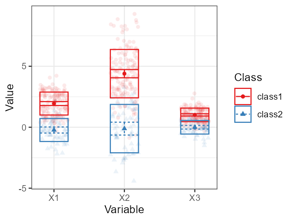
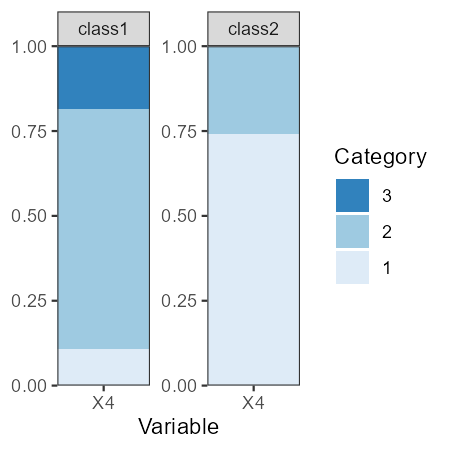

```{r, include = FALSE}
run_chunks <- requireNamespace("OpenMx", quietly = TRUE)
knitr::opts_chunk$set(
  collapse = TRUE,
  message = FALSE,
  eval = run_chunks,
  comment = "#>"
)

show_plots <- FALSE
if(suppressWarnings(tryCatch({isTRUE(as.logical(readLines("pkgdown.txt")))}, error = function(e){FALSE}))){
  show_plots <- TRUE
}
run_everything = suppressWarnings(tryCatch({isTRUE(as.logical(readLines("run_everything.txt")))}, error = function(e){FALSE}))
```

Latent class analysis for categorical indicators (LCA) and latent profile analysis for continuous indicators (LPA) are widely used
mixture modeling techniques for identifying unobserved subgroups in a
population. In practice, researchers often encounter **mixed data types**: a
combination of continuous, binary, and ordinal indicators.

Estimating such models was complicated in prior versions of `tidySEM`,
and often led to convergence issues.
The new function `mx_mixed_lca()`, introduced in `tidySEM` version `0.2.10`, provides a high-level interface to
estimate mixed-data latent class models.
At the same time, the function `mx_run()` was updated to use `mxTryHardOrdinal()` in case of convergence issues with ordinal categorical indicators,
which improves the estimation of mixed data LCAs.

This vignette demonstrates how to:

* Prepare mixed continuous and ordinal data
* Estimate mixed-data latent class models
* Fit multiple class solutions
* Inspect and interpret the resulting OpenMx models

## Requirements

The `mx_mixed_lca()` function relies on `OpenMx`. Make sure both packages are
installed and loaded.

```{r eval = run_chunks}
library(tidySEM)
library(OpenMx)
```

## Example Data

We simulate a dataset with:

* Three continuous indicators
* One ordinal indicator
* Two latent classes

```{r eval = run_chunks}
set.seed(10)
n <- 200

# Set class-specific means
class_means <- c(rep(0, floor(0.3 * n)),
rep(2, ceiling(0.7 * n)))

# Simulate continuous indicators
df <- rnorm(4 * n, mean = rep(class_means, 4))
df <- matrix(df, nrow = n)
df <- t(t(df) * c(1, 2, 0.5, 1))
df <- data.frame(df)
names(df) <- paste0("X", 1:4)

# Convert one indicator to ordinal
df$X4 <- cut(df$X4, breaks = 3, labels = FALSE)
df$X4 <- mxFactor(df$X4, levels = 1:3)
```


## Model Estimation with `mx_mixed_lca()`

<!-- The `mx_mixed_lca()` function estimates mixed-data latent class models using the -->
<!-- following procedure: -->

<!-- 1. Estimate an **Latent profile analysis (LPA)** for the continuous indicators using -->
<!--    `mx_profiles()` -->
<!-- 2. Use the **BCH method** to obtain starting values for ordinal indicators: the classes probabilities from step 1 are used to estimate thresholds for the remaining ordinal indicators. -->
<!-- 3. **Latent class analysis (LCA)** for ordinal indicators using `mx_lca()`, using the thresholds from step 2. as starting values. -->
<!-- 4. **Joint estimation** of continuous and ordinal indicators in a single model, using the results from steps 1. and 3. as starting values. -->

### Estimating a Single Class Solution

To estimate a 2-class mixed-data latent class model, use the following code:

```{r eval = run_chunks}
res_2 <- mx_mixed_lca(
data = df,
classes = 2
)
```

The returned object is an `OpenMx::mxModel`, and can be modified using the functions in that package:

```{r eval = run_chunks}
class(res_2)
```

## Estimating Multiple Class Solutions

A common workflow is to estimate several class solutions and compare model fit.
This can be done by passing a vector of class numbers.

```{r eval = FALSE}
res_1_3 <- mx_mixed_lca(
  data = df,
  classes = 1:3
)
```
```{r eval = run_everything, echo = FALSE}
res_1_3 <- mx_mixed_lca(
  data = df,
  classes = 1:3
)
```

The result is a list of OpenMx models, one for each class solution.

## Class Enumeration

As explained in Van Lissa, Garnier-Villareal, and Anadria (2023), there are several approaches to class enumeration.
The most straightforward best-practice approach is to examine the BIC fit index, and select the model with the lowest BIC.
This is obtained by inspecting model fit, by printing the object, or calling `table_fit(res_1_3)`:

```{r eval = FALSE}
table_fit(res_1_3)
```
```{r eval = run_everything, echo = FALSE}
tab <- table_fit(res_1_3)
write.csv(tab, "mixed_lca_table_fit.csv", row.names = FALSE)
```
```{r eval = TRUE, echo=FALSE}
tab <- read.csv("mixed_lca_table_fit.csv", stringsAsFactors = FALSE)
class(tab) <- c("tidy_fit"   , "data.frame")
tab
```

As expected, the BIC for the 2-class solution is lowest.
Note that the 3-class solution also has an extremely low ratio of cases to parameters,
so this model is most likely overfit.

Another best-practice approach to class enumeration is to perform the bootstrapped likelihood ratio test.
This gives a significance test, but takes a long time to run.
To accelerate computations, we can use the `future` package for parallel computing (see `?plan` to select the appropriate back-end for your system).
To track the function's progress,
we use the `progressr` ecosystem,
which allows users to choose how they want to be informed.
The example below uses a progress bar:

```{r eval = FALSE, echo = TRUE}
library(future)
library(progressr)
plan(multisession) # Parallel processing for Windows
handlers("progress") # Progress bar
set.seed(1)
res_blrt <- BLRT(res_1_3, replications = 100)
res_blrt
```
```{r eval = run_everything, echo = FALSE, warning=FALSE}
library(future)
library(progressr)
plan(multisession) # Parallel processing for Windows
handlers("progress") # Progress bar
set.seed(1)
res_blrt <- BLRT(res_1_3, replications = 100)
write.csv(res_blrt, "mixed_lca_res_blrt.csv", row.names = FALSE)
```

```{r eval = TRUE, echo = FALSE}
res_blrt <- read.csv("mixed_lca_res_blrt.csv", stringsAsFactors = FALSE)
class(res_blrt) <- c("LRT", "data.frame")
attr(res_blrt, "type") <- "Bootstrapped"
res_blrt
```


This test, too, confirms that the 2-class solution is significantly better than the 1-class solution - but the 3-class solution offers no further significant improvement.
Note that, by default, the BLRT conducts 100 bootstrapped analyses - but only some of these samples could be used to conduct the test, as the model did not converge in remaining iterations.

A third option is to use a predictive model comparison, a method conceptually similar to Bayesian posterior predictive checks.


```{r eval = run_everything, echo = FALSE}
set.seed(1)
res_pmc_srmr <- pmc_srmr(res_1_3)
write.csv(res_pmc_srmr, "mixed_lca_res_pmc_srmr.csv", row.names = F)
```
```{r echo = TRUE, eval = FALSE}
set.seed(1)
res_pmc_srmr <- pmc_srmr(res_1_3)
res_pmc_srmr
```
```{r echo = FALSE}
res_pmc_srmr <- read.csv("mixed_lca_res_pmc_srmr.csv", stringsAsFactors = F)
res_pmc_srmr
```

This test, too, confirms that the 2-class solution is significantly better than the 1-class solution - but the 3-class solution offers no further significant improvement.

## Examine Results

We can investigate the class proportions for the two-class solution by calling:

```{r eval = run_everything, echo = FALSE}
tmp <- class_prob(res_1_3[[2]], c("sum.posterior", "sum.mostlikely"))
write.csv(tmp$sum.posterior, "mixed_lca_posterior.csv", row.names = F)
write.csv(tmp$sum.mostlikely, "mixed_lca_mostlikely.csv", row.names = F)
```
```{r eval = FALSE, echo = TRUE}
class_prob(res_1_3[[2]], c("sum.posterior", "sum.mostlikely"))
```
```{r eval = TRUE, echo = FALSE}
list(sum.posterior = read.csv("mixed_lca_posterior.csv", stringsAsFactors = F), sum.mostlikely = read.csv("mixed_lca_mostlikely.csv", stringsAsFactors = F))
```

The sum.posterior class probabilities incorporate classification error; each case can (fractionally) contribute to multiple classes.

The sum.mostlikely class probabilities ignore classification error, assigning each case to the class it has the highest class probability for.

Note that, in this case, both correspond nicely to the simulated .3/.7 split. Thus, we should have good class discrimination.

This is confirmed by checking:

```{r eval = FALSE, echo = TRUE}
table_fit(res_1_3[[2]])
```
```{r eval = run_everything, echo = FALSE}
tmp <- table_fit(res_1_3[[2]])
write.csv(tmp, "mixed_lca_fit2.csv", row.names = F)
```
```{r eval = TRUE, echo = FALSE}
tmp <- read.csv("mixed_lca_fit2.csv", stringsAsFactors = F)
class(tmp) <- c("tidy_fit", "data.frame")
tmp
```

We have a high minimal- and maximal posterior classification probability, and a high entropy.

Finally, we can examine the parameter values using `table_results()` on the second element of the model list, or the 2-class model:

```{r eval = FALSE, echo = TRUE}
table_results(res_1_3[[2]])
```
```{r eval = run_everything, echo = FALSE}
tmp <- table_results(res_1_3[[2]])
write.csv(tmp, "mixed_lca_res2.csv", row.names = F)
```
```{r eval = TRUE, echo = FALSE}
tmp <- read.csv("mixed_lca_res2.csv", stringsAsFactors = F)
class(tmp) <- c("tidy_results","data.frame"  )
tmp
```

Note that we get free means for each class, with the variances constrained to be equal across classes.
For the categorical variable, we get thresholds:
These correspond to quartiles of a normal distribution.
For class 1, the probability of scoring within the first response category corresponds to `pnorm(-2.38, lower.tail = TRUE)`, or about 1%.
To convert these thresholds to the probability scale, we can run:


```{r eval = FALSE, echo = TRUE}
table_prob(res_1_3[[2]])
```
```{r eval = run_everything, echo = FALSE}
tmp <- table_prob(res_1_3[[2]])
write.csv(tmp, "mixed_lca_prob2.csv", row.names = F)
```
```{r eval = TRUE, echo = FALSE}
read.csv("mixed_lca_prob2.csv", stringsAsFactors = F)
```

## Advanced Options

Additional arguments can be passed via `...` and are forwarded to the underlying
model-building functions. For example,
you can release the variance constraints for
the continuous indicators by passing the `variances` argument of `mx_profiles()`:

```{r, eval = run_everything, echo = TRUE}
res_2_free <- mx_mixed_lca(
  data = df,
  classes = 2,
  variances = "varying"
)
```

We can compare the BICs of these models to determine whether the added complexity improves the model fit:

```{r, echo = TRUE, eval = FALSE}
compare <- list(
  fixed_covs = res_1_3[[2]],
  free_covs = res_2_free)
table_fit(compare)
```

```{r eval = run_everything, echo = FALSE}
compare <- list(
  fixed_covs = res_1_3[[2]],
  free_covs = res_2_free)
fit_compare <- table_fit(compare)
write.csv(fit_compare, "mixed_lca_compare.csv", row.names = FALSE)
```
```{r tabfitcomp, echo = FALSE, eval = TRUE}
fit_compare <- read.csv("mixed_lca_compare.csv", stringsAsFactors = FALSE)
class(fit_compare) <- c("tidy_fit", "data.frame")
fit_compare
```

Note that the BIC of the model with free covariances is higher than that of the model with fixed variances, so it fits worse.
This is as expected, because we did not simulate class-specific variances.

# Plotting the Model

The model can be plot with the usual functions, but note that categorical indicators will not look good in plots for continuous indicators, and could lead to errors.

Thus, for example, we can use a profile plot for the continuous indicators:

```{r eval = run_everything, echo = FALSE}
p <- plot_profiles(res_1_3[[2]], variables = c("X1", "X2", "X3"))
ggplot2::ggsave("mixed_lca_profiles.png", p, device = "png", width = 4, height = 3, dpi = 150)
```

```{r eval = FALSE, echo = TRUE}
plot_profiles(res_1_3[[2]], variables = c("X1", "X2", "X3"))
```
```{r eval = TRUE, echo = FALSE}

```

Alternatively, we can use a bivariate plot with densities:

```{r eval = run_everything, echo = FALSE}
p <- plot_bivariate(res_1_3[[2]], variables = c("X1", "X2", "X3"))
ggplot2::ggsave("mixed_lca_bivariate.png", p, device = "png", width = 4, height = 4, dpi = 150)
```

```{r eval = FALSE, echo = TRUE}
plot_bivariate(res_1_3[[2]], variables = c("X1", "X2", "X3"))
```
```{r eval = TRUE, echo = FALSE}
knitr::include_graphics("mixed_lca_bivariate.png")
```

We can plot the categorical variables as follows:

```{r eval = run_everything, echo = FALSE}
p <- plot_prob(res_1_3[[2]])
ggplot2::ggsave("mixed_lca_prob.png", p, device = "png", width = 3, height = 3, dpi = 150)
```

```{r eval = FALSE, echo = TRUE}
plot_prob(res_1_3[[2]])
```
```{r eval = TRUE, echo = FALSE}

```

## References

Van Lissa, C. J., Garnier-Villarreal, M., & Anadria, D. (2023).
*Recommended Practices in Latent Class Analysis using the Open-Source R-Package
tidySEM.* Structural Equation Modeling.
[https://doi.org/10.1080/10705511.2023.2250920](https://doi.org/10.1080/10705511.2023.2250920)
