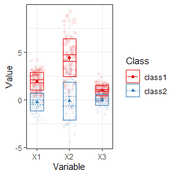
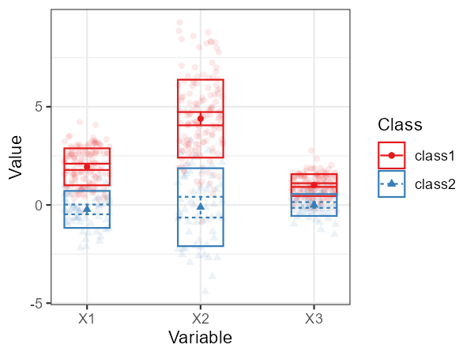
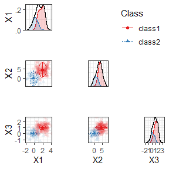
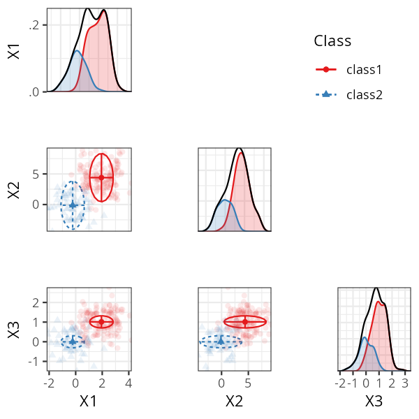
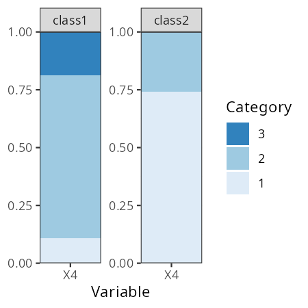

Latent class analysis for categorical indicators (LCA) and latent profile analysis for continuous indicators (LPA) are widely used
mixture modeling techniques for identifying unobserved subgroups in a
population. In practice, researchers often encounter **mixed data types**: a
combination of continuous, binary, and ordinal indicators.

Estimating such models was complicated in prior versions of `tidySEM`,
and often led to convergence issues.
The new function `mx_mixed_lca()`, introduced in `tidySEM` version `0.2.10`, provides a high-level interface to
estimate mixed-data latent class models.
At the same time, the function `mx_run()` was updated to use `mxTryHardOrdinal()` in case of convergence issues with ordinal categorical indicators,
which improves the estimation of mixed data LCAs.

This vignette demonstrates how to:

* Prepare mixed continuous and ordinal data
* Estimate mixed-data latent class models
* Fit multiple class solutions
* Inspect and interpret the resulting OpenMx models

## Requirements

The `mx_mixed_lca()` function relies on `OpenMx`. Make sure both packages are
installed and loaded.


``` r
library(tidySEM)
library(OpenMx)
```

## Example Data

We simulate a dataset with:

* Three continuous indicators
* One ordinal indicator
* Two latent classes


``` r
set.seed(10)
n <- 200

# Set class-specific means
class_means <- c(rep(0, floor(0.3 * n)),
rep(2, ceiling(0.7 * n)))

# Simulate continuous indicators
df <- rnorm(4 * n, mean = rep(class_means, 4))
df <- matrix(df, nrow = n)
df <- t(t(df) * c(1, 2, 0.5, 1))
df <- data.frame(df)
names(df) <- paste0("X", 1:4)

# Convert one indicator to ordinal
df$X4 <- cut(df$X4, breaks = 3, labels = FALSE)
df$X4 <- mxFactor(df$X4, levels = 1:3)
```


## Model Estimation with `mx_mixed_lca()`

<!-- The `mx_mixed_lca()` function estimates mixed-data latent class models using the -->
<!-- following procedure: -->

<!-- 1. Estimate an **Latent profile analysis (LPA)** for the continuous indicators using -->
<!--    `mx_profiles()` -->
<!-- 2. Use the **BCH method** to obtain starting values for ordinal indicators: the classes probabilities from step 1 are used to estimate thresholds for the remaining ordinal indicators. -->
<!-- 3. **Latent class analysis (LCA)** for ordinal indicators using `mx_lca()`, using the thresholds from step 2. as starting values. -->
<!-- 4. **Joint estimation** of continuous and ordinal indicators in a single model, using the results from steps 1. and 3. as starting values. -->

### Estimating a Single Class Solution

To estimate a 2-class mixed-data latent class model, use the following code:


``` r
res_2 <- mx_mixed_lca(
data = df,
classes = 2
)
#> 
MxComputeSimAnnealing(tsallis1996) evaluations 2862 fit 2619.33 change 362.8
MxComputeSimAnnealing(tsallis1996) evaluations 6940 fit 2237.18 change -2966
MxComputeSimAnnealing(tsallis1996) evaluations 10932 fit 2237.09 change -295.4
MxComputeSimAnnealing(tsallis1996) evaluations 14920 fit 2237.28 change 0.1923
                                                                              
```

The returned object is an `OpenMx::mxModel`, and can be modified using the functions in that package:


``` r
class(res_2)
#> [1] "MxModel"
#> attr(,"package")
#> [1] "OpenMx"
```

## Estimating Multiple Class Solutions

A common workflow is to estimate several class solutions and compare model fit.
This can be done by passing a vector of class numbers.


``` r
res_1_3 <- mx_mixed_lca(
  data = df,
  classes = 1:3
)
```

```
#> 
MxComputeSimAnnealing(tsallis1996) evaluations 3305 fit 3063.05 change 0
MxComputeSimAnnealing(tsallis1996) evaluations 7368 fit 2237.12 change -898.4
MxComputeSimAnnealing(tsallis1996) evaluations 11376 fit 2237.61 change -361.1
MxComputeSimAnnealing(tsallis1996) evaluations 15342 fit 2237.09 change -0.212
                                                                              
#> 
MxComputeSimAnnealing(tsallis1996) evaluations 2512 fit 2811.48 change 0
MxComputeSimAnnealing(tsallis1996) evaluations 5255 fit 2390.22 change -169.1
MxComputeSimAnnealing(tsallis1996) evaluations 7997 fit 2291.22 change -37.74
MxComputeSimAnnealing(tsallis1996) evaluations 10699 fit 2232.05 change -185.6
MxComputeSimAnnealing(tsallis1996) evaluations 13395 fit 2231.3 change -2.628 
MxComputeSimAnnealing(tsallis1996) evaluations 16084 fit 3178.53 change 915.4
MxComputeSimAnnealing(tsallis1996) evaluations 18771 fit 2230.84 change 0.04215
MxComputeSimAnnealing(tsallis1996) evaluations 21449 fit 2230.76 change -0.2183
MxComputeSimAnnealing(tsallis1996) evaluations 24123 fit 2230.76 change -0.0007996
                                                                                  
#> 
Beginning initial fit attempt
Fit attempt 0, fit=2230.74793595893, new current best! (was 2230.74793595893)
Beginning fit attempt 1 of at maximum 10 extra tries                         
MxComputeGradientDescent(SLSQP) evaluations 183 fit 2244.76 change -4.217
                                                                         

Beginning fit attempt 2 of at maximum 10 extra tries
Beginning fit attempt 3 of at maximum 10 extra tries
Beginning fit attempt 4 of at maximum 10 extra tries
Beginning fit attempt 5 of at maximum 10 extra tries
MxComputeGradientDescent(SLSQP) evaluations 1403 fit 2677.07 change -6.59e-05
                                                                             

Fit attempt 5, fit=2237.09546071394, worse than previous best (2230.74793595893)
Beginning fit attempt 6 of at maximum 10 extra tries                            
Beginning fit attempt 7 of at maximum 10 extra tries
Beginning fit attempt 8 of at maximum 10 extra tries
MxComputeGradientDescent(SLSQP) evaluations 2750 fit 2230.08 change -3.525e-06
                                                                              

Fit attempt 8, fit=2230.08267540371, new current best! (was 2230.74793595893)
Beginning fit attempt 9 of at maximum 10 extra tries                         
Fit attempt 9, fit=2230.08267394999, new current best! (was 2230.08267540371)
Beginning fit attempt 10 of at maximum 10 extra tries                        
Fit attempt 10, fit=2230.08493321593, worse than previous best (2230.08267394999)
Final run, for Hessian and/or standard errors and/or confidence intervals        
                                                                         
```

The result is a list of OpenMx models, one for each class solution.

## Class Enumeration

As explained in Van Lissa, Garnier-Villareal, and Anadria (2023), there are several approaches to class enumeration.
The most straightforward best-practice approach is to examine the BIC fit index, and select the model with the lowest BIC.
This is obtained by inspecting model fit, by printing the object, or calling `table_fit(res_1_3)`:


``` r
table_fit(res_1_3)
```


```
#>     Name Classes    LL   n Parameters  AIC  BIC saBIC Entropy prob_min prob_max n_min
#> 1  equal       1 -1251 200          8 2517 2543  2518    1.00     1.00     1.00 1.000
#> 2 equal1       2 -1119 200         14 2265 2311  2267    0.93     0.96     0.99 0.295
#> 3 equal2       3 -1115 200         20 2270 2336  2273    0.94     0.94     1.00 0.075
#>   n_max np_ratio np_local
#> 1  1.00       25     25.0
#> 2  0.70       14      9.1
#> 3  0.63       10      2.5
```

As expected, the BIC for the 2-class solution is lowest.
Note that the 3-class solution also has an extremely low ratio of cases to parameters,
so this model is most likely overfit.

Another best-practice approach to class enumeration is to perform the bootstrapped likelihood ratio test.
This gives a significance test, but takes a long time to run.
To accelerate computations, we can use the `future` package for parallel computing (see `?plan` to select the appropriate back-end for your system).
To track the function's progress,
we use the `progressr` ecosystem,
which allows users to choose how they want to be informed.
The example below uses a progress bar:


``` r
library(future)
library(progressr)
plan(multisession) # Parallel processing for Windows
handlers("progress") # Progress bar
set.seed(1)
res_blrt <- BLRT(res_1_3, replications = 100)
res_blrt
```


```
#> Bootstrapped Likelihood Ratio Test:
#> 
#>         null         alt  lr df blrt_p samples
#>  equal var 1 equal var 2 264  6   0.00      43
#>  equal var 2 equal var 3   7  6   0.31      11
```


This test, too, confirms that the 2-class solution is significantly better than the 1-class solution - but the 3-class solution offers no further significant improvement.
Note that, by default, the BLRT conducts 100 bootstrapped analyses - but only some of these samples could be used to conduct the test, as the model did not converge in remaining iterations.

A third option is to use a predictive model comparison, a method conceptually similar to Bayesian posterior predictive checks.


``` r
set.seed(1)
res_pmc <- pmc(res_1_3)
res_pmc
```

```
#>   comparison        null         alt null_stat alt_stat     lb     ub sig
#> 1    dif_seq equal var 1 equal var 2     0.469    0.069 -0.459 -0.328   *
#> 2    dif_seq equal var 2 equal var 3     0.069    0.057 -0.059  0.036    
#> 3    dif_one equal var 1 equal var 2     0.469    0.069 -0.459 -0.328   *
#> 4    dif_one equal var 1 equal var 3     0.469    0.057 -0.473 -0.351   *
```

This test, too, confirms that the 2-class solution is significantly better than the 1-class solution - but the 3-class solution offers no further significant improvement.

## Examine Results

We can investigate the class proportions for the two-class solution by calling:


``` r
class_prob(res_1_3[[2]], c("sum.posterior", "sum.mostlikely"))
```

```
#> $sum.posterior
#>    class count proportion
#> 1 class1   139        0.7
#> 2 class2    61        0.3
#> 
#> $sum.mostlikely
#>    class count proportion
#> 1 class1   141       0.70
#> 2 class2    59       0.29
```

The sum.posterior class probabilities incorporate classification error; each case can (fractionally) contribute to multiple classes.

The sum.mostlikely class probabilities ignore classification error, assigning each case to the class it has the highest class probability for.

Note that, in this case, both correspond nicely to the simulated .3/.7 split. Thus, we should have good class discrimination.

This is confirmed by checking:


``` r
table_fit(res_1_3[[2]])
```


```
#>   Minus2LogLikelihood   n Parameters observedStatistics  df RMSEASquared RMSEANull
#> 1                2237 200         14                800 786            0      0.05
#>     modelName  AIC  BIC saBIC Classes Entropy prob_min prob_max n_min n_max    LL
#> 1 equal var 2 2265 2311  2267       2    0.93     0.96     0.99  0.29   0.7 -1119
```

We have a high minimal- and maximal posterior classification probability, and a high entropy.

Finally, we can examine the parameter values using `table_results()` on the second element of the model list, or the 2-class model:


``` r
table_results(res_1_3[[2]])
```


```
#>                            label  est_sig       se pval               confint  class
#> 1                Means.X1.class1  1.94***     0.08 0.00          [1.78, 2.10] class1
#> 2                Means.X2.class1  4.39***     0.17 0.00          [4.05, 4.73] class1
#> 3                Means.X3.class1  1.01***     0.05 0.00          [0.92, 1.11] class1
#> 4            Variances.X1.class1  0.89***     0.09 0.00          [0.71, 1.07] class1
#> 5            Variances.X2.class1  3.94***     0.42 0.00          [3.12, 4.75] class1
#> 6            Variances.X3.class1  0.31***     0.03 0.00          [0.25, 0.37] class1
#> 7            Variances.X4.class1     1.00       NA   NA                  <NA> class1
#> 8  class1.Thresholds[1,1].class1 -1.24***     0.15 0.00        [-1.52, -0.95] class1
#> 9  class1.Thresholds[2,1].class1  0.89***     0.12 0.00          [0.65, 1.13] class1
#> 10               Means.X1.class2    -0.23     0.13 0.07         [-0.48, 0.02] class2
#> 11               Means.X2.class2    -0.11     0.27 0.67         [-0.64, 0.41] class2
#> 12               Means.X3.class2    -0.00     0.07 0.98         [-0.15, 0.14] class2
#> 13           Variances.X4.class2     1.00       NA   NA                  <NA> class2
#> 14 class2.Thresholds[1,1].class2  0.65***     0.18 0.00          [0.29, 1.01] class2
#> 15 class2.Thresholds[2,1].class2     7.11 35680.19 1.00 [-69924.78, 69939.01] class2
#> 16   equal var 2.weights[1,1].NA     1.00       NA   NA                  <NA>   <NA>
#> 17   equal var 2.weights[1,2].NA  0.43***     0.07 0.00          [0.30, 0.57]   <NA>
```

Note that we get free means for each class, with the variances constrained to be equal across classes.
For the categorical variable, we get thresholds:
These correspond to quartiles of a normal distribution.
For class 1, the probability of scoring within the first response category corresponds to `pnorm(-2.38, lower.tail = TRUE)`, or about 1%.
To convert these thresholds to the probability scale, we can run:


``` r
table_prob(res_1_3[[2]])
```


```
#>   Variable Category Probability  group
#> 1       X4        1     1.1e-01 class1
#> 2       X4        2     7.1e-01 class1
#> 3       X4        3     1.9e-01 class1
#> 4       X4        1     7.4e-01 class2
#> 5       X4        2     2.6e-01 class2
#> 6       X4        3     5.7e-13 class2
```

## Advanced Options

Additional arguments can be passed via `...` and are forwarded to the underlying
model-building functions. For example,
you can release the variance constraints for
the continuous indicators by passing the `variances` argument of `mx_profiles()`:


``` r
res_2_free <- mx_mixed_lca(
  data = df,
  classes = 2,
  variances = "varying"
)
#> 
MxComputeSimAnnealing(tsallis1996) evaluations 322 fit 2871.34 change -104.6
MxComputeSimAnnealing(tsallis1996) evaluations 4478 fit 2346.55 change 101.5
MxComputeSimAnnealing(tsallis1996) evaluations 8548 fit 2235.97 change -0.1498
MxComputeSimAnnealing(tsallis1996) evaluations 12575 fit 2240.24 change -155.6
MxComputeSimAnnealing(tsallis1996) evaluations 16571 fit 2239.7 change 3.758  
MxComputeSimAnnealing(tsallis1996) evaluations 20549 fit 2235.95 change -3.276
                                                                              
```

We can compare the BICs of these models to determine whether the added complexity improves the model fit:


``` r
compare <- list(
  fixed_covs = res_1_3[[2]],
  free_covs = res_2_free)
table_fit(compare)
```


```
#>         Name Classes    LL   n Parameters  AIC  BIC saBIC Entropy prob_min prob_max
#> 1 fixed_covs       2 -1119 200         14 2265 2311  2267    0.93     0.96     0.99
#> 2  free_covs       2 -1118 200         17 2270 2326  2272    0.94     0.97     0.99
#>   n_min n_max np_ratio np_local
#> 1  0.29   0.7       14      9.1
#> 2  0.29   0.7       12      7.4
```

Note that the BIC of the model with free covariances is higher than that of the model with fixed variances, so it fits worse.
This is as expected, because we did not simulate class-specific variances.

# Plotting the Model

The model can be plot with the usual functions, but note that categorical indicators will not look good in plots for continuous indicators, and could lead to errors.

Thus, for example, we can use a profile plot for the continuous indicators:

<!-- -->


``` r
plot_profiles(res_1_3[[2]], variables = c("X1", "X2", "X3"))
```
<!-- -->

Alternatively, we can use a bivariate plot with densities:

<!-- -->


``` r
plot_bivariate(res_1_3[[2]], variables = c("X1", "X2", "X3"))
```
<!-- -->

We can plot the categorical variables as follows:


``` r
plot_prob(res_1_3[[2]])
```
<!-- -->

## References

Van Lissa, C. J., Garnier-Villarreal, M., & Anadria, D. (2023).
*Recommended Practices in Latent Class Analysis using the Open-Source R-Package
tidySEM.* Structural Equation Modeling.
[https://doi.org/10.1080/10705511.2023.2250920](https://doi.org/10.1080/10705511.2023.2250920)
