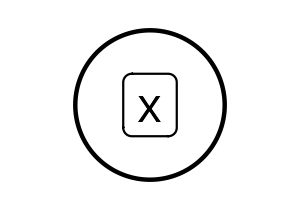
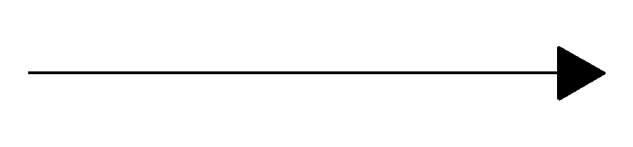
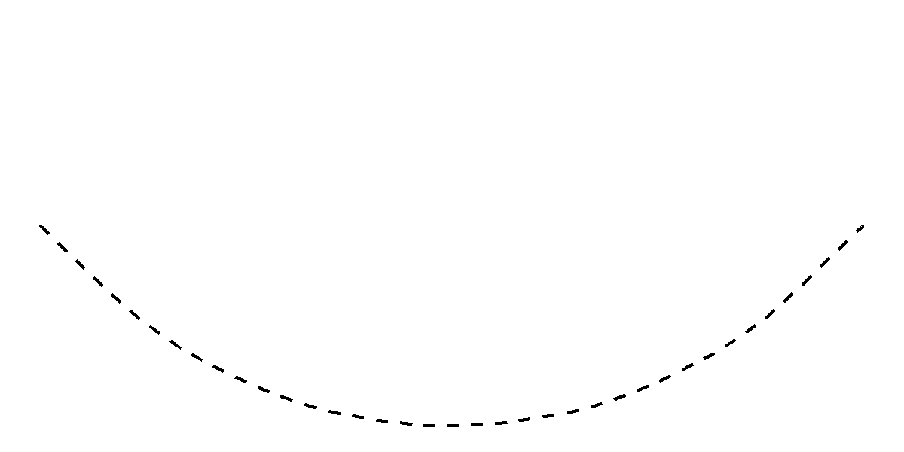
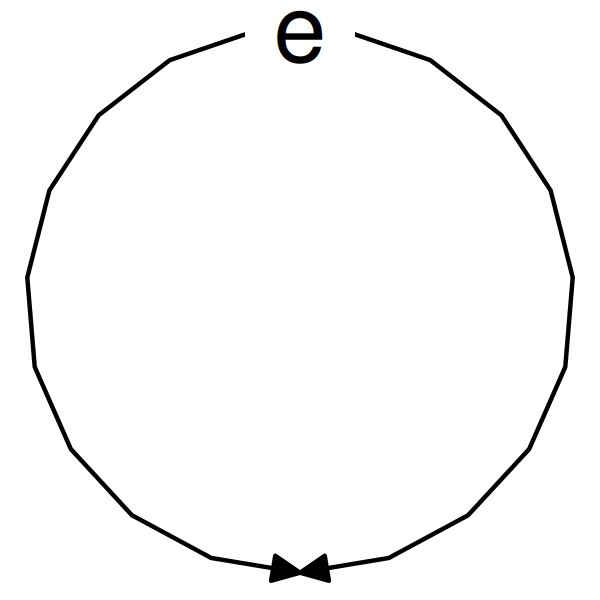
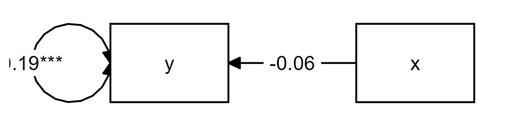
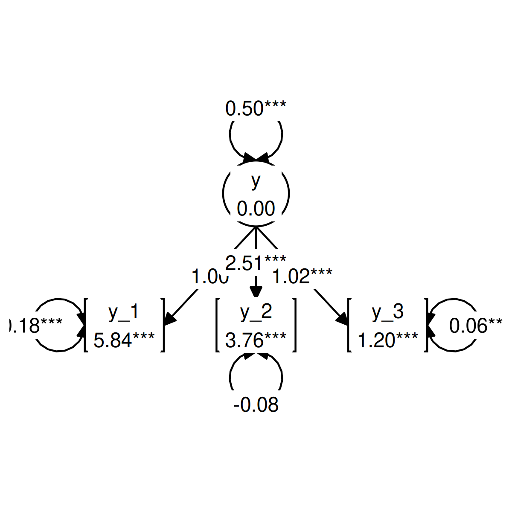
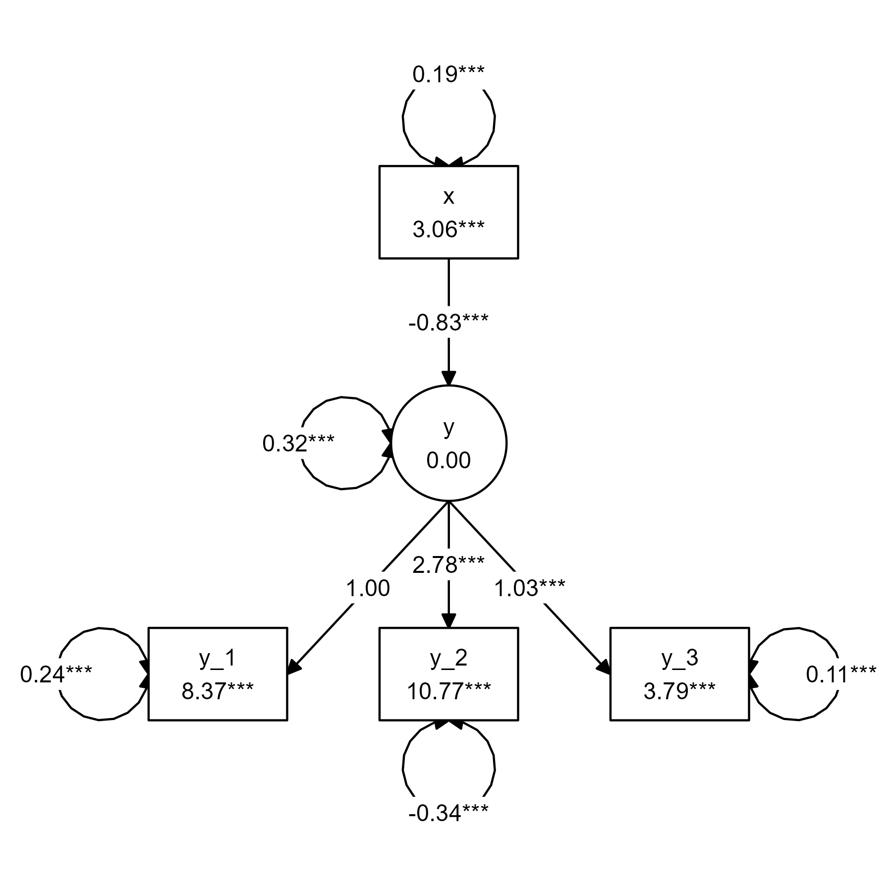
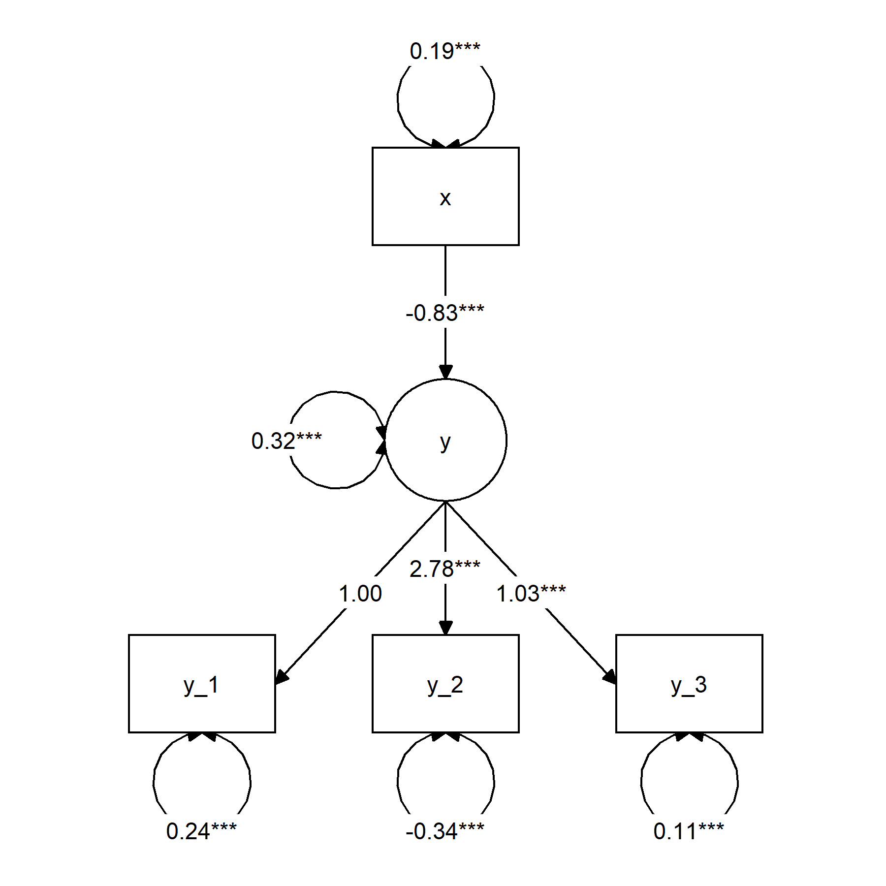

```{r, include = FALSE}
knitr::opts_chunk$set(
  collapse = TRUE,
  comment = "#>"
)
library(tidySEM)
library(lavaan)
library(dplyr)
library(ggplot2)
include_code <- function(expr){
  txt <- deparse(substitute(expr))
  eval.parent(expr)
  cat(c("``` r", txt, "```"), sep = "\n")
}
generate_pngs <- TRUE
```

Structural equation modeling (SEM) uses some conventions to graph models visually.
This vignette provides a brief introduction into the conventions of this
visual language.
This will help you understand the graphs generated by `tidySEM`,
and generate your own SEM graphs in a way that others will understand.

First, let me introduce the visual elements of SEM graphs.

## Nodes

Nodes are the "shapes" in a graph. In SEM graphs, we use nodes to indicate variables.

#### Observed variables

An observed variable is a measured quantity; you have "real data" about this variable. Usually, you will have a column for this variable in the spreadsheet with your raw data. Observed variables are also called measured variables or indicators. Visually, we indicate observed variables as rectangles:

```{r, echo = TRUE, eval = FALSE}
graph_sem(layout = matrix("x")) + coord_fixed()
```

```{r echo = FALSE, out.width='20%'}
p <- graph_sem(layout = matrix("x")) + coord_fixed()
if(generate_pngs) ggsave("var_obs.png", p, device = "png", width= 1, height = .7)
knitr::include_graphics("var_obs.png")
```

#### Latent variables

A latent variable is something that exists (according to your theory),
but that you did not measure directly.
There is no column in the data for this variable.
Still, SEM allows us to model such latent variables.
Latent variables are also called "unobserved" variables.
Visually, we indicate them as ovals or circles:

```{r, echo = TRUE, eval = FALSE}
graph_sem(nodes = data.frame(name = "x", shape = "oval"), layout = matrix("x"), fix_coord = TRUE)
```
```{r echo = FALSE, out.width='20%'}
p <- graph_sem(nodes = data.frame(name = "x", shape = "oval"), layout = matrix("x"), fix_coord = TRUE)
if(generate_pngs) ggsave("var_lat.png", p, device = "png", width= 1, height = .7)

```

## Edges

Edges refer to the connections between nodes. In SEM graphs, we use edges to specify relationships between variables.

#### Regression effects

A regression effect indicates that one variable has a causal effect on another variable.
Note that the term "causal" reflects an assumption,
not a conclusion.
So if you specify a regression effect between `x` and `y`,
you are effectively saying "I assume that `x` causes `y`".
Regression effects are also called "paths", "directional effects", and "factor loadings".
In SEM graphs, we represent regression effects as single-headed arrows:

```{r echo = FALSE, out.width='20%'}
p <- ggplot(data.frame(x = 1, y = 1, xend = 4, yend = 1), aes(x=x, y=y,xend=xend, yend=yend)) +geom_segment(arrow = arrow(type = "closed"))+theme_void()
if(generate_pngs) ggsave("arrow.png", p, device = "png", width= 3, height = .7)

```

#### Covariances

If (you assume that) two variables are associated,
but you have no causal theory about directional effects between them,
then you can represent this association as a covariance.
The term covariance might be somewhat unfamiliar,
but a covariance is just an unstandardized correlation.
Covariances will also be referred to as "correlations" (when a graph depicts standardized coefficients), "undirected associations", or "unexplained associations".
Visually, we indicate covariances as curved (dashed) lines without arrowheads:

```{r echo = FALSE, out.width='20%'}
p <- ggplot(data.frame(x = 1, y = 1, xend = 2, yend = 1), aes(x=x, y=y,xend=xend, yend=yend)) + geom_curve(linetype = 2)+theme_void()+scale_y_continuous(limits = c(0,2))
if(generate_pngs) ggsave("curve.png", p, device = "png", width= 4, height = 2)

```

#### (Residual) variances

Variables often have a variance, and in SEM we can represent this variance as a double-headed arrow that points from a variable to itself. However, this is a simplification.
When a variable is endogenous (on the receiving end of one or more causal effects),
it gains an additional latent variable predictor known as an "error term";
a latent variable with a loading of 1 and a mean of 0.
The variance of this error term represents the "error variance",
also known as "residual variance" or "unexplained variance".
In `tidySEM`, all error terms are omitted, and all variances (including error variances)
are displayed as double-headed arrows. This is a stylistic decision.
Error variances are displayed like this:

```{r echo = FALSE, out.width='10%'}
if(generate_pngs){
  p <- tidySEM:::.plot_variances(p = ggplot(NULL), df = data.frame(edge_xmin = 1, edge_ymin = 1,
                                                   edge_xmax = 1, edge_ymax = 1,
                                                   connect_from = "top",
                                                   connect_to = "top", label = "e",
                                                   arrow = "both"), diameter = 1,
                          text_size = 8)+theme_void()
  ggsave("error.png", p, device = "png", width= 2, height = 2)
} 

```

## Basic models

Using these basic components, we can specify basic models.
There are two basic models that SEM models are composed of: *path models* and 
*measurement models*.

#### Path models

A path model specifies regression effects between two or more (observed) variables
Let's start with something very simple:
Linear bivariate regression.
I'm showing the code, so you can reproduce this example for yourself.
In this model, the variable x predicts the variable y:

```{r echo = TRUE, eval = FALSE}
df <- iris[, 1:2]
names(df) <- c("x", "y")
sem("y ~ x", df) %>%
  graph_sem(spacing_x = 2.5, fix_coord = TRUE)
```
```{r echo = FALSE, out.width='50%'}
df <- iris[, 1:2]
names(df) <- c("x", "y")
sem("y ~ x", df) %>%
  graph_sem(spacing_x = 2.5, fix_coord = TRUE) -> p
if(generate_pngs) ggsave("mod_reg.png", p, device = "png", width= 4, height = 1)

```


In this graph, we see the observed variables `x` and `y` represented as rectangles.
We see the regression effect represented as a single-headed arrow,
and we see the variances represented as double-headed arrows.
Note that the variance on the left is just the variance of the observed variable, 
whereas the variance on the right is actually the residual variance.

#### Measurement model

As mentioned before, a latent variable is something that exists (according to your theory),
but that you did not measure directly.
Even if you did not measure a latent variable directly,
SEM allows us define latent variables in terms of their theoretical effect on observed variables.
In other words, we can specify that a latent variable exists,
and that it causes some of the variance in our observed indicator variables. 
A model that defines a latent variable by reference to one or more observed indicators
is known as a "measurement model", or alternatively, as a "confirmatory factor analysis" (CFA) model.
Here is an example:

```{r echo = TRUE, eval=FALSE}
df <- iris[ , c(1,3:4)]
names(df) <- paste0("y_", 1:3)

tidy_sem(df) %>%
  measurement() %>%
  estimate_lavaan() %>%
  graph_sem()
```
```{r echo = FALSE, warning = FALSE, message = FALSE, out.width='50%'}
df <- iris[ , c(1,3:4)]
names(df) <- paste0("y_", 1:3)

tidy_sem(df) %>%
  measurement() %>%
  estimate_lavaan() %>%
  graph_sem(fix_coord = TRUE) -> p
if(generate_pngs) ggsave("mod_meas.png", p, device = "png", width= 4, height = 4)

```

We see that the model defines a latent variable `y`, with mean fixed to `0` and variance fixed to `1`, which has a causal effect on the three indicators.
The paths from the latent variable to the indicators are called *factor loadings*,
and they are interpreted as regression coefficients.
Thus: If you go up by one unit on the latent variable `y`, then you go up by `.71` units on `y_1`, and by `1.78` units on `y_2`, et cetera.

## Structural equation models

A structural equation model combines the path model and the measurement model. 
Thus, a structural equation model is a path model with some latent variables.

Here is a simple example:

```{r eval= FALSE}
df <- iris[ , 1:4]
names(df) <- c("y_1", "x", "y_2", "y_3")

tidy_sem(df) %>%
  measurement() %>%
  add_paths(y ~ x, x ~~ x, x ~1) %>%
  estimate_lavaan() %>%
  graph_sem()
```
```{r echo = FALSE, warning = FALSE, message = FALSE, out.width='70%'}
df <- iris[ , 1:4]
names(df) <- c("y_1", "x", "y_2", "y_3")
set.seed(58)
tidy_sem(df) %>%
  measurement() %>%
  add_paths(y ~ x, x ~~ x, x ~1) %>%
  estimate_lavaan() %>%
  graph_sem(fix_coord = TRUE) -> p
if(generate_pngs) ggsave("mod_sem1.png", p, device = "png", width= 6, height = 6)

```


Instead of having an observed variable `x` predicting an observed variable `y`, we now have it predicting a latent variable `y`. 
This is one of the simplest possible structural equation models,
but models of arbitrary complexity can be built using the same elements.

Incidentally, we can define a more pleasing layout for the model above using the `get_layout()` function:

```{r eval= FALSE}
tidy_sem(df) %>%
  measurement() %>%
  add_paths(y ~ x, x ~~ x) %>%
  estimate_lavaan() %>%
  graph_sem(layout =
              get_layout("",     "x",    "",
                         "",     "y",    "",
                         "y_1", "y_2", "y_3", rows = 3))
```
```{r echo = FALSE, warning = FALSE, message = FALSE, out.width='70%'}
tidy_sem(df) %>%
  measurement() %>%
  add_paths(y ~ x, x ~~ x) %>%
  estimate_lavaan() %>%
  graph_sem(layout =
              get_layout("",     "x",    "",
                         "",     "y",    "",
                         "y_1", "y_2", "y_3", rows = 3), fix_coord = TRUE) -> p
if(generate_pngs) ggsave("mod_sem2.png", p, device = "png", width= 6, height = 6)

```

For more on customizing SEM graphs, see the [vignette about making graphs](https://cjvanlissa.github.io/tidySEM/articles/Plotting_graphs.html).
